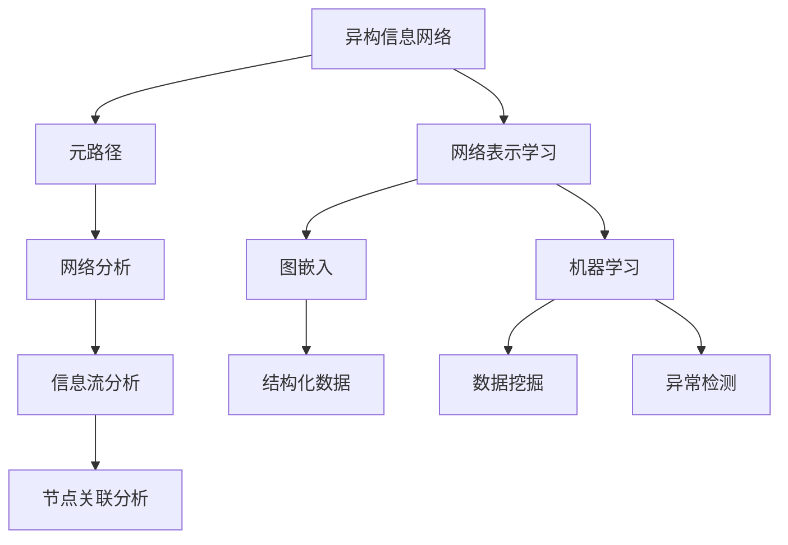

                 

# 基于元路径的异构信息网络表示学习

> 关键词：异构信息网络,元路径,网络表示学习,图嵌入,结构化数据

## 1. 背景介绍

### 1.1 问题由来

在当前信息爆炸的时代，人们获取到的信息不再局限于传统的文本、图像等单一类型的格式，而是越来越多地涉及多个不同类型的数据源，如文本、图像、音频、视频等。这些数据源的异构性，使得数据的理解和处理变得更加复杂，传统的基于单一类型数据的处理模型难以应对这种多样化、多模态数据的挑战。

例如，社交网络中的用户关系、商品推荐中的用户行为、知识图谱中的实体和关系等，都是具有多模态特征的复杂网络数据。对于这些复杂的网络数据，如何构建有效的表示学习模型，从中提取有价值的结构信息，成为当前信息抽取和分析的重要课题。

### 1.2 问题核心关键点

面对异构信息网络的复杂性，元路径分析成为了一种重要的方法。元路径分析是指对网络中的不同节点和边进行多角度的分析和统计，提取出不同的元路径，从而揭示网络中存在的潜在结构信息。这些元路径提供了网络中不同节点之间的交互关系和信息流动的规律，可以用于指导模型的训练和推理，从而提高模型的性能和泛化能力。

元路径分析的核心在于如何构建、选择和利用这些元路径。本文将从理论到实践，系统介绍基于元路径的异构信息网络表示学习方法，探索如何通过元路径的分析和利用，构建有效的网络表示学习模型，提升模型对复杂异构网络数据的理解和处理能力。

## 2. 核心概念与联系

### 2.1 核心概念概述

为更好地理解基于元路径的异构信息网络表示学习方法，本节将介绍几个关键的概念：

- **异构信息网络（Heterogeneous Information Network, HIN）**：指由不同类型的节点和边构成的网络结构，如社交网络中的用户-关系-用户、商品推荐中的用户-行为-商品等。

- **元路径（Metapath）**：指网络中不同节点之间的一条路径，如“用户-关系-商品”路径。元路径揭示了网络中不同节点之间的交互关系和信息流动规律。

- **网络表示学习（Network Embedding）**：指从网络数据中学习出每个节点的低维表示，以便用于网络分析和机器学习任务。

- **图嵌入（Graph Embedding）**：指将图结构中的节点和边映射到低维向量空间，以便于模型的训练和推理。

- **结构化数据（Structured Data）**：指具有特定格式和结构的数据，如表格、图结构等。结构化数据有助于模型的高效处理和分析。

这些核心概念之间的逻辑关系可以通过以下Mermaid流程图来展示：



这个流程图展示了异构信息网络表示学习的主要过程和相关概念之间的联系：

1. 异构信息网络提供数据结构和源数据。
2. 元路径揭示了网络中不同节点之间的交互关系和信息流动规律。
3. 网络表示学习将节点和边映射到低维向量空间，便于模型训练和推理。
4. 图嵌入将图结构中的节点和边映射到向量空间，以便高效处理。
5. 结构化数据提供了网络结构和信息的基本框架，有助于模型的构建。
6. 网络分析揭示了网络中不同节点之间的关系和结构。
7. 信息流分析研究了节点之间的信息流动规律。
8. 节点关联分析探究了节点之间的交互关系。
9. 机器学习任务利用网络表示进行模型训练和预测。
10. 数据挖掘和异常检测等任务通过网络表示发现网络中的潜在结构和异常信息。

这些概念共同构成了异构信息网络表示学习的核心框架，使得我们能够高效地处理和分析复杂网络数据。

## 3. 核心算法原理 & 具体操作步骤
### 3.1 算法原理概述

基于元路径的异构信息网络表示学习方法，旨在通过分析不同元路径，提取网络中的结构信息，构建有效的网络表示学习模型。其核心思想是：通过元路径分析，将异构网络中不同类型的节点和边，映射到低维向量空间，使得模型能够更准确地捕捉网络中的关系和结构特征，从而提升模型的性能和泛化能力。

形式化地，假设异构信息网络 $G=(V,E)$，其中 $V$ 为节点集合，$E$ 为边集合。定义节点 $v_i$ 与边 $e_j$ 之间的关系为 $(v_i,e_j)$，其中 $v_i \in V$ 为节点，$e_j \in E$ 为边。元路径 $\pi$ 定义为从节点 $v_i$ 出发，经过 $k$ 个边，到达节点 $v_f$ 的路径。我们通过统计和分析不同的元路径，提取出网络中的结构信息，构建网络表示学习模型。

### 3.2 算法步骤详解

基于元路径的异构信息网络表示学习方法，一般包括以下几个关键步骤：

**Step 1: 构建元路径**

- 分析异构信息网络 $G=(V,E)$，选择不同的元路径 $\pi$。元路径的选择应考虑网络中不同节点和边的特点，如社交网络中的“用户-关系-用户”路径，商品推荐中的“用户-行为-商品”路径等。

**Step 2: 提取结构特征**

- 对选定的元路径进行统计和分析，提取出网络中的结构特征。例如，统计“用户-关系-用户”路径上的“关系数量”、“关系类型”、“用户序列”等特征。

**Step 3: 定义损失函数**

- 根据提取的结构特征，定义网络表示学习的损失函数。常用的损失函数包括均方误差（MSE）、交叉熵（Cross-Entropy）、负对数似然（Negative Log-Likelihood）等。

**Step 4: 训练模型**

- 使用优化算法（如随机梯度下降、Adam等）最小化损失函数，训练网络表示学习模型。

**Step 5: 推理与评估**

- 使用训练好的模型对新数据进行推理，评估模型的性能和泛化能力。

### 3.3 算法优缺点

基于元路径的异构信息网络表示学习方法，具有以下优点：

- 灵活性高。元路径分析提供了多种选择，可以针对不同类型的网络数据，构建最合适的表示学习模型。
- 泛化能力强。通过元路径分析，模型能够学习到网络中不同节点之间的复杂交互关系，提升模型的泛化能力。
- 鲁棒性强。不同元路径的组合使用，可以降低模型对单一路径的依赖，增强模型的鲁棒性。

但同时，该方法也存在一定的局限性：

- 数据复杂度高。异构信息网络的复杂性增加了数据分析的难度，需要更多的统计和分析工作。
- 路径选择难度大。元路径的选择和统计需要一定的经验和专业知识，且可能影响模型的性能。
- 训练成本高。由于元路径的复杂性，网络表示学习的训练过程可能较慢，需要更多的计算资源。

### 3.4 算法应用领域

基于元路径的异构信息网络表示学习方法，在多个领域得到了广泛的应用，具体如下：

- **社交网络分析**：通过分析“用户-关系-用户”路径，提取用户之间的关系和影响，用于社交网络中的推荐和关系挖掘。
- **商品推荐系统**：通过分析“用户-行为-商品”路径，提取用户对商品的行为模式，用于推荐系统中的商品推荐。
- **知识图谱构建**：通过分析“实体-关系-实体”路径，提取知识图谱中的实体和关系，用于知识图谱的构建和关系推理。
- **医学知识网络分析**：通过分析“医生-疾病-药物”路径，提取医生、疾病、药物之间的关系，用于医学领域的知识发现和决策支持。
- **金融风险评估**：通过分析“用户-交易-交易”路径，提取用户交易行为和风险信息，用于金融风险评估和信用评级。

以上领域展示了元路径分析在异构信息网络表示学习中的广泛应用，为解决复杂网络数据中的关系和结构问题提供了重要的方法。

## 4. 数学模型和公式 & 详细讲解 & 举例说明

### 4.1 数学模型构建

本节将使用数学语言对基于元路径的异构信息网络表示学习过程进行更加严格的刻画。

假设异构信息网络 $G=(V,E)$，其中 $V$ 为节点集合，$E$ 为边集合。定义节点 $v_i$ 与边 $e_j$ 之间的关系为 $(v_i,e_j)$，其中 $v_i \in V$ 为节点，$e_j \in E$ 为边。元路径 $\pi$ 定义为从节点 $v_i$ 出发，经过 $k$ 个边，到达节点 $v_f$ 的路径。

定义节点 $v_i$ 的嵌入向量为 $\boldsymbol{u}_i \in \mathbb{R}^{d}$，边 $e_j$ 的嵌入向量为 $\boldsymbol{w}_j \in \mathbb{R}^{d}$。

网络表示学习的目标是最小化损失函数 $\mathcal{L}(\boldsymbol{u},\boldsymbol{w})$，使得模型能够准确地预测网络中的关系和结构特征。

### 4.2 公式推导过程

以下我们以社交网络中的“用户-关系-用户”元路径为例，推导网络表示学习的损失函数及其梯度的计算公式。

假设社交网络中存在两个用户 $u_i$ 和 $u_j$，之间存在一条“关系”边 $r_{ij}$。我们需要构建一个模型，能够预测这两个用户之间的关系。

定义节点嵌入矩阵 $\boldsymbol{U} \in \mathbb{R}^{N \times d}$，其中 $N$ 为节点数，$d$ 为节点嵌入向量的维度。边嵌入矩阵 $\boldsymbol{W} \in \mathbb{R}^{M \times d}$，其中 $M$ 为边数。

根据元路径“用户-关系-用户”，构建关系预测模型 $\hat{y}$，如：

$$
\hat{y} = \boldsymbol{w}_j^T \boldsymbol{u}_i \cdot \boldsymbol{u}_j
$$

其中 $\boldsymbol{w}_j$ 为边 $e_j$ 的嵌入向量，$\boldsymbol{u}_i$ 和 $\boldsymbol{u}_j$ 分别为节点 $v_i$ 和 $v_j$ 的嵌入向量。

定义损失函数 $\mathcal{L}(\boldsymbol{u},\boldsymbol{w})$ 为：

$$
\mathcal{L}(\boldsymbol{u},\boldsymbol{w}) = \frac{1}{N} \sum_{i=1}^N \sum_{j \in \mathcal{N}(i)} \mathcal{L}_{ij}
$$

其中 $\mathcal{N}(i)$ 为节点 $v_i$ 的邻居节点集合，$\mathcal{L}_{ij}$ 为节点 $v_i$ 和 $v_j$ 之间的关系损失，可定义为：

$$
\mathcal{L}_{ij} = \log \sigma(-y \cdot (\boldsymbol{w}_j^T \boldsymbol{u}_i \cdot \boldsymbol{u}_j)) + (1-y) \log (1-\sigma(-y \cdot (\boldsymbol{w}_j^T \boldsymbol{u}_i \cdot \boldsymbol{u}_j))
$$

其中 $y$ 为节点 $v_i$ 和 $v_j$ 之间的关系标签（0或1），$\sigma$ 为 sigmoid 函数，用于计算预测值与真实值之间的差距。

根据链式法则，损失函数对节点嵌入 $\boldsymbol{u}_i$ 的梯度为：

$$
\frac{\partial \mathcal{L}(\boldsymbol{u},\boldsymbol{w})}{\partial \boldsymbol{u}_i} = \frac{1}{N} \sum_{i=1}^N \sum_{j \in \mathcal{N}(i)} \frac{\partial \mathcal{L}_{ij}}{\partial \boldsymbol{u}_i}
$$

其中 $\frac{\partial \mathcal{L}_{ij}}{\partial \boldsymbol{u}_i}$ 可进一步递归展开，利用自动微分技术完成计算。

在得到损失函数的梯度后，即可带入优化算法，完成模型的迭代优化。重复上述过程直至收敛，最终得到适应网络表示学习任务的最优模型参数。

### 4.3 案例分析与讲解

假设我们有一个包含多个用户和关系的社交网络数据集，目标是预测用户之间的关系。具体步骤如下：

1. 数据预处理：对数据进行清洗和转换，构建社交网络的图结构，提取元路径“用户-关系-用户”。

2. 构建模型：定义节点嵌入矩阵 $\boldsymbol{U} \in \mathbb{R}^{N \times d}$ 和边嵌入矩阵 $\boldsymbol{W} \in \mathbb{R}^{M \times d}$，选择损失函数 $\mathcal{L}(\boldsymbol{u},\boldsymbol{w})$，使用优化算法（如AdamW、SGD等）进行训练。

3. 模型评估：在测试集上评估模型的预测精度，对比微调前后的效果提升。

4. 应用场景：利用微调后的模型对新的社交网络数据进行关系预测，优化用户推荐、社区构建等业务流程。

在实践中，可以使用PyTorch等深度学习框架，结合Graph Neural Network（GNN）等方法，构建网络表示学习模型。具体代码实现可以参考开源项目GraphSAGE、GAT等，其中GNN在网络表示学习中的表现优异，可以进一步提升模型性能。

## 5. 项目实践：代码实例和详细解释说明
### 5.1 开发环境搭建

在进行异构信息网络表示学习的项目实践前，我们需要准备好开发环境。以下是使用Python进行PyTorch开发的环境配置流程：

1. 安装Anaconda：从官网下载并安装Anaconda，用于创建独立的Python环境。

2. 创建并激活虚拟环境：
```bash
conda create -n graph-env python=3.8 
conda activate graph-env
```

3. 安装PyTorch：根据CUDA版本，从官网获取对应的安装命令。例如：
```bash
conda install pytorch torchvision torchaudio cudatoolkit=11.1 -c pytorch -c conda-forge
```

4. 安装相关库：
```bash
pip install networkx pygsp torch-scatter pytorch-geometric
```

5. 安装各类工具包：
```bash
pip install numpy pandas scikit-learn matplotlib tqdm jupyter notebook ipython
```

完成上述步骤后，即可在`graph-env`环境中开始项目实践。

### 5.2 源代码详细实现

这里我们以社交网络中的“用户-关系-用户”元路径为例，使用GraphSAGE构建网络表示学习模型。

```python
import torch
import torch.nn as nn
import torch.optim as optim
from torch_geometric.nn import GraphSAGE
from torch_geometric.datasets import Planetoid

# 加载社交网络数据
dataset = Planetoid(root='data', name='Cora')
features, labels = dataset.features, dataset.labels

# 定义节点嵌入矩阵
num_nodes, dim = features.size(0), 16

# 定义边嵌入矩阵
num_edges = features.size(0) * 2  # 每条边包含两个节点
dim = 16

# 构建GraphSAGE模型
model = GraphSAGE(num_nodes, dim, layers=[2, 2], heads=[8, 8], dropout=0.5)

# 定义损失函数
criterion = nn.BCELoss()

# 定义优化器
optimizer = optim.Adam(model.parameters(), lr=0.01)

# 训练过程
for epoch in range(10):
    model.train()
    optimizer.zero_grad()
    output = model(features, adj_t)  # adj_t为邻居节点的集合
    loss = criterion(output, labels)
    loss.backward()
    optimizer.step()
```

上述代码中，我们使用了GraphSAGE模型，这是一种基于GNN的网络表示学习模型，可以处理异构图结构。在训练过程中，我们使用了BCELoss损失函数和Adam优化器，通过迭代优化模型参数，最小化损失函数。

### 5.3 代码解读与分析

让我们再详细解读一下关键代码的实现细节：

**GraphSAGE类**：
- 定义了一个GraphSAGE模型，用于处理社交网络中的节点和边数据。

**节点嵌入和边嵌入**：
- 定义了节点嵌入矩阵 $\boldsymbol{U} \in \mathbb{R}^{N \times d}$ 和边嵌入矩阵 $\boldsymbol{W} \in \mathbb{R}^{M \times d}$，其中 $N$ 为节点数，$M$ 为边数，$d$ 为节点嵌入向量的维度。

**模型训练**：
- 使用Adam优化器最小化损失函数，更新模型参数。

**数据预处理**：
- 使用了Planetoid数据集，包含多个社交网络数据集，如Cora、PubMed等。这些数据集已经预处理成图结构，方便模型的训练。

在实践中，可以使用各种图嵌入方法，如GAT、GraphIsomorphicNetwork等，根据具体任务选择最合适的模型。同时，还需要对数据进行预处理，如特征归一化、邻接矩阵构建等，以提升模型训练的效果。

## 6. 实际应用场景
### 6.1 社交网络分析

基于元路径的异构信息网络表示学习方法，可以广泛应用于社交网络分析。社交网络中存在多种类型的节点和边，如用户-关系-用户、用户-评论-用户等，通过元路径分析，可以揭示不同节点和边之间的交互关系和信息流动规律。

例如，在社交网络中，可以使用“用户-关系-用户”路径，预测用户之间的关系，用于社交网络中的推荐和关系挖掘。在推荐系统中，可以根据用户之间的关系，推荐相关的用户或内容，提升用户的参与度和满意度。

### 6.2 商品推荐系统

在商品推荐系统中，用户的购买行为、评分记录、评价内容等构成了复杂的异构图结构，可以使用“用户-行为-商品”路径，提取用户对商品的行为模式，用于商品推荐。通过分析用户的行为，预测用户对商品的兴趣和购买意愿，实现个性化的商品推荐。

此外，还可以使用“用户-评论-商品”路径，提取用户对商品的评价信息，用于商品评分和评论分析，提升商品的质量和推荐效果。

### 6.3 知识图谱构建

知识图谱是由实体、关系和属性构成的图结构，可以使用“实体-关系-实体”路径，提取知识图谱中的实体和关系，用于知识图谱的构建和关系推理。通过分析实体之间的关系，构建更加全面、准确的知识图谱，用于知识发现、实体识别和关系推理等任务。

例如，在医学领域，可以使用“医生-疾病-药物”路径，提取医生、疾病、药物之间的关系，用于医学领域的知识发现和决策支持。通过分析医生对疾病的治疗方案和药物的选择，为医生提供辅助决策，提高医疗服务质量。

### 6.4 金融风险评估

金融领域的数据通常具有复杂性和异构性，可以使用“用户-交易-交易”路径，提取用户交易行为和风险信息，用于金融风险评估和信用评级。通过分析用户的历史交易记录和行为模式，预测用户未来的行为和风险，提供更加准确的风险评估和信用评级服务。

例如，在贷款审批过程中，可以使用“用户-交易-交易”路径，提取用户的交易行为和消费模式，用于评估用户的还款能力和风险水平，提高贷款审批的准确性和效率。

## 7. 工具和资源推荐
### 7.1 学习资源推荐

为了帮助开发者系统掌握基于元路径的异构信息网络表示学习方法，这里推荐一些优质的学习资源：

1. 《GraphSAGE: Semi-Supervised Classification with Graph Convolutional Networks》：该论文是GraphSAGE算法的经典之作，介绍了GraphSAGE的基本原理和实现方法，是理解GraphSAGE算法的必读文献。

2. 《Deep Learning on Graphs: A Survey》：该综述论文对图神经网络（GNN）的最新研究成果进行了系统总结，涵盖了GNN的基本概念、模型结构和应用场景，是了解GNN领域的经典教材。

3. 《NetworkX: Network Analysis in Python》：这是一个用于构建、分析和可视化复杂网络数据的Python库，提供了丰富的网络分析函数和算法，是学习网络表示学习的必备工具。

4. 《PyTorch Geometric》：这是一个用于图神经网络（GNN）的深度学习库，提供了多种GNN算法的实现和应用示例，是进行GNN开发的强大工具。

5. 《Structured Learning》：该书由斯坦福大学计算机科学系联合出版，介绍了结构化学习的基本概念和应用方法，是学习网络表示学习的经典教材。

通过对这些资源的学习实践，相信你一定能够快速掌握基于元路径的异构信息网络表示学习的方法，并用于解决实际的复杂网络数据问题。

### 7.2 开发工具推荐

高效的开发离不开优秀的工具支持。以下是几款用于异构信息网络表示学习开发的常用工具：

1. PyTorch：基于Python的开源深度学习框架，灵活动态的计算图，适合快速迭代研究。大部分预训练语言模型都有PyTorch版本的实现。

2. TensorFlow：由Google主导开发的开源深度学习框架，生产部署方便，适合大规模工程应用。同样有丰富的预训练语言模型资源。

3. NetworkX：用于构建、分析和可视化复杂网络数据的Python库，提供了丰富的网络分析函数和算法。

4. PyTorch Geometric：用于图神经网络（GNN）的深度学习库，提供了多种GNN算法的实现和应用示例。

5. Weights & Biases：模型训练的实验跟踪工具，可以记录和可视化模型训练过程中的各项指标，方便对比和调优。与主流深度学习框架无缝集成。

6. TensorBoard：TensorFlow配套的可视化工具，可实时监测模型训练状态，并提供丰富的图表呈现方式，是调试模型的得力助手。

合理利用这些工具，可以显著提升基于元路径的异构信息网络表示学习任务的开发效率，加快创新迭代的步伐。

### 7.3 相关论文推荐

基于元路径的异构信息网络表示学习技术的发展源于学界的持续研究。以下是几篇奠基性的相关论文，推荐阅读：

1. Knowledge Graph Embedding and Its Applications：该综述论文总结了知识图谱表示学习的最新研究成果，介绍了各种知识图谱表示学习模型，是了解知识图谱领域的经典文献。

2. Graph Neural Networks：该综述论文介绍了图神经网络（GNN）的基本概念、模型结构和应用场景，是了解GNN领域的经典文献。

3. Deepwalk: A Scalable Approach to Semi-supervised Learning of Non-linear Mapping for Networks：该论文是Deepwalk算法的经典之作，介绍了基于随机游走的图嵌入方法，是学习图嵌入的必备文献。

4. Fastfood: Optimizing Graph Neural Networks in the Few-shot Setting：该论文提出了Fastfood算法，用于优化图神经网络（GNN）的训练过程，是理解GNN算法的经典文献。

5. MLP-GCN: Message Passing via Multi-Layer Perceptron on Graphs：该论文是MLP-GCN算法的经典之作，介绍了基于MLP的图神经网络（GNN）模型，是学习GNN算法的必备文献。

这些论文代表了大语言模型微调技术的发展脉络。通过学习这些前沿成果，可以帮助研究者把握学科前进方向，激发更多的创新灵感。

## 8. 总结：未来发展趋势与挑战

### 8.1 总结

本文对基于元路径的异构信息网络表示学习方法进行了全面系统的介绍。首先阐述了异构信息网络表示学习的背景和意义，明确了元路径分析在网络表示学习中的重要性。其次，从原理到实践，详细讲解了基于元路径的异构信息网络表示学习方法的数学模型和具体步骤，给出了模型构建和训练的完整代码实例。同时，本文还广泛探讨了元路径分析在多个领域的应用场景，展示了元路径分析的强大潜力。

通过本文的系统梳理，可以看到，基于元路径的异构信息网络表示学习方法，不仅适用于社交网络分析、商品推荐系统、知识图谱构建等多个领域，还能够提升模型的泛化能力和鲁棒性，为解决复杂网络数据中的关系和结构问题提供了重要的方法。未来，随着元路径分析技术的不断发展，异构信息网络表示学习必将在更多领域得到应用，为复杂网络数据的处理和分析提供更加高效、准确的解决方案。

### 8.2 未来发展趋势

展望未来，基于元路径的异构信息网络表示学习技术将呈现以下几个发展趋势：

1. 数据表示的丰富性：未来元路径分析将涵盖更多的数据类型和关系类型，能够构建更加全面、准确的网络表示，提升模型的性能和泛化能力。

2. 元路径的多样性：未来元路径分析将考虑更多的路径组合和特征选择，能够揭示网络中更深层次的交互关系和信息流动规律，提升模型的复杂性和准确性。

3. 模型的可解释性：未来元路径分析将更加注重模型的可解释性，通过可视化技术展示模型的内部机制和推理过程，增强模型的可信性和可解释性。

4. 学习的自适应性：未来元路径分析将结合自适应学习算法，能够自动选择和优化元路径，提升模型的训练效率和效果。

5. 计算的效率性：未来元路径分析将引入分布式计算和硬件加速技术，能够处理更大规模的网络数据，提升模型的计算效率和实时性。

6. 应用的广泛性：未来元路径分析将拓展到更多领域，如城市交通、供应链管理、生物信息学等，为不同领域的网络数据处理提供解决方案。

以上趋势凸显了基于元路径的异构信息网络表示学习技术的广阔前景。这些方向的探索发展，必将进一步提升模型的性能和应用范围，为复杂网络数据的处理和分析提供更加高效、准确的解决方案。

### 8.3 面临的挑战

尽管基于元路径的异构信息网络表示学习技术已经取得了瞩目成就，但在迈向更加智能化、普适化应用的过程中，它仍面临着诸多挑战：

1. 数据复杂度高。异构信息网络的复杂性增加了数据分析的难度，需要更多的统计和分析工作。

2. 路径选择难度大。元路径的选择和统计需要一定的经验和专业知识，且可能影响模型的性能。

3. 训练成本高。由于元路径的复杂性，网络表示学习的训练过程可能较慢，需要更多的计算资源。

4. 计算效率低。元路径分析需要大量的计算资源，特别是对于大规模异构图结构的数据，计算效率较低。

5. 可解释性不足。模型的决策过程难以解释，难以对其推理逻辑进行分析和调试。

6. 应用场景复杂。元路径分析在实际应用中，往往需要结合多种数据源和算法，增加应用的复杂性。

这些挑战需要通过进一步的算法优化和应用实践，逐步克服。只有在数据、算法、工程、应用等多个维度协同发力，才能真正实现基于元路径的异构信息网络表示学习技术的广泛应用。

### 8.4 研究展望

未来的研究应在以下几个方向上进行突破：

1. 探索更高效的数据表示方法。研究如何构建更加全面、准确的网络表示，提升模型的性能和泛化能力。

2. 开发更智能的元路径选择算法。研究如何自动选择和优化元路径，提高模型的训练效率和效果。

3. 提高模型的可解释性。研究如何通过可视化技术展示模型的内部机制和推理过程，增强模型的可信性和可解释性。

4. 引入更高效的分布式计算技术。研究如何利用分布式计算和硬件加速技术，提升模型的计算效率和实时性。

5. 拓展应用领域。研究如何将元路径分析技术应用于更多领域，提升复杂网络数据的处理和分析能力。

6. 结合其他技术。研究如何将元路径分析与其他技术（如深度学习、强化学习等）结合，提升模型的性能和应用效果。

这些研究方向的探索，必将引领基于元路径的异构信息网络表示学习技术迈向更高的台阶，为复杂网络数据的处理和分析提供更加高效、准确的解决方案。

## 9. 附录：常见问题与解答

**Q1：什么是元路径？**

A: 元路径是指在异构图结构中，从起点节点到终点节点的路径。例如，在社交网络中，“用户-关系-用户”路径就是一条元路径。元路径揭示了网络中不同节点之间的交互关系和信息流动规律，是网络表示学习的重要组成部分。

**Q2：元路径选择和统计的意义是什么？**

A: 元路径选择和统计在异构图表示学习中具有重要意义。通过选择和统计不同的元路径，可以提取出网络中的结构信息，构建有效的网络表示学习模型。例如，在社交网络中，“用户-关系-用户”路径揭示了用户之间的关系和信息流动规律，用于社交网络中的推荐和关系挖掘。

**Q3：如何选择和优化元路径？**

A: 元路径的选择和优化是网络表示学习中的关键环节。常用的选择和优化方法包括：
1. 统计路径频率：选择频率较高的路径，可以更好地覆盖网络中的结构信息。
2. 考虑节点类型：选择不同类型节点之间的路径，可以更好地揭示不同节点之间的关系。
3. 优化路径特征：选择具有代表性的路径特征，可以提升模型的泛化能力和鲁棒性。

**Q4：网络表示学习的损失函数如何选择？**

A: 网络表示学习的损失函数应根据具体任务进行选择。常用的损失函数包括均方误差（MSE）、交叉熵（Cross-Entropy）、负对数似然（Negative Log-Likelihood）等。例如，在社交网络中，可以使用交叉熵损失函数，用于预测用户之间的关系。

**Q5：网络表示学习有哪些应用场景？**

A: 网络表示学习在多个领域得到了广泛的应用，具体如下：
1. 社交网络分析：用于社交网络中的推荐和关系挖掘。
2. 商品推荐系统：用于商品推荐和评分分析。
3. 知识图谱构建：用于知识图谱的构建和关系推理。
4. 金融风险评估：用于金融风险评估和信用评级。

**Q6：网络表示学习的训练过程如何实现？**

A: 网络表示学习的训练过程主要包括以下步骤：
1. 数据预处理：对数据进行清洗和转换，构建异构图结构，提取元路径。
2. 构建模型：定义节点嵌入矩阵和边嵌入矩阵，选择损失函数和优化器。
3. 训练模型：使用优化算法最小化损失函数，更新模型参数。
4. 模型评估：在测试集上评估模型的预测精度，对比微调前后的效果提升。

**Q7：网络表示学习的未来发展方向是什么？**

A: 网络表示学习的未来发展方向包括：
1. 数据表示的丰富性：未来元路径分析将涵盖更多的数据类型和关系类型，能够构建更加全面、准确的网络表示。
2. 元路径的多样性：未来元路径分析将考虑更多的路径组合和特征选择，能够揭示网络中更深层次的交互关系和信息流动规律。
3. 模型的可解释性：未来元路径分析将更加注重模型的可解释性，通过可视化技术展示模型的内部机制和推理过程。
4. 学习的自适应性：未来元路径分析将结合自适应学习算法，能够自动选择和优化元路径。
5. 计算的效率性：未来元路径分析将引入分布式计算和硬件加速技术，能够处理更大规模的网络数据。
6. 应用的广泛性：未来元路径分析将拓展到更多领域，如城市交通、供应链管理、生物信息学等。

通过这些问题的回答，相信你能够更深入地理解基于元路径的异构信息网络表示学习的基本概念和实践方法。

---

作者：禅与计算机程序设计艺术 / Zen and the Art of Computer Programming

