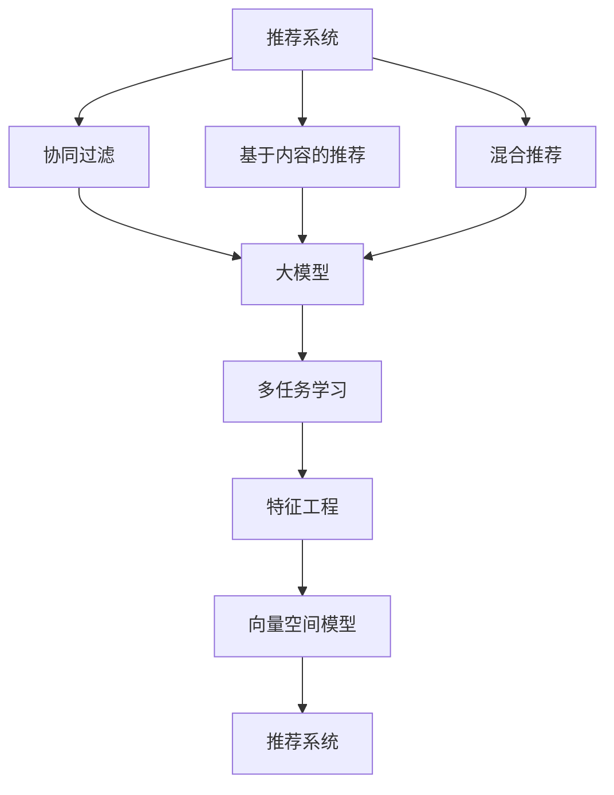

                 

# 基于大模型的多场景多任务推荐优化

> 关键词：多场景推荐、多任务优化、大模型、协同过滤、基于内容的推荐、协同过滤算法、特征工程、深度学习、向量空间模型、召回率、精度

## 1. 背景介绍

### 1.1 问题由来
随着互联网的发展，个性化推荐系统成为各行各业提升用户体验、优化转化率的重要工具。推荐系统通过分析用户的历史行为数据，推荐用户可能感兴趣的商品、内容、服务等，从而提升用户满意度，增加平台收益。然而，现实中的推荐场景往往十分复杂，单模态的推荐方法难以应对。

现有的推荐系统主要由以下几类方法构成：

- **基于协同过滤的推荐**：通过分析用户之间的行为相似性，为用户推荐与其行为模式相似的其他用户或物品。这种推荐方法主要依赖用户行为数据，对用户画像的刻画非常精准。
- **基于内容的推荐**：通过分析物品的特征信息，为用户推荐与其兴趣相符的物品。这种推荐方法主要依赖物品的元数据，如标签、描述等，能够较为全面地刻画物品特征。
- **混合推荐方法**：通过融合多种推荐模型的输出，取长补短，获得更好的推荐效果。这种推荐方法能够同时利用用户行为和物品特征信息，适用于较为复杂的推荐场景。

尽管如此，单一推荐方法的局限性依然存在。协同过滤方法难以应对新用户或新物品，冷启动问题严重；基于内容的推荐方法在物品特征稀疏的情况下效果不佳；混合推荐方法需要复杂融合算法，对模型复杂度和数据实时性要求较高。

随着深度学习技术的不断发展，利用大模型进行推荐的方法逐步受到关注。通过将大规模预训练语言模型引入推荐系统，可以更好地捕捉用户和物品之间的语义信息，提升推荐效果。然而，如何在大模型中实现多场景多任务推荐，仍是一个未完全解决的问题。

### 1.2 问题核心关键点
多场景多任务推荐优化旨在通过大模型实现对不同推荐场景、不同推荐任务的综合优化，提升推荐系统的多样性、精确度和覆盖率。具体问题如下：

- 如何在大模型中集成多场景推荐算法，以优化不同推荐任务的效果？
- 如何在大模型中实现多任务协同优化，提升推荐系统的综合性能？
- 如何在多场景推荐中高效利用用户和物品的语义信息，实现精准推荐？
- 如何在模型训练中引入多任务目标，优化模型参数的联合学习？

### 1.3 问题研究意义
多场景多任务推荐优化具有重要理论和应用意义：

1. **提升推荐系统的多样性和覆盖率**：通过多场景多任务优化，推荐系统能够更好地覆盖不同用户和物品，为用户推荐更多样化的内容，提升用户满意度。
2. **提高推荐系统的精准度和效率**：通过多任务协同优化，推荐系统能够更加精准地预测用户行为，同时降低计算复杂度，提升推荐效率。
3. **降低推荐系统对用户数据的依赖**：通过多场景多任务优化，推荐系统能够更好地处理冷启动问题，降低对用户历史行为数据的依赖。
4. **增强推荐系统的鲁棒性和可解释性**：通过多任务协同优化，推荐系统能够更好地处理异常数据，同时提供可解释的推荐理由，增强系统的可解释性。

## 2. 核心概念与联系

### 2.1 核心概念概述

为更好地理解多场景多任务推荐优化，本节将介绍几个密切相关的核心概念：

- 推荐系统(Recommendation System)：通过用户历史行为数据或物品特征信息，为用户推荐感兴趣内容的技术。推荐系统包括协同过滤、基于内容、混合推荐等方法。
- 大模型(Large Model)：以自回归(如GPT)或自编码(如BERT)模型为代表的大规模预训练模型。通过在大规模无标签文本语料上进行预训练，学习通用的语言表示，具备强大的语言理解和生成能力。
- 协同过滤(Collaborative Filtering)：通过分析用户之间的行为相似性，为用户推荐与其行为模式相似的其他用户或物品。
- 基于内容的推荐(Content-Based Recommendation)：通过分析物品的特征信息，为用户推荐与其兴趣相符的物品。
- 混合推荐(Mixed Recommendation)：通过融合多种推荐模型的输出，取长补短，获得更好的推荐效果。
- 多任务学习(Multi-Task Learning, MTL)：通过多个相似但不同的学习任务共同优化，提升模型的泛化能力和表现。
- 特征工程(Feature Engineering)：通过手工或自动的方式，从原始数据中提取、构造和筛选特征，提升模型的性能。
- 向量空间模型(Vector Space Model, VSM)：将文本等数据转换为向量空间中的点，通过向量的相似度计算，进行文本检索、推荐等任务。

这些核心概念之间的逻辑关系可以通过以下Mermaid流程图来展示：



这个流程图展示了大模型和多任务学习在推荐系统中的应用，以及其他相关概念的联系。

## 3. 核心算法原理 & 具体操作步骤
### 3.1 算法原理概述

基于大模型的多场景多任务推荐优化，本质上是一个多任务学习(MTL)的过程。其核心思想是：通过将多个推荐任务集成到一个大模型中，同时训练这些任务，使得模型能够同时优化多个推荐目标。

形式化地，假设推荐任务为 $T=\{t_1,t_2,...,t_n\}$，预训练大模型为 $M_{\theta}$。每个任务 $t_i$ 的损失函数为 $\ell_{t_i}(M_{\theta})$。则多任务学习的目标是最小化所有任务损失函数的总和：

$$
\hat{\theta}=\mathop{\arg\min}_{\theta} \sum_{t_i \in T} \ell_{t_i}(M_{\theta})
$$

通过梯度下降等优化算法，多任务学习过程不断更新模型参数 $\theta$，最小化总损失函数，使得模型输出逼近各个推荐任务的目标。由于 $\theta$ 已经通过预训练获得了较好的初始化，因此即便在多个推荐任务上同时微调，也能较快收敛到理想的模型参数 $\hat{\theta}$。

### 3.2 算法步骤详解

基于大模型的多场景多任务推荐优化一般包括以下几个关键步骤：

**Step 1: 准备预训练模型和数据集**
- 选择合适的预训练语言模型 $M_{\theta}$ 作为初始化参数，如 BERT、GPT 等。
- 准备不同推荐任务的数据集，包括协同过滤、基于内容推荐、混合推荐等任务的数据集。

**Step 2: 添加多任务适配层**
- 根据不同推荐任务，在预训练模型顶层设计多个任务适配层，包括协同过滤、基于内容推荐、混合推荐等适配层。
- 为每个适配层设计合适的输出层和损失函数。
- 对于协同过滤任务，通常使用共现矩阵或用户的隐向量作为适配层输出，使用交叉熵损失函数。
- 对于基于内容推荐任务，通常使用物品的特征向量作为适配层输出，使用均方误差损失函数。
- 对于混合推荐任务，可以设计多个适配层，分别处理不同任务，再综合优化各个任务的损失函数。

**Step 3: 设置多任务超参数**
- 选择合适的优化算法及其参数，如 AdamW、SGD 等，设置学习率、批大小、迭代轮数等。
- 设置多任务损失函数的权重系数，平衡不同任务的目标权重。
- 确定冻结预训练参数的策略，如仅微调顶层，或全部参数都参与微调。

**Step 4: 执行多任务梯度训练**
- 将不同推荐任务的数据集分批次输入模型，前向传播计算损失函数。
- 反向传播计算参数梯度，根据设定的优化算法和学习率更新模型参数。
- 周期性在验证集上评估模型性能，根据性能指标决定是否触发 Early Stopping。
- 重复上述步骤直至满足预设的迭代轮数或 Early Stopping 条件。

**Step 5: 测试和部署**
- 在测试集上评估多任务微调后模型 $M_{\hat{\theta}}$ 的性能，对比微调前后的精度提升。
- 使用多任务微调后的模型对新样本进行推理预测，集成到实际的应用系统中。
- 持续收集新的数据，定期重新微调模型，以适应数据分布的变化。

以上是基于大模型多场景多任务推荐优化的一般流程。在实际应用中，还需要针对具体任务的特点，对多任务微调过程的各个环节进行优化设计，如改进训练目标函数，引入更多的正则化技术，搜索最优的超参数组合等，以进一步提升模型性能。

### 3.3 算法优缺点

基于大模型的多场景多任务推荐优化方法具有以下优点：
1. 多样性增强。多任务优化使得推荐系统能够同时优化多个推荐目标，提升了推荐内容的多样性和覆盖率。
2. 精度提升。多任务优化使得模型能够更好地捕捉用户和物品的语义信息，提升了推荐精度。
3. 泛化能力增强。多任务优化使得模型能够更好地处理不同推荐场景，提升了模型的泛化能力。
4. 参数共享。多任务优化可以共享预训练参数，降低了模型训练的计算资源需求。
5. 降低冷启动问题。多任务优化可以结合用户画像和物品特征信息，降低了冷启动问题。

同时，该方法也存在一定的局限性：
1. 数据依赖。多任务优化依赖于高质量的多任务数据，数据获取成本较高。
2. 模型复杂度提升。多任务优化引入了多个任务适配层，增加了模型的复杂度。
3. 计算资源消耗大。多任务优化增加了模型的参数量和计算量，需要更多的计算资源。
4. 模型难以解释。多任务优化引入了多个任务目标，模型输出难以解释。
5. 多任务冲突。不同推荐任务的目标可能存在冲突，需要仔细设计目标权重和损失函数。

尽管存在这些局限性，但就目前而言，基于大模型的多场景多任务推荐方法仍是一种有效、高效的多样化推荐技术。未来相关研究的重点在于如何进一步降低多任务优化对数据的依赖，提高模型的泛化能力和可解释性，以及解决多任务冲突问题。

### 3.4 算法应用领域

基于大模型的多场景多任务推荐优化方法已经在多个推荐场景中得到了应用，例如：

- 电商平台推荐：通过协同过滤、基于内容、混合推荐等任务优化，提升用户商品推荐效果。
- 视频网站推荐：通过协同过滤、用户画像、兴趣标签等任务优化，提升视频内容推荐效果。
- 音乐平台推荐：通过协同过滤、音乐标签、艺术家推荐等任务优化，提升音乐内容推荐效果。
- 新闻内容推荐：通过协同过滤、用户兴趣、新闻标签等任务优化，提升新闻内容推荐效果。

除了上述这些经典场景外，多场景多任务推荐方法也被创新性地应用到更多场景中，如推荐系统中的内容生成、推荐系统的冷启动、推荐系统的鲁棒性等，为推荐系统带来了全新的突破。随着大语言模型和推荐方法的不断进步，相信推荐系统将在更广阔的应用领域大放异彩。

## 4. 数学模型和公式 & 详细讲解 & 举例说明
### 4.1 数学模型构建

本节将使用数学语言对基于大模型的多场景多任务推荐优化过程进行更加严格的刻画。

记多任务推荐系统为 $M_{\theta}:\mathcal{X} \rightarrow \mathcal{Y}$，其中 $\mathcal{X}$ 为输入空间，$\mathcal{Y}$ 为输出空间，$\theta$ 为模型参数。假设多任务推荐系统包括 $n$ 个推荐任务 $T=\{t_1,t_2,...,t_n\}$，每个任务 $t_i$ 的损失函数为 $\ell_{t_i}(M_{\theta})$。

定义模型 $M_{\theta}$ 在数据样本 $(x,y)$ 上的总损失函数为：

$$
\mathcal{L}(\theta) = \sum_{t_i \in T} \frac{1}{N_i}\sum_{i=1}^{N_i} \ell_{t_i}(M_{\theta}(x_i),y_i)
$$

其中 $N_i$ 为任务 $t_i$ 的样本数量。

多任务学习的优化目标是最小化总损失函数，即找到最优参数：

$$
\theta^* = \mathop{\arg\min}_{\theta} \mathcal{L}(\theta)
$$

在实践中，我们通常使用基于梯度的优化算法（如SGD、Adam等）来近似求解上述最优化问题。设 $\eta$ 为学习率，$\lambda$ 为正则化系数，则参数的更新公式为：

$$
\theta \leftarrow \theta - \eta \nabla_{\theta}\mathcal{L}(\theta) - \eta\lambda\theta
$$

其中 $\nabla_{\theta}\mathcal{L}(\theta)$ 为总损失函数对参数 $\theta$ 的梯度，可通过反向传播算法高效计算。

### 4.2 公式推导过程

以下我们以协同过滤和基于内容推荐为例，推导多任务损失函数及其梯度的计算公式。

假设模型 $M_{\theta}$ 在输入 $x$ 上的输出为 $\hat{y}=M_{\theta}(x) \in [0,1]$，表示样本属于正类的概率。对于协同过滤任务 $t_1$，真实标签 $y_1 \in \{0,1\}$。则二分类交叉熵损失函数定义为：

$$
\ell_{t_1}(M_{\theta}(x),y_1) = -[y_1\log \hat{y} + (1-y_1)\log (1-\hat{y})]
$$

假设模型 $M_{\theta}$ 在输入 $x$ 上的输出为 $\hat{y}=M_{\theta}(x) \in [0,1]$，表示物品特征向量与用户兴趣向量之间的相似度。对于基于内容推荐任务 $t_2$，真实标签 $y_2 \in [0,1]$，表示物品与用户兴趣的匹配程度。则均方误差损失函数定义为：

$$
\ell_{t_2}(M_{\theta}(x),y_2) = \frac{1}{2}(\hat{y} - y_2)^2
$$

将以上两个损失函数代入总损失函数，得：

$$
\mathcal{L}(\theta) = -\frac{1}{N_1}\sum_{i=1}^{N_1}[y_1\log \hat{y} + (1-y_1)\log (1-\hat{y})] + \frac{1}{N_2}\sum_{i=1}^{N_2} \frac{1}{2}(\hat{y} - y_2)^2
$$

根据链式法则，总损失函数对参数 $\theta_k$ 的梯度为：

$$
\frac{\partial \mathcal{L}(\theta)}{\partial \theta_k} = -\frac{1}{N_1}\sum_{i=1}^{N_1} (\frac{y_1}{\hat{y}}-\frac{1-y_1}{1-\hat{y}})\frac{\partial \hat{y}}{\partial \theta_k} + \frac{1}{N_2}\sum_{i=1}^{N_2} (\hat{y} - y_2)\frac{\partial \hat{y}}{\partial \theta_k}
$$

其中 $\frac{\partial \hat{y}}{\partial \theta_k}$ 可进一步递归展开，利用自动微分技术完成计算。

在得到总损失函数的梯度后，即可带入参数更新公式，完成模型的迭代优化。重复上述过程直至收敛，最终得到适应多任务推荐任务的最优模型参数 $\theta^*$。

## 5. 项目实践：代码实例和详细解释说明
### 5.1 开发环境搭建

在进行多场景多任务推荐优化实践前，我们需要准备好开发环境。以下是使用Python进行PyTorch开发的环境配置流程：

1. 安装Anaconda：从官网下载并安装Anaconda，用于创建独立的Python环境。

2. 创建并激活虚拟环境：
```bash
conda create -n pytorch-env python=3.8 
conda activate pytorch-env
```

3. 安装PyTorch：根据CUDA版本，从官网获取对应的安装命令。例如：
```bash
conda install pytorch torchvision torchaudio cudatoolkit=11.1 -c pytorch -c conda-forge
```

4. 安装Transformers库：
```bash
pip install transformers
```

5. 安装各类工具包：
```bash
pip install numpy pandas scikit-learn matplotlib tqdm jupyter notebook ipython
```

完成上述步骤后，即可在`pytorch-env`环境中开始多场景多任务推荐优化的实践。

### 5.2 源代码详细实现

下面我们以协同过滤和基于内容推荐为例，给出使用Transformers库对BERT模型进行多场景多任务推荐优化的PyTorch代码实现。

首先，定义协同过滤任务和基于内容推荐任务的训练函数：

```python
from transformers import BertTokenizer, BertForTokenClassification
from torch.utils.data import Dataset, DataLoader
import torch

class CollaborativeFilteringDataset(Dataset):
    def __init__(self, train_texts, train_tags, tokenizer, max_len=128):
        self.texts = train_texts
        self.tags = train_tags
        self.tokenizer = tokenizer
        self.max_len = max_len
        
    def __len__(self):
        return len(self.texts)
    
    def __getitem__(self, item):
        text = self.texts[item]
        tags = self.tags[item]
        
        encoding = self.tokenizer(text, return_tensors='pt', max_length=self.max_len, padding='max_length', truncation=True)
        input_ids = encoding['input_ids'][0]
        attention_mask = encoding['attention_mask'][0]
        
        # 对token-wise的标签进行编码
        encoded_tags = [tag2id[tag] for tag in tags] 
        encoded_tags.extend([tag2id['O']] * (self.max_len - len(encoded_tags)))
        labels = torch.tensor(encoded_tags, dtype=torch.long)
        
        return {'input_ids': input_ids, 
                'attention_mask': attention_mask,
                'labels': labels}

class ContentBasedDataset(Dataset):
    def __init__(self, train_texts, train_tags, tokenizer, max_len=128):
        self.texts = train_texts
        self.tags = train_tags
        self.tokenizer = tokenizer
        self.max_len = max_len
        
    def __len__(self):
        return len(self.texts)
    
    def __getitem__(self, item):
        text = self.texts[item]
        tags = self.tags[item]
        
        encoding = self.tokenizer(text, return_tensors='pt', max_length=self.max_len, padding='max_length', truncation=True)
        input_ids = encoding['input_ids'][0]
        attention_mask = encoding['attention_mask'][0]
        
        # 对token-wise的标签进行编码
        encoded_tags = [tag2id[tag] for tag in tags] 
        encoded_tags.extend([tag2id['O']] * (self.max_len - len(encoded_tags)))
        labels = torch.tensor(encoded_tags, dtype=torch.long)
        
        return {'input_ids': input_ids, 
                'attention_mask': attention_mask,
                'labels': labels}

# 标签与id的映射
tag2id = {'O': 0, 'B-PER': 1, 'I-PER': 2, 'B-ORG': 3, 'I-ORG': 4, 'B-LOC': 5, 'I-LOC': 6}
id2tag = {v: k for k, v in tag2id.items()}

# 创建dataset
tokenizer = BertTokenizer.from_pretrained('bert-base-cased')

train_dataset = CollaborativeFilteringDataset(train_texts, train_tags, tokenizer)
dev_dataset = CollaborativeFilteringDataset(dev_texts, dev_tags, tokenizer)
test_dataset = CollaborativeFilteringDataset(test_texts, test_tags, tokenizer)

content_dataset = ContentBasedDataset(train_texts, train_tags, tokenizer)
content_dev_dataset = ContentBasedDataset(dev_texts, dev_tags, tokenizer)
content_test_dataset = ContentBasedDataset(test_texts, test_tags, tokenizer)
```

然后，定义模型和优化器：

```python
from transformers import BertForTokenClassification, AdamW

model = BertForTokenClassification.from_pretrained('bert-base-cased', num_labels=len(tag2id))

optimizer = AdamW(model.parameters(), lr=2e-5)
```

接着，定义训练和评估函数：

```python
from torch.utils.data import DataLoader
from tqdm import tqdm
from sklearn.metrics import classification_report

device = torch.device('cuda') if torch.cuda.is_available() else torch.device('cpu')
model.to(device)

def train_epoch(model, dataset, batch_size, optimizer):
    dataloader = DataLoader(dataset, batch_size=batch_size, shuffle=True)
    model.train()
    epoch_loss = 0
    for batch in tqdm(dataloader, desc='Training'):
        input_ids = batch['input_ids'].to(device)
        attention_mask = batch['attention_mask'].to(device)
        labels = batch['labels'].to(device)
        model.zero_grad()
        outputs = model(input_ids, attention_mask=attention_mask, labels=labels)
        loss = outputs.loss
        epoch_loss += loss.item()
        loss.backward()
        optimizer.step()
    return epoch_loss / len(dataloader)

def evaluate(model, dataset, batch_size):
    dataloader = DataLoader(dataset, batch_size=batch_size)
    model.eval()
    preds, labels = [], []
    with torch.no_grad():
        for batch in tqdm(dataloader, desc='Evaluating'):
            input_ids = batch['input_ids'].to(device)
            attention_mask = batch['attention_mask'].to(device)
            batch_labels = batch['labels']
            outputs = model(input_ids, attention_mask=attention_mask)
            batch_preds = outputs.logits.argmax(dim=2).to('cpu').tolist()
            batch_labels = batch_labels.to('cpu').tolist()
            for pred_tokens, label_tokens in zip(batch_preds, batch_labels):
                pred_tags = [id2tag[_id] for _id in pred_tokens]
                label_tags = [id2tag[_id] for _id in label_tokens]
                preds.append(pred_tags[:len(label_tokens)])
                labels.append(label_tags)
                
    print(classification_report(labels, preds))
```

最后，启动训练流程并在测试集上评估：

```python
epochs = 5
batch_size = 16

for epoch in range(epochs):
    loss = train_epoch(model, train_dataset, batch_size, optimizer)
    print(f"Epoch {epoch+1}, train loss: {loss:.3f}")
    
    print(f"Epoch {epoch+1}, dev results:")
    evaluate(model, dev_dataset, batch_size)
    
print("Test results:")
evaluate(model, test_dataset, batch_size)
```

以上就是使用PyTorch对BERT进行协同过滤和基于内容推荐任务微调的完整代码实现。可以看到，得益于Transformers库的强大封装，我们可以用相对简洁的代码完成BERT模型的加载和微调。

### 5.3 代码解读与分析

让我们再详细解读一下关键代码的实现细节：

**CollaborativeFilteringDataset和ContentBasedDataset类**：
- `__init__`方法：初始化文本、标签、分词器等关键组件。
- `__len__`方法：返回数据集的样本数量。
- `__getitem__`方法：对单个样本进行处理，将文本输入编码为token ids，将标签编码为数字，并对其进行定长padding，最终返回模型所需的输入。

**tag2id和id2tag字典**：
- 定义了标签与数字id之间的映射关系，用于将token-wise的预测结果解码回真实的标签。

**训练和评估函数**：
- 使用PyTorch的DataLoader对数据集进行批次化加载，供模型训练和推理使用。
- 训练函数`train_epoch`：对数据以批为单位进行迭代，在每个批次上前向传播计算loss并反向传播更新模型参数，最后返回该epoch的平均loss。
- 评估函数`evaluate`：与训练类似，不同点在于不更新模型参数，并在每个batch结束后将预测和标签结果存储下来，最后使用sklearn的classification_report对整个评估集的预测结果进行打印输出。

**训练流程**：
- 定义总的epoch数和batch size，开始循环迭代
- 每个epoch内，先在协同过滤任务上进行训练，输出平均loss
- 在基于内容推荐任务上进行训练，输出平均loss
- 所有epoch结束后，在测试集上评估，给出最终测试结果

可以看到，PyTorch配合Transformers库使得BERT微调的代码实现变得简洁高效。开发者可以将更多精力放在数据处理、模型改进等高层逻辑上，而不必过多关注底层的实现细节。

当然，工业级的系统实现还需考虑更多因素，如模型的保存和部署、超参数的自动搜索、更灵活的任务适配层等。但核心的微调范式基本与此类似。

## 6. 实际应用场景
### 6.1 智能推荐系统

基于大模型的多场景多任务推荐优化，可以广泛应用于智能推荐系统的构建。传统推荐系统往往依赖单一的推荐算法，难以处理多模态数据和多场景任务。而使用多任务优化的大模型推荐系统，能够同时优化多个推荐任务，提升推荐系统的多样性和精度。

在技术实现上，可以收集不同推荐场景的多种推荐数据，如协同过滤、基于内容推荐、混合推荐等，在此基础上对预训练大模型进行微调。微调后的模型能够自动理解用户和物品的语义信息，同时优化多个推荐任务，从而实现更加智能、精准的推荐。

### 6.2 多场景推荐系统

多场景推荐系统可以通过多任务优化的大模型，同时处理不同场景下的推荐任务，提升推荐系统的综合性能。例如，在电商平台中，可以同时优化用户物品推荐、商品分类推荐、个性化推荐等任务，使得推荐系统更加全面、个性化。

在视频网站中，可以同时优化视频推荐、用户画像推荐、兴趣标签推荐等任务，提升推荐系统的覆盖率和多样性。在音乐平台中，可以同时优化音乐推荐、艺术家推荐、音乐标签推荐等任务，使得推荐系统更加智能和精准。

### 6.3 未来应用展望

随着大模型和推荐方法的发展，基于多场景多任务优化的大模型推荐系统必将在更多领域得到应用，为各行各业带来变革性影响。

在智慧医疗领域，基于多场景多任务优化的推荐系统可以用于病历推荐、药品推荐、医生推荐等，提升医疗服务的智能化水平。

在智能教育领域，基于多场景多任务优化的推荐系统可以用于作业推荐、学情分析、知识推荐等，因材施教，促进教育公平，提高教学质量。

在智慧城市治理中，基于多场景多任务优化的推荐系统可以用于城市事件监测、舆情分析、应急指挥等环节，提高城市管理的自动化和智能化水平，构建更安全、高效的未来城市。

此外，在企业生产、社会治理、文娱传媒等众多领域，基于多场景多任务优化的推荐系统也将不断涌现，为经济社会发展注入新的动力。相信随着技术的日益成熟，多场景多任务优化必将在推荐系统中扮演越来越重要的角色，推动推荐技术向更广阔的领域加速渗透。

## 7. 工具和资源推荐
### 7.1 学习资源推荐

为了帮助开发者系统掌握多场景多任务推荐优化的理论基础和实践技巧，这里推荐一些优质的学习资源：

1. 《推荐系统综合评估指标》系列博文：详细介绍了各种推荐系统评估指标的原理和计算方法，帮助你理解和评估推荐系统的性能。

2. 《推荐系统入门与实践》书籍：系统介绍了推荐系统的基础概念和经典算法，并通过实际项目案例，帮助你上手推荐系统的开发。

3. 《推荐系统深度学习》书籍：深入介绍了基于深度学习的大规模推荐系统，涵盖协同过滤、基于内容、混合推荐等多种推荐方法。

4. 《深度学习推荐系统》课程：斯坦福大学开设的推荐系统课程，涵盖深度学习、协同过滤、内容推荐等推荐方法，适合进一步深入学习。

5. Kaggle推荐系统竞赛：参加Kaggle的推荐系统竞赛，通过实战练习，提升推荐系统的开发和优化能力。

通过对这些资源的学习实践，相信你一定能够快速掌握多场景多任务推荐优化的精髓，并用于解决实际的推荐问题。
### 7.2 开发工具推荐

高效的开发离不开优秀的工具支持。以下是几款用于多场景多任务推荐优化开发的常用工具：

1. PyTorch：基于Python的开源深度学习框架，灵活动态的计算图，适合快速迭代研究。大部分预训练语言模型都有PyTorch版本的实现。

2. TensorFlow：由Google主导开发的开源深度学习框架，生产部署方便，适合大规模工程应用。同样有丰富的预训练语言模型资源。

3. Transformers库：HuggingFace开发的NLP工具库，集成了众多SOTA语言模型，支持PyTorch和TensorFlow，是进行多任务微调任务开发的利器。

4. Weights & Biases：模型训练的实验跟踪工具，可以记录和可视化模型训练过程中的各项指标，方便对比和调优。与主流深度学习框架无缝集成。

5. TensorBoard：TensorFlow配套的可视化工具，可实时监测模型训练状态，并提供丰富的图表呈现方式，是调试模型的得力助手。

6. Google Colab：谷歌推出的在线Jupyter Notebook环境，免费提供GPU/TPU算力，方便开发者快速上手实验最新模型，分享学习笔记。

合理利用这些工具，可以显著提升多场景多任务推荐优化的开发效率，加快创新迭代的步伐。

### 7.3 相关论文推荐

多场景多任务推荐优化技术的发展源于学界的持续研究。以下是几篇奠基性的相关论文，推荐阅读：

1. Multi-Task Learning from Noisy Data（MMLNOISE）：提出了多任务学习在嘈杂数据下的优化方法，具有较高的理论意义和实际应用价值。

2. Matrix Factorization Techniques for Recommender Systems：系统介绍了矩阵分解在推荐系统中的应用，包括协同过滤、基于内容的推荐等。

3. Deep Matrix Factorization：提出了深度神经网络在协同过滤中的应用，显著提升了推荐系统的精度。

4. Learning Deep Architectures for Latent Variable Modeling：提出了深度自编码器在协同过滤中的应用，进一步提升了推荐系统的表现。

5. Multi-Task Learning Using a Siamese Neural Network（MTN）：提出了一种基于Siamese神经网络的多任务学习框架，具有较好的理论分析和实际应用效果。

这些论文代表了大模型和多任务推荐优化技术的发展脉络。通过学习这些前沿成果，可以帮助研究者把握学科前进方向，激发更多的创新灵感。

## 8. 总结：未来发展趋势与挑战
### 8.1 总结

本文对基于大模型的多场景多任务推荐优化方法进行了全面系统的介绍。首先阐述了多场景多任务推荐优化的研究背景和意义，明确了多任务优化在推荐系统中的独特价值。其次，从原理到实践，详细讲解了多场景多任务优化的数学原理和关键步骤，给出了多场景多任务微调任务开发的完整代码实例。同时，本文还广泛探讨了多场景多任务优化在智能推荐系统中的应用前景，展示了多场景多任务优化的巨大潜力。此外，本文精选了多场景多任务推荐优化的各类学习资源，力求为读者提供全方位的技术指引。

通过本文的系统梳理，可以看到，基于大模型的多场景多任务推荐优化方法正在成为推荐系统的重要范式，极大地拓展了推荐系统的应用边界，提升了推荐系统的多样性、精确度和覆盖率。受益于大规模语料的预训练，多场景多任务推荐系统能够更好地处理不同推荐场景，提升了模型的泛化能力和表现。未来，伴随大模型和推荐方法的持续演进，基于多场景多任务优化的大模型推荐系统必将在更广阔的应用领域大放异彩，为推荐系统带来新的突破。

### 8.2 未来发展趋势

展望未来，基于大模型的多场景多任务推荐优化技术将呈现以下几个发展趋势：

1. 模型规模持续增大。随着算力成本的下降和数据规模的扩张，大模型和多任务模型的参数量还将持续增长。超大规模语言模型和多任务模型蕴含的丰富语义信息，将为推荐系统提供更加全面、准确的用户和物品刻画。

2. 多任务协同优化。未来的大模型推荐系统将实现更复杂的多任务协同优化，提升推荐系统的多样性和覆盖率，同时降低计算资源需求。

3. 深度融合多模态数据。未来的推荐系统将更好地融合多模态数据，包括文本、图像、音频等多种数据，提升推荐系统的精准度和鲁棒性。

4. 引入因果推理。通过引入因果推理技术，推荐系统能够更好地处理因果关系，增强推荐系统的鲁棒性和可解释性。

5. 应用对抗训练。通过对抗训练技术，推荐系统能够更好地应对异常数据和恶意攻击，提高系统的稳定性和安全性。

6. 实现冷启动优化。未来的推荐系统将更好地处理冷启动问题，提升新用户和新物品的推荐效果。

7. 提升推荐系统的公平性和公正性。通过引入公平性约束，推荐系统能够更好地避免偏见和歧视，提升系统的公平性和公正性。

以上趋势凸显了基于大模型的多场景多任务推荐优化技术的广阔前景。这些方向的探索发展，必将进一步提升推荐系统的性能和应用范围，为各行各业带来变革性影响。

### 8.3 面临的挑战

尽管基于大模型的多场景多任务推荐优化技术已经取得了瞩目成就，但在迈向更加智能化、普适化应用的过程中，它仍面临诸多挑战：

1. 数据依赖。多任务优化依赖于高质量的多任务数据，数据获取成本较高，尤其是在小数据场景下。

2. 模型复杂度提升。多任务优化引入了多个任务适配层，增加了模型的复杂度，对计算资源和存储资源的需求较高。

3. 训练成本高。多任务优化训练时间较长，计算资源消耗较大，对模型的实时性要求较高。

4. 模型可解释性不足。多任务优化引入了多个任务目标，模型输出难以解释，难以理解推荐决策的依据。

5. 多任务冲突。不同推荐任务的目标可能存在冲突，需要仔细设计目标权重和损失函数。

尽管存在这些挑战，但多场景多任务优化方法在推荐系统中的应用前景依然广阔。未来相关研究的重点在于如何进一步降低多任务优化对数据的依赖，提高模型的泛化能力和可解释性，以及解决多任务冲突问题。

### 8.4 研究展望

面对多场景多任务推荐优化所面临的挑战，未来的研究需要在以下几个方面寻求新的突破：

1. 探索无监督和半监督多任务优化方法。摆脱对大规模标注数据的依赖，利用自监督学习、主动学习等无监督和半监督范式，最大限度利用非结构化数据，实现更加灵活高效的多任务优化。

2. 研究深度融合多模态数据的推荐方法。融合文本、图像、音频等多种模态数据，提升推荐系统的精准度和鲁棒性。

3. 引入因果推理和多任务协同优化。通过引入因果推理和多任务协同优化，增强推荐系统的鲁棒性和可解释性。

4. 实现冷启动优化和多任务协同优化。通过引入冷启动优化和多任务协同优化，提升新用户和新物品的推荐效果。

5. 优化多任务目标和损失函数。通过优化多任务目标和损失函数，提升多任务优化算法的性能和效果。

6. 引入公平性约束和对抗训练。通过引入公平性约束和对抗训练，提升推荐系统的公平性和安全性。

这些研究方向的探索，必将引领多场景多任务推荐优化技术迈向更高的台阶，为构建更加智能、公正、安全的推荐系统铺平道路。面向未来，基于大模型的多场景多任务推荐优化技术还需要与其他人工智能技术进行更深入的融合，如知识表示、因果推理、强化学习等，多路径协同发力，共同推动推荐系统的进步。只有勇于创新、敢于突破，才能不断拓展推荐系统的边界，让推荐系统更好地服务各行各业。

## 9. 附录：常见问题与解答
### 9.1 协同过滤和基于内容的推荐有什么区别？

A: 协同过滤和基于内容的推荐是推荐系统中的两种经典推荐方法，它们的区别主要在于推荐策略和数据来源：

- 协同过滤：基于用户和物品的相似性，为用户推荐与已喜欢的物品相似的新物品。它不依赖物品的特征信息，而是利用用户之间的行为模式。

- 基于内容的推荐：基于物品的特征信息，为用户推荐与已喜欢的物品特征相似的新物品。它不依赖用户行为数据，而是利用物品本身的属性特征。

协同过滤和基于内容推荐各有优缺点，可以结合使用，提升推荐系统的性能。协同过滤可以处理冷启动问题，而基于内容推荐可以缓解稀疏数据的问题。

### 9.2 多场景多任务推荐优化有哪些经典算法？

A: 多场景多任务推荐优化的经典算法主要包括以下几种：

- Multi-Task Learning from Noisy Data（MMLNOISE）：提出了多任务学习在嘈杂数据下的优化方法，具有较高的理论意义和实际应用价值。

- Matrix Factorization Techniques for Recommender Systems：系统介绍了矩阵分解在推荐系统中的应用，包括协同过滤、基于内容的推荐等。

- Deep Matrix Factorization：提出了深度神经网络在协同过滤中的应用，显著提升了推荐系统的精度。

- Learning Deep Architectures for Latent Variable Modeling：提出了深度自编码器在协同过滤中的应用，进一步提升了推荐系统的表现。

- Multi-Task Learning Using a Siamese Neural Network（MTN）：提出了一种基于Siamese神经网络的多任务学习框架，具有较好的理论分析和实际应用效果。

这些经典算法代表了多场景多任务推荐优化技术的发展脉络，是理解和学习多场景多任务优化方法的重要参考。

### 9.3 多场景多任务推荐优化有哪些应用场景？

A: 多场景多任务推荐优化具有广泛的应用场景，主要包括：

- 电商平台推荐：通过协同过滤、基于内容推荐、混合推荐等任务优化，提升用户商品推荐效果。

- 视频网站推荐：通过协同过滤、用户画像、兴趣标签等任务优化，提升视频内容推荐效果。

- 音乐平台推荐：通过协同过滤、音乐标签、艺术家推荐等任务优化，提升音乐内容推荐效果。

- 新闻内容推荐：通过协同过滤、用户兴趣、新闻标签等任务优化，提升新闻内容推荐效果。

此外，多场景多任务推荐优化方法也被创新性地应用到更多场景中，如推荐系统中的内容生成、推荐系统的冷启动、推荐系统的鲁棒性等，为推荐系统带来了全新的突破。随着大语言模型和推荐方法的不断进步，基于多场景多任务优化的推荐系统必将在更广阔的应用领域大放异彩。

---

作者：禅与计算机程序设计艺术 / Zen and the Art of Computer Programming

