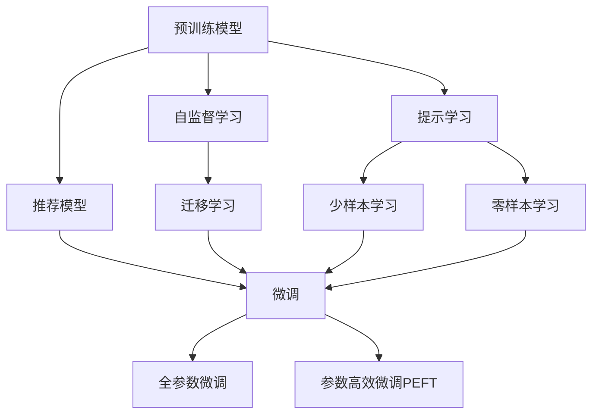

                 

# 基于大模型的推荐系统用户兴趣迁移

> 关键词：推荐系统,大模型,用户兴趣,迁移学习,自监督学习,Transformer,BERT,预训练,推荐算法

## 1. 背景介绍

### 1.1 问题由来

在互联网时代，信息过载是用户面临的一大挑战。在搜索引擎、电商平台、社交网络等场景中，如何高效地为用户推荐感兴趣的内容，已经成为行业内重要的研究课题。传统的推荐算法主要基于用户历史行为数据进行推荐，但这种方法对用户数据量和模型训练要求较高。近年来，基于深度学习的推荐系统得到了广泛关注，尤其是在大模型微调技术出现后，推荐系统的效果得到了显著提升。

在推荐系统领域，大模型微调技术主要应用于推荐模型的优化和创新。通过在大规模数据上进行预训练，学习通用的语言和图像表示，再通过微调学习特定领域的推荐规则，能够大幅提升推荐效果。例如，Google的BERT模型通过微调学习用户与物品间的语义关系，在推荐任务中取得了优异表现。基于大模型的推荐系统，能够自适应用户兴趣的变化，从而提供更个性化、更精准的推荐内容。

### 1.2 问题核心关键点

推荐系统中的大模型微调技术，主要是指在预训练模型上，通过有监督学习的方式，调整模型参数，以适应推荐任务的需求。微调的核心在于如何利用有限的标注数据，最大化地发挥预训练模型的优势，提升推荐系统的性能。

微调的关键问题包括：
- 如何选择合适的微调策略和模型，以最大化利用用户行为数据。
- 如何处理推荐系统的冷启动问题，利用用户历史行为之外的信息，提升新用户推荐效果。
- 如何缓解过拟合，避免模型在少量标注数据上过度调整，保持模型的泛化性能。
- 如何实现高效的推荐模型训练和推理，提升推荐系统性能，减少资源消耗。

### 1.3 问题研究意义

大模型微调技术在推荐系统中的应用，不仅提升了推荐效果，还带来了以下几方面的重要意义：

1. **提升推荐准确性**：通过微调，推荐系统能够更加准确地理解用户兴趣，提供更加精准的推荐内容。
2. **加速模型迭代**：基于大模型的微调，可以显著缩短推荐模型的迭代周期，提高开发效率。
3. **处理冷启动问题**：利用大模型的知识，可以更快速地对新用户进行兴趣建模，提升推荐效果。
4. **减少资源消耗**：通过参数高效的微调方法，可以在保持模型性能的同时，减少资源消耗，提升系统可扩展性。
5. **促进推荐系统创新**：大模型微调技术催生了新的推荐算法，如 Prompt-based Learning、Zero-shot Learning 等，为推荐系统带来了新的创新点。

本文将详细介绍基于大模型的推荐系统用户兴趣迁移方法，包括微调的核心算法原理、具体操作步骤、数学模型构建和代码实现，并通过案例分析，探讨其应用场景和未来趋势。

## 2. 核心概念与联系

### 2.1 核心概念概述

在推荐系统中，用户兴趣的迁移可以通过微调大模型来实现。微调的核心概念和联系如下：

- **预训练模型(Pre-trained Model)**：在大规模无标签数据上，通过自监督学习任务训练得到的通用模型。常见的预训练模型包括BERT、GPT、ViT等。
- **推荐模型(Recommendation Model)**：在预训练模型上，通过微调得到针对推荐任务优化的模型。常见的推荐模型包括深度学习中的用户-物品嵌入模型、注意力机制模型等。
- **迁移学习(Transfer Learning)**：将一个领域学习到的知识，迁移应用到另一个不同但相关的领域的学习范式。大模型的预训练-微调过程即是一种典型的迁移学习方式。
- **自监督学习(Self-supervised Learning)**：在无监督学习的基础上，通过设计自监督任务，学习模型的知识表示，增强模型的泛化能力。
- **参数高效微调(Parameter-Efficient Fine-Tuning, PEFT)**：在微调过程中，只更新少量的模型参数，而固定大部分预训练权重不变，以提高微调效率。
- **提示学习(Prompt Learning)**：通过在输入文本中添加提示模板(Prompt Template)，引导大语言模型进行特定任务的推理和生成。

这些核心概念之间的逻辑关系可以通过以下Mermaid流程图来展示：



这个流程图展示了大模型的预训练、推荐模型微调、自监督学习、迁移学习、提示学习和少样本/零样本学习之间的逻辑关系。

## 3. 核心算法原理 & 具体操作步骤
### 3.1 算法原理概述

基于大模型的推荐系统用户兴趣迁移，本质上是一种有监督学习的过程。其核心思想是：通过在大规模无标签数据上预训练得到的通用大模型，结合推荐任务的有标签数据，对模型进行微调，使得模型能够根据用户行为数据，自适应地调整用户兴趣表示，提供更加精准的推荐内容。

形式化地，假设预训练模型为 $M_{\theta}$，其中 $\theta$ 为预训练得到的模型参数。给定推荐任务 $T$ 的标注数据集 $D=\{(x_i, y_i)\}_{i=1}^N, x_i \in \mathcal{X}, y_i \in \mathcal{Y}$，推荐模型的微调目标是找到新的模型参数 $\hat{\theta}$，使得：

$$
\hat{\theta}=\mathop{\arg\min}_{\theta} \mathcal{L}(M_{\theta},D)
$$

其中 $\mathcal{L}$ 为针对推荐任务设计的损失函数，用于衡量模型预测输出与真实标签之间的差异。常见的损失函数包括均方误差损失、交叉熵损失等。

通过梯度下降等优化算法，微调过程不断更新模型参数 $\theta$，最小化损失函数 $\mathcal{L}$，使得模型输出逼近真实标签。由于 $\theta$ 已经通过预训练获得了较好的初始化，因此即便在少量标注数据上微调，也能较快收敛到理想的模型参数 $\hat{\theta}$。

### 3.2 算法步骤详解

基于大模型的推荐系统用户兴趣迁移，通常包括以下几个关键步骤：

**Step 1: 准备预训练模型和数据集**
- 选择合适的预训练语言模型 $M_{\theta}$ 作为初始化参数，如 BERT、GPT 等。
- 准备推荐任务 $T$ 的标注数据集 $D$，划分为训练集、验证集和测试集。一般要求标注数据与预训练数据的分布不要差异过大。

**Step 2: 添加任务适配层**
- 根据推荐任务类型，在预训练模型顶层设计合适的输出层和损失函数。
- 对于推荐任务，通常使用用户-物品的评分预测模型，如矩阵分解模型、深度神经网络等。
- 设置损失函数，如均方误差损失、交叉熵损失等。

**Step 3: 设置微调超参数**
- 选择合适的优化算法及其参数，如 AdamW、SGD 等，设置学习率、批大小、迭代轮数等。
- 设置正则化技术及强度，包括权重衰减、Dropout、Early Stopping等。
- 确定冻结预训练参数的策略，如仅微调顶层，或全部参数都参与微调。

**Step 4: 执行梯度训练**
- 将训练集数据分批次输入模型，前向传播计算损失函数。
- 反向传播计算参数梯度，根据设定的优化算法和学习率更新模型参数。
- 周期性在验证集上评估模型性能，根据性能指标决定是否触发 Early Stopping。
- 重复上述步骤直到满足预设的迭代轮数或 Early Stopping 条件。

**Step 5: 测试和部署**
- 在测试集上评估微调后模型 $M_{\hat{\theta}}$ 的性能，对比微调前后的精度提升。
- 使用微调后的模型对新样本进行推荐，集成到实际的应用系统中。
- 持续收集新的用户行为数据，定期重新微调模型，以适应数据分布的变化。

以上是基于大模型的推荐系统用户兴趣迁移的一般流程。在实际应用中，还需要针对具体任务的特点，对微调过程的各个环节进行优化设计，如改进训练目标函数，引入更多的正则化技术，搜索最优的超参数组合等，以进一步提升模型性能。

### 3.3 算法优缺点

基于大模型的推荐系统用户兴趣迁移方法具有以下优点：
1. 简单高效。只需准备少量标注数据，即可对预训练模型进行快速适配，获得较大的性能提升。
2. 通用适用。适用于各种推荐任务，包括物品推荐、内容推荐、广告推荐等，设计简单的任务适配层即可实现微调。
3. 参数高效。利用参数高效微调技术，在固定大部分预训练权重不变的情况下，仍可取得不错的提升。
4. 效果显著。在学术界和工业界的诸多任务上，基于微调的方法已经刷新了最先进的性能指标。

同时，该方法也存在一定的局限性：
1. 依赖标注数据。推荐任务的标注数据往往数量较少，对标注数据的质量和数量要求较高，获取高质量标注数据的成本较高。
2. 迁移能力有限。当目标任务与预训练数据的分布差异较大时，微调的性能提升有限。
3. 负面效果传递。预训练模型的固有偏见、有害信息等，可能通过微调传递到下游任务，造成负面影响。
4. 可解释性不足。微调模型的决策过程通常缺乏可解释性，难以对其推理逻辑进行分析和调试。

尽管存在这些局限性，但就目前而言，基于监督学习的微调方法仍是大模型推荐系统应用的最主流范式。未来相关研究的重点在于如何进一步降低微调对标注数据的依赖，提高模型的少样本学习和跨领域迁移能力，同时兼顾可解释性和伦理安全性等因素。

### 3.4 算法应用领域

基于大模型的推荐系统用户兴趣迁移方法，在推荐系统领域已经得到了广泛的应用，涵盖以下多个方向：

1. **电商推荐**：为电商平台的商品推荐系统提供精准的商品推荐，提升用户体验和销售额。常见的应用包括根据用户浏览历史、购买记录等行为数据，推荐相关商品。
2. **新闻推荐**：为新闻聚合平台推荐相关新闻文章，提升用户粘性和阅读时长。根据用户点击、阅读、收藏等行为数据，推荐可能感兴趣的新闻。
3. **视频推荐**：为视频流媒体平台推荐相关视频内容，提升用户观看体验。根据用户观看历史、点赞、评论等行为数据，推荐相似或相关视频。
4. **音乐推荐**：为音乐流媒体平台推荐相关音乐作品，提升用户满意度。根据用户听歌历史、评分、评论等行为数据，推荐相似或相关音乐。
5. **社交推荐**：为社交网络平台推荐相关用户，提升社交互动和用户粘性。根据用户好友关系、互动历史等行为数据，推荐可能感兴趣的其他用户。

除了上述这些经典任务外，大模型微调推荐方法也被创新性地应用到更多场景中，如知识图谱推荐、广告定向、个性化视频推荐等，为推荐系统带来了全新的突破。随着预训练模型和微调方法的不断进步，相信推荐系统技术将在更广阔的应用领域大放异彩。

## 4. 数学模型和公式 & 详细讲解  
### 4.1 数学模型构建

本节将使用数学语言对基于大模型的推荐系统用户兴趣迁移过程进行更加严格的刻画。

记预训练语言模型为 $M_{\theta}$，其中 $\theta$ 为预训练得到的模型参数。假设推荐任务 $T$ 的训练集为 $D=\{(x_i, y_i)\}_{i=1}^N, x_i \in \mathcal{X}, y_i \in \mathcal{Y}$。

定义推荐模型 $M_{\theta}$ 在输入 $x$ 上的输出为 $\hat{y}=M_{\theta}(x)$，表示模型对物品的评分或概率分布。真实标签 $y \in \mathcal{Y}$，表示用户对物品的实际评分。则推荐模型的损失函数为：

$$
\ell(M_{\theta}(x),y) = \left\{
\begin{aligned}
    &\frac{1}{2}(\hat{y}-y)^2 &\text{(回归任务)} \\
    &-\log \hat{y}  &\text{(分类任务)}
\end{aligned}
\right.
$$

对于回归任务，损失函数为均方误差；对于分类任务，损失函数为交叉熵。则在数据集 $D$ 上的经验风险为：

$$
\mathcal{L}(\theta) = \frac{1}{N}\sum_{i=1}^N \ell(M_{\theta}(x_i),y_i)
$$

微调的优化目标是最小化经验风险，即找到最优参数：

$$
\theta^* = \mathop{\arg\min}_{\theta} \mathcal{L}(\theta)
$$

在实践中，我们通常使用基于梯度的优化算法（如AdamW、SGD等）来近似求解上述最优化问题。设 $\eta$ 为学习率，$\lambda$ 为正则化系数，则参数的更新公式为：

$$
\theta \leftarrow \theta - \eta \nabla_{\theta}\mathcal{L}(\theta) - \eta\lambda\theta
$$

其中 $\nabla_{\theta}\mathcal{L}(\theta)$ 为损失函数对参数 $\theta$ 的梯度，可通过反向传播算法高效计算。

### 4.2 公式推导过程

以下我们以推荐系统中的评分预测任务为例，推导回归损失函数及其梯度的计算公式。

假设推荐模型 $M_{\theta}$ 在输入 $x$ 上的输出为 $\hat{y}=M_{\theta}(x)$，表示模型对物品的评分。真实标签 $y \in \{1,2,...,K\}$，表示用户对物品的实际评分。则回归损失函数定义为：

$$
\ell(M_{\theta}(x),y) = \frac{1}{2}(\hat{y}-y)^2
$$

将其代入经验风险公式，得：

$$
\mathcal{L}(\theta) = \frac{1}{N}\sum_{i=1}^N \frac{1}{2}(\hat{y_i}-y_i)^2
$$

根据链式法则，损失函数对参数 $\theta_k$ 的梯度为：

$$
\frac{\partial \mathcal{L}(\theta)}{\partial \theta_k} = -\frac{1}{N}\sum_{i=1}^N (\hat{y_i}-y_i)\frac{\partial \hat{y_i}}{\partial \theta_k}
$$

其中 $\frac{\partial \hat{y_i}}{\partial \theta_k}$ 可进一步递归展开，利用自动微分技术完成计算。

在得到损失函数的梯度后，即可带入参数更新公式，完成模型的迭代优化。重复上述过程直至收敛，最终得到适应推荐任务的最优模型参数 $\theta^*$。

## 5. 项目实践：代码实例和详细解释说明
### 5.1 开发环境搭建

在进行推荐系统微调实践前，我们需要准备好开发环境。以下是使用Python进行PyTorch开发的环境配置流程：

1. 安装Anaconda：从官网下载并安装Anaconda，用于创建独立的Python环境。

2. 创建并激活虚拟环境：
```bash
conda create -n pytorch-env python=3.8 
conda activate pytorch-env
```

3. 安装PyTorch：根据CUDA版本，从官网获取对应的安装命令。例如：
```bash
conda install pytorch torchvision torchaudio cudatoolkit=11.1 -c pytorch -c conda-forge
```

4. 安装Transformers库：
```bash
pip install transformers
```

5. 安装各类工具包：
```bash
pip install numpy pandas scikit-learn matplotlib tqdm jupyter notebook ipython
```

完成上述步骤后，即可在`pytorch-env`环境中开始微调实践。

### 5.2 源代码详细实现

这里我们以电商推荐系统为例，给出使用Transformers库对BERT模型进行微调的PyTorch代码实现。

首先，定义推荐任务的数据处理函数：

```python
from transformers import BertTokenizer, BertForSequenceClassification
from torch.utils.data import Dataset
import torch

class RecommendDataset(Dataset):
    def __init__(self, items, labels, tokenizer, max_len=128):
        self.items = items
        self.labels = labels
        self.tokenizer = tokenizer
        self.max_len = max_len
        
    def __len__(self):
        return len(self.items)
    
    def __getitem__(self, item):
        item = self.items[item]
        label = self.labels[item]
        
        encoding = self.tokenizer(item, return_tensors='pt', max_length=self.max_len, padding='max_length', truncation=True)
        input_ids = encoding['input_ids'][0]
        attention_mask = encoding['attention_mask'][0]
        
        # 对标签进行编码
        encoded_labels = [1 if label == 1 else 0 for label in label] 
        encoded_labels.extend([0] * (self.max_len - len(encoded_labels)))
        labels = torch.tensor(encoded_labels, dtype=torch.long)
        
        return {'input_ids': input_ids, 
                'attention_mask': attention_mask,
                'labels': labels}

# 标签与id的映射
label2id = {1: 1, 0: 0}
id2label = {v: k for k, v in label2id.items()}

# 创建dataset
tokenizer = BertTokenizer.from_pretrained('bert-base-cased')

train_dataset = RecommendDataset(train_items, train_labels, tokenizer)
dev_dataset = RecommendDataset(dev_items, dev_labels, tokenizer)
test_dataset = RecommendDataset(test_items, test_labels, tokenizer)
```

然后，定义模型和优化器：

```python
from transformers import AdamW

model = BertForSequenceClassification.from_pretrained('bert-base-cased', num_labels=1)

optimizer = AdamW(model.parameters(), lr=2e-5)
```

接着，定义训练和评估函数：

```python
from torch.utils.data import DataLoader
from tqdm import tqdm
from sklearn.metrics import roc_auc_score

device = torch.device('cuda') if torch.cuda.is_available() else torch.device('cpu')
model.to(device)

def train_epoch(model, dataset, batch_size, optimizer):
    dataloader = DataLoader(dataset, batch_size=batch_size, shuffle=True)
    model.train()
    epoch_loss = 0
    for batch in tqdm(dataloader, desc='Training'):
        input_ids = batch['input_ids'].to(device)
        attention_mask = batch['attention_mask'].to(device)
        labels = batch['labels'].to(device)
        model.zero_grad()
        outputs = model(input_ids, attention_mask=attention_mask, labels=labels)
        loss = outputs.loss
        epoch_loss += loss.item()
        loss.backward()
        optimizer.step()
    return epoch_loss / len(dataloader)

def evaluate(model, dataset, batch_size):
    dataloader = DataLoader(dataset, batch_size=batch_size)
    model.eval()
    preds, labels = [], []
    with torch.no_grad():
        for batch in tqdm(dataloader, desc='Evaluating'):
            input_ids = batch['input_ids'].to(device)
            attention_mask = batch['attention_mask'].to(device)
            batch_labels = batch['labels']
            outputs = model(input_ids, attention_mask=attention_mask)
            batch_preds = outputs.logits.sigmoid().to('cpu').tolist()
            batch_labels = batch_labels.to('cpu').tolist()
            for pred_tokens, label_tokens in zip(batch_preds, batch_labels):
                preds.append(pred_tokens)
                labels.append(label_tokens)
                
    return roc_auc_score(labels, preds)
```

最后，启动训练流程并在测试集上评估：

```python
epochs = 5
batch_size = 16

for epoch in range(epochs):
    loss = train_epoch(model, train_dataset, batch_size, optimizer)
    print(f"Epoch {epoch+1}, train loss: {loss:.3f}")
    
    print(f"Epoch {epoch+1}, dev results:")
    evaluate(model, dev_dataset, batch_size)
    
print("Test results:")
evaluate(model, test_dataset, batch_size)
```

以上就是使用PyTorch对BERT进行电商推荐系统推荐任务微调的完整代码实现。可以看到，得益于Transformers库的强大封装，我们可以用相对简洁的代码完成BERT模型的加载和微调。

### 5.3 代码解读与分析

让我们再详细解读一下关键代码的实现细节：

**RecommendDataset类**：
- `__init__`方法：初始化物品、标签、分词器等关键组件。
- `__len__`方法：返回数据集的样本数量。
- `__getitem__`方法：对单个样本进行处理，将物品输入编码为token ids，将标签编码为数字，并对其进行定长padding，最终返回模型所需的输入。

**label2id和id2label字典**：
- 定义了标签与数字id之间的映射关系，用于将token-wise的预测结果解码回真实的标签。

**训练和评估函数**：
- 使用PyTorch的DataLoader对数据集进行批次化加载，供模型训练和推理使用。
- 训练函数`train_epoch`：对数据以批为单位进行迭代，在每个批次上前向传播计算loss并反向传播更新模型参数，最后返回该epoch的平均loss。
- 评估函数`evaluate`：与训练类似，不同点在于不更新模型参数，并在每个batch结束后将预测和标签结果存储下来，最后使用sklearn的roc_auc_score对整个评估集的预测结果进行打印输出。

**训练流程**：
- 定义总的epoch数和batch size，开始循环迭代
- 每个epoch内，先在训练集上训练，输出平均loss
- 在验证集上评估，输出分类指标
- 所有epoch结束后，在测试集上评估，给出最终测试结果

可以看到，PyTorch配合Transformers库使得BERT微调的代码实现变得简洁高效。开发者可以将更多精力放在数据处理、模型改进等高层逻辑上，而不必过多关注底层的实现细节。

当然，工业级的系统实现还需考虑更多因素，如模型的保存和部署、超参数的自动搜索、更灵活的任务适配层等。但核心的微调范式基本与此类似。

## 6. 实际应用场景
### 6.1 电商推荐系统

电商推荐系统基于大模型的微调方法，可以显著提升推荐效果。传统的推荐算法主要依赖用户历史行为数据，但在新用户或非活跃用户场景下，效果有限。而使用微调后的模型，可以更好地理解用户兴趣，进行个性化推荐。

在技术实现上，可以收集电商平台的商品浏览、购买、收藏等行为数据，将这些数据作为标注数据，对预训练语言模型进行微调。微调后的模型能够理解用户对物品的评分，进而提供更精准的推荐内容。对于用户未浏览过的商品，模型可以通过知识图谱等外部信息，进行跨模态的推荐，进一步提升推荐效果。

### 6.2 新闻推荐系统

新闻推荐系统基于大模型的微调方法，可以提升新闻文章的推荐效果，增加用户粘性和阅读时长。新闻平台可以通过用户点击、阅读、收藏等行为数据，训练推荐模型，提升相关性推荐。

在具体实现上，可以将用户点击的新闻文章作为正例，未点击的文章作为负例，构建标注数据集。通过微调训练的模型能够学习新闻文章的语义表示，并在用户行为数据上进行推理，推荐相关的新闻文章。此外，通过引入多媒体信息，如新闻图片、视频等，进行跨模态推荐，提升推荐的丰富性和多样性。

### 6.3 视频推荐系统

视频推荐系统基于大模型的微调方法，可以提升用户观看体验，推荐相关视频内容。视频平台可以通过用户观看历史、点赞、评论等行为数据，训练推荐模型，推荐相似或相关视频。

在具体实现上，可以将用户观看过的视频作为正例，未观看过的视频作为负例，构建标注数据集。通过微调训练的模型能够学习视频内容的语义表示，并在用户行为数据上进行推理，推荐相关视频。此外，通过引入视频标签、分类等结构化信息，进行跨模态推荐，提升推荐的准确性和多样性。

### 6.4 未来应用展望

随着大模型微调技术的发展，其在推荐系统中的应用场景将不断扩展。以下是对未来应用的展望：

1. **多模态推荐**：除了文本、视频、音频等模态外，未来的推荐系统还将进一步扩展到图像、传感器数据等模态，实现跨模态的推荐。多模态信息的融合，将显著提升推荐系统的表现。
2. **个性化推荐**：基于大模型的推荐系统将更加注重个性化推荐，通过理解用户的多维兴趣和行为，提供更加精准的推荐内容。
3. **实时推荐**：未来推荐系统将实现实时推荐，通过流式数据处理和大模型微调，动态调整推荐内容，提升用户体验。
4. **推荐算法创新**：基于大模型的推荐系统将催生新的推荐算法，如 Prompt-based Learning、Zero-shot Learning 等，为推荐系统带来新的突破。
5. **推荐系统优化**：未来的推荐系统将更加注重推荐算法优化，如对抗训练、对抗样本生成等，提高系统的鲁棒性和安全性。

## 7. 工具和资源推荐
### 7.1 学习资源推荐

为了帮助开发者系统掌握大模型微调推荐系统的方法，这里推荐一些优质的学习资源：

1. 《Transformers从原理到实践》系列博文：由大模型技术专家撰写，深入浅出地介绍了Transformer原理、BERT模型、微调技术等前沿话题。

2. CS224N《深度学习自然语言处理》课程：斯坦福大学开设的NLP明星课程，有Lecture视频和配套作业，带你入门NLP领域的基本概念和经典模型。

3. 《Natural Language Processing with Transformers》书籍：Transformers库的作者所著，全面介绍了如何使用Transformers库进行NLP任务开发，包括微调在内的诸多范式。

4. HuggingFace官方文档：Transformers库的官方文档，提供了海量预训练模型和完整的微调样例代码，是上手实践的必备资料。

5. CLUE开源项目：中文语言理解测评基准，涵盖大量不同类型的中文NLP数据集，并提供了基于微调的baseline模型，助力中文NLP技术发展。

通过对这些资源的学习实践，相信你一定能够快速掌握大模型微调的精髓，并用于解决实际的NLP问题。
###  7.2 开发工具推荐

高效的开发离不开优秀的工具支持。以下是几款用于大模型微调推荐系统开发的常用工具：

1. PyTorch：基于Python的开源深度学习框架，灵活动态的计算图，适合快速迭代研究。大部分预训练语言模型都有PyTorch版本的实现。

2. TensorFlow：由Google主导开发的开源深度学习框架，生产部署方便，适合大规模工程应用。同样有丰富的预训练语言模型资源。

3. Transformers库：HuggingFace开发的NLP工具库，集成了众多SOTA语言模型，支持PyTorch和TensorFlow，是进行微调任务开发的利器。

4. Weights & Biases：模型训练的实验跟踪工具，可以记录和可视化模型训练过程中的各项指标，方便对比和调优。与主流深度学习框架无缝集成。

5. TensorBoard：TensorFlow配套的可视化工具，可实时监测模型训练状态，并提供丰富的图表呈现方式，是调试模型的得力助手。

6. Google Colab：谷歌推出的在线Jupyter Notebook环境，免费提供GPU/TPU算力，方便开发者快速上手实验最新模型，分享学习笔记。

合理利用这些工具，可以显著提升大模型微调推荐系统的开发效率，加快创新迭代的步伐。

### 7.3 相关论文推荐

大模型微调推荐系统的发展源于学界的持续研究。以下是几篇奠基性的相关论文，推荐阅读：

1. Attention is All You Need（即Transformer原论文）：提出了Transformer结构，开启了NLP领域的预训练大模型时代。

2. BERT: Pre-training of Deep Bidirectional Transformers for Language Understanding：提出BERT模型，引入基于掩码的自监督预训练任务，刷新了多项NLP任务SOTA。

3. Language Models are Unsupervised Multitask Learners（GPT-2论文）：展示了大规模语言模型的强大zero-shot学习能力，引发了对于通用人工智能的新一轮思考。

4. Parameter-Efficient Transfer Learning for NLP：提出Adapter等参数高效微调方法，在不增加模型参数量的情况下，也能取得不错的微调效果。

5. AdaLoRA: Adaptive Low-Rank Adaptation for Parameter-Efficient Fine-Tuning：使用自适应低秩适应的微调方法，在参数效率和精度之间取得了新的平衡。

这些论文代表了大模型微调推荐系统的发展脉络。通过学习这些前沿成果，可以帮助研究者把握学科前进方向，激发更多的创新灵感。

## 8. 总结：未来发展趋势与挑战
### 8.1 总结

本文对基于大模型的推荐系统用户兴趣迁移方法进行了全面系统的介绍。首先阐述了大模型微调推荐系统的发展背景和研究意义，明确了微调在提升推荐系统性能、加速开发周期、处理冷启动问题等方面的重要作用。其次，从原理到实践，详细讲解了微调的核心算法原理和操作步骤，给出了微调任务开发的完整代码实例。同时，本文还广泛探讨了微调方法在电商推荐、新闻推荐、视频推荐等推荐系统中的应用前景，展示了微调范式的强大潜力。最后，本文精选了微调技术的各类学习资源，力求为读者提供全方位的技术指引。

通过本文的系统梳理，可以看到，基于大模型的推荐系统微调方法正在成为推荐系统应用的重要范式，极大地拓展了推荐模型的应用边界，提升了推荐系统的性能。未来，伴随大模型微调方法的不断演进，推荐系统技术将在更广泛的领域大放异彩，为用户的个性化推荐体验带来质的提升。

### 8.2 未来发展趋势

展望未来，基于大模型的推荐系统用户兴趣迁移技术将呈现以下几个发展趋势：

1. **多模态推荐**：除了文本、视频、音频等模态外，未来的推荐系统还将进一步扩展到图像、传感器数据等模态，实现跨模态的推荐。多模态信息的融合，将显著提升推荐系统的表现。
2. **个性化推荐**：基于大模型的推荐系统将更加注重个性化推荐，通过理解用户的多维兴趣和行为，提供更加精准的推荐内容。
3. **实时推荐**：未来推荐系统将实现实时推荐，通过流式数据处理和大模型微调，动态调整推荐内容，提升用户体验。
4. **推荐算法创新**：基于大模型的推荐系统将催生新的推荐算法，如 Prompt-based Learning、Zero-shot Learning 等，为推荐系统带来新的突破。
5. **推荐系统优化**：未来的推荐系统将更加注重推荐算法优化，如对抗训练、对抗样本生成等，提高系统的鲁棒性和安全性。

以上趋势凸显了大模型微调推荐系统的广阔前景。这些方向的探索发展，必将进一步提升推荐系统的性能和应用范围，为用户的个性化推荐体验带来质的提升。

### 8.3 面临的挑战

尽管大模型微调推荐系统技术已经取得了瞩目成就，但在迈向更加智能化、普适化应用的过程中，它仍面临着诸多挑战：

1. **标注成本瓶颈**：推荐任务的标注数据往往数量较少，对标注数据的质量和数量要求较高，获取高质量标注数据的成本较高。如何进一步降低微调对标注数据的依赖，将是一大难题。
2. **模型鲁棒性不足**：推荐系统面对域外数据时，泛化性能往往大打折扣。对于测试样本的微小扰动，微调模型的预测也容易发生波动。如何提高微调模型的鲁棒性，避免灾难性遗忘，还需要更多理论和实践的积累。
3. **推理效率有待提高**：尽管微调后的推荐系统精度高，但在实际部署时往往面临推理速度慢、内存占用大等效率问题。如何在保证性能的同时，简化模型结构，提升推理速度，优化资源占用，将是重要的优化方向。
4. **可解释性亟需加强**：当前推荐系统模型的决策过程通常缺乏可解释性，难以对其推理逻辑进行分析和调试。对于医疗、金融等高风险应用，算法的可解释性和可审计性尤为重要。如何赋予推荐系统模型更强的可解释性，将是亟待攻克的难题。
5. **安全性有待保障**：预训练语言模型难免会学习到有偏见、有害的信息，通过微调传递到推荐任务中，产生误导性、歧视性的输出，给实际应用带来安全隐患。如何从数据和算法层面消除模型偏见，避免恶意用途，确保输出的安全性，也将是重要的研究课题。

尽管存在这些挑战，但基于大模型的推荐系统微调技术在未来仍将持续发展，推动推荐系统技术不断进步。研究者需要不断探索新的算法和技术，以解决现有问题，提升推荐系统的性能和安全性。

### 8.4 研究展望

面对大模型微调推荐系统所面临的挑战，未来的研究需要在以下几个方面寻求新的突破：

1. **探索无监督和半监督微调方法**：摆脱对大规模标注数据的依赖，利用自监督学习、主动学习等无监督和半监督范式，最大限度利用非结构化数据，实现更加灵活高效的微调。
2. **研究参数高效和计算高效的微调范式**：开发更加参数高效的微调方法，在固定大部分预训练参数的同时，只更新极少量的任务相关参数。同时优化微调模型的计算图，减少前向传播和反向传播的资源消耗，实现更加轻量级、实时性的部署。
3. **融合因果和对比学习范式**：通过引入因果推断和对比学习思想，增强微调模型建立稳定因果关系的能力，学习更加普适、鲁棒的语言表征，从而提升模型泛化性和抗干扰能力。
4. **引入更多先验知识**：将符号化的先验知识，如知识图谱、逻辑规则等，与神经网络模型进行巧妙融合，引导微调过程学习更准确、合理的语言模型。同时加强不同模态数据的整合，实现视觉、语音等多模态信息与文本信息的协同建模。
5. **结合因果分析和博弈论工具**：将因果分析方法引入微调模型，识别出模型决策的关键特征，增强输出解释的因果性和逻辑性。借助博弈论工具刻画人机交互过程，主动探索并规避模型的脆弱点，提高系统稳定性。
6. **纳入伦理道德约束**：在模型训练目标中引入伦理导向的评估指标，过滤和惩罚有偏见、有害的输出倾向。同时加强人工干预和审核，建立模型行为的监管机制，确保输出符合人类价值观和伦理道德。

这些研究方向的探索，必将引领基于大模型的推荐系统微调技术迈向更高的台阶，为构建安全、可靠、可解释、可控的推荐系统铺平道路。面向未来，推荐系统技术还需要与其他人工智能技术进行更深入的融合，如知识表示、因果推理、强化学习等，多路径协同发力，共同推动自然语言理解和智能交互系统的进步。只有勇于创新、敢于突破，才能不断拓展语言模型的边界，让智能技术更好地造福人类社会。

## 9. 附录：常见问题与解答

**Q1：推荐系统中的大模型微调是否适用于所有推荐任务？**

A: 大模型微调在大多数推荐任务上都能取得不错的效果，特别是对于数据量较小的任务。但对于一些特定领域的任务，如医学、法律等，仅仅依靠通用语料预训练的模型可能难以很好地适应。此时需要在特定领域语料上进一步预训练，再进行微调，才能获得理想效果。此外，对于一些需要时效性、个性化很强的任务，如对话、推荐等，微调方法也需要针对性的改进优化。

**Q2：微调过程中如何选择合适的学习率？**

A: 微调的学习率一般要比预训练时小1-2个数量级，如果使用过大的学习率，容易破坏预训练权重，导致过拟合。一般建议从1e-5开始调参，逐步减小学习率，直至收敛。也可以使用warmup策略，在开始阶段使用较小的学习率，再逐渐过渡到预设值。需要注意的是，不同的优化器(如AdamW、Adafactor等)以及不同的学习率调度策略，可能需要设置不同的学习率阈值。

**Q3：采用大模型微调时会面临哪些资源瓶颈？**

A: 目前主流的预训练大模型动辄以亿计的参数规模，对算力、内存、存储都提出了很高的要求。GPU/TPU等高性能设备是必不可少的，但即便如此，超大批次的训练和推理也可能遇到显存不足的问题。因此需要采用一些资源优化技术，如梯度积累、混合精度训练、模型并行等，来突破硬件瓶颈。同时，模型的存储和读取也可能占用大量时间和空间，需要采用模型压缩、稀疏化存储等方法进行优化。

**Q4：如何缓解微调过程中的过拟合问题？**

A: 过拟合是微调面临的主要挑战，尤其是在标注数据不足的情况下。常见的缓解策略包括：
1. 数据增强：通过回译、近义替换等方式扩充训练集
2. 正则化：使用L2正则、Dropout、Early Stopping等避免过拟合
3. 对抗训练：引入对抗样本，提高模型鲁棒性
4. 参数高效微调：只调整少量参数(如Adapter、Prefix等)，减小过拟合风险
5. 多模型集成：训练多个微调模型，取平均输出，抑制过拟合

这些策略往往需要根据具体任务和数据特点进行灵活组合。只有在数据、模型、训练、推理等各环节进行全面优化，才能最大限度地发挥大模型微调的威力。

**Q5：微调模型在落地部署时需要注意哪些问题？**

A: 将微调模型转化为实际应用，还需要考虑以下因素：
1. 模型裁剪：去除不必要的层和参数，减小模型尺寸，加快推理速度
2. 量化加速：将浮点模型转为定点模型，压缩存储空间，提高计算效率
3. 服务化封装：将模型封装为标准化服务接口，便于集成调用
4. 弹性伸缩：根据请求流量动态调整资源配置，平衡服务质量和成本
5. 监控告警：实时采集系统指标，设置异常告警阈值，确保服务稳定性
6. 安全防护：采用访问鉴权、数据脱敏等措施，保障数据和模型安全

大模型微调为推荐系统提供了强大的基础，但如何将强大的性能转化为稳定、高效、安全的业务价值，还需要工程实践的不断打磨。唯有从数据、算法、工程、业务等多个维度协同发力，才能真正实现人工智能技术在垂直行业的规模化落地。总之，微调需要开发者根据具体任务，不断迭代和优化模型、数据和算法，方能得到理想的效果。

---

作者：禅与计算机程序设计艺术 / Zen and the Art of Computer Programming

