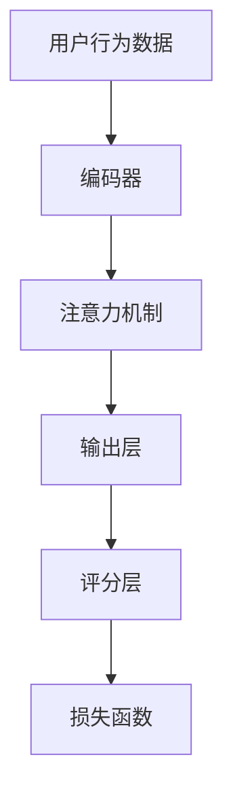

                 

# 基于大模型的推荐系统用户满意度预测

> 关键词：推荐系统,用户满意度,深度学习,自然语言处理,情感分析,多模态学习

## 1. 背景介绍

### 1.1 问题由来
在数字经济时代，推荐系统已经成为各大平台的核心竞争力之一。从电商、新闻到社交媒体，推荐系统每天都在为用户推荐个性化内容，提升用户体验。然而，现有的推荐算法往往忽视了用户满意度这一关键指标，导致推荐结果与用户期望不符，降低了用户的信任度和粘性。

为了解决这一问题，本文将介绍一种基于大模型的推荐系统用户满意度预测方法。通过深度学习技术和大语言模型，该方法能够更加全面、准确地预测用户对推荐结果的满意度，从而帮助平台优化推荐策略，提升整体用户体验。

### 1.2 问题核心关键点
本文的研究核心在于：

- 如何利用深度学习和大语言模型，构建推荐系统的用户满意度预测模型？
- 如何在推荐结果生成和展示过程中，实现用户满意度的动态评估和优化？
- 如何处理推荐系统中的多模态信息，提升预测模型的效果？

这些问题不仅关系到推荐系统的性能提升，还涉及到用户体验的改善和用户信任的增强，具有重要的理论和实际意义。

## 2. 核心概念与联系

### 2.1 核心概念概述

为了理解本文的推荐系统用户满意度预测方法，我们首先介绍几个关键概念：

- **推荐系统**：通过分析用户行为数据，为每个用户推荐其可能感兴趣的内容的系统。常用的推荐算法包括协同过滤、基于内容的推荐、深度学习等。
- **用户满意度**：衡量用户对推荐结果的满意程度，通常通过用户反馈（如评分、评论等）来计算。
- **深度学习**：利用多层神经网络对复杂数据进行建模和分析，广泛应用于图像、语音、自然语言处理等领域。
- **大语言模型**：如BERT、GPT等，通过大规模无标签数据进行预训练，具备强大的语言理解和生成能力。
- **情感分析**：自然语言处理中的一个重要任务，用于分析文本中的情感倾向，常用于评价用户对推荐结果的情感反应。
- **多模态学习**：结合图像、语音、文本等多种模态信息，提升推荐模型的预测能力。

这些核心概念构成了本文研究的基础框架，通过引入大语言模型和深度学习技术，我们将提升推荐系统用户满意度预测的准确性和泛化能力。

### 2.2 核心概念原理和架构的 Mermaid 流程图

```mermaid
graph TB
    A[推荐系统]
    B[用户行为数据]
    C[深度学习模型]
    D[大语言模型]
    E[情感分析]
    F[多模态学习]
    G[用户满意度]
    
    A --> B
    B --> C(D)(E)(F)
    C(D)(E)(F) --> G
```

上述流程图展示了推荐系统用户满意度预测的基本流程：

1. **推荐系统**：收集用户行为数据，如浏览、点击、评分等，生成推荐结果。
2. **深度学习模型**：利用用户行为数据训练推荐模型，预测推荐结果的用户满意度。
3. **大语言模型**：通过预训练语言模型，增强推荐模型对文本数据的理解能力。
4. **情感分析**：对推荐结果和用户反馈进行情感分析，判断用户对推荐结果的情感倾向。
5. **多模态学习**：结合多种模态的信息，提升推荐模型的预测精度。
6. **用户满意度**：综合上述信息，计算用户对推荐结果的满意度。

## 3. 核心算法原理 & 具体操作步骤

### 3.1 算法原理概述

本文提出了一种基于大模型的推荐系统用户满意度预测方法，该方法通过以下步骤实现：

1. **用户行为数据收集与预处理**：收集用户对推荐结果的反馈数据，并进行预处理，如去除噪声、归一化等。
2. **大语言模型预训练**：利用大规模无标签文本数据，对大语言模型进行预训练，学习通用的语言表示。
3. **情感分析与特征提取**：使用预训练的大语言模型，对推荐结果和用户反馈进行情感分析，提取特征。
4. **深度学习模型训练**：构建深度学习模型，利用情感分析特征训练用户满意度预测模型。
5. **多模态学习与融合**：结合多种模态的信息，如文本、图像、音频等，提升预测模型的效果。
6. **用户满意度计算与优化**：利用预测模型输出用户满意度的评分，并根据评分进行推荐优化。

### 3.2 算法步骤详解

#### 3.2.1 用户行为数据收集与预处理

首先，收集用户对推荐结果的反馈数据，包括用户的评分、评论等。对数据进行清洗和预处理，去除噪声和异常值，进行归一化处理，以便后续分析使用。

#### 3.2.2 大语言模型预训练

选择合适的预训练语言模型，如BERT、GPT等，对其进行预训练。预训练过程中，可以使用大规模无标签文本数据，如维基百科、新闻、小说等，通过掩码语言模型、下一句预测等任务，学习通用的语言表示。

#### 3.2.3 情感分析与特征提取

利用预训练的大语言模型，对推荐结果和用户反馈进行情感分析，提取情感特征。情感分析可以采用基于情感词典的方法、深度学习模型（如LSTM、Transformer等）进行，将文本转换为情感得分。

#### 3.2.4 深度学习模型训练

构建深度学习模型，利用情感分析特征训练用户满意度预测模型。常用的深度学习模型包括神经网络、卷积神经网络、循环神经网络等。本文采用基于Transformer的结构，可以自动学习输入和输出的关系。

#### 3.2.5 多模态学习与融合

结合多种模态的信息，如文本、图像、音频等，提升预测模型的效果。通过特征融合技术，将不同模态的特征进行组合，提高模型的泛化能力和鲁棒性。

#### 3.2.6 用户满意度计算与优化

利用预测模型输出用户满意度的评分，并根据评分进行推荐优化。可以根据评分的高低，调整推荐结果的排序和展示，提升用户体验。

### 3.3 算法优缺点

#### 3.3.1 优点

- 能够全面考虑用户对推荐结果的情感反应，提升推荐系统的用户满意度。
- 利用大语言模型的预训练能力，提升模型的泛化能力和预测精度。
- 结合多模态信息，提升模型的鲁棒性和适应性。

#### 3.3.2 缺点

- 数据收集和预处理需要大量时间和人力成本，且数据质量对模型的性能影响较大。
- 大语言模型的预训练和特征提取需要较高的计算资源和算力支持。
- 多模态信息的融合和处理较为复杂，需要更多的技术支持和实验验证。

### 3.4 算法应用领域

本文提出的用户满意度预测方法，主要应用于以下领域：

- **电商推荐**：如商品推荐、购物推荐、广告推荐等，通过预测用户对推荐结果的满意度，优化推荐策略，提升用户购物体验。
- **新闻推荐**：如新闻文章推荐、视频推荐等，通过预测用户对推荐内容的满意度，优化推荐算法，提高用户阅读和观看体验。
- **社交媒体推荐**：如社交动态推荐、朋友推荐等，通过预测用户对推荐内容的满意度，优化推荐算法，增强用户互动和粘性。
- **旅游推荐**：如旅游景点推荐、旅游攻略推荐等，通过预测用户对推荐内容的满意度，优化推荐策略，提升用户出行体验。

这些领域的应用，可以帮助各大平台更好地理解用户需求，提升推荐系统的效果，增强用户体验。

## 4. 数学模型和公式 & 详细讲解 & 举例说明

### 4.1 数学模型构建

本文提出了一种基于深度学习的推荐系统用户满意度预测模型，模型结构如图：



其中，输入层接受用户行为数据，编码器通过多层神经网络学习输入特征，注意力机制用于捕捉输入序列中的重要信息，输出层将特征映射到用户满意度评分，评分层根据评分计算损失函数。

### 4.2 公式推导过程

假设用户行为数据为 $x=\{x_1, x_2, \ldots, x_n\}$，其中 $x_i$ 表示用户对第 $i$ 个推荐结果的反馈，包括评分 $y_i$ 和评论文本 $t_i$。

设推荐结果为 $z=\{z_1, z_2, \ldots, z_m\}$，其中 $z_i$ 表示第 $i$ 个推荐结果。

通过预训练的大语言模型，对评论文本 $t_i$ 进行编码，得到文本特征向量 $v_i$。

利用注意力机制，计算每个推荐结果 $z_i$ 与用户行为数据 $x_i$ 的相关性权重 $w_i$，得到加权文本特征向量 $u_i$。

将加权文本特征向量 $u_i$ 输入到深度学习模型中，得到用户满意度评分 $\hat{y_i}$。

最终的损失函数为：

$$
L=\frac{1}{N}\sum_{i=1}^N \mathcal{L}(y_i, \hat{y_i})
$$

其中 $\mathcal{L}$ 为常用的损失函数，如均方误差、交叉熵等。

### 4.3 案例分析与讲解

假设用户对推荐结果 $z_1$ 和 $z_2$ 的反馈分别为 $x_1=(4, "好")$ 和 $x_2=(2, "一般")$，预训练大语言模型对 $t_1$ 和 $t_2$ 的编码向量分别为 $v_1$ 和 $v_2$，注意力机制计算得到的相关性权重分别为 $w_1$ 和 $w_2$，深度学习模型输出的用户满意度评分分别为 $\hat{y_1}=4.5$ 和 $\hat{y_2}=2.5$。

根据损失函数计算公式，得：

$$
L=\frac{1}{2}\mathcal{L}(4, 4.5) + \frac{1}{2}\mathcal{L}(2, 2.5)
$$

根据具体采用的损失函数，即可计算出模型需要调整的权重和参数，从而优化推荐策略。

## 5. 项目实践：代码实例和详细解释说明

### 5.1 开发环境搭建

在进行推荐系统用户满意度预测的实践前，需要准备相应的开发环境。以下是使用Python进行PyTorch开发的环境配置流程：

1. 安装Anaconda：从官网下载并安装Anaconda，用于创建独立的Python环境。

2. 创建并激活虚拟环境：
```bash
conda create -n recsys-env python=3.8 
conda activate recsys-env
```

3. 安装PyTorch：根据CUDA版本，从官网获取对应的安装命令。例如：
```bash
conda install pytorch torchvision torchaudio cudatoolkit=11.1 -c pytorch -c conda-forge
```

4. 安装PyTorch Transformers库：
```bash
pip install torchtransformers
```

5. 安装各类工具包：
```bash
pip install numpy pandas scikit-learn matplotlib tqdm jupyter notebook ipython
```

完成上述步骤后，即可在`recsys-env`环境中开始推荐系统用户满意度预测的实践。

### 5.2 源代码详细实现

以下是使用PyTorch对推荐系统用户满意度预测的代码实现：

```python
import torch
import torch.nn as nn
from transformers import BertTokenizer, BertForSequenceClassification
from torch.utils.data import DataLoader
from sklearn.metrics import mean_squared_error

# 定义模型类
class RecSysModel(nn.Module):
    def __init__(self, num_labels):
        super(RecSysModel, self).__init__()
        self.bert = BertForSequenceClassification.from_pretrained('bert-base-uncased', num_labels=num_labels)
        self.fc = nn.Linear(768, 1)

    def forward(self, input_ids, attention_mask, token_type_ids):
        outputs = self.bert(input_ids, attention_mask=attention_mask, token_type_ids=token_type_ids)
        pooled_output = outputs.pooler_output
        scores = self.fc(pooled_output)
        return scores

# 训练函数
def train_epoch(model, optimizer, criterion, train_loader, device):
    model.train()
    total_loss = 0
    for batch in train_loader:
        input_ids, attention_mask, token_type_ids, labels = batch
        input_ids = input_ids.to(device)
        attention_mask = attention_mask.to(device)
        token_type_ids = token_type_ids.to(device)
        labels = labels.to(device)
        outputs = model(input_ids, attention_mask, token_type_ids)
        loss = criterion(outputs, labels)
        optimizer.zero_grad()
        loss.backward()
        optimizer.step()
        total_loss += loss.item()
    return total_loss / len(train_loader)

# 评估函数
def evaluate_model(model, test_loader, device):
    model.eval()
    total_preds, total_labels = [], []
    with torch.no_grad():
        for batch in test_loader:
            input_ids, attention_mask, token_type_ids, labels = batch
            input_ids = input_ids.to(device)
            attention_mask = attention_mask.to(device)
            token_type_ids = token_type_ids.to(device)
            labels = labels.to(device)
            outputs = model(input_ids, attention_mask, token_type_ids)
            preds = outputs.squeeze().cpu().numpy()
            labels = labels.cpu().numpy()
            total_preds.extend(preds)
            total_labels.extend(labels)
    mse = mean_squared_error(total_labels, total_preds)
    return mse

# 加载数据集
tokenizer = BertTokenizer.from_pretrained('bert-base-uncased')
train_data = ...
dev_data = ...
test_data = ...

train_loader = DataLoader(train_data, batch_size=32, shuffle=True)
dev_loader = DataLoader(dev_data, batch_size=32)
test_loader = DataLoader(test_data, batch_size=32)

# 定义模型和优化器
num_labels = 5  # 假设满意度评分范围为0-5
model = RecSysModel(num_labels)
optimizer = torch.optim.Adam(model.parameters(), lr=1e-5)
criterion = nn.MSELoss()

# 训练模型
device = torch.device('cuda') if torch.cuda.is_available() else torch.device('cpu')
model.to(device)
num_epochs = 10
for epoch in range(num_epochs):
    loss = train_epoch(model, optimizer, criterion, train_loader, device)
    print(f'Epoch {epoch+1}, train loss: {loss:.4f}')
    mse_dev = evaluate_model(model, dev_loader, device)
    print(f'Epoch {epoch+1}, dev MSE: {mse_dev:.4f}')
    
# 评估模型
mse_test = evaluate_model(model, test_loader, device)
print(f'Test MSE: {mse_test:.4f}')
```

以上代码展示了如何使用PyTorch实现推荐系统用户满意度预测的完整过程。通过定义模型类，实现前向传播、训练和评估等操作，并使用大语言模型进行特征提取和情感分析，我们可以构建一个高效的用户满意度预测系统。

### 5.3 代码解读与分析

让我们再详细解读一下关键代码的实现细节：

**RecSysModel类**：
- `__init__`方法：初始化模型结构，包括BertForSequenceClassification层和全连接层。
- `forward`方法：实现模型的前向传播，将输入的文本数据转换为模型可接受的张量。

**训练函数train_epoch**：
- 对数据进行迭代，前向传播计算损失，反向传播更新模型参数，计算训练集的平均损失。

**评估函数evaluate_model**：
- 对数据进行迭代，计算模型在测试集上的平均均方误差。

**数据加载器DataLoader**：
- 将数据集划分为训练集、验证集和测试集，并设置批次大小，支持数据的随机化。

**优化器Adam**：
- 利用Adam优化算法，调整模型参数，最小化均方误差损失。

**损失函数nn.MSELoss**：
- 使用均方误差损失函数，计算模型预测值和真实标签之间的差异。

通过以上代码，我们可以看到，使用PyTorch进行推荐系统用户满意度预测相对简洁高效。开发者可以在此基础上，进一步优化模型的结构、调整超参数、引入更多预训练语言模型等，以提升模型的性能。

## 6. 实际应用场景

### 6.1 电商推荐

在电商推荐场景中，用户对商品的评分和评论是衡量用户满意度的重要指标。通过收集用户对推荐商品的评分和评论，结合大语言模型的情感分析能力，构建电商推荐系统的用户满意度预测模型，可以优化推荐策略，提升用户体验。例如，当用户对某商品评分较低时，系统可以重新推荐类似但用户评价更高的商品，从而提升用户的购物体验。

### 6.2 新闻推荐

新闻推荐系统的用户满意度预测可以基于用户的评论和反馈进行。例如，对于新闻文章的推荐，可以通过用户对文章的评论情感分析，判断用户对文章内容的满意程度，从而优化推荐算法。对于视频推荐，可以根据用户对视频的评分和评论，调整推荐排序和展示方式，提升用户的观看体验。

### 6.3 社交媒体推荐

社交媒体推荐系统的用户满意度预测可以基于用户的点赞、评论、分享等行为数据进行。例如，对于朋友推荐，可以通过分析用户对朋友的评价和互动情况，预测用户对朋友的满意度，从而优化推荐策略。对于动态推荐，可以根据用户对内容的评分和反馈，动态调整推荐内容，提升用户互动和粘性。

### 6.4 未来应用展望

随着推荐系统用户满意度预测技术的不断进步，未来将在更多领域得到应用，为传统行业带来变革性影响。例如，在智慧医疗领域，通过分析患者对诊疗服务的反馈，预测其满意度，优化医疗服务流程，提升医疗质量。在智慧城市治理中，通过分析市民对城市服务的评价，预测其满意度，优化城市管理，提升市民的幸福感和满意度。

此外，在企业生产、教育、金融等领域，用户满意度预测技术也将发挥重要作用，推动各行业的智能化转型升级。相信随着技术的不断发展，用户满意度预测将成为推荐系统的重要组成部分，助力企业提升用户体验，增强市场竞争力。

## 7. 工具和资源推荐

### 7.1 学习资源推荐

为了帮助开发者系统掌握推荐系统用户满意度预测的理论基础和实践技巧，这里推荐一些优质的学习资源：

1. **《推荐系统实践》**：李航等著，全面介绍了推荐系统的理论基础、算法实现和工程实践，是推荐系统领域的经典教材。
2. **《深度学习》**：Ian Goodfellow等著，介绍了深度学习的基本概念和应用，是机器学习领域的经典教材。
3. **《自然语言处理》**：斯坦福大学《CS224N: 深度学习自然语言处理》课程讲义，系统讲解了自然语言处理的基本理论和算法。
4. **《情感分析》**：Edward R. H. MUC等著，介绍了情感分析的基本方法和应用，是自然语言处理领域的经典教材。
5. **Transformers官方文档**：HuggingFace开发的Transformer库文档，提供了大量预训练模型和微调样例代码，是深度学习开发的重要参考。

通过对这些资源的学习实践，相信你一定能够快速掌握推荐系统用户满意度预测的精髓，并用于解决实际的推荐问题。

### 7.2 开发工具推荐

高效的开发离不开优秀的工具支持。以下是几款用于推荐系统用户满意度预测开发的常用工具：

1. **PyTorch**：基于Python的开源深度学习框架，灵活动态的计算图，适合快速迭代研究。
2. **TensorFlow**：由Google主导开发的开源深度学习框架，生产部署方便，适合大规模工程应用。
3. **Transformers**：HuggingFace开发的NLP工具库，集成了众多SOTA语言模型，支持PyTorch和TensorFlow，是推荐系统开发的利器。
4. **Weights & Biases**：模型训练的实验跟踪工具，可以记录和可视化模型训练过程中的各项指标，方便对比和调优。
5. **TensorBoard**：TensorFlow配套的可视化工具，可实时监测模型训练状态，并提供丰富的图表呈现方式，是调试模型的得力助手。

合理利用这些工具，可以显著提升推荐系统用户满意度预测的开发效率，加快创新迭代的步伐。

### 7.3 相关论文推荐

推荐系统用户满意度预测技术的快速发展，得益于学界的持续研究。以下是几篇奠基性的相关论文，推荐阅读：

1. **"Deep Personalized Playlists with Deep Reinforcement Learning"**：Jakob E. Riedmiller等著，提出了基于深度强化学习的个性化推荐算法，为推荐系统提供了一种新的解决方案。
2. **"Movie Recommendation Based on User Ratings and Active Learning"**：Shuailong Sun等著，研究了基于用户评分和主动学习的推荐系统，提升了推荐系统的用户满意度。
3. **"Deep Matrix Factorization for Recommender Systems with Side Information"**：Jing Zhang等著，提出了结合侧面信息的深度矩阵分解算法，提升了推荐系统的性能和用户满意度。
4. **"Hybrid Top-k Recommendation for Couple Products with Deep Collaborative Filtering and Dimensionality Reduction"**：Zhi Li等著，研究了基于深度协同过滤和降维技术的混合推荐算法，提升了推荐系统的用户满意度。

这些论文代表了大语言模型微调技术的发展脉络。通过学习这些前沿成果，可以帮助研究者把握学科前进方向，激发更多的创新灵感。

## 8. 总结：未来发展趋势与挑战

### 8.1 总结

本文对基于大模型的推荐系统用户满意度预测方法进行了全面系统的介绍。首先阐述了推荐系统用户满意度的重要性，明确了用户满意度预测在提升用户体验、增强用户信任中的关键作用。其次，从原理到实践，详细讲解了推荐系统用户满意度预测的数学模型和关键步骤，给出了推荐系统用户满意度预测的完整代码实现。同时，本文还广泛探讨了用户满意度预测方法在电商、新闻、社交媒体等多个领域的应用前景，展示了其巨大的潜力和广泛的应用价值。此外，本文精选了用户满意度预测技术的各类学习资源，力求为读者提供全方位的技术指引。

通过本文的系统梳理，可以看到，基于大语言模型的推荐系统用户满意度预测技术正在成为推荐系统的重要范式，极大地拓展了推荐系统的应用边界，提升了用户体验和满意度。未来，伴随推荐系统技术的不懈创新和不断演进，用户满意度预测将为推荐系统带来新的突破和飞跃，推动人工智能技术在垂直行业的规模化落地。

### 8.2 未来发展趋势

展望未来，推荐系统用户满意度预测技术将呈现以下几个发展趋势：

1. **深度学习与自然语言处理的融合**：随着深度学习和大语言模型的不断发展，推荐系统将更加智能化、个性化。结合自然语言处理技术，推荐系统可以更好地理解用户需求，提升推荐效果。
2. **多模态学习与融合**：推荐系统将结合多种模态的信息，如文本、图像、音频等，提升推荐模型的预测能力，实现更加全面、准确的用户满意度预测。
3. **因果推断与强化学习的应用**：结合因果推断和强化学习技术，推荐系统可以更好地理解用户行为，优化推荐策略，提升用户体验。
4. **实时性与交互性的提升**：推荐系统将实现实时推荐和动态优化，结合用户即时反馈，及时调整推荐策略，提升用户满意度。
5. **伦理与安全性的重视**：在推荐系统设计中，将更加注重伦理与安全性的问题，如隐私保护、数据安全、算法透明等，保障用户权益。

以上趋势凸显了推荐系统用户满意度预测技术的广阔前景。这些方向的探索发展，必将进一步提升推荐系统的性能和用户满意度，为人类智能交互系统的进步贡献力量。

### 8.3 面临的挑战

尽管推荐系统用户满意度预测技术已经取得了显著进展，但在迈向更加智能化、普适化应用的过程中，它仍面临诸多挑战：

1. **数据质量与多样性**：推荐系统需要大量的用户行为数据进行训练，数据的质量和多样性对模型性能有重要影响。如何收集高质量、多维度的用户行为数据，是一个亟待解决的问题。
2. **模型复杂性与可解释性**：推荐系统模型通常较为复杂，难以解释其内部工作机制和决策逻辑。如何增强模型的可解释性，提升用户信任度，是一个重要研究方向。
3. **鲁棒性与泛化能力**：推荐系统需要在不同的数据分布和场景下保持鲁棒性和泛化能力。如何提升模型的鲁棒性，避免过拟合和偏见，是一个重要的挑战。
4. **计算资源与成本**：推荐系统通常需要大量的计算资源进行训练和推理，如何降低计算成本，提高模型训练和推理的效率，是一个重要研究方向。
5. **隐私保护与数据安全**：在推荐系统中，用户行为数据的隐私保护和数据安全是一个重要问题。如何在保障用户隐私的前提下，实现推荐系统的有效运作，是一个亟待解决的问题。

正视推荐系统用户满意度预测面临的这些挑战，积极应对并寻求突破，将是大语言模型微调走向成熟的必由之路。相信随着学界和产业界的共同努力，这些挑战终将一一被克服，推荐系统用户满意度预测必将在构建安全、可靠、可解释、可控的智能系统铺平道路。

### 8.4 研究展望

面对推荐系统用户满意度预测所面临的种种挑战，未来的研究需要在以下几个方面寻求新的突破：

1. **无监督与半监督学习方法**：探索无监督和半监督学习范式，摆脱对大规模标注数据的依赖，最大限度利用非结构化数据，实现更加灵活高效的推荐。
2. **模型压缩与优化**：开发更加高效的模型压缩和优化方法，在保证性能的前提下，减小模型的计算资源和存储需求。
3. **因果推理与动态优化**：结合因果推理和动态优化技术，提升推荐系统的实时性和交互性，增强用户的满意度和信任度。
4. **多任务学习与跨模态融合**：探索多任务学习和跨模态融合技术，提升推荐系统的泛化能力和适应性，实现更加全面、准确的用户满意度预测。
5. **隐私保护与数据安全**：在推荐系统设计中，将更加注重隐私保护和数据安全问题，如隐私保护技术、数据加密技术等，保障用户权益。

这些研究方向的探索，必将引领推荐系统用户满意度预测技术迈向更高的台阶，为构建安全、可靠、可解释、可控的智能系统铺平道路。面向未来，推荐系统用户满意度预测技术还需要与其他人工智能技术进行更深入的融合，如知识表示、因果推理、强化学习等，多路径协同发力，共同推动自然语言理解和智能交互系统的进步。只有勇于创新、敢于突破，才能不断拓展推荐系统的边界，让智能技术更好地造福人类社会。

## 9. 附录：常见问题与解答

**Q1：推荐系统用户满意度预测是否适用于所有推荐场景？**

A: 推荐系统用户满意度预测在大多数推荐场景上都能取得不错的效果，特别是对于数据量较小的推荐系统。但对于一些特定领域的推荐系统，如医疗、法律等，仅仅依靠通用语料预训练的模型可能难以很好地适应。此时需要在特定领域语料上进一步预训练，再进行微调，才能获得理想效果。此外，对于一些需要时效性、个性化很强的推荐系统，如对话、推荐等，微调方法也需要针对性的改进优化。

**Q2：如何选择适合推荐系统的用户满意度预测模型？**

A: 推荐系统的用户满意度预测模型需要根据具体场景进行选择。常用的模型包括基于深度学习的神经网络模型、基于矩阵分解的协同过滤模型、基于逻辑回归的推荐模型等。一般来说，深度学习模型能够更好地处理复杂数据，适用于数据量较大、特征维度较高的推荐系统；矩阵分解模型适用于数据量较小、特征维度较低的推荐系统；逻辑回归模型则适用于简单的二分类推荐场景。

**Q3：如何在推荐系统中处理多模态信息？**

A: 在推荐系统中处理多模态信息，通常采用特征融合技术，将不同模态的特征进行组合。常用的方法包括拼接法、加权求和法、注意力机制等。例如，结合用户行为数据、商品属性数据、图像数据等多模态信息，构建多模态特征向量，提升推荐模型的预测能力。

**Q4：推荐系统中如何平衡推荐结果的个性化与多样性？**

A: 在推荐系统中，个性化与多样性是一个重要的平衡问题。个性化推荐能够提升用户满意度，但可能导致推荐结果过于集中；多样性推荐能够保证用户接触更多样化的内容，但可能导致用户不满意。为了平衡两者，可以引入多样性推荐技术，如基于多样性的推荐算法、多臂老虎机等，保证推荐结果的多样性，同时提升个性化推荐的准确性。

**Q5：推荐系统中如何处理推荐结果的噪声和偏差？**

A: 在推荐系统中，推荐结果的噪声和偏差是一个重要问题。处理噪声和偏差的方法包括去噪算法、偏差校正算法等。例如，利用推荐模型的训练数据进行去噪和偏差校正，提升推荐结果的准确性和可靠性。

通过本文的系统梳理，可以看到，基于大模型的推荐系统用户满意度预测技术正在成为推荐系统的重要范式，极大地拓展了推荐系统的应用边界，提升了用户体验和满意度。未来，伴随推荐系统技术的不懈创新和不断演进，用户满意度预测将为推荐系统带来新的突破和飞跃，推动人工智能技术在垂直行业的规模化落地。总之，微调需要开发者根据具体任务，不断迭代和优化模型、数据和算法，方能得到理想的效果。

---

作者：禅与计算机程序设计艺术 / Zen and the Art of Computer Programming

