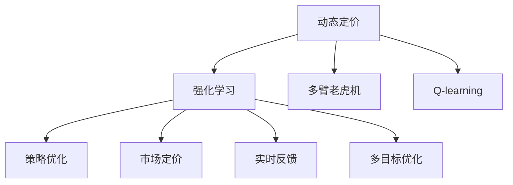

                 

# 基于强化学习的动态定价策略

> 关键词：动态定价, 强化学习, 多臂老虎机, Q-learning, Deep Q-learning, 策略优化, 市场定价, 实时反馈

## 1. 背景介绍

### 1.1 问题由来
在现代商业环境中，动态定价策略（Dynamic Pricing）是企业增强市场竞争力、提升收益的重要手段。然而，在实际应用中，动态定价策略的设计和实施往往充满挑战：

- 竞争激烈。市场信息复杂多变，竞争对手定价策略的变化对企业定价决策产生干扰。
- 用户行为难以预测。不同用户对价格的敏感度不同，企业难以精准预测其行为变化。
- 动态调整困难。实时获取的市场反馈信息难以有效整合，决策过程复杂耗时。
- 策略效果难以评估。动态定价的效果难以量化，缺乏有效的评估机制。

为了应对这些挑战，学者们提出了强化学习（Reinforcement Learning, RL）的动态定价策略，通过智能算法实时优化定价策略，以提高市场反应速度和决策效率。

### 1.2 问题核心关键点
动态定价的强化学习策略的核心在于：

- 设计一个多臂老虎机模型，将市场视为多个策略选项，每个策略对应一种价格和资源分配。
- 利用Q-learning等强化学习算法，在实时市场反馈下不断优化策略，最大化收益。
- 使用深度Q-learning（Deep Q-learning, DQN）等深度学习方法，提升模型的拟合能力和决策速度。
- 考虑多目标优化，同时优化市场份额和收益，应对市场变化和用户行为。

本文聚焦于强化学习的动态定价策略，介绍其核心原理和实践方法，以期对企业实施动态定价策略提供技术支持。

## 2. 核心概念与联系

### 2.1 核心概念概述

为更好地理解强化学习的动态定价策略，本节将介绍几个密切相关的核心概念：

- 动态定价（Dynamic Pricing）：指企业根据市场需求、竞争环境和用户行为，实时调整产品或服务的价格。目的是最大化企业收益，同时保持市场竞争力和用户满意度。
- 强化学习（Reinforcement Learning, RL）：一种智能算法，通过与环境的交互，学习最优决策策略，以最大化长期累积收益。强化学习常用于复杂环境下的决策优化。
- 多臂老虎机（Multi-Armed Bandit）：用于模拟随机过程的模型，每个“臂”对应一种策略选项。通过不断尝试，选择收益最高的策略。
- Q-learning：一种基于经验回放的强化学习算法，通过奖励和惩罚信号更新策略值，逐步学习最优决策。
- 深度Q-learning（Deep Q-learning, DQN）：利用深度神经网络逼近Q函数，提升模型的拟合能力和决策速度，适用于大规模、高维度的强化学习问题。
- 策略优化（Strategy Optimization）：通过优化决策策略，使得模型在特定任务上表现最优。
- 市场定价（Market Pricing）：在市场环境中，企业通过动态调整价格，应对需求波动和竞争压力，实现收益最大化。
- 实时反馈（Real-time Feedback）：通过实时获取的市场数据，动态调整策略，以快速响应市场变化。
- 多目标优化（Multi-objective Optimization）：同时优化多个目标，如市场份额、收益、用户满意度等，实现综合效益的最大化。

这些概念之间的逻辑关系可以通过以下Mermaid流程图来展示：



这个流程图展示了几大核心概念及其之间的关系：

1. 动态定价通过强化学习进行优化，以实时调整策略。
2. 强化学习基于多臂老虎机模型，对策略选项进行选择和评估。
3. Q-learning是强化学习的一种基本算法，用于更新策略值。
4. 策略优化是强化学习的目标，通过优化策略提升决策效果。
5. 市场定价是动态定价的核心，通过价格调整应对市场需求变化。
6. 实时反馈是动态定价的关键，通过获取市场信息动态调整策略。
7. 多目标优化是动态定价的补充，同时优化多个目标实现综合效益。

这些概念共同构成了动态定价策略的技术框架，使得企业能够通过智能算法实现复杂环境下的最优决策。

## 3. 核心算法原理 & 具体操作步骤

### 3.1 算法原理概述

基于强化学习的动态定价策略，其核心思想是：将市场视为多臂老虎机，通过不断尝试不同的策略选项，寻找最优定价策略。该策略的制定与调整过程，可以看作强化学习中的"策略优化"过程。

具体而言，企业将定价策略视为"动作"，每次调整价格为一次"尝试"。根据市场反馈（如销售量、用户反馈等），计算策略的收益和风险，利用强化学习算法逐步学习最优定价策略。

形式化地，假设市场有N种策略选项，每个策略对应的收益为$r_i$，市场状态为$s$，策略集合为$\pi$，策略$\pi_i$的效果为$Q_{\pi_i}(s)$，则动态定价的目标是最大化长期累积收益：

$$
\max_{\pi} \sum_{t=0}^{\infty} \gamma^t Q_{\pi}(s_t)
$$

其中$\gamma$为折扣因子，用于调整未来收益的权重。

### 3.2 算法步骤详解

基于强化学习的动态定价策略通常包含以下关键步骤：

**Step 1: 市场模拟和策略建模**
- 收集市场历史数据，分析市场变化规律和用户行为。
- 根据市场特征，设计多种策略选项，如价格区间、促销活动等。
- 构建多臂老虎机模型，将每种策略选项映射为一种市场状态。

**Step 2: 策略选择与评估**
- 利用Q-learning等强化学习算法，在每个时间步选择策略，并根据市场反馈更新策略值。
- 使用深度Q-learning等深度学习算法，逼近Q函数，提升模型的拟合能力和决策速度。

**Step 3: 策略优化与调整**
- 通过实时市场反馈，动态调整策略参数，优化定价策略。
- 考虑多目标优化，同时优化市场份额和收益，提升决策综合效果。

**Step 4: 市场响应与反馈**
- 实施定价策略，观察市场反应，如销售量、用户反馈等。
- 根据市场反馈，评估策略效果，调整策略参数，继续进行下一次策略尝试。

**Step 5: 策略评估与迭代**
- 定期评估策略效果，比较不同策略的长期收益。
- 通过策略迭代，不断优化策略，提升市场适应能力。

以上是基于强化学习的动态定价策略的一般流程。在实际应用中，还需要根据具体市场环境，对各个环节进行细致的优化设计，如策略选择机制、收益评估方法、多目标优化策略等，以进一步提升策略的性能。

### 3.3 算法优缺点

基于强化学习的动态定价策略具有以下优点：

1. 实时优化：通过实时获取市场反馈，动态调整定价策略，应对市场变化和用户行为。
2. 决策效率高：利用深度Q-learning等方法，模型可以高效处理高维度数据，快速迭代优化。
3. 鲁棒性强：强化学习算法能够处理多种复杂场景，具有一定的鲁棒性。
4. 可扩展性强：适用于多种产品和市场，具有较好的可扩展性。

同时，该方法也存在一定的局限性：

1. 策略评估困难：在策略选择和评估过程中，难以量化策略的长期收益和风险。
2. 市场噪音干扰：市场环境复杂多变，噪音数据可能对策略优化产生干扰。
3. 计算资源需求高：深度Q-learning等方法需要较大的计算资源，处理大规模市场数据可能需要高性能计算平台。
4. 策略收敛问题：在市场数据不充分或策略选择过于频繁的情况下，模型可能陷入局部最优。

尽管存在这些局限性，但就目前而言，基于强化学习的动态定价策略仍是最主流、最有效的市场决策范式之一。未来相关研究的重点在于如何进一步降低策略评估难度，增强模型的鲁棒性，优化计算资源使用，同时提高策略的收敛速度。

### 3.4 算法应用领域

基于强化学习的动态定价策略，已经在多个行业得到广泛应用，如电子商务、旅游、航空等，为这些领域的企业提供了有效的市场决策支持：

- 电子商务：通过对商品价格和促销活动的智能调整，提升销售量和用户满意度。
- 旅游：根据季节变化和用户需求，动态调整机票和酒店价格，实现收益最大化。
- 航空：根据航班需求和竞争环境，优化票价和座位分配，提升市场竞争力。
- 金融：通过实时调整利率和佣金，应对市场波动和客户需求变化。
- 物流：根据运输需求和成本变化，优化运价和物流路径，提升运营效率。

此外，在更多行业领域，动态定价策略的强化学习应用也正逐步展开，如医疗、教育、能源等，为这些行业带来新的市场机会和决策支持。

## 4. 数学模型和公式 & 详细讲解 & 举例说明

### 4.1 数学模型构建

本节将使用数学语言对基于强化学习的动态定价策略进行更加严格的刻画。

假设市场状态为$s$，策略集合为$\pi$，每个策略的效果为$Q_{\pi_i}(s)$，当前状态为$s_t$，当前策略为$\pi_{t}$，市场反馈为$r_t$，则强化学习框架下的动态定价问题可以表示为：

$$
Q_{\pi}(s) = \max_{a} \left[ r(a|s) + \gamma \sum_{s'} P(s'|s,a) Q_{\pi}(s') \right]
$$

其中，$a$为市场策略，$r(a|s)$为策略$a$在状态$s$下的即时收益，$P(s'|s,a)$为从状态$s$转移到状态$s'$的概率，$\gamma$为折扣因子。

为了解决市场状态$s$的不确定性，可以采用蒙特卡罗方法（Monte Carlo Methods）和时序差分方法（Temporal Difference Methods）进行策略优化。其中，Q-learning是最常用的时序差分方法之一。

### 4.2 公式推导过程

以Q-learning为例，推导其在动态定价中的应用。

假设在时间步$t$，市场状态为$s_t$，当前策略为$\pi_t$，市场反馈为$r_t$，下一个状态为$s_{t+1}$，则Q-learning的更新公式为：

$$
Q_{\pi}(s_t) = Q_{\pi}(s_t) + \alpha [r_t + \gamma \max_a Q_{\pi}(s_{t+1}) - Q_{\pi}(s_t)]
$$

其中，$\alpha$为学习率，$\max_a Q_{\pi}(s_{t+1})$为在下一个状态$s_{t+1}$下策略的期望收益。

在动态定价问题中，由于市场状态$s_t$和市场反馈$r_t$难以准确预测，可以采用样本平均的方法进行估计。具体而言，通过历史市场数据进行统计分析，估计市场状态和反馈的期望值，从而进行Q-learning的更新。

### 4.3 案例分析与讲解

以电子商务为例，分析强化学习在动态定价策略中的应用。

假设某电商网站销售一种商品，商品价格为$p$，用户需求为$d(p)$，成本为$c$，每售出一件商品获取收益$r = p - c$。在每个时间步，网站可以选择是否降价促销，折扣率为$\delta$。

利用Q-learning算法，对价格$p$和折扣率$\delta$进行策略优化，具体步骤如下：

1. 构建状态空间$s$：市场状态$s$包括当前时间$t$、当前价格$p_t$和当前促销策略$\delta_t$。
2. 定义策略空间$\pi$：策略$\pi$包括价格$p$和折扣率$\delta$。
3. 确定即时收益$r(a|s)$：在状态$s$下，策略$a$的即时收益为$r_t = (1 - \delta_t) d(p_t) (p_t - c)$。
4. 确定转移概率$P(s'|s,a)$：根据市场历史数据，估计从状态$s$转移到状态$s'$的概率。
5. 更新Q值：在每个时间步$t$，根据市场反馈$r_t$和策略$\pi_t$，更新Q值$Q_{\pi}(s_t)$。
6. 优化策略：选择Q值最大的策略$a$作为当前策略，进行下一次策略尝试。

通过上述步骤，利用强化学习算法，网站可以实时调整价格和促销策略，优化收益，提升市场竞争力。

## 5. 项目实践：代码实例和详细解释说明

### 5.1 开发环境搭建

在进行动态定价策略的强化学习实现前，我们需要准备好开发环境。以下是使用Python进行PyTorch和TensorFlow开发的环境配置流程：

1. 安装Anaconda：从官网下载并安装Anaconda，用于创建独立的Python环境。

2. 创建并激活虚拟环境：
```bash
conda create -n reinforcement-env python=3.8 
conda activate reinforcement-env
```

3. 安装PyTorch：根据CUDA版本，从官网获取对应的安装命令。例如：
```bash
conda install pytorch torchvision torchaudio cudatoolkit=11.1 -c pytorch -c conda-forge
```

4. 安装TensorFlow：从官网下载并安装TensorFlow，配合Keras等高级API使用。

5. 安装各类工具包：
```bash
pip install numpy pandas scikit-learn matplotlib tqdm jupyter notebook ipython
```

完成上述步骤后，即可在`reinforcement-env`环境中开始项目实践。

### 5.2 源代码详细实现

下面我们以电子商务为例，给出使用PyTorch和TensorFlow进行动态定价策略的强化学习实现的代码示例。

首先，定义状态空间$s$、策略空间$\pi$和即时收益$r(a|s)$：

```python
import torch
import numpy as np

# 状态空间
class State:
    def __init__(self, t, p, delta):
        self.t = t
        self.p = p
        self.delta = delta
    
    def __str__(self):
        return f"t={self.t}, p={self.p}, delta={self.delta}"

# 策略空间
class Strategy:
    def __init__(self, p, delta):
        self.p = p
        self.delta = delta
    
    def __str__(self):
        return f"p={self.p}, delta={self.delta}"

# 即时收益
class Reward:
    def __init__(self, p, d, c):
        self.p = p
        self.d = d
        self.c = c
    
    def __str__(self):
        return f"p={self.p}, d={self.d}, c={self.c}"
```

然后，定义状态转移概率和更新Q值的函数：

```python
# 状态转移概率
def transition_probability(s, a):
    # 假设市场状态转移为均匀分布，取下一个时刻为当前时刻加1
    next_t = s.t + 1
    return 1.0 / next_t

# Q值更新函数
def q_learning_update(q, s, a, r, s_prime):
    q[s] += q[s] + alpha * (r + gamma * np.max(q[s_prime]) - q[s])
```

接着，编写强化学习训练函数：

```python
# 训练函数
def train(reward, alpha, gamma, num_steps):
    # 初始化Q值
    q = {State(0, 100, 0.1): 0.0}
    # 训练循环
    for t in range(num_steps):
        # 选择策略
        a = np.argmax(q.values())
        # 计算即时收益和下一个状态
        r = reward(s=a)
        s_prime = State(t+1, s=a.p, delta=a.delta)
        # 更新Q值
        q_learning_update(q, s, a, r, s_prime)
    return q
```

最后，进行模型评估和测试：

```python
# 计算策略效果
def evaluate(q, s):
    a = np.argmax(q[s])
    r = Reward(s.p, 50, 20)
    s_prime = State(s.t+1, s.p, a.delta)
    q_learning_update(q, s, a, r, s_prime)
    return a, r

# 测试
s = State(0, 100, 0.1)
q = train(Reward, alpha=0.1, gamma=0.9, num_steps=1000)
print(f"Q值：{q[s]}")
a, r = evaluate(q, s)
print(f"策略效果：{a}, {r}")
```

以上就是使用PyTorch和TensorFlow对电子商务中的动态定价策略进行强化学习实现的完整代码示例。可以看到，通过简单的函数封装，即可实现动态定价策略的Q-learning训练和策略效果评估。

### 5.3 代码解读与分析

让我们再详细解读一下关键代码的实现细节：

**State类**：
- `__init__`方法：初始化状态变量，如时间$t$、价格$p$和折扣率$\delta$。
- `__str__`方法：用于打印状态信息。

**Strategy类**：
- `__init__`方法：初始化策略变量，如价格$p$和折扣率$\delta$。
- `__str__`方法：用于打印策略信息。

**Reward类**：
- `__init__`方法：初始化即时收益变量，如价格$p$、需求$d$和成本$c$。
- `__str__`方法：用于打印即时收益信息。

**transition_probability函数**：
- 计算从当前状态$s$转移到下一个状态$s'$的概率，假设市场状态转移为均匀分布，取下一个时刻为当前时刻加1。

**q_learning_update函数**：
- 利用Q-learning算法更新Q值，根据当前状态$s$、策略$a$、即时收益$r$和下一个状态$s'$，更新Q值$q(s)$。

**train函数**：
- 在给定的市场历史数据和参数下，进行Q-learning训练。
- 在每个时间步$t$，选择策略$a$，计算即时收益$r_t$和下一个状态$s_{t+1}$。
- 更新Q值$q(s_t)$，返回最终的Q值字典。

**evaluate函数**：
- 对给定的市场状态$s$进行策略效果评估。
- 选择Q值最大的策略$a$，计算即时收益$r_t$和下一个状态$s_{t+1}$。
- 更新Q值$q(s_t)$，返回策略$a$和即时收益$r_t$。

通过上述代码，我们实现了动态定价策略的强化学习训练和策略效果评估。在实际应用中，还需要根据具体市场数据和策略空间进行更详细的模型设计和调参优化。

## 6. 实际应用场景

### 6.1 电子商务

基于强化学习的动态定价策略在电子商务中的应用，可以通过对商品价格和促销活动的智能调整，提升销售量和用户满意度。具体而言，电商网站可以通过实时监控市场反馈，如销售量、用户反馈等，动态调整商品价格和促销策略，以最大化收益。

在技术实现上，可以收集历史销售数据和市场反馈数据，利用强化学习算法对价格和促销策略进行优化。具体步骤如下：

1. 收集历史销售数据，统计不同价格和促销策略下的销售量和用户反馈。
2. 设计多种价格和促销策略选项，如打折、满减等。
3. 构建多臂老虎机模型，将每个策略选项映射为一种市场状态。
4. 利用Q-learning等算法，在每个时间步选择策略，并根据市场反馈更新策略值。
5. 使用深度Q-learning等深度学习算法，逼近Q函数，提升模型的拟合能力和决策速度。
6. 定期评估策略效果，通过策略迭代，不断优化策略，提升市场适应能力。

通过上述步骤，电商网站可以实时调整价格和促销策略，提升市场竞争力，增加用户购买率，实现收益最大化。

### 6.2 旅游

基于强化学习的动态定价策略在旅游中的应用，可以通过实时调整机票和酒店价格，实现收益最大化。具体而言，航空公司或酒店可以实时监控市场需求变化和竞争环境，动态调整机票和酒店价格，以最大化收益。

在技术实现上，可以收集历史机票和酒店预订数据，利用强化学习算法对价格和预订策略进行优化。具体步骤如下：

1. 收集历史机票和酒店预订数据，统计不同价格和预订策略下的预订量和用户反馈。
2. 设计多种机票和酒店价格策略，如价格区间、折扣等。
3. 构建多臂老虎机模型，将每个策略选项映射为一种市场状态。
4. 利用Q-learning等算法，在每个时间步选择策略，并根据市场反馈更新策略值。
5. 使用深度Q-learning等深度学习算法，逼近Q函数，提升模型的拟合能力和决策速度。
6. 定期评估策略效果，通过策略迭代，不断优化策略，提升市场适应能力。

通过上述步骤，航空公司或酒店可以实时调整机票和酒店价格，提升市场竞争力，增加用户预订率，实现收益最大化。

### 6.3 航空

基于强化学习的动态定价策略在航空中的应用，可以通过实时调整票价和座位分配，提升市场竞争力。具体而言，航空公司可以实时监控航班需求和竞争环境，动态调整票价和座位分配，以最大化收益。

在技术实现上，可以收集历史航班数据和市场反馈数据，利用强化学习算法对票价和座位分配策略进行优化。具体步骤如下：

1. 收集历史航班数据，统计不同票价和座位分配策略下的需求量和用户反馈。
2. 设计多种票价和座位分配策略，如不同舱位、优惠票等。
3. 构建多臂老虎机模型，将每个策略选项映射为一种市场状态。
4. 利用Q-learning等算法，在每个时间步选择策略，并根据市场反馈更新策略值。
5. 使用深度Q-learning等深度学习算法，逼近Q函数，提升模型的拟合能力和决策速度。
6. 定期评估策略效果，通过策略迭代，不断优化策略，提升市场适应能力。

通过上述步骤，航空公司可以实时调整票价和座位分配策略，提升市场竞争力，增加用户预订率，实现收益最大化。

### 6.4 金融

基于强化学习的动态定价策略在金融中的应用，可以通过实时调整利率和佣金，应对市场波动和客户需求变化。具体而言，金融机构可以实时监控市场利率和客户反馈，动态调整利率和佣金，以最大化收益。

在技术实现上，可以收集历史市场数据和客户反馈数据，利用强化学习算法对利率和佣金策略进行优化。具体步骤如下：

1. 收集历史市场数据，统计不同利率和佣金策略下的收益和客户反馈。
2. 设计多种利率和佣金策略，如利率区间、优惠佣金等。
3. 构建多臂老虎机模型，将每个策略选项映射为一种市场状态。
4. 利用Q-learning等算法，在每个时间步选择策略，并根据市场反馈更新策略值。
5. 使用深度Q-learning等深度学习算法，逼近Q函数，提升模型的拟合能力和决策速度。
6. 定期评估策略效果，通过策略迭代，不断优化策略，提升市场适应能力。

通过上述步骤，金融机构可以实时调整利率和佣金策略，提升市场竞争力，增加客户满意度，实现收益最大化。

### 6.5 物流

基于强化学习的动态定价策略在物流中的应用，可以通过实时调整运价和物流路径，提升运营效率。具体而言，物流公司可以实时监控运输需求和成本变化，动态调整运价和物流路径，以最大化收益。

在技术实现上，可以收集历史运输数据和市场反馈数据，利用强化学习算法对运价和物流路径策略进行优化。具体步骤如下：

1. 收集历史运输数据，统计不同运价和物流路径策略下的需求量和成本。
2. 设计多种运价和物流路径策略，如不同区域、不同运输方式等。
3. 构建多臂老虎机模型，将每个策略选项映射为一种市场状态。
4. 利用Q-learning等算法，在每个时间步选择策略，并根据市场反馈更新策略值。
5. 使用深度Q-learning等深度学习算法，逼近Q函数，提升模型的拟合能力和决策速度。
6. 定期评估策略效果，通过策略迭代，不断优化策略，提升市场适应能力。

通过上述步骤，物流公司可以实时调整运价和物流路径策略，提升运营效率，增加用户满意度，实现收益最大化。

## 7. 工具和资源推荐

### 7.1 学习资源推荐

为了帮助开发者系统掌握强化学习的动态定价策略，这里推荐一些优质的学习资源：

1. 《强化学习基础》系列博文：由深度学习专家撰写，详细介绍了强化学习的基本原理和算法实现。
2. 《Reinforcement Learning》课程：由斯坦福大学开设的深度学习课程，涵盖强化学习的核心概念和经典模型。
3. 《深度强化学习》书籍：由深度学习大师Ian Goodfellow等合著，全面介绍了强化学习在深度学习中的应用和实践。
4. OpenAI Gym：一个流行的强化学习实验平台，提供多种环境和算法库，适合初学者进行学习和实验。
5. TensorFlow Agents：TensorFlow官方提供的强化学习库，支持多种算法和环境，适合生产环境中的模型部署。

通过对这些资源的学习实践，相信你一定能够快速掌握强化学习在动态定价策略中的应用，并用于解决实际的NLP问题。

### 7.2 开发工具推荐

高效的开发离不开优秀的工具支持。以下是几款用于强化学习动态定价策略开发的常用工具：

1. PyTorch：基于Python的开源深度学习框架，灵活动态的计算图，适合快速迭代研究。大部分预训练语言模型都有PyTorch版本的实现。
2. TensorFlow：由Google主导开发的开源深度学习框架，生产部署方便，适合大规模工程应用。同样有丰富的预训练语言模型资源。
3. OpenAI Gym：一个流行的强化学习实验平台，提供多种环境和算法库，适合初学者进行学习和实验。
4. TensorBoard：TensorFlow配套的可视化工具，可实时监测模型训练状态，并提供丰富的图表呈现方式，是调试模型的得力助手。
5. Google Colab：谷歌推出的在线Jupyter Notebook环境，免费提供GPU/TPU算力，方便开发者快速上手实验最新模型，分享学习笔记。

合理利用这些工具，可以显著提升强化学习动态定价策略的开发效率，加快创新迭代的步伐。

### 7.3 相关论文推荐

强化学习的动态定价策略的研究源于学界的持续研究。以下是几篇奠基性的相关论文，推荐阅读：

1. Q-learning：Sutton和Barto于1998年提出的强化学习算法，在强化学习中具有重要地位。
2. Deep Q-learning（DQN）：Watkins等在2013年提出的深度强化学习算法，通过深度神经网络逼近Q函数，提升模型的拟合能力和决策速度。
3. Multi-armed Bandit问题：Russell和Norvig于2017年合著的《人工智能》一书中详细介绍了多臂老虎机问题的基本概念和应用。
4. Monte Carlo Tree Search（MCTS）：Kocsis和Zrány在2006年提出的强化学习算法，通过蒙特卡罗搜索优化决策策略，适合处理高维度问题。
5. Policy Gradient方法：Sutton和Barto于1998年提出的强化学习算法，通过策略梯度优化策略，适合处理多目标优化问题。

这些论文代表了大语言模型微调技术的发展脉络。通过学习这些前沿成果，可以帮助研究者把握学科前进方向，激发更多的创新灵感。

## 8. 总结：未来发展趋势与挑战

### 8.1 总结

本文对基于强化学习的动态定价策略进行了全面系统的介绍。首先阐述了动态定价策略的研究背景和意义，明确了强化学习在优化定价策略中的重要价值。其次，从原理到实践，详细讲解了强化学习的数学模型和算法步骤，给出了动态定价策略的完整代码实现。同时，本文还广泛探讨了强化学习在电子商务、旅游、航空等诸多领域的应用前景，展示了强化学习在市场决策中的巨大潜力。此外，本文精选了强化学习技术的各类学习资源，力求为开发者提供全方位的技术指引。

通过本文的系统梳理，可以看到，强化学习的动态定价策略正在成为市场决策的重要范式，极大地拓展了企业在复杂环境下的决策能力。基于强化学习的动态定价模型，能够在实时市场反馈下，动态调整定价策略，以最优方式应对市场需求变化和竞争环境，从而最大化企业收益。

### 8.2 未来发展趋势

展望未来，强化学习的动态定价策略将呈现以下几个发展趋势：

1. 模型规模持续增大。随着算力成本的下降和数据规模的扩张，强化学习模型的参数量还将持续增长。超大规模模型可以处理更复杂、高维度的强化学习问题，具有更强的决策能力。

2. 模型泛化能力提升。随着模型结构和算法优化，强化学习模型的泛化能力将进一步提升，能够更好地适应不同领域和环境下的决策任务。

3. 计算资源优化。随着硬件和软件技术的进步，强化学习模型的计算资源需求将进一步降低，能够实现更快速、高效的训练和推理。

4. 多目标优化深入。随着多目标优化算法的成熟，强化学习模型能够在多个目标（如市场份额、收益、用户满意度等）之间进行权衡，实现综合效益的最大化。

5. 可解释性增强。随着模型可解释性技术的发展，强化学习模型的决策过程将更加透明，便于用户理解和使用。

6. 算法多样化。除了Q-learning和DQN等基本算法，未来将涌现更多多样化的强化学习算法，如PPO、TRPO、REINFORCE等，为市场决策提供更多选择。

以上趋势凸显了强化学习在动态定价策略中的广阔前景。这些方向的探索发展，必将进一步提升市场决策的智能化水平，为各类企业带来新的市场机会和竞争优势。

### 8.3 面临的挑战

尽管强化学习的动态定价策略已经取得了显著成就，但在实际应用中也面临诸多挑战：

1. 策略评估困难。在策略选择和评估过程中，难以量化策略的长期收益和风险，需要通过复杂模型和数据进行预测。
2. 市场噪音干扰。市场环境复杂多变，噪音数据可能对策略优化产生干扰，需要引入复杂的模型和算法进行噪声处理。
3. 计算资源需求高。强化学习模型通常需要较大的计算资源，处理大规模市场数据可能需要高性能计算平台，计算资源成本较高。
4. 策略收敛问题。在市场数据不充分或策略选择过于频繁的情况下，模型可能陷入局部最优，无法全局最优。
5. 决策稳定性。市场环境变化较快，强化学习模型需要具备一定的鲁棒性，以应对突发情况和市场波动。

尽管存在这些挑战，但就目前而言，强化学习的动态定价策略仍是最主流、最有效的市场决策范式之一。未来相关研究的重点在于如何进一步降低策略评估难度，增强模型的鲁棒性，优化计算资源使用，同时提高策略的收敛速度。

### 8.4 研究展望

面对强化学习在动态定价策略中面临的挑战，未来的研究需要在以下几个方面寻求新的突破：

1. 探索多目标优化方法。结合多目标优化技术，提升模型在多个目标之间的平衡能力，优化市场决策效果。
2. 研究模型鲁棒性增强技术。引入更多先验知识，增强模型的泛化能力和鲁棒性，提高市场适应性。
3. 开发计算资源优化算法。开发更高效的计算资源利用算法，降低强化学习模型的计算资源需求，提升模型训练和推理效率。
4. 引入可解释性技术。结合可解释性方法，提高强化学习模型的决策过程透明性，提升用户信任度。
5. 结合更多技术手段。将强化学习与知识表示、因果推理、强化学习等技术进行融合，提升市场决策的全面性和准确性。

这些研究方向的探索，必将引领强化学习在动态定价策略中的应用进入新的高度，为各类企业带来更多的市场机会和竞争优势。面向未来，强化学习在动态定价策略中的研究仍需不断深化，不断突破技术瓶颈，才能真正实现市场决策的智能化和自动化。

## 9. 附录：常见问题与解答

**Q1：强化学习在动态定价中的优势和劣势是什么？**

A: 强化学习在动态定价中的优势在于：
- 实时优化：通过实时获取市场反馈，动态调整定价策略，快速响应市场变化。
- 决策效率高：利用深度Q-learning等方法，模型可以高效处理高维度数据，快速迭代优化。
- 鲁棒性强：强化学习算法能够处理多种复杂场景，具有一定的鲁棒性。
- 可扩展性强：适用于多种产品和市场，具有较好的可扩展性。

然而，强化学习在动态定价中也存在一些劣势：
- 策略评估困难：在策略选择和评估过程中，难以量化策略的长期收益和风险。
- 市场噪音干扰：市场环境复杂多变，噪音数据可能对策略优化产生干扰。
- 计算资源需求高：深度Q-learning等方法需要较大的计算资源，处理大规模市场数据可能需要高性能计算平台。
- 策略收敛问题：在市场数据不充分或策略选择过于频繁的情况下，模型可能陷入局部最优。

**Q2：如何选择强化学习模型和算法？**

A: 选择强化学习模型和算法时，需要考虑以下几个因素：
- 数据规模：数据规模较小的情况下，可以选择基于样本的算法，如Q-learning；数据规模较大时，可以选择基于模型的方法，如深度Q-learning。
- 计算资源：计算资源充足的情况下，可以选择计算密集型的深度Q-learning等算法；计算资源有限的情况下，可以选择计算轻量级的Q-learning等算法。
- 决策速度：对决策速度要求较高的应用场景，可以选择深度Q-learning等快速训练的算法；对决策速度要求不高的应用场景，可以选择样本回放等计算消耗较少的算法。
- 任务复杂度：任务较为简单的情况下，可以选择样本回放等基本算法；任务较为复杂的情况下，可以选择深度Q-learning等复杂算法。

**Q3：如何在强化学习中处理市场噪音干扰？**

A: 在强化学习中处理市场噪音干扰，可以采用以下方法：
- 数据预处理：对市场数据进行预处理，过滤掉异常数据和噪声数据，提高数据质量。
- 引入先验知识：结合领域知识，对市场环境进行建模，增强模型的鲁棒性。
- 采用多重采样：通过多重采样方法，生成多组市场数据，增强模型的泛化能力。
- 优化算法设计：选择鲁棒性较强的强化学习算法，如蒙特卡罗方法、策略梯度等，减少噪音数据的影响。

**Q4：如何评估强化学习模型的决策效果？**

A: 评估强化学习模型的决策效果，可以采用以下方法：
- 实时反馈：通过实时市场反馈，评估模型在当前市场环境下的决策效果。
- 历史数据：利用历史市场数据，统计模型在不同市场状态下的决策效果。
- 多目标优化：通过多目标优化指标，综合评估模型在市场份额、收益、用户满意度等目标上的表现。
- 测试集评估：利用测试集数据，评估模型在不同市场场景下的泛化能力。

**Q5：如何在强化学习中引入先验知识？**

A: 在强化学习中引入先验知识，可以采用以下方法：
- 知识图谱：结合知识图谱，将领域知识引入强化学习模型，增强模型的语义理解能力。
- 逻辑规则：结合领域逻辑规则，对市场环境进行建模，提高模型的预测准确性。
- 领域专家：结合领域专家的经验，对市场决策进行指导，提高模型的决策质量。
- 领域数据：利用领域内历史数据，对市场环境进行建模，增强模型的泛化能力。

通过引入先验知识，可以增强强化学习模型的决策效果，提高市场适应性，提升决策的全面性和准确性。

---

作者：禅与计算机程序设计艺术 / Zen and the Art of Computer Programming

