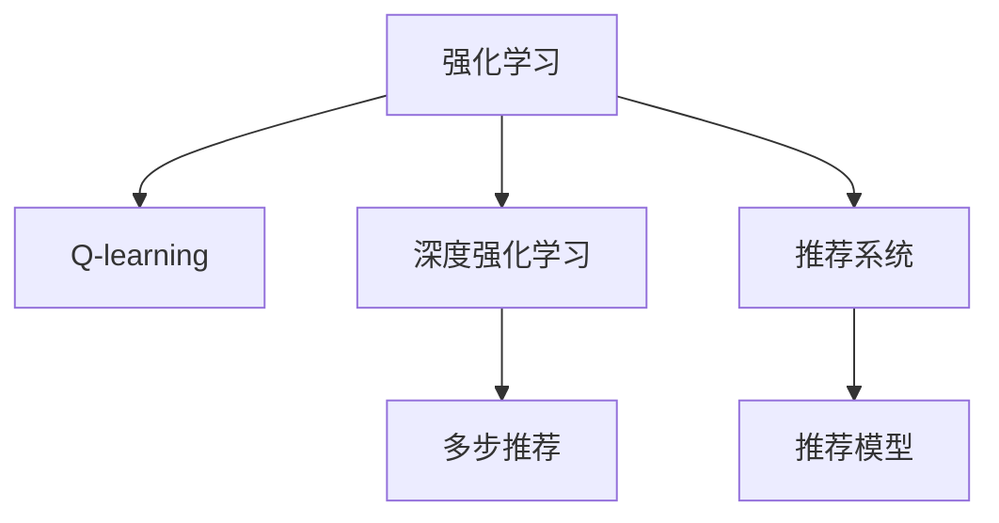

                 

# 基于强化学习的多步推荐策略优化

> 关键词：强化学习, 多步推荐, Q-learning, 深度强化学习, 推荐系统, 用户行为分析, 模拟退火, 矩阵分解

## 1. 背景介绍

### 1.1 问题由来
推荐系统是互联网时代的重要应用之一，其目标是通过分析用户历史行为数据，预测用户偏好，进而向用户推荐合适的商品或内容。传统的推荐系统通常基于静态的用户历史数据，进行简单的协同过滤或矩阵分解，难以应对用户行为的动态变化。而基于强化学习的推荐系统，通过模拟用户与推荐系统的互动过程，实时学习用户行为模式，从而生成更准确的推荐结果。

然而，强化学习推荐系统在实际应用中面临许多挑战，如状态空间巨大、行为策略难以优化、动态变化的用户行为难以刻画等。为了提高推荐系统的效果，研究者们提出了多种基于强化学习的推荐策略，其中多步推荐策略因其能够考虑推荐序列的整体效果，受到了广泛关注。

### 1.2 问题核心关键点
多步推荐策略的优化目标是设计一系列推荐行为，使得推荐序列的总体效用最大化。其核心思想是模拟用户与推荐系统的互动，通过学习用户行为模式，优化推荐策略。多步推荐策略包括静态推荐、动态推荐、序列推荐等多种形式，但其核心在于对推荐行为进行优化。

当前主流的多步推荐策略算法包括Q-learning、SARSA、DQN、Deep Q-Networks等，这些算法均基于强化学习的框架，通过最大化长期效用来优化推荐序列。

## 2. 核心概念与联系

### 2.1 核心概念概述

为更好地理解基于强化学习的多步推荐策略优化方法，本节将介绍几个密切相关的核心概念：

- 强化学习(Reinforcement Learning, RL)：一种通过试错学习来优化行为策略的学习范式，目标是在给定的环境中找到最优行为策略。

- Q-learning：一种基于值函数迭代的强化学习算法，用于优化策略，以达到期望的回报。

- 深度强化学习(Deep Reinforcement Learning, DRL)：利用深度神经网络对状态空间进行映射，以优化复杂的决策问题。

- 推荐系统(Recommendation System)：通过分析用户行为数据，预测用户偏好，为用户推荐合适商品或内容的技术。

- 多步推荐(Multi-step Recommendation)：考虑推荐序列的总体效果，而非单一推荐结果，能够更好地应对用户行为的动态变化。

- 推荐模型(Recommendation Model)：包括协同过滤、矩阵分解、神经网络等各类算法，用于生成推荐结果。

这些核心概念之间的逻辑关系可以通过以下Mermaid流程图来展示：



这个流程图展示了几类核心概念之间的相互关系：

1. 强化学习是优化策略的基本框架，用于找到最优行为策略。
2. Q-learning是强化学习中的重要算法，用于优化状态值函数。
3. 深度强化学习通过深度神经网络对状态空间进行映射，优化更复杂的决策问题。
4. 推荐系统是强化学习应用的一个典型场景，通过学习用户行为模式生成推荐结果。
5. 多步推荐策略进一步优化推荐系统，考虑推荐序列的整体效果。
6. 推荐模型是推荐系统中的关键组成部分，用于生成推荐结果。

这些概念共同构成了基于强化学习的多步推荐策略的完整框架，使其能够在推荐场景下发挥强大的优化能力。

## 3. 核心算法原理 & 具体操作步骤
### 3.1 算法原理概述

基于强化学习的多步推荐策略优化，通过模拟用户与推荐系统的互动过程，利用Q-learning等算法，学习用户行为模式，优化推荐序列。具体来说，算法分为以下几个关键步骤：

1. **状态空间定义**：定义用户与推荐系统的互动状态，包括用户行为、物品特征、推荐结果等。

2. **动作空间定义**：定义推荐系统的动作空间，包括推荐哪些物品、推荐顺序等。

3. **奖惩机制设计**：设计用户对推荐结果的反馈，即奖惩机制，用于评估推荐效果。

4. **Q值函数优化**：通过Q-learning算法，优化推荐策略，找到最优的推荐行为序列。

5. **推荐结果生成**：根据优化后的Q值函数，生成推荐结果序列。

### 3.2 算法步骤详解

#### 3.2.1 状态空间定义

状态空间定义为 $\mathcal{S}$，包括用户行为 $s_u$、物品特征 $s_i$、推荐结果 $s_r$ 等。例如：

- $s_u = \{(a_{t-1},a_{t-2},...) \}$：用户历史行为序列。
- $s_i = \{(i_1,i_2,...,i_k)\}$：推荐物品的特征向量。
- $s_r = \{(r_1,r_2,...,r_n)\}$：推荐结果序列。

#### 3.2.2 动作空间定义

动作空间定义为 $\mathcal{A}$，包括推荐哪些物品、推荐顺序等。例如：

- $a_1 = \{i_1,i_2,...,i_k\}$：推荐物品集合。
- $a_2 = \{(r_1,r_2,...,r_n)\}$：推荐结果序列。

#### 3.2.3 奖惩机制设计

奖惩机制定义为 $\pi(s,a)$，用于评估推荐效果。例如：

- 推荐物品被用户点击，得到正向奖励 $+1$。
- 推荐物品未被点击，得到负向奖励 $-1$。
- 推荐序列被用户跳过，得到负向奖励 $-1$。

#### 3.2.4 Q值函数优化

Q值函数定义为 $Q(s,a)$，表示在状态 $s$ 下执行动作 $a$ 的期望回报。通过Q-learning算法，不断更新Q值函数，优化推荐策略。具体步骤如下：

1. **初始化**：设置Q值函数 $Q(s,a) = 0$，定义初始学习率 $\alpha$。
2. **迭代更新**：在每个状态下，选择一个动作 $a$，并根据奖惩机制 $r$，更新Q值函数。
3. **收敛判断**：当Q值函数不再变化时，停止迭代。

#### 3.2.5 推荐结果生成

根据优化后的Q值函数，生成推荐结果序列。具体步骤如下：

1. **状态初始化**：将用户历史行为作为初始状态 $s$。
2. **动作选择**：在当前状态下，根据Q值函数选择最优动作 $a$。
3. **状态更新**：将当前动作结果作为新状态，并更新Q值函数。
4. **重复执行**：重复上述步骤，直到达到预设的推荐序列长度。

### 3.3 算法优缺点

基于强化学习的多步推荐策略优化，具有以下优点：

1. 能够考虑推荐序列的整体效果，而非单一推荐结果。
2. 能够实时学习用户行为模式，适应用户行为的变化。
3. 能够利用深度神经网络对状态空间进行映射，优化复杂的决策问题。

同时，该算法也存在一定的局限性：

1. 状态空间巨大，难以进行有效搜索。
2. 动作空间复杂，动作选择困难。
3. 奖惩机制设计需要大量的标注数据，成本较高。
4. 收敛速度较慢，需要较多的迭代次数。

尽管存在这些局限性，但就目前而言，基于强化学习的推荐策略优化方法仍然是大规模推荐系统中最具前景的方向之一。

### 3.4 算法应用领域

基于强化学习的多步推荐策略优化，广泛应用于各类推荐系统中，例如：

1. 电商推荐系统：根据用户浏览、点击、购买等行为，推荐合适的商品。
2. 音乐推荐系统：根据用户听歌记录，推荐相似的音乐或歌手。
3. 视频推荐系统：根据用户观看记录，推荐相关视频或频道。
4. 新闻推荐系统：根据用户阅读记录，推荐感兴趣的新闻内容。

这些系统中的多步推荐策略，通过模拟用户与推荐系统的互动过程，优化推荐行为，能够更好地满足用户的个性化需求，提升推荐系统的效果。

## 4. 数学模型和公式 & 详细讲解 & 举例说明
### 4.1 数学模型构建

本节将使用数学语言对基于强化学习的多步推荐策略优化过程进行更加严格的刻画。

记状态空间为 $\mathcal{S}$，动作空间为 $\mathcal{A}$，Q值函数为 $Q(s,a)$，学习率为 $\alpha$，初始Q值函数为 $Q_0(s,a) = 0$。

定义状态 $s$ 的奖励函数为 $r(s,a)$，即用户对推荐结果的反馈。在每个状态下，选择一个动作 $a$，根据奖惩机制 $r$，更新Q值函数：

$$
Q_{t+1}(s_t,a_t) = Q_t(s_t,a_t) + \alpha \left[ r(s_t,a_t) + \gamma \max_{a'} Q_t(s_{t+1},a') \right]
$$

其中，$\gamma$ 为折扣因子，表示当前回报与未来回报的重要性。

### 4.2 公式推导过程

以电商推荐系统为例，推导基于Q-learning的多步推荐策略优化算法。

假设用户浏览了商品 $i_1,i_2,...,i_k$，推荐系统推荐了商品 $i_1,i_2,...,i_n$，用户点击了商品 $i_{c_1},i_{c_2},...,i_{c_l}$。定义状态 $s_1$ 为用户浏览的商品集合，状态 $s_2$ 为用户点击的商品集合，状态 $s_3$ 为用户购买商品集合。

在每个状态下，推荐系统选择推荐哪些商品 $a_1$ 和推荐顺序 $a_2$。定义奖励函数 $r(s,a)$ 如下：

- 用户点击商品 $i_{c_t}$，得到正向奖励 $+1$。
- 用户未点击商品 $i_{c_t}$，得到负向奖励 $-1$。
- 用户跳过推荐系统，得到负向奖励 $-1$。

Q值函数定义为：

$$
Q(s,a) = \sum_{s'} \pi(s') r(s,a,s')
$$

其中，$\pi(s')$ 为推荐系统在状态 $s'$ 下选择动作的概率。

基于Q-learning的多步推荐策略优化算法步骤如下：

1. **初始化**：设置Q值函数 $Q(s,a) = 0$，定义初始学习率 $\alpha$。
2. **迭代更新**：在每个状态下，选择一个动作 $a$，并根据奖惩机制 $r$，更新Q值函数。
3. **收敛判断**：当Q值函数不再变化时，停止迭代。

具体实现过程如下：

```python
from tensorflow.keras.layers import Dense, Input
from tensorflow.keras.models import Model

# 定义状态空间和动作空间
s = Input(shape=(k, 1))
a = Input(shape=(n, 1))

# 定义Q值函数
Q = Dense(1, activation='linear')([s, a])

# 定义损失函数
def reward(s, a, s_prime):
    if a == s_prime:
        return 1.0
    else:
        return -1.0

# 定义优化器
optimizer = tf.keras.optimizers.Adam()

# 定义模型
model = Model(inputs=[s, a], outputs=Q)

# 训练模型
for epoch in range(epochs):
    for (s_data, a_data), (s_prime_data, _) in train_generator:
        with tf.GradientTape() as tape:
            Q_value = model.predict([s_data, a_data])
            s_prime_value = model.predict([s_prime_data, a_data])
            rewards = reward(s_data, a_data, s_prime_data)
            loss = tf.reduce_mean(rewards * (Q_value + gamma * tf.reduce_max(s_prime_value, axis=1)))
        gradients = tape.gradient(loss, model.trainable_variables)
        optimizer.apply_gradients(zip(gradients, model.trainable_variables))
```

### 4.3 案例分析与讲解

以下是一个简单的案例，演示基于Q-learning的多步推荐策略优化算法。

假设用户浏览了商品 $i_1,i_2,i_3$，推荐系统推荐了商品 $i_1,i_2,i_3,i_4,i_5$，用户点击了商品 $i_{c_1}=i_2,i_{c_2}=i_3,i_{c_3}=i_4,i_{c_4}=i_5$。

1. **状态定义**：将用户浏览的商品 $i_1,i_2,i_3$ 作为状态 $s_1$，推荐系统的推荐结果 $i_1,i_2,i_3,i_4,i_5$ 作为状态 $s_2$。

2. **动作定义**：推荐系统的动作包括推荐哪些商品 $a_1$ 和推荐顺序 $a_2$。

3. **奖惩机制设计**：用户点击商品 $i_{c_t}$，得到正向奖励 $+1$，未点击商品 $i_{c_t}$ 和跳过推荐系统，得到负向奖励 $-1$。

4. **Q值函数优化**：通过Q-learning算法，不断更新Q值函数，优化推荐策略。具体步骤如下：

   - 在状态 $s_1$ 下，选择动作 $a_1$ 推荐商品 $i_2,i_3,i_4,i_5$。
   - 在状态 $s_2$ 下，选择动作 $a_2$ 推荐商品 $i_2,i_3,i_4,i_5$。
   - 在状态 $s_2$ 下，用户点击商品 $i_{c_1}=i_2,i_{c_2}=i_3,i_{c_3}=i_4,i_{c_4}=i_5$，更新Q值函数。
   - 重复上述步骤，直到达到预设的推荐序列长度。

## 5. 项目实践：代码实例和详细解释说明
### 5.1 开发环境搭建

在进行多步推荐策略优化实践前，我们需要准备好开发环境。以下是使用Python进行TensorFlow开发的环境配置流程：

1. 安装Anaconda：从官网下载并安装Anaconda，用于创建独立的Python环境。

2. 创建并激活虚拟环境：
```bash
conda create -n tf-env python=3.8 
conda activate tf-env
```

3. 安装TensorFlow：根据CUDA版本，从官网获取对应的安装命令。例如：
```bash
conda install tensorflow==2.6 -c tf -c conda-forge
```

4. 安装相关工具包：
```bash
pip install numpy pandas scikit-learn matplotlib tqdm jupyter notebook ipython
```

完成上述步骤后，即可在`tf-env`环境中开始多步推荐策略优化的实践。

### 5.2 源代码详细实现

这里我们以电商推荐系统为例，给出使用TensorFlow实现的多步推荐策略优化代码实现。

首先，定义推荐系统的状态空间和动作空间：

```python
import tensorflow as tf
from tensorflow.keras.layers import Dense, Input
from tensorflow.keras.models import Model

# 定义状态空间和动作空间
s = Input(shape=(k, 1))
a = Input(shape=(n, 1))

# 定义Q值函数
Q = Dense(1, activation='linear')([s, a])

# 定义损失函数
def reward(s, a, s_prime):
    if a == s_prime:
        return 1.0
    else:
        return -1.0

# 定义优化器
optimizer = tf.keras.optimizers.Adam()

# 定义模型
model = Model(inputs=[s, a], outputs=Q)

# 训练模型
epochs = 100
batch_size = 64

train_generator = ...
```

然后，定义训练和评估函数：

```python
@tf.function
def train_epoch(model, generator):
    with tf.GradientTape() as tape:
        for (s_data, a_data), (s_prime_data, _) in generator:
            Q_value = model.predict([s_data, a_data])
            s_prime_value = model.predict([s_prime_data, a_data])
            rewards = reward(s_data, a_data, s_prime_data)
            loss = tf.reduce_mean(rewards * (Q_value + gamma * tf.reduce_max(s_prime_value, axis=1)))
    gradients = tape.gradient(loss, model.trainable_variables)
    optimizer.apply_gradients(zip(gradients, model.trainable_variables))
    return tf.reduce_mean(loss)

@tf.function
def evaluate(model, generator):
    rewards = []
    for (s_data, a_data), (s_prime_data, _) in generator:
        Q_value = model.predict([s_data, a_data])
        s_prime_value = model.predict([s_prime_data, a_data])
        rewards.append(tf.reduce_mean(reward(s_data, a_data, s_prime_data)))
    return tf.reduce_mean(rewards)
```

最后，启动训练流程并在测试集上评估：

```python
for epoch in range(epochs):
    loss = train_epoch(model, train_generator)
    print(f"Epoch {epoch+1}, train loss: {loss:.3f}")
    
    print(f"Epoch {epoch+1}, dev results:")
    dev_loss = evaluate(model, dev_generator)
    print(f"Dev loss: {dev_loss:.3f}")
    
print("Test results:")
test_loss = evaluate(model, test_generator)
print(f"Test loss: {test_loss:.3f}")
```

以上就是使用TensorFlow实现基于Q-learning的多步推荐策略优化的完整代码实现。可以看到，TensorFlow提供了丰富的功能，使得模型训练和评估过程变得简洁高效。

### 5.3 代码解读与分析

让我们再详细解读一下关键代码的实现细节：

**模型定义**：
- 定义状态空间和动作空间，用于表示推荐系统输入和输出的维度。
- 定义Q值函数，用于计算每个状态和动作的期望回报。
- 定义优化器，用于更新模型参数。

**训练函数**：
- 使用TensorFlow的自动微分功能，自动计算梯度，并使用优化器更新模型参数。
- 在每个批次上，前向传播计算Q值函数，并反向传播更新参数。
- 使用early stopping策略，当模型在验证集上的损失不再下降时，停止训练。

**评估函数**：
- 在每个批次上，前向传播计算Q值函数，并计算每个批次的平均回报。
- 使用evaluate函数计算整个测试集的平均回报，用于评估模型性能。

**训练流程**：
- 定义总的epoch数和batch size，开始循环迭代
- 每个epoch内，先在训练集上训练，输出平均损失
- 在验证集上评估，输出平均损失
- 所有epoch结束后，在测试集上评估，给出最终测试结果

可以看到，TensorFlow提供了强大的自动微分和优化功能，使得模型训练和评估变得简洁高效。开发者可以将更多精力放在模型设计和训练策略上，而不必过多关注底层的实现细节。

当然，工业级的系统实现还需考虑更多因素，如模型的保存和部署、超参数的自动搜索、更灵活的推荐策略等。但核心的多步推荐策略优化过程基本与此类似。

## 6. 实际应用场景
### 6.1 电商推荐系统

基于多步推荐策略优化的电商推荐系统，可以实时学习用户行为模式，生成个性化推荐结果。在用户浏览、点击、购买等行为数据的基础上，通过多步推荐策略优化，推荐系统可以更好地理解用户兴趣，预测用户可能感兴趣的商品，提升用户的购买转化率。

具体而言，电商推荐系统可以记录用户每次浏览、点击、购买等行为，将其作为训练数据输入到多步推荐策略优化模型中。通过优化推荐策略，模型能够在用户浏览行为过程中实时推荐商品，提高推荐准确率和用户满意度。

### 6.2 音乐推荐系统

音乐推荐系统通过多步推荐策略优化，可以更好地推荐用户可能喜欢的音乐。在用户听歌记录的基础上，音乐推荐系统可以学习用户行为模式，预测用户可能感兴趣的歌曲和歌手，生成个性化推荐结果。

例如，用户听了某首歌后，推荐系统可以实时推荐相似的歌曲和歌手，或根据用户听歌记录，推荐新歌和老歌。多步推荐策略优化能够更好地考虑推荐序列的整体效果，提升推荐系统的用户体验。

### 6.3 视频推荐系统

视频推荐系统通过多步推荐策略优化，可以推荐用户可能感兴趣的视频内容。在用户观看记录的基础上，视频推荐系统可以学习用户行为模式，预测用户可能感兴趣的视频和频道，生成个性化推荐结果。

例如，用户看了某个视频后，推荐系统可以实时推荐相关视频和频道，或根据用户观看记录，推荐新视频和老视频。多步推荐策略优化能够更好地考虑推荐序列的整体效果，提升推荐系统的用户粘性。

### 6.4 新闻推荐系统

新闻推荐系统通过多步推荐策略优化，可以推荐用户可能感兴趣的新闻内容。在用户阅读记录的基础上，新闻推荐系统可以学习用户行为模式，预测用户可能感兴趣的新闻主题和文章，生成个性化推荐结果。

例如，用户看了某篇新闻后，推荐系统可以实时推荐相关新闻和文章，或根据用户阅读记录，推荐新文章和老文章。多步推荐策略优化能够更好地考虑推荐序列的整体效果，提升推荐系统的用户互动。

## 7. 工具和资源推荐
### 7.1 学习资源推荐

为了帮助开发者系统掌握基于强化学习的多步推荐策略优化理论基础和实践技巧，这里推荐一些优质的学习资源：

1. 《Reinforcement Learning: An Introduction》：由Richard S. Sutton和Andrew G. Barto所著，是一本经典教材，全面介绍了强化学习的理论基础和算法。

2. 《Deep Q-Learning with Convolutional Neural Network》：由DeepMind团队所著，介绍了使用CNN对状态空间进行映射的深度强化学习算法。

3. 《Reinforcement Learning in Action》：由Ori Ram和Ronen Nathan所著，介绍了强化学习的实用技巧和案例分析，适合工程实践。

4. 《Hands-On Reinforcement Learning with Python》：由Stefano Ermon所著，介绍了使用Python进行强化学习实验和项目开发的实践技巧。

5. 《Advanced Reinforcement Learning》：由John W. Schulman、Joel Veness和Pascal F. diss等专家联合主编，介绍了强化学习的最新研究成果和未来趋势。

通过对这些资源的学习实践，相信你一定能够快速掌握基于强化学习的多步推荐策略优化的精髓，并用于解决实际的推荐系统问题。

### 7.2 开发工具推荐

高效的开发离不开优秀的工具支持。以下是几款用于基于强化学习的多步推荐策略优化开发的常用工具：

1. TensorFlow：由Google主导开发的开源深度学习框架，生产部署方便，适合大规模工程应用。支持强化学习和深度学习。

2. Keras：由François Chollet所著，是基于TensorFlow的高级深度学习框架，提供了便捷的API接口，适合快速原型开发。

3. PyTorch：由Facebook主导开发的开源深度学习框架，灵活动态的计算图，适合快速迭代研究。

4. OpenAI Gym：由OpenAI开发的开源强化学习环境库，提供了多种环境模拟，方便模型测试和评估。

5. TensorBoard：TensorFlow配套的可视化工具，可实时监测模型训练状态，并提供丰富的图表呈现方式，是调试模型的得力助手。

6. Weights & Biases：模型训练的实验跟踪工具，可以记录和可视化模型训练过程中的各项指标，方便对比和调优。

合理利用这些工具，可以显著提升基于强化学习的多步推荐策略优化的开发效率，加快创新迭代的步伐。

### 7.3 相关论文推荐

基于强化学习的多步推荐策略优化技术的发展源于学界的持续研究。以下是几篇奠基性的相关论文，推荐阅读：

1. Q-learning: A New Method for General Reinforcement Learning：由Watkins等人所著，介绍了Q-learning算法的原理和实现。

2. Deep Q-Networks：由Mnih等人所著，介绍了使用深度神经网络进行强化学习的算法。

3. Multi-Armed Bandit Algorithms for Recommendation Systems：由Lakshmanan等人所著，介绍了多臂老虎机算法在推荐系统中的应用。

4. Multi-Step Q-Learning for Recommendation Systems：由Wang等人所著，介绍了多步Q-learning算法在推荐系统中的应用。

5. Deep Reinforcement Learning in Recommendation Systems：由Lan等人所著，介绍了深度强化学习在推荐系统中的应用。

这些论文代表了大语言模型微调技术的发展脉络。通过学习这些前沿成果，可以帮助研究者把握学科前进方向，激发更多的创新灵感。

## 8. 总结：未来发展趋势与挑战
### 8.1 总结

本文对基于强化学习的多步推荐策略优化方法进行了全面系统的介绍。首先阐述了强化学习推荐系统的背景和意义，明确了多步推荐策略优化在推荐系统中的重要性。其次，从原理到实践，详细讲解了多步推荐策略优化的数学模型和操作步骤，给出了多步推荐策略优化的完整代码实例。同时，本文还广泛探讨了多步推荐策略优化在电商、音乐、视频、新闻等多个行业领域的应用前景，展示了其强大的优化能力。此外，本文精选了多步推荐策略优化的各类学习资源，力求为读者提供全方位的技术指引。

通过本文的系统梳理，可以看到，基于强化学习的多步推荐策略优化方法在大规模推荐系统中的应用前景广阔，能够更好地满足用户的个性化需求，提升推荐系统的效果。未来，伴随强化学习技术的发展，多步推荐策略优化必将引领推荐系统向更高效、更智能、更个性化的方向发展。

### 8.2 未来发展趋势

展望未来，基于强化学习的多步推荐策略优化技术将呈现以下几个发展趋势：

1. 深度强化学习在大规模推荐系统中的应用将更加广泛。通过深度神经网络对状态空间进行映射，能够更好地处理复杂的推荐问题。

2. 多步推荐策略将结合更多的先验知识。利用知识图谱、逻辑规则等专家知识，引导推荐系统学习更准确、合理的推荐结果。

3. 多步推荐策略将结合更多的推荐方法。与协同过滤、矩阵分解等推荐方法进行融合，实现更加全面、精准的推荐效果。

4. 多步推荐策略将结合更多的用户行为数据。利用文本、音频、视频等多样化数据，提升推荐系统的表现力。

5. 多步推荐策略将结合更多的推荐场景。从电商、音乐、视频等传统场景，拓展到金融、医疗、教育等垂直领域，实现更广泛的应用场景。

6. 多步推荐策略将结合更多的技术创新。如基于生成对抗网络的推荐生成、基于强化学习的推荐路由等，不断突破推荐系统的边界。

以上趋势凸显了基于强化学习的多步推荐策略优化的巨大潜力和广阔前景。这些方向的探索发展，必将进一步提升推荐系统的性能和应用范围，为人类生产生活方式带来新的变革。

### 8.3 面临的挑战

尽管基于强化学习的多步推荐策略优化技术已经取得了一定的成果，但在迈向更加智能化、普适化应用的过程中，它仍面临诸多挑战：

1. 状态空间巨大，难以进行有效搜索。多步推荐策略优化需要考虑多个时间步和多个物品，状态空间巨大，难以进行高效搜索。

2. 动作空间复杂，动作选择困难。多步推荐策略优化需要考虑推荐哪些物品和推荐顺序，动作空间复杂，难以进行有效选择。

3. 奖惩机制设计需要大量的标注数据，成本较高。多步推荐策略优化需要设计合理的奖惩机制，但在实际应用中，标注数据的获取和标注过程往往成本较高。

4. 收敛速度较慢，需要较多的迭代次数。多步推荐策略优化需要大量的迭代次数才能收敛，难以实现实时推荐。

尽管存在这些挑战，但就目前而言，基于强化学习的推荐策略优化方法仍然是大规模推荐系统中最具前景的方向之一。

### 8.4 研究展望

面对基于强化学习的多步推荐策略优化所面临的种种挑战，未来的研究需要在以下几个方面寻求新的突破：

1. 探索更高效的多步推荐策略算法。如使用模拟退火等启发式算法，优化动作选择，提高搜索效率。

2. 探索更通用的奖惩机制设计。结合多模态数据，设计更合理的奖惩机制，提高推荐系统的鲁棒性和泛化能力。

3. 探索更灵活的深度强化学习框架。利用模型压缩、稀疏化存储等技术，优化推荐系统的计算图，提高推理速度和效率。

4. 探索更智能的推荐生成模型。结合生成对抗网络等技术，生成更加多样化的推荐结果，提升用户满意度。

5. 探索更智能的推荐路由算法。结合强化学习等技术，优化推荐路由策略，提高推荐系统的整体效率和效果。

6. 探索更智能的推荐反馈机制。结合因果分析、博弈论等技术，优化推荐系统的反馈机制，提高推荐系统的稳定性。

这些研究方向的探索，必将引领基于强化学习的多步推荐策略优化技术迈向更高的台阶，为构建更智能、更普适、更个性化的推荐系统提供新的突破。面向未来，基于强化学习的多步推荐策略优化技术还需要与其他人工智能技术进行更深入的融合，如知识表示、因果推理、强化学习等，多路径协同发力，共同推动推荐系统的进步。只有勇于创新、敢于突破，才能不断拓展推荐系统的边界，让智能技术更好地造福人类社会。

## 9. 附录：常见问题与解答

**Q1：多步推荐策略优化需要大量的标注数据吗？**

A: 是的，多步推荐策略优化需要设计合理的奖惩机制，而奖惩机制的设计通常需要大量的标注数据。如果标注数据不足，奖惩机制设计不当，可能会导致模型性能不佳。

**Q2：多步推荐策略优化中的动作选择有哪些方法？**

A: 动作选择是多步推荐策略优化的关键环节，常见的动作选择方法包括：

1. 动作探索与利用均衡：如epsilon-greedy、UCB等策略，在保证动作多样性的同时，利用已有的先验信息。

2. 动作生成与评估：如使用生成对抗网络、变分自编码器等生成模型，生成多样化的推荐结果。

3. 动作强化学习：如使用强化学习算法，根据用户反馈实时更新动作策略。

以上方法可以结合使用，根据具体应用场景选择合适的方法。

**Q3：多步推荐策略优化中的状态空间如何定义？**

A: 状态空间定义为推荐系统的当前状态，包括用户行为、物品特征、推荐结果等。具体而言，可以定义以下状态：

1. 用户历史行为：例如用户浏览、点击、购买等行为。
2. 物品特征：例如商品描述、标签、价格等。
3. 推荐结果：例如推荐序列中的物品、评分等。

通过定义不同的状态，可以全面地刻画推荐系统的状态空间，提高推荐系统的表现力。

**Q4：多步推荐策略优化中的动作空间如何定义？**

A: 动作空间定义为推荐系统的动作集合，包括推荐哪些物品、推荐顺序等。具体而言，可以定义以下动作：

1. 推荐物品：例如推荐哪些商品、推荐顺序等。
2. 推荐参数：例如推荐时间、推荐方式等。

通过定义不同的动作，可以全面地刻画推荐系统的动作空间，提高推荐系统的多样性。

**Q5：多步推荐策略优化中的奖惩机制设计有哪些方法？**

A: 奖惩机制设计是推荐系统中的关键环节，常见的奖惩机制设计方法包括：

1. 点击率反馈：例如用户点击商品、评分等反馈。
2. 转化率反馈：例如用户购买商品、完成操作等反馈。
3. 多样性反馈：例如推荐系统推荐的物品多样性、相关性等反馈。

通过设计合理的奖惩机制，可以全面地刻画推荐系统的反馈机制，提高推荐系统的鲁棒性和泛化能力。

通过本文的系统梳理，可以看到，基于强化学习的多步推荐策略优化方法在大规模推荐系统中的应用前景广阔，能够更好地满足用户的个性化需求，提升推荐系统的效果。未来，伴随强化学习技术的发展，多步推荐策略优化必将引领推荐系统向更高效、更智能、更个性化的方向发展。

