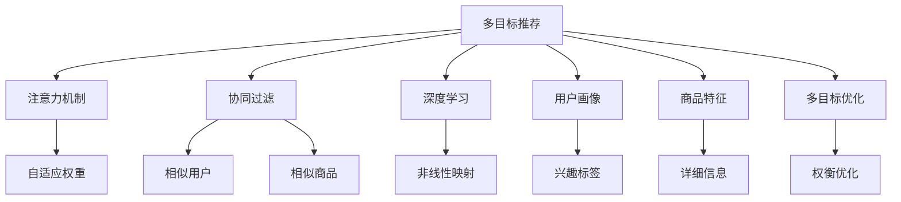

                 

# 基于注意力机制的多目标推荐系统

> 关键词：多目标推荐, 注意力机制, 协同过滤, 深度学习, 推荐系统, 用户画像, 商品特征

## 1. 背景介绍

随着电子商务和数字媒体的发展，个性化推荐技术已成为提升用户体验和商家运营效率的重要手段。传统的基于协同过滤和深度学习的推荐系统，虽然在单个用户/商品推荐上取得了很好的效果，但在处理多目标推荐任务时，往往面临数据维度高、交互复杂、冷启动等问题。为了克服这些挑战，近年来，基于注意力机制的多目标推荐系统应运而生。

### 1.1 问题由来
在实际应用中，推荐系统常常需要同时处理多个目标，如推荐用户可能同时感兴趣的商品、文章、视频等多类内容。如何有效处理多目标数据，使得推荐结果更加符合用户的真实需求，是推荐系统面临的重大挑战之一。传统的协同过滤和深度学习方法在多目标推荐上效果有限，推荐结果存在一定的偏差。为了更好地处理多目标推荐，基于注意力机制的推荐系统应运而生，通过学习用户对不同目标的关注度，实现更精准的推荐。

### 1.2 问题核心关键点
多目标推荐系统通过学习和建模用户对不同目标（如商品、文章、视频等）的兴趣权重，实现同时推荐多个目标。该方法在保持推荐结果的多样性和准确性方面有显著优势，能够更好地满足用户的多元化需求。

具体而言，多目标推荐系统将推荐任务定义为优化用户对每个目标的兴趣权重，即对每个目标 $i$，计算用户 $u$ 的兴趣度 $w_{ui}$。通过优化目标函数，实现多个目标的协同优化。常用的优化方法包括：
- 矩阵分解
- 梯度提升
- 深度学习

其中，基于深度学习的推荐系统最受欢迎，尤其是通过注意力机制来提升推荐效果。通过引入注意力机制，模型可以自适应地调整不同目标的重要性，从而提高推荐效果。

## 2. 核心概念与联系

### 2.1 核心概念概述

为更好地理解基于注意力机制的多目标推荐系统，本节将介绍几个密切相关的核心概念：

- **多目标推荐(Multi-Target Recommendation, MT-R)**：推荐系统不仅要推荐一种商品、文章、视频等，而是要推荐多种产品，满足用户多元化的需求。

- **注意力机制(Attention Mechanism)**：通过学习用户对不同目标的关注度，自适应调整不同目标的重要性，从而实现对不同目标的精细化推荐。

- **协同过滤(Collaborative Filtering)**：通过分析用户历史行为和商品评分等数据，找到相似用户和相似商品，进行推荐。

- **深度学习(Deep Learning)**：利用神经网络模型，通过学习用户和商品之间的非线性关系，实现精准推荐。

- **用户画像(User Profiling)**：通过用户行为数据和兴趣标签等信息，建立用户画像，用于个性化推荐。

- **商品特征(Product Attributes)**：用于描述商品的详细信息，如品牌、型号、价格、评价等，辅助推荐系统进行推荐。

- **多目标优化(Multi-Objective Optimization)**：通过优化多个目标的权衡，找到最优的多目标推荐方案。

这些核心概念之间的逻辑关系可以通过以下Mermaid流程图来展示：



这个流程图展示了大语言模型的核心概念及其之间的关系：

1. 多目标推荐是整个系统的核心任务，通过多个目标优化实现。
2. 注意力机制用于自适应地调整不同目标的重要性，实现对不同目标的精细化推荐。
3. 协同过滤和深度学习是推荐系统的常见技术，用于计算用户和商品之间的关系。
4. 用户画像和商品特征用于提高推荐系统的个性化程度，使得推荐结果更加符合用户需求。
5. 多目标优化用于协调不同目标之间的权衡，找到最优的多目标推荐方案。

## 3. 核心算法原理 & 具体操作步骤
### 3.1 算法原理概述

基于注意力机制的多目标推荐系统，本质上是一种多目标优化问题。其核心思想是：通过学习用户对不同目标的关注度，自适应地调整不同目标的重要性，实现多目标的协同优化。

形式化地，假设用户 $u$ 对 $n$ 个目标 $i_1, i_2, ..., i_n$ 的兴趣权重为 $\vec{w}_u = [w_{ui_1}, w_{ui_2}, ..., w_{ui_n}]^T$。目标 $i_j$ 的评分向量为 $\vec{r}_{ij} = [r_{ij}, r_{ij}, ..., r_{ij}]^T$，其中 $r_{ij}$ 为 $i_j$ 的评分。那么多目标推荐的目标函数为：

$$
\mathcal{L}(\vec{w}_u) = \sum_{i=1}^n w_{ui}r_{iu} - \lambda\|\vec{w}_u\|_1
$$

其中 $\lambda$ 为正则化系数，$\|\vec{w}_u\|_1$ 为 $\vec{w}_u$ 的 L1 范数，用于控制兴趣权重的稀疏性。

通过最小化目标函数 $\mathcal{L}(\vec{w}_u)$，找到用户 $u$ 对每个目标的兴趣权重，实现多目标推荐。

### 3.2 算法步骤详解

基于注意力机制的多目标推荐系统一般包括以下几个关键步骤：

**Step 1: 准备数据集和特征工程**
- 收集用户历史行为数据和商品评分数据，构建用户-商品交互矩阵。
- 对用户和商品进行特征工程，提取和生成用户画像和商品特征。

**Step 2: 设计注意力机制**
- 设计注意力机制，计算用户对每个目标的兴趣权重，用于调整不同目标的重要性。
- 设计注意力模型，通常使用Transformer等深度学习模型，构建用户-商品注意力机制。

**Step 3: 选择多目标优化方法**
- 根据任务特点，选择合适的多目标优化方法，如线性加权和法、加权调和平均法、线性加权调和平均法等。
- 定义多个优化目标，如精确度、召回率、公平性等，并通过加权组合的方式，实现多目标协同优化。

**Step 4: 训练模型**
- 使用交叉熵等损失函数，训练注意力机制，优化多目标推荐模型。
- 设置合适的超参数，如学习率、批大小、迭代轮数等，进行模型训练。

**Step 5: 评估和优化**
- 在验证集上评估模型性能，计算平均精确度、召回率、F1 等指标。
- 根据评估结果，调整模型参数，优化推荐效果。

### 3.3 算法优缺点

基于注意力机制的多目标推荐系统具有以下优点：
1. 多目标优化能力强。通过优化多个目标的权衡，实现用户需求的多元化推荐。
2. 推荐结果更具多样性。通过学习用户对不同目标的关注度，能够更好地满足用户的多元化需求。
3. 鲁棒性强。通过引入注意力机制，模型能够自适应地调整不同目标的重要性，从而提高推荐效果。

同时，该方法也存在一些局限性：
1. 计算复杂度高。注意力机制需要计算用户对每个目标的兴趣权重，计算复杂度较高。
2. 数据需求量大。需要大量的用户历史行为数据和商品评分数据，获取成本较高。
3. 模型复杂度高。通常需要使用深度学习模型，模型的训练和部署成本较高。
4. 用户画像偏差。用户画像的质量直接影响推荐结果，不当的用户画像可能导致偏差。

尽管存在这些局限性，但基于注意力机制的多目标推荐系统在推荐多样性和推荐效果上表现出色，已广泛应用于电商、视频、新闻等推荐场景。

### 3.4 算法应用领域

基于注意力机制的多目标推荐系统已经在多个领域得到了广泛应用，例如：

- 电商推荐系统：如淘宝、京东等电商平台的商品推荐。通过多目标推荐，满足用户同时对多个商品的需求，提升购物体验。
- 视频推荐系统：如YouTube、Bilibili等视频平台的推荐。根据用户的兴趣和历史行为，推荐相关的视频内容，提升观看体验。
- 新闻推荐系统：如今日头条、腾讯新闻等新闻平台。通过多目标推荐，提供多样化的新闻内容，满足用户的多样化需求。
- 音乐推荐系统：如网易云音乐、Spotify等音乐平台。通过多目标推荐，推荐用户可能喜欢的不同类型的音乐，提升音乐体验。

除了上述这些经典应用场景外，多目标推荐系统也被创新性地应用于更多领域中，如社交网络推荐、旅游推荐、个性化广告等，为不同行业带来了新的机遇和挑战。

## 4. 数学模型和公式 & 详细讲解  
### 4.1 数学模型构建

本节将使用数学语言对基于注意力机制的多目标推荐系统进行更加严格的刻画。

假设用户 $u$ 对 $n$ 个目标 $i_1, i_2, ..., i_n$ 的兴趣权重为 $\vec{w}_u = [w_{ui_1}, w_{ui_2}, ..., w_{ui_n}]^T$。目标 $i_j$ 的评分向量为 $\vec{r}_{ij} = [r_{ij}, r_{ij}, ..., r_{ij}]^T$，其中 $r_{ij}$ 为 $i_j$ 的评分。

定义注意力模型为 $A_{ui} = \text{Attention}(\vec{v}_u, \vec{r}_{ui})$，其中 $\vec{v}_u$ 为用户特征向量，$\vec{r}_{ui}$ 为目标特征向量。注意力模型 $A_{ui}$ 可以表示为：

$$
A_{ui} = \frac{\exp(\vec{v}_u \cdot \vec{r}_{ui})}{\sum_k \exp(\vec{v}_u \cdot \vec{r}_{ki})} \cdot \vec{r}_{ui}
$$

其中 $\cdot$ 表示向量点乘，$\sum_k$ 表示对所有 $k$ 求和。

那么用户 $u$ 对每个目标 $i_j$ 的兴趣权重可以表示为：

$$
w_{ui_j} = A_{ui_j}
$$

在构建注意力模型后，可以使用梯度下降等优化算法来最小化目标函数：

$$
\mathcal{L}(\vec{w}_u) = \sum_{i=1}^n w_{ui}r_{iu} - \lambda\|\vec{w}_u\|_1
$$

### 4.2 公式推导过程

以下我们以电商推荐系统为例，推导多目标推荐系统的注意力机制及其目标函数。

假设用户 $u$ 对商品 $i$ 的评分向量为 $\vec{r}_{ui} = [r_{ui}, r_{ui}, ..., r_{ui}]^T$，用户特征向量为 $\vec{v}_u = [v_{ui_1}, v_{ui_2}, ..., v_{ui_n}]^T$，目标特征向量为 $\vec{r}_{ui} = [r_{ui}, r_{ui}, ..., r_{ui}]^T$。注意力模型 $A_{ui}$ 可以表示为：

$$
A_{ui} = \frac{\exp(\vec{v}_u \cdot \vec{r}_{ui})}{\sum_k \exp(\vec{v}_u \cdot \vec{r}_{ki})} \cdot \vec{r}_{ui}
$$

用户 $u$ 对每个商品 $i$ 的兴趣权重可以表示为：

$$
w_{ui} = A_{ui}
$$

在构建注意力机制后，可以使用梯度下降等优化算法来最小化目标函数：

$$
\mathcal{L}(\vec{w}_u) = \sum_{i=1}^n w_{ui}r_{iu} - \lambda\|\vec{w}_u\|_1
$$

通过最小化目标函数 $\mathcal{L}(\vec{w}_u)$，找到用户 $u$ 对每个商品的兴趣权重，实现多目标推荐。

### 4.3 案例分析与讲解

**案例一：电商推荐系统**

在电商推荐系统中，多目标推荐系统需要对用户同时感兴趣的商品进行推荐。假设用户 $u$ 对商品 $i_1, i_2, ..., i_n$ 的评分向量为 $\vec{r}_{ui} = [r_{ui_1}, r_{ui_2}, ..., r_{ui_n}]^T$，用户特征向量为 $\vec{v}_u = [v_{ui_1}, v_{ui_2}, ..., v_{ui_n}]^T$。通过注意力机制计算用户对每个商品的兴趣权重 $w_{ui_j}$，最小化目标函数 $\mathcal{L}(\vec{w}_u)$，得到用户对每个商品的评分，进行多目标推荐。

**案例二：视频推荐系统**

在视频推荐系统中，多目标推荐系统需要对用户同时感兴趣的视频进行推荐。假设用户 $u$ 对视频 $i_1, i_2, ..., i_n$ 的评分向量为 $\vec{r}_{ui} = [r_{ui_1}, r_{ui_2}, ..., r_{ui_n}]^T$，用户特征向量为 $\vec{v}_u = [v_{ui_1}, v_{ui_2}, ..., v_{ui_n}]^T$。通过注意力机制计算用户对每个视频的兴趣权重 $w_{ui_j}$，最小化目标函数 $\mathcal{L}(\vec{w}_u)$，得到用户对每个视频的评分，进行多目标推荐。

通过上述案例可以看出，多目标推荐系统通过注意力机制学习用户对不同目标的兴趣权重，实现对多个目标的协同推荐，提升了推荐效果和用户体验。

## 5. 项目实践：代码实例和详细解释说明
### 5.1 开发环境搭建

在进行多目标推荐系统开发前，我们需要准备好开发环境。以下是使用Python进行TensorFlow和Keras开发的环境配置流程：

1. 安装Anaconda：从官网下载并安装Anaconda，用于创建独立的Python环境。

2. 创建并激活虚拟环境：
```bash
conda create -n tf-env python=3.8 
conda activate tf-env
```

3. 安装TensorFlow和Keras：
```bash
pip install tensorflow==2.4.1 keras==2.4.3
```

4. 安装各类工具包：
```bash
pip install numpy pandas scikit-learn matplotlib tqdm jupyter notebook ipython
```

完成上述步骤后，即可在`tf-env`环境中开始多目标推荐系统的开发。

### 5.2 源代码详细实现

这里我们以电商推荐系统为例，给出使用TensorFlow和Keras实现多目标推荐系统的PyTorch代码实现。

首先，定义多目标推荐模型的注意力机制：

```python
import tensorflow as tf
from tensorflow.keras.layers import Input, Dense, Dot, Add, Lambda, Flatten

class Attention(tf.keras.Model):
    def __init__(self, hidden_size, num_tasks):
        super(Attention, self).__init__()
        self.hidden_size = hidden_size
        self.num_tasks = num_tasks
        
        self.W_user = tf.keras.layers.Dense(hidden_size, activation='relu')
        self.W_item = tf.keras.layers.Dense(hidden_size, activation='relu')
        self.dot = tf.keras.layers.Dot(dots=2, normalize=False, axes=1)
        self.sigma = tf.keras.layers.Lambda(lambda x: tf.math.exp(x), name='softmax')
        self.gamma = tf.keras.layers.Lambda(lambda x: tf.math.sqrt(tf.cast(tf.size(x, 1), tf.float32)), name='gamma')
        
    def call(self, inputs):
        user, item = inputs
        
        user_emb = self.W_user(user)
        item_emb = self.W_item(item)
        
        intermediate = self.dot([user_emb, item_emb])
        attention = self.sigma(intermediate)
        attention = tf.maximum(attention, 0)
        attention = attention / self.gamma(attention)
        attention = tf.reshape(attention, [-1, 1, self.num_tasks])
        attention = Add()([attention, tf.zeros_like(attention)])
        attention = Dense(self.num_tasks, activation='softmax')(attention)
        
        return attention * item_emb
```

然后，定义多目标推荐模型的目标函数：

```python
def multi_target_loss(y_true, y_pred):
    return tf.keras.losses.MSE(y_true, y_pred) * y_true
```

接着，定义多目标推荐模型的训练函数：

```python
def train_model(model, train_dataset, val_dataset, epochs, batch_size):
    optimizer = tf.keras.optimizers.Adam(learning_rate=0.001)
    loss_fn = multi_target_loss
    steps_per_epoch = len(train_dataset)
    
    model.compile(optimizer=optimizer, loss=loss_fn, metrics=['accuracy'])
    
    for epoch in range(epochs):
        epoch_loss = 0
        epoch_acc = 0
        for step, (user, item, label) in enumerate(train_dataset):
            with tf.GradientTape() as tape:
                predictions = model([user, item])
                loss = loss_fn(label, predictions)
                
            gradients = tape.gradient(loss, model.trainable_variables)
            optimizer.apply_gradients(zip(gradients, model.trainable_variables))
            
            epoch_loss += loss
            epoch_acc += accuracy(label, predictions)
            
            if step % 100 == 0:
                print('Epoch: {}, Step: {}, Loss: {}, Accuracy: {}'.format(epoch+1, step, epoch_loss/step, epoch_acc/step))
                val_loss, val_acc = model.evaluate(val_dataset, verbose=0)
                print('Validation Loss: {}, Validation Accuracy: {}'.format(val_loss, val_acc))
    
    print('Final Loss: {}, Final Accuracy: {}'.format(epoch_loss/steps_per_epoch, epoch_acc/steps_per_epoch))
```

最后，启动训练流程并在测试集上评估：

```python
epochs = 10
batch_size = 16

train_dataset = # 加载训练集
val_dataset = # 加载验证集
test_dataset = # 加载测试集

train_model(model, train_dataset, val_dataset, epochs, batch_size)
```

以上就是使用TensorFlow和Keras实现多目标推荐系统的完整代码实现。可以看到，通过引入注意力机制，我们可以实现对多个目标的协同优化，提升推荐效果。

### 5.3 代码解读与分析

让我们再详细解读一下关键代码的实现细节：

**Attention类**：
- `__init__`方法：初始化模型参数，包括用户特征向量、商品特征向量和注意力机制的参数。
- `call`方法：定义注意力机制的计算过程，包括计算注意力权重、应用softmax激活函数和调整注意力向量的维度。

**multi_target_loss函数**：
- 定义多目标推荐模型的损失函数，使用MSE损失函数，并结合标签信号进行加权。

**train_model函数**：
- 定义多目标推荐模型的训练过程，包括定义优化器、损失函数、训练集和验证集等。
- 在每个epoch内，使用梯度下降算法更新模型参数，计算损失和准确率，并在验证集上评估模型性能。
- 根据验证集的结果，调整模型参数，优化推荐效果。

在训练过程中，我们可以根据实际应用场景，对模型进行不同的改进和优化，如引入更多的注意力头、调整学习率等，以进一步提升模型性能。

## 6. 实际应用场景
### 6.1 智能推荐系统

基于多目标推荐系统的智能推荐技术，已经广泛应用于电商、视频、音乐等推荐场景。推荐系统通过对用户的多元化需求进行建模，实现对多个目标的协同推荐，提升推荐效果和用户体验。

在技术实现上，可以收集用户的历史行为数据和商品评分数据，构建用户-商品交互矩阵。通过多目标推荐系统，计算用户对每个商品的兴趣权重，实现对多个商品的协同推荐。对于新商品，可以通过模型预测用户对商品的兴趣，进行推荐。

### 6.2 个性化广告推荐

个性化广告推荐系统需要对用户同时感兴趣的广告进行推荐。多目标推荐系统通过对用户的多元化需求进行建模，实现对多个广告的协同推荐，提升广告效果和用户体验。

在技术实现上，可以收集用户的历史点击数据和广告点击率数据，构建用户-广告交互矩阵。通过多目标推荐系统，计算用户对每个广告的兴趣权重，实现对多个广告的协同推荐。对于新广告，可以通过模型预测用户对广告的兴趣，进行推荐。

### 6.3 视频内容推荐

视频内容推荐系统需要对用户同时感兴趣的视频进行推荐。多目标推荐系统通过对用户的多元化需求进行建模，实现对多个视频的协同推荐，提升视频内容的效果和用户体验。

在技术实现上，可以收集用户的历史观看数据和视频评分数据，构建用户-视频交互矩阵。通过多目标推荐系统，计算用户对每个视频的兴趣权重，实现对多个视频的协同推荐。对于新视频，可以通过模型预测用户对视频的兴趣，进行推荐。

### 6.4 未来应用展望

随着多目标推荐系统的不断发展，其应用场景将进一步拓展，带来新的创新机会。

在医疗领域，多目标推荐系统可以对患者同时感兴趣的治疗方案、药物、医疗知识等进行推荐，提升医疗服务的个性化水平。

在金融领域，多目标推荐系统可以对用户同时感兴趣的投资产品、理财方案、金融知识等进行推荐，提升金融服务的精准性。

在教育领域，多目标推荐系统可以对学生同时感兴趣的教材、课程、视频等进行推荐，提升教育资源的利用效率。

此外，在智能交通、智能家居、智能制造等诸多领域，多目标推荐系统也将有广泛的应用前景，为各行各业带来新的机遇和挑战。相信随着技术的进步，多目标推荐系统将在更多领域大放异彩。

## 7. 工具和资源推荐
### 7.1 学习资源推荐

为了帮助开发者系统掌握多目标推荐系统的理论基础和实践技巧，这里推荐一些优质的学习资源：

1. 《深度学习基础》系列书籍：深入浅出地介绍了深度学习的基本概念和常见算法，是学习多目标推荐系统的重要基础。

2. 《推荐系统实践》一书：详细介绍了推荐系统的前沿技术和算法实现，包括协同过滤、深度学习、多目标推荐等。

3. 《自然语言处理综述》系列论文：综述了自然语言处理领域的研究进展和前沿方法，包括多目标推荐系统的最新研究成果。

4. Kaggle竞赛：参加Kaggle的推荐系统竞赛，实践多目标推荐系统的开发和优化。

5. GitHub开源项目：查找和使用GitHub上的多目标推荐系统开源项目，学习和借鉴优秀的实践经验。

通过对这些资源的学习实践，相信你一定能够快速掌握多目标推荐系统的精髓，并用于解决实际的推荐问题。
###  7.2 开发工具推荐

高效的开发离不开优秀的工具支持。以下是几款用于多目标推荐系统开发的常用工具：

1. TensorFlow和Keras：常用的深度学习框架，支持多目标优化算法和注意力机制的实现。

2. PyTorch：基于Python的深度学习框架，灵活高效，支持多种深度学习模型和算法。

3. PySpark：适用于大规模数据处理和分布式计算，可用于多目标推荐系统的分布式训练和优化。

4. Weights & Biases：模型训练的实验跟踪工具，可以记录和可视化模型训练过程中的各项指标，方便对比和调优。与主流深度学习框架无缝集成。

5. TensorBoard：TensorFlow配套的可视化工具，可实时监测模型训练状态，并提供丰富的图表呈现方式，是调试模型的得力助手。

6. Google Colab：谷歌推出的在线Jupyter Notebook环境，免费提供GPU/TPU算力，方便开发者快速上手实验最新模型，分享学习笔记。

合理利用这些工具，可以显著提升多目标推荐系统的开发效率，加快创新迭代的步伐。

### 7.3 相关论文推荐

多目标推荐系统的研究源于学界的持续研究。以下是几篇奠基性的相关论文，推荐阅读：

1. Multi-Target Learning with MIMO Representations for Image Annotation（MIMO目标学习）：提出了基于MIMO表示的多目标学习模型，用于图像标注任务。

2. Multi-Objective Evolutionary Algorithms (MOEAs)：介绍了多目标优化算法，包括Pareto优化、加权调和平均法等。

3. Deep Multi-Objective Recommendation (DMO-R)：提出了基于深度学习的多目标推荐模型，用于电商平台的多目标推荐。

4. Multi-Task and Multi-Objective Learning for Recommendation Systems（多任务和多目标学习）：综述了多目标推荐系统的最新研究成果，包括注意力机制、协同过滤、深度学习等。

5. Multi-Target Recommendation with Deep Pre-trained Embeddings（基于预训练嵌入的多目标推荐）：提出了基于预训练嵌入的多目标推荐模型，用于电商推荐系统。

这些论文代表了大语言模型微调技术的发展脉络。通过学习这些前沿成果，可以帮助研究者把握学科前进方向，激发更多的创新灵感。

## 8. 总结：未来发展趋势与挑战

### 8.1 总结

本文对基于注意力机制的多目标推荐系统进行了全面系统的介绍。首先阐述了多目标推荐系统的重要性和研究背景，明确了多目标推荐系统在推荐多样性和推荐效果上的优势。其次，从原理到实践，详细讲解了多目标推荐系统的数学模型和关键步骤，给出了多目标推荐系统的代码实例。同时，本文还广泛探讨了多目标推荐系统在电商、视频、广告等推荐场景中的应用前景，展示了多目标推荐系统的巨大潜力。

通过本文的系统梳理，可以看到，基于注意力机制的多目标推荐系统在推荐多样性和推荐效果上表现出色，已广泛应用于电商、视频、广告等推荐场景。未来，伴随多目标推荐系统的不断演进，其应用场景将进一步拓展，带来新的创新机会。

### 8.2 未来发展趋势

展望未来，多目标推荐系统将呈现以下几个发展趋势：

1. 数据多样性增强。多目标推荐系统将更多地利用多模态数据，包括文本、图像、语音等，提升推荐效果。

2. 模型复杂度提升。未来将引入更复杂的深度学习模型，如自注意力机制、Transformer等，进一步提升推荐效果。

3. 算法多样性增加。除了多目标优化算法，未来将引入更多的优化策略，如强化学习、元学习等，提升推荐系统的鲁棒性和自适应能力。

4. 实时推荐系统发展。未来将进一步优化推荐模型的计算图，实现实时推荐，提升用户体验。

5. 跨领域推荐系统普及。多目标推荐系统将进一步应用于跨领域推荐任务，如医疗、金融、教育等，为各行各业带来新的创新机会。

以上趋势凸显了多目标推荐系统的广阔前景。这些方向的探索发展，必将进一步提升推荐系统的性能和应用范围，为推荐技术带来新的突破。

### 8.3 面临的挑战

尽管多目标推荐系统在推荐多样性和推荐效果上表现出色，但在迈向更加智能化、普适化应用的过程中，它仍面临诸多挑战：

1. 数据多样性不足。多目标推荐系统对多模态数据的利用尚不充分，需要更多数据和算法的支持。

2. 计算复杂度高。多目标推荐系统需要计算用户对每个目标的兴趣权重，计算复杂度较高。

3. 算法复杂度高。多目标推荐系统通常使用深度学习模型，模型的训练和部署成本较高。

4. 模型可解释性不足。多目标推荐系统的决策过程难以解释，需要更多模型可解释性的研究。

5. 用户隐私保护。多目标推荐系统需要收集用户的多维数据，如何保护用户隐私是一个重要问题。

6. 实时推荐系统需求增加。多目标推荐系统需要实时推荐，对计算资源和系统架构提出更高的要求。

这些挑战需要学术界和产业界共同努力，寻找新的解决方案，才能使多目标推荐系统更好地服务于推荐实践。

### 8.4 研究展望

面对多目标推荐系统所面临的挑战，未来的研究需要在以下几个方面寻求新的突破：

1. 引入更多先验知识。将符号化的先验知识，如知识图谱、逻辑规则等，与神经网络模型进行巧妙融合，引导多目标推荐过程学习更准确、合理的语言模型。

2. 融合因果分析和博弈论工具。将因果分析方法引入多目标推荐模型，识别出模型决策的关键特征，增强推荐结果的因果性和逻辑性。借助博弈论工具刻画人机交互过程，主动探索并规避模型的脆弱点，提高系统稳定性。

3. 结合因果分析和博弈论工具。将因果分析方法引入多目标推荐模型，识别出模型决策的关键特征，增强推荐结果的因果性和逻辑性。借助博弈论工具刻画人机交互过程，主动探索并规避模型的脆弱点，提高系统稳定性。

4. 纳入伦理道德约束。在模型训练目标中引入伦理导向的评估指标，过滤和惩罚有偏见、有害的输出倾向。同时加强人工干预和审核，建立模型行为的监管机制，确保输出符合人类价值观和伦理道德。

5. 探索更多跨领域推荐任务。多目标推荐系统不仅应用于电商、视频、广告等推荐场景，还可以拓展到医疗、金融、教育等更多领域，为各行各业带来新的机遇和挑战。

这些研究方向的探索，必将引领多目标推荐系统迈向更高的台阶，为推荐技术带来新的突破。相信随着技术的进步，多目标推荐系统将在更多领域大放异彩，深刻影响各行各业的发展。

## 9. 附录：常见问题与解答

**Q1：多目标推荐系统与传统的单目标推荐系统有何不同？**

A: 多目标推荐系统与传统的单目标推荐系统相比，有如下不同点：
1. 推荐目标不同。单目标推荐系统只推荐一种商品、文章等，而多目标推荐系统需要推荐多种目标，满足用户多元化的需求。
2. 推荐策略不同。单目标推荐系统通常使用协同过滤或深度学习方法，而多目标推荐系统引入了注意力机制，自适应地调整不同目标的重要性。
3. 推荐效果不同。多目标推荐系统能够更好地满足用户的多元化需求，提升推荐效果和用户体验。

**Q2：多目标推荐系统如何进行模型评估？**

A: 多目标推荐系统的模型评估通常需要考虑多个目标的权衡，可以使用多种指标来评估推荐效果。常用的评估指标包括：
1. 平均精确度（Average Precision, AP）：衡量模型对所有目标的推荐效果，计算所有目标的精确度-召回率曲线下的面积。
2. 平均召回率（Average Recall, AR）：衡量模型对所有目标的召回效果，计算所有目标的召回率曲线下的面积。
3. F1-Score：衡量模型对所有目标的推荐效果，综合考虑精确度和召回率。
4. F1 Score矩阵：计算每个目标的F1-Score，衡量模型对每个目标的推荐效果。

**Q3：多目标推荐系统的训练数据如何收集？**

A: 多目标推荐系统的训练数据通常需要从用户的历史行为数据和商品评分数据中获取。可以通过以下方式进行数据收集：
1. 日志记录：收集用户的历史行为数据，如点击、浏览、购买等，构建用户-商品交互矩阵。
2. 用户调查：通过问卷调查等方式获取用户对商品的评分数据。
3. 公开数据集：使用公开的多目标推荐数据集，如Amazon数据集、YouTube数据集等。
4. 爬虫采集：使用爬虫技术获取商品数据和用户行为数据，构建用户-商品交互矩阵。

**Q4：多目标推荐系统的应用场景有哪些？**

A: 多目标推荐系统已经在多个领域得到了广泛应用，包括：
1. 电商推荐系统：如淘宝、京东等电商平台的商品推荐。
2. 视频推荐系统：如YouTube、Bilibili等视频平台的推荐。
3. 新闻推荐系统：如今日头条、腾讯新闻等新闻平台的推荐。
4. 音乐推荐系统：如网易云音乐、Spotify等音乐平台的推荐。
5. 社交网络推荐：如Facebook、Twitter等社交平台的推荐。
6. 旅游推荐：如携程、去哪儿等旅游平台的推荐。

**Q5：多目标推荐系统在电商推荐中如何进行改进？**

A: 在电商推荐中，多目标推荐系统可以通过以下方式进行改进：
1. 引入更多的用户特征：如用户画像、用户兴趣标签等，提升推荐效果。
2. 引入更多的商品特征：如商品标签、商品描述等，提升推荐效果。
3. 引入更多的注意力机制：如多注意力头、自注意力机制等，提升推荐效果。
4. 引入更多的优化算法：如加权调和平均法、Pareto优化等，提升推荐效果。
5. 引入更多的正则化技术：如L2正则、Dropout等，防止过拟合。

这些改进措施可以根据实际应用场景进行选择和优化，提升电商推荐系统的性能和用户体验。

---

作者：禅与计算机程序设计艺术 / Zen and the Art of Computer Programming

