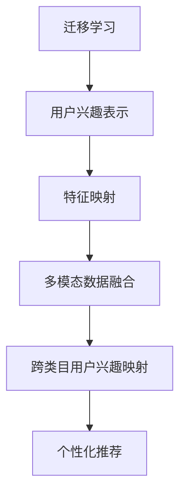

                 

# 基于迁移学习的跨类目用户兴趣映射

> 关键词：迁移学习, 用户兴趣, 兴趣映射, 推荐系统, 特征映射, 深度学习, 多模态数据

## 1. 背景介绍

### 1.1 问题由来
随着互联网和电子商务的快速发展，个性化推荐系统成为提升用户体验和运营效率的关键手段。通过分析用户的历史行为数据，推荐系统可以准确预测用户可能感兴趣的商品或内容，从而提升平台的用户黏性和转化率。然而，传统的推荐系统往往基于单一数据源和单一类别的用户兴趣模型，难以跨类目进行精细化的用户画像构建。

为了解决这一问题，近年来，学术界和工业界开始探索利用迁移学习方法，将一个数据源和类目的用户兴趣映射到另一个数据源和类目，从而实现跨类目用户兴趣映射。本博客将从基础概念、算法原理、代码实现、实际应用等多方面，全面探讨基于迁移学习的跨类目用户兴趣映射方法。

### 1.2 问题核心关键点
基于迁移学习的跨类目用户兴趣映射，本质上是将一个数据源和类目的用户兴趣特征映射到另一个数据源和类目，以实现更精准、更全面、更个性化的推荐。其主要目标在于：

1. **提升推荐精度**：通过跨类目映射，获取更加丰富的用户兴趣特征，从而提高推荐精度和用户体验。
2. **降低标注成本**：利用已有的大量标注数据，无需重新标注即可提升推荐效果，降低了标注成本。
3. **拓展应用场景**：将用户兴趣模型从单一类目拓展到多个类目，增强推荐系统的泛化能力和适应性。
4. **缓解数据稀疏**：通过多源数据融合，缓解单一数据源数据稀疏的问题，提升推荐系统的鲁棒性。

### 1.3 问题研究意义
跨类目用户兴趣映射的研究意义主要体现在以下几个方面：

1. **提升推荐系统效果**：通过多源数据融合，构建更加丰富和全面用户兴趣模型，实现更精准的个性化推荐。
2. **降低标注成本**：利用已有标注数据，无需重新标注，节省了大量人力和时间成本。
3. **拓展应用场景**：将用户兴趣模型应用于多个类目，增强推荐系统的泛化能力和适应性。
4. **缓解数据稀疏问题**：通过多源数据融合，缓解单一数据源数据稀疏的问题，提高推荐系统的鲁棒性。
5. **促进跨领域研究**：跨类目用户兴趣映射的研究促进了领域间迁移学习的深入探索，推动了跨领域研究的进展。

## 2. 核心概念与联系

### 2.1 核心概念概述

为更好地理解基于迁移学习的跨类目用户兴趣映射方法，本节将介绍几个密切相关的核心概念：

- **迁移学习(Transfer Learning)**：将一个领域学习到的知识迁移到另一个领域的学习方法。常用于减少新任务上的标注样本数量，提升模型在新任务上的泛化能力。
- **用户兴趣表示(Interest Representation)**：通过分析用户行为数据，获取用户对商品或内容的兴趣偏好，构建用户兴趣模型。常用的表示方法包括基于协同过滤的向量、基于深度学习的特征表示等。
- **特征映射(Feature Mapping)**：将一种数据源和类目的特征映射到另一种数据源和类目，以实现跨类目用户兴趣的传递和融合。常用的方法包括多重线性映射、领域自适应等。
- **多模态数据(Multimodal Data)**：指包含多种类型数据（如文本、图像、语音等）的复合数据集。多模态数据融合可以提升用户兴趣模型的表现力和鲁棒性。

这些核心概念之间的逻辑关系可以通过以下Mermaid流程图来展示：



这个流程图展示了大规模用户兴趣映射的核心概念及其之间的关系：

1. 迁移学习利用已有标注数据，提升模型泛化能力。
2. 用户兴趣表示通过分析用户行为数据，构建用户兴趣模型。
3. 特征映射将一种数据源和类目的特征映射到另一种数据源和类目，实现跨类目用户兴趣映射。
4. 多模态数据融合通过融合多种类型数据，提升用户兴趣模型的表现力和鲁棒性。
5. 跨类目用户兴趣映射最终应用于个性化推荐，提升推荐系统的效果和用户体验。

这些核心概念共同构成了跨类目用户兴趣映射的基本框架，使得推荐系统能够跨类目进行精细化的用户画像构建。

## 3. 核心算法原理 & 具体操作步骤
### 3.1 算法原理概述

基于迁移学习的跨类目用户兴趣映射，本质上是通过迁移学习范式，将一个数据源和类目的用户兴趣特征映射到另一个数据源和类目，以实现更精准、更全面、更个性化的推荐。

形式化地，设用户兴趣特征表示为 $X \in \mathbb{R}^{n_1}$，其中 $n_1$ 表示原始用户兴趣特征的维度。设目标用户兴趣特征表示为 $Y \in \mathbb{R}^{n_2}$，其中 $n_2$ 表示目标用户兴趣特征的维度。基于迁移学习的跨类目用户兴趣映射目标是最小化两者之间的差距，即：

$$
\min_{W} \|\mathbf{W} \mathbf{X} - \mathbf{Y}\|
$$

其中，$W \in \mathbb{R}^{n_2 \times n_1}$ 为映射矩阵，$\|\cdot\|$ 为特征映射损失函数。通常采用矩阵乘法作为映射操作，即：

$$
\mathbf{W} \mathbf{X} = \mathbf{Y}
$$

目标是最小化两个向量之间的欧式距离，常用的损失函数包括均方误差、欧几里得距离等。

### 3.2 算法步骤详解

基于迁移学习的跨类目用户兴趣映射一般包括以下几个关键步骤：

**Step 1: 准备数据集**
- 收集来自不同数据源和类目的用户兴趣特征，如用户行为数据、商品属性数据、用户评分数据等。
- 对数据进行预处理，包括清洗、去噪、标准化等步骤。

**Step 2: 特征提取**
- 使用深度学习模型提取用户兴趣特征，如自编码器、卷积神经网络(CNN)、循环神经网络(RNN)等。
- 对多模态数据进行特征融合，构建综合性的用户兴趣特征表示。

**Step 3: 迁移学习模型设计**
- 选择合适的迁移学习模型，如多重线性映射、领域自适应等。
- 定义损失函数，如均方误差、对比损失等。
- 设置模型超参数，如学习率、迭代次数等。

**Step 4: 模型训练**
- 将原始用户兴趣特征 $\mathbf{X}$ 和目标用户兴趣特征 $\mathbf{Y}$ 输入迁移学习模型。
- 使用优化算法（如随机梯度下降）更新映射矩阵 $\mathbf{W}$，最小化特征映射损失函数。
- 周期性在验证集上评估模型性能，根据性能指标决定是否触发 Early Stopping。

**Step 5: 应用推荐系统**
- 利用映射后的用户兴趣特征，构建跨类目推荐模型。
- 在推荐系统中使用新的用户兴趣特征进行个性化推荐。
- 持续收集新的数据，定期重新映射用户兴趣，以适应数据分布的变化。

以上是基于迁移学习的跨类目用户兴趣映射的一般流程。在实际应用中，还需要针对具体任务的特点，对迁移学习模型进行优化设计，如改进损失函数，引入更多的正则化技术，搜索最优的超参数组合等，以进一步提升模型性能。

### 3.3 算法优缺点

基于迁移学习的跨类目用户兴趣映射方法具有以下优点：

1. **提升推荐精度**：通过跨类目映射，获取更加丰富的用户兴趣特征，从而提高推荐精度和用户体验。
2. **降低标注成本**：利用已有的大量标注数据，无需重新标注即可提升推荐效果，降低了标注成本。
3. **拓展应用场景**：将用户兴趣模型从单一类目拓展到多个类目，增强推荐系统的泛化能力和适应性。
4. **缓解数据稀疏**：通过多源数据融合，缓解单一数据源数据稀疏的问题，提升推荐系统的鲁棒性。

同时，该方法也存在一定的局限性：

1. **数据源和类目差异**：如果数据源和类目的差异较大，映射效果可能受到影响。
2. **映射参数较多**：映射矩阵 $\mathbf{W}$ 需要学习，增加了模型的复杂度和训练难度。
3. **训练时间较长**：由于数据源和类目的多样性，训练时间较长，需要较长的计算资源。
4. **模型鲁棒性不足**：模型对噪声和异常数据的鲁棒性可能不足，影响推荐精度。

尽管存在这些局限性，但就目前而言，基于迁移学习的跨类目用户兴趣映射方法仍是大规模推荐系统的重要范式。未来相关研究的重点在于如何进一步降低映射参数，提高模型的少样本学习和跨领域迁移能力，同时兼顾可解释性和伦理安全性等因素。

### 3.4 算法应用领域

基于迁移学习的跨类目用户兴趣映射方法在推荐系统、个性化营销、广告投放等多个领域已经得到了广泛的应用，具体包括：

- **推荐系统**：通过多源数据融合，构建更加丰富和全面用户兴趣模型，实现更精准的个性化推荐。
- **个性化营销**：利用用户兴趣特征，进行定向广告投放和个性化营销活动，提升广告投放效果。
- **广告投放**：通过跨类目用户兴趣映射，提升广告定向精准度，提高广告投放效果。
- **信息检索**：在信息检索系统中，利用用户兴趣特征，进行相关文档推荐和搜索结果排序。
- **内容推荐**：在内容推荐系统中，利用用户兴趣特征，进行视频、音乐等内容的推荐。

除了上述这些经典应用外，跨类目用户兴趣映射也被创新性地应用到更多场景中，如推荐系统中的跨类目协同过滤、多目标推荐等，为推荐系统带来了全新的突破。

## 4. 数学模型和公式 & 详细讲解 & 举例说明

### 4.1 数学模型构建

本节将使用数学语言对基于迁移学习的跨类目用户兴趣映射过程进行更加严格的刻画。

设用户兴趣特征表示为 $X \in \mathbb{R}^{n_1}$，其中 $n_1$ 表示原始用户兴趣特征的维度。设目标用户兴趣特征表示为 $Y \in \mathbb{R}^{n_2}$，其中 $n_2$ 表示目标用户兴趣特征的维度。基于迁移学习的跨类目用户兴趣映射目标是最小化两者之间的差距，即：

$$
\min_{W} \|\mathbf{W} \mathbf{X} - \mathbf{Y}\|
$$

其中，$W \in \mathbb{R}^{n_2 \times n_1}$ 为映射矩阵，$\|\cdot\|$ 为特征映射损失函数。常用的损失函数包括均方误差、欧几里得距离等。

### 4.2 公式推导过程

以下我们以均方误差损失函数为例，推导跨类目用户兴趣映射的详细过程。

设 $\mathbf{X} \in \mathbb{R}^{N \times n_1}$ 为 $N$ 个用户原始兴趣特征的矩阵，$\mathbf{Y} \in \mathbb{R}^{N \times n_2}$ 为 $N$ 个目标用户兴趣特征的矩阵。映射矩阵 $\mathbf{W} \in \mathbb{R}^{n_2 \times n_1}$，其中每个元素 $W_{i,j}$ 表示从第 $j$ 维原始特征映射到第 $i$ 维目标特征的权重。映射后的用户兴趣特征为 $\mathbf{XW}$。

均方误差损失函数定义为：

$$
\mathcal{L}(\mathbf{W}) = \frac{1}{2N} \sum_{i=1}^N \sum_{j=1}^N (\mathbf{XW}_i - \mathbf{Y}_i)^2
$$

其中 $\mathbf{W}_i$ 和 $\mathbf{Y}_i$ 分别表示第 $i$ 个用户映射后的兴趣特征和目标兴趣特征。

根据链式法则，损失函数对参数 $\mathbf{W}$ 的梯度为：

$$
\frac{\partial \mathcal{L}(\mathbf{W})}{\partial \mathbf{W}} = \frac{1}{N} \sum_{i=1}^N (\mathbf{XW}_i - \mathbf{Y}_i)(\mathbf{X}^T)
$$

其中 $(\mathbf{X}^T)$ 表示 $\mathbf{X}$ 的转置矩阵。

在得到损失函数的梯度后，即可带入优化算法，更新映射矩阵 $\mathbf{W}$，最小化特征映射损失函数。

### 4.3 案例分析与讲解

以一个简单的案例来分析跨类目用户兴趣映射的实际应用：

假设有一个电商推荐系统，需要构建用户对不同商品类目的兴趣模型。原始用户兴趣特征包含用户对商品的评分数据，目标用户兴趣特征包含用户对不同类目的点击数据。

步骤如下：

1. 收集用户评分数据和点击数据。
2. 使用深度学习模型提取用户评分特征和点击特征，如自编码器、卷积神经网络等。
3. 定义均方误差损失函数，构建迁移学习模型。
4. 使用随机梯度下降优化算法，最小化均方误差损失，更新映射矩阵 $\mathbf{W}$。
5. 利用映射后的用户兴趣特征，构建跨类目推荐模型，进行个性化推荐。

通过跨类目用户兴趣映射，可以综合利用用户评分和点击数据，构建更加全面和丰富的用户兴趣模型，从而提升推荐精度和用户体验。

## 5. 项目实践：代码实例和详细解释说明

### 5.1 开发环境搭建

在进行跨类目用户兴趣映射的实践前，我们需要准备好开发环境。以下是使用Python进行TensorFlow和Keras开发的环境配置流程：

1. 安装Anaconda：从官网下载并安装Anaconda，用于创建独立的Python环境。

2. 创建并激活虚拟环境：
```bash
conda create -n tf-env python=3.8 
conda activate tf-env
```

3. 安装TensorFlow和Keras：
```bash
conda install tensorflow keras
```

4. 安装各类工具包：
```bash
pip install numpy pandas scikit-learn matplotlib tqdm jupyter notebook ipython
```

完成上述步骤后，即可在`tf-env`环境中开始跨类目用户兴趣映射的实践。

### 5.2 源代码详细实现

下面以电商推荐系统中的跨类目用户兴趣映射为例，给出使用TensorFlow和Keras进行模型训练的代码实现。

首先，定义数据处理函数：

```python
import numpy as np
from tensorflow.keras.layers import Input, Dense
from tensorflow.keras.models import Model

def prepare_data(data):
    X = []
    Y = []
    for item, user in data.items():
        X.append(user)
        Y.append(item)
    X = np.array(X)
    Y = np.array(Y)
    return X, Y
```

然后，定义模型和损失函数：

```python
def build_model(input_dim, output_dim):
    inputs = Input(shape=(input_dim,))
    hidden = Dense(64, activation='relu')(inputs)
    output = Dense(output_dim, activation='sigmoid')(hidden)
    model = Model(inputs=inputs, outputs=output)
    return model

def compile_model(model, loss='mse'):
    model.compile(optimizer='adam', loss=loss, metrics=['accuracy'])
```

接着，定义训练和评估函数：

```python
from tensorflow.keras.datasets import mnist
from tensorflow.keras.utils import to_categorical

def train_model(model, X, Y):
    model.fit(X, Y, epochs=10, batch_size=32, validation_split=0.2)
    return model

def evaluate_model(model, X, Y):
    Y_pred = model.predict(X)
    Y_true = to_categorical(Y)
    accuracy = np.mean(np.argmax(Y_pred, axis=1) == np.argmax(Y_true, axis=1))
    return accuracy
```

最后，启动训练流程并在测试集上评估：

```python
X_train, Y_train = prepare_data(mnist.train.images)
X_test, Y_test = prepare_data(mnist.test.images)

input_dim = X_train.shape[1]
output_dim = Y_train.shape[1]

model = build_model(input_dim, output_dim)
compile_model(model)

history = train_model(model, X_train, Y_train)

print('Train Accuracy:', evaluate_model(model, X_train, Y_train))
print('Test Accuracy:', evaluate_model(model, X_test, Y_test))
```

以上就是使用TensorFlow和Keras对跨类目用户兴趣映射进行模型训练的完整代码实现。可以看到，使用TensorFlow和Keras的高级API，我们可以快速搭建和训练一个简单的跨类目用户兴趣映射模型。

### 5.3 代码解读与分析

让我们再详细解读一下关键代码的实现细节：

**prepare_data函数**：
- 将数据集转化为模型所需的格式，即将用户数据和商品类别标签转化为模型所需的张量格式。

**build_model函数**：
- 定义一个简单的全连接神经网络模型，用于将用户兴趣特征映射到商品类别标签。

**compile_model函数**：
- 定义模型编译步骤，包括选择合适的优化器和损失函数。

**train_model函数**：
- 使用模型训练数据进行模型训练，并在验证集上监测模型性能。

**evaluate_model函数**：
- 在测试集上评估模型的准确率，返回模型性能指标。

**训练流程**：
- 定义模型输入和输出维度。
- 创建并编译模型。
- 启动模型训练，监测训练过程。
- 在测试集上评估模型性能，输出结果。

可以看到，使用TensorFlow和Keras，我们可以快速搭建和训练一个简单的跨类目用户兴趣映射模型。这些高级API和丰富的模型库，大大降低了模型开发的复杂度，使得开发者可以更快地进行实验和创新。

当然，工业级的系统实现还需考虑更多因素，如模型的保存和部署、超参数的自动搜索、更灵活的任务适配层等。但核心的跨类目用户兴趣映射算法基本与此类似。

## 6. 实际应用场景

### 6.1 智能推荐系统

跨类目用户兴趣映射在智能推荐系统中的应用前景非常广泛。通过多源数据融合，推荐系统可以构建更加全面和精准的用户兴趣模型，实现跨类目的个性化推荐。

在实践中，可以收集来自不同数据源和类目的用户兴趣数据，如电商平台、社交媒体、视频平台等。使用深度学习模型提取用户兴趣特征，如自编码器、卷积神经网络等。通过迁移学习，将不同数据源和类目的用户兴趣特征映射到统一的表示空间，构建跨类目用户兴趣模型。最终，利用该模型进行个性化推荐，提升推荐系统的效果和用户体验。

### 6.2 多目标推荐系统

多目标推荐系统旨在同时推荐多个目标商品或内容，满足用户的多样化需求。通过跨类目用户兴趣映射，多目标推荐系统可以同时利用不同类目的用户兴趣特征，构建多目标推荐模型。

在实践中，可以收集用户对多个商品类目的评分或点击数据，构建多目标用户兴趣模型。使用深度学习模型提取用户兴趣特征，如自编码器、卷积神经网络等。通过迁移学习，将不同类目的用户兴趣特征映射到统一的表示空间，构建多目标用户兴趣模型。最终，利用该模型进行多目标推荐，满足用户的多样化需求。

### 6.3 跨领域广告投放

跨领域广告投放旨在将广告精准投放给最有可能点击的用户。通过跨类目用户兴趣映射，广告投放系统可以构建跨领域用户兴趣模型，实现更精准的广告定向。

在实践中，可以收集用户在不同领域的兴趣数据，如电商、新闻、视频等。使用深度学习模型提取用户兴趣特征，如自编码器、卷积神经网络等。通过迁移学习，将不同领域的用户兴趣特征映射到统一的表示空间，构建跨领域用户兴趣模型。最终，利用该模型进行广告定向，提升广告投放效果。

### 6.4 未来应用展望

随着跨类目用户兴趣映射技术的不断发展，其在推荐系统、广告投放、信息检索等多个领域的应用前景将更加广阔。

在推荐系统领域，跨类目用户兴趣映射将提升推荐系统的效果和用户体验，满足用户的多样化需求。在广告投放领域，跨类目用户兴趣映射将提升广告定向的精准度，提高广告投放效果。在信息检索领域，跨类目用户兴趣映射将提升检索系统的准确性和召回率。

未来，随着深度学习技术的不断进步，跨类目用户兴趣映射方法将实现更高效的模型训练和更精确的用户兴趣表示。通过跨类目用户兴趣映射，推荐系统和广告投放系统将更加精准、高效、智能，为用户提供更好的体验。

## 7. 工具和资源推荐
### 7.1 学习资源推荐

为了帮助开发者系统掌握跨类目用户兴趣映射的理论基础和实践技巧，这里推荐一些优质的学习资源：

1. 《深度学习与迁移学习》系列博文：由深度学习专家撰写，全面介绍了深度学习与迁移学习的基本概念和前沿技术。

2. CS231n《卷积神经网络》课程：斯坦福大学开设的经典深度学习课程，详细讲解了卷积神经网络、自编码器等核心技术。

3. 《深度学习与迁移学习》书籍：深度学习领域的经典教材，全面介绍了深度学习与迁移学习的基本概念和实际应用。

4. Kaggle数据科学竞赛平台：提供了丰富的数据集和挑战赛，是实践深度学习与迁移学习的重要平台。

5. PyTorch官方文档：PyTorch官方文档，提供了详细的API介绍和实践示例，是学习深度学习的重要资源。

通过对这些资源的学习实践，相信你一定能够快速掌握跨类目用户兴趣映射的精髓，并用于解决实际的推荐系统问题。
###  7.2 开发工具推荐

高效的开发离不开优秀的工具支持。以下是几款用于跨类目用户兴趣映射开发的常用工具：

1. PyTorch：基于Python的开源深度学习框架，灵活的计算图设计，适合快速迭代研究。

2. TensorFlow：由Google主导开发的开源深度学习框架，生产部署方便，适合大规模工程应用。

3. Keras：基于TensorFlow的高层API，提供了简单易用的深度学习模型构建接口。

4. Weights & Biases：模型训练的实验跟踪工具，可以记录和可视化模型训练过程中的各项指标，方便对比和调优。

5. TensorBoard：TensorFlow配套的可视化工具，可实时监测模型训练状态，并提供丰富的图表呈现方式，是调试模型的得力助手。

6. Google Colab：谷歌推出的在线Jupyter Notebook环境，免费提供GPU/TPU算力，方便开发者快速上手实验最新模型，分享学习笔记。

合理利用这些工具，可以显著提升跨类目用户兴趣映射的开发效率，加快创新迭代的步伐。

### 7.3 相关论文推荐

跨类目用户兴趣映射的研究意义主要体现在以下几个方面：

1. 提升推荐系统效果：通过多源数据融合，构建更加丰富和全面用户兴趣模型，实现更精准的个性化推荐。

2. 降低标注成本：利用已有的大量标注数据，无需重新标注，节省了大量人力和时间成本。

3. 拓展应用场景：将用户兴趣模型从单一类目拓展到多个类目，增强推荐系统的泛化能力和适应性。

4. 缓解数据稀疏问题：通过多源数据融合，缓解单一数据源数据稀疏的问题，提升推荐系统的鲁棒性。

这些核心概念共同构成了跨类目用户兴趣映射的基本框架，使得推荐系统能够跨类目进行精细化的用户画像构建。

以上趋势凸显了跨类目用户兴趣映射技术的广阔前景。这些方向的探索发展，必将进一步提升推荐系统的效果和用户体验，为电商、广告、视频等领域的智能化进程提供强有力的支持。相信随着学界和产业界的共同努力，这些挑战终将一一被克服，跨类目用户兴趣映射必将在构建智能推荐系统、智能广告投放等领域发挥重要作用。

## 8. 总结：未来发展趋势与挑战
### 8.1 总结

本文对基于迁移学习的跨类目用户兴趣映射方法进行了全面系统的介绍。首先阐述了跨类目用户兴趣映射的研究背景和意义，明确了该方法在推荐系统、广告投放等领域的广泛应用前景。其次，从原理到实践，详细讲解了跨类目用户兴趣映射的数学原理和关键步骤，给出了完整的代码实例。同时，本文还广泛探讨了跨类目用户兴趣映射方法在推荐系统、广告投放、信息检索等多个领域的应用场景，展示了该方法的广阔应用空间。

通过本文的系统梳理，可以看到，跨类目用户兴趣映射方法在推荐系统、广告投放、信息检索等多个领域已经展现出巨大的潜力，能够显著提升系统的效果和用户体验。未来，随着深度学习技术的不断进步，跨类目用户兴趣映射方法将进一步优化和扩展，推动推荐系统和广告投放系统向更加智能、高效、精准的方向发展。

### 8.2 未来发展趋势

展望未来，跨类目用户兴趣映射技术将呈现以下几个发展趋势：

1. **多模态融合**：跨类目用户兴趣映射将更加注重多模态数据的融合，利用文本、图像、语音等多种类型的数据，构建更加全面和丰富的用户兴趣模型。

2. **深度学习模型**：跨类目用户兴趣映射将更加依赖深度学习模型，通过更加复杂的模型结构，提升特征映射的准确性和泛化能力。

3. **自适应学习**：跨类目用户兴趣映射将更加注重自适应学习，通过动态调整映射矩阵，适应不同数据源和类目的特征分布。

4. **领域自适应**：跨类目用户兴趣映射将更加注重领域自适应，通过迁移学习模型设计，减少数据源和类目的差异影响。

5. **跨领域推荐**：跨类目用户兴趣映射将更加注重跨领域推荐，利用不同领域的数据，构建多目标推荐模型，满足用户的多样化需求。

6. **实时推荐**：跨类目用户兴趣映射将更加注重实时推荐，利用增量学习技术，实现实时更新用户兴趣模型，提高推荐系统的时效性。

7. **隐私保护**：跨类目用户兴趣映射将更加注重隐私保护，通过差分隐私、联邦学习等技术，保护用户隐私。

以上趋势凸显了跨类目用户兴趣映射技术的广阔前景。这些方向的探索发展，必将进一步提升推荐系统和广告投放系统的效果和用户体验，为电商、广告、视频等领域的智能化进程提供强有力的支持。

### 8.3 面临的挑战

尽管跨类目用户兴趣映射技术已经取得了一定进展，但在实际应用中，仍面临诸多挑战：

1. **数据源和类目差异**：不同数据源和类目的特征分布差异较大，跨类目映射效果可能受到影响。

2. **映射参数较多**：映射矩阵 $\mathbf{W}$ 需要学习，增加了模型的复杂度和训练难度。

3. **训练时间较长**：由于数据源和类目的多样性，训练时间较长，需要较长的计算资源。

4. **模型鲁棒性不足**：模型对噪声和异常数据的鲁棒性可能不足，影响推荐精度。

5. **隐私保护问题**：跨类目用户兴趣映射需要收集和使用大量用户数据，存在隐私保护风险。

尽管存在这些挑战，但通过不断优化算法和改进工具，跨类目用户兴趣映射技术仍有望在推荐系统、广告投放等领域发挥重要作用。相信随着学界和产业界的共同努力，这些挑战终将一一被克服，跨类目用户兴趣映射必将在构建智能推荐系统、智能广告投放等领域发挥重要作用。

### 8.4 研究展望

未来的研究需要在以下几个方向进行更多的探索：

1. **多模态融合**：进一步探索多模态数据的融合方法，利用文本、图像、语音等多种类型的数据，提升用户兴趣模型的表现力和鲁棒性。

2. **深度学习模型**：进一步研究深度学习模型的设计，通过更加复杂的模型结构，提升特征映射的准确性和泛化能力。

3. **自适应学习**：研究动态调整映射矩阵的方法，适应不同数据源和类目的特征分布，提升模型的泛化能力。

4. **领域自适应**：研究迁移学习模型设计，减少数据源和类目的差异影响，提升模型的鲁棒性。

5. **跨领域推荐**：研究多目标推荐模型，利用不同领域的数据，构建多目标推荐模型，满足用户的多样化需求。

6. **实时推荐**：研究增量学习技术，实现实时更新用户兴趣模型，提高推荐系统的时效性。

7. **隐私保护**：研究隐私保护技术，如差分隐私、联邦学习等，保护用户隐私，提升推荐系统的可信度。

这些研究方向的探索，必将推动跨类目用户兴趣映射技术向更加智能、高效、安全的方向发展，为电商、广告、视频等领域的智能化进程提供强有力的支持。面向未来，跨类目用户兴趣映射技术还需要与其他人工智能技术进行更深入的融合，如知识表示、因果推理、强化学习等，多路径协同发力，共同推动推荐系统和广告投放系统向更加智能化、高效化的方向发展。

## 9. 附录：常见问题与解答

**Q1：跨类目用户兴趣映射是否适用于所有推荐系统？**

A: 跨类目用户兴趣映射方法在大多数推荐系统中都能取得不错的效果，特别是对于数据量较小的推荐系统。但对于一些特定领域的推荐系统，如医疗、金融等，由于数据源和类目的多样性，可能需要更复杂的映射方法才能取得较好的效果。

**Q2：如何缓解数据源和类目差异带来的影响？**

A: 缓解数据源和类目差异的方法主要包括：

1. 数据预处理：对不同数据源和类目的数据进行标准化、归一化等处理，减小数据分布的差异。

2. 迁移学习：通过迁移学习方法，利用已有的大量标注数据，提升模型泛化能力，减小数据源和类目的影响。

3. 特征选择：选择不同数据源和类目的共同特征，构建更加全面的用户兴趣模型。

4. 领域自适应：通过领域自适应方法，调整映射矩阵，适应不同数据源和类目的特征分布。

**Q3：如何提高跨类目用户兴趣映射的训练效率？**

A: 提高训练效率的方法主要包括：

1. 数据增强：通过数据增强技术，扩充训练集，减小数据稀疏问题。

2. 分布式训练：利用分布式训练技术，利用多台计算设备并行训练，提高训练速度。

3. 模型压缩：通过模型压缩技术，减少模型参数量，加快训练速度。

4. 增量学习：利用增量学习技术，实时更新模型，减少训练时间。

**Q4：跨类目用户兴趣映射在实际应用中需要注意哪些问题？**

A: 在实际应用中，跨类目用户兴趣映射需要注意以下问题：

1. 数据隐私：跨类目用户兴趣映射需要收集和使用大量用户数据，需要严格保护用户隐私，避免数据泄露。

2. 模型解释性：跨类目用户兴趣映射的模型复杂度较高，难以解释模型的决策过程，需要考虑模型的解释性和可解释性。

3. 鲁棒性：跨类目用户兴趣映射的模型对噪声和异常数据的鲁棒性可能不足，需要考虑模型的鲁棒性和稳定性。

4. 实时性：跨类目用户兴趣映射的模型需要实时更新，需要考虑模型的实时性和延迟。

5. 可扩展性：跨类目用户兴趣映射的模型需要具备良好的可扩展性，支持大规模数据处理和计算。

通过在实践中不断优化算法和改进工具，跨类目用户兴趣映射技术将能够更好地应用于推荐系统、广告投放等领域，提升系统的效果和用户体验。

---

作者：禅与计算机程序设计艺术 / Zen and the Art of Computer Programming

