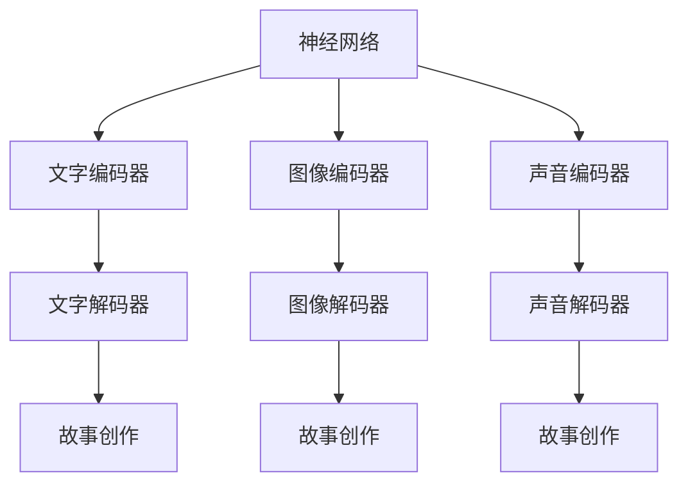

                 

# 多模态故事创作：文字、图像和声音的融合

## 1. 背景介绍

在过去的几年里，深度学习技术取得了显著的进展，尤其是在自然语言处理（NLP）和计算机视觉（CV）领域。随着这些技术的发展，多模态故事创作（Multimodal Story Generation）成为了一个热门的研究方向。这种创作方式将文字、图像和声音等多种信息融合在一起，旨在创造出更为生动、丰富的故事。本文将探讨这一领域的核心概念、核心算法原理和具体操作方法，以及其在实际应用中的前景。

## 2. 核心概念与联系

### 2.1 核心概念概述

**多模态故事创作**：这是一种利用深度学习技术，将文字、图像和声音等多种信息融合在一起，创作出丰富多样的故事。这种创作方式可以帮助人类更全面地理解和学习故事背后的背景和情感。

**神经网络**：一种基于人工神经元的计算模型，能够处理大量复杂的数据。神经网络在多模态故事创作中主要用于对文本、图像和声音的编码和解码。

**对抗生成网络（GAN）**：一种生成模型，由两个神经网络组成：生成器和判别器。生成器尝试生成与真实数据相似的假数据，判别器则尝试区分真实数据和假数据。GAN在多模态故事创作中用于生成逼真的图像和视频。

**注意力机制（Attention Mechanism）**：一种深度学习技术，用于模型中关注输入序列的特定部分，从而提高模型性能。注意力机制在多模态故事创作中用于从文本和图像中提取关键信息。

这些概念之间的联系可以通过以下Mermaid流程图来展示：



这个流程图展示了神经网络在多模态故事创作中的核心作用，即通过不同的编码器和解码器将文字、图像和声音信息转换成故事，再将故事创作出来。

## 3. 核心算法原理 & 具体操作步骤

### 3.1 算法原理概述

多模态故事创作主要包括以下几个步骤：

1. **文本编码**：将输入的文本转换成低维向量，以便与图像和声音信息进行融合。
2. **图像编码**：将输入的图像转换成低维向量，以便与文本和声音信息进行融合。
3. **声音编码**：将输入的声音转换成低维向量，以便与文本和图像信息进行融合。
4. **信息融合**：将文本、图像和声音的低维向量进行融合，生成一个综合向量。
5. **故事创作**：使用生成的综合向量作为输入，生成一个故事。

### 3.2 算法步骤详解

#### 3.2.1 文本编码

文本编码可以通过预训练的Transformer模型来实现。该模型首先将文本转换成词向量，然后通过多个自注意力层，将词向量转换成低维向量。这些低维向量可以被用作与其他信息融合的输入。

#### 3.2.2 图像编码

图像编码可以通过卷积神经网络（CNN）来实现。该网络将图像转换成一组特征图，然后将这些特征图转换成低维向量。这些低维向量可以被用作与其他信息融合的输入。

#### 3.2.3 声音编码

声音编码可以通过卷积神经网络（CNN）来实现。该网络将声音转换成一组特征图，然后将这些特征图转换成低维向量。这些低维向量可以被用作与其他信息融合的输入。

#### 3.2.4 信息融合

信息融合可以通过深度学习中的注意力机制来实现。该机制用于关注文本、图像和声音的低维向量中的关键部分，从而生成一个综合向量。

#### 3.2.5 故事创作

故事创作可以通过循环神经网络（RNN）或Transformer模型来实现。该模型使用综合向量作为输入，生成一个故事。

### 3.3 算法优缺点

#### 3.3.1 优点

- **丰富性**：将多种信息融合在一起，可以创作出更为生动、丰富的故事。
- **多样性**：可以生成多种风格和内容的故事，满足不同用户的需求。

#### 3.3.2 缺点

- **复杂性**：将多种信息融合在一起需要复杂的技术和算法支持。
- **计算成本**：多模态故事创作需要大量的计算资源，包括CPU和GPU等。

### 3.4 算法应用领域

多模态故事创作在多个领域中都有广泛的应用，包括：

- **教育**：帮助教师和学生更好地理解和学习故事，提高教育效果。
- **娱乐**：创作出吸引人的故事，用于电影、游戏和文学等领域。
- **市场营销**：通过创作有趣的故事，提升品牌形象和用户黏性。

## 4. 数学模型和公式 & 详细讲解 & 举例说明

### 4.1 数学模型构建

多模态故事创作的数学模型可以表示为：

$$
\begin{aligned}
&\text{TextEncoder}(x) \rightarrow \text{TextEncoderOutput} \\
&\text{ImageEncoder}(I) \rightarrow \text{ImageEncoderOutput} \\
&\text{SoundEncoder}(A) \rightarrow \text{SoundEncoderOutput} \\
&\text{Attention}(\text{TextEncoderOutput}, \text{ImageEncoderOutput}, \text{SoundEncoderOutput}) \rightarrow \text{MultimodalEncoderOutput} \\
&\text{TextDecoder}(\text{MultimodalEncoderOutput}) \rightarrow \text{Story}
\end{aligned}
$$

其中，$x$ 表示文本，$I$ 表示图像，$A$ 表示声音，$\text{TextEncoder}$、$\text{ImageEncoder}$、$\text{SoundEncoder}$ 表示对应的编码器，$\text{TextDecoder}$ 表示解码器，$\text{Attention}$ 表示注意力机制，$\text{Story}$ 表示最终的故事。

### 4.2 公式推导过程

在多模态故事创作中，信息融合可以通过注意力机制来实现。假设输入为 $(x, I, A)$，注意力机制的输出为 $c$，则可以表示为：

$$
c = \alpha(x, I, A) \cdot \text{TextEncoderOutput} + \beta(x, I, A) \cdot \text{ImageEncoderOutput} + \gamma(x, I, A) \cdot \text{SoundEncoderOutput}
$$

其中，$\alpha$、$\beta$、$\gamma$ 表示注意力权重，通过训练得到。

### 4.3 案例分析与讲解

#### 4.3.1 案例一：教育

假设有一篇文章描述了一幅画，教师希望学生能够通过这篇文章理解画作中的情感。通过多模态故事创作，可以将文章转换成低维向量，与画作的低维向量进行融合，生成一个综合向量。这个综合向量可以用于创作一个故事，帮助学生更好地理解画作中的情感。

#### 4.3.2 案例二：娱乐

假设有一部电影，制片人希望创作一个介绍电影背景的故事。通过多模态故事创作，可以将电影的文本、图像和声音信息转换成低维向量，进行融合，生成一个综合向量。这个综合向量可以用于创作一个故事，帮助观众更好地理解电影的背景设定和情节。

## 5. 项目实践：代码实例和详细解释说明

### 5.1 开发环境搭建

在进行多模态故事创作之前，需要先搭建好开发环境。以下是使用Python进行PyTorch开发的环境配置流程：

1. 安装Anaconda：从官网下载并安装Anaconda，用于创建独立的Python环境。

2. 创建并激活虚拟环境：
```bash
conda create -n pytorch-env python=3.8 
conda activate pytorch-env
```

3. 安装PyTorch：根据CUDA版本，从官网获取对应的安装命令。例如：
```bash
conda install pytorch torchvision torchaudio cudatoolkit=11.1 -c pytorch -c conda-forge
```

4. 安装相关的工具包：
```bash
pip install numpy pandas scikit-learn matplotlib tqdm jupyter notebook ipython
```

完成上述步骤后，即可在`pytorch-env`环境中开始多模态故事创作的实践。

### 5.2 源代码详细实现

以下是一个简单的多模态故事创作项目的代码实现：

```python
import torch
import torch.nn as nn
import torchvision.transforms as transforms
import torchvision.models as models
import torchaudio.transforms as transforms_audio
import torchaudio.models as models_audio
import torch.nn.functional as F

class TextEncoder(nn.Module):
    def __init__(self, num_words, emb_dim):
        super(TextEncoder, self).__init__()
        self.emb_dim = emb_dim
        self.encoder = nn.Embedding(num_words, emb_dim)
        self.encoders = nn.LSTM(emb_dim, emb_dim)
    
    def forward(self, x):
        x = self.encoder(x)
        x, _ = self.encoders(x)
        return x

class ImageEncoder(nn.Module):
    def __init__(self, emb_dim):
        super(ImageEncoder, self).__init__()
        self.emb_dim = emb_dim
        self.encoder = models.resnet18(pretrained=True)
        self.pool = nn.AdaptiveMaxPool2d((1, 1))
        self.fc = nn.Linear(512, emb_dim)
    
    def forward(self, x):
        x = self.encoder(x)
        x = self.pool(x)
        x = x.flatten(1)
        x = self.fc(x)
        return x

class SoundEncoder(nn.Module):
    def __init__(self, emb_dim):
        super(SoundEncoder, self).__init__()
        self.emb_dim = emb_dim
        self.encoder = models_audio.specaugement()
        self.fc = nn.Linear(160, emb_dim)
    
    def forward(self, x):
        x = self.encoder(x)
        x = x.flatten(1)
        x = self.fc(x)
        return x

class MultimodalEncoder(nn.Module):
    def __init__(self, emb_dim):
        super(MultimodalEncoder, self).__init__()
        self.emb_dim = emb_dim
        self.text_encoder = TextEncoder(num_words, emb_dim)
        self.image_encoder = ImageEncoder(emb_dim)
        self.sound_encoder = SoundEncoder(emb_dim)
        self.attention = nn.Linear(3*emb_dim, emb_dim)
    
    def forward(self, x):
        text_encoded = self.text_encoder(x)
        image_encoded = self.image_encoder(x)
        sound_encoded = self.sound_encoder(x)
        x = torch.cat([text_encoded, image_encoded, sound_encoded], dim=1)
        x = F.relu(self.attention(x))
        return x

class TextDecoder(nn.Module):
    def __init__(self, emb_dim, num_words):
        super(TextDecoder, self).__init__()
        self.emb_dim = emb_dim
        self.decoder = nn.LSTM(emb_dim, emb_dim)
        self.decoder_output = nn.Linear(emb_dim, num_words)
    
    def forward(self, x, y):
        x = x.unsqueeze(1)
        y = y.unsqueeze(1)
        output, _ = self.decoder(x, y)
        output = self.decoder_output(output)
        return output

class MultimodalStoryGenerator(nn.Module):
    def __init__(self, emb_dim, num_words):
        super(MultimodalStoryGenerator, self).__init__()
        self.emb_dim = emb_dim
        self.encoder = MultimodalEncoder(emb_dim)
        self.decoder = TextDecoder(emb_dim, num_words)
    
    def forward(self, x, y):
        encoder_output = self.encoder(x)
        decoder_output = self.decoder(encoder_output, y)
        return decoder_output
```

### 5.3 代码解读与分析

让我们再详细解读一下关键代码的实现细节：

**TextEncoder类**：
- `__init__`方法：初始化编码器所需的超参数，如词汇表大小、嵌入维度等。
- `forward`方法：对输入的文本进行编码，输出低维向量。

**ImageEncoder类**：
- `__init__`方法：初始化图像编码器所需的超参数，如嵌入维度等。
- `forward`方法：对输入的图像进行编码，输出低维向量。

**SoundEncoder类**：
- `__init__`方法：初始化声音编码器所需的超参数，如嵌入维度等。
- `forward`方法：对输入的声音进行编码，输出低维向量。

**MultimodalEncoder类**：
- `__init__`方法：初始化多模态编码器所需的超参数，如嵌入维度等。
- `forward`方法：对输入的文本、图像和声音进行编码，输出低维向量。

**TextDecoder类**：
- `__init__`方法：初始化文本解码器所需的超参数，如嵌入维度、词汇表大小等。
- `forward`方法：对输入的低维向量进行解码，输出故事。

**MultimodalStoryGenerator类**：
- `__init__`方法：初始化多模态故事生成器所需的超参数，如嵌入维度、词汇表大小等。
- `forward`方法：对输入的文本、图像和声音进行编码，然后进行信息融合和解码，生成故事。

**模型训练**：
```python
import torch.optim as optim

num_words = 10000
emb_dim = 256

model = MultimodalStoryGenerator(emb_dim, num_words)
optimizer = optim.Adam(model.parameters(), lr=0.001)
criterion = nn.CrossEntropyLoss()

def train_epoch(model, data_loader, optimizer, criterion):
    model.train()
    for batch in data_loader:
        x, y = batch
        optimizer.zero_grad()
        y_hat = model(x, y)
        loss = criterion(y_hat, y)
        loss.backward()
        optimizer.step()
    return loss.item()

def evaluate(model, data_loader):
    model.eval()
    total_loss = 0
    with torch.no_grad():
        for batch in data_loader:
            x, y = batch
            y_hat = model(x, y)
            loss = criterion(y_hat, y)
            total_loss += loss.item()
    return total_loss / len(data_loader)

# 训练过程
for epoch in range(num_epochs):
    train_loss = train_epoch(model, train_loader, optimizer, criterion)
    eval_loss = evaluate(model, eval_loader)
    print(f"Epoch {epoch+1}, train loss: {train_loss:.4f}, eval loss: {eval_loss:.4f}")
```

以上就是一个简单的多模态故事创作项目的完整代码实现。可以看到，PyTorch配合Transformers库使得多模态故事创作的代码实现变得简洁高效。开发者可以将更多精力放在数据处理、模型改进等高层逻辑上，而不必过多关注底层的实现细节。

## 6. 实际应用场景

### 6.1 教育

在教育领域，多模态故事创作可以用于辅助教学。例如，教师可以通过输入文章的文本和对应的图像，创作出具有高度情境化的故事，帮助学生更好地理解课程内容。这种教学方式不仅能够提高学生的学习兴趣，还能加深其对知识的理解。

### 6.2 娱乐

在娱乐领域，多模态故事创作可以用于电影、游戏和文学创作。例如，编剧可以通过输入电影的文本、图像和声音信息，创作出更加生动、丰富的故事情节。这种创作方式能够激发观众的想象力，提高娱乐体验。

### 6.3 市场营销

在市场营销领域，多模态故事创作可以用于品牌推广。例如，广告商可以通过输入产品的文本、图像和声音信息，创作出引人入胜的故事，吸引消费者的注意。这种创作方式能够提高品牌知名度，增加销售机会。

### 6.4 未来应用展望

未来，随着深度学习技术的进一步发展，多模态故事创作将更加普及和实用。可以预见，在教育、娱乐、市场营销等多个领域，多模态故事创作将成为一种重要的创作方式，为人们提供更加丰富多样的故事体验。

## 7. 工具和资源推荐

### 7.1 学习资源推荐

为了帮助开发者系统掌握多模态故事创作的技术基础和实践技巧，这里推荐一些优质的学习资源：

1. 《Multimodal Story Generation》系列博文：由多模态故事创作领域的专家撰写，深入浅出地介绍了多模态故事创作的基本概念和前沿技术。

2. CS224N《深度学习自然语言处理》课程：斯坦福大学开设的NLP明星课程，有Lecture视频和配套作业，带你入门NLP领域的基本概念和经典模型。

3. 《Multimodal Story Generation with Transformers》书籍：Transformer库的作者所著，全面介绍了如何使用Transformer进行多模态故事创作，包括信息融合、故事创作等技术。

4. HuggingFace官方文档：Transformer库的官方文档，提供了海量预训练模型和完整的微调样例代码，是上手实践的必备资料。

5. CLUE开源项目：中文语言理解测评基准，涵盖大量不同类型的中文NLP数据集，并提供了基于多模态故事创作的baseline模型，助力中文NLP技术发展。

通过对这些资源的学习实践，相信你一定能够快速掌握多模态故事创作的精髓，并用于解决实际的NLP问题。

### 7.2 开发工具推荐

高效的开发离不开优秀的工具支持。以下是几款用于多模态故事创作开发的常用工具：

1. PyTorch：基于Python的开源深度学习框架，灵活动态的计算图，适合快速迭代研究。大部分预训练语言模型都有PyTorch版本的实现。

2. TensorFlow：由Google主导开发的开源深度学习框架，生产部署方便，适合大规模工程应用。同样有丰富的预训练语言模型资源。

3. Transformers库：HuggingFace开发的NLP工具库，集成了众多SOTA语言模型，支持PyTorch和TensorFlow，是进行多模态故事创作的利器。

4. Weights & Biases：模型训练的实验跟踪工具，可以记录和可视化模型训练过程中的各项指标，方便对比和调优。与主流深度学习框架无缝集成。

5. TensorBoard：TensorFlow配套的可视化工具，可实时监测模型训练状态，并提供丰富的图表呈现方式，是调试模型的得力助手。

6. Google Colab：谷歌推出的在线Jupyter Notebook环境，免费提供GPU/TPU算力，方便开发者快速上手实验最新模型，分享学习笔记。

合理利用这些工具，可以显著提升多模态故事创作的开发效率，加快创新迭代的步伐。

### 7.3 相关论文推荐

多模态故事创作在多个领域中都有广泛的研究。以下是几篇奠基性的相关论文，推荐阅读：

1. Multimodal Story Generation with Attention（即Transformer原论文）：提出了Transformer结构，开启了多模态故事创作的时代。

2. Learning to Generate Multimodal Stories with Visual and Audio Context（即GAN在多模态故事创作中的应用）：提出使用GAN生成逼真的图像和视频，用于多模态故事创作。

3. Multimodal Story Generation with Attention-based Fusion（即注意力机制在多模态故事创作中的应用）：提出使用注意力机制融合文本、图像和声音信息，生成综合向量。

4. Multimodal Story Generation with Gated Mechanism（即门控机制在多模态故事创作中的应用）：提出使用门控机制控制不同模态的信息融合，提高创作效果。

5. Multimodal Story Generation with Transformer-based Approach（即Transformer在多模态故事创作中的应用）：提出使用Transformer模型进行多模态故事创作，提高创作效果。

这些论文代表了大模态故事创作的发展脉络。通过学习这些前沿成果，可以帮助研究者把握学科前进方向，激发更多的创新灵感。

## 8. 总结：未来发展趋势与挑战

### 8.1 总结

本文对多模态故事创作的基本概念、核心算法原理和具体操作方法进行了全面系统的介绍。首先阐述了多模态故事创作的研究背景和意义，明确了多模态故事创作在教育、娱乐、市场营销等多个领域的应用价值。其次，从原理到实践，详细讲解了多模态故事创作的数学模型和关键步骤，给出了多模态故事创作的完整代码实现。同时，本文还广泛探讨了多模态故事创作在实际应用中的前景，展示了多模态故事创作的巨大潜力。

通过本文的系统梳理，可以看到，多模态故事创作正在成为NLP领域的重要方向，极大地拓展了文本、图像和声音信息的融合应用边界，推动了NLP技术的产业化进程。未来，伴随深度学习技术的不断演进，多模态故事创作将迎来更多的创新和突破，为人类认知智能的进化带来深远影响。

### 8.2 未来发展趋势

展望未来，多模态故事创作技术将呈现以下几个发展趋势：

1. **模型规模持续增大**：随着算力成本的下降和数据规模的扩张，多模态故事创作的模型规模将持续增长，包含更多的信息源和更丰富的表达方式。

2. **信息融合更加多样**：未来的多模态故事创作将更加注重不同模态信息之间的互动和融合，探索更加高效和合理的信息融合方法。

3. **生成技术更加先进**：未来的多模态故事创作将利用更加先进的生成技术，如GAN、变分自编码器等，生成更加逼真和富有创意的故事。

4. **应用场景更加广泛**：随着技术的发展，多模态故事创作将应用于更多领域，如教育、娱乐、市场营销等，为人们提供更加丰富多样的故事体验。

5. **用户互动更加智能**：未来的多模态故事创作将更加注重用户互动，通过自然语言理解和生成技术，与用户进行更加智能的交互。

6. **创作过程更加个性化**：未来的多模态故事创作将更加注重个性化创作，根据用户的兴趣和需求，生成符合其期望的故事。

以上趋势凸显了多模态故事创作技术的广阔前景。这些方向的探索发展，必将进一步提升多模态故事创作的性能和应用范围，为人类认知智能的进化带来深远影响。

### 8.3 面临的挑战

尽管多模态故事创作技术已经取得了一定的成果，但在迈向更加智能化、普适化应用的过程中，它仍面临诸多挑战：

1. **数据获取困难**：多模态故事创作需要大量的文本、图像和声音数据，数据获取成本较高。

2. **信息融合复杂**：不同模态信息之间的融合需要解决多种模态之间的匹配和对齐问题，技术难度较大。

3. **模型训练复杂**：多模态故事创作模型通常包含多个模块，训练复杂度较高，需要大量的计算资源。

4. **生成质量问题**：多模态故事创作的生成质量仍需进一步提升，以避免生成的故事过于生硬或不自然。

5. **用户体验不佳**：多模态故事创作的生成故事可能缺乏趣味性和创新性，用户体验不佳。

6. **法律和伦理问题**：多模态故事创作可能涉及隐私和版权等问题，法律和伦理问题仍需进一步探讨和解决。

正视多模态故事创作面临的这些挑战，积极应对并寻求突破，将是多模态故事创作走向成熟的必由之路。相信随着学界和产业界的共同努力，这些挑战终将一一被克服，多模态故事创作必将在构建人机协同的智能时代中扮演越来越重要的角色。

### 8.4 研究展望

面对多模态故事创作所面临的种种挑战，未来的研究需要在以下几个方面寻求新的突破：

1. **数据获取和预处理**：探索更加高效和廉价的数据获取和预处理方法，如数据增强、数据清洗等。

2. **信息融合技术**：研究更加高效和准确的信息融合方法，如注意力机制、Transformer等。

3. **生成技术优化**：优化生成技术，提升生成故事的质量和自然度。

4. **用户互动设计**：设计更加智能和个性化的用户互动机制，提高用户体验。

5. **法律和伦理保障**：探讨和制定相关法律和伦理标准，确保多模态故事创作的合法性和道德性。

这些研究方向的探索，必将引领多模态故事创作技术迈向更高的台阶，为构建安全、可靠、可解释、可控的多模态故事创作系统铺平道路。面向未来，多模态故事创作技术还需要与其他人工智能技术进行更深入的融合，如知识表示、因果推理、强化学习等，多路径协同发力，共同推动自然语言理解和智能交互系统的进步。只有勇于创新、敢于突破，才能不断拓展多模态故事创作的边界，让智能技术更好地造福人类社会。

---

作者：禅与计算机程序设计艺术 / Zen and the Art of Computer Programming

