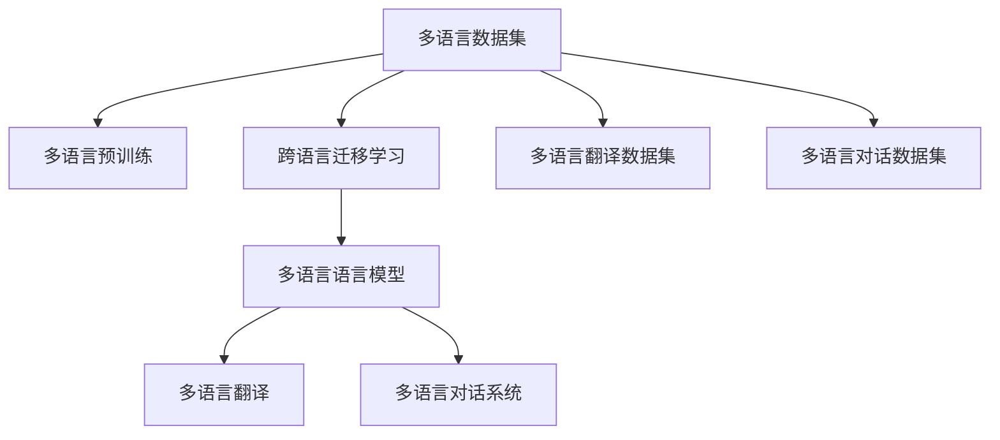

                 

# 多语言AI模型：跨语言理解与生成

> 关键词：多语言理解,多语言生成,跨语言迁移学习,多语言语言模型,多语言翻译,跨语言对话系统

## 1. 背景介绍

### 1.1 问题由来

随着全球化进程的加速，多语言处理已经成为人工智能领域的一个重要研究方向。无论是机器翻译、多语言问答系统，还是跨语言推荐和对话，多语言处理能够显著提升国际化场景下的用户交互体验，推动全球数据和文化交流的深度融合。

近年来，深度学习技术取得了突破性进展，使得多语言处理任务可以更加高效地实现。特别是基于Transformer架构的语言模型，在单语言理解与生成上取得了显著成果，推动了多语言处理向深度学习方向的发展。例如，谷歌发布的BERT模型，就展示了其在多语言任务上的优异表现，通过跨语言的预训练和微调，实现了在多个语言上的多任务学习。

然而，多语言处理仍然面临诸多挑战，特别是在不同语言之间进行知识的迁移和转移时，模型往往需要大量的双语或多语言数据，才能获得理想的跨语言泛化能力。如何高效地实现跨语言知识迁移和多语言模型的构建，成为了当前研究的热点问题。

### 1.2 问题核心关键点

当前，多语言处理中的核心问题包括：

- **多语言数据的获取**：跨语言任务的训练需要大量的双语或多语言数据，这对数据收集和标注工作提出了较高要求。
- **多语言知识迁移**：如何有效地将一种语言的先验知识迁移到另一种语言中，是跨语言迁移学习的重要研究方向。
- **多语言模型构建**：构建具备跨语言理解和生成能力的多语言模型，需要解决语言间的语义差异、词法差异等问题。
- **多语言模型的优化**：跨语言模型的训练和推理需要考虑多语言之间的语义一致性和结构差异，优化过程更为复杂。

本文聚焦于多语言处理中的跨语言理解与生成任务，详细探讨了多语言AI模型的核心概念、算法原理和实践步骤，并给出了实际应用场景的案例分析。

## 2. 核心概念与联系

### 2.1 核心概念概述

为更好地理解多语言AI模型的构建与优化，本节将介绍几个密切相关的核心概念：

- **多语言数据集(Multilingual Dataset)**：包括双语、多语语料，用于训练多语言模型。
- **多语言预训练(Multilingual Pre-training)**：指在大规模无标签多语言数据上进行预训练，学习通用的语言表示。
- **跨语言迁移学习(Cross-lingual Transfer Learning)**：指将一种语言的模型参数或知识迁移到另一种语言，提高模型的跨语言泛化能力。
- **多语言语言模型(Multilingual Language Model)**：指能够同时处理多种语言的多语言模型，能够进行跨语言的理解与生成。
- **多语言翻译(Multilingual Translation)**：指将一种语言的文本翻译成另一种语言，要求模型具备对两种语言之间的语义和词汇映射的准确理解。
- **多语言对话系统(Multilingual Conversational System)**：指能够与多种语言用户进行自然对话的系统，要求模型具备跨语言的交互能力和语境理解。

这些核心概念之间的逻辑关系可以通过以下Mermaid流程图来展示：



这个流程图展示了大语言模型的核心概念及其之间的关系：

1. 多语言数据集是模型训练的基础。
2. 多语言预训练学习通用的语言表示。
3. 跨语言迁移学习将一种语言的模型参数或知识迁移到另一种语言。
4. 多语言语言模型具备跨语言的理解和生成能力。
5. 多语言翻译和多语言对话系统是应用多语言语言模型的具体场景。

这些概念共同构成了多语言处理的基本框架，使得模型能够跨越语言障碍，进行多语言间的信息交换与理解。

## 3. 核心算法原理 & 具体操作步骤

### 3.1 算法原理概述

多语言AI模型的核心算法包括多语言预训练、跨语言迁移学习和多语言语言模型的构建与优化。其基本思想是通过多语言数据集对模型进行预训练，学习通用的语言表示，并在多种语言之间进行知识迁移，构建多语言语言模型，实现跨语言的理解与生成。

形式化地，假设模型参数为 $\theta$，通过多语言数据集 $D$ 对模型进行预训练，学习通用的语言表示。然后通过跨语言迁移学习，将一种语言的模型参数或知识迁移到另一种语言，得到新模型的参数 $\hat{\theta}$。最后，使用多语言翻译或对话数据集对模型进行微调，优化模型的跨语言泛化能力。

### 3.2 算法步骤详解

基于多语言AI模型的构建与优化，一般包括以下几个关键步骤：

**Step 1: 准备多语言数据集**

- 收集多种语言的文本数据，构建双语或多语语料库。
- 清洗数据，去除低质量样本和噪声。
- 对文本进行分词、词性标注、实体识别等预处理，以便后续模型的构建。

**Step 2: 设计多语言预训练模型**

- 选择合适的预训练模型架构，如Transformer。
- 设计多语言的预训练目标，如语言建模、掩码语言建模等。
- 确定预训练的参数初始化方式和优化器参数。

**Step 3: 执行多语言预训练**

- 将多语言数据集划分为训练集和验证集。
- 使用预训练模型对训练集进行多语言预训练。
- 周期性在验证集上评估模型性能，确保模型不发生过拟合。

**Step 4: 执行跨语言迁移学习**

- 选择合适的迁移学习策略，如参数共享、知识蒸馏等。
- 将预训练模型中的参数或知识迁移到目标语言模型中。
- 对目标语言模型进行微调，优化模型的跨语言泛化能力。

**Step 5: 多语言语言模型优化**

- 针对多语言语言模型进行优化，如参数剪枝、模型压缩等。
- 使用多语言翻译或对话数据集对模型进行微调，优化模型的跨语言生成能力。
- 在多语言数据集上测试模型性能，确保模型的跨语言泛化能力。

以上是多语言AI模型的构建与优化的基本流程。在实际应用中，还需要根据具体任务的特点，对模型的构建和优化进行灵活调整，以获得最佳性能。

### 3.3 算法优缺点

多语言AI模型在多语言处理中具有以下优点：

- **泛化能力强**：多语言预训练和跨语言迁移学习能够显著提升模型在不同语言之间的泛化能力。
- **数据需求低**：多语言预训练和大规模无标签数据的利用，降低了多语言处理对标注数据的依赖。
- **模型高效**：通过跨语言迁移学习，可以在少量双语或多语数据上获得较高的性能提升。

同时，该方法也存在一定的局限性：

- **模型结构复杂**：多语言语言模型的构建和优化较为复杂，需要考虑语言间的语义差异和词法差异。
- **迁移效果有限**：不同语言之间的差异较大，跨语言迁移学习的效果可能有限。
- **资源消耗大**：大规模多语言数据的预训练和多语言模型的优化，需要消耗大量的计算资源和时间。

尽管存在这些局限性，但就目前而言，多语言AI模型是实现跨语言理解和生成的重要手段。未来相关研究的重点在于如何进一步提升模型的泛化能力，降低资源消耗，同时兼顾模型的可解释性和伦理安全性等因素。

### 3.4 算法应用领域

多语言AI模型已经在多语言处理的多项任务上取得了显著的进展，覆盖了语言理解、语言生成、机器翻译、对话系统等多个领域：

- **多语言问答系统**：将不同语言的问题映射为标准化的向量表示，通过多语言语言模型进行理解与生成，返回相应的答案。
- **多语言翻译**：将一种语言的文本翻译成另一种语言，使用多语言翻译模型进行语言之间的映射。
- **多语言对话系统**：能够与多种语言用户进行自然对话，通过多语言语言模型进行跨语言的交互和语境理解。
- **多语言推荐系统**：基于用户的跨语言行为数据，进行推荐模型的构建与优化，实现跨语言个性化推荐。
- **多语言文本摘要**：将多种语言的文章或文本自动压缩成摘要，提升文本处理的效率和效果。

除了这些经典任务外，多语言AI模型还被创新性地应用到更多场景中，如跨语言信息检索、跨语言情感分析、跨语言命名实体识别等，为多语言处理技术带来了新的突破。

## 4. 数学模型和公式 & 详细讲解 & 举例说明

### 4.1 数学模型构建

本节将使用数学语言对多语言AI模型的构建与优化过程进行更加严格的刻画。

假设多语言数据集为 $D=\{(x_i, y_i)\}_{i=1}^N, x_i \in \mathcal{X}, y_i \in \mathcal{Y}$，其中 $\mathcal{X}$ 为输入空间，$\mathcal{Y}$ 为输出空间。记多语言语言模型为 $M_{\theta}:\mathcal{X} \rightarrow \mathcal{Y}$，其中 $\theta$ 为模型参数。

定义多语言语言模型在数据样本 $(x,y)$ 上的损失函数为 $\ell(M_{\theta}(x),y)$，则在数据集 $D$ 上的经验风险为：

$$
\mathcal{L}(\theta) = \frac{1}{N} \sum_{i=1}^N \ell(M_{\theta}(x_i),y_i)
$$

多语言语言模型的优化目标是最小化经验风险，即找到最优参数：

$$
\theta^* = \mathop{\arg\min}_{\theta} \mathcal{L}(\theta)
$$

在实践中，我们通常使用基于梯度的优化算法（如AdamW、SGD等）来近似求解上述最优化问题。设 $\eta$ 为学习率，$\lambda$ 为正则化系数，则参数的更新公式为：

$$
\theta \leftarrow \theta - \eta \nabla_{\theta}\mathcal{L}(\theta) - \eta\lambda\theta
$$

其中 $\nabla_{\theta}\mathcal{L}(\theta)$ 为损失函数对参数 $\theta$ 的梯度，可通过反向传播算法高效计算。

### 4.2 公式推导过程

以下我们以多语言翻译任务为例，推导多语言语言模型的交叉熵损失函数及其梯度的计算公式。

假设模型 $M_{\theta}$ 在输入 $x$ 上的输出为 $\hat{y}=M_{\theta}(x) \in [0,1]$，表示样本属于目标语言的概率。真实标签 $y \in \{0,1\}$。则二分类交叉熵损失函数定义为：

$$
\ell(M_{\theta}(x),y) = -[y\log \hat{y} + (1-y)\log (1-\hat{y})]
$$

将其代入经验风险公式，得：

$$
\mathcal{L}(\theta) = -\frac{1}{N}\sum_{i=1}^N [y_i\log M_{\theta}(x_i)+(1-y_i)\log(1-M_{\theta}(x_i))]
$$

根据链式法则，损失函数对参数 $\theta_k$ 的梯度为：

$$
\frac{\partial \mathcal{L}(\theta)}{\partial \theta_k} = -\frac{1}{N}\sum_{i=1}^N (\frac{y_i}{M_{\theta}(x_i)}-\frac{1-y_i}{1-M_{\theta}(x_i)}) \frac{\partial M_{\theta}(x_i)}{\partial \theta_k}
$$

其中 $\frac{\partial M_{\theta}(x_i)}{\partial \theta_k}$ 可进一步递归展开，利用自动微分技术完成计算。

在得到损失函数的梯度后，即可带入参数更新公式，完成模型的迭代优化。重复上述过程直至收敛，最终得到适应多语言任务的最优模型参数 $\theta^*$。

## 5. 项目实践：代码实例和详细解释说明

### 5.1 开发环境搭建

在进行多语言AI模型的开发之前，我们需要准备好开发环境。以下是使用Python进行PyTorch开发的环境配置流程：

1. 安装Anaconda：从官网下载并安装Anaconda，用于创建独立的Python环境。

2. 创建并激活虚拟环境：
```bash
conda create -n pytorch-env python=3.8 
conda activate pytorch-env
```

3. 安装PyTorch：根据CUDA版本，从官网获取对应的安装命令。例如：
```bash
conda install pytorch torchvision torchaudio cudatoolkit=11.1 -c pytorch -c conda-forge
```

4. 安装Transformers库：
```bash
pip install transformers
```

5. 安装各类工具包：
```bash
pip install numpy pandas scikit-learn matplotlib tqdm jupyter notebook ipython
```

完成上述步骤后，即可在`pytorch-env`环境中开始多语言AI模型的开发实践。

### 5.2 源代码详细实现

下面我以多语言翻译任务为例，给出使用Transformers库对多语言BERT模型进行微调的PyTorch代码实现。

首先，定义多语言翻译任务的数据处理函数：

```python
from transformers import BertTokenizer
from torch.utils.data import Dataset
import torch

class MultilingualTranslationDataset(Dataset):
    def __init__(self, src_texts, trg_texts, tokenizer, max_len=128):
        self.src_texts = src_texts
        self.trg_texts = trg_texts
        self.tokenizer = tokenizer
        self.max_len = max_len
        
    def __len__(self):
        return len(self.src_texts)
    
    def __getitem__(self, item):
        src_text = self.src_texts[item]
        trg_text = self.trg_texts[item]
        
        encoding = self.tokenizer(src_text, trg_text, return_tensors='pt', max_length=self.max_len, padding='max_length', truncation=True)
        input_ids = encoding['src_ids']
        attention_mask = encoding['src_mask']
        
        # 将目标语言编码成序列，并进行解码
        encoded_trg = self.tokenizer(trg_text, return_tensors='pt', max_length=self.max_len, padding='max_length', truncation=True)
        output_ids = encoded_trg['input_ids']
        trg_mask = encoded_trg['attention_mask']
        
        return {'src_ids': input_ids, 
                'src_mask': attention_mask,
                'trg_ids': output_ids,
                'trg_mask': trg_mask}

# 定义源语言和目标语言
src_lang = 'en'
trg_lang = 'zh'

# 创建dataset
tokenizer = BertTokenizer.from_pretrained('bert-base-multilingual-cased')

train_dataset = MultilingualTranslationDataset(train_src_texts, train_trg_texts, tokenizer)
dev_dataset = MultilingualTranslationDataset(dev_src_texts, dev_trg_texts, tokenizer)
test_dataset = MultilingualTranslationDataset(test_src_texts, test_trg_texts, tokenizer)
```

然后，定义模型和优化器：

```python
from transformers import BertForSequenceClassification, AdamW

model = BertForSequenceClassification.from_pretrained('bert-base-multilingual-cased', num_labels=2)

optimizer = AdamW(model.parameters(), lr=2e-5)
```

接着，定义训练和评估函数：

```python
from torch.utils.data import DataLoader
from tqdm import tqdm
from sklearn.metrics import accuracy_score

device = torch.device('cuda') if torch.cuda.is_available() else torch.device('cpu')
model.to(device)

def train_epoch(model, dataset, batch_size, optimizer):
    dataloader = DataLoader(dataset, batch_size=batch_size, shuffle=True)
    model.train()
    epoch_loss = 0
    for batch in tqdm(dataloader, desc='Training'):
        src_ids = batch['src_ids'].to(device)
        src_mask = batch['src_mask'].to(device)
        trg_ids = batch['trg_ids'].to(device)
        trg_mask = batch['trg_mask'].to(device)
        model.zero_grad()
        outputs = model(src_ids, trg_ids, attention_mask=src_mask)
        loss = outputs.loss
        epoch_loss += loss.item()
        loss.backward()
        optimizer.step()
    return epoch_loss / len(dataloader)

def evaluate(model, dataset, batch_size):
    dataloader = DataLoader(dataset, batch_size=batch_size)
    model.eval()
    preds, labels = [], []
    with torch.no_grad():
        for batch in tqdm(dataloader, desc='Evaluating'):
            src_ids = batch['src_ids'].to(device)
            src_mask = batch['src_mask'].to(device)
            trg_ids = batch['trg_ids'].to(device)
            trg_mask = batch['trg_mask'].to(device)
            batch_preds = model(src_ids, trg_ids, attention_mask=src_mask).logits.argmax(dim=2).to('cpu').tolist()
            batch_labels = trg_ids.to('cpu').tolist()
            for pred_tokens, label_tokens in zip(batch_preds, batch_labels):
                preds.append(pred_tokens)
                labels.append(label_tokens)
                
    return accuracy_score(labels, preds)

```

最后，启动训练流程并在测试集上评估：

```python
epochs = 5
batch_size = 16

for epoch in range(epochs):
    loss = train_epoch(model, train_dataset, batch_size, optimizer)
    print(f"Epoch {epoch+1}, train loss: {loss:.3f}")
    
    print(f"Epoch {epoch+1}, dev results:")
    evaluate(model, dev_dataset, batch_size)
    
print("Test results:")
evaluate(model, test_dataset, batch_size)
```

以上就是使用PyTorch对多语言BERT模型进行翻译任务的微调的完整代码实现。可以看到，得益于Transformers库的强大封装，我们可以用相对简洁的代码完成多语言BERT模型的加载和微调。

### 5.3 代码解读与分析

让我们再详细解读一下关键代码的实现细节：

**MultilingualTranslationDataset类**：
- `__init__`方法：初始化源语言和目标语言文本，分词器等关键组件。
- `__len__`方法：返回数据集的样本数量。
- `__getitem__`方法：对单个样本进行处理，将源语言和目标语言输入转换为模型所需的格式，并进行定长padding，最终返回模型所需的输入。

**标签与id的映射**：
- 定义了源语言和目标语言与数字id之间的映射关系，用于将token-wise的预测结果解码回真实的语言。

**训练和评估函数**：
- 使用PyTorch的DataLoader对数据集进行批次化加载，供模型训练和推理使用。
- 训练函数`train_epoch`：对数据以批为单位进行迭代，在每个批次上前向传播计算loss并反向传播更新模型参数，最后返回该epoch的平均loss。
- 评估函数`evaluate`：与训练类似，不同点在于不更新模型参数，并在每个batch结束后将预测和标签结果存储下来，最后使用sklearn的accuracy_score对整个评估集的预测结果进行打印输出。

**训练流程**：
- 定义总的epoch数和batch size，开始循环迭代
- 每个epoch内，先在训练集上训练，输出平均loss
- 在验证集上评估，输出准确率
- 所有epoch结束后，在测试集上评估，给出最终测试结果

可以看到，PyTorch配合Transformers库使得多语言BERT模型的微调的代码实现变得简洁高效。开发者可以将更多精力放在数据处理、模型改进等高层逻辑上，而不必过多关注底层的实现细节。

当然，工业级的系统实现还需考虑更多因素，如模型的保存和部署、超参数的自动搜索、更灵活的任务适配层等。但核心的微调范式基本与此类似。

## 6. 实际应用场景

### 6.1 智能客服系统

多语言AI模型在智能客服系统的构建中有着广泛的应用。传统的客服系统往往需要配备大量人力，高峰期响应缓慢，且服务质量难以保证。而使用多语言AI模型，可以24小时不间断地服务多种语言的客户，提升客户咨询体验和问题解决效率。

在技术实现上，可以收集不同语言的用户客服历史记录，将问题-答案对构建成监督数据，在此基础上对多语言AI模型进行微调。微调后的模型能够自动理解用户意图，匹配最合适的答案模板进行回复。对于客户提出的新问题，还可以接入检索系统实时搜索相关内容，动态组织生成回答。如此构建的智能客服系统，能够大大减少人力成本，提高客户满意度。

### 6.2 金融舆情监测

金融机构需要实时监测不同语言的市场舆论动向，以便及时应对负面信息传播，规避金融风险。传统的人工监测方式成本高、效率低，难以应对网络时代海量信息爆发的挑战。多语言AI模型能够自动处理多种语言的新闻、报道、评论等文本数据，进行情感分析和舆情监测，及时预警异常情况，辅助金融机构快速应对潜在风险。

具体而言，可以收集金融领域不同语言的文本数据，构建多语言情感分析模型，对实时抓取的网络文本数据进行情感分类。将多语言情感分析模型应用到金融舆情监测中，能够自动识别舆情变化趋势，减少人工干预，提高金融风险预警的效率和准确性。

### 6.3 个性化推荐系统

多语言AI模型在个性化推荐系统中也有着重要的应用。传统的推荐系统往往只依赖用户的历史行为数据进行物品推荐，难以把握用户的多语言兴趣。通过多语言AI模型，可以更好地理解用户在不同语言下的行为，并进行多语言推荐。

在实践中，可以收集用户在不同语言下的浏览、点击、评论等行为数据，将文本内容作为模型输入，用户的后续行为（如是否点击、购买等）作为监督信号，在此基础上对多语言AI模型进行微调。微调后的模型能够从文本内容中准确把握用户的兴趣点，实现跨语言的个性化推荐。

### 6.4 未来应用展望

随着多语言AI模型的不断发展，其在多语言处理中的应用场景将进一步拓展，为全球数据和文化交流带来新的机遇：

- **多语言对话系统**：构建能够与多种语言用户进行自然对话的多语言对话系统，提升跨语言交流的便利性和效率。
- **多语言翻译与文本生成**：开发高质量的多语言翻译模型，实现跨语言的文本生成与信息检索，促进全球文化交流和数据共享。
- **多语言情感分析与舆情监测**：构建多语言情感分析模型，进行全球舆情监测和情绪分析，助力金融、政治等领域决策支持。
- **多语言信息检索与知识图谱**：将多语言文本数据映射到知识图谱中，提升多语言信息检索的精确度和相关度。
- **多语言跨语言推荐与广告**：构建跨语言推荐系统，提升跨语言广告投放的转化率，提升广告主的收益。

## 7. 工具和资源推荐

### 7.1 学习资源推荐

为了帮助开发者系统掌握多语言AI模型的理论基础和实践技巧，这里推荐一些优质的学习资源：

1. **《多语言深度学习》书籍**：详细介绍了多语言深度学习的原理和实践，包括多语言数据集构建、多语言预训练和跨语言迁移学习等。
2. **CS229《机器学习》课程**：斯坦福大学开设的机器学习明星课程，涵盖了深度学习、迁移学习、多语言处理等多个主题，是学习多语言AI模型的重要参考资料。
3. **HuggingFace官方文档**：提供了丰富的多语言预训练模型和微调样例代码，是上手实践的必备资料。
4. **CLUE开源项目**：中文语言理解测评基准，涵盖大量不同类型的中文NLP数据集，并提供了基于多语言预训练模型的baseline模型，助力中文NLP技术发展。
5. **Multilingual-SNLI（多语言NLI）论文**：研究了多语言语言模型的跨语言推理能力，展示了多语言预训练在多语言自然语言推理任务上的效果。

通过对这些资源的学习实践，相信你一定能够快速掌握多语言AI模型的精髓，并用于解决实际的NLP问题。

### 7.2 开发工具推荐

高效的开发离不开优秀的工具支持。以下是几款用于多语言AI模型开发的常用工具：

1. **PyTorch**：基于Python的开源深度学习框架，灵活动态的计算图，适合快速迭代研究。
2. **TensorFlow**：由Google主导开发的开源深度学习框架，生产部署方便，适合大规模工程应用。
3. **Transformers库**：HuggingFace开发的NLP工具库，集成了众多SOTA多语言模型，支持PyTorch和TensorFlow，是进行多语言模型开发的利器。
4. **Weights & Biases**：模型训练的实验跟踪工具，可以记录和可视化模型训练过程中的各项指标，方便对比和调优。与主流深度学习框架无缝集成。
5. **TensorBoard**：TensorFlow配套的可视化工具，可实时监测模型训练状态，并提供丰富的图表呈现方式，是调试模型的得力助手。
6. **Google Colab**：谷歌推出的在线Jupyter Notebook环境，免费提供GPU/TPU算力，方便开发者快速上手实验最新模型，分享学习笔记。

合理利用这些工具，可以显著提升多语言AI模型微调任务的开发效率，加快创新迭代的步伐。

### 7.3 相关论文推荐

多语言AI模型和迁移学习的发展源于学界的持续研究。以下是几篇奠基性的相关论文，推荐阅读：

1. **"Attention is All You Need"**：提出了Transformer结构，开启了NLP领域的预训练大模型时代。
2. **"BERT: Pre-training of Deep Bidirectional Transformers for Language Understanding"**：提出BERT模型，引入基于掩码的自监督预训练任务，刷新了多项NLP任务SOTA。
3. **"Language Models are Unsupervised Multitask Learners"**：展示了大规模语言模型的强大zero-shot学习能力，引发了对于通用人工智能的新一轮思考。
4. **"Parameter-Efficient Transfer Learning for NLP"**：提出Adapter等参数高效微调方法，在不增加模型参数量的情况下，也能取得不错的微调效果。
5. **"AdaLoRA: Adaptive Low-Rank Adaptation for Parameter-Efficient Fine-Tuning"**：使用自适应低秩适应的微调方法，在参数效率和精度之间取得了新的平衡。
6. **"MigTrans: Adaptive Multilingual Transfer Learning"**：研究了多语言迁移学习的多任务学习范式，提升了跨语言迁移学习的效果。

这些论文代表了大语言模型和迁移学习的最新进展。通过学习这些前沿成果，可以帮助研究者把握学科前进方向，激发更多的创新灵感。

## 8. 总结：未来发展趋势与挑战

### 8.1 总结

本文对多语言AI模型的构建与优化方法进行了全面系统的介绍。首先阐述了多语言处理的研究背景和意义，明确了多语言AI模型在多语言理解和生成任务中的独特价值。其次，从原理到实践，详细讲解了多语言预训练、跨语言迁移学习和多语言语言模型的构建与优化，给出了实际应用场景的案例分析。

通过本文的系统梳理，可以看到，多语言AI模型在多语言处理中具有巨大的应用潜力，通过多语言预训练和跨语言迁移学习，能够显著提升模型在不同语言之间的泛化能力，适应多语言环境的复杂需求。

### 8.2 未来发展趋势

展望未来，多语言AI模型将呈现以下几个发展趋势：

1. **模型规模持续增大**：随着算力成本的下降和数据规模的扩张，多语言预训练语言模型的参数量还将持续增长。超大规模多语言模型蕴含的丰富语言知识，有望支撑更加复杂多变的跨语言微调任务。
2. **多语言迁移学习方法更加多样化**：除了传统的参数共享和知识蒸馏外，未来会涌现更多新颖的跨语言迁移方法，如多任务学习、零样本学习等，进一步提升模型的泛化能力。
3. **持续学习和动态适应**：多语言AI模型需要具备持续学习和动态适应的能力，能够在新的数据到来时，快速更新模型参数，保持性能。
4. **跨语言迁移学习与本地化优化的结合**：结合多语言迁移学习与本地化优化，使得模型能够兼顾通用性和本地化需求，提升模型的泛化能力。
5. **多语言跨模态融合**：将多语言文本数据与图像、语音等多模态数据进行融合，提升模型的跨语言理解与生成能力。
6. **多语言跨语言推荐与广告**：结合多语言情感分析和跨语言推荐技术，提升跨语言广告投放的转化率，提升广告主的收益。

以上趋势凸显了多语言AI模型的广阔前景。这些方向的探索发展，必将进一步提升多语言处理系统的性能和应用范围，为全球数据和文化交流提供新的技术支持。

### 8.3 面临的挑战

尽管多语言AI模型已经取得了显著成果，但在迈向更加智能化、普适化应用的过程中，它仍面临着诸多挑战：

1. **标注成本高**：多语言数据集的构建需要大量双语或多语言数据，成本较高。如何在低成本下获取高质量的多语言数据，是一个重要的研究方向。
2. **跨语言泛化能力有限**：不同语言之间的差异较大，跨语言迁移学习的效果可能有限。如何提高多语言模型的泛化能力，是一个亟待解决的问题。
3. **模型资源消耗大**：大规模多语言数据的预训练和多语言模型的优化，需要消耗大量的计算资源和时间。如何在保持性能的同时，提高模型的训练效率，是一个重要的研究方向。
4. **跨语言推理能力不足**：当前多语言模型往往只能处理特定的语言任务，跨语言的推理能力较弱。如何提高多语言模型的跨语言推理能力，是一个亟待解决的问题。
5. **多语言情感分析与舆情监测的鲁棒性不足**：多语言情感分析与舆情监测面临多语言的情感差异和语境多样性问题，如何提高模型的鲁棒性和准确性，是一个亟待解决的问题。
6. **多语言对话系统的可解释性不足**：多语言对话系统往往依赖黑盒模型进行推理，难以解释其内部工作机制和决策逻辑。如何提高多语言对话系统的可解释性，是一个亟待解决的问题。

这些挑战展示了多语言AI模型在实际应用中的困难和挑战，但正是这些挑战推动了多语言处理技术的不断进步，值得我们深入研究和解决。

### 8.4 研究展望

面对多语言AI模型所面临的种种挑战，未来的研究需要在以下几个方面寻求新的突破：

1. **探索多语言无监督和半监督学习**：摆脱对大量标注数据的依赖，利用自监督学习、主动学习等无监督和半监督范式，最大限度利用非结构化数据，实现更加灵活高效的多语言模型构建。
2. **开发参数高效和计算高效的多语言模型**：开发更加参数高效和计算高效的多语言模型，在固定大部分预训练参数的同时，只更新极少量的任务相关参数，提升模型的训练效率。
3. **融合因果推理和对比学习**：引入因果推理和对比学习思想，增强多语言模型的泛化能力和跨语言推理能力，提升模型在复杂多变的多语言环境下的适应性。
4. **融合多模态信息**：将多语言文本数据与图像、语音等多模态数据进行融合，提升模型的跨语言理解和生成能力。
5. **引入伦理道德约束**：在多语言模型的训练目标中引入伦理导向的评估指标，过滤和惩罚有偏见、有害的输出倾向，确保模型的公平性和安全性。

这些研究方向的探索，必将引领多语言AI模型的不断进步，为构建安全、可靠、可解释、可控的多语言智能系统铺平道路。面向未来，多语言AI模型需要与其他人工智能技术进行更深入的融合，如知识表示、因果推理、强化学习等，多路径协同发力，共同推动自然语言理解和智能交互系统的进步。只有勇于创新、敢于突破，才能不断拓展多语言模型的边界，让智能技术更好地服务于全球化进程。

## 9. 附录：常见问题与解答

**Q1: 多语言AI模型在实际应用中需要注意哪些问题？**

A: 多语言AI模型在实际应用中需要注意以下问题：
1. 数据收集与标注：构建高质量的多语言数据集需要大量双语或多语言数据，成本较高。需要考虑如何降低标注成本，获取高质量的多语言数据。
2. 模型泛化能力：多语言模型需要具备较强的泛化能力，能够在多种语言之间进行知识迁移。需要在多语言数据集上进行充分预训练，提升模型的泛化能力。
3. 资源消耗：多语言模型的预训练和优化需要消耗大量计算资源和时间。需要优化模型的计算图，提高训练效率。
4. 跨语言推理能力：当前多语言模型往往只能处理特定的语言任务，跨语言的推理能力较弱。需要在多语言数据集上进行充分预训练，提升模型的跨语言推理能力。
5. 鲁棒性与可解释性：多语言模型需要具备较高的鲁棒性和可解释性，确保在不同语言环境中都能稳定运行，并能够解释其内部工作机制和决策逻辑。

**Q2: 多语言AI模型与单语言AI模型相比有哪些优势？**

A: 多语言AI模型与单语言AI模型相比有以下优势：
1. 泛化能力强：多语言AI模型能够学习通用的语言表示，能够在多种语言之间进行知识迁移，提升模型的泛化能力。
2. 数据需求低：多语言预训练和跨语言迁移学习能够充分利用大规模无标签数据，降低标注数据的需求。
3. 模型效率高：多语言AI模型能够在一个模型中处理多种语言，减少模型种类和资源消耗。
4. 应用范围广：多语言AI模型可以应用于多种多语言处理任务，如翻译、问答、对话等，具有更广泛的应用场景。

**Q3: 多语言AI模型在多语言翻译中如何处理语言差异？**

A: 多语言AI模型在多语言翻译中处理语言差异的常用方法包括：
1. 双语预训练：在多语言预训练中，同时考虑多种语言的词汇和语法特征，提升模型的语言处理能力。
2. 多任务学习：在多语言预训练中，同时进行多种任务的预训练，如机器翻译、命名实体识别、情感分析等，提升模型的多任务学习能力和泛化能力。
3. 多语言迁移学习：通过参数共享、知识蒸馏等方法，将一种语言的模型参数或知识迁移到另一种语言中，提升模型的跨语言泛化能力。
4. 多语言翻译模型：设计多语言翻译模型，如基于Transformer的模型，能够同时处理多种语言，提升翻译效果。
5. 数据增强：通过对训练样本进行数据增强，如回译、近义替换等，提升模型在多种语言之间的泛化能力。

这些方法能够帮助多语言AI模型更好地处理语言差异，提升翻译效果和模型的泛化能力。

**Q4: 多语言AI模型在多语言对话系统中的应用如何？**

A: 多语言AI模型在多语言对话系统中的应用主要包括以下几个方面：
1. 多语言对话模型：构建能够与多种语言用户进行自然对话的多语言对话模型，提升跨语言交流的便利性和效率。
2. 跨语言意图识别：在多语言对话中，自动识别用户的意图，进行意图分类，提升对话系统的准确性和响应速度。
3. 跨语言情感分析：在多语言对话中，进行情感分类，理解用户的情感状态，提升对话系统的交互体验。
4. 跨语言知识库：构建跨语言知识库，将多种语言的知识进行整合，提升对话系统的知识获取和应用能力。
5. 跨语言对话推荐：根据用户的跨语言行为数据，进行推荐模型的构建与优化，实现跨语言个性化推荐。

这些应用场景展示了多语言AI模型在多语言对话系统中的巨大潜力，能够提升对话系统的跨语言理解和生成能力，提升用户体验和系统的智能水平。

**Q5: 如何评估多语言AI模型的性能？**

A: 多语言AI模型的性能评估可以从以下几个方面进行：
1. 多语言翻译任务：在多语言翻译任务上，使用BLEU、METEOR、TER等指标评估翻译效果的准确性和流畅性。
2. 多语言情感分析任务：在多语言情感分析任务上，使用准确率、召回率、F1-score等指标评估情感分类的准确性和鲁棒性。
3. 多语言对话任务：在多语言对话任务上，使用BLEU、ROUGE等指标评估对话生成的自然性和相关性。
4. 多语言问答任务：在多语言问答任务上，使用准确率、召回率、F1-score等指标评估问答结果的准确性和相关性。
5. 多语言推荐任务：在多语言推荐任务上，使用点击率、转化率等指标评估推荐效果的实际效果。

这些指标能够帮助评估多语言AI模型的性能，反映其在不同语言环境下的表现和应用效果。

---

作者：禅与计算机程序设计艺术 / Zen and the Art of Computer Programming

