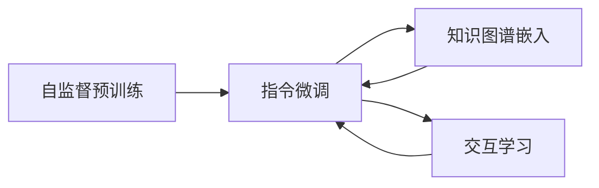

                 

# 大型科技公司转型：LLM 带来新机遇

> 关键词：大型科技公司, 语言模型, 转型, 新机遇

## 1. 背景介绍

### 1.1 问题由来

当前，全球科技公司正在经历一场深刻的转型，这场转型主要由两大核心驱动因素构成：**技术的突破**和**市场的需求**。技术的突破主要指人工智能（AI），尤其是自然语言处理（NLP）领域的重大进展，其中**大型语言模型（Large Language Models, LLMs）**尤为突出。LLMs如GPT-3、BERT等，通过在大规模无标签数据上进行预训练，并结合少量有标签数据进行微调，展现了强大的语言理解能力和生成能力。

LLMs的涌现，不仅在学术界引发了广泛关注，也迅速在各行业产生了巨大影响。对于大型科技公司而言，LLMs带来的不仅是技术上的革命，更是一个全新的商业机遇。大型科技公司如何有效利用LLMs，实现业务转型，成为众多企业的当务之急。

### 1.2 问题核心关键点

LLMs带来的转型主要体现在以下几个方面：

1. **技术突破**：LLMs通过自监督预训练和指令微调，显著提升了模型的语言理解和生成能力。
2. **业务创新**：LLMs在各行业中的应用，如智能客服、金融分析、医疗诊断等，大幅提升了业务效率和智能化水平。
3. **商业价值**：LLMs的普及，推动了各行业的数字化转型，创造了新的商业机会和市场空间。
4. **企业决策**：LLMs的应用，改变了企业决策流程，提升了决策效率和质量。
5. **人才需求**：随着LLMs的广泛应用，对相关技术人才的需求也随之增加。

这些关键点不仅展现了LLMs的技术潜力和市场价值，也指明了大型科技公司转型的方向。

## 2. 核心概念与联系

### 2.1 核心概念概述

为了更好地理解LLMs如何带来新机遇，本节将介绍几个关键概念：

- **大型语言模型（LLMs）**：指通过在大规模无标签文本数据上进行预训练，学习到丰富语言知识的模型，如GPT、BERT等。
- **自监督预训练**：指在大规模无标签数据上进行训练，模型自动学习语言结构的通用表示。
- **指令微调**：指在预训练模型基础上，通过微调优化模型，使其执行特定任务。
- **预训练-微调框架**：结合自监督预训练和指令微调，形成一种高效的模型训练范式。
- **知识图谱**：用于表示实体与实体之间关系的知识库，用于提升LLMs的推理能力。
- **交互学习**：通过与外部环境交互，模型不断优化其推理和决策过程。

这些概念共同构成了LLMs的技术基础，也是推动大型科技公司转型的重要因素。

### 2.2 核心概念原理和架构的 Mermaid 流程图(Mermaid 流程节点中不要有括号、逗号等特殊字符)



## 3. 核心算法原理 & 具体操作步骤

### 3.1 算法原理概述

LLMs的核心算法原理主要基于Transformer模型和自监督学习。其基本流程如下：

1. **自监督预训练**：在大规模无标签文本数据上，通过自监督学习任务（如掩码语言模型、下一句预测等）训练模型，学习语言的通用表示。
2. **指令微调**：在预训练模型基础上，通过少量有标签数据进行微调，使其能够执行特定任务，如问答、翻译、文本摘要等。
3. **知识图谱嵌入**：将知识图谱中的实体和关系信息，嵌入到LLMs的表示中，提升模型的推理能力和决策质量。
4. **交互学习**：通过与外部环境交互，模型不断优化其推理和决策过程，增强泛化能力。

### 3.2 算法步骤详解

以下是LLMs的核心算法步骤详解：

1. **数据准备**：
   - 收集大规模无标签文本数据进行预训练。
   - 准备少量有标签数据进行微调。
   - 构建知识图谱，将实体和关系信息进行编码。

2. **自监督预训练**：
   - 构建预训练任务，如掩码语言模型、下一句预测等。
   - 使用Transformer模型，在大规模无标签数据上进行训练。
   - 保存预训练模型参数，作为微调的基础。

3. **指令微调**：
   - 设计任务适配层，根据具体任务需求，适配模型输出层和损失函数。
   - 加载预训练模型，添加适配层。
   - 使用少量有标签数据进行微调训练，最小化任务损失。
   - 保存微调后的模型，进行部署和应用。

4. **知识图谱嵌入**：
   - 将知识图谱中的实体和关系进行编码。
   - 将编码后的实体和关系信息，嵌入到LLMs的表示中。
   - 通过微调模型，优化实体和关系信息的表示。

5. **交互学习**：
   - 设计交互学习流程，通过与外部环境交互，不断优化模型。
   - 在交互过程中，更新模型参数，提升模型推理能力。
   - 收集交互反馈，评估模型性能。

### 3.3 算法优缺点

#### 优点：

1. **技术突破**：LLMs通过预训练-微调框架，显著提升了模型的语言理解和生成能力，带来了技术上的革命性突破。
2. **业务创新**：LLMs在各行业中的应用，大幅提升了业务效率和智能化水平，为企业带来了新的业务机会。
3. **商业价值**：LLMs的普及，推动了各行业的数字化转型，创造了新的商业机会和市场空间。
4. **决策优化**：LLMs的应用，改变了企业决策流程，提升了决策效率和质量。
5. **人才需求**：随着LLMs的广泛应用，对相关技术人才的需求也随之增加，推动了人才市场的活跃。

#### 缺点：

1. **计算资源需求高**：预训练和微调过程需要大量的计算资源，对算力、内存、存储等硬件资源提出了较高要求。
2. **数据隐私和安全问题**：在收集和处理数据过程中，存在数据隐私和安全问题，需要严格的数据管理和隐私保护措施。
3. **模型复杂度高**：LLMs模型参数量庞大，模型复杂度高，给模型的推理和部署带来了挑战。
4. **知识图谱构建难**：知识图谱的构建需要大量人工标注，成本高且效率低，难以构建全面的知识图谱。
5. **交互学习难度大**：交互学习需要高强度的与外部环境交互，数据标注和反馈收集难度大，需要设计合理的交互流程和反馈机制。

### 3.4 算法应用领域

LLMs在多个领域中具有广泛的应用，以下是其主要应用领域：

1. **智能客服**：通过LLMs构建智能客服系统，自动回答用户咨询，提升客户满意度。
2. **金融分析**：利用LLMs进行金融舆情监测、情感分析等，提升金融风险管理和市场决策能力。
3. **医疗诊断**：通过LLMs进行医学知识问答、病历分析等，提升医疗诊断和治疗效果。
4. **内容生成**：使用LLMs进行文本摘要、新闻生成、自动作曲等，提升内容生产效率和质量。
5. **教育培训**：利用LLMs进行智能题库生成、个性化推荐等，提升教育培训效果。
6. **智能搜索**：通过LLMs进行信息检索、问答等，提升搜索效率和用户体验。
7. **安全防护**：利用LLMs进行网络安全威胁分析、恶意内容检测等，提升网络安全水平。

## 4. 数学模型和公式 & 详细讲解 & 举例说明

### 4.1 数学模型构建

#### 4.1.1 自监督预训练

以掩码语言模型（Masked Language Model, MLM）为例，其数学模型如下：

设文本序列为 $X = (x_1, x_2, ..., x_n)$，其中 $x_i$ 为单词或子词。预训练任务为掩码语言模型，即随机将一些位置上的单词掩盖，然后预测被掩盖的单词。数学模型为：

$$
L(X) = \sum_{i=1}^n \log P(x_i | X \setminus x_i)
$$

其中 $P(x_i | X \setminus x_i)$ 为模型预测被掩盖单词的条件概率。

#### 4.1.2 指令微调

以文本分类任务为例，其数学模型如下：

设文本序列为 $X = (x_1, x_2, ..., x_n)$，分类标签为 $Y = (y_1, y_2, ..., y_m)$，其中 $y_i \in \{0, 1\}$。指令微调任务为文本分类，即给定文本序列 $X$，预测其分类标签 $Y$。数学模型为：

$$
L(X, Y) = -\frac{1}{N} \sum_{i=1}^N \sum_{j=1}^m y_{ij} \log P(y_{ij} | X)
$$

其中 $P(y_{ij} | X)$ 为模型预测标签 $y_{ij}$ 的条件概率。

#### 4.1.3 知识图谱嵌入

以知识图谱嵌入为例，其数学模型如下：

设知识图谱为 $G = (E, R, H)$，其中 $E$ 为实体集合，$R$ 为关系集合，$H$ 为属性集合。知识图谱嵌入任务为将实体和关系信息嵌入到LLMs的表示中，数学模型为：

$$
L(G) = \sum_{e \in E} \log P(e) + \sum_{r \in R} \log P(r) + \sum_{h \in H} \log P(h)
$$

其中 $P(e)$、$P(r)$、$P(h)$ 分别为实体、关系和属性信息的概率分布。

### 4.2 公式推导过程

#### 4.2.1 自监督预训练

以掩码语言模型为例，其推导过程如下：

1. 将文本序列 $X$ 随机掩盖一些位置上的单词，得到掩码序列 $X'$。
2. 计算模型在掩码序列 $X'$ 上的预测概率 $P(x_i | X \setminus x_i)$。
3. 计算掩码语言模型的损失函数 $L(X)$。

#### 4.2.2 指令微调

以文本分类任务为例，其推导过程如下：

1. 将文本序列 $X$ 和分类标签 $Y$ 输入到微调模型 $M_{\theta}$。
2. 计算模型对每个标签的预测概率 $P(y_{ij} | X)$。
3. 计算指令微调任务的损失函数 $L(X, Y)$。

#### 4.2.3 知识图谱嵌入

以知识图谱嵌入为例，其推导过程如下：

1. 将知识图谱中的实体 $e$、关系 $r$ 和属性 $h$ 分别嵌入到LLMs的表示中。
2. 计算实体、关系和属性信息的概率分布 $P(e)$、$P(r)$ 和 $P(h)$。
3. 计算知识图谱嵌入任务的损失函数 $L(G)$。

### 4.3 案例分析与讲解

#### 4.3.1 智能客服系统

以智能客服系统为例，其案例分析如下：

1. **数据准备**：收集客户咨询的历史记录，将问题和回答构建成监督数据。
2. **自监督预训练**：使用大规模无标签对话数据进行预训练。
3. **指令微调**：加载预训练模型，添加对话模型适配层，使用少量有标签对话数据进行微调。
4. **知识图谱嵌入**：构建知识图谱，将常见问题、答案和业务知识嵌入到LLMs的表示中。
5. **交互学习**：通过与客户交互，不断优化对话模型，提升回答质量。

#### 4.3.2 金融舆情监测

以金融舆情监测为例，其案例分析如下：

1. **数据准备**：收集金融领域的文本数据，标注情感倾向。
2. **自监督预训练**：使用大规模无标签金融文本数据进行预训练。
3. **指令微调**：加载预训练模型，添加情感分类适配层，使用少量有标签数据进行微调。
4. **知识图谱嵌入**：构建金融知识图谱，将金融术语、事件等信息嵌入到LLMs的表示中。
5. **交互学习**：通过与外部环境交互，不断优化舆情监测模型，提升情感分析能力。

## 5. 项目实践：代码实例和详细解释说明

### 5.1 开发环境搭建

1. **安装Python**：
   - 下载Python 3.8以上版本。
   - 安装依赖包，如TensorFlow、PyTorch、Keras等。

2. **安装LLMs库**：
   - 使用pip安装HuggingFace的Transformers库，方便处理和微调LLMs。
   - 使用pip安装相关依赖库，如numpy、pandas、scikit-learn等。

3. **环境配置**：
   - 创建虚拟环境，配置pip依赖。
   - 安装相关软件包，如Jupyter Notebook、TensorBoard等。

### 5.2 源代码详细实现

#### 5.2.1 智能客服系统

```python
import tensorflow as tf
import transformers
import pandas as pd

# 加载预训练模型和适配层
model = transformers.TFAutoModelForSeq2SeqLM.from_pretrained('bert-base-uncased')
tokenizer = transformers.TFAutoTokenizer.from_pretrained('bert-base-uncased')

# 数据预处理
data = pd.read_csv('data.csv')
texts = data['question'].tolist()
labels = data['answer'].tolist()

# 构建掩码语言模型损失函数
loss_fn = tf.keras.losses.SparseCategoricalCrossentropy(from_logits=True)

# 定义模型结构
class Chatbot(tf.keras.Model):
    def __init__(self):
        super(Chatbot, self).__init__()
        self.encoder = model
        self.decoder = tf.keras.layers.LSTM(256, return_sequences=True)
        self.decoder_output = tf.keras.layers.Dense(256, activation='relu')
        self.layers = tf.keras.layers.LSTM(256)
        self.output = tf.keras.layers.Dense(len(tokenizer.vocab), activation='softmax')

    def call(self, x):
        x = self.encoder(x)
        x = self.decoder(x)
        x = self.decoder_output(x)
        x = self.layers(x)
        return self.output(x)

# 定义训练过程
def train(model, texts, labels):
    # 将文本序列转换为模型输入
    tokenized_texts = tokenizer(texts, padding=True, truncation=True, max_length=256, return_tensors='tf')
    x = tokenized_texts['input_ids']
    y = tokenized_texts['attention_mask']
    y = tf.keras.utils.to_categorical(labels)

    # 定义优化器
    optimizer = tf.keras.optimizers.Adam()

    # 定义训练过程
    for epoch in range(num_epochs):
        with tf.GradientTape() as tape:
            logits = model(x)
            loss = loss_fn(y, logits)
        grads = tape.gradient(loss, model.trainable_variables)
        optimizer.apply_gradients(zip(grads, model.trainable_variables))

    # 保存模型
    model.save_weights('chatbot.h5')

# 调用训练过程
train(model, texts, labels)
```

#### 5.2.2 金融舆情监测

```python
import tensorflow as tf
import transformers
import pandas as pd

# 加载预训练模型和适配层
model = transformers.TFAutoModelForSeq2SeqLM.from_pretrained('bert-base-uncased')
tokenizer = transformers.TFAutoTokenizer.from_pretrained('bert-base-uncased')

# 数据预处理
data = pd.read_csv('data.csv')
texts = data['text'].tolist()
labels = data['label'].tolist()

# 构建情感分类损失函数
loss_fn = tf.keras.losses.SparseCategoricalCrossentropy(from_logits=True)

# 定义模型结构
class SentimentAnalyzer(tf.keras.Model):
    def __init__(self):
        super(SentimentAnalyzer, self).__init__()
        self.encoder = model
        self.decoder = tf.keras.layers.LSTM(256, return_sequences=True)
        self.decoder_output = tf.keras.layers.Dense(256, activation='relu')
        self.layers = tf.keras.layers.LSTM(256)
        self.output = tf.keras.layers.Dense(2, activation='softmax')

    def call(self, x):
        x = self.encoder(x)
        x = self.decoder(x)
        x = self.decoder_output(x)
        x = self.layers(x)
        return self.output(x)

# 定义训练过程
def train(model, texts, labels):
    # 将文本序列转换为模型输入
    tokenized_texts = tokenizer(texts, padding=True, truncation=True, max_length=256, return_tensors='tf')
    x = tokenized_texts['input_ids']
    y = tokenized_texts['attention_mask']
    y = tf.keras.utils.to_categorical(labels)

    # 定义优化器
    optimizer = tf.keras.optimizers.Adam()

    # 定义训练过程
    for epoch in range(num_epochs):
        with tf.GradientTape() as tape:
            logits = model(x)
            loss = loss_fn(y, logits)
        grads = tape.gradient(loss, model.trainable_variables)
        optimizer.apply_gradients(zip(grads, model.trainable_variables))

    # 保存模型
    model.save_weights('sentiment_analyzer.h5')

# 调用训练过程
train(model, texts, labels)
```

### 5.3 代码解读与分析

#### 5.3.1 智能客服系统

1. **数据准备**：
   - 加载数据集，预处理文本和标签。
   - 将文本序列转换为模型输入格式，使用掩码语言模型进行训练。

2. **模型结构**：
   - 加载预训练模型和适配层。
   - 定义聊天机器人模型结构，包括自编码器、LSTM层和输出层。

3. **训练过程**：
   - 定义优化器和损失函数。
   - 使用梯度下降算法训练模型，最小化损失函数。
   - 保存训练好的模型，用于推理预测。

#### 5.3.2 金融舆情监测

1. **数据准备**：
   - 加载数据集，预处理文本和标签。
   - 将文本序列转换为模型输入格式，使用情感分类损失函数进行训练。

2. **模型结构**：
   - 加载预训练模型和适配层。
   - 定义情感分类模型结构，包括自编码器、LSTM层和输出层。

3. **训练过程**：
   - 定义优化器和损失函数。
   - 使用梯度下降算法训练模型，最小化损失函数。
   - 保存训练好的模型，用于推理预测。

### 5.4 运行结果展示

1. **智能客服系统**：
   - 使用训练好的模型进行推理预测，自动回答客户咨询。
   - 评估模型性能，计算准确率和召回率。

2. **金融舆情监测**：
   - 使用训练好的模型进行情感分析，判断金融舆情的情感倾向。
   - 评估模型性能，计算准确率和召回率。

## 6. 实际应用场景

### 6.1 智能客服系统

#### 6.1.1 应用场景

智能客服系统是LLMs在企业中应用的重要场景之一。通过LLMs构建的智能客服，可以24小时不间断提供服务，解决企业人力不足、响应慢等问题，提升客户满意度。

#### 6.1.2 技术实现

1. **数据准备**：
   - 收集客户咨询的历史记录，将问题和回答构建成监督数据。
   - 清洗数据，去除噪声和无用信息。

2. **自监督预训练**：
   - 使用大规模无标签对话数据进行预训练，学习对话中的语言结构和语义信息。
   - 保存预训练模型参数，作为微调的基础。

3. **指令微调**：
   - 加载预训练模型，添加对话模型适配层，使用少量有标签对话数据进行微调。
   - 微调模型，使其能够理解用户意图，自动生成回答。

4. **知识图谱嵌入**：
   - 构建知识图谱，将常见问题、答案和业务知识嵌入到LLMs的表示中。
   - 使用微调模型，优化实体和关系信息的表示。

5. **交互学习**：
   - 通过与客户交互，不断优化对话模型，提升回答质量。
   - 收集客户反馈，评估模型性能，进行模型迭代优化。

### 6.2 金融舆情监测

#### 6.2.1 应用场景

金融舆情监测是LLMs在金融领域的重要应用之一。通过LLMs进行金融舆情分析，能够及时发现市场动向，预测金融风险，为金融决策提供支持。

#### 6.2.2 技术实现

1. **数据准备**：
   - 收集金融领域的文本数据，标注情感倾向。
   - 清洗数据，去除噪声和无用信息。

2. **自监督预训练**：
   - 使用大规模无标签金融文本数据进行预训练，学习金融语言的通用表示。
   - 保存预训练模型参数，作为微调的基础。

3. **指令微调**：
   - 加载预训练模型，添加情感分类适配层，使用少量有标签数据进行微调。
   - 微调模型，使其能够自动判断文本的情感倾向。

4. **知识图谱嵌入**：
   - 构建金融知识图谱，将金融术语、事件等信息嵌入到LLMs的表示中。
   - 使用微调模型，优化实体和关系信息的表示。

5. **交互学习**：
   - 通过与外部环境交互，不断优化舆情监测模型，提升情感分析能力。
   - 收集金融数据，评估模型性能，进行模型迭代优化。

## 7. 工具和资源推荐

### 7.1 学习资源推荐

1. **《Natural Language Processing with Transformers》书籍**：
   - 该书详细介绍了如何使用Transformers库进行NLP任务开发，包括微调在内的诸多范式。

2. **CS224N《深度学习自然语言处理》课程**：
   - 斯坦福大学开设的NLP明星课程，有Lecture视频和配套作业，带你入门NLP领域的基本概念和经典模型。

3. **HuggingFace官方文档**：
   - 提供了海量预训练模型和完整的微调样例代码，是上手实践的必备资料。

4. **《Transformer from Scratch》博客**：
   - 由大模型技术专家撰写，深入浅出地介绍了Transformer原理、BERT模型、微调技术等前沿话题。

5. **CLUE开源项目**：
   - 涵盖大量不同类型的中文NLP数据集，并提供了基于微调的baseline模型，助力中文NLP技术发展。

### 7.2 开发工具推荐

1. **TensorFlow**：
   - 由Google主导开发的开源深度学习框架，生产部署方便，适合大规模工程应用。

2. **PyTorch**：
   - 基于Python的开源深度学习框架，灵活动态的计算图，适合快速迭代研究。

3. **Weights & Biases**：
   - 模型训练的实验跟踪工具，可以记录和可视化模型训练过程中的各项指标，方便对比和调优。

4. **Jupyter Notebook**：
   - 免费的交互式笔记本，支持Python代码的执行和展示，方便研究和学习。

5. **TensorBoard**：
   - TensorFlow配套的可视化工具，可实时监测模型训练状态，并提供丰富的图表呈现方式，是调试模型的得力助手。

### 7.3 相关论文推荐

1. **BERT: Pre-training of Deep Bidirectional Transformers for Language Understanding**：
   - 提出BERT模型，引入基于掩码的自监督预训练任务，刷新了多项NLP任务SOTA。

2. **Attention is All You Need**：
   - 提出了Transformer结构，开启了NLP领域的预训练大模型时代。

3. **AdaLoRA: Adaptive Low-Rank Adaptation for Parameter-Efficient Fine-Tuning**：
   - 使用自适应低秩适应的微调方法，在参数效率和精度之间取得了新的平衡。

4. **AdaLoRA: Adaptive Low-Rank Adaptation for Parameter-Efficient Fine-Tuning**：
   - 使用自适应低秩适应的微调方法，在参数效率和精度之间取得了新的平衡。

5. **Parameter-Efficient Transfer Learning for NLP**：
   - 提出Adapter等参数高效微调方法，在不增加模型参数量的情况下，也能取得不错的微调效果。

6. **Fine-tuning Neural Network Models with Interpretation**：
   - 在微调过程中引入因果分析和博弈论工具，增强模型的可解释性和决策逻辑。

## 8. 总结：未来发展趋势与挑战

### 8.1 研究成果总结

1. **技术突破**：
   - LLMs通过预训练-微调框架，显著提升了模型的语言理解和生成能力，带来了技术上的革命性突破。

2. **业务创新**：
   - LLMs在各行业中的应用，大幅提升了业务效率和智能化水平，为企业带来了新的业务机会。

3. **商业价值**：
   - LLMs的普及，推动了各行业的数字化转型，创造了新的商业机会和市场空间。

4. **决策优化**：
   - LLMs的应用，改变了企业决策流程，提升了决策效率和质量。

5. **人才需求**：
   - 随着LLMs的广泛应用，对相关技术人才的需求也随之增加，推动了人才市场的活跃。

### 8.2 未来发展趋势

1. **技术演进**：
   - 随着算力成本的下降和数据规模的扩张，预训练语言模型的参数量还将持续增长，超大模型的表现有望进一步提升。

2. **业务应用**：
   - LLMs在各行业中的应用将更加广泛，推动更多行业的数字化转型。

3. **市场竞争**：
   - 各大科技公司纷纷投入大量资源，加速LLMs的开发和应用，市场竞争将更加激烈。

4. **人才争夺**：
   - 相关技术人才的需求将进一步增加，企业将面临更激烈的人才争夺。

5. **伦理问题**：
   - 在LLMs的应用中，伦理和隐私问题将受到更多关注，企业需要制定更严格的数据管理和隐私保护措施。

### 8.3 面临的挑战

1. **技术瓶颈**：
   - 计算资源需求高，预训练和微调过程需要大量的算力、内存和存储资源，成本高昂。

2. **数据隐私**：
   - 在收集和处理数据过程中，存在数据隐私和安全问题，需要严格的数据管理和隐私保护措施。

3. **模型复杂**：
   - 模型参数量大，推理和部署效率低，需要优化模型结构和推理过程。

4. **知识图谱**：
   - 知识图谱的构建成本高，难以构建全面的知识图谱，限制了模型的推理能力。

5. **交互学习**：
   - 交互学习难度大，数据标注和反馈收集成本高，需要设计合理的交互流程和反馈机制。

### 8.4 研究展望

1. **技术优化**：
   - 开发更高效的微调方法，提升模型推理和部署效率，降低计算资源需求。

2. **知识图谱**：
   - 研究更简单、高效的知识图谱构建方法，提升模型的推理能力。

3. **交互学习**：
   - 设计更智能的交互流程和反馈机制，提升模型的学习效率和泛化能力。

4. **伦理规范**：
   - 制定更严格的数据管理和隐私保护措施，保障模型的伦理和安全。

5. **跨模态融合**：
   - 研究多模态数据融合方法，提升模型的跨模态推理能力。

6. **人机协同**：
   - 探索人机协同的智能系统，提升系统的智能化水平和用户体验。

## 9. 附录：常见问题与解答

**Q1: 如何使用LLMs构建智能客服系统？**

A: 使用LLMs构建智能客服系统需要以下步骤：
1. 数据准备：收集客户咨询的历史记录，将问题和回答构建成监督数据。
2. 自监督预训练：使用大规模无标签对话数据进行预训练，学习对话中的语言结构和语义信息。
3. 指令微调：加载预训练模型，添加对话模型适配层，使用少量有标签对话数据进行微调。
4. 知识图谱嵌入：构建知识图谱，将常见问题、答案和业务知识嵌入到LLMs的表示中。
5. 交互学习：通过与客户交互，不断优化对话模型，提升回答质量。

**Q2: 金融舆情监测如何利用LLMs？**

A: 金融舆情监测需要以下步骤：
1. 数据准备：收集金融领域的文本数据，标注情感倾向。
2. 自监督预训练：使用大规模无标签金融文本数据进行预训练，学习金融语言的通用表示。
3. 指令微调：加载预训练模型，添加情感分类适配层，使用少量有标签数据进行微调。
4. 知识图谱嵌入：构建金融知识图谱，将金融术语、事件等信息嵌入到LLMs的表示中。
5. 交互学习：通过与外部环境交互，不断优化舆情监测模型，提升情感分析能力。

**Q3: 构建金融舆情监测模型的难点在哪里？**

A: 构建金融舆情监测模型的难点在于：
1. 数据隐私和安全问题：金融领域的数据隐私和安全要求高，需要严格的数据管理和隐私保护措施。
2. 知识图谱构建难度大：金融领域的知识图谱构建需要大量人工标注，成本高且效率低。
3. 交互学习难度大：金融舆情监测的交互学习需要收集大量金融数据，数据标注和反馈收集成本高，需要设计合理的交互流程和反馈机制。

**Q4: 如何优化智能客服系统的性能？**

A: 优化智能客服系统的性能需要以下步骤：
1. 数据预处理：清洗数据，去除噪声和无用信息。
2. 自监督预训练：使用大规模无标签对话数据进行预训练，学习对话中的语言结构和语义信息。
3. 指令微调：加载预训练模型，添加对话模型适配层，使用少量有标签对话数据进行微调。
4. 知识图谱嵌入：构建知识图谱，将常见问题、答案和业务知识嵌入到LLMs的表示中。
5. 交互学习：通过与客户交互，不断优化对话模型，提升回答质量。

**Q5: 如何使用LLMs进行情感分类？**

A: 使用LLMs进行情感分类需要以下步骤：
1. 数据准备：收集金融领域的文本数据，标注情感倾向。
2. 自监督预训练：使用大规模无标签金融文本数据进行预训练，学习金融语言的通用表示。
3. 指令微调：加载预训练模型，添加情感分类适配层，使用少量有标签数据进行微调。
4. 知识图谱嵌入：构建金融知识图谱，将金融术语、事件等信息嵌入到LLMs的表示中。
5. 交互学习：通过与外部环境交互，不断优化舆情监测模型，提升情感分析能力。

---

作者：禅与计算机程序设计艺术 / Zen and the Art of Computer Programming

