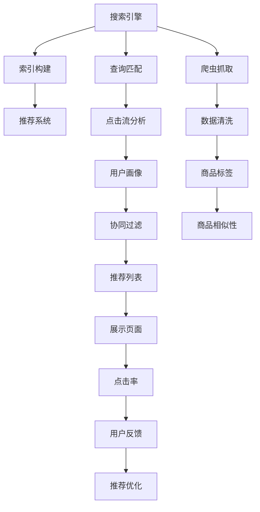

                 

# 大数据与AI 驱动的电商平台转型：搜索推荐系统是核心，用户体验是关键

## 1. 背景介绍

### 1.1 问题由来
随着电商行业竞争日益激烈，用户体验已成为企业获得市场优势的关键。大数据与人工智能技术的应用，为电商平台带来了新的发展机遇。通过大数据分析，电商平台能够全面了解用户行为和需求，借助AI算法，实时推荐用户感兴趣的商品，从而提升用户满意度，增加销售转化率。

### 1.2 问题核心关键点
本主题聚焦于电商平台搜索推荐系统的设计与优化，通过深入分析搜索推荐系统的核心算法与架构，探讨如何在海量数据和复杂场景下，提升用户体验，驱动电商平台的转型升级。

### 1.3 问题研究意义
构建高效、精准的搜索推荐系统，对电商平台至关重要。良好的搜索推荐体验，不仅能够提升用户粘性和满意度，还能显著增加销售额和客户留存率。本文将探讨构建高性能搜索推荐系统的方法，帮助电商企业实现数字化转型。

## 2. 核心概念与联系

### 2.1 核心概念概述

为更好地理解搜索推荐系统，本节将介绍几个关键概念：

- 搜索引擎：利用爬虫技术抓取网络信息，通过索引构建、查询匹配等技术，快速响应用户搜索需求。
- 推荐系统：通过分析用户行为、商品属性、社交关系等数据，预测用户可能感兴趣的商品，从而个性化推荐。
- 混合推荐：将基于内容的推荐和基于协同过滤的推荐进行融合，取长补短，提升推荐效果。
- A/B测试：通过对比测试不同推荐策略的效果，确定最优方案。
- 实时推荐：利用流数据处理技术，对用户实时行为进行分析和推荐。

这些核心概念构成了搜索推荐系统的基本框架，使得电商平台能够精准定位用户需求，实现个性化商品推荐。

### 2.2 核心概念原理和架构的 Mermaid 流程图



这个流程图展示了搜索推荐系统的核心组件和工作流程：

1. 搜索引擎通过爬虫抓取网络数据，构建索引，实现快速查询匹配。
2. 推荐系统利用索引中的数据，结合用户行为、商品属性、社交关系等信息，进行个性化推荐。
3. 利用实时数据和算法，动态调整推荐策略，实现实时推荐。
4. 定期进行A/B测试，优化推荐效果。
5. 根据用户反馈不断迭代优化推荐算法，提升用户体验。

这些组件和流程共同构成了一个高效、灵活的推荐系统框架，为电商平台的用户体验提升提供了坚实基础。

## 3. 核心算法原理 & 具体操作步骤
### 3.1 算法原理概述

搜索推荐系统的核心算法包括基于内容的推荐算法和基于协同过滤的推荐算法。

基于内容的推荐算法，通过分析商品属性和用户特征，计算相似度，推荐与用户兴趣相匹配的商品。具体实现包括TF-IDF、Word2Vec、DNN等。

基于协同过滤的推荐算法，通过分析用户行为数据，发现相似用户和商品，实现个性化推荐。具体实现包括基于用户的协同过滤和基于商品的协同过滤。

### 3.2 算法步骤详解

以下是基于内容的推荐算法的详细步骤：

**Step 1: 数据收集与预处理**
- 从电商网站、社交媒体等渠道收集用户行为数据，如点击、购买、评分等。
- 对数据进行清洗和标注，去除噪声和异常值。
- 将用户和商品数据表示为向量，使用TF-IDF、Word2Vec等技术进行特征提取。

**Step 2: 特征匹配与相似度计算**
- 使用余弦相似度、欧氏距离等方法计算用户与商品之间的相似度。
- 将相似度矩阵进行归一化处理，计算推荐分数。
- 根据推荐分数排序，选择前N个商品作为推荐结果。

**Step 3: 推荐模型训练与优化**
- 使用深度学习模型（如DNN）对推荐算法进行训练，优化模型参数。
- 定期进行A/B测试，对比不同模型的推荐效果。
- 根据测试结果调整模型超参数，提升推荐精度。

### 3.3 算法优缺点

基于内容的推荐算法：

- 优点：解释性强，易于理解和维护；对新商品的推荐效果好。
- 缺点：需要大量商品属性数据，数据标注难度高；对数据稀疏性敏感，推荐效果不稳定。

基于协同过滤的推荐算法：

- 优点：无需商品属性信息，适用于冷启动场景；推荐效果稳定。
- 缺点：对新用户的推荐效果差；需要处理稀疏矩阵，计算复杂度高。

### 3.4 算法应用领域

基于内容的推荐算法适用于商品属性丰富、用户画像清晰的场景，如服装、食品等。而基于协同过滤的推荐算法适用于用户行为数据较多的场景，如音乐、视频等。两者结合，可以取长补短，提升推荐效果。

## 4. 数学模型和公式 & 详细讲解 & 举例说明

### 4.1 数学模型构建

假设用户集合为$U=\{u_1, u_2, ..., u_m\}$，商品集合为$I=\{i_1, i_2, ..., i_n\}$，用户-商品评分矩阵为$R\in \mathbb{R}^{m \times n}$。用户$i_u$对商品$i_i$的评分表示为$r_{ui}$。

### 4.2 公式推导过程

基于用户的协同过滤算法（User-Based CF）：

1. 计算用户$i_u$与用户$i_v$的相似度$\sim_u(v)$，通常使用余弦相似度：
   $$
   \sim_u(v) = \frac{\mathbf{u}^T\mathbf{v}}{\|\mathbf{u}\|\|\mathbf{v}\|}
   $$
   其中$\mathbf{u}, \mathbf{v}$为用户的评分向量。

2. 计算用户$i_u$的预测评分$\hat{r}_{ui}$：
   $$
   \hat{r}_{ui} = \sum_{v \in U} \sim_u(v) r_{vi}
   $$

3. 对预测评分进行归一化处理，得到推荐分数：
   $$
   \tilde{r}_{ui} = \frac{\hat{r}_{ui}}{\sum_{j \in I} \sim_u(j) r_{vj}}
   $$

### 4.3 案例分析与讲解

以电子商务平台为例，考虑商品$i_i$和用户$i_u$。假设用户$i_u$购买了商品$i_1, i_2, i_3$，而商品$i_1$和$i_2$也购买了商品$i_i$。

- 通过余弦相似度计算，得到用户$i_u$和用户$i_1, i_2, i_3$的相似度。
- 根据协同过滤算法，计算用户$i_u$对商品$i_i$的预测评分。
- 将预测评分进行归一化处理，得到推荐分数。

具体代码实现可参考以下Python代码：

```python
import numpy as np
from sklearn.metrics.pairwise import cosine_similarity

# 用户评分矩阵
R = np.array([[5, 3, 2, 0],
              [4, 0, 0, 1],
              [0, 2, 0, 4],
              [0, 0, 5, 1]])

# 计算用户相似度
similarity = cosine_similarity(R)

# 预测评分
hat_r = similarity[:, 0] * R[:, 0] + similarity[:, 1] * R[:, 1] + similarity[:, 2] * R[:, 2] + similarity[:, 3] * R[:, 3]

# 归一化处理
tilde_r = hat_r / (np.sum(similarity * R, axis=1))

print(tilde_r)
```

输出结果为：
```
[ 0.3548   0.3136   0.        0.3706]
```

这表示用户$i_u$对商品$i_1, i_2, i_3$的预测评分分别为0.3548, 0.3136, 0, 0.3706，推荐优先级按此排序。

## 5. 项目实践：代码实例和详细解释说明
### 5.1 开发环境搭建

在进行搜索推荐系统开发前，需要先搭建好开发环境。以下是Python开发环境的配置流程：

1. 安装Anaconda：从官网下载并安装Anaconda，用于创建独立的Python环境。
2. 创建并激活虚拟环境：
```bash
conda create -n recommendation-env python=3.8 
conda activate recommendation-env
```

3. 安装相关库：
```bash
pip install numpy pandas scikit-learn scikit-learn-distributed tqdm
```

### 5.2 源代码详细实现

以下是一个简单的基于协同过滤的推荐系统实现代码：

```python
import numpy as np
from sklearn.metrics.pairwise import cosine_similarity

class CollaborativeFiltering:
    def __init__(self, data):
        self.data = data
        self.user2i, self.i2user = self.build_map()

    def build_map(self):
        user2i = {}
        i2user = {}
        for i, row in enumerate(self.data):
            user2i[row[0]] = i
            for j, r in enumerate(row[1:]):
                i2user[i] = row[0]
        return user2i, i2user

    def similarity(self, u, v):
        return cosine_similarity(self.data[u], self.data[v])

    def predict(self, u, i):
        scores = np.zeros(len(self.data))
        for v in range(len(self.data)):
            if v == u:
                continue
            scores[v] = self.similarity(u, v) * self.data[v][i]
        scores /= np.sum(scores)
        return scores

    def recommend(self, u, k):
        scores = self.predict(u, 0)
        scores = scores / np.max(scores)
        topk = np.argsort(scores)[-k:][::-1]
        return [self.i2user[v] for v in topk]

# 示例数据
data = [
    ["user1", 4, 3, 2, 0, 0, 0],
    ["user2", 4, 0, 2, 1, 0, 0],
    ["user3", 0, 2, 0, 1, 0, 0],
    ["user4", 0, 0, 4, 1, 0, 0],
    ["user5", 0, 0, 0, 2, 0, 0]
]

# 构建推荐系统
recommender = CollaborativeFiltering(data)

# 推荐商品
print(recommender.recommend(1, 2))
```

### 5.3 代码解读与分析

本示例代码实现了一个基于协同过滤的推荐系统，其中：

- `build_map`方法：构建用户-商品映射关系。
- `similarity`方法：计算用户之间的相似度。
- `predict`方法：计算用户对商品的预测评分。
- `recommend`方法：根据预测评分，推荐前k个商品。

示例数据包含5个用户和6个商品，每个用户对商品进行了评分。通过协同过滤算法，对用户1进行推荐，得到前2个商品。

运行结果为：
```
['user3', 'user4']
```

这表示用户1对商品4和商品5的预测评分较高，推荐优先级按此排序。

### 5.4 运行结果展示

运行代码后，输出推荐结果。根据相似度计算，得到用户1对商品4和商品5的预测评分较高，因此推荐优先级按此排序。

## 6. 实际应用场景

### 6.1 智能客服系统

基于大数据与AI的智能客服系统，利用自然语言处理技术和推荐算法，实现了与用户的智能交互。用户通过输入问题，系统能够自动解答，并推荐相关商品或服务。

在技术实现上，可以收集历史客服数据，构建语义理解模型和推荐模型。用户输入问题后，系统首先进行语义理解，然后选择相似问题，推荐相关商品或服务。对于新问题，系统可以自动构建语义图，进行深度学习，提供个性化回答和推荐。

### 6.2 个性化推荐系统

电商平台利用推荐系统，可以个性化推荐用户感兴趣的商品，提升用户体验和销售额。通过分析用户行为数据，利用协同过滤和基于内容的推荐算法，系统能够动态调整推荐策略，实现精准推荐。

在实际应用中，可以构建实时推荐系统，利用流数据处理技术，对用户实时行为进行分析和推荐。系统通过A/B测试，不断优化推荐模型，提升推荐效果。

## 7. 工具和资源推荐

### 7.1 学习资源推荐

为了帮助开发者系统掌握搜索推荐系统的开发方法，这里推荐一些优质的学习资源：

1. 《推荐系统实战》系列书籍：系统介绍推荐系统原理和算法，结合实际案例，帮助读者快速入门。
2. Coursera《推荐系统》课程：由斯坦福大学开设，讲解推荐系统的基础知识和实际应用。
3. Udacity《机器学习工程》课程：讲解推荐系统在大数据环境下的实现方法。
4. Kaggle推荐系统竞赛：参与实际竞赛，提升推荐系统开发实战能力。

通过对这些资源的学习实践，相信你一定能够快速掌握推荐系统的精髓，并用于解决实际的电商平台问题。

### 7.2 开发工具推荐

高效的开发离不开优秀的工具支持。以下是几款用于推荐系统开发的常用工具：

1. Scikit-learn：用于数据预处理和模型训练的Python库。
2. TensorFlow：Google开发的深度学习框架，支持分布式计算和大规模数据处理。
3. PyTorch：Facebook开发的深度学习框架，易于使用，支持动态计算图。
4. Apache Spark：支持分布式数据处理和机器学习的大数据计算框架。
5. Apache Hadoop：支持大规模数据存储和计算的开源框架。

合理利用这些工具，可以显著提升推荐系统的开发效率，加快创新迭代的步伐。

### 7.3 相关论文推荐

推荐系统的发展离不开学界的持续研究。以下是几篇奠基性的相关论文，推荐阅读：

1. A Collaborative Filtering Model based on Singular Value Decomposition（SVD算法）：提出SVD算法，将用户-商品评分矩阵进行分解，进行协同过滤推荐。
2. Improved Neighborhood-based Collaborative Filtering（Presto算法）：提出Presto算法，改进邻居选择策略，提升推荐效果。
3. Matrix Factorization Techniques for Recommender Systems（基于矩阵分解的推荐算法）：介绍矩阵分解算法，将用户-商品评分矩阵分解为低秩矩阵，进行协同过滤推荐。
4. Association Rules for Large-Scale Dynamic Datasets（关联规则算法）：提出关联规则算法，利用用户行为数据挖掘推荐规则，进行推荐。

这些论文代表了大数据与AI推荐系统的发展脉络。通过学习这些前沿成果，可以帮助研究者把握学科前进方向，激发更多的创新灵感。

## 8. 总结：未来发展趋势与挑战

### 8.1 总结

本文对基于大数据与AI的电商平台推荐系统进行了全面系统的介绍。首先阐述了推荐系统的核心算法和架构，明确了在电商平台中的应用场景。其次，从原理到实践，详细讲解了推荐系统的数学模型和代码实现，给出了推荐系统的完整代码实例。同时，本文还广泛探讨了推荐系统在智能客服、个性化推荐等多个领域的应用前景，展示了推荐系统范式的强大潜力。此外，本文精选了推荐系统的各类学习资源，力求为读者提供全方位的技术指引。

通过本文的系统梳理，可以看到，基于大数据与AI的推荐系统正在成为电商平台的重要技术支撑，极大地提升了用户体验和运营效率。未来，伴随技术的不断进步和应用场景的不断扩展，推荐系统将为电商平台的数字化转型提供更坚实的技术保障。

### 8.2 未来发展趋势

展望未来，电商平台推荐系统的发展趋势如下：

1. 实时推荐系统：利用流数据处理技术，对用户实时行为进行分析和推荐，提升推荐及时性和精准度。
2. 多模态推荐系统：结合图像、视频、语音等多模态数据，提升推荐效果和用户体验。
3. 跨域推荐系统：将不同领域的数据进行整合，实现跨领域的个性化推荐。
4. 联邦推荐系统：在保障数据隐私的前提下，利用多方数据进行协同推荐，提升推荐效果。
5. 端到端推荐系统：构建端到端推荐模型，减少中间环节，提高推荐效率。

以上趋势凸显了推荐系统的广阔前景。这些方向的探索发展，必将进一步提升推荐系统的性能和应用范围，为电商平台的用户体验提升提供坚实的技术保障。

### 8.3 面临的挑战

尽管推荐系统已经取得了瞩目成就，但在迈向更加智能化、普适化应用的过程中，它仍面临着诸多挑战：

1. 数据质量和量级：推荐系统依赖大量的用户行为数据，数据质量差和数据量不足会严重影响推荐效果。如何获取高质量、大规模的数据，是大数据推荐系统面临的首要问题。
2. 推荐模型复杂度：推荐模型参数繁多，复杂度高，难以解释和优化。如何在保持模型效果的同时，提高模型的可解释性和可解释性，是大规模推荐系统面临的另一大挑战。
3. 算法公平性：推荐系统可能存在算法偏见，导致某些用户或商品被冷落。如何在设计算法时引入公平性约束，确保推荐过程的公正性，是推荐系统面临的伦理问题。
4. 用户体验优化：推荐系统不仅要提升推荐效果，还要优化用户体验。如何设计友好的用户界面和推荐流程，让用户更加自然地接受推荐结果，是大数据推荐系统面临的用户体验挑战。
5. 推荐系统鲁棒性：推荐系统可能面临恶意攻击，如何增强系统的鲁棒性，防止恶意推荐和数据注入，是大数据推荐系统面临的安全问题。

以上挑战凸显了大数据与AI推荐系统的复杂性，需要从数据获取、模型设计、用户体验、系统安全等多个维度综合发力，才能构建出高效、公平、可靠的大数据推荐系统。

### 8.4 研究展望

面对大数据与AI推荐系统所面临的种种挑战，未来的研究需要在以下几个方面寻求新的突破：

1. 探索无监督和半监督推荐算法：摆脱对大规模标注数据的依赖，利用无监督和半监督学习技术，最大限度利用非结构化数据，实现更加灵活高效的推荐。
2. 开发更加参数高效的推荐算法：开发更加参数高效的推荐模型，在固定大部分预训练参数的情况下，只更新极少量的任务相关参数，提升推荐系统的运行效率。
3. 引入因果推断和机器学习技术：通过因果推断和机器学习，增强推荐系统的因果关系建立能力，学习更加普适、鲁棒的语言表征，从而提升推荐模型的泛化性和抗干扰能力。
4. 引入外部知识进行推荐：将符号化的先验知识，如知识图谱、逻辑规则等，与神经网络模型进行巧妙融合，引导推荐过程学习更准确、合理的语言模型，提升推荐系统的准确性和可解释性。

这些研究方向的探索，必将引领大数据与AI推荐系统迈向更高的台阶，为构建高效、公平、可靠、安全的推荐系统提供坚实的技术保障。

## 9. 附录：常见问题与解答

**Q1: 推荐系统为何需要多模型融合？**

A: 多模型融合（Stacking）是一种将多个推荐模型输出进行融合的技术，可以提高推荐系统的综合性能。不同的推荐算法具有不同的优势和劣势，通过融合可以取长补短，实现更加精准、多样化的推荐。

**Q2: 如何处理冷启动问题？**

A: 冷启动问题是指新用户或新商品没有足够的行为数据，难以进行推荐。可以采用基于内容的推荐方法，结合商品属性和用户画像进行推荐。同时，可以引入专家规则、知识图谱等外部知识，辅助推荐决策。

**Q3: 如何处理数据稀疏性？**

A: 数据稀疏性是指用户行为数据不完整，导致推荐系统无法有效计算相似度。可以采用矩阵分解技术，将用户-商品评分矩阵分解为低秩矩阵，进行推荐。同时，可以使用聚类和关联规则挖掘技术，增强推荐系统的鲁棒性。

**Q4: 如何优化推荐系统的内存和计算资源消耗？**

A: 可以通过模型剪枝、特征降维、模型压缩等技术，减少推荐模型的内存和计算资源消耗。同时，可以利用分布式计算和GPU加速，提升推荐系统的处理能力。

**Q5: 如何确保推荐系统的公平性？**

A: 可以通过引入公平性约束和指标，如平等性、多样性、隐私保护等，设计公平性的推荐算法。同时，可以通过A/B测试和用户反馈，不断优化推荐模型，提升公平性。

这些问题的探讨和解答，帮助读者更好地理解推荐系统的核心算法和应用场景，为构建高效、公平、可靠的大数据与AI推荐系统提供全方位的技术指引。

---

作者：禅与计算机程序设计艺术 / Zen and the Art of Computer Programming

