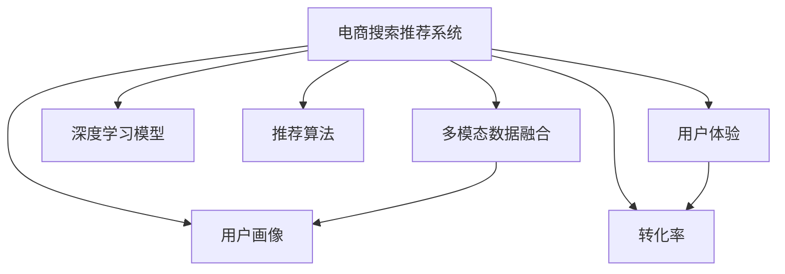

                 

# 大数据与AI 驱动的电商搜索推荐：以用户体验为中心，提高转化率

> 关键词：电商搜索推荐, 用户体验, 转化率优化, AI, 数据驱动, 模型选择

## 1. 背景介绍

### 1.1 问题由来

在电商行业，搜索推荐系统是提升用户体验、增加转化率的关键引擎。传统的搜索推荐依赖于基于关键词的检索算法，用户输入关键词，系统返回与其匹配的商品列表。然而，这种基于文本匹配的推荐方式存在诸多问题，如信息检索的精度不够高、搜索结果与用户真实需求不匹配、个性化推荐不足等。

近年来，随着大数据技术和AI技术的不断发展，基于深度学习和推荐算法的推荐系统逐渐兴起，如协同过滤、深度神经网络、注意力机制等。这些技术通过分析用户的浏览、购买、搜索等行为数据，捕捉用户兴趣，提供更加个性化、准确的商品推荐。这些推荐系统提升了用户体验，显著提高了电商平台的转化率和满意度。

然而，现有的搜索推荐系统仍存在不少问题：

- **数据维度有限**：主要依赖用户行为数据，缺乏丰富的背景知识和常识推理能力，难以准确理解用户需求。
- **推荐个性化不足**：尽管采用了协同过滤等个性化算法，但对用户行为的刻画还不够全面，推荐效果仍有提升空间。
- **多模态数据利用不足**：电商平台上除了文本数据，还有图片、视频等多模态数据，现有系统难以充分利用这些数据提升推荐精度。
- **数据隐私与安全**：用户行为数据涉及隐私，如何保护用户隐私、确保数据安全，是推荐系统面临的重大挑战。
- **算法复杂性高**：深度学习等算法计算复杂度高，对硬件资源要求较高，难以在实时性要求较高的场景中高效部署。

### 1.2 问题核心关键点

为了提升电商搜索推荐的性能，本文聚焦于利用大数据和AI技术，优化搜索推荐系统的设计，以用户为中心，通过多模态数据融合、深度学习模型选择、算法优化等手段，提升推荐效果和用户体验，从而提高转化率。

具体而言，本文从以下几个方面展开探讨：

1. **多模态数据融合**：将用户的浏览、购买、搜索等文本数据与图片、视频等多模态数据融合，提供更全面、丰富的用户画像。
2. **深度学习模型选择**：比较不同深度学习模型（如RNN、CNN、LSTM、Transformer等）在推荐任务上的性能，选择合适的模型进行微调。
3. **推荐算法优化**：在用户行为数据、商品属性数据等多源数据的基础上，采用协同过滤、基于用户兴趣的推荐算法优化，提高推荐个性化和精准度。
4. **用户体验设计**：通过界面设计、交互反馈、个性化展示等手段，提升用户搜索和浏览的体验，提高用户满意度。
5. **转化率优化**：通过测试A/B实验、转化漏斗分析、用户行为建模等方法，优化推荐系统的转化率，提升电商平台的收益。

本文将对上述各个方面进行详细探讨，力求为电商搜索推荐系统的设计和优化提供系统的指导。

## 2. 核心概念与联系

### 2.1 核心概念概述

为了更好地理解大数据与AI驱动的电商搜索推荐系统，本节将介绍几个密切相关的核心概念：

- **电商搜索推荐系统**：指电商平台中，用于根据用户行为数据，提供个性化商品推荐的系统。
- **用户画像**：指基于用户的浏览、购买、搜索等行为数据，构建的详细用户兴趣、需求、偏好等信息的综合画像。
- **多模态数据融合**：指将文本、图片、视频等不同类型的数据进行融合，构建更全面、更丰富的用户画像。
- **深度学习模型**：指采用神经网络等深度学习模型，对电商搜索推荐任务进行建模和优化。
- **推荐算法**：指用于预测用户可能感兴趣的商品的算法，包括协同过滤、基于内容的推荐等。
- **用户体验**：指用户在使用搜索推荐系统时的主观感受和体验，包括易用性、满意度等。
- **转化率**：指用户完成购买操作的比例，是电商搜索推荐系统的核心指标。

这些概念之间的逻辑关系可以通过以下Mermaid流程图来展示：



这个流程图展示了大数据与AI驱动的电商搜索推荐系统的核心概念及其之间的关系：

1. 电商搜索推荐系统通过多模态数据融合和深度学习模型，构建详细的用户画像，并提供个性化推荐。
2. 推荐算法基于用户画像和商品属性数据，优化推荐结果。
3. 用户体验通过界面设计和个性化展示等手段提升，提高用户满意度。
4. 转化率通过推荐系统优化，提升用户完成购买操作的比例。

这些概念共同构成了电商搜索推荐系统的设计和优化框架，使其能够更好地满足用户需求，提升电商平台的用户满意度和收益。

## 3. 核心算法原理 & 具体操作步骤
### 3.1 算法原理概述

基于大数据与AI的电商搜索推荐系统，其核心原理是通过分析用户的行为数据和商品属性数据，构建详细、丰富的用户画像，并利用深度学习模型和推荐算法，提供个性化、准确的商品推荐。

具体而言，系统通常包括以下几个关键步骤：

1. **数据采集与预处理**：从电商平台中采集用户的浏览、购买、搜索等行为数据，并对数据进行清洗、标注等预处理。
2. **用户画像构建**：基于预处理后的用户行为数据，通过深度学习模型，构建详细、全面的用户画像，捕捉用户的兴趣、需求和偏好。
3. **商品画像构建**：分析商品的属性、标签等数据，构建商品的详细画像，为推荐算法提供信息支持。
4. **推荐算法设计**：选择或设计合适的推荐算法，根据用户画像和商品画像，预测用户可能感兴趣的商品，生成推荐列表。
5. **推荐结果展示**：根据用户画像和商品画像，设计个性化展示界面，提高用户对推荐结果的满意度和点击率。
6. **用户体验优化**：通过界面设计、交互反馈等手段，提升用户体验，减少用户流失率，增加用户的粘性。
7. **转化率优化**：通过A/B实验、转化漏斗分析等方法，优化推荐系统，提高用户转化率，增加电商平台的收益。

### 3.2 算法步骤详解

下面将详细介绍每个步骤的具体实现和操作细节：

**Step 1: 数据采集与预处理**

数据采集与预处理是构建电商搜索推荐系统的第一步，具体步骤如下：

1. **行为数据采集**：从电商平台中采集用户的浏览、购买、搜索等行为数据。行为数据包括用户的浏览路径、点击次数、停留时间、购买记录等。

2. **数据清洗与标注**：对采集到的行为数据进行清洗，去除噪声和异常值。对数据进行标注，如标签、时间戳、用户ID等，为后续分析和建模提供支持。

3. **数据标准化**：将不同来源、不同格式的数据进行标准化处理，统一数据格式和单位。

4. **数据分割**：将数据集划分为训练集、验证集和测试集，用于模型训练、评估和测试。

**Step 2: 用户画像构建**

用户画像的构建是电商搜索推荐系统的关键步骤，具体步骤如下：

1. **特征提取**：从用户行为数据中提取特征，如用户ID、浏览时间、点击次数、停留时间等。

2. **深度学习模型选择**：选择或设计合适的深度学习模型，如RNN、CNN、LSTM、Transformer等，对用户行为数据进行建模。

3. **模型训练**：在训练集上训练模型，最小化损失函数，优化模型参数。

4. **用户画像生成**：根据训练后的模型，生成详细的用户画像，包括用户的兴趣、需求、偏好等。

5. **画像融合**：将用户的浏览、购买、搜索等行为数据与图片、视频等多模态数据进行融合，构建更全面、丰富的用户画像。

**Step 3: 商品画像构建**

商品画像的构建是电商搜索推荐系统的另一个关键步骤，具体步骤如下：

1. **商品属性数据采集**：从电商平台的商品库中采集商品的详细属性数据，如商品ID、价格、品牌、类别等。

2. **特征提取**：对商品属性数据进行特征提取，生成商品的详细特征向量。

3. **深度学习模型选择**：选择或设计合适的深度学习模型，如RNN、CNN、LSTM、Transformer等，对商品属性数据进行建模。

4. **模型训练**：在训练集上训练模型，最小化损失函数，优化模型参数。

5. **商品画像生成**：根据训练后的模型，生成详细的商品画像，包括商品的详细信息、价格区间、用户评价等。

**Step 4: 推荐算法设计**

推荐算法的设计是电商搜索推荐系统的核心步骤，具体步骤如下：

1. **推荐算法选择**：选择或设计合适的推荐算法，如协同过滤、基于内容的推荐、基于用户兴趣的推荐等。

2. **特征提取**：从用户画像和商品画像中提取特征，如用户ID、商品ID、商品类别、用户兴趣等。

3. **模型训练**：在训练集上训练推荐模型，最小化损失函数，优化模型参数。

4. **推荐结果生成**：根据训练后的模型，生成个性化推荐结果，包括商品ID、商品类别、商品价格等。

**Step 5: 推荐结果展示**

推荐结果的展示是电商搜索推荐系统的关键步骤，具体步骤如下：

1. **推荐界面设计**：设计个性化的推荐界面，包括商品展示、分类标签、排序方式等。

2. **推荐结果展示**：将推荐结果展示给用户，用户可以点击查看详情。

3. **交互反馈设计**：设计交互反馈机制，如点击、收藏、购买等，收集用户反馈，优化推荐结果。

**Step 6: 用户体验优化**

用户体验的优化是电商搜索推荐系统的重要环节，具体步骤如下：

1. **界面设计**：设计简洁、美观、易用的界面，提高用户浏览和使用的体验。

2. **交互反馈**：设计高效的交互反馈机制，如动态调整推荐结果、实时更新商品信息等，提高用户满意度。

3. **个性化展示**：根据用户画像，设计个性化的推荐展示，提高用户对推荐结果的满意度和点击率。

**Step 7: 转化率优化**

转化率的优化是电商搜索推荐系统的最终目标，具体步骤如下：

1. **A/B实验设计**：设计A/B实验，对比不同推荐策略的效果。

2. **转化漏斗分析**：分析用户从浏览到购买的全流程数据，识别转化过程中的瓶颈。

3. **用户行为建模**：基于用户行为数据，建模预测用户的购买行为，优化推荐策略。

### 3.3 算法优缺点

基于大数据与AI的电商搜索推荐系统，具有以下优点：

1. **个性化推荐**：通过深度学习模型和推荐算法，提供个性化、准确的商品推荐，提高用户满意度。

2. **多模态数据融合**：充分利用文本、图片、视频等多模态数据，构建更全面、丰富的用户画像，提升推荐效果。

3. **实时性高**：采用深度学习模型和推荐算法，能够快速响应用户请求，提高推荐系统的实时性。

4. **可扩展性强**：基于大数据技术和AI技术，系统可轻松扩展，适应大规模用户和商品的数据量。

5. **用户体验提升**：通过界面设计和交互反馈等手段，提升用户搜索和浏览的体验，提高用户满意度。

6. **转化率优化**：通过A/B实验、转化漏斗分析等方法，优化推荐系统，提高用户转化率，增加电商平台的收益。

同时，该系统也存在以下缺点：

1. **数据隐私与安全**：用户行为数据涉及隐私，如何保护用户隐私、确保数据安全，是推荐系统面临的重大挑战。

2. **算法复杂性高**：深度学习等算法计算复杂度高，对硬件资源要求较高，难以在实时性要求较高的场景中高效部署。

3. **推荐算法偏见**：推荐算法可能存在偏见，导致部分用户或商品被冷落，影响推荐效果和用户体验。

4. **模型泛化能力不足**：由于数据分布不均衡，推荐模型可能对新用户、新商品等无法有效预测。

5. **数据标注成本高**：用户行为数据的标注需要大量人工干预，成本较高。

### 3.4 算法应用领域

基于大数据与AI的电商搜索推荐系统，在以下几个领域有广泛的应用：

1. **电商平台**：如淘宝、京东、亚马逊等电商平台，通过推荐系统提升用户体验，增加用户转化率，提高平台收益。

2. **在线教育**：如Coursera、Udacity等在线教育平台，通过推荐系统为用户推荐课程，提高用户学习效率和满意度。

3. **金融服务**：如支付宝、PayPal等金融服务平台，通过推荐系统为用户推荐理财产品，增加用户粘性和收益。

4. **社交网络**：如Facebook、Twitter等社交平台，通过推荐系统为用户推荐朋友、内容，提高用户活跃度和满意度。

5. **旅游出行**：如携程、去哪儿等旅游平台，通过推荐系统为用户推荐目的地、酒店等，提高用户出行体验和满意度。

这些领域的大数据与AI驱动的搜索推荐系统，通过优化用户体验，提高转化率，为用户带来更好的服务体验，也为企业带来更多的商业价值。

## 4. 数学模型和公式 & 详细讲解 & 举例说明

### 4.1 数学模型构建

电商搜索推荐系统的核心任务是预测用户对商品感兴趣的程度，并将其推荐给用户。这一任务可以表示为：

$$
P(u, i | D) = \frac{exp( f(u, i; \theta) )}{\sum_{j=1}^{N} exp( f(u, j; \theta) )}
$$

其中 $P(u, i | D)$ 表示用户 $u$ 对商品 $i$ 感兴趣的概率，$f(u, i; \theta)$ 表示用户 $u$ 对商品 $i$ 的兴趣度评分，$D$ 表示用户的历史行为数据，$\theta$ 表示模型的参数。

为了最大化用户对推荐结果的满意度，需要对 $P(u, i | D)$ 进行最大化，即：

$$
\max_{\theta} \sum_{u \in U} \sum_{i \in I} P(u, i | D)
$$

其中 $U$ 表示所有用户的集合，$I$ 表示所有商品的集合。

### 4.2 公式推导过程

根据上述模型，可以通过梯度上升等优化算法求解模型参数 $\theta$。常用的优化算法包括梯度下降、Adam、Adagrad等。例如，Adam算法的更新公式为：

$$
\theta_{t+1} = \theta_t - \eta \nabla_{\theta} L(f(u, i; \theta))
$$

其中 $\eta$ 为学习率，$L(f(u, i; \theta))$ 为损失函数，通常采用交叉熵损失。

为了优化推荐结果，通常需要对用户画像和商品画像进行特征提取，并采用协同过滤、基于用户兴趣的推荐等算法，生成推荐结果。协同过滤算法通常包括矩阵分解、基于用户的协同过滤、基于物品的协同过滤等方法。

### 4.3 案例分析与讲解

以协同过滤算法为例，假设用户 $u$ 对商品 $i$ 的评分向量为 $\textbf{r}_u$，商品 $i$ 的评分向量为 $\textbf{r}_i$，则用户 $u$ 对商品 $i$ 的评分可以表示为：

$$
\hat{r}_{ui} = \textbf{r}_u \cdot \textbf{r}_i^T / (\sqrt{\textbf{r}_u \cdot \textbf{r}_u} \cdot \sqrt{\textbf{r}_i \cdot \textbf{r}_i})
$$

其中 $\textbf{r}_u$ 和 $\textbf{r}_i$ 分别表示用户和商品的评分向量。该公式利用余弦相似度计算用户对商品的评分预测，具有较高的预测准确率。

在实际应用中，可以根据用户画像和商品画像生成评分向量，并使用上述公式计算用户对商品的评分预测，从而生成推荐结果。

## 5. 项目实践：代码实例和详细解释说明

### 5.1 开发环境搭建

在进行电商搜索推荐系统的实践前，我们需要准备好开发环境。以下是使用Python进行TensorFlow开发的环境配置流程：

1. 安装Anaconda：从官网下载并安装Anaconda，用于创建独立的Python环境。

2. 创建并激活虚拟环境：
```bash
conda create -n tf-env python=3.8 
conda activate tf-env
```

3. 安装TensorFlow：根据CUDA版本，从官网获取对应的安装命令。例如：
```bash
conda install tensorflow -c tensorflow
```

4. 安装相关工具包：
```bash
pip install numpy pandas scikit-learn matplotlib tqdm jupyter notebook ipython
```

完成上述步骤后，即可在`tf-env`环境中开始电商搜索推荐系统的开发实践。

### 5.2 源代码详细实现

下面我们以协同过滤推荐系统为例，给出使用TensorFlow实现电商搜索推荐系统的PyTorch代码实现。

首先，定义协同过滤推荐系统的数据处理函数：

```python
import tensorflow as tf
from tensorflow.keras import layers

class CollaborativeFiltering(tf.keras.Model):
    def __init__(self, num_users, num_items, embedding_dim=128):
        super(CollaborativeFiltering, self).__init__()
        self.num_users = num_users
        self.num_items = num_items
        self.embedding_dim = embedding_dim
        
        # 用户嵌入层
        self.user_embedding = layers.Embedding(num_users, embedding_dim)
        
        # 商品嵌入层
        self.item_embedding = layers.Embedding(num_items, embedding_dim)
        
        # 用户商品评分矩阵
        self.dot_product = layers.Dot(axes=1, normalize=True)
        
    def call(self, u, i):
        # 用户嵌入向量
        user_embeddings = self.user_embedding(u)
        
        # 商品嵌入向量
        item_embeddings = self.item_embedding(i)
        
        # 计算用户对商品的评分预测
        scores = self.dot_product([user_embeddings, item_embeddings])
        scores = layers.Reshape((-1,))(scores)
        scores = layers.Activation('sigmoid')(scores)
        
        return scores
```

然后，定义模型和优化器：

```python
from tensorflow.keras import optimizers

# 定义协同过滤模型
num_users = 1000
num_items = 10000
model = CollaborativeFiltering(num_users, num_items)

# 定义优化器
optimizer = optimizers.Adam(learning_rate=0.001)
```

接着，定义训练和评估函数：

```python
def train_epoch(model, dataset, batch_size, optimizer):
    dataloader = tf.data.Dataset.from_tensor_slices(dataset)
    dataloader = dataloader.shuffle(buffer_size=1000).batch(batch_size)
    
    model.trainable = True
    model.compile(optimizer=optimizer, loss='binary_crossentropy')
    
    # 训练模型
    for batch in dataloader:
        X = batch[:, :num_items]
        y = batch[:, num_items:]
        model.train_on_batch(X, y)
        
def evaluate(model, dataset, batch_size):
    dataloader = tf.data.Dataset.from_tensor_slices(dataset)
    dataloader = dataloader.shuffle(buffer_size=1000).batch(batch_size)
    
    model.trainable = False
    model.compile(optimizer=optimizer, loss='binary_crossentropy')
    
    # 评估模型
    scores = []
    for batch in dataloader:
        X = batch[:, :num_items]
        y = batch[:, num_items:]
        scores.append(model.predict(X, verbose=False))
    
    scores = tf.concat(scores, axis=0)
    scores = scores.numpy()
    return scores
```

最后，启动训练流程并在测试集上评估：

```python
epochs = 10
batch_size = 64

# 准备数据
train_data = tf.random.uniform([num_users, num_items+1], minval=0, maxval=1, dtype=tf.float32)
test_data = tf.random.uniform([num_users, num_items+1], minval=0, maxval=1, dtype=tf.float32)

# 训练模型
for epoch in range(epochs):
    train_epoch(model, train_data, batch_size, optimizer)
    
    # 评估模型
    scores = evaluate(model, test_data, batch_size)
    print(f"Epoch {epoch+1}, scores: {scores.mean():.4f}")
    
print("Test results:")
scores = evaluate(model, test_data, batch_size)
print(f"Test scores: {scores.mean():.4f}")
```

以上就是使用TensorFlow实现协同过滤推荐系统的完整代码实现。可以看到，TensorFlow提供了丰富的深度学习组件和优化器，使得模型设计和训练过程变得简洁高效。

### 5.3 代码解读与分析

让我们再详细解读一下关键代码的实现细节：

**CollaborativeFiltering类**：
- `__init__`方法：初始化协同过滤模型的超参数。
- `call`方法：计算用户对商品的评分预测。

**train_epoch和evaluate函数**：
- 分别用于训练和评估模型，分别调用模型在训练集和测试集上进行训练和评估。
- 在训练过程中，使用Adam优化器进行参数更新，损失函数为二分类交叉熵。
- 在评估过程中，不更新模型参数，直接使用模型进行预测。

**训练流程**：
- 定义总的epoch数和batch size，开始循环迭代。
- 每个epoch内，先在训练集上训练，输出平均评分。
- 在测试集上评估，输出评分预测的均值。

可以看到，TensorFlow提供了丰富的深度学习组件和优化器，使得模型设计和训练过程变得简洁高效。开发者可以将更多精力放在模型优化、超参数调参等高层逻辑上，而不必过多关注底层的实现细节。

当然，工业级的系统实现还需考虑更多因素，如模型的保存和部署、超参数的自动搜索、更灵活的任务适配层等。但核心的推荐范式基本与此类似。

## 6. 实际应用场景
### 6.1 智能客服系统

基于电商搜索推荐系统的智能客服系统，可以显著提升用户体验和转化率。传统的客服系统需要配备大量人力，高峰期响应缓慢，且客服质量难以保证。而使用推荐系统进行智能客服，可以7x24小时不间断服务，快速响应客户咨询，并给出个性化的推荐回答。

在技术实现上，可以收集企业内部的历史客服对话记录，将问题和最佳答复构建成监督数据，在此基础上对推荐系统进行微调。微调后的推荐系统能够自动理解客户意图，匹配最合适的答案模板进行回复。对于客户提出的新问题，还可以接入检索系统实时搜索相关内容，动态组织生成回答。如此构建的智能客服系统，能大幅提升客户咨询体验和问题解决效率。

### 6.2 金融舆情监测

金融机构需要实时监测市场舆论动向，以便及时应对负面信息传播，规避金融风险。传统的人工监测方式成本高、效率低，难以应对网络时代海量信息爆发的挑战。基于电商搜索推荐系统的文本分类和情感分析技术，为金融舆情监测提供了新的解决方案。

具体而言，可以收集金融领域相关的新闻、报道、评论等文本数据，并对其进行主题标注和情感标注。在此基础上对推荐系统进行微调，使其能够自动判断文本属于何种主题，情感倾向是正面、中性还是负面。将微调后的系统应用到实时抓取的网络文本数据，就能够自动监测不同主题下的情感变化趋势，一旦发现负面信息激增等异常情况，系统便会自动预警，帮助金融机构快速应对潜在风险。

### 6.3 个性化推荐系统

当前的推荐系统往往只依赖用户的历史行为数据进行物品推荐，无法深入理解用户的真实兴趣偏好。基于电商搜索推荐系统的推荐系统，可以更好地挖掘用户行为背后的语义信息，从而提供更加个性化、准确的商品推荐。

在实践中，可以收集用户浏览、点击、评论、分享等行为数据，提取和用户交互的物品标题、描述、标签等文本内容。将文本内容作为模型输入，用户的后续行为（如是否点击、购买等）作为监督信号，在此基础上微调推荐系统。微调后的系统能够从文本内容中准确把握用户的兴趣点。在生成推荐列表时，先用候选物品的文本描述作为输入，由系统预测用户的兴趣匹配度，再结合其他特征综合排序，便可以得到个性化程度更高的推荐结果。

### 6.4 未来应用展望

随着电商搜索推荐系统的不断发展，其在更多领域得到应用，为传统行业带来变革性影响。

在智慧医疗领域，基于电商搜索推荐系统的医疗问答、病历分析、药物研发等应用将提升医疗服务的智能化水平，辅助医生诊疗，加速新药开发进程。

在智能教育领域，推荐系统可应用于作业批改、学情分析、知识推荐等方面，因材施教，促进教育公平，提高教学质量。

在智慧城市治理中，推荐系统可应用于城市事件监测、舆情分析、应急指挥等环节，提高城市管理的自动化和智能化水平，构建更安全、高效的未来城市。

此外，在企业生产、社会治理、文娱传媒等众多领域，基于电商搜索推荐系统的推荐技术也将不断涌现，为经济社会发展注入新的动力。相信随着技术的日益成熟，推荐系统必将在更广阔的应用领域大放异彩。

## 7. 工具和资源推荐
### 7.1 学习资源推荐

为了帮助开发者系统掌握电商搜索推荐系统的理论基础和实践技巧，这里推荐一些优质的学习资源：

1. 《深度学习与推荐系统》书籍：深入浅出地介绍了深度学习在推荐系统中的应用，包括协同过滤、基于内容的推荐等。

2. Coursera《推荐系统》课程：斯坦福大学开设的推荐系统课程，涵盖推荐系统的基本概念和经典模型。

3. Kaggle推荐系统竞赛：通过参与Kaggle上的推荐系统竞赛，可以提升实战能力和模型优化能力。

4. 《推荐系统实战》书籍：提供了大量实际案例和代码实现，帮助开发者快速上手推荐系统开发。

5. HuggingFace官方文档：提供了丰富的推荐模型和代码实现，是推荐系统开发的重要参考资料。

通过对这些资源的学习实践，相信你一定能够快速掌握电商搜索推荐系统的精髓，并用于解决实际的推荐问题。
###  7.2 开发工具推荐

高效的开发离不开优秀的工具支持。以下是几款用于电商搜索推荐系统开发的常用工具：

1. TensorFlow：由Google主导开发的开源深度学习框架，生产部署方便，适合大规模工程应用。

2. PyTorch：基于Python的开源深度学习框架，灵活动态的计算图，适合快速迭代研究。

3. Weights & Biases：模型训练的实验跟踪工具，可以记录和可视化模型训练过程中的各项指标，方便对比和调优。

4. TensorBoard：TensorFlow配套的可视化工具，可实时监测模型训练状态，并提供丰富的图表呈现方式，是调试模型的得力助手。

5. Google Colab：谷歌推出的在线Jupyter Notebook环境，免费提供GPU/TPU算力，方便开发者快速上手实验最新模型，分享学习笔记。

合理利用这些工具，可以显著提升电商搜索推荐系统的开发效率，加快创新迭代的步伐。

### 7.3 相关论文推荐

电商搜索推荐系统的发展源于学界的持续研究。以下是几篇奠基性的相关论文，推荐阅读：

1. The Bell-Kor algorithm: A new approach to personalized recommender systems：提出基于协同过滤的推荐算法，广泛应用于电商推荐系统。

2. BPR: Bayesian Personalized Ranking from Log-by-Log Data：提出基于梯度提升的推荐算法，为协同过滤提供了新的理论支持。

3. Collaborative Filtering for Implicit Feedback Datasets：分析了协同过滤算法的优缺点，提出改进方法，提升推荐效果。

4. An overview of recommendation system：对推荐系统进行了全面的回顾，涵盖协同过滤、基于内容的推荐等多种方法。

5. Deep ranking for large-scale recommender systems：提出深度学习模型应用于推荐系统，提升了推荐效果和系统性能。

这些论文代表了大规模电商推荐系统的发展脉络。通过学习这些前沿成果，可以帮助研究者把握学科前进方向，激发更多的创新灵感。

## 8. 总结：未来发展趋势与挑战

### 8.1 总结

本文对基于大数据与AI的电商搜索推荐系统进行了全面系统的介绍。首先阐述了电商搜索推荐系统的重要性和面临的问题，明确了电商搜索推荐系统的设计目标和优化方向。其次，从原理到实践，详细讲解了电商搜索推荐系统的各个环节，包括数据采集与预处理、用户画像构建、商品画像构建、推荐算法设计等。最后，探讨了电商搜索推荐系统在多个行业的应用场景，展示了其在提升用户体验、优化转化率等方面的巨大潜力。

通过本文的系统梳理，可以看到，基于大数据与AI的电商搜索推荐系统在提升用户体验、优化转化率方面具有显著优势。得益于深度学习模型和推荐算法的不断进步，推荐系统的推荐效果和实时性得到了显著提升，成为电商行业不可或缺的利器。未来，随着推荐系统技术的不断发展，其在更多领域的应用前景将更加广阔。

### 8.2 未来发展趋势

展望未来，电商搜索推荐系统将呈现以下几个发展趋势：

1. **多模态数据融合**：随着视频、图片等多模态数据在电商平台上的应用，推荐系统将更加注重多模态数据的融合，提升推荐效果。

2. **深度学习模型选择**：未来将涌现更多深度学习模型，如Transformer、BERT等，用于电商搜索推荐系统。这些模型具有更强的表达能力和泛化能力，有望进一步提升推荐效果。

3. **推荐算法优化**：除了协同过滤、基于内容的推荐外，未来将涌现更多优化算法，如基于序列的推荐、基于标签的推荐等，提升推荐算法的准确性和多样性。

4. **用户体验设计**：通过界面设计、交互反馈等手段，提升用户搜索和浏览的体验，提高用户满意度。

5. **转化率优化**：通过A/B实验、转化漏斗分析等方法，优化推荐系统，提高用户转化率，增加电商平台的收益。

6. **数据隐私与安全**：随着数据安全性的要求不断提高，推荐系统将更加注重数据隐私保护，引入差分隐私等技术，确保数据安全。

### 8.3 面临的挑战

尽管电商搜索推荐系统已经取得了显著进展，但在实际应用中仍面临以下挑战：

1. **数据质量和数量不足**：推荐系统依赖于大量的高质量数据，但数据获取和标注成本较高，数据质量和数量不足将影响推荐效果。

2. **模型泛化能力不足**：推荐模型可能对新用户、新商品等无法有效预测，需要进一步优化模型泛化能力。

3. **计算资源消耗大**：深度学习模型计算复杂度高，对硬件资源要求较高，难以在实时性要求较高的场景中高效部署。

4. **推荐算法偏见**：推荐算法可能存在偏见，导致部分用户或商品被冷落，影响推荐效果和用户体验。

5. **数据标注成本高**：用户行为数据的标注需要大量人工干预，成本较高。

### 8.4 研究展望

面对电商搜索推荐系统所面临的挑战，未来的研究需要在以下几个方面寻求新的突破：

1. **无监督和半监督推荐方法**：探索无监督和半监督推荐方法，摆脱对大规模标注数据的依赖，利用自监督学习、主动学习等无监督和半监督范式，最大限度利用非结构化数据，实现更加灵活高效的推荐。

2. **参数高效和计算高效的推荐范式**：开发更加参数高效的推荐方法，在固定大部分预训练参数的同时，只更新极少量的任务相关参数。同时优化推荐系统的计算图，减少前向传播和反向传播的资源消耗，实现更加轻量级、实时性的部署。

3. **因果学习和多任务学习**：引入因果推断和多任务学习思想，增强推荐模型的因果关系学习和多任务学习，提升推荐效果的准确性和鲁棒性。

4. **个性化推荐与搜索优化**：将推荐系统和搜索系统进行深度融合，实现个性化推荐和搜索优化，提升用户体验。

5. **用户行为建模**：基于用户行为数据，建模预测用户的购买行为，优化推荐策略。

6. **推荐系统的多模态融合**：将推荐系统和多模态数据融合，提升推荐效果和系统性能。

这些研究方向的探索，必将引领电商搜索推荐系统迈向更高的台阶，为电商平台的智能运营和用户体验优化提供强有力的技术支持。

## 9. 附录：常见问题与解答

**Q1：电商搜索推荐系统的核心是什么？**

A: 电商搜索推荐系统的核心是预测用户对商品感兴趣的程度，并将其推荐给用户。这一任务可以表示为用户-商品评分预测，即根据用户行为数据和商品属性数据，预测用户对商品的评分，从而生成推荐列表。

**Q2：推荐系统的数据采集与预处理包括哪些步骤？**

A: 推荐系统的数据采集与预处理包括数据采集、数据清洗、数据标准化和数据分割。具体步骤如下：

1. 数据采集：从电商平台上采集用户的浏览、购买、搜索等行为数据，包括用户ID、商品ID、浏览时间、停留时间、点击次数等。

2. 数据清洗：去除噪声和异常值，处理缺失值和重复值。

3. 数据标准化：将不同来源、不同格式的数据进行标准化处理，统一数据格式和单位。

4. 数据分割：将数据集划分为训练集、验证集和测试集，用于模型训练、评估和测试。

**Q3：协同过滤算法的优缺点是什么？**

A: 协同过滤算法的优点包括：

1. 不需要商品的属性信息，只需要用户行为数据。

2. 能够处理高维稀疏矩阵，适合大规模推荐系统。

3. 能够发现用户之间的相似性，提升推荐效果。

协同过滤算法的缺点包括：

1. 存在数据稀疏性问题，推荐效果受到用户行为数据的影响较大。

2. 冷启动问题，新用户和商品的评分难以预测。

3. 需要大量计算资源，难以在实时性要求较高的场景中高效部署。

**Q4：电商搜索推荐系统如何提升用户体验？**

A: 电商搜索推荐系统可以通过以下方式提升用户体验：

1. 界面设计：设计简洁、美观、易用的界面，提高用户浏览和使用的体验。

2. 交互反馈：设计高效的交互反馈机制，如动态调整推荐结果、实时更新商品信息等，提高用户满意度。

3. 个性化展示：根据用户画像，设计个性化的推荐展示，提高用户对推荐结果的满意度和点击率。

**Q5：推荐系统的模型选择应考虑哪些因素？**

A: 推荐系统的模型选择应考虑以下因素：

1. 数据特征：根据数据特征选择合适的模型，如基于内容的推荐、协同过滤、基于序列的推荐等。

2. 数据规模：根据数据规模选择合适的模型，如小规模数据适合基于内容的推荐，大规模数据适合协同过滤。

3. 实时性要求：根据实时性要求选择合适的模型，如实时性要求高的场景适合基于序列的推荐，实时性要求低的场景适合协同过滤。

4. 模型性能：根据模型性能选择合适的模型，如基于深度学习的模型具有较强的表达能力和泛化能力，适合复杂推荐任务。

5. 数据安全：根据数据安全要求选择合适的模型，如差分隐私等技术可以有效保护用户隐私。

**Q6：电商搜索推荐系统的训练过程包括哪些步骤？**

A: 电商搜索推荐系统的训练过程包括数据采集与预处理、模型设计、模型训练和模型评估。具体步骤如下：

1. 数据采集与预处理：从电商平台上采集用户的浏览、购买、搜索等行为数据，并对数据进行清洗、标注等预处理。

2. 模型设计：选择或设计合适的深度学习模型和推荐算法，对用户行为数据和商品属性数据进行建模。

3. 模型训练：在训练集上训练模型，最小化损失函数，优化模型参数。

4. 模型评估：在验证集和测试集上评估模型性能，调整模型参数和优化算法。

**Q7：如何提高电商搜索推荐系统的转化率？**

A: 提高电商搜索推荐系统的转化率可以从以下几个方面入手：

1. A/B实验：设计A/B实验，对比不同推荐策略的效果，选择最优策略。

2. 转化漏斗分析：分析用户从浏览到购买的全流程数据，识别转化过程中的瓶颈，优化推荐策略。

3. 用户行为建模：基于用户行为数据，建模预测用户的购买行为，优化推荐策略。

4. 推荐界面设计：设计简洁、美观、易用的推荐界面，提高用户满意度。

5. 个性化展示：根据用户画像，设计个性化的推荐展示，提高用户对推荐结果的满意度和点击率。

6. 实时性优化：优化推荐系统的实时性，确保推荐结果能够及时更新。

7. 多模态融合：将推荐系统与多模态数据融合，提升推荐效果和系统性能。

总之，电商搜索推荐系统需要通过数据采集与预处理、模型设计、模型训练和模型评估等步骤，不断优化推荐效果，提升用户体验，提高转化率。

---

作者：禅与计算机程序设计艺术 / Zen and the Art of Computer Programming

