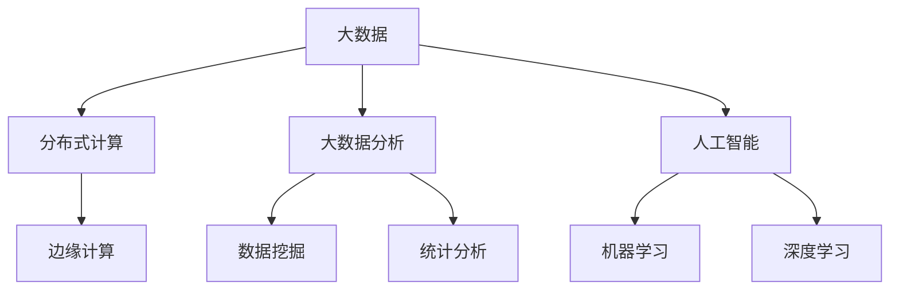

                 

# 大数据时代：人类计算的机遇与挑战

## 1. 背景介绍

随着互联网技术的迅猛发展，数据已逐渐成为新的石油。各行各业都在利用大数据技术进行业务升级，解锁新的价值空间。然而，在享受大数据带来的机遇的同时，我们也要深刻认识到其潜在的挑战，平衡利用和风险，推动人类计算进入新时代。

### 1.1 问题由来

大数据时代的来临，带来了前所未有的数据爆发。从社交媒体到物联网，从金融交易到科学研究，数据无处不在。数据量的大幅增长，使得传统的计算模型和算法面临巨大挑战。如何高效地处理、存储和利用海量数据，成为了亟待解决的问题。

同时，大数据的爆发也带来了诸多挑战。数据隐私和安全问题，数据质量和标签问题，数据处理和分析的效率问题，都是我们需要认真对待的问题。

### 1.2 问题核心关键点

1. **数据量级**：现代大数据的数据量往往是PB级的，如何高效存储、处理和分析这些数据，是当前技术瓶颈。
2. **数据质量**：数据质量直接影响到数据分析结果的准确性和可靠性。如何保证数据的完整性、准确性和一致性，是一个重要挑战。
3. **数据隐私**：在数据采集、存储和传输过程中，如何保护用户隐私，避免数据泄露和滥用，是一个不容忽视的问题。
4. **数据计算效率**：在大数据时代，数据处理需要极大地提升计算效率，减少等待时间，提高数据利用率。
5. **算法和模型**：随着数据规模的增加，传统的算法和模型无法处理大规模数据。如何构建高效、可扩展的算法和模型，是一个重要课题。

## 2. 核心概念与联系

### 2.1 核心概念概述

为了更好地理解大数据时代人类计算的机遇与挑战，本节将介绍几个密切相关的核心概念：

- **大数据(Big Data)**：数据量规模大、数据类型多样、数据速度快。常见的数据来源包括社交媒体、金融交易、物联网、传感器数据等。
- **分布式计算**：利用多台计算机的协同计算能力，处理大规模数据。分布式计算框架包括Hadoop、Spark等。
- **大数据分析**：利用数据挖掘、统计分析等技术，从大数据中提取有用信息。大数据分析工具包括Hive、Presto、Kettle等。
- **人工智能**：利用机器学习、深度学习等技术，从大数据中发现规律，预测未来趋势。常用的大数据AI工具包括TensorFlow、PyTorch等。
- **边缘计算**：将数据处理和分析移到数据源附近，降低延迟和带宽消耗。边缘计算框架包括EdgeX、IoT Edge等。

这些核心概念之间的逻辑关系可以通过以下Mermaid流程图来展示：



这个流程图展示了大数据时代核心概念之间的关系：

1. 大数据通过分布式计算和边缘计算技术进行高效处理和分析。
2. 大数据分析工具如Hive、Presto等，可提取有用信息。
3. 人工智能技术如TensorFlow、PyTorch等，可从大数据中发现规律，进行预测。

这些概念共同构成了大数据时代人类计算的基础框架，为我们的应用开发提供了强大的技术支持。

## 3. 核心算法原理 & 具体操作步骤

### 3.1 算法原理概述

大数据时代的人类计算，本质上是对海量数据的存储、处理和分析过程。核心算法包括：

- **分布式存储**：如Hadoop的HDFS，利用多台计算机的存储能力，分散存储数据。
- **分布式计算**：如MapReduce、Spark，将大规模计算任务分解为多个小任务，并行处理，提高效率。
- **流式计算**：如Apache Storm、Apache Flink，实时处理动态数据流，降低延迟。
- **数据挖掘**：如PCA、K-means、Apriori等，从大数据中提取有价值的模式和规律。
- **深度学习**：如卷积神经网络、循环神经网络、Transformer等，构建复杂模型进行数据预测。

### 3.2 算法步骤详解

#### 3.2.1 数据采集与清洗

1. **数据采集**：从不同来源收集数据，包括结构化数据、非结构化数据、实时数据等。
2. **数据清洗**：去除重复、缺失、错误的数据，进行数据转换和规范化。

#### 3.2.2 数据存储与管理

1. **分布式存储**：利用Hadoop、Spark等框架，将数据分散存储在多台计算机上，提高可靠性。
2. **数据管理**：利用数据仓库、数据湖等工具，进行数据治理和元数据管理。

#### 3.2.3 数据处理与分析

1. **数据处理**：利用MapReduce、Spark等框架，进行大规模数据的并行处理。
2. **数据分析**：利用Hive、Presto等工具，进行数据分析和统计计算。

#### 3.2.4 数据可视化与报告

1. **数据可视化**：利用Tableau、PowerBI等工具，将数据可视化展示，帮助理解数据。
2. **报告生成**：生成数据报告，提供决策支持。

### 3.3 算法优缺点

#### 3.3.1 优点

1. **高效性**：通过分布式计算和流式计算，可以高效处理海量数据，提高数据利用率。
2. **可扩展性**：分布式计算框架可以动态扩展计算节点，支持大规模数据处理。
3. **实时性**：流式计算框架可以实时处理动态数据，满足实时分析的需求。
4. **多样性**：大数据分析工具支持多种数据类型和分析方法，可以灵活应对不同场景。

#### 3.3.2 缺点

1. **复杂性**：分布式计算和流式计算框架需要较高的技术门槛，实施和维护难度大。
2. **数据质量**：数据清洗和预处理需要耗费大量时间和资源，保证数据质量是一个挑战。
3. **隐私风险**：大规模数据存储和处理过程中，数据隐私和安全问题难以保障。
4. **计算成本**：分布式计算和流式计算需要大量的计算资源和带宽，成本较高。

### 3.4 算法应用领域

大数据时代的人类计算，在诸多领域都得到了广泛应用：

- **金融行业**：利用大数据技术进行风险管理、客户行为分析、欺诈检测等。
- **零售行业**：利用大数据技术进行消费者行为分析、库存管理、个性化推荐等。
- **医疗行业**：利用大数据技术进行疾病预测、医疗影像分析、基因组学研究等。
- **交通行业**：利用大数据技术进行交通流量预测、智慧城市管理、车辆联网等。
- **社交媒体**：利用大数据技术进行情感分析、舆情监测、用户行为分析等。

## 4. 数学模型和公式 & 详细讲解 & 举例说明

### 4.1 数学模型构建

为了更好地理解大数据时代人类计算的核心算法，我们将以Hadoop分布式计算为例，构建数学模型。

Hadoop的分布式计算模型可以抽象为MapReduce模型。其核心思想是将大规模数据任务分解为多个小任务，在多台计算机上并行处理，最后将结果汇总。

假设有N台计算节点，数据分为M块。MapReduce模型的处理流程如下：

1. **Map阶段**：每台计算节点对本地数据块进行局部计算，生成中间结果。
2. **Shuffle阶段**：将所有计算节点生成的中间结果，按照key进行合并和排序，将相同的key值数据分发到同一个节点。
3. **Reduce阶段**：每个节点对相同key值的数据进行合并和汇总，生成最终结果。

Hadoop的分布式计算模型的数学模型为：

$$
y = f(x_1, x_2, ..., x_n)
$$

其中，$x_i$ 表示第i台计算节点处理的数据块，$y$ 表示最终结果。

### 4.2 公式推导过程

Hadoop的分布式计算模型可以进一步抽象为以下几个公式：

1. **Map阶段**：
   $$
   x_{i,m} = \{ x_1, x_2, ..., x_n \}
   $$
   $$
   y_i = map(x_i, x_{i,m})
   $$

2. **Shuffle阶段**：
   $$
   C_i = \{ (key, value) | x_i \in x_{i,m}, y_i \in map(x_i) \}
   $$
   $$
   C = \bigcup_{i=1}^N C_i
   $$

3. **Reduce阶段**：
   $$
   y = reduce(C)
   $$

其中，$x_{i,m}$ 表示第i台计算节点处理的数据块，$y_i$ 表示Map阶段的结果，$C_i$ 表示第i台计算节点生成的中间结果集合，$C$ 表示所有计算节点生成的中间结果集合，$y$ 表示最终结果。

### 4.3 案例分析与讲解

假设有一份大数据分析任务，需要将一个大型数据集进行数据清洗、存储和分析。任务流程如下：

1. **数据采集**：从不同来源收集数据，包括结构化数据、非结构化数据、实时数据等。
2. **数据清洗**：去除重复、缺失、错误的数据，进行数据转换和规范化。
3. **数据存储**：利用Hadoop的HDFS，将数据分散存储在多台计算机上。
4. **数据处理**：利用MapReduce框架，将数据处理任务分解为多个小任务，并行处理。
5. **数据分析**：利用Hive工具，进行数据分析和统计计算。
6. **数据可视化**：利用Tableau工具，将数据可视化展示，帮助理解数据。

**案例讲解**：

1. **数据采集**：从社交媒体、物联网、金融交易等不同来源收集数据，包括用户行为数据、交易记录、传感器数据等。
2. **数据清洗**：去除重复、缺失、错误的数据，进行数据转换和规范化，确保数据质量。
3. **数据存储**：利用Hadoop的HDFS，将数据分散存储在多台计算机上，提高可靠性。
4. **数据处理**：利用MapReduce框架，将数据处理任务分解为多个小任务，并行处理，提高效率。
5. **数据分析**：利用Hive工具，进行数据分析和统计计算，提取有用信息。
6. **数据可视化**：利用Tableau工具，将数据可视化展示，帮助理解数据，生成数据报告，提供决策支持。

## 5. 项目实践：代码实例和详细解释说明

### 5.1 开发环境搭建

在进行大数据项目开发前，我们需要准备好开发环境。以下是使用Python进行Hadoop开发的环境配置流程：

1. 安装Java：从官网下载安装JDK，确保JDK版本支持Hadoop运行。
2. 安装Hadoop：从官网下载安装Hadoop，并在指定目录下解压。
3. 安装Hive：在Hadoop目录下执行安装脚本，启动Hive服务。
4. 配置环境变量：在环境变量中添加Hadoop和Hive的路径，确保程序可以正确运行。
5. 安装Python的hdfs库和pyspark库：
   ```bash
   pip install hdfs
   pip install pyspark
   ```

完成上述步骤后，即可在Python环境下进行大数据项目开发。

### 5.2 源代码详细实现

下面我们以Hadoop的MapReduce模型为例，给出使用Python进行大数据分析的代码实现。

```python
from pyspark import SparkContext
from pyspark.sql import SparkSession
from pyspark.sql.functions import col

# 初始化Spark环境
sc = SparkContext(appName="BigData")
spark = SparkSession(sc)

# 读取数据
data = spark.read.text("hdfs://localhost:9000/user/input/data.txt")

# 数据清洗
cleaned_data = data.filter(col("value").isNotNull())

# 数据处理
mapped_data = cleaned_data.map(lambda x: (x, 1))
reduced_data = mapped_data.reduceByKey(lambda x, y: x + y)

# 数据输出
reduced_data.write.text("hdfs://localhost:9000/user/output/reduced.txt")

# 关闭Spark环境
spark.stop()
```

**代码解读与分析**：

1. **Spark环境初始化**：使用SparkContext和SparkSession初始化Spark环境。
2. **数据读取**：使用Spark的read.text方法从HDFS读取数据。
3. **数据清洗**：使用filter方法过滤掉缺失数据，确保数据质量。
4. **数据处理**：使用map和reduce方法进行数据处理，计算每个键值对的总和。
5. **数据输出**：使用write.text方法将处理结果输出到HDFS。

### 5.3 运行结果展示

运行上述代码，可以看到处理后的结果被输出到了指定的HDFS路径。

## 6. 实际应用场景

### 6.1 金融行业

在大数据时代，金融行业通过利用大数据技术，进行风险管理、客户行为分析、欺诈检测等，大幅提升了业务效率和风险控制能力。

**具体案例**：

- **风险管理**：利用大数据技术进行信用评估、风险预警、违约预测等。通过分析大量的交易数据和用户行为数据，构建风险模型，及时发现潜在的风险因素，降低违约率。
- **客户行为分析**：利用大数据技术进行客户行为分析、客户画像构建、个性化推荐等。通过分析客户的历史交易记录、浏览行为、消费偏好等数据，构建客户画像，提供个性化的产品推荐和服务。
- **欺诈检测**：利用大数据技术进行欺诈检测、异常行为监测等。通过分析大量的交易数据和用户行为数据，构建欺诈检测模型，及时发现异常交易行为，降低欺诈风险。

### 6.2 零售行业

在零售行业，大数据技术被广泛应用于消费者行为分析、库存管理、个性化推荐等，提升了用户体验和经营效率。

**具体案例**：

- **消费者行为分析**：利用大数据技术进行消费者行为分析、客户画像构建、个性化推荐等。通过分析消费者的大量交易数据、浏览行为、消费偏好等数据，构建客户画像，提供个性化的产品推荐和服务。
- **库存管理**：利用大数据技术进行库存管理、需求预测等。通过分析大量的销售数据和库存数据，预测未来的销售需求，优化库存管理，降低库存成本。
- **个性化推荐**：利用大数据技术进行个性化推荐、推荐引擎构建等。通过分析消费者的大量交易数据和浏览行为，构建推荐引擎，提供个性化的产品推荐，提升用户体验。

### 6.3 医疗行业

在医疗行业，大数据技术被广泛应用于疾病预测、医疗影像分析、基因组学研究等，推动了医疗技术的发展。

**具体案例**：

- **疾病预测**：利用大数据技术进行疾病预测、风险评估等。通过分析大量的患者数据和医疗记录，构建疾病预测模型，及时发现潜在的健康风险，降低发病率。
- **医疗影像分析**：利用大数据技术进行医疗影像分析、病灶检测等。通过分析大量的医疗影像数据，构建影像分析模型，及时发现病灶，提高诊断准确率。
- **基因组学研究**：利用大数据技术进行基因组学研究、基因变异检测等。通过分析大量的基因组数据，构建基因组学模型，发现基因变异和疾病之间的关系，推动基因组学研究的发展。

### 6.4 未来应用展望

随着大数据技术的发展，其应用领域将不断扩展，带来更多的机遇和挑战。

未来，大数据技术将在更多领域得到广泛应用，如智慧城市、智慧交通、智慧农业等。大数据技术将为这些领域带来革命性的变革，推动社会进步和经济发展。

然而，大数据技术的应用也面临诸多挑战，如数据隐私和安全问题、数据质量和算法可靠性问题、计算资源和成本问题等。如何在享受大数据带来的机遇的同时，平衡利用和风险，保护数据隐私和安全，是我们需要认真对待的问题。

## 7. 工具和资源推荐

### 7.1 学习资源推荐

为了帮助开发者系统掌握大数据技术的理论基础和实践技巧，这里推荐一些优质的学习资源：

1. **《大数据技术与应用》**：介绍大数据技术的核心概念和应用场景，适合入门学习。
2. **《Hadoop分布式系统设计与实现》**：深入浅出地讲解Hadoop分布式系统的设计原理和实现技术，适合进阶学习。
3. **《Spark核心技术与实践》**：介绍Spark的核心技术和应用实践，适合深入学习。
4. **《大数据分析与挖掘》**：讲解大数据分析与挖掘的核心算法和工具，适合实战练习。
5. **《Python数据科学手册》**：详细介绍Python在大数据处理、分析和可视化的应用，适合综合学习。

通过对这些资源的学习实践，相信你一定能够快速掌握大数据技术的精髓，并用于解决实际的业务问题。

### 7.2 开发工具推荐

高效的开发离不开优秀的工具支持。以下是几款用于大数据项目开发的常用工具：

1. **Hadoop**：Apache基金会开源的分布式计算框架，支持大规模数据的存储和处理。
2. **Spark**：Apache基金会开源的分布式计算框架，支持大规模数据的并行处理和流式计算。
3. **Hive**：基于Hadoop的分布式数据仓库，支持结构化数据的存储和分析。
4. **Presto**：基于内存计算的数据查询引擎，支持实时数据查询和分析。
5. **Tableau**：流行的数据可视化工具，支持大规模数据的展示和分析。
6. **PowerBI**：微软提供的BI工具，支持大规模数据的展示和分析。

合理利用这些工具，可以显著提升大数据项目开发的效率，加快创新迭代的步伐。

### 7.3 相关论文推荐

大数据技术的发展源于学界的持续研究。以下是几篇奠基性的相关论文，推荐阅读：

1. **《大数据技术的挑战与应对》**：全面介绍大数据技术的挑战和应对策略，适合理论和实践相结合学习。
2. **《分布式计算框架MapReduce的设计与实现》**：深入讲解MapReduce框架的设计原理和实现技术，适合深入研究。
3. **《Spark的分布式计算原理与实践》**：详细介绍Spark的分布式计算原理和应用实践，适合深入学习。
4. **《大数据分析与挖掘的最新进展》**：介绍大数据分析与挖掘的核心算法和最新进展，适合理论与实践相结合学习。
5. **《数据隐私保护技术综述》**：全面介绍数据隐私保护的核心技术和方法，适合理论和实践相结合学习。

这些论文代表了大数据技术的发展脉络。通过学习这些前沿成果，可以帮助研究者把握学科前进方向，激发更多的创新灵感。

## 8. 总结：未来发展趋势与挑战

### 8.1 研究成果总结

本文对大数据时代人类计算的机遇与挑战进行了全面系统的介绍。首先阐述了大数据时代的技术背景和机遇，明确了大数据技术在各个行业中的重要应用。其次，从原理到实践，详细讲解了大数据技术的核心算法和操作步骤，给出了大数据项目开发的完整代码实例。同时，本文还广泛探讨了大数据技术在金融、零售、医疗等领域的实际应用，展示了大数据技术的强大潜力和广泛应用。

通过本文的系统梳理，可以看到，大数据技术正在成为各个行业的重要技术手段，极大地提升了业务效率和数据利用率。未来，伴随大数据技术的持续演进，必将推动更多行业进入数字化、智能化新纪元。

### 8.2 未来发展趋势

展望未来，大数据技术将呈现以下几个发展趋势：

1. **智能化**：通过与人工智能技术的深度融合，大数据技术将实现智能化处理，提供更加精准的分析和预测。
2. **自动化**：大数据技术的处理流程将更加自动化和智能化，减少人工干预，提高处理效率。
3. **实时化**：大数据技术的处理和分析将更加实时化，能够及时响应动态变化的数据。
4. **融合化**：大数据技术与云计算、物联网、区块链等技术的深度融合，将拓展其应用范围，推动更多行业数字化转型。

### 8.3 面临的挑战

尽管大数据技术已经取得了显著进展，但在迈向智能化、自动化、实时化的过程中，仍面临诸多挑战：

1. **数据隐私和安全问题**：大数据技术在处理和分析过程中，数据隐私和安全问题难以保障，需要采取有效的安全措施。
2. **数据质量和算法可靠性**：大数据技术的处理和分析依赖于高质量的数据和可靠的算法，保证数据质量是一个重要课题。
3. **计算资源和成本问题**：大数据技术需要大量的计算资源和带宽，成本较高，需要优化计算资源使用。
4. **技术复杂性问题**：大数据技术的处理和分析需要较高的技术门槛，实施和维护难度大，需要培训专业人员。

### 8.4 研究展望

面对大数据技术面临的诸多挑战，未来的研究需要在以下几个方面寻求新的突破：

1. **数据隐私和安全技术**：研究数据隐私保护的核心技术和方法，确保数据安全。
2. **数据质量提升技术**：研究数据清洗和预处理的核心技术，提升数据质量。
3. **自动化和智能化技术**：研究大数据处理的自动化和智能化技术，提高处理效率。
4. **实时化和融合化技术**：研究大数据处理的实时化和融合化技术，拓展应用范围。

这些研究方向的探索，必将引领大数据技术迈向更高的台阶，为构建智能化、自动化、实时化的大数据处理系统提供新的动力。

## 9. 附录：常见问题与解答

**Q1：如何在大数据处理中提高数据处理效率？**

A: 在大数据处理中，提高数据处理效率可以采取以下几种方法：
1. **分布式计算**：利用分布式计算框架（如Hadoop、Spark）进行并行处理，提高数据处理效率。
2. **流式计算**：利用流式计算框架（如Apache Storm、Apache Flink）进行实时数据处理，减少延迟。
3. **数据压缩**：对数据进行压缩，减小存储和传输的带宽消耗，提高处理效率。
4. **数据缓存**：利用缓存技术（如Hadoop的HDFS缓存、Spark的内存计算）提高数据访问速度。
5. **数据分区**：对数据进行分区，提高查询效率。

**Q2：如何在大数据处理中保障数据隐私和安全？**

A: 在大数据处理中，保障数据隐私和安全可以采取以下几种方法：
1. **数据脱敏**：对敏感数据进行脱敏处理，保护用户隐私。
2. **数据加密**：对数据进行加密处理，防止数据泄露和篡改。
3. **访问控制**：通过访问控制技术，限制数据访问权限，确保数据安全。
4. **审计和监控**：对数据访问和使用进行审计和监控，及时发现异常行为。
5. **匿名化处理**：对数据进行匿名化处理，降低数据隐私风险。

**Q3：如何在大数据处理中提升数据质量？**

A: 在大数据处理中，提升数据质量可以采取以下几种方法：
1. **数据清洗**：去除重复、缺失、错误的数据，进行数据转换和规范化，确保数据质量。
2. **数据校验**：通过校验技术，检测数据是否符合预期，发现和纠正数据错误。
3. **数据标准化**：对数据进行标准化处理，确保数据格式一致，便于处理和分析。
4. **数据预处理**：通过数据预处理技术，提升数据质量和可处理性。

**Q4：如何在实际应用中利用大数据技术解决具体问题？**

A: 在实际应用中，利用大数据技术解决具体问题可以采取以下几种方法：
1. **数据采集**：从不同来源收集数据，包括结构化数据、非结构化数据、实时数据等。
2. **数据清洗**：去除重复、缺失、错误的数据，进行数据转换和规范化，确保数据质量。
3. **数据存储**：利用Hadoop、Spark等框架，将数据分散存储在多台计算机上，提高可靠性。
4. **数据处理**：利用MapReduce、Spark等框架，进行大规模数据的并行处理，提高效率。
5. **数据分析**：利用Hive、Presto等工具，进行数据分析和统计计算，提取有用信息。
6. **数据可视化**：利用Tableau、PowerBI等工具，将数据可视化展示，帮助理解数据，生成数据报告，提供决策支持。

通过系统地利用大数据技术，可以有效地解决各种具体问题，提升业务效率和数据利用率。

**Q5：如何在大数据处理中优化计算资源使用？**

A: 在大数据处理中，优化计算资源使用可以采取以下几种方法：
1. **数据压缩**：对数据进行压缩，减小存储和传输的带宽消耗，提高处理效率。
2. **数据缓存**：利用缓存技术（如Hadoop的HDFS缓存、Spark的内存计算）提高数据访问速度。
3. **数据分区**：对数据进行分区，提高查询效率。
4. **任务调度**：利用任务调度技术，优化计算任务分配，提高资源利用率。
5. **资源管理**：通过资源管理工具（如YARN），动态调整计算资源，平衡负载。

通过优化计算资源使用，可以有效地降低计算成本，提高大数据处理的效率和稳定性。

---

作者：禅与计算机程序设计艺术 / Zen and the Art of Computer Programming

