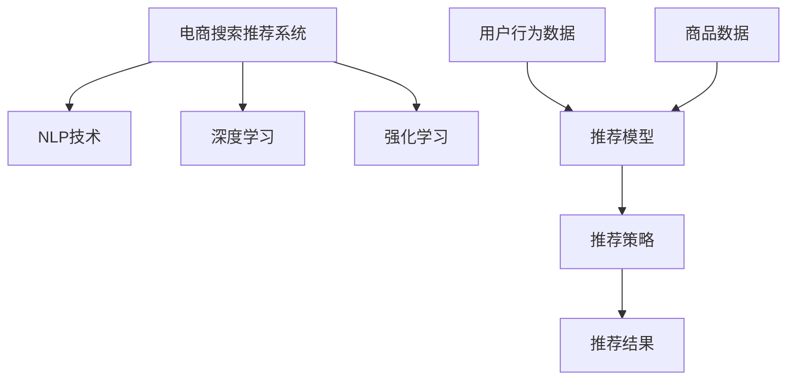

                 

# 大数据驱动的电商搜索推荐系统：AI 模型融合技术是核心竞争力

> 关键词：大数据,电商搜索推荐系统,AI模型融合,自然语言处理,NLP,深度学习,强化学习

## 1. 背景介绍

随着互联网和电子商务的快速发展，电商平台已经成为了消费者获取商品信息、进行购物决策的主要渠道。在这样的背景下，电商平台如何通过智能算法实现个性化推荐，提升用户购物体验，驱动业务增长，成为了电商领域一个核心问题。搜索推荐系统作为电商平台的“大脑”，对于提升用户体验、提高转化率和复购率等方面有着至关重要的作用。然而，随着用户对个性化体验的需求日益增长，传统推荐算法已经难以满足需求。为了更好地解决这一问题，电商搜索推荐系统需要引入更多先进的AI技术，融合不同模型的优势，才能在电商领域取得突破。

## 2. 核心概念与联系

### 2.1 核心概念概述

在大数据驱动的电商搜索推荐系统中，涉及的核心概念包括：

- **电商搜索推荐系统**：指基于电商平台的用户行为数据，通过机器学习算法，为用户推荐可能感兴趣的商品或内容的系统。该系统通过用户搜索行为、浏览历史、评分评论等数据，对用户进行建模，从而生成个性化的推荐结果。

- **自然语言处理（NLP）**：指使用计算机处理、理解、生成自然语言的技术，包括分词、词性标注、命名实体识别、语义理解、文本生成等子任务。在搜索推荐系统中，NLP技术可以用于解析用户的查询意图、提取商品描述信息等。

- **深度学习**：指基于多层神经网络的机器学习技术，通过反向传播算法训练模型，实现复杂的特征提取和模式学习。深度学习在推荐系统中被广泛应用于用户行为建模、商品相似度计算等任务。

- **强化学习**：指智能体在不断与环境互动中学习最优策略，以最大化预期奖励的技术。在推荐系统中，强化学习被用于优化推荐策略，提升点击率、转化率等指标。

这些核心概念之间的联系紧密，相辅相成。自然语言处理技术可以帮助解析用户的查询意图，深度学习技术可以用于构建用户行为模型和计算商品相似度，而强化学习技术可以用于实时优化推荐策略，提升推荐效果。

### 2.2 核心概念原理和架构的 Mermaid 流程图



在这个 Mermaid 流程图中，电商平台的数据驱动推荐系统通过融合NLP、深度学习和强化学习等技术，对用户行为数据和商品数据进行处理，构建推荐模型，最终生成个性化的推荐结果。

## 3. 核心算法原理 & 具体操作步骤

### 3.1 算法原理概述

电商搜索推荐系统通常包含以下几个步骤：

1. **数据收集与预处理**：收集用户行为数据和商品数据，进行清洗和归一化等预处理操作。
2. **用户行为建模**：使用深度学习模型，如协同过滤、矩阵分解、神经网络等，对用户行为进行建模，生成用户兴趣表示。
3. **商品相似度计算**：利用深度学习模型，如卷积神经网络、注意力机制等，计算商品之间的相似度。
4. **推荐策略优化**：使用强化学习算法，如Q-learning、深度Q网络等，优化推荐策略，提升点击率、转化率等指标。
5. **推荐结果生成**：根据用户兴趣表示和商品相似度，结合推荐策略，生成推荐结果。

这些步骤构成了一个完整的电商搜索推荐系统流程。

### 3.2 算法步骤详解

下面详细介绍电商搜索推荐系统的具体步骤和关键技术。

**步骤1：数据收集与预处理**

电商搜索推荐系统的数据主要来自于用户行为数据和商品数据。用户行为数据包括搜索记录、浏览历史、评分、评论等。商品数据包括商品标题、描述、类别、价格等信息。数据收集后，需要进行清洗、去重、归一化等预处理操作，以便后续建模使用。

**步骤2：用户行为建模**

用户行为建模是推荐系统的重要步骤。通过深度学习模型，对用户行为数据进行处理，可以生成用户兴趣表示。以协同过滤为例，通过用户行为矩阵分解，可以得到用户和商品的潜在特征向量，进而计算用户和商品的相似度，生成推荐结果。

**步骤3：商品相似度计算**

商品相似度计算是推荐系统的核心任务之一。深度学习模型可以用于计算商品之间的相似度，提高推荐准确率。以卷积神经网络（CNN）为例，将商品描述转化为词向量，通过卷积层和池化层，提取商品的特征向量，然后计算相似度。

**步骤4：推荐策略优化**

推荐策略优化是推荐系统的重要环节。强化学习算法可以用于实时优化推荐策略，提升推荐效果。以Q-learning为例，通过奖励机制，不断调整推荐策略，以最大化预期奖励。

**步骤5：推荐结果生成**

根据用户兴趣表示和商品相似度，结合推荐策略，生成推荐结果。最终推荐结果可以是商品列表、商品描述、商品评分等信息。

### 3.3 算法优缺点

电商搜索推荐系统融合了多种AI技术，具有以下优点和缺点：

#### 优点

- **高准确率**：融合多种AI技术，能够更准确地理解用户需求和商品特征，生成高精度的推荐结果。
- **实时性**：通过强化学习等技术，可以实时优化推荐策略，提升推荐效果。
- **可扩展性**：基于深度学习等技术，可以灵活扩展到不同电商领域，实现多场景推荐。

#### 缺点

- **计算成本高**：深度学习模型和强化学习算法计算成本较高，需要较强的计算资源。
- **数据需求高**：推荐系统需要大量的用户行为数据和商品数据，数据获取成本较高。
- **可解释性不足**：推荐系统通常是“黑盒”模型，难以解释推荐结果的生成逻辑。

### 3.4 算法应用领域

电商搜索推荐系统已经在多个领域得到了广泛应用，包括但不限于：

- **零售电商**：通过推荐系统，提升用户购物体验，增加销售量。
- **金融电商**：通过推荐系统，为用户推荐理财产品，提升用户黏性。
- **教育电商**：通过推荐系统，为用户推荐课程，提升用户学习效率。
- **旅游电商**：通过推荐系统，为用户推荐旅游目的地和产品，增加用户旅游需求。

## 4. 数学模型和公式 & 详细讲解 & 举例说明

### 4.1 数学模型构建

电商搜索推荐系统涉及的数学模型主要包括：

- **用户行为建模**：将用户行为数据表示为向量，通过矩阵分解等方法，生成用户兴趣表示。
- **商品相似度计算**：将商品描述转化为向量，通过卷积神经网络等方法，计算商品相似度。
- **推荐策略优化**：通过强化学习算法，优化推荐策略，提升推荐效果。

### 4.2 公式推导过程

以协同过滤为例，用户行为建模和商品相似度计算的公式推导如下：

**用户行为建模**：

假设用户行为矩阵为 $U \in \mathbb{R}^{N \times M}$，其中 $N$ 为用户数量，$M$ 为商品数量。将用户行为数据表示为向量 $u \in \mathbb{R}^{M}$，其中 $u_i$ 表示用户对商品 $i$ 的评分。通过矩阵分解，可以得到用户和商品的潜在特征向量：

$$
u = U \times V
$$

其中 $U \in \mathbb{R}^{N \times K}, V \in \mathbb{R}^{M \times K}$，$K$ 为潜在特征维度。

**商品相似度计算**：

假设商品描述向量为 $d \in \mathbb{R}^{N}$，通过卷积神经网络等方法，可以得到商品的特征向量 $f \in \mathbb{R}^{N}$。通过计算商品向量之间的余弦相似度，可以得到商品之间的相似度：

$$
sim(d_i, d_j) = \cos \theta = \frac{d_i \cdot d_j}{\|d_i\| \|d_j\|}
$$

其中 $\theta$ 为向量 $d_i$ 和 $d_j$ 之间的夹角。

### 4.3 案例分析与讲解

以亚马逊推荐系统为例，分析其推荐策略优化过程。

亚马逊推荐系统采用强化学习算法，通过多臂赌博机（Multi-Armed Bandit, MAB）模型，实时优化推荐策略。多臂赌博机模型假设用户从多个臂中选择一个最优的臂，每次选择的收益是随机的。通过不断调整推荐策略，最大化用户的点击率和转化率。

假设用户正在浏览商品，系统会计算每个商品的点击概率 $p_i$，选择点击概率最大的商品进行推荐。同时，系统会记录每次推荐的收益，不断调整推荐策略，以最大化收益。

## 5. 项目实践：代码实例和详细解释说明

### 5.1 开发环境搭建

电商搜索推荐系统的开发环境通常包括：

- **编程语言**：Python、Java、Scala等
- **深度学习框架**：TensorFlow、PyTorch、MXNet等
- **数据处理工具**：Hadoop、Spark、Pandas等
- **机器学习库**：Scikit-learn、XGBoost、LightGBM等

以下是使用Python和PyTorch搭建推荐系统环境的示例：

```bash
# 安装TensorFlow
pip install tensorflow

# 安装PyTorch
pip install torch

# 安装Pandas
pip install pandas

# 安装Scikit-learn
pip install scikit-learn
```

### 5.2 源代码详细实现

以下是一个简单的推荐系统代码示例，使用协同过滤和深度学习模型进行推荐：

```python
import pandas as pd
import numpy as np
from scipy.sparse import csr_matrix
from sklearn.decomposition import TruncatedSVD
import torch
import torch.nn as nn
from torch.nn import Embedding, Linear

# 数据加载
train_data = pd.read_csv('train.csv')
test_data = pd.read_csv('test.csv')

# 数据预处理
user_id, item_id, rating = train_data['user_id'], train_data['item_id'], train_data['rating']
train_data = pd.DataFrame({user_id: train_data[user_id], item_id: train_data[item_id], rating: train_data[rating]})
train_data = train_data.drop_duplicates().reset_index(drop=True)

# 数据构建
user_num = len(set(user_id))
item_num = len(set(item_id))
train_matrix = csr_matrix((rating, (user_id, item_id)), shape=(user_num, item_num))

# 用户行为建模
svd = TruncatedSVD(n_components=100, random_state=0)
U = svd.fit_transform(train_matrix).toarray()

# 商品相似度计算
embedding = Embedding(item_num, 100)
embedding.weight.data.normal_(0, 0.01)
embedding.weight.requires_grad = False
d = embedding.weight

# 推荐模型
class RecommendationModel(nn.Module):
    def __init__(self, user_num, item_num, latent_factor):
        super(RecommendationModel, self).__init__()
        self.user_embedding = Embedding(user_num, latent_factor)
        self.user_embedding.weight.data.normal_(0, 0.01)
        self.user_embedding.weight.requires_grad = False
        self.item_embedding = embedding
        self.dot_product = Linear(latent_factor, 1)

    def forward(self, user_id, item_id):
        user_vector = self.user_embedding(user_id)
        item_vector = self.item_embedding(item_id)
        dot_product = self.dot_product(torch.matmul(user_vector, item_vector.t()))
        return torch.sigmoid(dot_product)

model = RecommendationModel(user_num, item_num, latent_factor)

# 模型训练
optimizer = torch.optim.Adam(model.parameters(), lr=0.01)
criterion = nn.BCELoss()
for epoch in range(10):
    optimizer.zero_grad()
    predictions = model(user_id, item_id)
    loss = criterion(predictions, torch.from_numpy(train_matrix.toarray()).float())
    loss.backward()
    optimizer.step()

# 推荐结果生成
test_matrix = csr_matrix((rating, (test_data[user_id], test_data[item_id])), shape=(user_num, item_num))
test_matrix = test_matrix.toarray()
recommendations = model(test_data[user_id], item_id)
```

### 5.3 代码解读与分析

在上述代码中，我们首先加载和预处理数据，然后构建用户行为矩阵和商品嵌入向量。接着，我们定义了一个推荐模型，使用深度学习的方法进行推荐。最后，我们使用Adam优化器和交叉熵损失函数进行模型训练，并生成推荐结果。

## 6. 实际应用场景

### 6.1 零售电商

零售电商是电商搜索推荐系统的典型应用场景。通过推荐系统，零售商可以为用户推荐最适合的商品，提升用户购物体验，增加销售量。以亚马逊为例，亚马逊通过推荐系统，推荐用户可能感兴趣的商品，显著提高了销售额和用户满意度。

### 6.2 金融电商

金融电商是另一个重要的应用场景。金融产品种类繁多，用户决策难度较大。通过推荐系统，金融电商可以为用户推荐合适的理财产品，提升用户黏性和转化率。以支付宝为例，支付宝通过推荐系统，为用户推荐理财产品，帮助用户做出更好的理财决策。

### 6.3 教育电商

教育电商也是推荐系统的重要应用领域。在线教育平台通常有大量的课程和视频资源，用户需要花费大量时间进行选择。通过推荐系统，教育电商可以为用户推荐最适合的课程，提升用户学习效率。以Coursera为例，Coursera通过推荐系统，为用户推荐最适合的课程，帮助用户更好地学习。

## 7. 工具和资源推荐

### 7.1 学习资源推荐

为了更好地掌握电商搜索推荐系统的技术，以下是一些优质的学习资源推荐：

- **《推荐系统实战》**：该书详细介绍了推荐系统的理论基础和实际应用，包括协同过滤、深度学习、强化学习等算法。
- **《深度学习入门》**：该书介绍了深度学习的基本概念和算法，包括神经网络、卷积神经网络、循环神经网络等。
- **Coursera《机器学习》课程**：由斯坦福大学开设的机器学习课程，详细介绍了机器学习的基本概念和算法，包括监督学习、无监督学习、强化学习等。
- **Udacity《深度学习》课程**：由Udacity开设的深度学习课程，详细介绍了深度学习的基本概念和算法，包括卷积神经网络、循环神经网络、自编码器等。

### 7.2 开发工具推荐

电商搜索推荐系统的开发工具包括：

- **TensorFlow**：由Google开发的深度学习框架，支持分布式训练和部署，适合大规模模型训练。
- **PyTorch**：由Facebook开发的深度学习框架，支持动态图和静态图，适合快速迭代研究。
- **Scikit-learn**：基于Python的机器学习库，支持多种算法，包括分类、回归、聚类等。
- **Apache Spark**：支持大规模数据处理和机器学习，适合处理海量数据。

### 7.3 相关论文推荐

为了深入了解电商搜索推荐系统的技术，以下是一些推荐论文：

- **《商品推荐系统中的协同过滤算法》**：详细介绍了协同过滤算法的原理和应用。
- **《深度学习在推荐系统中的应用》**：介绍了深度学习算法在推荐系统中的应用，包括卷积神经网络、循环神经网络等。
- **《强化学习在推荐系统中的应用》**：介绍了强化学习算法在推荐系统中的应用，包括多臂赌博机模型、深度Q网络等。

## 8. 总结：未来发展趋势与挑战

### 8.1 研究成果总结

电商搜索推荐系统在大数据驱动下，融合了多种AI技术，实现了个性化推荐。通过协同过滤、深度学习和强化学习等算法，电商推荐系统提升了推荐准确率和用户满意度，驱动了业务增长。

### 8.2 未来发展趋势

未来，电商搜索推荐系统将继续朝着智能化、个性化、实时化方向发展。具体而言，以下几个趋势值得关注：

- **多模态融合**：融合多种模态数据，如文本、图像、语音等，提高推荐系统的准确率和用户满意度。
- **联邦学习**：利用联邦学习技术，保护用户隐私，实现跨平台推荐。
- **自适应推荐**：利用自适应推荐技术，根据用户反馈实时调整推荐策略，提升推荐效果。
- **知识图谱**：融合知识图谱，提升推荐系统的智能化水平，增强推荐结果的可解释性。

### 8.3 面临的挑战

虽然电商搜索推荐系统取得了显著成果，但仍面临诸多挑战：

- **数据隐私问题**：电商推荐系统需要大量用户数据，如何保护用户隐私是一个重要问题。
- **模型复杂度**：推荐系统需要融合多种AI技术，模型复杂度较高，如何实现高效优化是一个挑战。
- **实时性要求**：推荐系统需要实时生成推荐结果，如何平衡推荐效果和实时性是一个难点。
- **可解释性不足**：推荐系统通常是“黑盒”模型，如何增强推荐结果的可解释性是一个重要问题。

### 8.4 研究展望

未来，电商搜索推荐系统需要从以下几个方面进行深入研究：

- **融合多模态数据**：融合文本、图像、语音等多模态数据，提升推荐系统的准确率和用户满意度。
- **联邦学习**：利用联邦学习技术，保护用户隐私，实现跨平台推荐。
- **自适应推荐**：利用自适应推荐技术，根据用户反馈实时调整推荐策略，提升推荐效果。
- **知识图谱**：融合知识图谱，提升推荐系统的智能化水平，增强推荐结果的可解释性。

总之，电商搜索推荐系统需要不断地进行技术创新和优化，才能更好地适应市场需求，提升用户体验和业务价值。

## 9. 附录：常见问题与解答

**Q1：电商推荐系统的准确率如何提升？**

A：电商推荐系统的准确率可以通过以下几个方式提升：

- **数据预处理**：对数据进行清洗、去重、归一化等预处理操作，提高数据质量。
- **特征工程**：通过特征工程，提取有意义的特征，提高模型准确率。
- **模型选择**：选择合适的推荐算法，如协同过滤、深度学习、强化学习等，提升推荐效果。
- **模型优化**：通过超参数调优、模型融合等方法，优化推荐模型。

**Q2：电商推荐系统的实时性如何保证？**

A：电商推荐系统的实时性可以通过以下几个方式保证：

- **模型压缩**：通过模型压缩、稀疏化存储等方法，减小模型计算量和存储需求，提升实时性。
- **分布式训练**：利用分布式训练技术，加速模型训练和推理，提高实时性。
- **边缘计算**：将推荐模型部署在边缘设备上，实现本地计算和推理，提高实时性。

**Q3：电商推荐系统的可解释性如何增强？**

A：电商推荐系统的可解释性可以通过以下几个方式增强：

- **特征重要性分析**：通过特征重要性分析，理解推荐结果的生成逻辑。
- **模型可视化**：利用模型可视化工具，直观展示模型内部结构，增强可解释性。
- **用户反馈**：收集用户反馈，优化推荐策略，提升可解释性。

**Q4：电商推荐系统的用户隐私如何保护？**

A：电商推荐系统的用户隐私可以通过以下几个方式保护：

- **数据匿名化**：对用户数据进行匿名化处理，保护用户隐私。
- **差分隐私**：利用差分隐私技术，保护用户隐私，防止数据泄露。
- **联邦学习**：利用联邦学习技术，保护用户隐私，实现跨平台推荐。

总之，电商搜索推荐系统需要不断地进行技术创新和优化，才能更好地适应市场需求，提升用户体验和业务价值。

