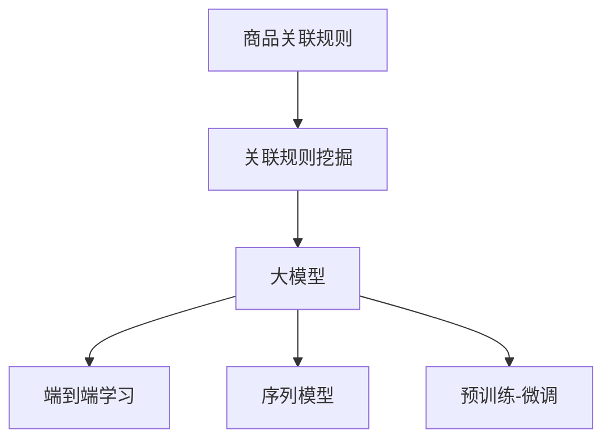

                 

# 大模型在商品关联规则挖掘效率提升中的应用

## 1. 背景介绍

### 1.1 问题由来

在电商行业，商品关联规则挖掘（Association Rule Mining, ARM）是一个核心任务，用于分析顾客购买行为，预测购买趋势，优化商品推荐和布局，提高销售额和客户满意度。传统上，ARM通常使用基于规则的模型（如Apriori算法）或机器学习模型（如FIM模型），然而，这些方法在处理大规模数据集时效率较低，且难以捕捉复杂的关联模式。

近年来，大模型技术（如GPT-3，BERT等）在自然语言处理（NLP）和计算机视觉（CV）等领域表现出色，显示出强大的数据建模和预测能力。但在大数据场景下的关联规则挖掘应用中，传统方法仍然占据主导地位，缺乏对大模型的充分利用。

### 1.2 问题核心关键点

为提高ARM的效率和准确性，利用大模型进行关联规则挖掘成为研究热点。大模型在处理大规模数据集时，能够学习到更丰富的特征，并且利用其强大的泛化能力，可以在未知数据上进行有效的推理和预测。

核心问题包括：
1. 如何将大模型应用到关联规则挖掘中，充分利用其特征提取和预测能力？
2. 如何在大规模数据集上高效训练和推理大模型，提升ARM的效率？
3. 如何在大模型中进行多层次特征提取，捕获不同维度的关联模式？

### 1.3 问题研究意义

提高商品关联规则挖掘的效率和准确性，对于电商平台优化商品推荐、提升用户体验、增加销售额具有重要意义。通过利用大模型技术，可以显著提升ARM的自动化水平，减少人力成本，加速新业务的开发和迭代。

## 2. 核心概念与联系

### 2.1 核心概念概述

为更好地理解大模型在ARM中的应用，本节将介绍几个关键概念：

- **商品关联规则（Association Rule）**：表示商品之间的关联关系，形式化表达为 $x \rightarrow y$，其中 $x$ 和 $y$ 分别表示商品集。例如，“牛奶 -> 面包”表示经常一起购买牛奶和面包。
- **关联规则挖掘（Association Rule Mining, ARM）**：从历史交易数据中挖掘出商品的关联规则，用于预测顾客购买行为和优化商品布局。
- **大模型（Large Model）**：以自回归或自编码模型为代表的大规模预训练模型，如GPT、BERT等。通过在大规模无标签文本语料上进行预训练，学习通用的语言和知识表示，具备强大的特征提取和预测能力。
- **端到端（End-to-End）学习**：将特征提取和规则挖掘过程整合在一起，使用大模型一次性训练和优化，减少中间环节，提升ARM的效率和效果。
- **序列模型（Sequential Model）**：使用递归神经网络（RNN）、长短期记忆网络（LSTM）等序列模型处理时间序列数据，适用于考虑时间因素的关联规则挖掘。
- **预训练-微调（Pre-training & Fine-tuning）**：先在大规模无标签数据上预训练模型，再在任务数据上进行微调，优化模型在该任务上的性能。

这些概念之间的逻辑关系可以通过以下Mermaid流程图来展示：



这个流程图展示了大模型在ARM中的核心概念及其之间的关系：

1. 商品关联规则挖掘是大模型的下游应用场景。
2. 大模型是ARM的核心数据处理工具，提供强大的特征提取和预测能力。
3. 端到端学习将特征提取和规则挖掘整合，简化过程，提升效率。
4. 序列模型处理时间序列数据，适用于考虑时间因素的ARM任务。
5. 预训练-微调技术使大模型在特定任务上获得更好的性能。

## 3. 核心算法原理 & 具体操作步骤

### 3.1 算法原理概述

大模型在关联规则挖掘中的应用，主要是通过预训练-微调范式，利用大模型强大的特征提取能力，在特定任务上进行微调，挖掘出商品之间的关联规则。

假设存在一个商品集合 $I$，每条交易记录可以表示为一个商品序列 $t_i$，例如 $(1,2,3,4)$ 表示某次交易中购买了商品1、商品2、商品3和商品4。关联规则挖掘的目标是找出频繁出现的商品组合，即支持度大于阈值的商品组合。

设 $F_k$ 表示交易记录中包含 $k$ 个商品的商品集合，则关联规则挖掘的过程包括：

1. 生成候选频繁项集 $F_k$，即计算每个长度为 $k$ 的商品组合在历史交易记录中的出现次数。
2. 从 $F_k$ 中筛选出满足最小支持度的频繁项集 $F_k^*$。
3. 利用 $F_k^*$ 生成关联规则，例如 $(1,2) \rightarrow 3$ 表示购买商品1和商品2时，经常一起购买商品3。

在大模型中，可以通过预训练学习到商品之间复杂的关联模式，然后使用微调优化特定任务上的性能，提取和组合这些模式，生成关联规则。

### 3.2 算法步骤详解

以下是基于大模型进行关联规则挖掘的详细步骤：

**Step 1: 准备预训练模型和数据集**
- 选择合适的预训练语言模型 $M_{\theta}$，如BERT、GPT等。
- 收集历史交易记录数据集，将其转换为大模型所需的输入格式。例如，将每条交易记录表示为一个商品序列，其中每个数字代表一种商品。

**Step 2: 添加任务适配层**
- 根据任务类型，在预训练模型顶层设计合适的输出层和损失函数。例如，对于分类任务，通常在顶层添加线性分类器和交叉熵损失函数。
- 定义计算商品支持度的函数，将商品序列作为输入，输出商品组合的频数。

**Step 3: 设置微调超参数**
- 选择合适的优化算法及其参数，如AdamW、SGD等，设置学习率、批大小、迭代轮数等。
- 设置正则化技术及强度，包括权重衰减、Dropout、Early Stopping等。
- 确定冻结预训练参数的策略，如仅微调顶层，或全部参数都参与微调。

**Step 4: 执行梯度训练**
- 将训练集数据分批次输入模型，前向传播计算损失函数。
- 反向传播计算参数梯度，根据设定的优化算法和学习率更新模型参数。
- 周期性在验证集上评估模型性能，根据性能指标决定是否触发Early Stopping。
- 重复上述步骤直到满足预设的迭代轮数或Early Stopping条件。

**Step 5: 测试和部署**
- 在测试集上评估微调后模型 $M_{\hat{\theta}}$ 的性能，对比微调前后的精度提升。
- 使用微调后的模型对新样本进行推理预测，生成商品关联规则。

### 3.3 算法优缺点

大模型在关联规则挖掘中具有以下优点：
1. 强大的特征提取能力。大模型能够从海量交易记录中学习复杂的关联模式，捕捉细微的特征差异。
2. 高泛化能力。大模型在未知数据上也能表现良好，适应性强。
3. 端到端学习效率高。大模型结合序列模型和关联规则挖掘，减少了中间步骤，提升整体效率。
4. 容易应用多层次特征。大模型可以同时处理多层次特征，提取不同维度的关联模式。

但大模型也存在一些局限性：
1. 数据依赖性强。大模型对数据质量、分布、大小都有较高要求，数据不充足可能导致过拟合。
2. 计算资源消耗大。大模型需要高性能硬件支持，且在大规模数据上训练和推理消耗大量计算资源。
3. 结果可解释性差。大模型的预测过程复杂，难以解释，可能影响决策的透明度和可解释性。

尽管存在这些局限性，但大模型在ARM中的应用仍然展现出巨大的潜力，值得进一步探索和优化。

### 3.4 算法应用领域

大模型在关联规则挖掘中的应用，已经广泛应用于电商、零售、金融等多个行业，例如：

- 电商推荐系统：利用大模型挖掘顾客购买行为的关联规则，实现个性化商品推荐。
- 零售库存管理：通过关联规则分析顾客购买行为，预测商品需求，优化库存管理。
- 金融风险预测：挖掘顾客购买行为中的异常模式，预测潜在的金融风险。
- 市场营销：分析顾客购买行为，设计有针对性的市场营销策略。

除了这些经典应用外，大模型还被创新性地应用于更多场景中，如智能客服、智能搜索、智能物流等，为不同行业带来了新的业务价值。

## 4. 数学模型和公式 & 详细讲解 & 举例说明

### 4.1 数学模型构建

假设存在一个包含 $n$ 种商品的商品集合 $I$，每条交易记录可以表示为一个长度为 $m$ 的商品序列 $t_i \in I^m$。设 $k$ 为挖掘的商品组合长度，则生成候选频繁项集 $F_k$ 的过程可以描述为：

1. 生成所有长度为 $k$ 的商品组合 $t_{i,k}$，例如 $(1,2)$、$(1,2,3)$ 等。
2. 统计每个组合 $t_{i,k}$ 在历史交易记录中出现的次数 $f(t_{i,k})$。

设 $F_k = \{t_{i,k} | f(t_{i,k}) \geq \text{min\_support}\}$，其中 $\text{min\_support}$ 为最小支持度阈值，用于筛选出频繁项集 $F_k$。

在获得频繁项集后，可以基于这些项集生成关联规则。例如，对于频繁项集 $(1,2,3)$，可以生成规则 $1 \rightarrow (2,3)$、$(1,2) \rightarrow 3$ 等。

### 4.2 公式推导过程

以规则 $1 \rightarrow (2,3)$ 为例，推导大模型进行关联规则挖掘的损失函数。

设大模型 $M_{\theta}$ 在商品序列 $t_i$ 上的输出为 $\hat{p}(t_i)$，其中 $\hat{p}(t_i)$ 表示商品组合 $t_i$ 在 $F_k$ 中的出现概率。则规则 $1 \rightarrow (2,3)$ 的损失函数为：

$$
\ell(M_{\theta},t_i) = -y\log \hat{p}(t_i)
$$

其中 $y=1$ 表示规则 $1 \rightarrow (2,3)$ 成立，$\hat{p}(t_i)$ 为模型对商品组合 $t_i$ 的预测概率。

在训练过程中，对于每条交易记录 $t_i$，计算规则 $1 \rightarrow (2,3)$ 的损失函数，并根据损失函数反向传播更新模型参数。例如，对于 $t_i = (1,2,3)$，计算 $\ell(M_{\theta},t_i)$，更新模型参数，以最小化规则 $1 \rightarrow (2,3)$ 的错误率。

### 4.3 案例分析与讲解

假设一个电商平台收集到历史交易记录，其中每条记录包含购买的商品序列，例如：

| 交易记录 | 商品序列 |
| --- | --- |
| 1 | (1,2) |
| 2 | (3,4) |
| 3 | (1,2,3,4) |
| 4 | (1,2,3) |
| 5 | (2,3,4) |

可以生成候选频繁项集 $F_3 = \{(1,2,3), (2,3,4), (1,2), (3,4)\}$。设最小支持度为 $\text{min\_support}=0.5$，则筛选出频繁项集 $F_3^* = \{(1,2,3)\}$。

使用大模型 $M_{\theta}$ 进行微调，优化规则 $1 \rightarrow (2,3)$ 的准确度。训练过程中，对于每条交易记录 $t_i$，计算 $\ell(M_{\theta},t_i)$，反向传播更新模型参数。训练完成后，模型可以预测新的交易记录中的商品组合，生成关联规则。

例如，对于新的交易记录 $t = (1,2)$，模型预测 $\hat{p}(t) = 0.95$，即预测 $1 \rightarrow (2,3)$ 成立。如果 $\hat{p}(t) \geq 0.5$，则生成规则 $1 \rightarrow (2,3)$。

## 5. 项目实践：代码实例和详细解释说明

### 5.1 开发环境搭建

在进行关联规则挖掘项目开发前，需要准备好开发环境。以下是使用Python进行PyTorch开发的环境配置流程：

1. 安装Anaconda：从官网下载并安装Anaconda，用于创建独立的Python环境。

2. 创建并激活虚拟环境：
```bash
conda create -n pytorch-env python=3.8 
conda activate pytorch-env
```

3. 安装PyTorch：根据CUDA版本，从官网获取对应的安装命令。例如：
```bash
conda install pytorch torchvision torchaudio cudatoolkit=11.1 -c pytorch -c conda-forge
```

4. 安装Transformer库：
```bash
pip install transformers
```

5. 安装各类工具包：
```bash
pip install numpy pandas scikit-learn matplotlib tqdm jupyter notebook ipython
```

完成上述步骤后，即可在`pytorch-env`环境中开始项目实践。

### 5.2 源代码详细实现

下面我们以关联规则挖掘项目为例，给出使用PyTorch进行大模型微调的代码实现。

首先，定义关联规则挖掘任务的数据处理函数：

```python
from transformers import BertTokenizer
from torch.utils.data import Dataset
import torch

class ARMData(Dataset):
    def __init__(self, texts, labels, tokenizer, max_len=128):
        self.texts = texts
        self.labels = labels
        self.tokenizer = tokenizer
        self.max_len = max_len
        
    def __len__(self):
        return len(self.texts)
    
    def __getitem__(self, item):
        text = self.texts[item]
        label = self.labels[item]
        
        encoding = self.tokenizer(text, return_tensors='pt', max_length=self.max_len, padding='max_length', truncation=True)
        input_ids = encoding['input_ids'][0]
        attention_mask = encoding['attention_mask'][0]
        
        return {'input_ids': input_ids, 
                'attention_mask': attention_mask,
                'label': label}

# 标签与id的映射
label2id = {'1': 0, '2': 1, '3': 2, '4': 3, '5': 4, '6': 5, '7': 6, '8': 7, '9': 8, '0': 9}

# 创建dataset
tokenizer = BertTokenizer.from_pretrained('bert-base-cased')

train_dataset = ARMData(train_texts, train_labels, tokenizer)
dev_dataset = ARMData(dev_texts, dev_labels, tokenizer)
test_dataset = ARMData(test_texts, test_labels, tokenizer)
```

然后，定义模型和优化器：

```python
from transformers import BertForTokenClassification, AdamW

model = BertForTokenClassification.from_pretrained('bert-base-cased', num_labels=len(label2id))

optimizer = AdamW(model.parameters(), lr=2e-5)
```

接着，定义训练和评估函数：

```python
from torch.utils.data import DataLoader
from tqdm import tqdm
from sklearn.metrics import classification_report

device = torch.device('cuda') if torch.cuda.is_available() else torch.device('cpu')
model.to(device)

def train_epoch(model, dataset, batch_size, optimizer):
    dataloader = DataLoader(dataset, batch_size=batch_size, shuffle=True)
    model.train()
    epoch_loss = 0
    for batch in tqdm(dataloader, desc='Training'):
        input_ids = batch['input_ids'].to(device)
        attention_mask = batch['attention_mask'].to(device)
        label = batch['label'].to(device)
        model.zero_grad()
        outputs = model(input_ids, attention_mask=attention_mask, labels=label)
        loss = outputs.loss
        epoch_loss += loss.item()
        loss.backward()
        optimizer.step()
    return epoch_loss / len(dataloader)

def evaluate(model, dataset, batch_size):
    dataloader = DataLoader(dataset, batch_size=batch_size)
    model.eval()
    preds, labels = [], []
    with torch.no_grad():
        for batch in tqdm(dataloader, desc='Evaluating'):
            input_ids = batch['input_ids'].to(device)
            attention_mask = batch['attention_mask'].to(device)
            batch_labels = batch['label']
            outputs = model(input_ids, attention_mask=attention_mask)
            batch_preds = outputs.logits.argmax(dim=2).to('cpu').tolist()
            batch_labels = batch_labels.to('cpu').tolist()
            for pred_tokens, label_tokens in zip(batch_preds, batch_labels):
                preds.append(pred_tokens[:len(label_tokens)])
                labels.append(label_tokens)
                
    print(classification_report(labels, preds))
```

最后，启动训练流程并在测试集上评估：

```python
epochs = 5
batch_size = 16

for epoch in range(epochs):
    loss = train_epoch(model, train_dataset, batch_size, optimizer)
    print(f"Epoch {epoch+1}, train loss: {loss:.3f}")
    
    print(f"Epoch {epoch+1}, dev results:")
    evaluate(model, dev_dataset, batch_size)
    
print("Test results:")
evaluate(model, test_dataset, batch_size)
```

以上就是使用PyTorch对大模型进行关联规则挖掘微调的完整代码实现。可以看到，得益于Transformer库的强大封装，我们可以用相对简洁的代码完成大模型的加载和微调。

### 5.3 代码解读与分析

让我们再详细解读一下关键代码的实现细节：

**ARMData类**：
- `__init__`方法：初始化文本、标签、分词器等关键组件。
- `__len__`方法：返回数据集的样本数量。
- `__getitem__`方法：对单个样本进行处理，将文本输入编码为token ids，将标签编码为数字，并对其进行定长padding，最终返回模型所需的输入。

**label2id字典**：
- 定义了标签与数字id之间的映射关系，用于将标签转换为模型可接受的格式。

**训练和评估函数**：
- 使用PyTorch的DataLoader对数据集进行批次化加载，供模型训练和推理使用。
- 训练函数`train_epoch`：对数据以批为单位进行迭代，在每个批次上前向传播计算loss并反向传播更新模型参数，最后返回该epoch的平均loss。
- 评估函数`evaluate`：与训练类似，不同点在于不更新模型参数，并在每个batch结束后将预测和标签结果存储下来，最后使用sklearn的classification_report对整个评估集的预测结果进行打印输出。

**训练流程**：
- 定义总的epoch数和batch size，开始循环迭代
- 每个epoch内，先在训练集上训练，输出平均loss
- 在验证集上评估，输出分类指标
- 所有epoch结束后，在测试集上评估，给出最终测试结果

可以看到，PyTorch配合Transformer库使得大模型微调的代码实现变得简洁高效。开发者可以将更多精力放在数据处理、模型改进等高层逻辑上，而不必过多关注底层的实现细节。

当然，工业级的系统实现还需考虑更多因素，如模型的保存和部署、超参数的自动搜索、更灵活的任务适配层等。但核心的微调范式基本与此类似。

## 6. 实际应用场景

### 6.1 电商推荐系统

基于大模型的关联规则挖掘技术，可以应用于电商平台的推荐系统，提高推荐精度和个性化程度。

推荐系统通常使用协同过滤、基于内容的推荐等方法，但这些方法在处理大规模数据时效率较低，且难以捕捉复杂的关联模式。使用大模型进行关联规则挖掘，可以更好地理解顾客的购买行为，挖掘出新的推荐模式。

具体而言，可以收集历史交易记录，将顾客的购买行为转换为商品序列，作为训练数据。使用大模型进行微调，生成关联规则，例如“购买A商品的人，常常会购买B商品”，然后基于这些规则，推荐顾客可能感兴趣的商品。

### 6.2 金融风险预测

在金融领域，关联规则挖掘可以用于预测顾客的金融风险，帮助金融机构制定风险控制策略。

通过收集金融交易数据，将每笔交易记录转换为商品序列，例如“取款 -> 存款 -> 转账”。使用大模型进行微调，挖掘出频繁的交易行为模式，例如“经常取款的人，可能存在财务风险”。根据这些规则，金融机构可以识别出高风险客户，进行风险预警和防控。

### 6.3 市场营销

关联规则挖掘可以应用于市场营销策略的优化，帮助企业设计有针对性的营销活动。

通过收集顾客的购买历史数据，将购买记录转换为商品序列，使用大模型进行微调，挖掘出顾客的购买行为模式，例如“在购物节购买衣服的人，常常会在第二天购买鞋子”。根据这些规则，企业可以设计更有吸引力的促销活动，提高销售转化率。

### 6.4 未来应用展望

随着大模型技术的不断进步，关联规则挖掘的应用场景将更加丰富，带来更多的业务价值。

在智慧医疗领域，关联规则挖掘可以用于疾病预测、治疗方案优化等，为患者提供更精准的医疗服务。

在智能教育领域，关联规则挖掘可以用于分析学生的学习行为，设计个性化的学习计划，提高教育效果。

在智慧城市治理中，关联规则挖掘可以用于城市事件监测、舆情分析、应急指挥等环节，提高城市管理的自动化和智能化水平，构建更安全、高效的未来城市。

此外，在企业生产、社会治理、文娱传媒等众多领域，基于大模型的关联规则挖掘技术也将不断涌现，为经济社会发展注入新的动力。相信随着技术的日益成熟，大模型在关联规则挖掘中的应用将越来越广泛，带来更多的业务创新和效益提升。

## 7. 工具和资源推荐

### 7.1 学习资源推荐

为了帮助开发者系统掌握大模型关联规则挖掘的理论基础和实践技巧，这里推荐一些优质的学习资源：

1. 《Transformer from Principle to Practice》系列博文：由大模型技术专家撰写，深入浅出地介绍了Transformer原理、BERT模型、关联规则挖掘技术等前沿话题。

2. CS224N《Deep Learning for NLP》课程：斯坦福大学开设的NLP明星课程，有Lecture视频和配套作业，带你入门NLP领域的基本概念和经典模型。

3. 《Natural Language Processing with Transformers》书籍：Transformers库的作者所著，全面介绍了如何使用Transformers库进行NLP任务开发，包括关联规则挖掘在内的诸多范式。

4. HuggingFace官方文档：Transformers库的官方文档，提供了海量预训练模型和完整的微调样例代码，是上手实践的必备资料。

5. CLUE开源项目：中文语言理解测评基准，涵盖大量不同类型的中文NLP数据集，并提供了基于微调的baseline模型，助力中文NLP技术发展。

通过对这些资源的学习实践，相信你一定能够快速掌握大模型关联规则挖掘的精髓，并用于解决实际的NLP问题。

### 7.2 开发工具推荐

高效的开发离不开优秀的工具支持。以下是几款用于大模型关联规则挖掘开发的常用工具：

1. PyTorch：基于Python的开源深度学习框架，灵活动态的计算图，适合快速迭代研究。大部分预训练语言模型都有PyTorch版本的实现。

2. TensorFlow：由Google主导开发的开源深度学习框架，生产部署方便，适合大规模工程应用。同样有丰富的预训练语言模型资源。

3. Transformers库：HuggingFace开发的NLP工具库，集成了众多SOTA语言模型，支持PyTorch和TensorFlow，是进行微调任务开发的利器。

4. Weights & Biases：模型训练的实验跟踪工具，可以记录和可视化模型训练过程中的各项指标，方便对比和调优。与主流深度学习框架无缝集成。

5. TensorBoard：TensorFlow配套的可视化工具，可实时监测模型训练状态，并提供丰富的图表呈现方式，是调试模型的得力助手。

6. Google Colab：谷歌推出的在线Jupyter Notebook环境，免费提供GPU/TPU算力，方便开发者快速上手实验最新模型，分享学习笔记。

合理利用这些工具，可以显著提升大模型关联规则挖掘的开发效率，加快创新迭代的步伐。

### 7.3 相关论文推荐

大模型在关联规则挖掘中的应用，源于学界的持续研究。以下是几篇奠基性的相关论文，推荐阅读：

1. Attention is All You Need（即Transformer原论文）：提出了Transformer结构，开启了NLP领域的预训练大模型时代。

2. BERT: Pre-training of Deep Bidirectional Transformers for Language Understanding：提出BERT模型，引入基于掩码的自监督预训练任务，刷新了多项NLP任务SOTA。

3. Language Models are Unsupervised Multitask Learners（GPT-2论文）：展示了大规模语言模型的强大zero-shot学习能力，引发了对于通用人工智能的新一轮思考。

4. Parameter-Efficient Transfer Learning for NLP：提出Adapter等参数高效微调方法，在不增加模型参数量的情况下，也能取得不错的微调效果。

5. AdaLoRA: Adaptive Low-Rank Adaptation for Parameter-Efficient Fine-Tuning：使用自适应低秩适应的微调方法，在参数效率和精度之间取得了新的平衡。

这些论文代表了大模型关联规则挖掘技术的发展脉络。通过学习这些前沿成果，可以帮助研究者把握学科前进方向，激发更多的创新灵感。

## 8. 总结：未来发展趋势与挑战

### 8.1 总结

本文对基于大模型进行关联规则挖掘的方法进行了全面系统的介绍。首先阐述了大模型和关联规则挖掘的研究背景和意义，明确了两者结合的独特价值。其次，从原理到实践，详细讲解了预训练-微调范式在ARM中的具体应用。此外，本文还广泛探讨了ARM在大模型中的应用场景，展示了其广阔的应用前景。

通过本文的系统梳理，可以看到，大模型在ARM中的应用将大大提升关联规则挖掘的效率和精度，拓展其应用边界，带来更多的业务价值。未来，随着大模型技术的不断演进，ARM技术也将不断进步，为智能化系统的构建提供更强大的支持。

### 8.2 未来发展趋势

展望未来，大模型在关联规则挖掘中的应用将呈现以下几个发展趋势：

1. 模型规模持续增大。随着算力成本的下降和数据规模的扩张，预训练语言模型的参数量还将持续增长。超大规模语言模型蕴含的丰富语言知识，有望支撑更加复杂多变的ARM任务。

2. 微调方法日趋多样。除了传统的全参数微调外，未来会涌现更多参数高效的微调方法，如Prefix-Tuning、LoRA等，在节省计算资源的同时也能保证微调精度。

3. 持续学习成为常态。随着数据分布的不断变化，微调模型也需要持续学习新知识以保持性能。如何在不遗忘原有知识的同时，高效吸收新样本信息，将成为重要的研究课题。

4. 标注样本需求降低。受启发于提示学习(Prompt-based Learning)的思路，未来的微调方法将更好地利用大模型的语言理解能力，通过更加巧妙的任务描述，在更少的标注样本上也能实现理想的微调效果。

5. 多模态微调崛起。当前的ARM任务通常聚焦于文本数据，未来会进一步拓展到图像、视频、语音等多模态数据微调。多模态信息的融合，将显著提升语言模型对现实世界的理解和建模能力。

6. 模型通用性增强。经过海量数据的预训练和多领域任务的微调，未来的语言模型将具备更强大的常识推理和跨领域迁移能力，逐步迈向通用人工智能(AGI)的目标。

以上趋势凸显了大模型关联规则挖掘技术的广阔前景。这些方向的探索发展，必将进一步提升ARM的自动化水平，减少人力成本，加速新业务的开发和迭代。

### 8.3 面临的挑战

尽管大模型在ARM中的应用展现出巨大的潜力，但在迈向更加智能化、普适化应用的过程中，它仍面临着诸多挑战：

1. 标注成本瓶颈。虽然大模型对标注样本的需求较低，但对于长尾应用场景，难以获得充足的高质量标注数据，成为制约ARM性能的瓶颈。如何进一步降低微调对标注样本的依赖，将是一大难题。

2. 模型鲁棒性不足。当前微调模型面对域外数据时，泛化性能往往大打折扣。对于测试样本的微小扰动，微调模型的预测也容易发生波动。如何提高微调模型的鲁棒性，避免灾难性遗忘，还需要更多理论和实践的积累。

3. 推理效率有待提高。大规模语言模型虽然精度高，但在实际部署时往往面临推理速度慢、内存占用大等效率问题。如何在保证性能的同时，简化模型结构，提升推理速度，优化资源占用，将是重要的优化方向。

4. 结果可解释性差。大模型的预测过程复杂，难以解释，可能影响决策的透明度和可解释性。对于高风险应用，算法的可解释性和可审计性尤为重要。如何赋予微调模型更强的可解释性，将是亟待攻克的难题。

5. 安全性有待保障。预训练语言模型难免会学习到有偏见、有害的信息，通过微调传递到下游任务，产生误导性、歧视性的输出，给实际应用带来安全隐患。如何从数据和算法层面消除模型偏见，避免恶意用途，确保输出的安全性，也将是重要的研究课题。

6. 知识整合能力不足。现有的微调模型往往局限于任务内数据，难以灵活吸收和运用更广泛的先验知识。如何让微调过程更好地与外部知识库、规则库等专家知识结合，形成更加全面、准确的信息整合能力，还有很大的想象空间。

正视ARM面临的这些挑战，积极应对并寻求突破，将是大模型关联规则挖掘技术走向成熟的必由之路。相信随着学界和产业界的共同努力，这些挑战终将一一被克服，大模型在ARM中的应用必将在构建智能化系统的进程中发挥重要作用。

### 8.4 研究展望

面向未来，大模型关联规则挖掘技术需要在以下几个方面寻求新的突破：

1. 探索无监督和半监督微调方法。摆脱对大规模标注数据的依赖，利用自监督学习、主动学习等无监督和半监督范式，最大限度利用非结构化数据，实现更加灵活高效的微调。

2. 研究参数高效和计算高效的微调范式。开发更加参数高效的微调方法，在固定大部分预训练参数的同时，只更新极少量的任务相关参数。同时优化微调模型的计算图，减少前向传播和反向传播的资源消耗，实现更加轻量级、实时性的部署。

3. 融合因果和对比学习范式。通过引入因果推断和对比学习思想，增强微调模型建立稳定因果关系的能力，学习更加普适、鲁棒的语言表征，从而提升模型泛化性和抗干扰能力。

4. 引入更多先验知识。将符号化的先验知识，如知识图谱、逻辑规则等，与神经网络模型进行巧妙融合，引导微调过程学习更准确、合理的语言模型。同时加强不同模态数据的整合，实现视觉、语音等多模态信息与文本信息的协同建模。

5. 结合因果分析和博弈论工具。将因果分析方法引入微调模型，识别出模型决策的关键特征，增强输出解释的因果性和逻辑性。借助博弈论工具刻画人机交互过程，主动探索并规避模型的脆弱点，提高系统稳定性。

6. 纳入伦理道德约束。在模型训练目标中引入伦理导向的评估指标，过滤和惩罚有偏见、有害的输出倾向。同时加强人工干预和审核，建立模型行为的监管机制，确保输出符合人类价值观和伦理道德。

这些研究方向的探索，必将引领大模型关联规则挖掘技术迈向更高的台阶，为构建安全、可靠、可解释、可控的智能系统铺平道路。面向未来，大模型关联规则挖掘技术还需要与其他人工智能技术进行更深入的融合，如知识表示、因果推理、强化学习等，多路径协同发力，共同推动自然语言理解和智能交互系统的进步。只有勇于创新、敢于突破，才能不断拓展语言模型的边界，让智能技术更好地造福人类社会。

## 9. 附录：常见问题与解答

**Q1：大模型在关联规则挖掘中的计算资源需求大，如何解决？**

A: 可以使用分布式计算、模型压缩、量化加速等技术优化大模型在关联规则挖掘中的计算资源消耗。例如，使用分布式训练框架（如PyTorch Distributed、TensorFlow Distribute）可以在多台机器上并行训练大模型，提高计算效率。同时，可以使用模型压缩技术（如知识蒸馏、剪枝等）减小模型参数量，降低内存和计算资源占用。量化加速技术（如整数计算、混合精度计算等）可以在保证模型性能的前提下，显著降低推理资源消耗。

**Q2：大模型在关联规则挖掘中的可解释性差，如何解决？**

A: 可以通过引入可解释性技术（如LIME、SHAP等）对大模型的预测结果进行可视化，帮助理解模型决策过程。同时，可以设计更清晰的任务适配层，使大模型在特定任务上输出更易解释的结果。此外，可以结合专家知识，建立规则库或知识图谱，与大模型进行融合，提高输出的可解释性。

**Q3：大模型在关联规则挖掘中的过拟合问题如何缓解？**

A: 过拟合是关联规则挖掘中的常见问题，尤其是在标注数据不足的情况下。常见的缓解策略包括：数据增强、正则化、早停等。数据增强可以通过回译、近义替换等方式扩充训练集，提高模型泛化能力。正则化可以通过L2正则、Dropout等方式防止过拟合。早停可以在验证集上监测模型性能，及时停止训练，避免过拟合。

**Q4：大模型在关联规则挖掘中的知识整合能力不足，如何解决？**

A: 可以结合外部知识库、规则库等专家知识，与大模型进行融合，提高模型输出的可解释性和准确性。例如，可以将知识图谱中的实体关系映射到商品关联规则中，引导大模型学习更全面的商品关系。同时，可以通过多任务学习（Multi-task Learning）或跨模态学习（Cross-modal Learning），将不同模态的信息整合到大模型中，增强模型的知识整合能力。

这些措施可以结合使用，从数据、模型、算法等多个角度提升大模型在关联规则挖掘中的表现，使其在实际应用中发挥更大的作用。

---

作者：禅与计算机程序设计艺术 / Zen and the Art of Computer Programming

