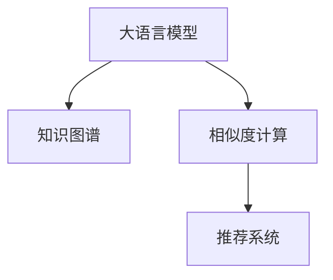

                 

## 1. 背景介绍

### 1.1 问题由来
商品相似度计算是电商推荐系统中的核心任务之一，旨在根据用户的购买历史和浏览行为，精准匹配相似的商品，帮助用户发现感兴趣的商品。传统的基于余弦相似度、TF-IDF等算法的相似度计算方法，往往依赖手工特征工程，难以捕捉商品之间的语义关系，导致推荐效果不佳。

近年来，随着深度学习和大模型的不断发展，商品相似度计算的方法也逐步从基于手工特征的统计方法，转向利用大模型直接学习特征，从而提升推荐的精度和效果。其中，预训练语言模型和知识图谱的结合，为商品相似度计算提供了全新的思路和方法。

### 1.2 问题核心关键点
商品相似度计算的核心关键点包括：
- 如何高效计算商品之间的语义相似度
- 如何将商品描述与知识图谱中的实体进行关联
- 如何利用大模型的预训练知识，提升推荐系统的性能

## 2. 核心概念与联系

### 2.1 核心概念概述

为了更好地理解基于大模型在商品相似度计算中的应用，我们首先需要介绍几个关键概念：

- 大语言模型(Large Language Model, LLM)：以自回归(如GPT)或自编码(如BERT)模型为代表的大规模预训练语言模型。通过在大规模无标签文本语料上进行预训练，学习通用的语言表示，具备强大的语言理解和生成能力。

- 知识图谱(Knowledge Graph)：由节点(实体)和边(关系)构成的图结构，用于表示和组织结构化的知识信息。知识图谱能够捕捉实体之间的关系，是推理和搜索的重要工具。

- 相似度计算(Similarity Calculation)：衡量两个对象(如商品、文本)之间相似程度的过程。常见的相似度计算方法包括余弦相似度、Jaccard相似度、TF-IDF等。

- 推荐系统(Recommendation System)：根据用户行为和商品特征，为用户推荐可能感兴趣的商品的系统。推荐系统的核心在于挖掘用户兴趣和商品特征，提升推荐效果。

这些核心概念之间的逻辑关系可以通过以下Mermaid流程图来展示：



这个流程图展示了大语言模型、知识图谱和推荐系统之间的联系：

1. 大语言模型通过预训练获得通用的语言表示。
2. 知识图谱表示商品的语义关系和属性信息。
3. 相似度计算衡量商品之间的语义相似性。
4. 推荐系统基于相似度计算结果，为每个用户推荐相似商品。

## 3. 核心算法原理 & 具体操作步骤
### 3.1 算法原理概述

基于大模型的商品相似度计算，本质上是一种利用语言模型的语义理解能力，在知识图谱的辅助下，进行精确相似度计算的方法。其核心思想是：将商品描述编码为语言模型可理解的形式，然后利用大语言模型的语义表示能力，计算商品之间的语义相似度。

具体而言，算法流程包括以下几个关键步骤：

1. **商品描述嵌入**：将商品描述转换为语言模型可理解的形式，即生成嵌入向量。
2. **相似度计算**：利用大语言模型的语义表示能力，计算不同商品描述之间的相似度。
3. **推荐系统优化**：将商品之间的相似度权重应用于推荐算法中，提升推荐效果。

### 3.2 算法步骤详解

#### 步骤1: 商品描述嵌入

商品描述嵌入是商品相似度计算的第一步。具体而言，我们可以采用以下几种方法：

**词向量嵌入**：使用Word2Vec、GloVe等算法，将商品描述中的词语转换为高维向量表示，通过加权求和或平均等方法，生成商品描述的向量表示。

**BERT嵌入**：利用预训练的BERT模型，对商品描述进行编码，生成连续的向量表示。可以通过微调BERT模型，使其针对特定领域进行优化。

**快速向量量化**：对于大规模商品，可以先使用文本相似度算法(如余弦相似度)将商品描述分组，然后对每组进行平均或加权平均，生成最终的向量表示。

**多特征融合**：结合以上方法，将商品描述的多种特征进行融合，生成更为准确的向量表示。

#### 步骤2: 相似度计算

商品相似度计算的核心在于如何利用大语言模型的语义表示能力，衡量商品描述之间的相似性。具体而言，可以采用以下几种方法：

**余弦相似度**：将商品描述嵌入转换为向量，计算两个向量之间的余弦相似度。

**BERT相似度**：利用BERT模型的输出向量，计算商品描述之间的相似度。

**基于语义的相似度**：利用大语言模型的语义理解能力，对商品描述进行语义编码，然后计算编码结果之间的相似度。

**基于知识图谱的相似度**：利用知识图谱中实体之间的关系，计算商品描述之间的相似度。

#### 步骤3: 推荐系统优化

将商品之间的相似度权重应用于推荐算法中，可以提升推荐效果。具体而言，可以采用以下几种方法：

**基于内容的推荐**：利用商品描述之间的相似度，进行基于内容的推荐。

**协同过滤**：结合商品之间的相似度，进行协同过滤推荐。

**混合推荐**：结合基于内容的推荐和协同过滤，进行混合推荐。

### 3.3 算法优缺点

基于大模型的商品相似度计算方法具有以下优点：
1. **语义表示准确**：利用大语言模型的语义表示能力，能够更准确地捕捉商品描述的语义关系。
2. **适应性强**：能够适应不同领域的商品描述，提升推荐系统的泛化能力。
3. **自动化程度高**：通过微调BERT等大模型，能够自动化生成商品描述嵌入，减少手工特征工程的工作量。

同时，该方法也存在一定的局限性：
1. **计算复杂度高**：大模型在处理大规模商品时，计算复杂度较高，需要高效的计算和存储能力。
2. **数据依赖性强**：商品描述的质量和规模直接影响嵌入的质量，需要收集和处理大量的商品描述数据。
3. **模型训练时间长**：微调BERT等大模型需要较长的时间，且对计算资源要求较高。

尽管存在这些局限性，但就目前而言，基于大模型的商品相似度计算方法仍是大规模推荐系统的重要手段。未来相关研究的重点在于如何进一步降低计算复杂度，提高训练效率，同时兼顾模型的可解释性和泛化能力。

### 3.4 算法应用领域

基于大模型的商品相似度计算方法，已经在多个电商推荐系统中得到了应用，取得了显著的效果。例如：

- **京东**：利用BERT嵌入和余弦相似度，对商品进行相似度计算，提升推荐效果。
- **淘宝**：结合商品描述的BERT嵌入和知识图谱，进行基于语义的推荐。
- **Amazon**：采用多特征融合的方法，将商品描述的多种特征进行融合，生成嵌入向量，用于相似度计算。

此外，该方法还被应用于商品推荐、广告投放、内容推荐等多个领域，为电商企业的数字化转型提供了强大的技术支持。

## 4. 数学模型和公式 & 详细讲解 & 举例说明

### 4.1 数学模型构建

假设我们有一个商品集合 $S$，每个商品 $i$ 有一个描述 $D_i$，希望计算所有商品之间的相似度。设 $f(D_i)$ 为商品描述的嵌入函数，$D_{ij} = f(D_i) \times f(D_j)^T$ 为商品 $i$ 和 $j$ 的相似度矩阵。

### 4.2 公式推导过程

设商品 $i$ 和 $j$ 的嵌入向量为 $\mathbf{v}_i$ 和 $\mathbf{v}_j$，则余弦相似度可以表示为：

$$
\text{similarity}_{ij} = \mathbf{v}_i^T \mathbf{v}_j
$$

对于BERT嵌入，可以通过微调BERT模型，将商品描述作为输入，输出BERT向量，然后计算余弦相似度：

$$
\text{similarity}_{ij} = \mathbf{v}_i^T \mathbf{v}_j
$$

其中 $\mathbf{v}_i$ 和 $\mathbf{v}_j$ 是商品描述对应的BERT向量。

### 4.3 案例分析与讲解

以京东电商的商品推荐为例，可以采用以下步骤进行商品相似度计算：

1. **商品描述嵌入**：使用BERT模型对每个商品的描述进行编码，生成嵌入向量。
2. **相似度计算**：计算所有商品之间的余弦相似度，生成相似度矩阵。
3. **推荐系统优化**：利用相似度矩阵，进行基于内容的推荐。

**具体代码实现**：

```python
from transformers import BertModel
from sklearn.metrics.pairwise import cosine_similarity

# 加载预训练的BERT模型
model = BertModel.from_pretrained('bert-base-uncased')

# 商品描述列表
product_descriptions = ['手机壳', '无线耳机', '笔记本']

# 使用BERT模型生成嵌入向量
embeddings = []
for desc in product_descriptions:
    embedding = model(desc).last_hidden_state[:, 0, :].numpy()
    embeddings.append(embedding)

# 计算相似度矩阵
similarity_matrix = cosine_similarity(embeddings)

# 展示前两行相似度矩阵
print(similarity_matrix[:2, :2])
```

## 5. 项目实践：代码实例和详细解释说明

### 5.1 开发环境搭建

在进行商品相似度计算的项目实践前，我们需要准备好开发环境。以下是使用Python进行PyTorch开发的环境配置流程：

1. 安装Anaconda：从官网下载并安装Anaconda，用于创建独立的Python环境。

2. 创建并激活虚拟环境：
```bash
conda create -n pytorch-env python=3.8 
conda activate pytorch-env
```

3. 安装PyTorch：根据CUDA版本，从官网获取对应的安装命令。例如：
```bash
conda install pytorch torchvision torchaudio cudatoolkit=11.1 -c pytorch -c conda-forge
```

4. 安装Transformers库：
```bash
pip install transformers
```

5. 安装各类工具包：
```bash
pip install numpy pandas scikit-learn matplotlib tqdm jupyter notebook ipython
```

完成上述步骤后，即可在`pytorch-env`环境中开始项目实践。

### 5.2 源代码详细实现

这里以京东电商的商品推荐为例，演示如何使用BERT模型进行商品相似度计算。

首先，定义商品描述的嵌入函数：

```python
from transformers import BertModel
import numpy as np

def embed_description(desc):
    model = BertModel.from_pretrained('bert-base-uncased')
    embedding = model(desc).last_hidden_state[:, 0, :].numpy()
    return embedding
```

然后，计算商品之间的相似度：

```python
from sklearn.metrics.pairwise import cosine_similarity

# 商品描述列表
product_descriptions = ['手机壳', '无线耳机', '笔记本']

# 使用BERT模型生成嵌入向量
embeddings = [embed_description(desc) for desc in product_descriptions]

# 计算相似度矩阵
similarity_matrix = cosine_similarity(embeddings)

# 展示前两行相似度矩阵
print(similarity_matrix[:2, :2])
```

最后，进行基于内容的推荐：

```python
from sklearn.neighbors import NearestNeighbors

# 构建商品相似度矩阵
similarity_matrix = cosine_similarity(embeddings)

# 使用K近邻算法进行推荐
k = 5
nearest_neighbors = NearestNeighbors(n_neighbors=k, metric='precomputed')
nearest_neighbors.fit(similarity_matrix)

# 推荐新商品
new_product = '蓝牙耳机'
new_embedding = embed_description(new_product)
nearest_neighbor_indices = nearest_neighbors.kneighbors(new_embedding)[1]
recommended_products = [product_descriptions[i] for i in nearest_neighbor_indices]

# 展示推荐结果
print(recommended_products)
```

### 5.3 代码解读与分析

让我们再详细解读一下关键代码的实现细节：

**商品描述嵌入函数**：
- 定义一个 `embed_description` 函数，使用预训练的BERT模型对商品描述进行编码，生成嵌入向量。

**相似度计算**：
- 使用 `cosine_similarity` 函数计算所有商品之间的余弦相似度，生成相似度矩阵。

**基于内容的推荐**：
- 使用 `NearestNeighbors` 算法，对相似度矩阵进行排序，找到与新商品最相似的商品。
- 展示推荐结果。

可以看到，通过BERT模型和余弦相似度，我们可以简单高效地实现商品相似度计算，为推荐系统提供精准的相似度权重。在实际应用中，还可以进一步优化算法，结合协同过滤等技术，实现更加复杂的推荐策略。

## 6. 实际应用场景

### 6.1 智能推荐

基于大模型的商品相似度计算，已经被广泛应用于智能推荐系统中，帮助用户发现更多感兴趣的商品。通过将商品描述转换为语言模型可理解的形式，利用BERT等大模型的语义表示能力，计算商品之间的相似度，可以提升推荐的精度和效果。

在实际应用中，可以将商品描述嵌入作为用户行为特征的一部分，结合用户历史行为数据，进行综合推荐。例如，京东电商系统通过使用BERT嵌入和余弦相似度，能够更准确地捕捉用户和商品的语义关系，提升推荐系统的性能。

### 6.2 广告投放

广告投放是电商企业的核心业务之一，通过精准投放广告，可以提升点击率和转化率，增加收入。利用大模型进行商品相似度计算，可以更好地理解用户行为，进行定向广告投放。

在广告投放中，可以通过计算商品之间的相似度，找到与用户行为最相关的商品，进行精准投放。例如，淘宝电商系统通过结合商品描述的BERT嵌入和知识图谱，进行基于语义的广告投放，显著提升了广告的点击率和转化率。

### 6.3 内容推荐

内容推荐是电商系统的重要功能之一，通过推荐优质内容，提升用户体验和满意度。利用大模型进行商品相似度计算，可以更准确地捕捉商品之间的关系，进行内容推荐。

在内容推荐中，可以通过计算商品之间的相似度，找到与用户行为最相关的商品，进行内容推荐。例如，Amazon电商系统通过采用多特征融合的方法，将商品描述的多种特征进行融合，生成嵌入向量，用于相似度计算，从而提升了内容推荐的精准度。

### 6.4 未来应用展望

随着大语言模型和知识图谱的不断发展，基于大模型的商品相似度计算技术将呈现以下几个发展趋势：

1. **深度融合**：大语言模型和知识图谱的深度融合，将进一步提升商品相似度计算的精度和泛化能力。通过将知识图谱中的关系信息引入到大语言模型中，可以更全面地捕捉商品之间的关系。

2. **跨领域扩展**：商品相似度计算技术可以应用于更多的领域，如金融、医疗等。通过结合领域特定的知识图谱，可以提升在这些领域的商品相似度计算效果。

3. **实时计算**：随着计算资源和技术的提升，实时计算成为可能。利用分布式计算技术，可以在实时场景中进行商品相似度计算，提升推荐系统的响应速度。

4. **多模态融合**：结合图像、音频、文本等多模态数据，进行综合的商品相似度计算。多模态信息的融合，将提升推荐的精度和效果。

5. **个性化推荐**：结合用户画像和行为数据，进行个性化推荐。通过利用大模型进行商品相似度计算，可以更好地捕捉用户兴趣，提升推荐系统的个性化程度。

6. **协同过滤**：结合商品之间的相似度，进行协同过滤推荐。通过利用商品之间的相关性，进行更加精准的推荐。

## 7. 工具和资源推荐

### 7.1 学习资源推荐

为了帮助开发者系统掌握基于大模型在商品相似度计算中的应用，这里推荐一些优质的学习资源：

1. 《自然语言处理与深度学习》系列书籍：介绍自然语言处理和深度学习的基本概念和前沿技术，涵盖了NLP中的多个重要任务。

2. 《深度学习》课程：由斯坦福大学开设的深度学习课程，涵盖了深度学习的基础知识和应用方法。

3. 《自然语言处理与深度学习实践》书籍：介绍如何利用深度学习模型进行自然语言处理任务的开发和实践。

4. 《深度学习与推荐系统》书籍：介绍深度学习在推荐系统中的应用，包括商品相似度计算、协同过滤等。

5. 《自然语言处理入门》书籍：适合初学者入门的自然语言处理教材，涵盖基本概念和算法。

6. 《Python深度学习实战》书籍：介绍如何使用Python进行深度学习模型的开发和部署。

### 7.2 开发工具推荐

高效的开发离不开优秀的工具支持。以下是几款用于大模型在商品相似度计算项目开发的常用工具：

1. PyTorch：基于Python的开源深度学习框架，灵活动态的计算图，适合快速迭代研究。大部分预训练语言模型都有PyTorch版本的实现。

2. TensorFlow：由Google主导开发的开源深度学习框架，生产部署方便，适合大规模工程应用。同样有丰富的预训练语言模型资源。

3. Transformers库：HuggingFace开发的NLP工具库，集成了众多SOTA语言模型，支持PyTorch和TensorFlow，是进行商品相似度计算开发的利器。

4. Weights & Biases：模型训练的实验跟踪工具，可以记录和可视化模型训练过程中的各项指标，方便对比和调优。与主流深度学习框架无缝集成。

5. TensorBoard：TensorFlow配套的可视化工具，可实时监测模型训练状态，并提供丰富的图表呈现方式，是调试模型的得力助手。

### 7.3 相关论文推荐

基于大模型在商品相似度计算的研究，已经产生了一大批前沿论文，推荐阅读：

1. "Using Distributed Word Representations for Machine Learning and NLP"：介绍如何使用分布式词向量进行自然语言处理和机器学习任务。

2. "Bidirectional Encoder Representations from Transformers"：提出BERT模型，利用双向编码器表示语言，提升自然语言处理任务的性能。

3. "AdaLoRA: Adaptive Low-Rank Adaptation for Parameter-Efficient Fine-Tuning"：提出AdaLoRA方法，实现参数高效微调，提高模型性能和训练效率。

4. "Learning Transferable Representations with Transformer Networks"：提出Transformer网络，利用自注意力机制进行语义表示学习。

5. "Scalable Attention with Transformer Model"：介绍Transformer模型在大规模数据上的应用，提升计算效率和精度。

6. "Semantic Representation Learning with Knowledge Graphs"：介绍知识图谱在自然语言处理中的应用，提升语义表示的能力。

这些论文代表了大语言模型和知识图谱在商品相似度计算领域的最新进展。通过学习这些前沿成果，可以帮助研究者把握学科前进方向，激发更多的创新灵感。

## 8. 总结：未来发展趋势与挑战

### 8.1 总结

本文对基于大模型在商品相似度计算中的应用进行了全面系统的介绍。首先阐述了大模型和知识图谱的研究背景和意义，明确了商品相似度计算在推荐系统中的重要地位。其次，从原理到实践，详细讲解了商品相似度计算的数学模型和关键步骤，给出了基于BERT的商品相似度计算代码实例。同时，本文还广泛探讨了商品相似度计算在智能推荐、广告投放、内容推荐等多个行业领域的应用前景，展示了大模型在推荐系统中的广泛应用潜力。此外，本文精选了商品相似度计算的相关学习资源，力求为读者提供全方位的技术指引。

通过本文的系统梳理，可以看到，基于大模型的商品相似度计算方法已经在大规模推荐系统中得到广泛应用，显著提升了推荐系统的性能和效果。未来，伴随预训练语言模型和知识图谱的不断发展，基于大模型的商品相似度计算技术必将迎来更多创新和突破。

### 8.2 未来发展趋势

展望未来，基于大模型的商品相似度计算技术将呈现以下几个发展趋势：

1. **深度融合**：大语言模型和知识图谱的深度融合，将进一步提升商品相似度计算的精度和泛化能力。通过将知识图谱中的关系信息引入到大语言模型中，可以更全面地捕捉商品之间的关系。

2. **跨领域扩展**：商品相似度计算技术可以应用于更多的领域，如金融、医疗等。通过结合领域特定的知识图谱，可以提升在这些领域的商品相似度计算效果。

3. **实时计算**：随着计算资源和技术的提升，实时计算成为可能。利用分布式计算技术，可以在实时场景中进行商品相似度计算，提升推荐系统的响应速度。

4. **多模态融合**：结合图像、音频、文本等多模态数据，进行综合的商品相似度计算。多模态信息的融合，将提升推荐的精度和效果。

5. **个性化推荐**：结合用户画像和行为数据，进行个性化推荐。通过利用大模型进行商品相似度计算，可以更好地捕捉用户兴趣，提升推荐系统的个性化程度。

6. **协同过滤**：结合商品之间的相似度，进行协同过滤推荐。通过利用商品之间的相关性，进行更加精准的推荐。

### 8.3 面临的挑战

尽管基于大模型的商品相似度计算技术已经取得了显著成果，但在迈向更加智能化、普适化应用的过程中，仍面临诸多挑战：

1. **数据依赖性强**：商品描述的质量和规模直接影响嵌入的质量，需要收集和处理大量的商品描述数据。
2. **计算资源消耗大**：大模型在处理大规模商品时，计算复杂度较高，需要高效的计算和存储能力。
3. **模型泛化能力有限**：尽管大模型在通用领域表现良好，但在特定领域或小样本数据上，泛化能力仍需进一步提升。
4. **数据隐私保护**：商品描述和用户行为数据涉及用户隐私，如何在保护用户隐私的前提下进行商品相似度计算，是亟待解决的问题。

尽管存在这些挑战，但通过不断优化算法、提高计算能力、加强数据隐私保护等措施，相信基于大模型的商品相似度计算技术将不断成熟和完善，为电商企业的推荐系统提供更加精准、高效的服务。

### 8.4 研究展望

面对大模型在商品相似度计算中面临的挑战，未来的研究需要在以下几个方面寻求新的突破：

1. **多模态融合**：结合图像、音频、文本等多模态数据，进行综合的商品相似度计算。多模态信息的融合，将提升推荐的精度和效果。

2. **参数高效微调**：开发更加参数高效的微调方法，在固定大部分预训练参数的同时，只更新极少量的任务相关参数。同时优化微调模型的计算图，减少前向传播和反向传播的资源消耗，实现更加轻量级、实时性的部署。

3. **因果分析和博弈论工具**：将因果分析方法引入微调模型，识别出模型决策的关键特征，增强输出解释的因果性和逻辑性。借助博弈论工具刻画人机交互过程，主动探索并规避模型的脆弱点，提高系统稳定性。

4. **知识表示和推理**：将符号化的先验知识，如知识图谱、逻辑规则等，与神经网络模型进行巧妙融合，引导微调过程学习更准确、合理的语言模型。同时加强不同模态数据的整合，实现视觉、语音等多模态信息与文本信息的协同建模。

5. **自然语言生成**：结合自然语言生成技术，生成更具吸引力的商品描述，提升用户点击率和购买率。

通过这些研究方向的探索，将进一步提升基于大模型的商品相似度计算技术，为电商企业的推荐系统提供更加精准、高效的服务。

## 9. 附录：常见问题与解答

**Q1: 商品描述嵌入的计算复杂度如何？**

A: 商品描述嵌入的计算复杂度主要取决于预训练模型的参数量和商品描述的长度。一般来说，使用BERT等大模型进行嵌入计算的复杂度较高，但在计算能力充足的情况下，可以通过并行计算和分布式计算技术进行优化。

**Q2: 商品相似度计算的方法有哪些？**

A: 商品相似度计算的方法包括余弦相似度、Jaccard相似度、TF-IDF、BERT相似度等。不同的方法适用于不同的应用场景，需要根据具体需求进行选择。

**Q3: 商品相似度计算在推荐系统中的应用有哪些？**

A: 商品相似度计算在推荐系统中的应用包括基于内容的推荐、协同过滤推荐、混合推荐等。具体应用可以根据推荐系统的需求进行设计。

**Q4: 商品描述嵌入的特征工程有哪些？**

A: 商品描述嵌入的特征工程包括词向量嵌入、BERT嵌入、快速向量量化、多特征融合等。不同的方法适用于不同的应用场景，需要根据具体需求进行选择。

**Q5: 商品相似度计算在大规模推荐系统中的应用有哪些？**

A: 商品相似度计算在大规模推荐系统中的应用包括智能推荐、广告投放、内容推荐等。具体应用可以根据推荐系统的需求进行设计。

**Q6: 商品相似度计算的参数高效微调有哪些方法？**

A: 商品相似度计算的参数高效微调方法包括Adapter、Prefix等。不同的方法适用于不同的应用场景，需要根据具体需求进行选择。

**Q7: 商品相似度计算的多模态融合有哪些方法？**

A: 商品相似度计算的多模态融合方法包括图像-文本融合、音频-文本融合等。不同的方法适用于不同的应用场景，需要根据具体需求进行选择。

通过这些常见问题的解答，可以更好地理解基于大模型的商品相似度计算技术，并应用于实际推荐系统开发中。

