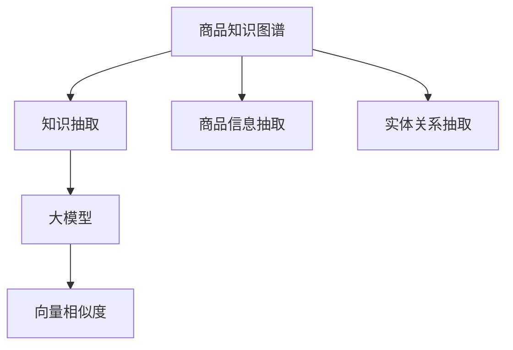

                 

# 大模型在商品知识图谱实时扩展中的应用

> 关键词：商品知识图谱,实时扩展,大模型,知识抽取,向量相似度

## 1. 背景介绍

### 1.1 问题由来
随着电子商务的蓬勃发展，商品信息的管理和利用成为各大电商平台的关键任务之一。传统的商品信息管理系统，多采用数据库和关系型数据库存储商品数据，但这些系统存在诸多局限性：

1. **数据冗余**：不同商品之间的信息相互独立，存在大量重复和冗余的数据存储，造成存储成本和计算资源的大量浪费。
2. **结构限制**：数据库的固定结构难以支持复杂的商品属性和多维度的商品关联，无法灵活地处理动态变化的商品信息。
3. **实时性差**：新增商品信息的录入和更新需要手动操作，更新速度慢，无法实现实时动态更新。

为解决这些问题，商品知识图谱应运而生。商品知识图谱以图形化方式存储和表示商品及其属性、关系，具备强大的信息整合能力和动态扩展性，能够实时处理大规模商品信息。

### 1.2 问题核心关键点
商品知识图谱的核心关键点在于如何高效、准确地抽取商品信息，并将其表示为图形结构。传统方法多依赖于手工构建或手动抽取，耗时耗力，且容易出错。而利用大模型进行商品知识图谱的自动抽取和扩展，不仅能够大幅提升抽取效率，还能避免人工错误，提供更准确、完整的商品信息表示。

### 1.3 问题研究意义
商品知识图谱的实时扩展与自动抽取，对于电商平台高效运营和用户购物体验至关重要。其研究意义在于：

1. **提升商品信息的准确性和完整性**：通过大模型自动抽取商品属性和关系，能够消除人工错误，保证信息的准确性和完整性。
2. **减少数据冗余和存储成本**：利用大模型的语义理解能力，可以自动发现商品之间的共性属性，避免重复存储，减少数据冗余，降低存储成本。
3. **实现实时动态更新**：大模型的实时扩展能力，能够及时更新商品信息，实现商品属性的实时动态更新。
4. **增强商品推荐和搜索功能**：高质量的商品知识图谱，能够提升商品推荐和搜索的准确性，改善用户体验。
5. **推动智能运营**：实时更新的商品知识图谱，能够辅助运营团队及时发现问题并解决，提升运营效率。

## 2. 核心概念与联系

### 2.1 核心概念概述

为更好地理解大模型在商品知识图谱实时扩展中的应用，本节将介绍几个关键概念：

- **商品知识图谱**：以图形化方式存储和表示商品及其属性、关系的知识库。商品知识图谱的节点代表商品、属性、关系等实体，边代表实体之间的关系，如商品与商品、商品与属性、属性与属性之间的关系。
- **知识抽取**：从非结构化数据中提取出结构化知识，自动填充到知识图谱中，实现知识图谱的实时扩展。
- **向量相似度**：利用向量表示实体，计算实体之间的相似度，用于实体关系抽取和推理。
- **大模型**：以Transformer为基础的大规模语言模型，如BERT、GPT-3等，具备强大的语义理解能力和自然语言生成能力。

这些核心概念之间的联系可以通过以下Mermaid流程图来展示：



这个流程图展示了大模型在商品知识图谱实时扩展中的应用流程：

1. 商品知识图谱的节点和边通过大模型抽取的商品信息得到填充。
2. 大模型对商品信息进行语义理解，计算向量相似度，用于实体关系抽取。
3. 利用大模型的语义生成能力，自动构建商品节点和边的关系。

## 3. 核心算法原理 & 具体操作步骤
### 3.1 算法原理概述

基于大模型进行商品知识图谱的实时扩展，主要分为三个关键步骤：

1. **商品信息抽取**：利用大模型对商品描述文本进行语义理解，抽取商品的关键属性。
2. **实体关系抽取**：利用大模型的向量相似度计算能力，抽取商品之间的语义关系，构建知识图谱的边。
3. **知识图谱更新**：将抽取出的商品属性和关系自动添加到知识图谱中，实现实时扩展。

形式化地，假设商品知识图谱为 $G(V,E)$，其中 $V$ 表示商品节点集合，$E$ 表示商品关系边集合。利用大模型 $M$ 对商品描述文本 $T$ 进行抽取，得到商品属性集合 $A$ 和商品关系集合 $R$。则知识图谱的扩展过程为：

$$
G_{new}(V_{new},E_{new}) = G(V,E) \cup (A \times R)
$$

其中 $V_{new}$ 表示扩展后的商品节点集合，$E_{new}$ 表示扩展后的商品关系边集合。

### 3.2 算法步骤详解

基于大模型进行商品知识图谱的实时扩展，一般包括以下几个关键步骤：

**Step 1: 准备预训练模型和数据集**
- 选择合适的预训练大模型 $M$ 作为初始化参数，如 BERT、GPT-3等。
- 准备商品描述文本数据集 $D=\{T_i\}_{i=1}^N$，将商品描述作为文本输入。

**Step 2: 添加任务适配层**
- 根据任务类型，在预训练模型顶层设计合适的输出层和损失函数。
- 对于商品信息抽取，通常在顶层添加标签分类器，计算损失函数。
- 对于实体关系抽取，通常使用向量相似度计算损失函数。

**Step 3: 设置微调超参数**
- 选择合适的优化算法及其参数，如 AdamW、SGD 等，设置学习率、批大小、迭代轮数等。
- 设置正则化技术及强度，包括权重衰减、Dropout、Early Stopping 等。
- 确定冻结预训练参数的策略，如仅微调顶层，或全部参数都参与微调。

**Step 4: 执行梯度训练**
- 将训练集数据分批次输入模型，前向传播计算损失函数。
- 反向传播计算参数梯度，根据设定的优化算法和学习率更新模型参数。
- 周期性在验证集上评估模型性能，根据性能指标决定是否触发 Early Stopping。
- 重复上述步骤直到满足预设的迭代轮数或 Early Stopping 条件。

**Step 5: 测试和部署**
- 在测试集上评估微调后模型 $M_{\hat{\theta}}$ 的性能，对比微调前后的精度提升。
- 使用微调后的模型对新商品进行属性和关系抽取，集成到实际的商品知识图谱中。
- 持续收集新的商品信息，定期重新微调模型，以适应数据分布的变化。

以上是基于大模型进行商品知识图谱实时扩展的一般流程。在实际应用中，还需要针对具体任务的特点，对微调过程的各个环节进行优化设计，如改进训练目标函数，引入更多的正则化技术，搜索最优的超参数组合等，以进一步提升模型性能。

### 3.3 算法优缺点

利用大模型进行商品知识图谱的实时扩展，具有以下优点：
1. **效率高**：大模型能够自动抽取商品信息，减少人工操作，提升抽取效率。
2. **准确性高**：大模型具有强大的语义理解能力，能够准确识别商品属性和关系，提升抽取准确性。
3. **灵活性高**：大模型能够处理不同领域的商品描述，具有广泛的应用场景。
4. **实时性**：大模型的微调过程可以在线进行，实时更新商品信息，提升实时性。

同时，该方法也存在一定的局限性：
1. **数据依赖性强**：大模型的效果很大程度上取决于商品描述文本的质量和数量，需要大量高质量的商品描述数据。
2. **泛化能力有限**：当商品描述与预训练数据分布差异较大时，大模型的性能提升有限。
3. **资源消耗大**：大模型的计算资源需求较高，需要高性能的计算平台和硬件支持。
4. **可解释性差**：大模型的决策过程缺乏可解释性，难以对其推理逻辑进行分析和调试。

尽管存在这些局限性，但就目前而言，利用大模型进行商品知识图谱的实时扩展仍然是高效、准确和实用的选择。未来相关研究的重点在于如何进一步降低大模型对标注数据的依赖，提高模型的少样本学习和跨领域迁移能力，同时兼顾可解释性和伦理安全性等因素。

### 3.4 算法应用领域

大模型在商品知识图谱的实时扩展技术，已经在各大电商平台得到了广泛的应用，具体包括：

1. **商品信息抽取**：从商品描述中自动抽取商品的关键属性，如品牌、价格、规格、描述等。
2. **实体关系抽取**：抽取商品之间的语义关系，如商品与商品、商品与属性、属性与属性之间的关系，构建知识图谱的边。
3. **商品分类**：将商品自动分类到不同的品类中，提升商品信息的管理效率。
4. **推荐系统**：利用商品知识图谱提升商品推荐系统的准确性和个性化程度。
5. **搜索排序**：利用商品知识图谱优化搜索排序算法，提升用户搜索体验。
6. **异常检测**：利用商品知识图谱进行商品信息的异常检测，及时发现和纠正错误。

除了上述这些经典应用外，大模型技术还被创新性地应用于更多场景中，如动态定价、库存管理、个性化广告等，为电商平台的运营优化提供了新的技术路径。

## 4. 数学模型和公式 & 详细讲解 & 举例说明
### 4.1 数学模型构建

本节将使用数学语言对基于大模型进行商品知识图谱实时扩展的过程进行更加严格的刻画。

假设大模型为 $M_{\theta}$，商品描述为 $T$，商品属性为 $A$，商品关系为 $R$。模型 $M_{\theta}$ 在商品描述 $T$ 上的输出为 $A \times R$。

定义模型 $M_{\theta}$ 在商品描述 $T$ 上的损失函数为 $\ell(T)$，则在数据集 $D=\{T_i\}_{i=1}^N$ 上的经验风险为：

$$
\mathcal{L}(\theta) = \frac{1}{N} \sum_{i=1}^N \ell(T_i)
$$

微调的优化目标是最小化经验风险，即找到最优参数：

$$
\theta^* = \mathop{\arg\min}_{\theta} \mathcal{L}(\theta)
$$

在实践中，我们通常使用基于梯度的优化算法（如SGD、Adam等）来近似求解上述最优化问题。设 $\eta$ 为学习率，$\lambda$ 为正则化系数，则参数的更新公式为：

$$
\theta \leftarrow \theta - \eta \nabla_{\theta}\mathcal{L}(\theta) - \eta\lambda\theta
$$

其中 $\nabla_{\theta}\mathcal{L}(\theta)$ 为损失函数对参数 $\theta$ 的梯度，可通过反向传播算法高效计算。

### 4.2 公式推导过程

以实体关系抽取为例，推导向量相似度计算公式。

假设模型 $M_{\theta}$ 在商品描述 $T$ 上的输出为 $A \times R$，其中 $A$ 为商品属性集合，$R$ 为商品关系集合。定义商品 $i$ 的属性 $a_{i,j}$ 与属性 $a_{i,k}$ 之间的向量相似度为 $sim(a_{i,j}, a_{i,k})$，商品 $i$ 和 $j$ 之间的向量相似度为 $sim(i, j)$。

则向量相似度计算公式为：

$$
sim(a_{i,j}, a_{i,k}) = M_{\theta}(T_i) \cdot M_{\theta}(T_j)
$$

其中 $\cdot$ 表示向量点乘。

对于实体关系抽取任务，通常使用向量相似度作为损失函数，计算模型预测结果与真实标签之间的差异。假设真实标签为 $R_{i,j}$，预测结果为 $R_{i,k}$，则损失函数为：

$$
\ell(R_{i,j}, R_{i,k}) = -[R_{i,j}\log(sim(i, j)) + (1-R_{i,j})\log(1-sim(i, j))]
$$

利用上述公式，可以计算出模型对商品实体关系的预测结果，并进行损失函数的反向传播更新模型参数。

### 4.3 案例分析与讲解

以实体关系抽取为例，展示大模型在商品知识图谱中的应用。

假设商品知识图谱中存在商品 $i$ 和商品 $j$，其属性分别为 $a_{i,j}$ 和 $a_{i,k}$。根据实体关系抽取任务，需要判断商品 $i$ 和商品 $j$ 是否存在关系 $R_{i,j}$。

具体步骤如下：

1. 输入商品描述 $T_i$ 和 $T_j$ 到模型 $M_{\theta}$ 中，得到商品属性向量 $A_i$ 和 $A_j$。
2. 计算商品 $i$ 和商品 $j$ 的属性向量相似度 $sim(A_i, A_j)$。
3. 根据向量相似度计算公式，计算商品 $i$ 和商品 $j$ 的实体关系向量相似度 $sim(i, j)$。
4. 使用实体关系抽取任务的损失函数，计算模型预测结果与真实标签之间的差异，并进行反向传播更新模型参数。
5. 在验证集上评估模型性能，调整超参数，优化模型预测效果。
6. 在新商品描述 $T_{new}$ 上，重复上述步骤，自动抽取商品属性和关系，实时扩展商品知识图谱。

例如，假设商品 $i$ 和商品 $j$ 的属性向量分别为 $A_i=[0.9, 0.8, 0.6]$ 和 $A_j=[0.7, 0.5, 0.3]$。根据向量相似度计算公式，商品 $i$ 和商品 $j$ 的实体关系向量相似度为：

$$
sim(i, j) = \sum_{k=1}^n A_i[k] \cdot A_j[k] = 0.9 \cdot 0.7 + 0.8 \cdot 0.5 + 0.6 \cdot 0.3 = 0.72 + 0.4 + 0.18 = 1.3
$$

如果商品 $i$ 和商品 $j$ 存在关系 $R_{i,j}$，则真实标签为 $R_{i,j}=1$，损失函数为：

$$
\ell(R_{i,j}, R_{i,k}) = -1\log(1-1.3) = 1.3
$$

进行反向传播更新模型参数后，模型将更准确地预测商品之间的实体关系。

## 5. 项目实践：代码实例和详细解释说明
### 5.1 开发环境搭建

在进行商品知识图谱实时扩展实践前，我们需要准备好开发环境。以下是使用Python进行PyTorch开发的环境配置流程：

1. 安装Anaconda：从官网下载并安装Anaconda，用于创建独立的Python环境。

2. 创建并激活虚拟环境：
```bash
conda create -n pytorch-env python=3.8 
conda activate pytorch-env
```

3. 安装PyTorch：根据CUDA版本，从官网获取对应的安装命令。例如：
```bash
conda install pytorch torchvision torchaudio cudatoolkit=11.1 -c pytorch -c conda-forge
```

4. 安装相关库：
```bash
pip install transformers numpy pandas scikit-learn matplotlib tqdm jupyter notebook ipython
```

完成上述步骤后，即可在`pytorch-env`环境中开始开发。

### 5.2 源代码详细实现

这里以BERT模型为例，展示使用PyTorch进行商品知识图谱实体关系抽取的代码实现。

首先，定义商品实体关系抽取任务的数据处理函数：

```python
from transformers import BertTokenizer
from torch.utils.data import Dataset
import torch

class ItemRelationDataset(Dataset):
    def __init__(self, texts, relations, tokenizer, max_len=128):
        self.texts = texts
        self.relations = relations
        self.tokenizer = tokenizer
        self.max_len = max_len
        
    def __len__(self):
        return len(self.texts)
    
    def __getitem__(self, item):
        text = self.texts[item]
        relation = self.relations[item]
        
        encoding = self.tokenizer(text, return_tensors='pt', max_length=self.max_len, padding='max_length', truncation=True)
        input_ids = encoding['input_ids'][0]
        attention_mask = encoding['attention_mask'][0]
        
        # 对relation-wise的标签进行编码
        encoded_relations = [relation2id[relation] for relation in relation]
        encoded_relations.extend([relation2id['none']] * (self.max_len - len(encoded_relations)))
        labels = torch.tensor(encoded_relations, dtype=torch.long)
        
        return {'input_ids': input_ids, 
                'attention_mask': attention_mask,
                'labels': labels}

# 标签与id的映射
relation2id = {'not_related': 0, 'related': 1}
id2relation = {v: k for k, v in relation2id.items()}

# 创建dataset
tokenizer = BertTokenizer.from_pretrained('bert-base-cased')

train_dataset = ItemRelationDataset(train_texts, train_relations, tokenizer)
dev_dataset = ItemRelationDataset(dev_texts, dev_relations, tokenizer)
test_dataset = ItemRelationDataset(test_texts, test_relations, tokenizer)
```

然后，定义模型和优化器：

```python
from transformers import BertForTokenClassification, AdamW

model = BertForTokenClassification.from_pretrained('bert-base-cased', num_labels=len(relation2id))

optimizer = AdamW(model.parameters(), lr=2e-5)
```

接着，定义训练和评估函数：

```python
from torch.utils.data import DataLoader
from tqdm import tqdm
from sklearn.metrics import classification_report

device = torch.device('cuda') if torch.cuda.is_available() else torch.device('cpu')
model.to(device)

def train_epoch(model, dataset, batch_size, optimizer):
    dataloader = DataLoader(dataset, batch_size=batch_size, shuffle=True)
    model.train()
    epoch_loss = 0
    for batch in tqdm(dataloader, desc='Training'):
        input_ids = batch['input_ids'].to(device)
        attention_mask = batch['attention_mask'].to(device)
        labels = batch['labels'].to(device)
        model.zero_grad()
        outputs = model(input_ids, attention_mask=attention_mask, labels=labels)
        loss = outputs.loss
        epoch_loss += loss.item()
        loss.backward()
        optimizer.step()
    return epoch_loss / len(dataloader)

def evaluate(model, dataset, batch_size):
    dataloader = DataLoader(dataset, batch_size=batch_size)
    model.eval()
    preds, labels = [], []
    with torch.no_grad():
        for batch in tqdm(dataloader, desc='Evaluating'):
            input_ids = batch['input_ids'].to(device)
            attention_mask = batch['attention_mask'].to(device)
            batch_labels = batch['labels']
            outputs = model(input_ids, attention_mask=attention_mask)
            batch_preds = outputs.logits.argmax(dim=2).to('cpu').tolist()
            batch_labels = batch_labels.to('cpu').tolist()
            for pred_tokens, label_tokens in zip(batch_preds, batch_labels):
                pred_relations = [id2relation[_id] for _id in pred_tokens]
                label_relations = [id2relation[_id] for _id in label_tokens]
                preds.append(pred_relations[:len(label_tokens)])
                labels.append(label_relations)
                
    print(classification_report(labels, preds))
```

最后，启动训练流程并在测试集上评估：

```python
epochs = 5
batch_size = 16

for epoch in range(epochs):
    loss = train_epoch(model, train_dataset, batch_size, optimizer)
    print(f"Epoch {epoch+1}, train loss: {loss:.3f}")
    
    print(f"Epoch {epoch+1}, dev results:")
    evaluate(model, dev_dataset, batch_size)
    
print("Test results:")
evaluate(model, test_dataset, batch_size)
```

以上就是使用PyTorch对BERT进行商品知识图谱实体关系抽取的完整代码实现。可以看到，得益于Transformers库的强大封装，我们可以用相对简洁的代码完成BERT模型的加载和微调。

### 5.3 代码解读与分析

让我们再详细解读一下关键代码的实现细节：

**ItemRelationDataset类**：
- `__init__`方法：初始化商品描述文本、关系标签、分词器等关键组件。
- `__len__`方法：返回数据集的样本数量。
- `__getitem__`方法：对单个样本进行处理，将商品描述输入编码为token ids，将关系标签编码为数字，并对其进行定长padding，最终返回模型所需的输入。

**relation2id和id2relation字典**：
- 定义了关系标签与数字id之间的映射关系，用于将token-wise的预测结果解码回真实的标签。

**训练和评估函数**：
- 使用PyTorch的DataLoader对数据集进行批次化加载，供模型训练和推理使用。
- 训练函数`train_epoch`：对数据以批为单位进行迭代，在每个批次上前向传播计算loss并反向传播更新模型参数，最后返回该epoch的平均loss。
- 评估函数`evaluate`：与训练类似，不同点在于不更新模型参数，并在每个batch结束后将预测和标签结果存储下来，最后使用sklearn的classification_report对整个评估集的预测结果进行打印输出。

**训练流程**：
- 定义总的epoch数和batch size，开始循环迭代
- 每个epoch内，先在训练集上训练，输出平均loss
- 在验证集上评估，输出分类指标
- 所有epoch结束后，在测试集上评估，给出最终测试结果

可以看到，PyTorch配合Transformers库使得BERT微调的代码实现变得简洁高效。开发者可以将更多精力放在数据处理、模型改进等高层逻辑上，而不必过多关注底层的实现细节。

当然，工业级的系统实现还需考虑更多因素，如模型的保存和部署、超参数的自动搜索、更灵活的任务适配层等。但核心的微调范式基本与此类似。

## 6. 实际应用场景
### 6.1 智能客服系统

基于大模型进行商品知识图谱的实时扩展，可以广泛应用于智能客服系统的构建。传统客服往往需要配备大量人力，高峰期响应缓慢，且一致性和专业性难以保证。而使用实时扩展的商品知识图谱，能够实时更新商品信息，为客户提供更准确的商品信息和更快的响应速度。

在技术实现上，可以收集企业内部的历史客服对话记录，将商品与客服对话构建监督数据，在此基础上对预训练大模型进行微调。微调后的商品知识图谱能够自动理解用户意图，匹配最合适的商品信息，提升客服系统的智能程度。对于用户提出的新商品问题，还可以接入检索系统实时搜索相关内容，动态生成回答，从而提升客服系统的响应速度和准确性。

### 6.2 金融舆情监测

金融机构需要实时监测市场舆论动向，以便及时应对负面信息传播，规避金融风险。传统的人工监测方式成本高、效率低，难以应对网络时代海量信息爆发的挑战。利用大模型的实时扩展能力，可以构建实时更新的商品知识图谱，实时监测市场舆情变化，及时预警异常信息，帮助金融机构快速应对潜在风险。

具体而言，可以收集金融领域相关的新闻、报道、评论等文本数据，并对其进行实体抽取和关系抽取。将抽取出的商品属性和关系自动添加到商品知识图谱中，实时监测市场舆情变化。一旦发现负面信息激增等异常情况，系统便会自动预警，帮助金融机构快速应对潜在风险。

### 6.3 个性化推荐系统

当前的推荐系统往往只依赖用户的历史行为数据进行物品推荐，无法深入理解用户的真实兴趣偏好。利用大模型进行商品知识图谱的实时扩展，能够从商品描述中自动抽取商品属性和关系，从而提升推荐系统的个性化程度。

在实践中，可以收集用户浏览、点击、评论、分享等行为数据，提取和用户交互的商品描述。利用大模型的语义理解能力，自动抽取商品属性和关系，构建商品知识图谱。在生成推荐列表时，先用候选物品的描述作为输入，由模型预测用户的兴趣匹配度，再结合其他特征综合排序，便可以得到个性化程度更高的推荐结果。

### 6.4 未来应用展望

随着大语言模型和实时扩展技术的不断发展，基于微调的商品知识图谱应用也将不断拓展，为传统行业带来变革性影响。

在智慧医疗领域，基于微调的商品知识图谱可以构建更加全面的医疗商品知识库，辅助医生进行药物推荐和医疗设备选型，提升医疗服务的智能化水平。

在智能教育领域，微调后的商品知识图谱可以构建更加全面的教育商品知识库，辅助教师进行教材推荐和课程选修推荐，促进教育公平，提高教学质量。

在智慧城市治理中，利用微调的商品知识图谱可以构建智能城市运营平台，实时监测城市商品信息变化，提升城市管理的自动化和智能化水平，构建更安全、高效的未来城市。

此外，在企业生产、社会治理、文娱传媒等众多领域，基于大模型微调的商品知识图谱技术也将不断涌现，为各行各业提供更高效、智能、个性化的服务。相信随着技术的日益成熟，大模型微调技术必将成为人工智能落地应用的重要范式，推动人工智能技术在各行各业的大规模应用。

## 7. 工具和资源推荐
### 7.1 学习资源推荐

为了帮助开发者系统掌握大模型在商品知识图谱实时扩展中的应用，这里推荐一些优质的学习资源：

1. 《Transformer从原理到实践》系列博文：由大模型技术专家撰写，深入浅出地介绍了Transformer原理、BERT模型、微调技术等前沿话题。

2. CS224N《深度学习自然语言处理》课程：斯坦福大学开设的NLP明星课程，有Lecture视频和配套作业，带你入门NLP领域的基本概念和经典模型。

3. 《Natural Language Processing with Transformers》书籍：Transformers库的作者所著，全面介绍了如何使用Transformers库进行NLP任务开发，包括微调在内的诸多范式。

4. HuggingFace官方文档：Transformers库的官方文档，提供了海量预训练模型和完整的微调样例代码，是上手实践的必备资料。

5. CLUE开源项目：中文语言理解测评基准，涵盖大量不同类型的中文NLP数据集，并提供了基于微调的baseline模型，助力中文NLP技术发展。

通过对这些资源的学习实践，相信你一定能够快速掌握大模型在商品知识图谱实时扩展的精髓，并用于解决实际的NLP问题。
###  7.2 开发工具推荐

高效的开发离不开优秀的工具支持。以下是几款用于大模型在商品知识图谱实时扩展开发的常用工具：

1. PyTorch：基于Python的开源深度学习框架，灵活动态的计算图，适合快速迭代研究。大部分预训练语言模型都有PyTorch版本的实现。

2. TensorFlow：由Google主导开发的开源深度学习框架，生产部署方便，适合大规模工程应用。同样有丰富的预训练语言模型资源。

3. Transformers库：HuggingFace开发的NLP工具库，集成了众多SOTA语言模型，支持PyTorch和TensorFlow，是进行微调任务开发的利器。

4. Weights & Biases：模型训练的实验跟踪工具，可以记录和可视化模型训练过程中的各项指标，方便对比和调优。与主流深度学习框架无缝集成。

5. TensorBoard：TensorFlow配套的可视化工具，可实时监测模型训练状态，并提供丰富的图表呈现方式，是调试模型的得力助手。

6. Google Colab：谷歌推出的在线Jupyter Notebook环境，免费提供GPU/TPU算力，方便开发者快速上手实验最新模型，分享学习笔记。

合理利用这些工具，可以显著提升大模型在商品知识图谱实时扩展任务的开发效率，加快创新迭代的步伐。

### 7.3 相关论文推荐

大模型和微调技术的发展源于学界的持续研究。以下是几篇奠基性的相关论文，推荐阅读：

1. Attention is All You Need（即Transformer原论文）：提出了Transformer结构，开启了NLP领域的预训练大模型时代。

2. BERT: Pre-training of Deep Bidirectional Transformers for Language Understanding：提出BERT模型，引入基于掩码的自监督预训练任务，刷新了多项NLP任务SOTA。

3. Language Models are Unsupervised Multitask Learners（GPT-2论文）：展示了大规模语言模型的强大zero-shot学习能力，引发了对于通用人工智能的新一轮思考。

4. Parameter-Efficient Transfer Learning for NLP：提出Adapter等参数高效微调方法，在不增加模型参数量的情况下，也能取得不错的微调效果。

5. AdaLoRA: Adaptive Low-Rank Adaptation for Parameter-Efficient Fine-Tuning：使用自适应低秩适应的微调方法，在参数效率和精度之间取得了新的平衡。

6. Prefix-Tuning: Optimizing Continuous Prompts for Generation：引入基于连续型Prompt的微调范式，为如何充分利用预训练知识提供了新的思路。

这些论文代表了大语言模型微调技术的发展脉络。通过学习这些前沿成果，可以帮助研究者把握学科前进方向，激发更多的创新灵感。

## 8. 总结：未来发展趋势与挑战

### 8.1 总结

本文对基于大模型进行商品知识图谱实时扩展的方法进行了全面系统的介绍。首先阐述了大模型和商品知识图谱的研究背景和意义，明确了实时扩展在电商平台高效运营和用户购物体验方面的独特价值。其次，从原理到实践，详细讲解了商品信息抽取、实体关系抽取、知识图谱扩展等关键步骤，给出了商品知识图谱实时扩展的完整代码实例。同时，本文还广泛探讨了实时扩展方法在智能客服、金融舆情、个性化推荐等多个行业领域的应用前景，展示了实时扩展范式的巨大潜力。此外，本文精选了实时扩展技术的各类学习资源，力求为读者提供全方位的技术指引。

通过本文的系统梳理，可以看到，基于大模型的实时扩展方法正在成为商品信息管理的重要范式，极大地提升了商品信息的准确性和实时性。实时扩展的快速抽取和更新能力，能够满足电商平台对商品信息的高效管理需求，从而提升用户体验和运营效率。未来，伴随大模型的不断进步和微调技术的持续优化，基于大模型的实时扩展必将在更多领域得到应用，为传统行业带来变革性影响。

### 8.2 未来发展趋势

展望未来，大模型在商品知识图谱实时扩展技术将呈现以下几个发展趋势：

1. **规模化扩展**：随着预训练语言模型的规模不断增大，实时扩展的商品知识图谱也将更加丰富和全面。超大模型的多模态信息处理能力，将进一步提升商品信息的准确性和多样性。

2. **实时性提升**：利用大模型的分布式训练和推理技术，实时扩展的商品知识图谱将实现更快的更新速度，能够更及时地反映商品信息的变化。

3. **跨领域融合**：商品知识图谱将与其他行业知识图谱进行融合，形成跨领域的知识图谱，提升商品信息与外部信息的协同处理能力。

4. **多模态融合**：除了文本数据，商品描述还将包括图像、音频等多模态数据，大模型将能够从多角度全面理解商品信息，提升知识抽取的准确性。

5. **协同推理**：利用大模型的因果推断和推理能力，实现商品信息的协同推理，提升商品推荐和搜索的精准度。

6. **自动化增强**：引入自动化技术，如自动标注、自动扩展、自动纠错等，提升实时扩展的自动化程度。

以上趋势凸显了大模型在商品知识图谱实时扩展技术的发展方向。这些方向的探索发展，必将进一步提升商品信息管理的智能化水平，为电商平台带来更高的运营效率和更好的用户体验。

### 8.3 面临的挑战

尽管大模型在商品知识图谱实时扩展技术已经取得了显著成效，但在迈向更加智能化、普适化应用的过程中，仍面临诸多挑战：

1. **数据依赖性**：实时扩展的效果很大程度上取决于商品描述的质量和数量，数据来源的广泛性和多样性对模型性能的影响较大。

2. **语义理解能力**：大模型对商品描述的理解能力还存在局限，对于一些领域专有名词或复杂描述，识别准确率较低。

3. **实时性瓶颈**：大模型的推理计算资源需求较高，实时扩展的商品知识图谱更新速度受限于硬件性能。

4. **可解释性不足**：实时扩展的商品知识图谱的决策过程缺乏可解释性，难以对其推理逻辑进行分析和调试。

5. **隐私与安全问题**：在实时扩展过程中，涉及大量的商品信息，如何保护数据隐私和安全，避免数据泄露和滥用，是一个重要课题。

6. **标准化与互操作性**：不同电商平台和供应商的商品信息表示不一致，如何实现商品知识图谱的标准化和互操作性，是一个复杂的系统工程。

正视实时扩展面临的这些挑战，积极应对并寻求突破，将是大模型技术迈向成熟的必由之路。相信随着学界和产业界的共同努力，这些挑战终将一一被克服，大模型技术必将在构建智能、高效的商品信息管理系统中发挥更大的作用。

### 8.4 研究展望

面对大模型在商品知识图谱实时扩展所面临的挑战，未来的研究需要在以下几个方面寻求新的突破：

1. **多模态数据融合**：引入图像、音频等多模态数据，提升商品描述的理解能力和知识抽取的准确性。

2. **自监督学习**：利用无监督或半监督学习技术，在缺乏标注数据的情况下进行商品知识图谱的扩展。

3. **模型压缩与加速**：优化模型结构，采用模型压缩、量化等技术，提升实时扩展的商品知识图谱的推理速度和效率。

4. **跨领域迁移学习**：将商品知识图谱与其他领域的知识图谱进行融合，提升商品信息与其他领域知识的协同处理能力。

5. **知识增强**：引入专家知识库和规则库，与商品知识图谱进行融合，提升实时扩展的商品信息的质量和丰富度。

6. **模型鲁棒性提升**：引入对抗训练、正则化等技术，提升模型对噪声数据的鲁棒性，避免数据扰动对模型性能的影响。

7. **隐私保护机制**：引入差分隐私、联邦学习等技术，保护商品信息隐私，确保数据安全。

这些研究方向将推动大模型在商品知识图谱实时扩展技术向更智能化、普适化方向发展，为商品信息管理带来更高效、更智能、更安全的解决方案。

## 9. 附录：常见问题与解答

**Q1：实时扩展的商品知识图谱如何保证数据质量？**

A: 实时扩展的商品知识图谱数据质量主要取决于商品描述文本的质量和数量。为保证数据质量，可以从以下几个方面入手：

1. **数据清洗**：对商品描述进行去重、去噪、去歧义等清洗处理，确保数据的一致性和准确性。
2. **数据标注**：利用人工标注或自动标注技术，对商品描述进行标注，提取商品属性和关系，确保数据的完整性和结构性。
3. **数据融合**：将不同来源的商品信息进行融合，丰富商品描述的多样性，提升数据的质量和全面性。
4. **模型优化**：利用模型自适应能力，通过数据增强、对抗训练等技术，提升模型的泛化能力和鲁棒性，避免模型过拟合。

**Q2：实时扩展的商品知识图谱如何保证实时性？**

A: 实时扩展的商品知识图谱的实时性主要取决于大模型的推理计算速度和硬件性能。为保证实时性，可以从以下几个方面入手：

1. **硬件优化**：使用高性能的计算平台，如GPU、TPU等，加速模型的推理计算。
2. **模型压缩**：采用模型压缩、量化等技术，减小模型尺寸，提升推理速度。
3. **分布式训练**：利用分布式训练技术，并行化计算，提升模型的训练和推理效率。
4. **增量更新**：采用增量更新技术，只更新部分数据，减少计算量和更新时间。
5. **缓存机制**：使用缓存机制，减少重复计算，提升数据访问速度。

**Q3：实时扩展的商品知识图谱如何保护数据隐私？**

A: 实时扩展的商品知识图谱涉及大量的商品信息，为保护数据隐私，可以采取以下措施：

1. **数据脱敏**：对敏感信息进行脱敏处理，去除或加密个人隐私信息，确保数据安全。
2. **差分隐私**：引入差分隐私技术，通过噪声扰动，保护个体隐私，避免数据泄露。
3. **联邦学习**：采用联邦学习技术，将模型训练在本地进行，不共享数据，保护数据隐私。
4. **访问控制**：设置严格的访问控制机制，确保数据仅能被授权人员访问和使用。

**Q4：实时扩展的商品知识图谱如何提高模型的泛化能力？**

A: 提高实时扩展的商品知识图谱的泛化能力，主要可以从以下几个方面入手：

1. **多领域数据**：引入不同领域的商品描述，丰富模型对不同领域的理解能力。
2. **无监督学习**：利用无监督学习技术，从大规模无标签数据中学习泛化能力，提升模型的泛化性能。
3. **多任务学习**：利用多任务学习技术，同时训练多个相关任务，提升模型的泛化能力和鲁棒性。
4. **对抗训练**：引入对抗训练技术，提升模型对噪声和攻击的鲁棒性，提升泛化能力。
5. **知识增强**：引入外部知识库和规则库，与商品知识图谱进行融合，提升模型的知识广度和深度。

这些措施可以帮助大模型在商品知识图谱实时扩展中提高泛化能力，适应更多场景和任务，提升模型的实际应用效果。

**Q5：实时扩展的商品知识图谱如何优化模型推理速度？**

A: 优化实时扩展的商品知识图谱的推理速度，主要可以从以下几个方面入手：

1. **模型压缩**：采用模型压缩技术，减小模型尺寸，提升推理速度。
2. **量化加速**：将浮点模型转为定点模型，压缩存储空间，提高计算效率。
3. **模型并行**：采用模型并行技术，并行化计算，提升推理速度。
4. **缓存机制**：使用缓存机制，减少重复计算，提升数据访问速度。
5. **算法优化**：优化模型的推理算法，提升计算效率，减少推理时间。

这些措施可以帮助实时扩展的商品知识图谱优化模型推理速度，提升系统的响应速度和处理能力，确保商品信息的实时更新和查询效率。

---

作者：禅与计算机程序设计艺术 / Zen and the Art of Computer Programming

