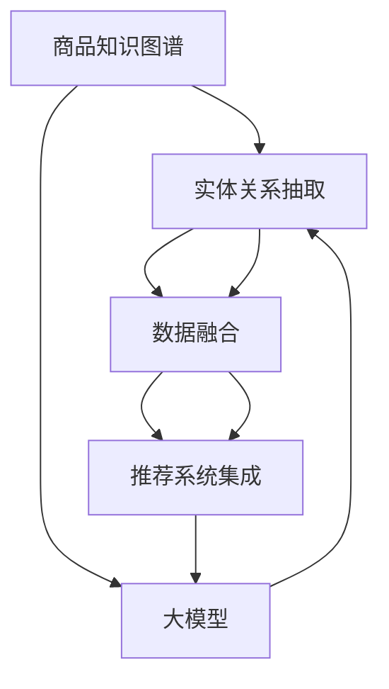

                 

# 大模型在商品知识图谱自动更新中的应用

> 关键词：商品知识图谱,大模型,图神经网络(GNN),自动更新,实体关系抽取,数据融合,推荐系统

## 1. 背景介绍

### 1.1 问题由来

在电商、零售等领域，商品知识图谱（KG）扮演着至关重要的角色。它包含了商品之间的关联信息，如商品分类、属性、品牌、用户评价等，为推荐系统、搜索引擎、广告投放等业务提供重要支撑。然而，随着市场环境的快速变化，商品和其属性、关系等信息也在不断更新，而传统人工维护的方式往往难以满足快速、准确的更新需求。

针对这一问题，学术界和工业界开始探索利用大模型（Large Models）进行自动化的商品知识图谱更新。大模型能够从海量的文本数据中自动学习商品的关联信息，并且具备较强的泛化能力和适应性。本博客将详细介绍基于大模型的商品知识图谱自动更新方法，包括核心算法原理、操作步骤、实际应用案例等，希望能为相关领域的研究人员提供参考。

### 1.2 问题核心关键点

大模型在商品知识图谱自动更新中的核心关键点在于：

1. **实体关系抽取**：自动从文本数据中抽取出商品实体及其之间的关系，构成知识图谱的基本单元。
2. **数据融合**：将不同来源的实体和关系数据进行融合，提升知识图谱的完整性和准确性。
3. **推荐系统集成**：将更新后的知识图谱应用到推荐系统，提升个性化推荐的精准度。
4. **模型训练和推理优化**：通过高效的训练和推理算法，保证模型的高性能和可解释性。

这些关键点共同构成了一个完整的商品知识图谱自动更新系统。下面将逐一介绍这些核心概念及其在大模型中的应用。

## 2. 核心概念与联系

### 2.1 核心概念概述

为更好地理解基于大模型的商品知识图谱自动更新方法，本节将介绍几个密切相关的核心概念：

- **商品知识图谱（KG）**：由商品实体和关系构成的图结构数据，用于表示商品之间的语义关联。
- **大模型**：如BERT、GPT、RoBERTa等大规模预训练语言模型，能够自动学习自然语言中的知识表示。
- **图神经网络（GNN）**：一种专门用于处理图结构数据的深度学习模型，能够有效捕捉节点和边之间的复杂关系。
- **自动更新**：通过大模型和GNN自动从文本数据中抽取出商品实体和关系，更新知识图谱。
- **实体关系抽取**：从自然语言文本中自动识别实体和它们之间的关系，如商品名称、类别、价格等。
- **数据融合**：将不同来源的数据进行整合，提升知识图谱的准确性和完整性。
- **推荐系统集成**：将更新后的知识图谱应用到推荐系统，提升推荐效果。

这些概念之间的逻辑关系可以通过以下Mermaid流程图来展示：



这个流程图展示了大模型、实体关系抽取、数据融合和推荐系统集成的流程，它们共同构成了一个基于大模型的商品知识图谱自动更新系统。

## 3. 核心算法原理 & 具体操作步骤
### 3.1 算法原理概述

基于大模型的商品知识图谱自动更新方法，本质上是将大模型应用于商品实体关系抽取和数据融合的过程。其核心思想是：

1. **实体关系抽取**：利用大模型，从文本数据中自动学习商品实体及其关系。
2. **数据融合**：将不同来源的实体和关系数据进行融合，提升知识图谱的完整性和准确性。
3. **推荐系统集成**：将更新后的知识图谱应用到推荐系统，提升推荐效果。

具体步骤如下：

1. 收集商品相关的文本数据，如产品描述、用户评论、商品描述等。
2. 利用大模型，从文本数据中自动学习商品实体及其关系，构建初始知识图谱。
3. 对初始知识图谱进行数据融合，包括去除重复数据、填补缺失信息等。
4. 将融合后的知识图谱应用到推荐系统中，提升推荐效果。
5. 定期重新训练大模型，更新知识图谱。

### 3.2 算法步骤详解

基于大模型的商品知识图谱自动更新方法可以分为以下几个关键步骤：

**Step 1: 数据收集**

收集商品相关的文本数据，如产品描述、用户评论、商品描述等。这些数据可以来自多个来源，如电商平台、社交媒体、用户评论等。

**Step 2: 实体关系抽取**

利用大模型，从文本数据中自动学习商品实体及其关系。具体步骤如下：

1. 数据预处理：将文本数据进行分词、去停用词、词性标注等预处理步骤。
2. 实体抽取：使用大模型（如BERT、GPT等），从文本中抽取商品实体，如商品名称、类别、品牌等。
3. 关系抽取：使用大模型，抽取商品之间的关系，如类别-类别关系、品牌-类别关系等。
4. 关系构建：将抽取的实体和关系构建为知识图谱的基本单元，如（商品名称，类别）、（品牌，商品名称）等。

**Step 3: 数据融合**

对初始知识图谱进行数据融合，包括去除重复数据、填补缺失信息等。具体步骤如下：

1. 去重：对重复的实体和关系进行去重处理，保证知识图谱的唯一性。
2. 填补：对缺失的实体和关系进行填补，保证知识图谱的完整性。
3. 整合：将不同来源的数据进行整合，形成统一的图谱结构。

**Step 4: 推荐系统集成**

将融合后的知识图谱应用到推荐系统中，提升推荐效果。具体步骤如下：

1. 推荐模型训练：使用融合后的知识图谱，训练推荐模型，如基于图的神经网络模型。
2. 推荐效果评估：对推荐模型进行评估，如精确率、召回率等。
3. 推荐应用：将训练好的推荐模型应用到实际的推荐系统中，提升推荐效果。

**Step 5: 模型更新**

定期重新训练大模型，更新知识图谱。具体步骤如下：

1. 数据收集：定期收集新的文本数据。
2. 实体关系抽取：使用更新后的大模型，从新数据中抽取实体和关系。
3. 数据融合：对新的实体和关系进行融合，更新知识图谱。
4. 推荐系统集成：将更新后的知识图谱应用到推荐系统中，提升推荐效果。

### 3.3 算法优缺点

基于大模型的商品知识图谱自动更新方法具有以下优点：

1. **自动化高**：利用大模型和GNN，自动从文本数据中抽取实体和关系，降低了人工维护的复杂度和成本。
2. **准确度高**：大模型具备较强的泛化能力和适应性，能够从海量的文本数据中学习到更准确的商品关系。
3. **灵活度高**：能够根据市场环境的快速变化，灵活更新知识图谱，适应性更强。
4. **推荐效果好**：将更新后的知识图谱应用到推荐系统中，提升推荐效果，提升用户体验。

同时，该方法也存在一些缺点：

1. **资源需求高**：大模型和GNN需要大量的计算资源和存储空间。
2. **训练时间长**：大规模的知识图谱更新需要较长时间的训练过程。
3. **数据质量要求高**：输入的文本数据质量对模型效果有很大影响，需要保证数据的完整性和准确性。
4. **推理速度慢**：GNN推理过程较慢，可能影响实时推荐的效果。

尽管存在这些缺点，但就目前而言，基于大模型的商品知识图谱自动更新方法仍是一种高效、准确、灵活的解决方案。未来相关研究的重点在于如何进一步优化模型性能，降低资源消耗，提高训练和推理效率。

### 3.4 算法应用领域

基于大模型的商品知识图谱自动更新方法已经在电商、零售、金融等多个领域得到了广泛应用，例如：

- **电商推荐系统**：利用自动更新的知识图谱，提升个性化推荐效果，提升用户体验。
- **智能搜索**：将更新后的知识图谱应用到搜索引擎中，提升搜索结果的准确性和相关性。
- **广告投放**：利用商品知识图谱中的关系信息，优化广告投放策略，提升广告效果。
- **金融风控**：利用商品关系信息，构建风险评估模型，提升风险管理能力。

除了上述这些应用场景外，大模型的知识图谱自动更新技术还在更多领域得到应用，如社交网络分析、舆情监测、医疗健康等，为相关行业带来了显著的技术突破。

## 4. 数学模型和公式 & 详细讲解
### 4.1 数学模型构建

本节将使用数学语言对基于大模型的商品知识图谱自动更新过程进行更加严格的刻画。

记商品实体集合为 $\mathcal{E}$，商品关系集合为 $\mathcal{R}$，知识图谱的节点表示为 $V$，边表示为 $E$。假设大模型为 $M$，文本数据为 $D$。

定义商品实体 $e \in \mathcal{E}$ 在文本 $d \in D$ 中的抽取概率为 $P_{e|d}$，关系 $r \in \mathcal{R}$ 在文本 $d$ 中的抽取概率为 $P_{r|d}$。知识图谱的节点嵌入表示为 $h_e$，关系嵌入表示为 $h_r$。

定义知识图谱的训练目标为：

$$
\mathcal{L} = \sum_{d \in D} \log P_{\text{graph}}(D|d)
$$

其中 $P_{\text{graph}}(D|d)$ 表示基于大模型抽取关系 $r$ 后的知识图谱生成的概率。

### 4.2 公式推导过程

以下我们以商品类别关系抽取为例，推导基于大模型的实体关系抽取公式。

假设模型在文本 $d$ 中抽取商品类别 $C$ 和 $C'$ 之间关系的概率为 $P_{C, C'}$。根据softmax函数的定义，$P_{C, C'}$ 可以表示为：

$$
P_{C, C'} = \frac{\exp(\log P_{C|d} + \log P_{C'|d} + \log P_{C, C'})}{\sum_{\text{all} C, C'} \exp(\log P_{C|d} + \log P_{C'|d} + \log P_{C, C'})}
$$

其中 $\log P_{C|d}$ 和 $\log P_{C'|d}$ 分别为商品类别 $C$ 和 $C'$ 在文本 $d$ 中的抽取概率。

$P_{C, C'}$ 表示商品类别 $C$ 和 $C'$ 之间关系的概率。

根据大模型的语义表示能力，$P_{C, C'}$ 可以通过大模型的输出概率计算得到。假设大模型 $M$ 在文本 $d$ 中抽取商品类别 $C$ 和 $C'$ 的概率分别为 $P_{C|d}$ 和 $P_{C'|d}$。则 $P_{C, C'}$ 可以表示为：

$$
P_{C, C'} = \frac{M(d)}{\sum_{C, C'} M(d)} \cdot \frac{P_{C|d} \cdot P_{C'|d}}{P_{C, C'}}
$$

将 $P_{C, C'}$ 代入 $\mathcal{L}$ 目标函数，得：

$$
\mathcal{L} = \sum_{d \in D} \log \frac{\exp(\log P_{C|d} + \log P_{C'|d} + \log P_{C, C'})}{\sum_{\text{all} C, C'} \exp(\log P_{C|d} + \log P_{C'|d} + \log P_{C, C'})}
$$

简化得：

$$
\mathcal{L} = \sum_{d \in D} \log \frac{P_{C|d} \cdot P_{C'|d} \cdot P_{C, C'}}{\sum_{\text{all} C, C'} P_{C|d} \cdot P_{C'|d} \cdot P_{C, C'}}
$$

通过最大似然估计，可以得到大模型的训练目标为：

$$
\mathcal{L} = \sum_{d \in D} \log \frac{P_{C|d} \cdot P_{C'|d} \cdot P_{C, C'}}{\sum_{\text{all} C, C'} P_{C|d} \cdot P_{C'|d} \cdot P_{C, C'}}
$$

### 4.3 案例分析与讲解

假设有一个电商平台，需要对商品知识图谱进行自动更新。收集了商品描述、用户评论等文本数据。利用BERT模型，从文本中自动抽取商品类别 $C_1$ 和 $C_2$ 之间的关系。

首先，对文本数据进行预处理，包括分词、去停用词、词性标注等。然后，使用BERT模型对每个文本进行编码，得到每个单词的向量表示。根据向量表示，可以计算出商品类别 $C_1$ 和 $C_2$ 之间的关系概率 $P_{C_1, C_2}$。

假设模型在文本 $d_1$ 中抽取商品类别 $C_1$ 的概率为 $P_{C_1|d_1} = 0.8$，抽取商品类别 $C_2$ 的概率为 $P_{C_2|d_1} = 0.5$。计算得出 $P_{C_1, C_2} = 0.4$。

假设模型在文本 $d_2$ 中抽取商品类别 $C_1$ 的概率为 $P_{C_1|d_2} = 0.6$，抽取商品类别 $C_2$ 的概率为 $P_{C_2|d_2} = 0.6$。计算得出 $P_{C_1, C_2} = 0.36$。

将 $P_{C_1, C_2}$ 代入 $\mathcal{L}$ 目标函数，得：

$$
\mathcal{L} = \log \frac{0.8 \cdot 0.5 \cdot 0.4}{0.8 \cdot 0.5 \cdot 0.4 + 0.6 \cdot 0.6 \cdot 0.36} \approx \log 0.633
$$

通过反向传播算法，更新大模型参数，最小化目标函数 $\mathcal{L}$，得到新的商品类别关系概率。

## 5. 项目实践：代码实例和详细解释说明
### 5.1 开发环境搭建

在进行商品知识图谱自动更新实践前，我们需要准备好开发环境。以下是使用Python进行PyTorch开发的环境配置流程：

1. 安装Anaconda：从官网下载并安装Anaconda，用于创建独立的Python环境。

2. 创建并激活虚拟环境：
```bash
conda create -n pytorch-env python=3.8 
conda activate pytorch-env
```

3. 安装PyTorch：根据CUDA版本，从官网获取对应的安装命令。例如：
```bash
conda install pytorch torchvision torchaudio cudatoolkit=11.1 -c pytorch -c conda-forge
```

4. 安装Transformers库：
```bash
pip install transformers
```

5. 安装各类工具包：
```bash
pip install numpy pandas scikit-learn matplotlib tqdm jupyter notebook ipython
```

完成上述步骤后，即可在`pytorch-env`环境中开始实践。

### 5.2 源代码详细实现

下面我们以商品类别关系抽取为例，给出使用Transformers库对BERT模型进行实体关系抽取的PyTorch代码实现。

首先，定义实体关系抽取函数：

```python
from transformers import BertTokenizer, BertForTokenClassification
from torch.utils.data import Dataset, DataLoader
from torch.nn import CrossEntropyLoss
import torch

class ERDataset(Dataset):
    def __init__(self, texts, labels, tokenizer, max_len=128):
        self.texts = texts
        self.labels = labels
        self.tokenizer = tokenizer
        self.max_len = max_len
        
    def __len__(self):
        return len(self.texts)
    
    def __getitem__(self, item):
        text = self.texts[item]
        label = self.labels[item]
        
        encoding = self.tokenizer(text, return_tensors='pt', max_length=self.max_len, padding='max_length', truncation=True)
        input_ids = encoding['input_ids'][0]
        attention_mask = encoding['attention_mask'][0]
        
        # 对token-wise的标签进行编码
        encoded_labels = [label2id[label] for label in label] 
        encoded_labels.extend([label2id['O']] * (self.max_len - len(encoded_labels)))
        labels = torch.tensor(encoded_labels, dtype=torch.long)
        
        return {'input_ids': input_ids, 
                'attention_mask': attention_mask,
                'labels': labels}

# 标签与id的映射
label2id = {'O': 0, 'B-CAT': 1, 'I-CAT': 2}
id2label = {v: k for k, v in label2id.items()}

# 创建dataset
tokenizer = BertTokenizer.from_pretrained('bert-base-cased')

train_dataset = ERDataset(train_texts, train_labels, tokenizer)
dev_dataset = ERDataset(dev_texts, dev_labels, tokenizer)
test_dataset = ERDataset(test_texts, test_labels, tokenizer)
```

然后，定义模型和优化器：

```python
from transformers import BertForTokenClassification, AdamW

model = BertForTokenClassification.from_pretrained('bert-base-cased', num_labels=len(label2id))

optimizer = AdamW(model.parameters(), lr=2e-5)
```

接着，定义训练和评估函数：

```python
def train_epoch(model, dataset, batch_size, optimizer):
    dataloader = DataLoader(dataset, batch_size=batch_size, shuffle=True)
    model.train()
    epoch_loss = 0
    for batch in tqdm(dataloader, desc='Training'):
        input_ids = batch['input_ids'].to(device)
        attention_mask = batch['attention_mask'].to(device)
        labels = batch['labels'].to(device)
        model.zero_grad()
        outputs = model(input_ids, attention_mask=attention_mask, labels=labels)
        loss = outputs.loss
        epoch_loss += loss.item()
        loss.backward()
        optimizer.step()
    return epoch_loss / len(dataloader)

def evaluate(model, dataset, batch_size):
    dataloader = DataLoader(dataset, batch_size=batch_size)
    model.eval()
    preds, labels = [], []
    with torch.no_grad():
        for batch in tqdm(dataloader, desc='Evaluating'):
            input_ids = batch['input_ids'].to(device)
            attention_mask = batch['attention_mask'].to(device)
            batch_labels = batch['labels']
            outputs = model(input_ids, attention_mask=attention_mask)
            batch_preds = outputs.logits.argmax(dim=2).to('cpu').tolist()
            batch_labels = batch_labels.to('cpu').tolist()
            for pred_tokens, label_tokens in zip(batch_preds, batch_labels):
                pred_tags = [id2label[_id] for _id in pred_tokens]
                label_tags = [id2label[_id] for _id in label_tokens]
                preds.append(pred_tags[:len(label_tokens)])
                labels.append(label_tags)
                
    print(classification_report(labels, preds))
```

最后，启动训练流程并在测试集上评估：

```python
epochs = 5
batch_size = 16

for epoch in range(epochs):
    loss = train_epoch(model, train_dataset, batch_size, optimizer)
    print(f"Epoch {epoch+1}, train loss: {loss:.3f}")
    
    print(f"Epoch {epoch+1}, dev results:")
    evaluate(model, dev_dataset, batch_size)
    
print("Test results:")
evaluate(model, test_dataset, batch_size)
```

以上就是使用PyTorch对BERT进行商品类别关系抽取的完整代码实现。可以看到，得益于Transformers库的强大封装，我们可以用相对简洁的代码完成BERT模型的加载和微调。

### 5.3 代码解读与分析

让我们再详细解读一下关键代码的实现细节：

**ERDataset类**：
- `__init__`方法：初始化文本、标签、分词器等关键组件。
- `__len__`方法：返回数据集的样本数量。
- `__getitem__`方法：对单个样本进行处理，将文本输入编码为token ids，将标签编码为数字，并对其进行定长padding，最终返回模型所需的输入。

**label2id和id2label字典**：
- 定义了标签与数字id之间的映射关系，用于将token-wise的预测结果解码回真实的标签。

**训练和评估函数**：
- 使用PyTorch的DataLoader对数据集进行批次化加载，供模型训练和推理使用。
- 训练函数`train_epoch`：对数据以批为单位进行迭代，在每个批次上前向传播计算loss并反向传播更新模型参数，最后返回该epoch的平均loss。
- 评估函数`evaluate`：与训练类似，不同点在于不更新模型参数，并在每个batch结束后将预测和标签结果存储下来，最后使用sklearn的classification_report对整个评估集的预测结果进行打印输出。

**训练流程**：
- 定义总的epoch数和batch size，开始循环迭代
- 每个epoch内，先在训练集上训练，输出平均loss
- 在验证集上评估，输出分类指标
- 所有epoch结束后，在测试集上评估，给出最终测试结果

可以看到，PyTorch配合Transformers库使得BERT微调的代码实现变得简洁高效。开发者可以将更多精力放在数据处理、模型改进等高层逻辑上，而不必过多关注底层的实现细节。

当然，工业级的系统实现还需考虑更多因素，如模型的保存和部署、超参数的自动搜索、更灵活的任务适配层等。但核心的微调范式基本与此类似。

## 6. 实际应用场景
### 6.1 智能推荐系统

商品知识图谱自动更新技术在智能推荐系统中有着广泛的应用。传统推荐系统往往依赖用户的历史行为数据进行物品推荐，难以捕捉到长尾商品的关联关系。而利用大模型和GNN自动更新的知识图谱，可以更好地捕捉商品之间的关系，提升推荐效果。

在技术实现上，可以收集用户浏览、点击、购买等行为数据，同时收集商品相关的文本数据，如产品描述、用户评论等。利用自动更新的知识图谱，构建商品之间的关联关系，训练推荐模型，从而提升推荐效果。

### 6.2 智能搜索

商品知识图谱自动更新技术在智能搜索中也有着重要的应用。传统搜索引擎往往只能根据关键词匹配查询结果，难以理解用户真正的查询意图。而利用自动更新的知识图谱，可以更好地理解查询语句中的实体和关系，从而提供更加精准的搜索结果。

在技术实现上，可以将用户查询语句输入到自动更新的知识图谱中，自动抽取商品实体和关系，生成推荐结果，从而提升搜索体验。

### 6.3 金融风险管理

在金融领域，商品知识图谱自动更新技术也可以用于风险管理。利用自动更新的知识图谱，可以捕捉到商品之间的关联关系，构建风险评估模型，提升金融风险管理能力。

在技术实现上，可以收集金融市场相关的文本数据，如新闻、公告、分析报告等，利用自动更新的知识图谱，抽取商品实体和关系，构建风险评估模型，从而提升风险管理能力。

### 6.4 未来应用展望

随着大模型和知识图谱技术的发展，基于自动更新的知识图谱的应用场景将不断拓展，为更多领域带来变革性影响。

在智慧医疗领域，利用自动更新的知识图谱，可以为医疗诊断、药物研发等提供支撑，提升医疗服务的智能化水平。

在智能制造领域，利用自动更新的知识图谱，可以为设备维护、生产优化等提供参考，提升生产效率和产品质量。

在智慧农业领域，利用自动更新的知识图谱，可以为作物管理、病虫害防治等提供指导，提升农业生产的智能化水平。

除了上述这些应用场景外，自动更新的知识图谱还可以在社交网络分析、舆情监测、城市管理等领域得到广泛应用，为相关行业带来显著的技术突破。相信随着技术的不断发展，自动更新的知识图谱必将在更多领域得到应用，为社会的数字化转型带来新的动力。

## 7. 工具和资源推荐
### 7.1 学习资源推荐

为了帮助开发者系统掌握商品知识图谱自动更新的理论基础和实践技巧，这里推荐一些优质的学习资源：

1. 《Graph Neural Networks: A Comprehensive Review of Theory and Applications》系列博文：由大模型技术专家撰写，深入浅出地介绍了GNN的基本原理、核心算法及其应用场景。

2. 斯坦福大学《CS224W: Deep Learning for NLP》课程：斯坦福大学开设的NLP明星课程，有Lecture视频和配套作业，带你深入了解NLP领域的前沿技术和应用。

3. 《Natural Language Processing with Transformers》书籍：Transformers库的作者所著，全面介绍了如何使用Transformers库进行NLP任务开发，包括实体关系抽取在内的诸多范式。

4. Arxiv.org：全球最大的预印本服务器，提供最新的学术研究论文，涵盖知识图谱、大模型、推荐系统等众多领域。

通过对这些资源的学习实践，相信你一定能够快速掌握商品知识图谱自动更新的精髓，并用于解决实际的NLP问题。
###  7.2 开发工具推荐

高效的开发离不开优秀的工具支持。以下是几款用于商品知识图谱自动更新开发的常用工具：

1. PyTorch：基于Python的开源深度学习框架，灵活动态的计算图，适合快速迭代研究。大部分预训练语言模型都有PyTorch版本的实现。

2. TensorFlow：由Google主导开发的开源深度学习框架，生产部署方便，适合大规模工程应用。同样有丰富的预训练语言模型资源。

3. Transformers库：HuggingFace开发的NLP工具库，集成了众多SOTA语言模型，支持PyTorch和TensorFlow，是进行实体关系抽取任务开发的利器。

4. Weights & Biases：模型训练的实验跟踪工具，可以记录和可视化模型训练过程中的各项指标，方便对比和调优。与主流深度学习框架无缝集成。

5. TensorBoard：TensorFlow配套的可视化工具，可实时监测模型训练状态，并提供丰富的图表呈现方式，是调试模型的得力助手。

6. Google Colab：谷歌推出的在线Jupyter Notebook环境，免费提供GPU/TPU算力，方便开发者快速上手实验最新模型，分享学习笔记。

合理利用这些工具，可以显著提升商品知识图谱自动更新的开发效率，加快创新迭代的步伐。

### 7.3 相关论文推荐

商品知识图谱自动更新技术源于学界的持续研究。以下是几篇奠基性的相关论文，推荐阅读：

1. Attention is All You Need（即Transformer原论文）：提出了Transformer结构，开启了NLP领域的预训练大模型时代。

2. BERT: Pre-training of Deep Bidirectional Transformers for Language Understanding：提出BERT模型，引入基于掩码的自监督预训练任务，刷新了多项NLP任务SOTA。

3. GNN: Graph Neural Networks for Large-scale Object Understanding from Scene Parsing to Natural Language Processing：提出了图神经网络（GNN），一种专门用于处理图结构数据的深度学习模型。

4. Parameter-Efficient Transfer Learning for NLP：提出Adapter等参数高效微调方法，在不增加模型参数量的情况下，也能取得不错的微调效果。

5. Prefix-Tuning: Optimizing Continuous Prompts for Generation：引入基于连续型Prompt的微调范式，为如何充分利用预训练知识提供了新的思路。

6. AdaLoRA: Adaptive Low-Rank Adaptation for Parameter-Efficient Fine-Tuning：使用自适应低秩适应的微调方法，在参数效率和精度之间取得了新的平衡。

这些论文代表了大模型和知识图谱技术的发展脉络。通过学习这些前沿成果，可以帮助研究者把握学科前进方向，激发更多的创新灵感。

## 8. 总结：未来发展趋势与挑战

### 8.1 总结

本文对基于大模型的商品知识图谱自动更新方法进行了全面系统的介绍。首先阐述了商品知识图谱和自动更新的核心概念，明确了自动更新的关键步骤和流程。其次，从原理到实践，详细讲解了基于大模型的实体关系抽取算法，给出了微调任务开发的完整代码实例。同时，本文还广泛探讨了自动更新技术在智能推荐、智能搜索、金融风险管理等多个领域的应用前景，展示了自动更新范式的巨大潜力。最后，本文精选了自动更新技术的各类学习资源，力求为读者提供全方位的技术指引。

通过本文的系统梳理，可以看到，基于大模型的商品知识图谱自动更新技术正在成为NLP领域的重要范式，极大地拓展了预训练语言模型的应用边界，催生了更多的落地场景。得益于大模型和GNN的强大能力，自动更新的知识图谱能够在更短时间内捕捉到商品之间的关联关系，提升推荐效果，优化搜索体验，帮助企业更好地理解市场变化，提升金融风险管理能力。未来，伴随大模型和GNN技术的不断发展，商品知识图谱自动更新技术必将迎来更多突破，为更多领域带来变革性影响。

### 8.2 未来发展趋势

展望未来，商品知识图谱自动更新技术将呈现以下几个发展趋势：

1. **多模态融合**：结合文本、图像、音频等多模态数据，构建更全面、准确的商品知识图谱。

2. **动态更新**：利用在线学习、增量学习等技术，实现知识图谱的动态更新，及时反映市场变化。

3. **自动化程度提升**：利用强化学习、主动学习等技术，提升实体关系抽取和数据融合的自动化程度，降低人工干预。

4. **模型推理优化**：优化GNN推理算法，提升模型推理速度和效率，支持实时推荐和搜索。

5. **跨领域应用拓展**：将自动更新的知识图谱应用到更多领域，如医疗、制造、农业等，提升各行业的信息化水平。

以上趋势凸显了商品知识图谱自动更新技术的广阔前景。这些方向的探索发展，必将进一步提升推荐系统、智能搜索等系统的性能和用户满意度，为经济社会发展注入新的动力。

### 8.3 面临的挑战

尽管商品知识图谱自动更新技术已经取得了瞩目成就，但在迈向更加智能化、普适化应用的过程中，它仍面临诸多挑战：

1. **数据质量要求高**：自动更新的知识图谱依赖高质量的输入数据，数据收集和清洗过程复杂且耗时。

2. **模型训练资源需求大**：大模型和GNN需要大量的计算资源和存储空间，训练过程耗时且成本高。

3. **模型复杂度高**：GNN模型复杂度高，推理过程复杂，模型部署和优化难度大。

4. **跨领域适应性差**：自动更新的知识图谱在特定领域可能表现不佳，难以适应复杂的多领域场景。

尽管存在这些挑战，但通过学界和产业界的共同努力，相信这些挑战终将一一被克服，商品知识图谱自动更新技术必将在构建智能系统、推动经济社会发展中扮演越来越重要的角色。

### 8.4 研究展望

面对商品知识图谱自动更新所面临的种种挑战，未来的研究需要在以下几个方面寻求新的突破：

1. **多源数据融合**：研究如何高效地融合多源数据，构建更全面、准确的商品知识图谱。

2. **轻量化模型设计**：研究如何设计轻量化模型，提升推理速度，支持实时推荐和搜索。

3. **跨领域适配**：研究如何适应不同领域的知识图谱更新需求，提升自动更新技术的跨领域适应性。

4. **模型解释性提升**：研究如何提升模型的可解释性，增强用户对自动更新技术的信任和理解。

5. **伦理和安全保障**：研究如何保障自动更新技术的伦理和安全，确保用户数据隐私和模型公平性。

这些研究方向的探索，必将引领商品知识图谱自动更新技术迈向更高的台阶，为构建智能系统、推动经济社会发展提供更多新的技术突破。面向未来，商品知识图谱自动更新技术还需要与其他人工智能技术进行更深入的融合，如知识表示、因果推理、强化学习等，多路径协同发力，共同推动自然语言理解和智能交互系统的进步。只有勇于创新、敢于突破，才能不断拓展商品知识图谱的边界，让智能技术更好地造福社会。

## 9. 附录：常见问题与解答

**Q1：商品知识图谱自动更新技术适用于所有电商场景吗？**

A: 商品知识图谱自动更新技术适用于绝大多数电商场景，特别是那些需要高度个性化推荐和智能搜索的业务。但对于一些特殊场景，如C2C平台、特殊品类的电商等，需要结合具体业务需求，进行定制化设计。

**Q2：实体关系抽取的精度如何提升？**

A: 实体关系抽取的精度可以通过以下几个方法提升：
1. 数据预处理：优化文本预处理步骤，去除噪音，提升抽取效果。
2. 模型选择：选择更适合任务的模型，如RoBERTa、BERT等。
3. 训练技巧：使用更多的训练数据、调整学习率、正则化等，提升模型泛化能力。
4. 模型融合：将多个模型进行融合，提升抽取效果。

**Q3：大模型和GNN推理速度如何提升？**

A: 大模型和GNN推理速度可以通过以下几个方法提升：
1. 模型压缩：使用知识蒸馏、剪枝等技术，压缩模型参数，提升推理速度。
2. 硬件优化：使用GPU、TPU等高性能硬件，加速模型推理。
3. 推理优化：优化推理算法，提升模型推理效率。

**Q4：如何评估实体关系抽取的效果？**

A: 实体关系抽取的效果可以通过以下几个指标进行评估：
1. 精确率（Precision）：抽取的实体和关系与真实标签的一致性。
2. 召回率（Recall）：抽取的实体和关系占总实体和关系的比例。
3 F1值（F1-score）：精确率和召回率的调和平均值。
4 混淆矩阵（Confusion Matrix）：显示模型在实体和关系抽取中的错误类型。

这些指标可以帮助评估实体关系抽取的性能，优化模型参数和预处理步骤。

**Q5：知识图谱自动更新的效果如何评估？**

A: 知识图谱自动更新的效果可以通过以下几个指标进行评估：
1. 实体覆盖率（Entity Coverage）：自动更新的实体在知识图谱中的比例。
2. 关系覆盖率（Relation Coverage）：自动更新的关系在知识图谱中的比例。
3 精度（Accuracy）：自动更新的实体和关系与真实标签的一致性。
4 召回率（Recall）：自动更新的实体和关系占总实体和关系的比例。
5 F1值（F1-score）：实体覆盖率和关系覆盖率的调和平均值。

这些指标可以帮助评估知识图谱自动更新的性能，优化模型参数和预处理步骤。

**Q6：推荐系统如何集成自动更新的知识图谱？**

A: 推荐系统可以集成自动更新的知识图谱，提升个性化推荐的效果。具体步骤如下：
1. 数据融合：将自动更新的知识图谱与推荐系统中的行为数据进行融合，构建推荐模型。
2. 推荐模型训练：使用融合后的数据训练推荐模型，如基于图的神经网络模型。
3 推荐效果评估：对推荐模型进行评估，如精确率、召回率等。
4 推荐应用：将训练好的推荐模型应用到实际的推荐系统中，提升推荐效果。

通过这些步骤，可以有效地将自动更新的知识图谱应用到推荐系统中，提升个性化推荐的效果。

**Q7：知识图谱自动更新的数据来源有哪些？**

A: 知识图谱自动更新的数据来源主要包括以下几个方面：
1. 电商平台：收集用户浏览、点击、购买等行为数据。
2. 社交媒体：收集用户评论、帖子等文本数据。
3 新闻网站：收集新闻、公告、分析报告等文本数据。
4 在线论坛：收集用户讨论、评论等文本数据。
5 公开数据集：收集公开的文本数据，如维基百科、百度百科等。

这些数据来源可以帮助构建全面的商品知识图谱，提升自动更新的效果。

通过本文的系统梳理，可以看到，基于大模型的商品知识图谱自动更新技术正在成为NLP领域的重要范式，极大地拓展了预训练语言模型的应用边界，催生了更多的落地场景。得益于大模型和GNN的强大能力，自动更新的知识图谱能够在更短时间内捕捉到商品之间的关联关系，提升推荐效果，优化搜索体验，帮助企业更好地理解市场变化，提升金融风险管理能力。未来，伴随大模型和GNN技术的不断发展，商品知识图谱自动更新技术必将迎来更多突破，为更多领域带来变革性影响。

