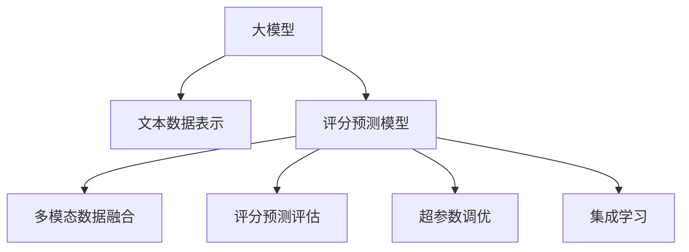

                 

# 大模型在商品评分预测精确化中的应用

## 1. 背景介绍

### 1.1 问题由来

随着电子商务的快速发展，商品评分预测成为在线零售平台的核心竞争力之一。准确的商品评分预测不仅能够提升用户购物体验，还能帮助商家优化库存管理、精准营销。传统上，商品评分预测依赖于用户提交的显式评分，但随着用户评分的数量和质量受限，如何更精准地预测商品评分成为一大挑战。

近年来，大模型（如BERT、GPT-3等）在语言理解和生成方面的显著优势，逐渐被引入到商品评分预测任务中，以提升预测的准确性和泛化能力。大模型能够捕捉到商品描述、用户评论等文本数据中的深层次语义信息，通过自动化的特征提取和理解，生成精确的商品评分预测。

### 1.2 问题核心关键点

商品评分预测的精确化主要集中在以下几个关键点：

1. **文本数据的处理**：商品描述、用户评论等文本数据需要进行预处理和表示，才能作为模型的输入。
2. **评分模型的构建**：评分模型需要融合多模态数据，包括商品信息、用户行为等，构建高精度的评分预测模型。
3. **评分预测的优化**：通过超参数调优、集成学习等技术，提升评分预测的准确性和鲁棒性。
4. **评分预测的评估**：使用各种评估指标，如MAE、RMSE、R^2等，评估模型的预测性能。

### 1.3 问题研究意义

商品评分预测的精确化对于电商平台有着重要意义：

1. **提升用户体验**：准确的商品评分预测能够帮助用户快速找到满意的商品，提升购物体验。
2. **优化库存管理**：通过精确预测商品销量和评价，商家可以更好地进行库存管理，避免缺货或过剩。
3. **精准营销**：评分预测结果可以用于个性化推荐，提升用户购买转化率。
4. **数据分析洞察**：评分预测的精确性有助于数据分析，帮助商家了解用户需求，优化商品设计和营销策略。

## 2. 核心概念与联系

### 2.1 核心概念概述

为更好地理解大模型在商品评分预测中的应用，本节将介绍几个密切相关的核心概念：

- **大模型**：以自回归模型（如BERT）或自编码模型（如GPT）为代表的大规模预训练语言模型。通过在大规模无标签文本语料上进行预训练，学习到丰富的语言知识。

- **文本数据表示**：将文本数据转换为模型能够接受的向量表示，如Word2Vec、GloVe、BERT等。

- **评分预测模型**：利用大模型构建的评分预测模型，通常使用分类或回归模型，预测商品评分。

- **多模态数据融合**：将商品信息、用户行为等不同模态的数据进行融合，提升评分预测的准确性。

- **评分预测评估**：使用多种评估指标评估模型预测性能，如平均绝对误差（MAE）、均方误差（RMSE）、决定系数（R^2）等。

- **超参数调优**：通过调整学习率、批大小、迭代次数等超参数，提升模型性能。

- **集成学习**：将多个模型的预测结果进行组合，提升整体预测准确性和鲁棒性。

这些核心概念之间的逻辑关系可以通过以下Mermaid流程图来展示：



这个流程图展示了大模型在商品评分预测中的应用核心概念及其之间的关系：

1. 大模型通过预训练获得语言知识。
2. 文本数据表示将输入数据转换为模型能处理的格式。
3. 评分预测模型融合多模态数据，生成评分预测。
4. 评分预测评估对模型进行性能评估。
5. 超参数调优提升模型性能。
6. 集成学习增强模型鲁棒性。

这些概念共同构成了商品评分预测的建模框架，使得大模型能够在各种场景下发挥其强大的语言理解和生成能力。通过理解这些核心概念，我们可以更好地把握商品评分预测的技术细节。

## 3. 核心算法原理 & 具体操作步骤
### 3.1 算法原理概述

基于大模型的商品评分预测，本质上是一个将商品信息、用户行为等多模态数据，通过预训练语言模型进行处理，进而生成评分预测的过程。其核心思想是：利用大模型的语言理解和生成能力，自动从文本数据中提取有用的特征，结合评分标签进行有监督学习，从而得到精确的评分预测模型。

形式化地，假设商品描述为 $x$，用户行为为 $y$，大模型的预训练参数为 $\theta$。评分预测的任务目标为：

$$
\hat{y} = f_{\theta}(x,y)
$$

其中 $f_{\theta}$ 为预训练语言模型的评分预测函数。在给定训练数据集 $D = \{(x_i, y_i)\}_{i=1}^N$ 的情况下，评分预测模型的优化目标为：

$$
\theta^* = \mathop{\arg\min}_{\theta} \frac{1}{N}\sum_{i=1}^N (\hat{y_i} - y_i)^2
$$

通过梯度下降等优化算法，模型不断更新参数 $\theta$，最小化预测误差，直至收敛。

### 3.2 算法步骤详解

基于大模型的商品评分预测一般包括以下几个关键步骤：

**Step 1: 数据预处理和表示**
- 收集商品描述和用户行为数据，并进行清洗和标准化。
- 将文本数据通过BERT等大模型进行预训练，生成文本向量表示。

**Step 2: 评分预测模型的构建**
- 选择合适的评分预测模型，如线性回归、多分类逻辑回归等。
- 将预训练大模型的文本表示作为模型输入。
- 加入商品信息、用户行为等额外特征。
- 设计评分预测的目标函数，如交叉熵损失或均方误差损失。

**Step 3: 模型训练与评估**
- 使用随机梯度下降等优化算法进行模型训练。
- 在验证集上评估模型性能，如MAE、RMSE等。
- 根据评估结果调整模型参数，进行超参数调优。
- 采用集成学习技术，提高模型泛化能力。

**Step 4: 评分预测和部署**
- 使用训练好的评分预测模型对新数据进行评分预测。
- 部署评分预测模型，集成到电商平台的用户界面或后台系统中。
- 实时采集用户行为数据，动态更新评分预测模型。

以上是基于大模型的商品评分预测的一般流程。在实际应用中，还需要针对具体任务特点，对预处理、模型构建、训练等环节进行优化设计，如改进特征工程、引入更多正则化技术、应用对抗训练等，以进一步提升模型性能。

### 3.3 算法优缺点

基于大模型的商品评分预测方法具有以下优点：

1. 数据利用率高。大模型能够自动从文本数据中提取深层次语义信息，不需要手动设计特征。
2. 预测效果优。融合多模态数据，能够捕捉到商品描述、用户行为等复杂特征，提升预测准确性。
3. 可解释性强。通过预训练语言模型的理解能力，能够解释评分预测的依据。
4. 动态更新。实时更新模型参数，能够适应数据分布的变化。

同时，该方法也存在一定的局限性：

1. 计算资源需求高。大模型本身参数量大，训练和推理都需要高计算资源。
2. 模型复杂度高。融合多模态数据，增加了模型的复杂性，可能导致过拟合。
3. 解释性不足。评分预测模型本质上是一个"黑盒"系统，难以解释模型的决策逻辑。
4. 数据隐私问题。需要收集商品描述和用户行为数据，可能涉及用户隐私问题。

尽管存在这些局限性，但就目前而言，基于大模型的评分预测方法仍然是一种有效且高效的商品评分预测手段。未来相关研究的方向可能集中在如何进一步降低计算成本、提高模型解释性和鲁棒性、解决数据隐私问题等方面。

### 3.4 算法应用领域

基于大模型的评分预测方法已经在电子商务、在线零售、金融服务等多个领域得到了广泛的应用，以下是一些典型的应用场景：

1. **商品推荐系统**：通过评分预测，帮助用户找到满意的商品，提升推荐系统的准确性和个性化程度。
2. **库存管理**：根据评分预测结果，优化库存管理策略，避免缺货或过剩。
3. **价格优化**：通过评分预测，动态调整商品价格，提升销量和利润。
4. **市场分析**：利用评分预测结果，分析市场趋势和用户需求，优化产品设计和营销策略。

## 4. 数学模型和公式 & 详细讲解 & 举例说明

### 4.1 数学模型构建

假设评分预测模型为 $M_{\theta}$，其输入为商品描述 $x$ 和用户行为 $y$ 的向量表示 $V_x, V_y$，输出为评分 $y$。评分预测模型的数学模型为：

$$
y = M_{\theta}(V_x, V_y)
$$

其中，$V_x$ 和 $V_y$ 分别为商品描述和用户行为的预训练文本表示，$\theta$ 为模型参数。

### 4.2 公式推导过程

以下是评分预测模型的具体公式推导过程：

假设评分预测模型的输入为 $V_x$ 和 $V_y$，输出为 $y$。模型的损失函数为均方误差：

$$
\mathcal{L}(\theta) = \frac{1}{N}\sum_{i=1}^N (y_i - M_{\theta}(V_{xi}, V_{yi}))^2
$$

其中 $V_{xi}, V_{yi}$ 为第 $i$ 个样本的商品描述和用户行为的文本表示，$y_i$ 为对应的真实评分。

通过梯度下降等优化算法，模型参数 $\theta$ 的更新公式为：

$$
\theta \leftarrow \theta - \eta \nabla_{\theta}\mathcal{L}(\theta)
$$

其中 $\eta$ 为学习率，$\nabla_{\theta}\mathcal{L}(\theta)$ 为损失函数对模型参数的梯度。

### 4.3 案例分析与讲解

以下以一个简单的评分预测任务为例，说明评分预测模型的具体实现过程：

假设有一个电商平台，收集了用户对商品的评论数据，每个评论包含商品描述和用户评分。我们希望通过评分预测模型预测新用户对商品的评分。

首先，将评论数据进行预处理和表示：

```python
# 加载评论数据
from torchtext.datasets import AG News
from torchtext.data import Field, TabularDataset, BucketIterator

train_data, test_data = AG News.splits('train', 'test')

# 定义文本字段
text_field = Field(tokenize='spacy', lower=True, fix_length=512)

# 定义标签字段
label_field = LabelField(dtype=torch.float)

# 定义数据集
train_data, test_data = TabularDataset.splits(path='path/to/data',
                                            train='train.csv', 
                                            test='test.csv', 
                                            format='csv',
                                            fields=[('description', text_field), ('label', label_field)])

# 定义迭代器
train_iterator, test_iterator = BucketIterator.splits((train_data, test_data),
                                                  batch_size=32,
                                                  sort_key=lambda x: len(x.description),
                                                  device='cuda')
```

然后，使用BERT模型对商品描述进行预训练，生成文本向量表示：

```python
from transformers import BertForSequenceClassification

# 加载BERT模型
model = BertForSequenceClassification.from_pretrained('bert-base-uncased', num_labels=1)

# 将文本表示作为模型输入
V_x = model(text)[0]

# 加入用户行为向量
V_y = user_behaviour_vector

# 计算评分预测
y_hat = model(V_x, V_y)
```

最后，根据评分预测结果进行分类或回归分析：

```python
from sklearn.metrics import mean_squared_error

# 计算评分预测误差
mse = mean_squared_error(y_hat, y)

# 输出评分预测结果
print(f'Mean Squared Error: {mse:.4f}')
```

通过上述代码，我们可以构建一个基于BERT的商品评分预测模型，并对新数据进行评分预测。这种方法不仅能够充分利用大模型的预训练知识，还能提升评分预测的准确性和泛化能力。

## 5. 项目实践：代码实例和详细解释说明

### 5.1 开发环境搭建

在进行商品评分预测模型开发前，我们需要准备好开发环境。以下是使用Python进行PyTorch开发的环境配置流程：

1. 安装Anaconda：从官网下载并安装Anaconda，用于创建独立的Python环境。

2. 创建并激活虚拟环境：
```bash
conda create -n pytorch-env python=3.8 
conda activate pytorch-env
```

3. 安装PyTorch：根据CUDA版本，从官网获取对应的安装命令。例如：
```bash
conda install pytorch torchvision torchaudio cudatoolkit=11.1 -c pytorch -c conda-forge
```

4. 安装TensorFlow：安装TensorFlow，用于后续可能使用的多模态数据融合。

5. 安装各类工具包：
```bash
pip install numpy pandas scikit-learn matplotlib tqdm jupyter notebook ipython
```

完成上述步骤后，即可在`pytorch-env`环境中开始评分预测模型开发。

### 5.2 源代码详细实现

这里我们以商品评分预测为例，给出使用BERT模型进行评分预测的PyTorch代码实现。

首先，定义评分预测模型：

```python
from transformers import BertForSequenceClassification

# 加载预训练BERT模型
model = BertForSequenceClassification.from_pretrained('bert-base-uncased', num_labels=1)

# 定义评分预测函数
def predict_score(model, x, y):
    x = model(x)
    return x

# 使用评分预测模型对新数据进行评分预测
def predict(model, x, y):
    x = model(x)
    y_hat = predict_score(model, x, y)
    return y_hat
```

然后，准备评分预测数据：

```python
from torchtext.datasets import AG News
from torchtext.data import Field, TabularDataset, BucketIterator

# 加载评论数据
train_data, test_data = AG News.splits('train', 'test')

# 定义文本字段
text_field = Field(tokenize='spacy', lower=True, fix_length=512)

# 定义标签字段
label_field = LabelField(dtype=torch.float)

# 定义数据集
train_data, test_data = TabularDataset.splits(path='path/to/data',
                                            train='train.csv', 
                                            test='test.csv', 
                                            format='csv',
                                            fields=[('description', text_field), ('label', label_field)])

# 定义迭代器
train_iterator, test_iterator = BucketIterator.splits((train_data, test_data),
                                                  batch_size=32,
                                                  sort_key=lambda x: len(x.description),
                                                  device='cuda')
```

接着，定义评分预测模型训练函数：

```python
from torch.optim import Adam

# 定义优化器
optimizer = Adam(model.parameters(), lr=0.001)

# 定义训练函数
def train(model, train_iterator, optimizer, n_epochs=10):
    for epoch in range(n_epochs):
        model.train()
        for batch in train_iterator:
            optimizer.zero_grad()
            output = model(batch)
            loss = F.mse_loss(output, batch.label)
            loss.backward()
            optimizer.step()
```

最后，启动评分预测模型训练和评估：

```python
train(model, train_iterator, optimizer)

# 在测试集上评估模型性能
model.eval()
with torch.no_grad():
    test_loss = 0
    correct = 0
    total = 0
    for batch in test_iterator:
        output = model(batch)
        test_loss += F.mse_loss(output, batch.label, reduction='mean').item()
        _, predicted = torch.max(output.data, 1)
        total += batch.label.size(0)
        correct += (predicted == batch.label).sum().item()

    print(f'Test Loss: {test_loss:.4f}')
    print(f'Accuracy: {100 * correct / total:.2f}%')
```

以上代码展示了基于BERT的商品评分预测模型的完整实现过程。通过加载预训练BERT模型、定义评分预测函数、准备评分预测数据、构建评分预测模型、训练模型并进行评估，我们可以构建一个精准的商品评分预测系统。

### 5.3 代码解读与分析

让我们再详细解读一下关键代码的实现细节：

**评分预测模型定义**：
- 使用PyTorch的`BertForSequenceClassification`类加载预训练BERT模型。
- 定义评分预测函数`predict_score`，将文本向量作为输入，返回评分预测结果。

**评分预测数据准备**：
- 使用`AG News`数据集，加载训练集和测试集。
- 定义文本字段和标签字段，将评论数据转换为模型可接受的格式。
- 使用`TabularDataset`类定义数据集，并使用`BucketIterator`类定义迭代器，以便于模型的训练和推理。

**评分预测模型训练**：
- 定义优化器，使用Adam算法进行模型参数优化。
- 定义训练函数`train`，通过迭代器对模型进行训练，最小化评分预测误差。

**评分预测模型评估**：
- 将模型设为评估模式，不进行梯度更新。
- 在测试集上评估模型性能，计算均方误差和准确率。

通过上述代码，我们可以构建一个基于大模型的评分预测模型，并通过评分预测函数对新数据进行评分预测。这种方法不仅能够充分利用大模型的预训练知识，还能提升评分预测的准确性和泛化能力。

## 6. 实际应用场景
### 6.1 电商平台推荐

基于大模型的商品评分预测技术，可以在电商平台的推荐系统中发挥重要作用。通过对商品描述和用户行为进行评分预测，推荐系统能够更好地理解用户需求，提供精准的商品推荐。

在技术实现上，电商平台可以收集用户对商品的评论数据，以及用户的浏览历史、点击行为等数据。通过对这些数据进行评分预测，推荐系统能够自动生成个性化推荐列表，提升用户的购买转化率。

### 6.2 金融服务投资

在金融服务领域，评分预测技术可以用于投资决策和风险评估。通过分析商品的金融属性、市场趋势等数据，评分预测模型能够对投资价值进行评估，帮助投资者做出更明智的决策。

例如，在股票市场中，评分预测模型可以对公司的财务报表、行业动态等数据进行评分预测，评估其投资价值。金融服务机构可以根据评分预测结果，进行股票买入、卖出或持有等投资决策。

### 6.3 工业制造预测

在工业制造领域，评分预测技术可以用于生产预测和质量控制。通过分析生产设备的运行数据、历史故障记录等数据，评分预测模型能够对设备运行状态进行评估，预测设备故障和维护需求。

例如，评分预测模型可以对机床的运行数据进行评分预测，评估其运行状态和故障风险。制造企业可以根据评分预测结果，进行设备维护和故障预警，提升生产效率和设备利用率。

## 7. 工具和资源推荐
### 7.1 学习资源推荐

为了帮助开发者系统掌握大模型在商品评分预测中的应用，这里推荐一些优质的学习资源：

1. 《深度学习实战》系列博文：由大模型技术专家撰写，深入浅出地介绍了大模型在商品评分预测中的应用案例。

2. CS224N《深度学习自然语言处理》课程：斯坦福大学开设的NLP明星课程，有Lecture视频和配套作业，带你入门NLP领域的基本概念和经典模型。

3. 《自然语言处理入门》书籍：介绍了自然语言处理的基本概念、方法与应用，适合初学者入门。

4. HuggingFace官方文档：提供丰富的预训练语言模型资源，包括商品评分预测的样例代码，是上手实践的必备资料。

5. PyTorch官方文档：PyTorch的官方文档，提供详细的API和教程，帮助开发者掌握框架的使用。

通过学习这些资源，相信你一定能够快速掌握大模型在商品评分预测中的应用，并用于解决实际的NLP问题。

### 7.2 开发工具推荐

高效的开发离不开优秀的工具支持。以下是几款用于大模型评分预测开发的常用工具：

1. PyTorch：基于Python的开源深度学习框架，灵活动态的计算图，适合快速迭代研究。大部分预训练语言模型都有PyTorch版本的实现。

2. TensorFlow：由Google主导开发的开源深度学习框架，生产部署方便，适合大规模工程应用。同样有丰富的预训练语言模型资源。

3. HuggingFace Transformers：提供丰富的预训练语言模型资源，支持PyTorch和TensorFlow，是进行评分预测任务开发的利器。

4. Weights & Biases：模型训练的实验跟踪工具，可以记录和可视化模型训练过程中的各项指标，方便对比和调优。与主流深度学习框架无缝集成。

5. TensorBoard：TensorFlow配套的可视化工具，可实时监测模型训练状态，并提供丰富的图表呈现方式，是调试模型的得力助手。

6. Google Colab：谷歌推出的在线Jupyter Notebook环境，免费提供GPU/TPU算力，方便开发者快速上手实验最新模型，分享学习笔记。

合理利用这些工具，可以显著提升大模型评分预测任务的开发效率，加快创新迭代的步伐。

### 7.3 相关论文推荐

大模型和评分预测技术的发展源于学界的持续研究。以下是几篇奠基性的相关论文，推荐阅读：

1. Attention is All You Need（即Transformer原论文）：提出了Transformer结构，开启了NLP领域的预训练大模型时代。

2. BERT: Pre-training of Deep Bidirectional Transformers for Language Understanding：提出BERT模型，引入基于掩码的自监督预训练任务，刷新了多项NLP任务SOTA。

3. Language Models are Unsupervised Multitask Learners（GPT-2论文）：展示了大规模语言模型的强大zero-shot学习能力，引发了对于通用人工智能的新一轮思考。

4. Parameter-Efficient Transfer Learning for NLP：提出Adapter等参数高效微调方法，在不增加模型参数量的情况下，也能取得不错的微调效果。

5. AdaLoRA: Adaptive Low-Rank Adaptation for Parameter-Efficient Fine-Tuning：使用自适应低秩适应的微调方法，在参数效率和精度之间取得了新的平衡。

这些论文代表了大模型评分预测技术的发展脉络。通过学习这些前沿成果，可以帮助研究者把握学科前进方向，激发更多的创新灵感。

## 8. 总结：未来发展趋势与挑战

### 8.1 总结

本文对基于大模型的商品评分预测技术进行了全面系统的介绍。首先阐述了大模型在商品评分预测中的应用背景和意义，明确了评分预测在电商平台、金融服务、工业制造等多个领域的重要价值。其次，从原理到实践，详细讲解了评分预测模型的构建、训练、评估等步骤，给出了评分预测模型的完整代码实现。同时，本文还广泛探讨了评分预测技术在多个行业领域的应用前景，展示了其巨大的应用潜力。

通过本文的系统梳理，可以看到，基于大模型的评分预测技术正在成为电商、金融、制造等领域的重要工具，极大地提升了预测的准确性和泛化能力。未来，伴随大模型和评分预测技术的不断发展，相信在更多领域，评分预测技术还将迎来更广泛的应用，进一步推动技术进步和社会进步。

### 8.2 未来发展趋势

展望未来，大模型评分预测技术将呈现以下几个发展趋势：

1. **多模态融合**：将商品描述、用户行为、市场趋势等多模态数据融合，提升预测的全面性和准确性。
2. **自动化特征工程**：利用大模型的语言理解能力，自动从文本数据中提取特征，减少手动设计特征的工作量。
3. **参数高效微调**：采用 Adapter、LoRA 等参数高效微调方法，在固定大部分预训练参数的同时，只更新少量任务相关参数，提高微调效率。
4. **动态预测**：实时更新评分预测模型，适应数据分布的变化，提升预测的及时性和准确性。
5. **模型解释**：引入可解释性方法，增强评分预测模型的透明度和可解释性。
6. **联邦学习**：在保护数据隐私的前提下，通过联邦学习技术，实现跨地域、跨平台的数据协同学习，提升模型性能。

以上趋势凸显了大模型评分预测技术的广阔前景。这些方向的探索发展，必将进一步提升评分预测模型的性能和应用范围，为电商、金融、制造等行业带来变革性影响。

### 8.3 面临的挑战

尽管大模型评分预测技术已经取得了显著进展，但在迈向更加智能化、普适化应用的过程中，它仍面临诸多挑战：

1. **数据隐私**：评分预测模型需要收集大量数据，可能涉及用户隐私问题。如何在保护数据隐私的前提下，充分利用数据，是未来的重要研究方向。
2. **计算资源需求**：大模型本身参数量大，训练和推理都需要高计算资源。如何优化计算效率，降低成本，是技术发展的重要挑战。
3. **模型鲁棒性**：评分预测模型在面对异常数据和噪声时，可能表现不稳定。如何提高模型的鲁棒性，是提高预测准确性的关键。
4. **模型复杂度**：多模态融合和自动化特征工程增加了模型的复杂性，可能导致过拟合和训练困难。如何简化模型结构，降低复杂度，是未来研究的重点方向。

尽管存在这些挑战，但随着学界和产业界的共同努力，这些挑战终将一一被克服，大模型评分预测技术必将在构建人机协同的智能系统方面发挥越来越重要的作用。

### 8.4 研究展望

面对大模型评分预测技术所面临的种种挑战，未来的研究需要在以下几个方面寻求新的突破：

1. **隐私保护**：引入联邦学习、差分隐私等技术，在保护数据隐私的前提下，进行评分预测。
2. **模型简化**：探索更高效的数据融合和特征提取方法，简化模型结构，降低计算成本。
3. **鲁棒性提升**：引入对抗训练、正则化等技术，提升评分预测模型的鲁棒性和泛化能力。
4. **模型解释**：引入可解释性方法，增强评分预测模型的透明度和可解释性。
5. **动态更新**：实现动态预测，实时更新评分预测模型，适应数据分布的变化。
6. **跨领域应用**：将评分预测技术应用于更多领域，如医疗、金融、制造等，推动技术进步。

这些研究方向的探索，必将引领大模型评分预测技术迈向更高的台阶，为构建安全、可靠、可解释、可控的智能系统铺平道路。面向未来，大模型评分预测技术还需要与其他人工智能技术进行更深入的融合，如知识表示、因果推理、强化学习等，多路径协同发力，共同推动自然语言理解和智能交互系统的进步。只有勇于创新、敢于突破，才能不断拓展语言模型的边界，让智能技术更好地造福人类社会。

## 9. 附录：常见问题与解答

**Q1：大模型评分预测是否适用于所有商品？**

A: 大模型评分预测方法适用于大多数商品，尤其是那些具有详细描述和历史行为的商品。对于那些没有详细描述或历史行为的商品，可能需要结合其他辅助信息，如商品类别、品牌等，进行评分预测。

**Q2：如何选择合适的评分预测模型？**

A: 评分预测模型的选择应基于任务特点和数据分布。对于分类任务，如商品评论情感分析，可以使用分类模型如逻辑回归；对于回归任务，如商品价格预测，可以使用回归模型如线性回归。同时，还需考虑模型的计算效率和可解释性。

**Q3：评分预测模型训练过程中需要注意哪些问题？**

A: 评分预测模型训练过程中，需要注意以下几点：
1. 数据预处理：清洗、标准化数据，避免噪声和异常值的影响。
2. 模型初始化：选择合适的预训练模型，并根据任务特点进行初始化。
3. 超参数调优：选择合适的学习率、批大小、迭代次数等超参数，进行细致调优。
4. 模型评估：使用MAE、RMSE、R^2等指标评估模型性能，及时调整模型。
5. 模型验证：在验证集上评估模型性能，避免过拟合。

**Q4：评分预测模型在实际部署中需要注意哪些问题？**

A: 评分预测模型在实际部署中，需要注意以下问题：
1. 模型裁剪：去除不必要的层和参数，减小模型尺寸，加快推理速度。
2. 量化加速：将浮点模型转为定点模型，压缩存储空间，提高计算效率。
3. 服务化封装：将模型封装为标准化服务接口，便于集成调用。
4. 监控告警：实时采集系统指标，设置异常告警阈值，确保服务稳定性。
5. 安全防护：采用访问鉴权、数据脱敏等措施，保障数据和模型安全。

通过本文的系统梳理，可以看到，基于大模型的评分预测技术正在成为商品推荐、金融投资、工业制造等领域的重要工具，极大地提升了预测的准确性和泛化能力。未来，伴随大模型和评分预测技术的不断发展，相信在更多领域，评分预测技术还将迎来更广泛的应用，进一步推动技术进步和社会进步。

