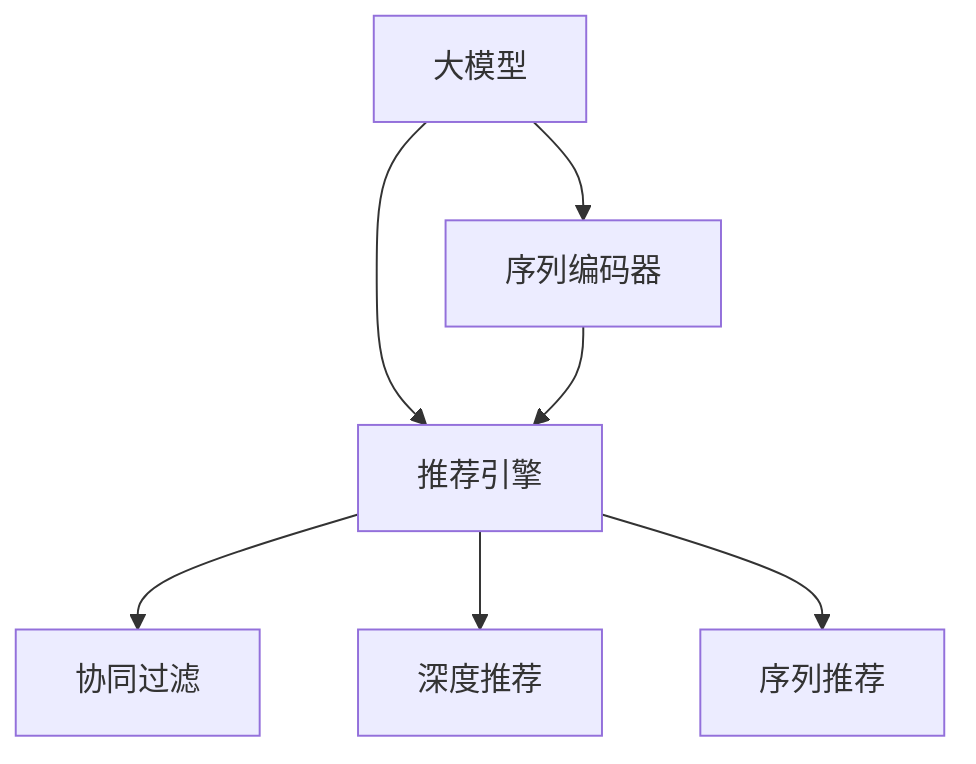

                 

# 大模型在序列推荐中的应用

## 1. 背景介绍

### 1.1 问题由来

在推荐系统中，用户和商品之间的交互方式是复杂的。用户的行为、偏好、反馈信息都在不断变化，而商品的展示、排序、推荐也需要根据这些动态数据进行实时调整。传统的推荐算法，如协同过滤、基于内容的推荐等，往往只能基于静态数据进行模型训练，难以应对动态变化的环境。近年来，随着深度学习和大模型的兴起，越来越多的研究者开始探索如何将大模型应用于推荐系统，以获得更好的效果和鲁棒性。

### 1.2 问题核心关键点

大模型在推荐系统中的应用，核心在于如何利用其强大的自回归能力，对用户序列进行建模和预测。具体来说，就是将用户的浏览、点击、评分等行为序列作为输入，通过大模型进行编码和解码，预测用户未来的行为，生成个性化的推荐结果。

大模型在推荐系统中的应用主要集中在以下几个方面：

- 用户序列建模：利用大模型对用户行为序列进行建模，学习用户兴趣和偏好的动态变化。
- 商品特征表示：通过大模型对商品属性、描述等进行表示，提升推荐的精度和多样性。
- 交互机制设计：引入大模型对用户与商品之间的交互过程进行建模，学习用户对商品的反应和反馈。
- 个性化推荐：将大模型作为推荐系统的核心组件，根据用户行为序列生成个性化推荐结果。

### 1.3 问题研究意义

大模型在推荐系统中的应用，具有以下重要意义：

- 适应性强：大模型能够对用户行为和商品特征进行全面建模，灵活适应不同的推荐场景。
- 推荐精度高：利用大模型对序列进行编码和解码，能够更准确地预测用户行为，提升推荐效果。
- 动态响应：大模型能够在实时数据驱动下进行快速调整，快速响应用户需求变化。
- 可扩展性好：大模型可以与其他推荐算法结合，实现更复杂的推荐逻辑。
- 鲁棒性好：大模型通过在大规模数据上进行预训练，具有较强的泛化能力和鲁棒性。

## 2. 核心概念与联系

### 2.1 核心概念概述

为更好地理解大模型在推荐系统中的应用，本节将介绍几个密切相关的核心概念：

- 大模型(Large Model)：以自回归模型为代表的大规模深度学习模型，如Transformer、GPT等。通过在大规模数据上进行预训练，学习到丰富的语义和结构信息，具备强大的自回归能力。
- 序列推荐(Sequence Recommendation)：针对用户行为序列进行推荐的技术，旨在根据用户历史行为预测其未来行为，生成个性化的推荐结果。
- 协同过滤(Collaborative Filtering)：通过分析用户行为和商品评分数据，预测用户对商品的兴趣，生成推荐结果。
- 深度推荐(Deep Recommendation)：利用深度学习模型对用户行为和商品特征进行建模，提升推荐精度。
- 序列编码器(Sequence Encoder)：用于对用户行为序列进行编码，学习用户兴趣和偏好的大模型组件。
- 推荐引擎(Recommendation Engine)：利用序列编码器和商品特征表示，生成个性化推荐结果的系统组件。

这些核心概念之间的逻辑关系可以通过以下Mermaid流程图来展示：



这个流程图展示了大模型在推荐系统中的核心概念及其之间的关系：

1. 大模型通过在大规模数据上进行预训练，学习到丰富的语义和结构信息，具备强大的自回归能力。
2. 序列编码器利用大模型的编码能力，对用户行为序列进行建模，学习用户兴趣和偏好的动态变化。
3. 推荐引擎将序列编码器的输出与商品特征表示相结合，生成个性化推荐结果。
4. 协同过滤和深度推荐是传统的推荐技术，与序列推荐系统相结合，提升推荐效果。

## 3. 核心算法原理 & 具体操作步骤
### 3.1 算法原理概述

大模型在推荐系统中的应用，主要基于序列推荐的技术。具体来说，利用大模型对用户行为序列进行编码和解码，学习用户兴趣和偏好的动态变化，并预测用户未来的行为。

序列推荐的算法原理如下：

1. 序列建模：利用大模型对用户行为序列进行建模，学习用户兴趣和偏好的动态变化。
2. 特征表示：利用大模型对商品属性、描述等进行表示，提升推荐的精度和多样性。
3. 交互建模：利用大模型对用户与商品之间的交互过程进行建模，学习用户对商品的反应和反馈。
4. 推荐生成：将大模型作为推荐系统的核心组件，根据用户行为序列生成个性化推荐结果。

### 3.2 算法步骤详解

基于大模型的序列推荐系统，一般包括以下几个关键步骤：

**Step 1: 准备数据集和预训练模型**

- 准备用户行为序列和商品属性、描述等数据集，划分为训练集、验证集和测试集。
- 选择合适的预训练模型，如Transformer、GPT等，加载到内存中进行微调。

**Step 2: 设计序列编码器**

- 根据任务需求，设计合适的序列编码器，将用户行为序列作为输入，学习用户兴趣和偏好的动态变化。
- 常用的序列编码器包括Transformer、GRU等，可以选用预训练好的模型，也可以通过微调获得更好的效果。

**Step 3: 设计特征表示模型**

- 利用大模型对商品属性、描述等进行表示，提升推荐的精度和多样性。
- 常用的特征表示模型包括BERT、E2E等，可以选用预训练好的模型，也可以通过微调获得更好的效果。

**Step 4: 设计交互模型**

- 利用大模型对用户与商品之间的交互过程进行建模，学习用户对商品的反应和反馈。
- 常用的交互模型包括CTR模型、FNN等，可以选用预训练好的模型，也可以通过微调获得更好的效果。

**Step 5: 微调模型**

- 使用训练集对序列编码器、特征表示模型、交互模型进行微调，优化模型参数，使其适应推荐任务。
- 常用的微调方法包括全参数微调、参数高效微调等，可以根据具体情况选择合适的方法。

**Step 6: 评估和优化**

- 在验证集上评估微调后的模型性能，根据性能指标进行参数调整和优化。
- 常用的评估指标包括准确率、召回率、F1-score等，可以根据具体情况选择合适的方法。

**Step 7: 测试和部署**

- 在测试集上评估微调后的模型性能，对比微调前后的精度提升。
- 使用微调后的模型对新样本进行推理预测，集成到实际的应用系统中。
- 持续收集新的数据，定期重新微调模型，以适应数据分布的变化。

以上是基于大模型的序列推荐系统的一般流程。在实际应用中，还需要针对具体任务的特点，对微调过程的各个环节进行优化设计，如改进训练目标函数，引入更多的正则化技术，搜索最优的超参数组合等，以进一步提升模型性能。

### 3.3 算法优缺点

基于大模型的序列推荐系统具有以下优点：

- 准确率高：利用大模型对用户行为序列进行建模，能够更准确地预测用户行为，提升推荐效果。
- 动态响应：大模型能够在实时数据驱动下进行快速调整，快速响应用户需求变化。
- 可扩展性好：大模型可以与其他推荐算法结合，实现更复杂的推荐逻辑。
- 鲁棒性好：大模型通过在大规模数据上进行预训练，具有较强的泛化能力和鲁棒性。

同时，该方法也存在一定的局限性：

- 依赖高质量标注数据：微调过程需要大量的标注数据，获取高质量标注数据的成本较高。
- 计算资源消耗大：大模型参数量较大，计算资源消耗较大，需要高性能的硬件支持。
- 过拟合风险高：微调模型在训练集上过拟合的风险较高，需要进行参数调整和正则化。
- 可解释性不足：序列推荐模型的决策过程缺乏可解释性，难以对其推理逻辑进行分析和调试。

尽管存在这些局限性，但就目前而言，基于大模型的序列推荐系统仍是目前推荐领域的主流方法之一。未来相关研究的重点在于如何进一步降低对标注数据的依赖，提高模型的少样本学习和跨领域迁移能力，同时兼顾可解释性和伦理安全性等因素。

### 3.4 算法应用领域

基于大模型的序列推荐系统已经在多个领域得到了应用，如电商推荐、视频推荐、音乐推荐、新闻推荐等，为推荐系统带来了显著的性能提升和用户体验改善。

- **电商推荐**：利用大模型对用户浏览、点击、购买行为进行建模，生成个性化商品推荐结果。
- **视频推荐**：利用大模型对用户观看历史和评分进行建模，生成个性化视频推荐结果。
- **音乐推荐**：利用大模型对用户听歌历史和评分进行建模，生成个性化音乐推荐结果。
- **新闻推荐**：利用大模型对用户阅读历史和评分进行建模，生成个性化新闻推荐结果。

除了这些经典任务外，大模型还应用于更多场景中，如广告推荐、教育推荐、旅游推荐等，为推荐系统带来了新的突破。

## 4. 数学模型和公式 & 详细讲解  
### 4.1 数学模型构建

本节将使用数学语言对基于大模型的序列推荐过程进行更加严格的刻画。

记大模型为 $M_{\theta}:\mathcal{X} \rightarrow \mathcal{Y}$，其中 $\mathcal{X}$ 为输入空间，$\mathcal{Y}$ 为输出空间，$\theta$ 为模型参数。假设推荐任务为序列推荐，训练集为 $D=\{(x_i,y_i)\}_{i=1}^N$，其中 $x_i$ 为用户行为序列，$y_i$ 为推荐结果。

定义模型 $M_{\theta}$ 在输入 $x$ 上的损失函数为 $\ell(M_{\theta}(x),y)$，则在数据集 $D$ 上的经验风险为：

$$
\mathcal{L}(\theta) = \frac{1}{N} \sum_{i=1}^N \ell(M_{\theta}(x_i),y_i)
$$

微调的优化目标是最小化经验风险，即找到最优参数：

$$
\theta^* = \mathop{\arg\min}_{\theta} \mathcal{L}(\theta)
$$

在实践中，我们通常使用基于梯度的优化算法（如SGD、Adam等）来近似求解上述最优化问题。设 $\eta$ 为学习率，$\lambda$ 为正则化系数，则参数的更新公式为：

$$
\theta \leftarrow \theta - \eta \nabla_{\theta}\mathcal{L}(\theta) - \eta\lambda\theta
$$

其中 $\nabla_{\theta}\mathcal{L}(\theta)$ 为损失函数对参数 $\theta$ 的梯度，可通过反向传播算法高效计算。

### 4.2 公式推导过程

以下我们以电商推荐任务为例，推导交叉熵损失函数及其梯度的计算公式。

假设模型 $M_{\theta}$ 在输入 $x$ 上的输出为 $\hat{y}=M_{\theta}(x) \in [0,1]$，表示商品被用户购买的概率。真实标签 $y \in \{0,1\}$。则二分类交叉熵损失函数定义为：

$$
\ell(M_{\theta}(x),y) = -[y\log \hat{y} + (1-y)\log (1-\hat{y})]
$$

将其代入经验风险公式，得：

$$
\mathcal{L}(\theta) = -\frac{1}{N}\sum_{i=1}^N [y_i\log M_{\theta}(x_i)+(1-y_i)\log(1-M_{\theta}(x_i))]
$$

根据链式法则，损失函数对参数 $\theta_k$ 的梯度为：

$$
\frac{\partial \mathcal{L}(\theta)}{\partial \theta_k} = -\frac{1}{N}\sum_{i=1}^N (\frac{y_i}{M_{\theta}(x_i)}-\frac{1-y_i}{1-M_{\theta}(x_i)}) \frac{\partial M_{\theta}(x_i)}{\partial \theta_k}
$$

其中 $\frac{\partial M_{\theta}(x_i)}{\partial \theta_k}$ 可进一步递归展开，利用自动微分技术完成计算。

在得到损失函数的梯度后，即可带入参数更新公式，完成模型的迭代优化。重复上述过程直至收敛，最终得到适应推荐任务的最优模型参数 $\theta^*$。

## 5. 项目实践：代码实例和详细解释说明
### 5.1 开发环境搭建

在进行推荐系统微调实践前，我们需要准备好开发环境。以下是使用Python进行PyTorch开发的环境配置流程：

1. 安装Anaconda：从官网下载并安装Anaconda，用于创建独立的Python环境。

2. 创建并激活虚拟环境：
```bash
conda create -n pytorch-env python=3.8 
conda activate pytorch-env
```

3. 安装PyTorch：根据CUDA版本，从官网获取对应的安装命令。例如：
```bash
conda install pytorch torchvision torchaudio cudatoolkit=11.1 -c pytorch -c conda-forge
```

4. 安装Transformers库：
```bash
pip install transformers
```

5. 安装各类工具包：
```bash
pip install numpy pandas scikit-learn matplotlib tqdm jupyter notebook ipython
```

完成上述步骤后，即可在`pytorch-env`环境中开始微调实践。

### 5.2 源代码详细实现

下面我们以电商推荐任务为例，给出使用Transformers库对BERT模型进行微调的PyTorch代码实现。

首先，定义电商推荐任务的数据处理函数：

```python
from transformers import BertTokenizer
from torch.utils.data import Dataset
import torch

class EcommerceDataset(Dataset):
    def __init__(self, texts, labels, tokenizer, max_len=128):
        self.texts = texts
        self.labels = labels
        self.tokenizer = tokenizer
        self.max_len = max_len
        
    def __len__(self):
        return len(self.texts)
    
    def __getitem__(self, item):
        text = self.texts[item]
        label = self.labels[item]
        
        encoding = self.tokenizer(text, return_tensors='pt', max_length=self.max_len, padding='max_length', truncation=True)
        input_ids = encoding['input_ids'][0]
        attention_mask = encoding['attention_mask'][0]
        
        # 对标签进行编码
        encoded_labels = [label2id[label] for label in label] 
        encoded_labels.extend([label2id['O']] * (self.max_len - len(encoded_labels)))
        labels = torch.tensor(encoded_labels, dtype=torch.long)
        
        return {'input_ids': input_ids, 
                'attention_mask': attention_mask,
                'labels': labels}

# 标签与id的映射
label2id = {'O': 0, 'buy': 1, 'dont_buy': 2}
id2label = {v: k for k, v in label2id.items()}

# 创建dataset
tokenizer = BertTokenizer.from_pretrained('bert-base-cased')

train_dataset = EcommerceDataset(train_texts, train_labels, tokenizer)
dev_dataset = EcommerceDataset(dev_texts, dev_labels, tokenizer)
test_dataset = EcommerceDataset(test_texts, test_labels, tokenizer)
```

然后，定义模型和优化器：

```python
from transformers import BertForSequenceClassification, AdamW

model = BertForSequenceClassification.from_pretrained('bert-base-cased', num_labels=len(label2id))

optimizer = AdamW(model.parameters(), lr=2e-5)
```

接着，定义训练和评估函数：

```python
from torch.utils.data import DataLoader
from tqdm import tqdm
from sklearn.metrics import classification_report

device = torch.device('cuda') if torch.cuda.is_available() else torch.device('cpu')
model.to(device)

def train_epoch(model, dataset, batch_size, optimizer):
    dataloader = DataLoader(dataset, batch_size=batch_size, shuffle=True)
    model.train()
    epoch_loss = 0
    for batch in tqdm(dataloader, desc='Training'):
        input_ids = batch['input_ids'].to(device)
        attention_mask = batch['attention_mask'].to(device)
        labels = batch['labels'].to(device)
        model.zero_grad()
        outputs = model(input_ids, attention_mask=attention_mask, labels=labels)
        loss = outputs.loss
        epoch_loss += loss.item()
        loss.backward()
        optimizer.step()
    return epoch_loss / len(dataloader)

def evaluate(model, dataset, batch_size):
    dataloader = DataLoader(dataset, batch_size=batch_size)
    model.eval()
    preds, labels = [], []
    with torch.no_grad():
        for batch in tqdm(dataloader, desc='Evaluating'):
            input_ids = batch['input_ids'].to(device)
            attention_mask = batch['attention_mask'].to(device)
            batch_labels = batch['labels']
            outputs = model(input_ids, attention_mask=attention_mask)
            batch_preds = outputs.logits.argmax(dim=2).to('cpu').tolist()
            batch_labels = batch_labels.to('cpu').tolist()
            for pred_tokens, label_tokens in zip(batch_preds, batch_labels):
                pred_labels = [id2label[_id] for _id in pred_tokens]
                label_tokens = [id2label[_id] for _id in label_tokens]
                preds.append(pred_labels[:len(label_tokens)])
                labels.append(label_tokens)
                
    print(classification_report(labels, preds))
```

最后，启动训练流程并在测试集上评估：

```python
epochs = 5
batch_size = 16

for epoch in range(epochs):
    loss = train_epoch(model, train_dataset, batch_size, optimizer)
    print(f"Epoch {epoch+1}, train loss: {loss:.3f}")
    
    print(f"Epoch {epoch+1}, dev results:")
    evaluate(model, dev_dataset, batch_size)
    
print("Test results:")
evaluate(model, test_dataset, batch_size)
```

以上就是使用PyTorch对BERT进行电商推荐任务微调的完整代码实现。可以看到，得益于Transformers库的强大封装，我们可以用相对简洁的代码完成BERT模型的加载和微调。

### 5.3 代码解读与分析

让我们再详细解读一下关键代码的实现细节：

**EcommerceDataset类**：
- `__init__`方法：初始化文本、标签、分词器等关键组件。
- `__len__`方法：返回数据集的样本数量。
- `__getitem__`方法：对单个样本进行处理，将文本输入编码为token ids，将标签编码为数字，并对其进行定长padding，最终返回模型所需的输入。

**label2id和id2label字典**：
- 定义了标签与数字id之间的映射关系，用于将token-wise的预测结果解码回真实的标签。

**训练和评估函数**：
- 使用PyTorch的DataLoader对数据集进行批次化加载，供模型训练和推理使用。
- 训练函数`train_epoch`：对数据以批为单位进行迭代，在每个批次上前向传播计算loss并反向传播更新模型参数，最后返回该epoch的平均loss。
- 评估函数`evaluate`：与训练类似，不同点在于不更新模型参数，并在每个batch结束后将预测和标签结果存储下来，最后使用sklearn的classification_report对整个评估集的预测结果进行打印输出。

**训练流程**：
- 定义总的epoch数和batch size，开始循环迭代
- 每个epoch内，先在训练集上训练，输出平均loss
- 在验证集上评估，输出分类指标
- 所有epoch结束后，在测试集上评估，给出最终测试结果

可以看到，PyTorch配合Transformers库使得BERT微调的代码实现变得简洁高效。开发者可以将更多精力放在数据处理、模型改进等高层逻辑上，而不必过多关注底层的实现细节。

当然，工业级的系统实现还需考虑更多因素，如模型的保存和部署、超参数的自动搜索、更灵活的任务适配层等。但核心的微调范式基本与此类似。

## 6. 实际应用场景
### 6.1 智能客服系统

基于大模型的推荐技术，可以广泛应用于智能客服系统的构建。传统客服往往需要配备大量人力，高峰期响应缓慢，且一致性和专业性难以保证。而使用推荐技术，可以为每个客服配置个性化推荐系统，自动推荐最合适的回复模板，提升服务效率和质量。

在技术实现上，可以收集企业内部的历史客服对话记录，将问题和最佳答复构建成监督数据，在此基础上对预训练推荐模型进行微调。微调后的推荐模型能够自动理解用户意图，匹配最合适的回复模板进行回复。对于客户提出的新问题，还可以接入检索系统实时搜索相关内容，动态组织生成回答。如此构建的智能客服系统，能大幅提升客户咨询体验和问题解决效率。

### 6.2 个性化广告推荐

广告推荐是电商和媒体行业的重要应用场景。基于大模型的推荐技术，可以构建精准的用户行为分析系统，利用用户的浏览、点击、搜索等行为进行建模，生成个性化的广告推荐结果。通过实时调整推荐算法，可以根据用户的实时行为动态调整广告内容，提升广告点击率和转化率。

在技术实现上，可以收集广告主的历史广告数据和用户的互动数据，将这些数据作为监督数据，训练大模型进行推荐。微调后的推荐模型能够自动学习用户对不同广告的兴趣和反应，生成个性化的广告推荐结果。广告主可以根据推荐结果进行定向投放，提升广告效果和ROI。

### 6.3 内容推荐系统

内容推荐系统广泛应用于新闻、视频、音乐、阅读等场景。基于大模型的推荐技术，可以构建精准的内容推荐系统，利用用户的浏览、点击、评分等行为进行建模，生成个性化的内容推荐结果。通过实时调整推荐算法，可以根据用户的实时行为动态调整内容推荐，提升用户满意度和留存率。

在技术实现上，可以收集用户的历史行为数据和内容的标签信息，将这些数据作为监督数据，训练大模型进行推荐。微调后的推荐模型能够自动学习用户对不同内容的兴趣和反应，生成个性化的内容推荐结果。内容提供商可以根据推荐结果进行定向推荐，提升用户体验和平台流量。

### 6.4 未来应用展望

随着大模型和推荐技术的不断发展，基于大模型的推荐系统将在更多领域得到应用，为各行各业带来变革性影响。

在智慧医疗领域，基于大模型的推荐技术可以构建个性化的治疗方案推荐系统，根据患者的病历和症状进行推荐，提升医疗服务效率和质量。

在智能教育领域，基于大模型的推荐技术可以构建个性化的学习路径推荐系统，根据学生的学习行为进行推荐，提升学习效果和教育公平。

在智慧城市治理中，基于大模型的推荐技术可以构建个性化的交通管理推荐系统，根据用户的出行行为进行推荐，提升交通效率和城市运行效率。

此外，在企业生产、社会治理、文娱传媒等众多领域，基于大模型的推荐技术也将不断涌现，为各行各业带来新的突破。相信随着技术的日益成熟，推荐技术将成为人工智能落地应用的重要范式，推动人工智能技术在更多领域得到普及和应用。

## 7. 工具和资源推荐
### 7.1 学习资源推荐

为了帮助开发者系统掌握大模型在推荐系统中的应用，这里推荐一些优质的学习资源：

1. 《深度学习推荐系统》系列博文：由深度学习专家撰写，深入浅出地介绍了推荐系统的基本原理和前沿算法，涵盖序列推荐、协同过滤、深度推荐等内容。

2. CS285《强化学习》课程：斯坦福大学开设的强化学习明星课程，有Lecture视频和配套作业，带你入门强化学习理论及其在推荐系统中的应用。

3. 《深度学习推荐系统》书籍：深度学习领域的经典书籍，系统介绍了推荐系统的基本概念和经典模型，包括基于大模型的推荐方法。

4. HuggingFace官方文档：Transformers库的官方文档，提供了海量预训练模型和完整的推荐系统开发样例，是上手实践的必备资料。

5. Kaggle推荐系统竞赛：Kaggle平台上的推荐系统竞赛，包含丰富的数据集和评测标准，是学习和实践推荐算法的绝佳平台。

通过对这些资源的学习实践，相信你一定能够快速掌握大模型在推荐系统中的应用精髓，并用于解决实际的推荐问题。
### 7.2 开发工具推荐

高效的开发离不开优秀的工具支持。以下是几款用于大模型推荐系统开发的常用工具：

1. PyTorch：基于Python的开源深度学习框架，灵活动态的计算图，适合快速迭代研究。大部分预训练语言模型都有PyTorch版本的实现。

2. TensorFlow：由Google主导开发的开源深度学习框架，生产部署方便，适合大规模工程应用。同样有丰富的预训练语言模型资源。

3. Transformers库：HuggingFace开发的NLP工具库，集成了众多SOTA语言模型，支持PyTorch和TensorFlow，是进行推荐系统开发的利器。

4. Weights & Biases：模型训练的实验跟踪工具，可以记录和可视化模型训练过程中的各项指标，方便对比和调优。与主流深度学习框架无缝集成。

5. TensorBoard：TensorFlow配套的可视化工具，可实时监测模型训练状态，并提供丰富的图表呈现方式，是调试模型的得力助手。

6. Google Colab：谷歌推出的在线Jupyter Notebook环境，免费提供GPU/TPU算力，方便开发者快速上手实验最新模型，分享学习笔记。

合理利用这些工具，可以显著提升大模型推荐系统的开发效率，加快创新迭代的步伐。

### 7.3 相关论文推荐

大模型和推荐技术的发展源于学界的持续研究。以下是几篇奠基性的相关论文，推荐阅读：

1. Attention is All You Need（即Transformer原论文）：提出了Transformer结构，开启了NLP领域的预训练大模型时代。

2. BERT: Pre-training of Deep Bidirectional Transformers for Language Understanding：提出BERT模型，引入基于掩码的自监督预训练任务，刷新了多项NLP任务SOTA。

3. Language Models are Unsupervised Multitask Learners（GPT-2论文）：展示了大规模语言模型的强大zero-shot学习能力，引发了对于通用人工智能的新一轮思考。

4. Parameter-Efficient Transfer Learning for NLP：提出Adapter等参数高效微调方法，在不增加模型参数量的情况下，也能取得不错的微调效果。

5. Revisiting Longformer for Recommendation：提出Longformer模型，解决了长序列推荐中的计算效率问题，提升了推荐精度。

这些论文代表了大模型和推荐技术的发展脉络。通过学习这些前沿成果，可以帮助研究者把握学科前进方向，激发更多的创新灵感。

## 8. 总结：未来发展趋势与挑战
### 8.1 总结

本文对基于大模型的序列推荐方法进行了全面系统的介绍。首先阐述了大模型和推荐系统的研究背景和意义，明确了推荐系统在各行各业中的重要地位和应用场景。其次，从原理到实践，详细讲解了序列推荐的数学原理和关键步骤，给出了推荐系统开发的完整代码实例。同时，本文还广泛探讨了推荐系统在智能客服、个性化广告、内容推荐等领域的实际应用，展示了序列推荐技术的巨大潜力。此外，本文精选了推荐系统的各类学习资源，力求为读者提供全方位的技术指引。

通过本文的系统梳理，可以看到，基于大模型的序列推荐方法正在成为推荐系统的主流技术，极大地拓展了推荐系统的应用边界，催生了更多的落地场景。受益于大规模语料的预训练，序列推荐模型以更低的时间和标注成本，在小样本条件下也能取得不俗的效果，有力推动了推荐系统的产业化进程。未来，伴随预训练语言模型和推荐方法的持续演进，相信推荐系统将在更广阔的应用领域大放异彩，深刻影响各行各业的生产生活方式。

### 8.2 未来发展趋势

展望未来，基于大模型的序列推荐系统将呈现以下几个发展趋势：

1. 推荐精度进一步提升：随着大模型的不断进步，序列推荐系统的推荐精度将进一步提升，能够更好地理解用户兴趣和需求。

2. 多模态推荐兴起：未来的推荐系统将不再局限于文本数据，还将融合视觉、音频、时间序列等多模态数据，提升推荐的全面性和个性化。

3. 个性化推荐算法多样化：未来的推荐系统将不再仅依赖于深度学习和大模型，还将引入图神经网络、多代理推荐、因果推断等算法，提供更多样化的推荐逻辑。

4. 实时推荐系统普及：未来的推荐系统将更加注重实时性，能够在毫秒级时间内完成推荐生成，满足用户的实时需求。

5. 可解释性增强：未来的推荐系统将更加注重可解释性，能够通过可视化、可理解的方式解释推荐逻辑，提升用户信任度。

6. 隐私保护加强：未来的推荐系统将更加注重隐私保护，能够匿名化用户数据，保护用户隐私权益。

以上趋势凸显了基于大模型的序列推荐系统的广阔前景。这些方向的探索发展，必将进一步提升推荐系统的性能和应用范围，为各行各业带来新的突破。

### 8.3 面临的挑战

尽管基于大模型的序列推荐系统已经取得了瞩目成就，但在迈向更加智能化、普适化应用的过程中，它仍面临着诸多挑战：

1. 数据质量瓶颈：推荐系统需要高质量的用户行为和商品属性数据，数据采集和清洗成本较高。如何提升数据质量，降低标注成本，将成为未来的研究方向。

2. 推荐鲁棒性不足：序列推荐模型往往依赖于大规模数据进行训练，面对域外数据时泛化能力较差。如何提高模型的鲁棒性，避免灾难性遗忘，还需要更多理论和实践的积累。

3. 计算资源消耗大：大模型参数量较大，计算资源消耗较大，需要高性能的硬件支持。如何优化模型结构，提升推理速度，优化资源占用，将是重要的优化方向。

4. 可解释性不足：序列推荐模型的决策过程缺乏可解释性，难以对其推理逻辑进行分析和调试。如何赋予推荐系统更强的可解释性，将是亟待攻克的难题。

5. 安全性有待保障：推荐系统可能被用于恶意行为，如定向广告、信息过滤等，带来安全隐患。如何确保推荐系统的安全性，避免误导用户，将是重要的研究课题。

6. 公平性和透明性不足：序列推荐模型容易受到数据偏置的影响，导致不公平的推荐结果。如何提升推荐系统的公平性和透明性，避免歧视性行为，将是重要的研究课题。

这些挑战需要学界和产业界的共同努力，不断优化和改进推荐算法，提升推荐系统的性能和公平性，才能满足用户的真实需求。

### 8.4 研究展望

面对基于大模型的序列推荐系统所面临的种种挑战，未来的研究需要在以下几个方面寻求新的突破：

1. 探索无监督和半监督推荐方法。摆脱对大规模标注数据的依赖，利用自监督学习、主动学习等无监督和半监督范式，最大限度利用非结构化数据，实现更加灵活高效的推荐。

2. 研究参数高效和计算高效的推荐范式。开发更加参数高效的推荐方法，在固定大部分预训练参数的情况下，只更新极少量的任务相关参数。同时优化推荐系统的计算图，减少前向传播和反向传播的资源消耗，实现更加轻量级、实时性的部署。

3. 引入更多先验知识。将符号化的先验知识，如知识图谱、逻辑规则等，与神经网络模型进行巧妙融合，引导推荐过程学习更准确、合理的推荐逻辑。同时加强不同模态数据的整合，实现视觉、音频、文本等信息的协同建模。

4. 结合因果分析和博弈论工具。将因果分析方法引入推荐系统，识别出推荐决策的关键特征，增强推荐输出的因果性和逻辑性。借助博弈论工具刻画人机交互过程，主动探索并规避推荐的脆弱点，提高系统稳定性。

5. 纳入伦理道德约束。在推荐目标中引入伦理导向的评估指标，过滤和惩罚有偏见、有害的推荐结果。同时加强人工干预和审核，建立推荐系统的监管机制，确保推荐结果符合人类价值观和伦理道德。

这些研究方向的探索，必将引领基于大模型的序列推荐系统走向更高的台阶，为构建安全、可靠、可解释、可控的智能推荐系统铺平道路。面向未来，基于大模型的序列推荐系统还需要与其他推荐算法进行更深入的融合，如协同过滤、基于内容的推荐等，多路径协同发力，共同推动推荐系统的进步。只有勇于创新、敢于突破，才能不断拓展推荐系统的边界，让智能技术更好地造福各行各业。

## 9. 附录：常见问题与解答

**Q1：推荐系统如何处理长序列数据？**

A: 推荐系统通常使用RNN、LSTM、Transformer等模型对长序列数据进行建模。其中，Transformer因其自注意力机制，能够高效处理长序列数据，并且在推荐系统中取得了较好的效果。但在实际应用中，长序列数据的处理仍存在计算复杂度较高的问题，因此需要优化模型结构，如引入自适应机制，减少计算复杂度，或者采用分块处理的方式，逐步处理长序列数据。

**Q2：推荐系统如何进行用户画像构建？**

A: 用户画像的构建是推荐系统中的重要步骤，通常包括用户的兴趣、行为、属性等信息。推荐系统可以通过对用户历史行为数据进行建模，学习用户兴趣和偏好，构建用户画像。此外，还可以通过社交网络、用户反馈等方式，进一步丰富用户画像。构建用户画像后，推荐系统可以根据画像进行个性化推荐，提升推荐效果。

**Q3：推荐系统如何处理稀疏数据？**

A: 推荐系统常常面对稀疏数据问题，即用户与商品之间只有部分交互数据。常用的处理方法包括矩阵分解、低秩表示等。此外，还可以通过预训练模型对用户和商品进行表示，利用大模型的丰富语义信息，提升推荐精度。在推荐系统中，往往需要结合多种方法进行处理，综合利用数据和模型信息，提升推荐效果。

**Q4：推荐系统如何进行实时推荐？**

A: 实时推荐是推荐系统的重要需求，通常需要使用流数据处理技术，如Spark Streaming、Flink等，对实时数据进行实时处理和推荐生成。同时，还可以引入缓存技术，对高频访问数据进行缓存，提升推荐系统的响应速度。此外，还需要优化推荐算法，采用轻量级模型，如KNN、树模型等，保证实时性。

**Q5：推荐系统如何处理多模态数据？**

A: 多模态数据在推荐系统中应用广泛，如文本、图片、视频、音频等。推荐系统可以通过多模态特征融合技术，对不同模态数据进行综合处理，提升推荐精度。常用的方法包括级联模型、注意力机制等，可以灵活选择合适的方法。同时，还需要优化数据采集和处理流程，确保多模态数据的完整性和一致性。

**Q6：推荐系统如何进行推荐结果排序？**

A: 推荐系统通常需要对推荐结果进行排序，以便用户能够快速获取最相关和最有价值的内容。常用的排序方法包括基于模型的排序、基于采样的排序等。在推荐系统中，可以根据用户行为和反馈数据，学习用户的偏好和排序规则，进行个性化排序。此外，还可以引入强化学习、A/B测试等方法，优化推荐结果的排序效果。

以上是基于大模型的序列推荐系统的一些常见问题及其解答。希望这些解答能够帮助读者更好地理解推荐系统的工作原理和应用实践。

