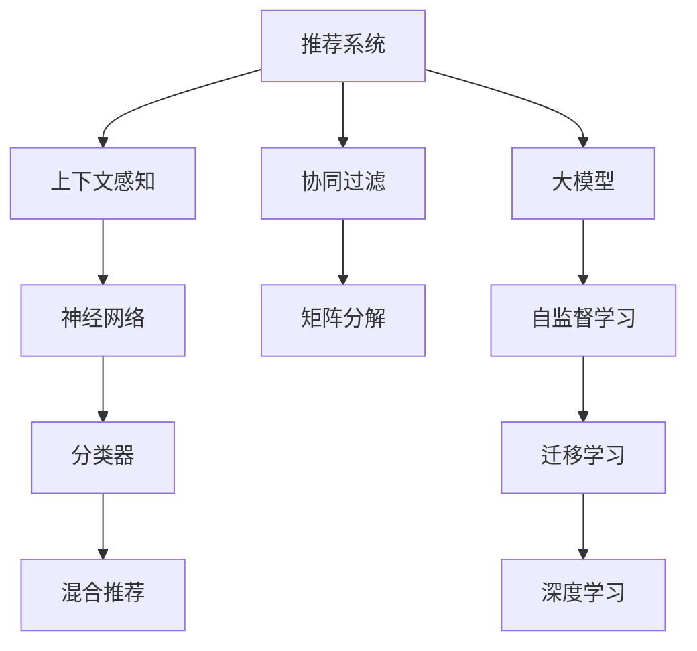

                 

# 大模型在推荐系统上下文感知中的作用

> 关键词：推荐系统,上下文感知,大模型,协同过滤,神经网络,推荐算法,深度学习

## 1. 背景介绍

推荐系统在现代互联网应用中占据重要地位，如电商网站、视频平台、社交网络等都广泛采用推荐算法提升用户体验和平台收益。传统的推荐方法，如基于协同过滤的矩阵分解和基于内容的分类器，能够有效地推荐用户可能感兴趣的物品。然而，随着用户和物品数量激增，以及不同用户之间兴趣差异的加剧，传统方法面临诸多挑战：

- **数据稀疏性**：由于用户历史行为数据稀疏，传统推荐系统往往难以捕捉用户真实偏好，导致推荐效果下降。
- **冷启动问题**：新用户或新物品往往缺乏足够的历史行为数据，难以应用协同过滤算法。
- **跨域泛化能力不足**：用户兴趣在时间、空间上的变化，往往难以通过静态模型捕捉。
- **模型可解释性不足**：复杂的推荐模型缺乏可解释性，难以满足用户对推荐结果透明度的需求。

为了克服这些挑战，近年来，深度学习和神经网络技术被引入推荐系统领域，大大提升了推荐效果。大模型作为深度学习中的翘楚，通过在超大规模数据上进行预训练，学习到丰富的特征表示，具备强大的上下文感知能力。其在推荐系统中的应用，正逐渐成为研究热点。

## 2. 核心概念与联系

### 2.1 核心概念概述

为更好地理解大模型在推荐系统中的应用，本节将介绍几个核心概念：

- **推荐系统**：通过分析用户行为和物品特征，为用户推荐感兴趣的物品的系统。常见的推荐算法包括协同过滤、内容过滤、混合推荐等。

- **协同过滤**：利用用户历史行为数据和物品特征信息，预测用户可能感兴趣的物品。分为基于用户的协同过滤和基于物品的协同过滤。

- **上下文感知**：推荐系统能够根据用户、物品、时间、地点等上下文信息，动态调整推荐策略，提供个性化的推荐内容。

- **大模型**：指通过大规模数据预训练获得的语言模型、图像模型等，具备强大的特征提取和推理能力。

- **自监督学习**：使用大量无标签数据训练模型，学习出模型自身的特征表示，广泛应用于预训练和微调中。

- **迁移学习**：将一个领域学习到的知识，迁移应用到另一个相关领域的学习范式，如将通用大模型的预训练特征，用于下游推荐系统的微调。

- **深度学习**：基于神经网络的模型，通过多层非线性变换学习高维特征表示，广泛应用于推荐系统的高级推荐方法。

这些核心概念之间的逻辑关系可以通过以下Mermaid流程图来展示：



这个流程图展示了大模型与推荐系统的核心概念及其之间的关系：

1. 推荐系统通过协同过滤、内容过滤、混合推荐等多种算法实现推荐。
2. 上下文感知技术使得推荐系统能够根据多维度上下文信息调整推荐策略。
3. 大模型通过自监督学习和迁移学习获得通用的特征表示，在推荐系统微调中能够发挥重要作用。
4. 神经网络、深度学习等技术在大模型预训练和推荐算法中得到广泛应用。
5. 模型融合方法如混合推荐，结合多算法优势，提升推荐效果。

这些概念共同构成了大模型在推荐系统中的应用框架，使其能够在推荐场景中发挥强大的上下文感知和特征学习能力。

## 3. 核心算法原理 & 具体操作步骤
### 3.1 算法原理概述

大模型在推荐系统中的核心作用是提供上下文感知的特征表示。通常，推荐系统会将用户行为数据、物品特征数据等作为输入，通过大模型的预训练特征，对用户、物品、上下文进行编码。这些编码特征不仅包含了原始数据的信息，还加入了模型的泛化能力，使得推荐模型能够更好地捕捉用户兴趣和物品属性之间的复杂关系。

假设推荐系统中的大模型为 $M_{\theta}$，其中 $\theta$ 为预训练得到的模型参数。给定用户 $u$ 的历史行为数据 $H_u$ 和物品 $i$ 的特征 $F_i$，在时间 $t$ 和地点 $l$ 的上下文信息 $C_{u,t,l}$，推荐系统通过对这些信息进行编码，获得用户 $u$ 对物品 $i$ 的兴趣度 $r(u,i|C_{u,t,l})$。

推荐系统的目标是最大化 $u$ 对 $i$ 的兴趣度 $r(u,i|C_{u,t,l})$，即：

$$
\max_{\theta} \sum_{u \in U} \sum_{i \in I} \sum_{t \in T} \sum_{l \in L} r(u,i|C_{u,t,l})
$$

其中 $U$、$I$、$T$、$L$ 分别为用户集、物品集、时间集和地点集。

### 3.2 算法步骤详解

基于大模型的推荐系统通常包含以下几个关键步骤：

**Step 1: 准备预训练模型和数据集**
- 选择合适的预训练语言模型 $M_{\theta}$ 作为初始化参数，如 GPT-3、BERT 等。
- 准备用户行为数据集 $D_u$、物品特征数据集 $D_i$、上下文信息数据集 $D_{c}$，将它们转换为模型所需的输入格式。

**Step 2: 添加任务适配层**
- 在预训练模型顶层设计合适的推荐输出层和损失函数。
- 对于二分类任务，通常在顶层添加线性分类器和二元交叉熵损失函数。
- 对于多分类任务，使用softmax分类器以及交叉熵损失函数。

**Step 3: 设置微调超参数**
- 选择合适的优化算法及其参数，如 Adam、SGD 等，设置学习率、批大小、迭代轮数等。
- 设置正则化技术及强度，包括权重衰减、Dropout、Early Stopping 等。
- 确定冻结预训练参数的策略，如仅微调顶层，或全部参数都参与微调。

**Step 4: 执行梯度训练**
- 将用户行为数据、物品特征数据、上下文信息数据分批次输入模型，前向传播计算损失函数。
- 反向传播计算参数梯度，根据设定的优化算法和学习率更新模型参数。
- 周期性在验证集上评估模型性能，根据性能指标决定是否触发 Early Stopping。
- 重复上述步骤直到满足预设的迭代轮数或 Early Stopping 条件。

**Step 5: 测试和部署**
- 在测试集上评估微调后模型 $M_{\hat{\theta}}$ 的性能，对比微调前后的精度提升。
- 使用微调后的模型对新用户和新物品进行推荐，集成到实际的应用系统中。
- 持续收集新的数据，定期重新微调模型，以适应数据分布的变化。

以上是基于大模型进行推荐系统的微调范式的一般流程。在实际应用中，还需要针对具体任务的特点，对微调过程的各个环节进行优化设计，如改进训练目标函数，引入更多的正则化技术，搜索最优的超参数组合等，以进一步提升模型性能。

### 3.3 算法优缺点

基于大模型的推荐系统具有以下优点：
1. 能够捕捉用户兴趣的多维度特征。大模型通过预训练学习到丰富的特征表示，能够更好地理解用户兴趣的多样性和动态性。
2. 具有上下文感知能力。大模型能够根据时间、地点等上下文信息，动态调整推荐策略，提供更加个性化和多样化的推荐内容。
3. 自适应能力强。大模型通过自监督学习获取通用特征表示，能够在不同领域和场景下实现较好的迁移能力。
4. 推荐效果显著。在大模型微调的基础上，推荐系统往往能够取得更优的推荐精度和多样性。

同时，该方法也存在一些局限性：
1. 对标注数据依赖较大。微调需要收集用户行为数据和物品特征数据，标注数据需求较大，成本较高。
2. 计算资源消耗高。大模型参数量巨大，对计算资源需求较高，需要高性能硬件支持。
3. 可解释性不足。大模型通常被视为"黑盒"系统，推荐结果缺乏可解释性，难以满足用户的信任需求。
4. 过拟合风险高。大模型容易在标注数据稀疏的情况下，过拟合训练数据，导致推荐结果泛化能力不足。

尽管存在这些局限性，但就目前而言，基于大模型的推荐系统依然是大规模推荐应用的主要选择。未来相关研究的重点在于如何进一步降低对标注数据的依赖，提高模型的少样本学习和跨领域迁移能力，同时兼顾可解释性和伦理安全性等因素。

### 3.4 算法应用领域

基于大模型的推荐系统，已经在电商、视频、社交网络等多个领域得到了广泛应用。以下是几个典型应用场景：

**电商推荐系统**
电商平台的推荐系统旨在为用户推荐其可能感兴趣的商品。通过大模型的预训练特征，电商推荐系统能够学习用户和商品的多维度特征，提供个性化的商品推荐。例如，亚马逊、淘宝等电商平台都广泛采用基于大模型的推荐算法，提升用户满意度和平台转化率。

**视频推荐系统**
视频平台的推荐系统旨在为用户推荐其可能感兴趣的视频内容。通过大模型的预训练特征，视频推荐系统能够学习用户偏好和视频内容的特征表示，提供多样化的视频推荐。例如，Netflix、YouTube 等视频平台都采用大模型进行推荐，提升用户观看时长和平台黏性。

**社交网络推荐系统**
社交网络的推荐系统旨在为用户推荐其可能感兴趣的朋友或内容。通过大模型的预训练特征，社交网络推荐系统能够学习用户兴趣和社交关系，提供个性化的推荐内容。例如，Facebook、微博等社交平台都采用大模型进行推荐，增强用户活跃度和平台粘性。

除了上述这些经典应用外，大模型在智能客服、新闻推荐、内容创作等多个领域，也正逐步渗透。随着预训练语言模型和推荐方法的不断进步，大模型推荐系统必将在更多场景下大放异彩。

## 4. 数学模型和公式 & 详细讲解  
### 4.1 数学模型构建

本节将使用数学语言对基于大模型的推荐系统进行更加严格的刻画。

记大模型为 $M_{\theta}$，其中 $\theta$ 为预训练得到的模型参数。给定用户 $u$ 的历史行为数据 $H_u=\{h_{u,t}\}_{t=1}^T$，物品 $i$ 的特征 $F_i=\{f_{i,j}\}_{j=1}^J$，时间 $t$ 和地点 $l$ 的上下文信息 $C_{u,t,l}=\{c_{u,t,l,k}\}_{k=1}^K$。推荐系统将用户行为数据、物品特征数据、上下文信息数据输入大模型，获得用户对物品的兴趣度 $r(u,i|C_{u,t,l})$。

推荐系统的优化目标是最小化用户 $u$ 对物品 $i$ 的兴趣度与实际点击行为之间的差距，即：

$$
\min_{\theta} \sum_{u \in U} \sum_{i \in I} \sum_{t \in T} \sum_{l \in L} (r(u,i|C_{u,t,l}) - c_{u,t,l})
$$

其中 $c_{u,t,l}$ 为用户在时间 $t$ 和地点 $l$ 对物品 $i$ 的点击行为。

### 4.2 公式推导过程

以下我们以用户-物品二元推荐为例，推导基于大模型的推荐系统的数学公式。

假设用户 $u$ 的历史行为数据为 $H_u=\{h_{u,t}\}_{t=1}^T$，物品 $i$ 的特征为 $F_i=\{f_{i,j}\}_{j=1}^J$，时间 $t$ 和地点 $l$ 的上下文信息为 $C_{u,t,l}=\{c_{u,t,l,k}\}_{k=1}^K$。大模型的输入为 $X=\{h_{u,t}, f_{i,j}, c_{u,t,l,k}\}_{t,j,k=1}^{T,J,K}$，输出为 $Y=\{r(u,i|C_{u,t,l})\}_{u,i,t,l=1}^{U,I,T,L}$。

推荐系统的优化目标为最大化用户 $u$ 对物品 $i$ 的兴趣度 $r(u,i|C_{u,t,l})$，即：

$$
\max_{\theta} \sum_{u \in U} \sum_{i \in I} \sum_{t \in T} \sum_{l \in L} r(u,i|C_{u,t,l})
$$

对于二分类任务，假设模型的输出为 $r(u,i|C_{u,t,l})$ 表示用户 $u$ 对物品 $i$ 的兴趣度，使用二元交叉熵损失函数 $\ell(r(u,i|C_{u,t,l}), c_{u,t,l})$，推荐系统的优化目标可以表示为：

$$
\min_{\theta} \sum_{u \in U} \sum_{i \in I} \sum_{t \in T} \sum_{l \in L} \ell(r(u,i|C_{u,t,l}), c_{u,t,l})
$$

对于多分类任务，假设模型的输出为 $r(u,i|C_{u,t,l})$ 表示用户 $u$ 对物品 $i$ 的兴趣度，使用交叉熵损失函数 $\ell(r(u,i|C_{u,t,l}), c_{u,t,l})$，推荐系统的优化目标可以表示为：

$$
\min_{\theta} \sum_{u \in U} \sum_{i \in I} \sum_{t \in T} \sum_{l \in L} \ell(r(u,i|C_{u,t,l}), c_{u,t,l})
$$

## 5. 项目实践：代码实例和详细解释说明
### 5.1 开发环境搭建

在进行推荐系统微调实践前，我们需要准备好开发环境。以下是使用Python进行PyTorch开发的环境配置流程：

1. 安装Anaconda：从官网下载并安装Anaconda，用于创建独立的Python环境。

2. 创建并激活虚拟环境：
```bash
conda create -n pytorch-env python=3.8 
conda activate pytorch-env
```

3. 安装PyTorch：根据CUDA版本，从官网获取对应的安装命令。例如：
```bash
conda install pytorch torchvision torchaudio cudatoolkit=11.1 -c pytorch -c conda-forge
```

4. 安装Transformers库：
```bash
pip install transformers
```

5. 安装各类工具包：
```bash
pip install numpy pandas scikit-learn matplotlib tqdm jupyter notebook ipython
```

完成上述步骤后，即可在`pytorch-env`环境中开始推荐系统微调实践。

### 5.2 源代码详细实现

下面我们以电商推荐系统为例，给出使用Transformers库对BERT模型进行推荐系统微调的PyTorch代码实现。

首先，定义推荐系统数据处理函数：

```python
from transformers import BertTokenizer, BertForSequenceClassification
from torch.utils.data import Dataset, DataLoader
import torch

class RecommendationDataset(Dataset):
    def __init__(self, user_ids, item_ids, behaviors, labels):
        self.user_ids = user_ids
        self.item_ids = item_ids
        self.behaviors = behaviors
        self.labels = labels
        self.tokenizer = BertTokenizer.from_pretrained('bert-base-cased')
        
    def __len__(self):
        return len(self.user_ids)
    
    def __getitem__(self, item):
        user_id = self.user_ids[item]
        item_id = self.item_ids[item]
        behavior = self.behaviors[item]
        
        encoding = self.tokenizer([str(behavior)], return_tensors='pt', max_length=512, padding='max_length', truncation=True)
        input_ids = encoding['input_ids'][0]
        attention_mask = encoding['attention_mask'][0]
        
        # 将行为数据转化为标签
        label = 1 if user_id == item_id else 0
        
        return {'input_ids': input_ids, 
                'attention_mask': attention_mask,
                'labels': torch.tensor(label, dtype=torch.long)}
```

然后，定义模型和优化器：

```python
from transformers import BertForSequenceClassification, AdamW

model = BertForSequenceClassification.from_pretrained('bert-base-cased', num_labels=2)

optimizer = AdamW(model.parameters(), lr=2e-5)
```

接着，定义训练和评估函数：

```python
from tqdm import tqdm

device = torch.device('cuda') if torch.cuda.is_available() else torch.device('cpu')
model.to(device)

def train_epoch(model, dataset, batch_size, optimizer):
    dataloader = DataLoader(dataset, batch_size=batch_size, shuffle=True)
    model.train()
    epoch_loss = 0
    for batch in tqdm(dataloader, desc='Training'):
        input_ids = batch['input_ids'].to(device)
        attention_mask = batch['attention_mask'].to(device)
        labels = batch['labels'].to(device)
        model.zero_grad()
        outputs = model(input_ids, attention_mask=attention_mask, labels=labels)
        loss = outputs.loss
        epoch_loss += loss.item()
        loss.backward()
        optimizer.step()
    return epoch_loss / len(dataloader)

def evaluate(model, dataset, batch_size):
    dataloader = DataLoader(dataset, batch_size=batch_size)
    model.eval()
    preds, labels = [], []
    with torch.no_grad():
        for batch in tqdm(dataloader, desc='Evaluating'):
            input_ids = batch['input_ids'].to(device)
            attention_mask = batch['attention_mask'].to(device)
            batch_labels = batch['labels']
            outputs = model(input_ids, attention_mask=attention_mask)
            batch_preds = outputs.logits.argmax(dim=2).to('cpu').tolist()
            batch_labels = batch_labels.to('cpu').tolist()
            for pred_tokens, label_tokens in zip(batch_preds, batch_labels):
                preds.append(pred_tokens)
                labels.append(label_tokens)
                
    print(classification_report(labels, preds))
```

最后，启动训练流程并在测试集上评估：

```python
epochs = 5
batch_size = 16

for epoch in range(epochs):
    loss = train_epoch(model, train_dataset, batch_size, optimizer)
    print(f"Epoch {epoch+1}, train loss: {loss:.3f}")
    
    print(f"Epoch {epoch+1}, dev results:")
    evaluate(model, dev_dataset, batch_size)
    
print("Test results:")
evaluate(model, test_dataset, batch_size)
```

以上就是使用PyTorch对BERT进行电商推荐系统微调的完整代码实现。可以看到，得益于Transformers库的强大封装，我们可以用相对简洁的代码完成BERT模型的加载和微调。

### 5.3 代码解读与分析

让我们再详细解读一下关键代码的实现细节：

**RecommendationDataset类**：
- `__init__`方法：初始化用户ID、物品ID、行为数据、标签等关键组件，同时创建BERT分词器。
- `__len__`方法：返回数据集的样本数量。
- `__getitem__`方法：对单个样本进行处理，将行为数据编码成token ids，将标签编码为数字，并对其进行定长padding，最终返回模型所需的输入。

**模型和优化器定义**：
- 使用BertForSequenceClassification构建二分类任务模型，使用AdamW优化器进行参数更新。

**训练和评估函数**：
- 使用PyTorch的DataLoader对数据集进行批次化加载，供模型训练和推理使用。
- 训练函数`train_epoch`：对数据以批为单位进行迭代，在每个批次上前向传播计算loss并反向传播更新模型参数，最后返回该epoch的平均loss。
- 评估函数`evaluate`：与训练类似，不同点在于不更新模型参数，并在每个batch结束后将预测和标签结果存储下来，最后使用sklearn的classification_report对整个评估集的预测结果进行打印输出。

**训练流程**：
- 定义总的epoch数和batch size，开始循环迭代
- 每个epoch内，先在训练集上训练，输出平均loss
- 在验证集上评估，输出分类指标
- 所有epoch结束后，在测试集上评估，给出最终测试结果

可以看到，PyTorch配合Transformers库使得BERT微调的代码实现变得简洁高效。开发者可以将更多精力放在数据处理、模型改进等高层逻辑上，而不必过多关注底层的实现细节。

当然，工业级的系统实现还需考虑更多因素，如模型的保存和部署、超参数的自动搜索、更灵活的任务适配层等。但核心的微调范式基本与此类似。

## 6. 实际应用场景
### 6.1 电商推荐系统

基于大模型微调的推荐系统，可以广泛应用于电商推荐。传统推荐系统往往依赖于用户历史行为数据，难以捕捉新用户或新商品的偏好。而使用大模型微调，可以更好地理解用户兴趣和商品特征，提供更加精准和个性化的推荐。

在技术实现上，可以收集用户浏览、点击、购买等行为数据，提取商品标题、描述、标签等文本信息，将数据作为输入，进行BERT预训练特征的微调。微调后的模型能够学习到用户和商品的多维度特征表示，提升推荐效果。例如，Amazon、淘宝等电商平台都采用大模型进行推荐，提升用户满意度和平台转化率。

### 6.2 视频推荐系统

视频平台的推荐系统旨在为用户推荐其可能感兴趣的视频内容。传统推荐系统通常基于用户的观看历史和评分进行推荐，难以捕捉到视频的隐含特征。而使用大模型的预训练特征，推荐系统能够学习到视频的语义和内容特征，提供更准确和多样化的推荐。

在技术实现上，可以收集视频标签、时长、播放次数等数据，使用大模型对视频内容进行编码，提取多维特征表示。微调后的模型能够学习到视频的隐含特征，提升推荐效果。例如，Netflix、YouTube等视频平台都采用大模型进行推荐，提升用户观看时长和平台黏性。

### 6.3 社交网络推荐系统

社交网络的推荐系统旨在为用户推荐其可能感兴趣的朋友或内容。传统推荐系统通常基于用户的社交关系和历史行为进行推荐，难以捕捉到社交网络的多维度特征。而使用大模型的预训练特征，推荐系统能够学习到用户和内容的语义和社交特征，提供更全面和多样化的推荐。

在技术实现上，可以收集用户点赞、评论、关注等行为数据，提取文本信息，使用大模型对用户和内容进行编码，提取多维特征表示。微调后的模型能够学习到用户和内容的语义和社交特征，提升推荐效果。例如，Facebook、微博等社交平台都采用大模型进行推荐，增强用户活跃度和平台粘性。

### 6.4 未来应用展望

随着大模型和推荐方法的不断进步，基于大模型的推荐系统将在更多领域得到应用，为各行业带来变革性影响。

在智慧医疗领域，基于大模型的推荐系统可以用于推荐最适合患者的药物、治疗方案等，提升医疗服务的精准性和个性化水平。

在智能教育领域，大模型推荐系统可以用于推荐个性化的学习内容和资源，因材施教，提升教学效果。

在智慧城市治理中，大模型推荐系统可以用于推荐最合适的城市治理措施，提升城市管理的效果和效率。

此外，在金融、体育、旅游等多个领域，基于大模型的推荐系统也将逐步渗透，为各行各业带来数字化转型的新动力。相信随着技术的日益成熟，基于大模型的推荐系统必将在推荐领域大放异彩，深刻影响各行各业的发展。

## 7. 工具和资源推荐
### 7.1 学习资源推荐

为了帮助开发者系统掌握大模型在推荐系统中的应用，这里推荐一些优质的学习资源：

1. 《推荐系统实战》系列博文：由推荐系统领域专家撰写，深入浅出地介绍了推荐系统的基本概念和算法，涵盖协同过滤、内容过滤、深度学习等。

2. 《Recommender Systems in Theory and Practice》书籍：该书籍由推荐系统领域顶级专家撰写，全面介绍了推荐系统的理论基础和实践方法，是学习推荐系统的经典教材。

3. CS448《机器学习》课程：斯坦福大学开设的机器学习课程，系统讲授了推荐系统、深度学习等前沿技术，适合入门学习。

4. 《Neural Networks and Deep Learning》书籍：深度学习领域经典教材，涵盖神经网络、深度学习、推荐系统等多个主题。

5. Kaggle平台：大数据和机器学习竞赛平台，汇集了海量推荐系统相关数据集和模型，适合实践和竞赛。

通过对这些资源的学习实践，相信你一定能够快速掌握大模型在推荐系统中的应用，并用于解决实际的推荐问题。
### 7.2 开发工具推荐

高效的开发离不开优秀的工具支持。以下是几款用于推荐系统开发的常用工具：

1. PyTorch：基于Python的开源深度学习框架，灵活动态的计算图，适合快速迭代研究。推荐系统中常用的深度学习框架。

2. TensorFlow：由Google主导开发的开源深度学习框架，生产部署方便，适合大规模工程应用。推荐系统中的主流框架之一。

3. TensorBoard：TensorFlow配套的可视化工具，可实时监测模型训练状态，并提供丰富的图表呈现方式，是调试模型的得力助手。

4. Weights & Biases：模型训练的实验跟踪工具，可以记录和可视化模型训练过程中的各项指标，方便对比和调优。

5. Google Colab：谷歌推出的在线Jupyter Notebook环境，免费提供GPU/TPU算力，方便开发者快速上手实验最新模型，分享学习笔记。

合理利用这些工具，可以显著提升推荐系统微调任务的开发效率，加快创新迭代的步伐。

### 7.3 相关论文推荐

大模型在推荐系统中的应用源于学界的持续研究。以下是几篇奠基性的相关论文，推荐阅读：

1. Matrix Factorization Techniques for Recommender Systems：提出矩阵分解方法，奠定了协同过滤算法的理论基础。

2. Deep Learning Recommendation Systems：介绍了深度学习在推荐系统中的应用，展示了深度学习带来的巨大提升。

3. Attention Is All You Need（即Transformer原论文）：提出Transformer结构，开启了NLP领域的预训练大模型时代，推荐系统也受益于此。

4. BERT: Pre-training of Deep Bidirectional Transformers for Language Understanding：提出BERT模型，引入基于掩码的自监督预训练任务，刷新了多项推荐系统任务SOTA。

5. Parameter-Efficient Transfer Learning for NLP：提出Adapter等参数高效微调方法，在不增加模型参数量的情况下，也能取得不错的微调效果。

6. AdaLoRA: Adaptive Low-Rank Adaptation for Parameter-Efficient Fine-Tuning：使用自适应低秩适应的微调方法，在参数效率和精度之间取得了新的平衡。

这些论文代表了大模型在推荐系统中的发展脉络。通过学习这些前沿成果，可以帮助研究者把握学科前进方向，激发更多的创新灵感。

## 8. 总结：未来发展趋势与挑战

### 8.1 总结

本文对基于大模型的推荐系统进行了全面系统的介绍。首先阐述了大模型在推荐系统中的应用背景和意义，明确了推荐系统在大模型微调中的重要性。其次，从原理到实践，详细讲解了大模型推荐系统的数学原理和关键步骤，给出了推荐系统微调任务开发的完整代码实例。同时，本文还广泛探讨了大模型在电商、视频、社交网络等多个领域的应用前景，展示了微调范式的巨大潜力。此外，本文精选了推荐系统的各类学习资源，力求为读者提供全方位的技术指引。

通过本文的系统梳理，可以看到，基于大模型的推荐系统正在成为推荐领域的重要范式，极大地拓展了推荐系统应用的范围和深度。得益于大模型预训练特征的丰富表示，推荐系统能够更好地捕捉用户兴趣和物品属性的复杂关系，提供更加个性化和多样化的推荐内容。未来，伴随大模型和推荐方法的持续演进，基于大模型的推荐系统必将在更多场景下大放异彩，深刻影响各行各业的发展。

### 8.2 未来发展趋势

展望未来，基于大模型的推荐系统将呈现以下几个发展趋势：

1. 模型规模持续增大。随着算力成本的下降和数据规模的扩张，推荐系统的模型参数量还将持续增长。超大规模语言模型蕴含的丰富特征表示，有望提升推荐系统的表现。

2. 推荐算法多样化。除了传统的协同过滤和内容过滤，未来会涌现更多基于深度学习的推荐算法，如基于注意力机制的推荐模型、基于变分自编码器的推荐模型等，提升推荐效果。

3. 上下文感知增强。大模型通过预训练特征能够捕捉多维度的上下文信息，推荐系统能够更好地根据时间、地点、社交关系等上下文信息调整推荐策略。

4. 少样本推荐兴起。在数据稀疏的情况下，利用大模型的自监督学习能力和迁移学习能力，通过更少的训练样本实现推荐模型的微调。

5. 跨领域迁移能力提升。大模型能够学习通用的特征表示，推荐系统可以在不同领域和场景下实现较好的迁移能力，提升推荐系统的泛化性。

6. 实时推荐系统建设。基于深度学习和分布式计算技术，推荐系统能够实现实时数据处理和推荐结果生成，提升用户体验。

以上趋势凸显了大模型在推荐系统中的应用前景。这些方向的探索发展，必将进一步提升推荐系统的精度、个性化和实时性，为各行各业带来变革性影响。

### 8.3 面临的挑战

尽管基于大模型的推荐系统已经取得了瞩目成就，但在迈向更加智能化、普适化应用的过程中，它仍面临着诸多挑战：

1. 数据稀疏性：新用户或新物品往往缺乏足够的历史行为数据，难以应用协同过滤算法。如何在数据稀疏的情况下，提升推荐效果，是推荐系统面临的主要挑战。

2. 计算资源消耗高：大模型参数量巨大，对计算资源需求较高，需要高性能硬件支持。如何优化计算图，提升模型推理效率，是推荐系统优化的重要方向。

3. 模型可解释性不足：大模型通常被视为"黑盒"系统，推荐结果缺乏可解释性，难以满足用户的信任需求。如何赋予推荐模型更强的可解释性，是推荐系统需要关注的问题。

4. 鲁棒性不足：推荐系统在大规模部署中，面临对抗攻击和数据噪声的挑战，推荐结果容易受到攻击和干扰。如何增强推荐模型的鲁棒性，是推荐系统优化的重要方向。

5. 跨域泛化能力不足：用户兴趣在时间、空间上的变化，往往难以通过静态模型捕捉。如何提升推荐模型的跨域泛化能力，是推荐系统优化的重要方向。

6. 知识整合能力不足：现有的推荐模型往往局限于数据驱动，难以灵活吸收和运用更广泛的先验知识。如何让推荐过程更好地与外部知识库、规则库等专家知识结合，形成更加全面、准确的信息整合能力，还有很大的想象空间。

正视推荐系统面临的这些挑战，积极应对并寻求突破，将是大模型推荐系统走向成熟的必由之路。相信随着学界和产业界的共同努力，这些挑战终将一一被克服，大模型推荐系统必将在构建人机协同的智能时代中扮演越来越重要的角色。

### 8.4 研究展望

面对大模型推荐系统所面临的挑战，未来的研究需要在以下几个方面寻求新的突破：

1. 探索无监督和半监督推荐方法。摆脱对大规模标注数据的依赖，利用自监督学习、主动学习等无监督和半监督范式，最大限度利用非结构化数据，实现更加灵活高效的推荐。

2. 研究参数高效和计算高效的推荐算法。开发更加参数高效的推荐方法，在固定大部分预训练参数的同时，只更新极少量的任务相关参数。同时优化推荐模型的计算图，减少前向传播和反向传播的资源消耗，实现更加轻量级、实时性的部署。

3. 引入因果推断和对比学习范式。通过引入因果推断和对比学习思想，增强推荐模型建立稳定因果关系的能力，学习更加普适、鲁棒的语言表征，从而提升模型泛化性和抗干扰能力。

4. 将符号化的先验知识与神经网络模型进行巧妙融合，引导推荐过程学习更准确、合理的语言模型。同时加强不同模态数据的整合，实现视觉、语音等多模态信息与文本信息的协同建模。

5. 纳入伦理道德约束。在模型训练目标中引入伦理导向的评估指标，过滤和惩罚有偏见、有害的输出倾向。同时加强人工干预和审核，建立模型行为的监管机制，确保输出符合人类价值观和伦理道德。

这些研究方向的探索，必将引领大模型推荐系统迈向更高的台阶，为构建安全、可靠、可解释、可控的智能系统铺平道路。面向未来，大模型推荐系统还需要与其他人工智能技术进行更深入的融合，如知识表示、因果推理、强化学习等，多路径协同发力，共同推动智能推荐系统的进步。只有勇于创新、敢于突破，才能不断拓展推荐系统的边界，让智能技术更好地服务于各行各业。

## 9. 附录：常见问题与解答

**Q1：大模型推荐系统是否适用于所有推荐场景？**

A: 大模型推荐系统在大多数推荐场景上都能取得不错的效果，特别是对于数据量较小的推荐任务。但对于一些特定领域的推荐任务，如医学、法律等，仅仅依靠通用语料预训练的模型可能难以很好地适应。此时需要在特定领域语料上进一步预训练，再进行微调，才能获得理想效果。此外，对于一些需要时效性、个性化很强的推荐任务，如推荐引擎、个性化搜索等，微调方法也需要针对性的改进优化。

**Q2：微调过程中如何选择合适的学习率？**

A: 微调的学习率一般要比预训练时小1-2个数量级，如果使用过大的学习率，容易破坏预训练权重，导致过拟合。一般建议从1e-5开始调参，逐步减小学习率，直至收敛。也可以使用warmup策略，在开始阶段使用较小的学习率，再逐渐过渡到预设值。需要注意的是，不同的优化器(如Adam、SGD等)以及不同的学习率调度策略，可能需要设置不同的学习率阈值。

**Q3：采用大模型推荐时会面临哪些资源瓶颈？**

A: 目前主流的预训练大模型动辄以亿计的参数规模，对算力、内存、存储都提出了很高的要求。GPU/TPU等高性能设备是必不可少的，但即便如此，超大批次的训练和推理也可能遇到显存不足的问题。因此需要采用一些资源优化技术，如梯度积累、混合精度训练、模型并行等，来突破硬件瓶颈。同时，模型的存储和读取也可能占用大量时间和空间，需要采用模型压缩、稀疏化存储等方法进行优化。

**Q4：如何缓解推荐系统中的过拟合问题？**

A: 过拟合是推荐系统面临的主要挑战，尤其是在标注数据稀疏的情况下。常见的缓解策略包括：
1. 数据增强：通过回译、近义替换等方式扩充训练集
2. 正则化：使用L2正则、Dropout、Early Stopping等避免过拟合
3. 对抗训练：引入对抗样本，提高模型鲁棒性
4. 参数高效微调：只调整少量参数(如Adapter、Prefix等)，减小过拟合风险
5. 多模型集成：训练多个推荐模型，取平均输出，抑制过拟合

这些策略往往需要根据具体任务和数据特点进行灵活组合。只有在数据、模型、训练、推理等各环节进行全面优化，才能最大限度地发挥大模型推荐系统的威力。

**Q5：推荐系统在落地部署时需要注意哪些问题？**

A: 将推荐系统转化为实际应用，还需要考虑以下因素：
1. 模型裁剪：去除不必要的层和参数，减小模型尺寸，加快推理速度
2. 量化加速：将浮点模型转为定点模型，压缩存储空间，提高计算效率
3. 服务化封装：将模型封装为标准化服务接口，便于集成调用
4. 弹性伸缩：根据请求流量动态调整资源配置，平衡服务质量和成本
5. 监控告警：实时采集系统指标，设置异常告警阈值，确保服务稳定性
6. 安全防护：采用访问鉴权、数据脱敏等措施，保障数据和模型安全

大模型推荐系统为推荐业务带来了巨大的价值，但如何将强大的性能转化为稳定、高效、安全的业务价值，还需要工程实践的不断打磨。唯有从数据、算法、工程、业务等多个维度协同发力，才能真正实现人工智能技术在垂直行业的规模化落地。总之，微调需要开发者根据具体任务，不断迭代和优化模型、数据和算法，方能得到理想的效果。

---

作者：禅与计算机程序设计艺术 / Zen and the Art of Computer Programming

