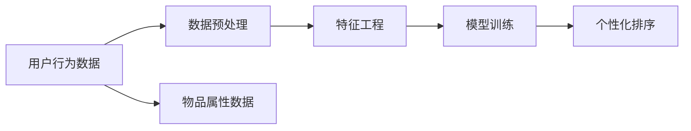

                 

# 大模型在推荐系统个性化排序中的应用

> 关键词：大模型,推荐系统,个性化排序,协同过滤,深度学习,特征工程,优化算法,案例分析

## 1. 背景介绍

### 1.1 问题由来

推荐系统（Recommendation System）是互联网时代重要的技术之一，通过分析用户行为和物品属性，为用户提供个性化的商品、内容、信息等推荐。随着数据量和用户量的爆炸性增长，传统基于协同过滤（Collaborative Filtering, CF）的推荐系统面临了诸多挑战，如数据稀疏性、冷启动、多样性、新颖性等。

与此同时，深度学习技术在NLP、图像、语音等领域取得了显著进展，以其强大的建模能力，开始被引入推荐系统中，成为新的重要分支。其中，以大模型（Large Model）为基础的推荐系统，因其具备丰富的知识表示和强大的表达能力，正逐渐成为行业关注的新焦点。

### 1.2 问题核心关键点

大模型在推荐系统中的应用，主要是通过学习用户行为和物品属性之间的复杂关系，生成更精准的个性化排序。在实际应用中，大模型可以通过以下方式改进推荐效果：

1. **捕捉长尾行为**：大模型能够从大量的行为数据中学习到长尾行为模式，发现传统协同过滤难以覆盖的潜在需求。
2. **扩展知识图谱**：大模型可以融合知识图谱，获取结构化知识，提升推荐系统的全面性和准确性。
3. **增强上下文理解**：大模型可以理解用户的上下文信息，如时间、地点、设备等，提供更情境化的推荐。
4. **缓解冷启动问题**：大模型通过自我学习，可以从有限的样本中学习到用户的长期偏好，解决冷启动难题。
5. **减少参数开销**：相比传统小模型，大模型的参数量虽然大，但其在大规模数据下的性能表现通常优于小模型。

大模型在推荐系统中的应用，涵盖了从特征提取、知识融合到模型训练、推荐排序的各个环节，展示了其在推荐系统中的强大潜力。

### 1.3 问题研究意义

大模型在推荐系统中的应用，对于提升用户体验、提高平台收益、促进电商及内容领域的数字化转型具有重要意义：

1. **提升用户体验**：通过个性化排序，推荐系统能够满足用户多样化的需求，增加用户粘性。
2. **提高平台收益**：推荐系统能够精准推送高价值商品，提高销售转化率，增加平台收益。
3. **促进数字化转型**：推荐系统在电商、内容、金融等领域的应用，能够驱动数字化转型，优化资源配置。

未来，随着大模型的不断演进和优化，推荐系统将进一步提升其精准度和智能化水平，成为新基建的重要组成部分。

## 2. 核心概念与联系

### 2.1 核心概念概述

为更好地理解大模型在推荐系统中的应用，本节将介绍几个关键概念：

- 推荐系统（Recommendation System, RS）：通过分析和理解用户的行为和偏好，为用户推荐感兴趣的商品、内容、信息等。
- 协同过滤（Collaborative Filtering, CF）：基于用户或物品的行为数据，预测用户或物品的偏好。
- 深度学习（Deep Learning, DL）：基于多层神经网络结构，从数据中学习复杂非线性关系。
- 大模型（Large Model）：参数量超大规模的神经网络模型，如BERT、GPT、Transformer等。
- 特征工程（Feature Engineering）：通过特征选择、提取、组合等方法，提升模型的表达能力和预测精度。
- 优化算法（Optimization Algorithm）：用于训练模型的算法，如梯度下降、Adam等。
- 个性化排序（Personalized Ranking）：根据用户偏好和行为，对物品进行排序，生成个性化推荐。

这些概念之间存在紧密的联系，共同构成了大模型在推荐系统中的应用框架。

通过理解这些关键概念，我们可以更好地把握大模型在推荐系统中的应用场景和优化方向。

## 3. 核心算法原理 & 具体操作步骤
### 3.1 算法原理概述

大模型在推荐系统中的应用，主要涉及以下几个步骤：

1. **数据预处理**：收集用户行为数据和物品属性数据，进行清洗、归一化等预处理操作。
2. **特征工程**：通过特征选择、提取、组合等方法，生成模型所需的输入特征。
3. **模型训练**：在预处理后的数据上，使用大模型进行特征提取和关系学习，得到用户-物品相似度矩阵。
4. **个性化排序**：根据用户行为和偏好，对物品进行排序，生成个性化推荐结果。

大模型推荐系统的一般流程如图1所示：



### 3.2 算法步骤详解

#### 3.2.1 数据预处理

数据预处理是大模型应用的基础步骤。具体步骤如下：

1. **数据收集**：收集用户行为数据和物品属性数据。用户行为数据包括点击、浏览、购买等行为，物品属性数据包括商品名称、类别、描述等。

2. **数据清洗**：去除噪音数据、缺失值，修正异常值，确保数据质量和完整性。

3. **数据归一化**：对不同特征进行归一化处理，如Z-score标准化、最大最小值归一化等，确保数据分布一致。

4. **数据采样**：对数据进行采样处理，如随机采样、分层采样等，确保样本多样性。

#### 3.2.2 特征工程

特征工程是大模型应用的核心步骤。具体步骤如下：

1. **特征选择**：选择对模型预测有帮助的特征，去除无关特征，提升模型效率。

2. **特征提取**：通过降维、编码等方法，将高维稀疏特征转化为低维稠密特征，提升模型表达能力。

3. **特征组合**：通过交叉、组合等方法，生成新的复合特征，增强模型预测能力。

4. **特征融合**：将不同来源的特征进行融合，如用户特征、物品特征、上下文特征等，提升模型泛化能力。

#### 3.2.3 模型训练

模型训练是大模型应用的关键步骤。具体步骤如下：

1. **模型选择**：选择合适的深度学习模型，如CNN、RNN、Transformer等。

2. **参数初始化**：初始化模型参数，使用预训练模型或随机初始化。

3. **数据输入**：将预处理后的数据输入模型，进行特征提取和关系学习。

4. **损失函数**：选择适当的损失函数，如均方误差、交叉熵等，衡量模型预测与实际标签的差异。

5. **优化算法**：选择适当的优化算法，如梯度下降、Adam等，更新模型参数。

6. **超参数调优**：调整学习率、批大小、迭代轮数等超参数，优化模型性能。

#### 3.2.4 个性化排序

个性化排序是大模型应用的最终步骤。具体步骤如下：

1. **模型预测**：根据用户行为和物品属性，使用大模型预测物品与用户的相似度。

2. **排序算法**：根据预测相似度，使用排序算法对物品进行排序，生成个性化推荐结果。

3. **推荐展示**：将推荐结果展示给用户，并进行后续反馈收集。

### 3.3 算法优缺点

大模型在推荐系统中的应用，具有以下优点：

1. **强大的建模能力**：大模型能够学习复杂非线性关系，捕捉长尾行为模式，提升推荐效果。
2. **丰富的知识表示**：大模型可以融合知识图谱，获取结构化知识，增强推荐系统的全面性和准确性。
3. **自适应性强**：大模型可以通过自适应学习，从少量样本中学习用户长期偏好，缓解冷启动问题。
4. **参数量较大**：虽然大模型参数量大，但其在大规模数据下的性能表现通常优于小模型。

同时，大模型在推荐系统中的应用，也存在一些缺点：

1. **计算成本高**：大模型参数量较大，计算复杂度较高，需要高性能硬件支持。
2. **训练时间长**：大模型训练时间长，需要较长的迭代次数和较大的计算资源。
3. **数据依赖强**：大模型效果依赖于高质量的数据和标注，数据标注成本较高。

尽管存在这些局限性，但大模型在推荐系统中的应用前景广阔，未来需进一步优化计算效率，降低训练成本，提升模型性能。

### 3.4 算法应用领域

大模型在推荐系统中的应用，已经涵盖了多个领域，包括电商、内容、金融等。以下是几个典型的应用场景：

1. **电商推荐**：电商推荐系统通过用户行为数据和物品属性数据，为用户推荐商品。大模型可以通过学习长尾行为模式，提升推荐效果，帮助电商平台提升用户粘性和销售额。

2. **内容推荐**：内容推荐系统通过用户行为数据和文章属性数据，为用户推荐文章。大模型可以通过学习结构化知识，提升推荐系统的全面性和准确性，满足用户多样化的需求。

3. **金融推荐**：金融推荐系统通过用户行为数据和金融产品属性数据，为用户推荐金融产品。大模型可以通过学习用户长期偏好，缓解冷启动问题，提升推荐系统的覆盖率和收益。

未来，随着大模型的不断演进和优化，其在推荐系统中的应用将更加广泛，为各行各业带来更多机遇和挑战。

## 4. 数学模型和公式 & 详细讲解  
### 4.1 数学模型构建

大模型在推荐系统中的应用，涉及多个数学模型和公式。以下是主要数学模型的构建：

#### 4.1.1 用户-物品相似度矩阵

用户-物品相似度矩阵（User-Item Similarity Matrix）是推荐系统的核心矩阵，用于衡量用户与物品之间的相似度。其构建公式如下：

$$
S_{ui} = \sum_k \alpha_k \cdot f(x_{ui}, y_k)
$$

其中，$S_{ui}$ 表示用户 $u$ 与物品 $i$ 的相似度，$x_{ui}$ 表示用户 $u$ 对物品 $i$ 的评分，$y_k$ 表示物品 $i$ 的特征向量，$f(x_{ui}, y_k)$ 表示用户-物品相似度函数，$\alpha_k$ 表示特征向量的权重。

#### 4.1.2 推荐排序公式

推荐排序公式（Recommendation Ranking Formula）用于对物品进行排序，生成个性化推荐结果。其构建公式如下：

$$
R_i = \text{softmax}(\sum_j \beta_j \cdot S_{uj})
$$

其中，$R_i$ 表示物品 $i$ 的推荐得分，$S_{uj}$ 表示用户 $u$ 与物品 $j$ 的相似度，$\beta_j$ 表示物品 $j$ 的权重。

### 4.2 公式推导过程

#### 4.2.1 用户-物品相似度矩阵

用户-物品相似度矩阵的构建过程，涉及特征向量的生成和相似度函数的计算。以Transformer模型为例，其生成过程如下：

1. **特征向量生成**：对用户行为数据和物品属性数据进行编码，生成用户和物品的特征向量。
2. **相似度函数计算**：使用Transformer模型计算用户和物品之间的相似度，生成用户-物品相似度矩阵。

#### 4.2.2 推荐排序公式

推荐排序公式的计算过程，涉及用户-物品相似度矩阵和物品权重的计算。以softmax函数为例，其计算过程如下：

1. **相似度矩阵计算**：根据用户行为数据和物品属性数据，计算用户-物品相似度矩阵。
2. **物品权重计算**：对物品属性数据进行编码，生成物品的权重向量。
3. **推荐得分计算**：根据相似度矩阵和物品权重向量，计算物品的推荐得分。
4. **推荐排序**：使用softmax函数对物品得分进行归一化处理，生成推荐排序结果。

### 4.3 案例分析与讲解

以电商推荐系统为例，分析大模型的应用过程：

#### 4.3.1 数据预处理

电商推荐系统需要收集用户行为数据和商品属性数据。具体步骤包括：

1. **数据收集**：收集用户的点击、浏览、购买等行为数据，商品的类别、描述、价格等属性数据。
2. **数据清洗**：去除噪音数据、缺失值，修正异常值，确保数据质量和完整性。
3. **数据归一化**：对不同特征进行归一化处理，如Z-score标准化、最大最小值归一化等，确保数据分布一致。
4. **数据采样**：对数据进行随机采样，确保样本多样性。

#### 4.3.2 特征工程

电商推荐系统需要生成模型所需的输入特征。具体步骤如下：

1. **特征选择**：选择对模型预测有帮助的特征，去除无关特征，提升模型效率。
2. **特征提取**：通过降维、编码等方法，将高维稀疏特征转化为低维稠密特征，提升模型表达能力。
3. **特征组合**：通过交叉、组合等方法，生成新的复合特征，增强模型预测能力。
4. **特征融合**：将用户特征、物品特征、上下文特征等进行融合，提升模型泛化能力。

#### 4.3.3 模型训练

电商推荐系统需要在大模型上进行特征提取和关系学习。具体步骤如下：

1. **模型选择**：选择Transformer模型，作为特征提取和关系学习的核心模型。
2. **参数初始化**：初始化模型参数，使用预训练模型或随机初始化。
3. **数据输入**：将预处理后的数据输入模型，进行特征提取和关系学习。
4. **损失函数**：选择均方误差损失函数，衡量模型预测与实际标签的差异。
5. **优化算法**：选择Adam优化算法，更新模型参数。
6. **超参数调优**：调整学习率、批大小、迭代轮数等超参数，优化模型性能。

#### 4.3.4 个性化排序

电商推荐系统需要根据用户行为和物品属性，对物品进行排序，生成个性化推荐结果。具体步骤如下：

1. **模型预测**：根据用户行为数据和商品属性数据，使用Transformer模型预测用户对商品评分。
2. **排序算法**：根据评分和物品权重向量，使用softmax函数对物品进行排序，生成个性化推荐结果。
3. **推荐展示**：将推荐结果展示给用户，并进行后续反馈收集。

## 5. 项目实践：代码实例和详细解释说明
### 5.1 开发环境搭建

在进行电商推荐系统的实践时，需要准备好开发环境。以下是使用Python进行PyTorch开发的环境配置流程：

1. 安装Anaconda：从官网下载并安装Anaconda，用于创建独立的Python环境。

2. 创建并激活虚拟环境：
```bash
conda create -n pytorch-env python=3.8 
conda activate pytorch-env
```

3. 安装PyTorch：根据CUDA版本，从官网获取对应的安装命令。例如：
```bash
conda install pytorch torchvision torchaudio cudatoolkit=11.1 -c pytorch -c conda-forge
```

4. 安装Transformers库：
```bash
pip install transformers
```

5. 安装各类工具包：
```bash
pip install numpy pandas scikit-learn matplotlib tqdm jupyter notebook ipython
```

完成上述步骤后，即可在`pytorch-env`环境中开始电商推荐系统的实践。

### 5.2 源代码详细实现

我们以电商推荐系统为例，给出使用Transformers库对预训练模型进行微调的PyTorch代码实现。

首先，定义电商推荐系统的数据处理函数：

```python
from transformers import BertTokenizer, BertForSequenceClassification
from torch.utils.data import Dataset
import torch

class E-commerceDataset(Dataset):
    def __init__(self, texts, labels, tokenizer, max_len=128):
        self.texts = texts
        self.labels = labels
        self.tokenizer = tokenizer
        self.max_len = max_len
        
    def __len__(self):
        return len(self.texts)
    
    def __getitem__(self, item):
        text = self.texts[item]
        label = self.labels[item]
        
        encoding = self.tokenizer(text, return_tensors='pt', max_length=self.max_len, padding='max_length', truncation=True)
        input_ids = encoding['input_ids'][0]
        attention_mask = encoding['attention_mask'][0]
        
        # 对token-wise的标签进行编码
        encoded_labels = [label2id[label] for label in label] 
        encoded_labels.extend([label2id['O']] * (self.max_len - len(encoded_labels)))
        labels = torch.tensor(encoded_labels, dtype=torch.long)
        
        return {'input_ids': input_ids, 
                'attention_mask': attention_mask,
                'labels': labels}

# 标签与id的映射
label2id = {'O': 0, 'CART': 1, 'TRADE': 2, 'REVIEW': 3}
id2label = {v: k for k, v in label2id.items()}

# 创建dataset
tokenizer = BertTokenizer.from_pretrained('bert-base-cased')

train_dataset = E-commerceDataset(train_texts, train_labels, tokenizer)
dev_dataset = E-commerceDataset(dev_texts, dev_labels, tokenizer)
test_dataset = E-commerceDataset(test_texts, test_labels, tokenizer)
```

然后，定义模型和优化器：

```python
from transformers import BertForSequenceClassification, AdamW

model = BertForSequenceClassification.from_pretrained('bert-base-cased', num_labels=len(label2id))

optimizer = AdamW(model.parameters(), lr=2e-5)
```

接着，定义训练和评估函数：

```python
from torch.utils.data import DataLoader
from tqdm import tqdm
from sklearn.metrics import classification_report

device = torch.device('cuda') if torch.cuda.is_available() else torch.device('cpu')
model.to(device)

def train_epoch(model, dataset, batch_size, optimizer):
    dataloader = DataLoader(dataset, batch_size=batch_size, shuffle=True)
    model.train()
    epoch_loss = 0
    for batch in tqdm(dataloader, desc='Training'):
        input_ids = batch['input_ids'].to(device)
        attention_mask = batch['attention_mask'].to(device)
        labels = batch['labels'].to(device)
        model.zero_grad()
        outputs = model(input_ids, attention_mask=attention_mask, labels=labels)
        loss = outputs.loss
        epoch_loss += loss.item()
        loss.backward()
        optimizer.step()
    return epoch_loss / len(dataloader)

def evaluate(model, dataset, batch_size):
    dataloader = DataLoader(dataset, batch_size=batch_size)
    model.eval()
    preds, labels = [], []
    with torch.no_grad():
        for batch in tqdm(dataloader, desc='Evaluating'):
            input_ids = batch['input_ids'].to(device)
            attention_mask = batch['attention_mask'].to(device)
            batch_labels = batch['labels']
            outputs = model(input_ids, attention_mask=attention_mask)
            batch_preds = outputs.logits.argmax(dim=2).to('cpu').tolist()
            batch_labels = batch_labels.to('cpu').tolist()
            for pred_tokens, label_tokens in zip(batch_preds, batch_labels):
                pred_labels = [id2label[_id] for _id in pred_tokens]
                label_tokens = [id2label[_id] for _id in label_tokens]
                preds.append(pred_labels[:len(label_tokens)])
                labels.append(label_tokens)
                
    print(classification_report(labels, preds))
```

最后，启动训练流程并在测试集上评估：

```python
epochs = 5
batch_size = 16

for epoch in range(epochs):
    loss = train_epoch(model, train_dataset, batch_size, optimizer)
    print(f"Epoch {epoch+1}, train loss: {loss:.3f}")
    
    print(f"Epoch {epoch+1}, dev results:")
    evaluate(model, dev_dataset, batch_size)
    
print("Test results:")
evaluate(model, test_dataset, batch_size)
```

以上就是使用PyTorch对BERT进行电商推荐任务微调的完整代码实现。可以看到，得益于Transformers库的强大封装，我们可以用相对简洁的代码完成BERT模型的加载和微调。

### 5.3 代码解读与分析

让我们再详细解读一下关键代码的实现细节：

**E-commerceDataset类**：
- `__init__`方法：初始化文本、标签、分词器等关键组件。
- `__len__`方法：返回数据集的样本数量。
- `__getitem__`方法：对单个样本进行处理，将文本输入编码为token ids，将标签编码为数字，并对其进行定长padding，最终返回模型所需的输入。

**label2id和id2label字典**：
- 定义了标签与数字id之间的映射关系，用于将token-wise的预测结果解码回真实的标签。

**训练和评估函数**：
- 使用PyTorch的DataLoader对数据集进行批次化加载，供模型训练和推理使用。
- 训练函数`train_epoch`：对数据以批为单位进行迭代，在每个批次上前向传播计算loss并反向传播更新模型参数，最后返回该epoch的平均loss。
- 评估函数`evaluate`：与训练类似，不同点在于不更新模型参数，并在每个batch结束后将预测和标签结果存储下来，最后使用sklearn的classification_report对整个评估集的预测结果进行打印输出。

**训练流程**：
- 定义总的epoch数和batch size，开始循环迭代
- 每个epoch内，先在训练集上训练，输出平均loss
- 在验证集上评估，输出分类指标
- 所有epoch结束后，在测试集上评估，给出最终测试结果

可以看到，PyTorch配合Transformers库使得BERT微调的代码实现变得简洁高效。开发者可以将更多精力放在数据处理、模型改进等高层逻辑上，而不必过多关注底层的实现细节。

当然，工业级的系统实现还需考虑更多因素，如模型的保存和部署、超参数的自动搜索、更灵活的任务适配层等。但核心的微调范式基本与此类似。

## 6. 实际应用场景
### 6.1 智能客服系统

基于大模型在电商推荐系统中的应用，智能客服系统也可以通过微调大模型，实现更加智能化的服务。

智能客服系统需要处理用户的问题和反馈，推荐相应的解决方案和资料。通过微调大模型，智能客服系统可以学习到用户的语义理解能力和问题解决策略，生成更具针对性的回答和建议。

在技术实现上，可以收集企业内部的历史客服对话记录，将问题和最佳答复构建成监督数据，在此基础上对预训练对话模型进行微调。微调后的对话模型能够自动理解用户意图，匹配最合适的解决方案，提高用户满意度。

### 6.2 金融舆情监测

金融机构需要实时监测市场舆论动向，以便及时应对负面信息传播，规避金融风险。基于大模型在电商推荐系统中的应用，金融舆情监测系统也可以通过微调大模型，实现更加智能化的舆情分析。

具体而言，可以收集金融领域相关的新闻、报道、评论等文本数据，并对其进行情感标注。在此基础上对预训练语言模型进行微调，使其能够自动判断文本情感倾向是正面、中性还是负面。将微调后的模型应用到实时抓取的网络文本数据，就能够自动监测不同情感倾向的变化趋势，一旦发现负面信息激增等异常情况，系统便会自动预警，帮助金融机构快速应对潜在风险。

### 6.3 个性化推荐系统

个性化推荐系统通过分析用户行为和物品属性，为用户推荐感兴趣的商品、内容、信息等。基于大模型在电商推荐系统中的应用，个性化推荐系统也可以通过微调大模型，实现更加精准和多样化的推荐。

具体而言，可以收集用户浏览、点击、评论、分享等行为数据，提取和用户交互的物品标题、描述、标签等文本内容。将文本内容作为模型输入，用户的后续行为（如是否点击、购买等）作为监督信号，在此基础上微调预训练语言模型。微调后的模型能够从文本内容中准确把握用户的兴趣点。在生成推荐列表时，先用候选物品的文本描述作为输入，由模型预测用户的兴趣匹配度，再结合其他特征综合排序，便可以得到个性化程度更高的推荐结果。

### 6.4 未来应用展望

随着大模型的不断演进和优化，基于大模型的推荐系统将在更多领域得到应用，为各行各业带来更多机遇和挑战。

在智慧医疗领域，基于大模型的医疗推荐系统可以推荐最适合的医疗方案，辅助医生诊疗，提升诊疗效率和效果。

在智能教育领域，基于大模型的教育推荐系统可以推荐最适合的教育资源，因材施教，提高教育质量。

在智慧城市治理中，基于大模型的城市推荐系统可以推荐最合适的公共服务和设施，提高城市管理的智能化水平，构建更安全、高效的未来城市。

此外，在企业生产、社会治理、文娱传媒等众多领域，基于大模型的推荐系统也将不断涌现，为经济社会发展注入新的动力。相信随着技术的日益成熟，大模型推荐技术将成为人工智能落地应用的重要范式，推动人工智能技术在垂直行业的规模化落地。

## 7. 工具和资源推荐
### 7.1 学习资源推荐

为了帮助开发者系统掌握大模型在推荐系统中的应用，这里推荐一些优质的学习资源：

1. 《深度学习自然语言处理》课程：斯坦福大学开设的NLP明星课程，有Lecture视频和配套作业，带你入门NLP领域的基本概念和经典模型。

2. 《Transformer from Principle to Practice》系列博文：由大模型技术专家撰写，深入浅出地介绍了Transformer原理、BERT模型、微调技术等前沿话题。

3. 《Recommendation Systems: Algorithms, Implementation and Applications》书籍：全面介绍了推荐系统的理论基础、算法实现和应用场景，适合深入学习推荐系统的研究。

4. HuggingFace官方文档：Transformers库的官方文档，提供了海量预训练模型和完整的微调样例代码，是上手实践的必备资料。

5. Arxiv和IEEE等学术平台：搜索最新的推荐系统研究论文，掌握最新动态和前沿方法。

通过对这些资源的学习实践，相信你一定能够快速掌握大模型在推荐系统中的应用，并用于解决实际的推荐问题。
###  7.2 开发工具推荐

高效的开发离不开优秀的工具支持。以下是几款用于大模型推荐系统开发的常用工具：

1. PyTorch：基于Python的开源深度学习框架，灵活动态的计算图，适合快速迭代研究。大部分预训练语言模型都有PyTorch版本的实现。

2. TensorFlow：由Google主导开发的开源深度学习框架，生产部署方便，适合大规模工程应用。同样有丰富的预训练语言模型资源。

3. Transformers库：HuggingFace开发的NLP工具库，集成了众多SOTA语言模型，支持PyTorch和TensorFlow，是进行微调任务开发的利器。

4. Weights & Biases：模型训练的实验跟踪工具，可以记录和可视化模型训练过程中的各项指标，方便对比和调优。与主流深度学习框架无缝集成。

5. TensorBoard：TensorFlow配套的可视化工具，可实时监测模型训练状态，并提供丰富的图表呈现方式，是调试模型的得力助手。

6. Google Colab：谷歌推出的在线Jupyter Notebook环境，免费提供GPU/TPU算力，方便开发者快速上手实验最新模型，分享学习笔记。

合理利用这些工具，可以显著提升大模型推荐系统的开发效率，加快创新迭代的步伐。

### 7.3 相关论文推荐

大模型在推荐系统中的应用，源于学界的持续研究。以下是几篇奠基性的相关论文，推荐阅读：

1. Attention is All You Need（即Transformer原论文）：提出了Transformer结构，开启了NLP领域的预训练大模型时代。

2. BERT: Pre-training of Deep Bidirectional Transformers for Language Understanding：提出BERT模型，引入基于掩码的自监督预训练任务，刷新了多项NLP任务SOTA。

3. Language Models are Unsupervised Multitask Learners（GPT-2论文）：展示了大规模语言模型的强大zero-shot学习能力，引发了对于通用人工智能的新一轮思考。

4. Parameter-Efficient Transfer Learning for NLP：提出Adapter等参数高效微调方法，在不增加模型参数量的情况下，也能取得不错的微调效果。

5. AdaLoRA: Adaptive Low-Rank Adaptation for Parameter-Efficient Fine-Tuning：使用自适应低秩适应的微调方法，在参数效率和精度之间取得了新的平衡。

这些论文代表了大模型在推荐系统中的应用研究脉络。通过学习这些前沿成果，可以帮助研究者把握学科前进方向，激发更多的创新灵感。

## 8. 总结：未来发展趋势与挑战

### 8.1 总结

本文对大模型在推荐系统中的应用进行了全面系统的介绍。首先阐述了大模型和推荐系统应用的现状和意义，明确了微调技术在提升推荐效果中的重要价值。其次，从原理到实践，详细讲解了大模型在推荐系统中的应用流程，给出了电商推荐系统的完整代码实现。同时，本文还广泛探讨了微调技术在智能客服、金融舆情、个性化推荐等多个领域的应用前景，展示了微调范式的巨大潜力。此外，本文精选了微调技术的各类学习资源，力求为读者提供全方位的技术指引。

通过本文的系统梳理，可以看到，大模型在推荐系统中的应用已经成为业界的研究热点，其强大的建模能力和大规模数据下的性能表现，为用户提供了更加精准和个性化的推荐。未来，随着大模型的不断演进和优化，推荐系统将进一步提升其精准度和智能化水平，成为新基建的重要组成部分。

### 8.2 未来发展趋势

展望未来，大模型在推荐系统中的应用将呈现以下几个发展趋势：

1. **更高效的学习范式**：未来将涌现更多高效的学习范式，如知识增强、自监督学习等，提升模型在大规模数据下的泛化能力和学习效率。

2. **更强的迁移能力**：通过迁移学习，大模型可以从其他领域的知识中学习到有用的信息，提升推荐系统的跨领域迁移能力。

3. **更个性化的推荐**：未来将更加注重个性化推荐，通过更加精准的用户行为建模和物品特征提取，提升推荐系统的个性化水平。

4. **更稳健的推荐系统**：未来将更加注重推荐系统的稳健性，通过引入对抗训练、鲁棒性优化等技术，提升推荐系统的鲁棒性和可解释性。

5. **更广泛的落地应用**：大模型推荐系统将广泛应用于电商、内容、金融等各个领域，推动更多行业数字化转型升级。

以上趋势凸显了大模型在推荐系统中的应用前景。这些方向的探索发展，必将进一步提升推荐系统的精准度和智能化水平，为各行各业带来更多机遇和挑战。

### 8.3 面临的挑战

尽管大模型在推荐系统中的应用已经取得了显著成效，但在迈向更加智能化、普适化应用的过程中，它仍面临诸多挑战：

1. **数据依赖强**：大模型效果依赖于高质量的数据和标注，数据标注成本较高。

2. **计算成本高**：大模型参数量大，计算复杂度较高，需要高性能硬件支持。

3. **模型泛化差**：传统的大模型容易过拟合，对于新数据泛化能力不足。

4. **模型可解释性不足**：大模型通常是“黑盒”系统，难以解释其内部工作机制和决策逻辑。

5. **模型鲁棒性不足**：大模型在面对对抗攻击或噪声数据时，鲁棒性不足。

尽管存在这些挑战，但大模型在推荐系统中的应用前景广阔，未来需进一步优化计算效率，降低训练成本，提升模型性能。

### 8.4 研究展望

面对大模型在推荐系统中的应用面临的挑战，未来的研究需要在以下几个方面寻求新的突破：

1. **更高效的参数高效微调**：开发更加参数高效的大模型，在固定大部分预训练参数的同时，只更新极少量的任务相关参数。

2. **更稳健的推荐算法**：引入对抗训练、鲁棒性优化等技术，提升推荐系统的鲁棒性和可解释性。

3. **更广泛的数据融合**：通过引入外部知识库、逻辑规则等，增强推荐系统的全面性和准确性。

4. **更个性化的推荐模型**：引入因果推断、强化学习等方法，提升推荐系统的个性化水平。

5. **更稳健的模型训练**：引入稀疏化训练、剪枝优化等技术，提升模型的稳健性和泛化能力。

6. **更广泛的落地应用**：推动大模型在更多领域的落地应用，推动各行各业数字化转型升级。

这些研究方向的探索，必将引领大模型在推荐系统中的应用走向更高的台阶，为构建安全、可靠、可解释、可控的智能系统铺平道路。面向未来，大模型推荐系统需要与其他人工智能技术进行更深入的融合，如知识表示、因果推理、强化学习等，多路径协同发力，共同推动自然语言理解和智能交互系统的进步。只有勇于创新、敢于突破，才能不断拓展大模型的应用边界，让智能技术更好地造福人类社会。

## 9. 附录：常见问题与解答

**Q1：大模型推荐系统的优势和劣势是什么？**

A: 大模型推荐系统的优势在于：
1. 强大的建模能力：大模型能够学习复杂非线性关系，捕捉长尾行为模式，提升推荐效果。
2. 丰富的知识表示：大模型可以融合知识图谱，获取结构化知识，增强推荐系统的全面性和准确性。
3. 自适应性强：大模型可以通过自适应学习，从少量样本中学习用户长期偏好，缓解冷启动问题。
4. 参数量较大：虽然大模型参数量大，但其在大规模数据下的性能表现通常优于小模型。

劣势在于：
1. 计算成本高：大模型参数量大，计算复杂度较高，需要高性能硬件支持。
2. 训练时间长：大模型训练时间长，需要较长的迭代次数和较大的计算资源。
3. 数据依赖强：大模型效果依赖于高质量的数据和标注，数据标注成本较高。

**Q2：大模型推荐系统如何缓解冷启动问题？**

A: 大模型推荐系统可以通过以下方法缓解冷启动问题：
1. 利用预训练模型：通过在大规模无标签数据上进行预训练，大模型可以学习到丰富的知识表示，从而更好地适应新用户和新物品。
2. 引入自适应学习：通过引入自适应学习机制，大模型可以根据新数据进行参数更新，逐步适应用户偏好。
3. 引入知识图谱：通过引入知识图谱，大模型可以获取结构化知识，提升推荐系统的全面性和准确性。
4. 引入领域特定模型：通过训练领域特定的大模型，可以更好地适应特定领域的应用场景。

这些方法可以综合使用，提升大模型推荐系统的冷启动能力。

**Q3：大模型推荐系统如何优化计算效率？**

A: 大模型推荐系统可以通过以下方法优化计算效率：
1. 使用参数高效微调：只更新极少量的任务相关参数，减少计算资源消耗。
2. 使用稀疏化训练：通过稀疏化训练方法，减少模型参数量，提升计算效率。
3. 使用剪枝优化：通过剪枝优化方法，减少模型复杂度，提升计算效率。
4. 使用混合精度训练：通过混合精度训练方法，减少计算资源消耗，提升训练速度。

这些方法可以综合使用，提升大模型推荐系统的计算效率。

**Q4：大模型推荐系统如何提高模型的鲁棒性？**

A: 大模型推荐系统可以通过以下方法提高模型的鲁棒性：
1. 引入对抗训练：通过引入对抗训练方法，大模型可以更好地应对对抗攻击和噪声数据。
2. 引入鲁棒性优化：通过引入鲁棒性优化方法，大模型可以提升对异常数据的处理能力。
3. 引入数据增强：通过引入数据增强方法，大模型可以提升对多样性数据的处理能力。
4. 引入多模型集成：通过引入多模型集成方法，大模型可以提升整体的鲁棒性和泛化能力。

这些方法可以综合使用，提升大模型推荐系统的鲁棒性。

**Q5：大模型推荐系统如何提高模型的可解释性？**

A: 大模型推荐系统可以通过以下方法提高模型的可解释性：
1. 引入可解释性优化：通过引入可解释性优化方法，大模型可以提升其决策的可解释性。
2. 引入可视化工具：通过引入可视化工具，大模型可以直观展示其内部工作机制和决策逻辑。
3. 引入因果推断：通过引入因果推断方法，大模型可以解释其推荐的因果关系。
4. 引入逻辑规则：通过引入逻辑规则，大模型可以解释其推荐的逻辑依据。

这些方法可以综合使用，提升大模型推荐系统的可解释性。

总之，大模型在推荐系统中的应用前景广阔，未来需进一步优化计算效率，降低训练成本，提升模型性能。只有勇于创新、敢于突破，才能不断拓展大模型的应用边界，让智能技术更好地造福人类社会。

