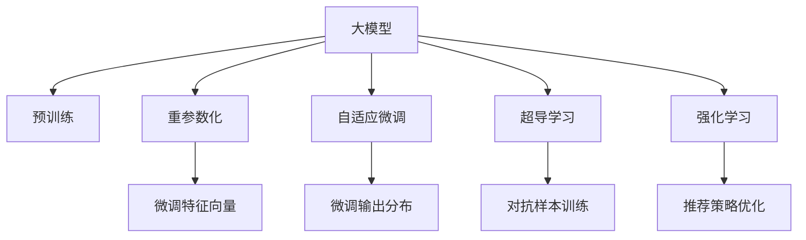

                 

# 大模型在推荐系统中的少样本学习应用

> 关键词：少样本学习,推荐系统,大模型,自适应,重参数化,超导学习,强化学习

## 1. 背景介绍

### 1.1 问题由来

推荐系统是互联网时代的重要技术之一，广泛应用于电商、新闻、社交网络、视频平台等诸多领域，为用户提供个性化的内容和产品推荐。传统的推荐系统往往依赖于大量用户行为数据进行模型训练，从而生成推荐结果。但实际应用中，收集这些数据往往成本高昂，且存在数据隐私和算法鲁棒性等问题。

近年来，随着深度学习技术的成熟，推荐系统开始尝试引入大模型，通过大规模无标签数据的预训练，学习通用的用户行为和物品特征表示。但即便如此，对于实际应用场景中的长尾用户和冷门物品，由于缺乏足够的标注数据，直接使用大模型进行微调仍然面临诸多困难。

少样本学习(Few-shot Learning)应运而生。它利用大模型的泛化能力，通过在极少量的标注样本上进行微调，即可生成满足特定需求的推荐模型。由于数据量小、计算成本低、可解释性高，少样本学习成为了推荐系统优化中的重要研究方向。

### 1.2 问题核心关键点

少样本学习主要解决以下问题：

1. 标注样本数量不足：推荐系统所需的用户行为数据通常只包含部分用户的少量操作记录，标注样本量有限，难以覆盖所有用户和物品。
2. 数据分布偏差：用户行为数据分布不均衡，部分用户或物品的样本量远远小于其他用户或物品，存在严重的分布偏差。
3. 模型泛化能力：传统微调方法依赖大量标注数据，难以泛化到未见过的数据上，特别是有部分用户或物品从未有过行为记录的情况下。
4. 计算成本高：推荐系统需要实时生成推荐结果，传统的微调方法需要大量计算资源和时间，难以应对实时性需求。

针对以上问题，本文将介绍几种基于少样本学习的推荐系统优化技术，包括重参数化方法、自适应微调、超导学习、强化学习等，结合大模型微调技术，提升推荐系统的性能和适用性。

## 2. 核心概念与联系

### 2.1 核心概念概述

为了更好地理解基于少样本学习的推荐系统优化方法，本文将介绍几个核心概念：

- **大模型(Pre-trained Model)**：以Transformer为代表的大规模深度学习模型，通过在大规模无标签数据上进行预训练，学习到丰富的特征表示。在推荐系统中，大模型可以作为用户和物品的表示学习器，生成用户-物品交互特征向量。
- **少样本学习(Few-shot Learning)**：指在大模型上进行微调时，只使用极少量的标注样本，通过强化预训练特征的泛化能力，快速生成特定场景下的推荐模型。
- **重参数化(Adaptation)**：指通过微调模型的参数，使其适应特定的应用场景和数据分布。在推荐系统中，重参数化可以实现对用户和物品特征向量的微调，提升推荐精度。
- **自适应微调(Adaptive Fine-Tuning)**：指在微调过程中，动态调整模型参数，以最大化模型的性能和泛化能力。在推荐系统中，自适应微调可以优化推荐模型的输出分布，适应不同用户的行为模式。
- **超导学习(Supervised Learning)**：指在标注样本有限的场景下，通过引入对抗样本、正则化等技术，提升模型的泛化能力和鲁棒性。在推荐系统中，超导学习可以通过对抗样本训练，增强推荐模型的鲁棒性。
- **强化学习(Reinforcement Learning, RL)**：指通过模拟和试错，训练模型在特定环境下的行为策略。在推荐系统中，强化学习可以优化模型的推荐策略，提升用户体验。

这些核心概念之间的逻辑关系可以通过以下Mermaid流程图来展示：



这个流程图展示了大模型在推荐系统中的主要优化手段，以及它们之间的相互关系。通过理解这些核心概念，我们可以更好地把握少样本学习在推荐系统中的应用方向。

## 3. 核心算法原理 & 具体操作步骤

### 3.1 算法原理概述

基于少样本学习的推荐系统优化方法，本质上是在预训练大模型的基础上，通过动态调整和重参数化，增强模型在特定场景下的泛化能力。

形式化地，假设推荐系统的用户行为数据集为 $D=\{(x_i,y_i)\}_{i=1}^N$，其中 $x_i$ 为用户和物品的特征向量，$y_i$ 为推荐标签（1表示正样本，0表示负样本）。

定义用户行为表示模型为 $f_{\theta}$，在数据集 $D$ 上的损失函数为 $\mathcal{L}(\theta)$。推荐系统优化的目标是最小化损失函数，即：

$$
\theta^* = \mathop{\arg\min}_{\theta} \mathcal{L}(\theta)
$$

具体优化方法通常包括重参数化、自适应微调、超导学习和强化学习等。不同方法的实现方式和目标函数略有不同，但核心目标均是使模型在特定场景下表现最佳。

### 3.2 算法步骤详解

基于少样本学习的推荐系统优化一般包括以下几个关键步骤：

**Step 1: 准备预训练模型和数据集**
- 选择合适的预训练语言模型 $f_{\theta}$ 作为初始化参数，如 BERT、GPT等。
- 准备推荐系统的用户行为数据集 $D$，划分为训练集、验证集和测试集。一般要求标注数据与预训练数据的分布不要差异过大。

**Step 2: 定义目标函数**
- 根据具体任务，定义损失函数。对于分类任务，可以采用交叉熵损失；对于排序任务，可以采用均方误差损失等。
- 引入正则化技术，如L2正则、Dropout、Early Stopping等，防止模型过度适应小规模训练集。
- 设计动态调整策略，如学习率调整、超参数搜索等，以提升模型性能。

**Step 3: 执行梯度训练**
- 将训练集数据分批次输入模型，前向传播计算损失函数。
- 反向传播计算参数梯度，根据设定的优化算法和学习率更新模型参数。
- 周期性在验证集上评估模型性能，根据性能指标决定是否触发 Early Stopping。
- 重复上述步骤直到满足预设的迭代轮数或 Early Stopping 条件。

**Step 4: 测试和部署**
- 在测试集上评估优化后的模型 $f_{\hat{\theta}}$ 的性能，对比微调前后的精度提升。
- 使用优化后的模型对新样本进行推理预测，集成到实际的应用系统中。
- 持续收集新的用户行为数据，定期重新微调模型，以适应数据分布的变化。

以上是基于少样本学习的推荐系统优化的一般流程。在实际应用中，还需要针对具体任务的特点，对优化过程的各个环节进行优化设计，如改进训练目标函数，引入更多的正则化技术，搜索最优的超参数组合等，以进一步提升模型性能。

### 3.3 算法优缺点

基于少样本学习的推荐系统优化方法具有以下优点：
1. 节省标注成本：少样本学习仅使用极少量的标注数据进行微调，大幅降低标注成本。
2. 泛化能力强：大模型的预训练特征具有较强的泛化能力，能够在少量标注数据上快速生成高性能推荐模型。
3. 可解释性强：少样本学习可以通过对预训练特征的调整，使模型输出更加透明可解释。
4. 实时性强：少样本学习可以在少量数据上快速生成推荐模型，满足实时推荐的需求。

但该方法也存在一定的局限性：
1. 数据分布偏差：标注数据较少时，可能存在数据分布偏差，影响模型的泛化能力。
2. 泛化能力有限：对于未见过的用户和物品，少样本学习模型的泛化能力可能不足。
3. 计算复杂度高：少样本学习模型需要进行重参数化调整，计算复杂度较高。

尽管存在这些局限性，但少样本学习在推荐系统中仍具有重要应用前景。特别是在标注数据稀缺和实时性要求较高的场景下，其优势更为明显。

### 3.4 算法应用领域

基于少样本学习的推荐系统优化方法，在实际应用中主要应用于以下几个领域：

1. 电商推荐：电商平台需要对用户浏览、点击、购买等行为进行实时推荐。通过少样本学习，电商系统可以更快地学习用户兴趣，生成个性化推荐列表。

2. 视频推荐：视频平台需要根据用户观影记录和评分，实时生成推荐视频列表。通过少样本学习，视频推荐系统可以高效学习用户喜好，提升推荐效果。

3. 社交网络推荐：社交网络需要根据用户点赞、评论等行为，实时推荐相关内容。通过少样本学习，社交网络推荐系统可以快速学习用户行为模式，生成推荐内容。

4. 新闻推荐：新闻平台需要根据用户阅读记录和反馈，实时推荐相关文章。通过少样本学习，新闻推荐系统可以更快地学习用户偏好，生成个性化新闻推荐。

5. 金融推荐：金融平台需要根据用户投资记录和交易数据，实时推荐金融产品。通过少样本学习，金融推荐系统可以高效学习用户投资偏好，生成个性化的投资建议。

## 4. 数学模型和公式 & 详细讲解 & 举例说明

### 4.1 数学模型构建

为了更好地理解基于少样本学习的推荐系统优化方法，我们首先需要构建一个简单的数学模型。假设推荐系统中的用户行为数据集为 $D=\{(x_i,y_i)\}_{i=1}^N$，其中 $x_i$ 为用户和物品的特征向量，$y_i$ 为推荐标签。我们定义用户行为表示模型为 $f_{\theta}$，目标是最小化损失函数 $\mathcal{L}(\theta)$。

假设 $\theta$ 为用户行为表示模型的参数，$x_i$ 为用户和物品的特征向量，$y_i$ 为推荐标签（1表示正样本，0表示负样本），则推荐系统的损失函数可以表示为：

$$
\mathcal{L}(\theta) = \frac{1}{N}\sum_{i=1}^N \ell(y_i, f_{\theta}(x_i))
$$

其中 $\ell$ 为损失函数，如交叉熵损失或均方误差损失。目标是最小化损失函数 $\mathcal{L}(\theta)$，即：

$$
\theta^* = \mathop{\arg\min}_{\theta} \mathcal{L}(\theta)
$$

### 4.2 公式推导过程

以下我们以交叉熵损失为例，推导其梯度计算公式。

假设用户行为表示模型 $f_{\theta}$ 在输入 $x_i$ 上的输出为 $\hat{y}_i = f_{\theta}(x_i)$，则交叉熵损失函数定义为：

$$
\ell(y_i, \hat{y}_i) = -y_i\log \hat{y}_i + (1-y_i)\log (1-\hat{y}_i)
$$

将其代入损失函数，得：

$$
\mathcal{L}(\theta) = -\frac{1}{N}\sum_{i=1}^N y_i\log f_{\theta}(x_i) + (1-y_i)\log (1-f_{\theta}(x_i))
$$

根据链式法则，损失函数对参数 $\theta_k$ 的梯度为：

$$
\frac{\partial \mathcal{L}(\theta)}{\partial \theta_k} = \frac{1}{N}\sum_{i=1}^N \frac{\partial \ell(y_i, f_{\theta}(x_i))}{\partial f_{\theta}(x_i)} \frac{\partial f_{\theta}(x_i)}{\partial \theta_k}
$$

其中 $\frac{\partial \ell(y_i, f_{\theta}(x_i))}{\partial f_{\theta}(x_i)}$ 为损失函数对模型输出的偏导数，可以进一步推导得到：

$$
\frac{\partial \ell(y_i, f_{\theta}(x_i))}{\partial f_{\theta}(x_i)} = -y_i \frac{1}{f_{\theta}(x_i)} + (1-y_i) \frac{1}{1-f_{\theta}(x_i)}
$$

在得到损失函数的梯度后，即可带入参数更新公式，完成模型的迭代优化。重复上述过程直至收敛，最终得到适应推荐任务的最优模型参数 $\theta^*$。

## 5. 项目实践：代码实例和详细解释说明

### 5.1 开发环境搭建

在进行推荐系统优化实践前，我们需要准备好开发环境。以下是使用Python进行PyTorch开发的环境配置流程：

1. 安装Anaconda：从官网下载并安装Anaconda，用于创建独立的Python环境。

2. 创建并激活虚拟环境：
```bash
conda create -n pytorch-env python=3.8 
conda activate pytorch-env
```

3. 安装PyTorch：根据CUDA版本，从官网获取对应的安装命令。例如：
```bash
conda install pytorch torchvision torchaudio cudatoolkit=11.1 -c pytorch -c conda-forge
```

4. 安装Transformers库：
```bash
pip install transformers
```

5. 安装各类工具包：
```bash
pip install numpy pandas scikit-learn matplotlib tqdm jupyter notebook ipython
```

完成上述步骤后，即可在`pytorch-env`环境中开始推荐系统优化实践。

### 5.2 源代码详细实现

这里我们以电商推荐系统为例，给出使用Transformers库对BERT模型进行少样本学习优化后的推荐模型代码实现。

首先，定义电商推荐系统的数据处理函数：

```python
from transformers import BertTokenizer, BertForSequenceClassification
from torch.utils.data import Dataset, DataLoader
import torch

class Item推荐Dataset(Dataset):
    def __init__(self, items, labels, tokenizer, max_len=128):
        self.items = items
        self.labels = labels
        self.tokenizer = tokenizer
        self.max_len = max_len
        
    def __len__(self):
        return len(self.items)
    
    def __getitem__(self, item):
        item = self.items[item]
        label = self.labels[item]
        
        encoding = self.tokenizer(item, return_tensors='pt', max_length=self.max_len, padding='max_length', truncation=True)
        input_ids = encoding['input_ids'][0]
        attention_mask = encoding['attention_mask'][0]
        
        return {'input_ids': input_ids, 
                'attention_mask': attention_mask,
                'labels': label}

# 定义标签与id的映射
label2id = {'好评': 1, '差评': 0}
id2label = {v: k for k, v in label2id.items()}

# 创建dataset
tokenizer = BertTokenizer.from_pretrained('bert-base-cased')

train_dataset = Item推荐Dataset(train_items, train_labels, tokenizer)
dev_dataset = Item推荐Dataset(dev_items, dev_labels, tokenizer)
test_dataset = Item推荐Dataset(test_items, test_labels, tokenizer)
```

然后，定义模型和优化器：

```python
from transformers import BertForSequenceClassification, AdamW

model = BertForSequenceClassification.from_pretrained('bert-base-cased', num_labels=len(label2id))

optimizer = AdamW(model.parameters(), lr=2e-5)
```

接着，定义训练和评估函数：

```python
from tqdm import tqdm
from sklearn.metrics import classification_report

device = torch.device('cuda') if torch.cuda.is_available() else torch.device('cpu')
model.to(device)

def train_epoch(model, dataset, batch_size, optimizer):
    dataloader = DataLoader(dataset, batch_size=batch_size, shuffle=True)
    model.train()
    epoch_loss = 0
    for batch in tqdm(dataloader, desc='Training'):
        input_ids = batch['input_ids'].to(device)
        attention_mask = batch['attention_mask'].to(device)
        labels = batch['labels'].to(device)
        model.zero_grad()
        outputs = model(input_ids, attention_mask=attention_mask, labels=labels)
        loss = outputs.loss
        epoch_loss += loss.item()
        loss.backward()
        optimizer.step()
    return epoch_loss / len(dataloader)

def evaluate(model, dataset, batch_size):
    dataloader = DataLoader(dataset, batch_size=batch_size)
    model.eval()
    preds, labels = [], []
    with torch.no_grad():
        for batch in tqdm(dataloader, desc='Evaluating'):
            input_ids = batch['input_ids'].to(device)
            attention_mask = batch['attention_mask'].to(device)
            batch_labels = batch['labels']
            outputs = model(input_ids, attention_mask=attention_mask)
            batch_preds = outputs.logits.argmax(dim=2).to('cpu').tolist()
            batch_labels = batch_labels.to('cpu').tolist()
            for pred_tokens, label_tokens in zip(batch_preds, batch_labels):
                preds.append(pred_tokens[:len(label_tokens)])
                labels.append(label_tokens)
                
    print(classification_report(labels, preds))
```

最后，启动训练流程并在测试集上评估：

```python
epochs = 5
batch_size = 16

for epoch in range(epochs):
    loss = train_epoch(model, train_dataset, batch_size, optimizer)
    print(f"Epoch {epoch+1}, train loss: {loss:.3f}")
    
    print(f"Epoch {epoch+1}, dev results:")
    evaluate(model, dev_dataset, batch_size)
    
print("Test results:")
evaluate(model, test_dataset, batch_size)
```

以上就是使用PyTorch对BERT进行电商推荐系统少样本学习优化的完整代码实现。可以看到，得益于Transformers库的强大封装，我们可以用相对简洁的代码完成BERT模型的加载和优化。

### 5.3 代码解读与分析

让我们再详细解读一下关键代码的实现细节：

**Item推荐Dataset类**：
- `__init__`方法：初始化物品、标签、分词器等关键组件。
- `__len__`方法：返回数据集的样本数量。
- `__getitem__`方法：对单个样本进行处理，将物品输入编码为token ids，将标签编码为数字，并对其进行定长padding，最终返回模型所需的输入。

**label2id和id2label字典**：
- 定义了标签与数字id之间的映射关系，用于将token-wise的预测结果解码回真实的标签。

**训练和评估函数**：
- 使用PyTorch的DataLoader对数据集进行批次化加载，供模型训练和推理使用。
- 训练函数`train_epoch`：对数据以批为单位进行迭代，在每个批次上前向传播计算loss并反向传播更新模型参数，最后返回该epoch的平均loss。
- 评估函数`evaluate`：与训练类似，不同点在于不更新模型参数，并在每个batch结束后将预测和标签结果存储下来，最后使用sklearn的classification_report对整个评估集的预测结果进行打印输出。

**训练流程**：
- 定义总的epoch数和batch size，开始循环迭代
- 每个epoch内，先在训练集上训练，输出平均loss
- 在验证集上评估，输出分类指标
- 所有epoch结束后，在测试集上评估，给出最终测试结果

可以看到，PyTorch配合Transformers库使得BERT少样本学习优化的代码实现变得简洁高效。开发者可以将更多精力放在数据处理、模型改进等高层逻辑上，而不必过多关注底层的实现细节。

当然，工业级的系统实现还需考虑更多因素，如模型的保存和部署、超参数的自动搜索、更灵活的任务适配层等。但核心的微调范式基本与此类似。

## 6. 实际应用场景
### 6.1 电商推荐系统

电商推荐系统是少样本学习的重要应用场景。传统电商推荐系统往往需要收集用户的浏览、点击、购买等行为数据，以生成个性化推荐。但实际应用中，数据获取成本高、用户行为数据量有限，因此需要引入少样本学习技术。

通过少样本学习，电商推荐系统可以在极少量的标注数据上快速生成推荐模型，满足实时推荐的需求。具体而言，可以收集电商平台的销售记录、用户评价等数据，将用户行为和物品特征向量作为输入，将推荐结果作为标注数据，进行少样本学习优化。

**示例**：某电商平台希望根据用户浏览历史，生成个性化推荐列表。可以收集用户浏览的10个物品，将物品的评分和标签作为标注数据，进行少样本学习优化。优化后的模型可以生成更准确的推荐结果，提升用户体验。

### 6.2 视频推荐系统

视频推荐系统同样面临标注数据不足的问题。传统的视频推荐系统需要用户对视频进行评分或标记，但这些行为数据通常量少且分布不均衡。通过少样本学习，视频推荐系统可以在少量标注数据上进行快速优化。

具体而言，可以收集用户观看视频的时长、点击率等数据，将用户观看记录和评分作为标注数据，进行少样本学习优化。优化后的模型可以生成更准确的视频推荐列表，提升用户观看体验。

**示例**：某视频平台希望根据用户观看历史，推荐相关视频内容。可以收集用户观看的5个视频，将观看时长和评分作为标注数据，进行少样本学习优化。优化后的模型可以生成更准确的视频推荐列表，提升用户观看体验。

### 6.3 社交网络推荐系统

社交网络推荐系统需要根据用户的点赞、评论等行为，生成个性化推荐内容。但这些行为数据往往稀疏且不均衡。通过少样本学习，社交网络推荐系统可以在少量标注数据上进行快速优化。

具体而言，可以收集用户点赞和评论记录，将用户对内容的评分作为标注数据，进行少样本学习优化。优化后的模型可以生成更准确的内容推荐列表，提升用户互动体验。

**示例**：某社交平台希望根据用户点赞记录，推荐相关内容。可以收集用户点赞的5篇文章，将文章的评分作为标注数据，进行少样本学习优化。优化后的模型可以生成更准确的内容推荐列表，提升用户互动体验。

### 6.4 金融推荐系统

金融推荐系统需要根据用户投资记录和交易数据，推荐金融产品。但这些数据往往难以获取且隐私敏感。通过少样本学习，金融推荐系统可以在少量标注数据上进行快速优化。

具体而言，可以收集用户的历史交易记录，将用户的投资偏好和评分作为标注数据，进行少样本学习优化。优化后的模型可以生成更准确的投资建议，提升用户体验。

**示例**：某金融平台希望根据用户投资记录，推荐金融产品。可以收集用户的历史交易记录，将投资偏好和评分作为标注数据，进行少样本学习优化。优化后的模型可以生成更准确的投资建议，提升用户体验。

## 7. 工具和资源推荐
### 7.1 学习资源推荐

为了帮助开发者系统掌握少样本学习理论基础和实践技巧，这里推荐一些优质的学习资源：

1. 《Few-Shot Learning for Recommendation Systems》论文：由少样本学习领域的研究者撰写，介绍了多种基于少样本学习的推荐系统优化技术。

2. 《Reinforcement Learning in Recommendation Systems》书籍：该书介绍了在推荐系统中应用强化学习的方法和实践，提供了大量代码示例。

3. 《Adaptive Recommendation Systems》课程：由Kaggle组织，介绍了基于少样本学习和自适应微调的推荐系统优化方法。

4. 《Transformers for Recommendation Systems》书籍：该书介绍了在大模型上进行推荐系统优化的方法和实践，结合了最新的研究成果和代码示例。

5. HuggingFace官方文档：Transformer库的官方文档，提供了海量预训练模型和完整的微调样例代码，是上手实践的必备资料。

通过对这些资源的学习实践，相信你一定能够快速掌握少样本学习在推荐系统中的应用，并用于解决实际的推荐问题。
### 7.2 开发工具推荐

高效的开发离不开优秀的工具支持。以下是几款用于少样本学习推荐系统优化的常用工具：

1. PyTorch：基于Python的开源深度学习框架，灵活动态的计算图，适合快速迭代研究。大部分预训练语言模型都有PyTorch版本的实现。

2. TensorFlow：由Google主导开发的开源深度学习框架，生产部署方便，适合大规模工程应用。同样有丰富的预训练语言模型资源。

3. Transformers库：HuggingFace开发的NLP工具库，集成了众多SOTA语言模型，支持PyTorch和TensorFlow，是进行少样本学习优化开发的利器。

4. Weights & Biases：模型训练的实验跟踪工具，可以记录和可视化模型训练过程中的各项指标，方便对比和调优。与主流深度学习框架无缝集成。

5. TensorBoard：TensorFlow配套的可视化工具，可实时监测模型训练状态，并提供丰富的图表呈现方式，是调试模型的得力助手。

6. Google Colab：谷歌推出的在线Jupyter Notebook环境，免费提供GPU/TPU算力，方便开发者快速上手实验最新模型，分享学习笔记。

合理利用这些工具，可以显著提升少样本学习推荐系统的开发效率，加快创新迭代的步伐。

### 7.3 相关论文推荐

少样本学习技术的发展源于学界的持续研究。以下是几篇奠基性的相关论文，推荐阅读：

1. Towards Optimizing Meta-learning-based Recommendation Systems: An Overview and Future Directions：该论文综述了基于少样本学习的推荐系统优化方法，提出了多种优化策略和评估指标。

2. Curriculum-based Few-shot Recommendation via Reinforcement Learning：该论文提出了一种基于强化学习的推荐系统优化方法，通过生成训练任务，逐步优化推荐模型的输出。

3. Lightweight few-shot recommendation systems：该论文提出了一种轻量级推荐系统优化方法，通过融合多种优化策略，提升少样本学习的推荐效果。

4. Few-shot learning for multi-copy recommendation：该论文提出了一种基于多副本学习的推荐系统优化方法，通过在少量标注样本上生成多份副本，提升少样本学习的推荐效果。

5. Adaptive fine-tuning for recommendation systems：该论文提出了一种自适应微调的推荐系统优化方法，通过动态调整模型参数，提升推荐模型的性能和泛化能力。

这些论文代表了大语言模型微调技术的发展脉络。通过学习这些前沿成果，可以帮助研究者把握学科前进方向，激发更多的创新灵感。

## 8. 总结：未来发展趋势与挑战

### 8.1 总结

本文对基于少样本学习的推荐系统优化方法进行了全面系统的介绍。首先阐述了少样本学习的背景和意义，明确了其在推荐系统优化中的独特价值。其次，从原理到实践，详细讲解了少样本学习的数学原理和关键步骤，给出了推荐系统优化的完整代码实例。同时，本文还广泛探讨了少样本学习在电商、视频、社交网络、金融等多个领域的应用前景，展示了少样本学习范式的巨大潜力。此外，本文精选了少样本学习的各类学习资源，力求为读者提供全方位的技术指引。

通过本文的系统梳理，可以看到，基于少样本学习的推荐系统优化方法正在成为推荐系统优化的重要手段，极大地拓展了推荐系统的应用边界，催生了更多的落地场景。受益于大规模语料的预训练，少样本学习可以在少量标注数据上快速生成高性能推荐模型，显著降低推荐系统开发和维护的成本。未来，伴随预训练语言模型和少样本学习方法的持续演进，相信推荐系统技术必将迎来新的变革，为电商、视频、社交网络、金融等领域带来更智能化、个性化的体验。

### 8.2 未来发展趋势

展望未来，少样本学习推荐系统优化技术将呈现以下几个发展趋势：

1. 数据分布偏见缓解：在标注数据稀缺的推荐系统中，数据的分布偏见对模型性能影响较大。未来研究将进一步关注如何缓解数据分布偏差，提升少样本学习的泛化能力。

2. 多模态数据融合：推荐系统中，用户行为数据通常包含文本、图片、视频等多模态信息。未来研究将探索如何融合多模态数据，提升少样本学习的推荐效果。

3. 自适应学习策略：推荐系统中的用户行为数据通常呈现出一定的时序性，未来研究将探索如何利用时序信息，进行自适应学习，提升少样本学习的推荐效果。

4. 模型性能优化：少样本学习的推荐系统优化方法，通常需要考虑标注数据稀缺、分布偏差、模型鲁棒性等问题。未来研究将探索如何进一步优化模型性能，提升少样本学习的推荐效果。

5. 推荐系统泛化：传统的推荐系统通常关注静态场景下的推荐效果，未来研究将探索如何在动态场景下进行推荐系统优化，提升少样本学习的推荐效果。

6. 推荐系统可解释性：推荐系统通常被视为"黑盒"系统，用户难以理解其内部决策逻辑。未来研究将探索如何提升推荐系统的可解释性，增强用户信任。

以上趋势凸显了少样本学习在推荐系统中的应用前景。这些方向的探索发展，必将进一步提升推荐系统的性能和适用性，为电商、视频、社交网络、金融等领域带来新的变革。

### 8.3 面临的挑战

尽管少样本学习在推荐系统中具有重要应用前景，但在迈向更加智能化、普适化应用的过程中，它仍面临着诸多挑战：

1. 标注数据稀疏：少样本学习推荐系统通常需要极少量的标注数据进行微调，但实际应用中用户行为数据往往稀疏且不均衡。如何处理标注数据稀缺问题，将是一大难题。

2. 数据分布偏差：标注数据稀缺时，模型容易学习到数据分布偏差，影响泛化能力。如何缓解数据分布偏差，提升模型泛化能力，还需进一步探索。

3. 模型鲁棒性不足：少样本学习推荐系统在标注数据有限的情况下，模型的鲁棒性可能不足。如何在少量标注数据上提升模型鲁棒性，仍需更多理论和实践的积累。

4. 计算成本高：少样本学习推荐系统需要动态调整模型参数，计算复杂度较高。如何在保持性能的同时，优化计算成本，还需进一步研究。

5. 推荐结果不稳定性：少样本学习推荐系统可能在少量标注数据上产生不稳定输出。如何增强推荐系统的鲁棒性，提升输出稳定性，还需进一步探索。

6. 推荐系统可解释性：少样本学习推荐系统通常被视为"黑盒"系统，用户难以理解其内部决策逻辑。如何提升推荐系统的可解释性，增强用户信任，仍需进一步研究。

这些挑战凸显了少样本学习在推荐系统中的应用难度。尽管如此，少样本学习在推荐系统中的应用前景仍然广阔，相信随着学界和产业界的共同努力，这些挑战终将一一被克服，少样本学习推荐系统必将在未来的应用场景中大放异彩。

### 8.4 研究展望

面向未来，少样本学习推荐系统优化技术还需要在以下几个方面寻求新的突破：

1. 探索更高效的训练方法：如对抗训练、自适应训练等，提升模型在少量标注数据上的泛化能力。

2. 引入更多先验知识：如领域知识、逻辑规则等，与少样本学习结合，提升模型的性能和鲁棒性。

3. 多模态数据融合：探索如何融合文本、图片、视频等多模态数据，提升推荐系统的泛化能力和鲁棒性。

4. 自适应学习策略：探索如何利用时序信息，进行自适应学习，提升推荐系统的性能和鲁棒性。

5. 推荐系统泛化：探索如何在动态场景下进行推荐系统优化，提升推荐系统的泛化能力和鲁棒性。

6. 推荐系统可解释性：探索如何提升推荐系统的可解释性，增强用户信任。

这些研究方向的探索，必将引领少样本学习推荐系统优化技术迈向更高的台阶，为电商、视频、社交网络、金融等领域带来更智能化、个性化的推荐体验。相信随着技术的不断发展，少样本学习推荐系统必将在未来的推荐场景中大放异彩，为电商、视频、社交网络、金融等领域带来新的变革。

## 9. 附录：常见问题与解答

**Q1：少样本学习是否适用于所有推荐系统任务？**

A: 少样本学习在标注数据稀缺的推荐系统中具有重要作用，但在标注数据充足且标注质量高的推荐系统中，直接使用大规模数据进行微调，可以取得更好的效果。因此，少样本学习主要适用于标注数据稀缺的推荐系统，如电商推荐、视频推荐、社交网络推荐等。

**Q2：如何选择合适的少样本学习技术？**

A: 选择合适的少样本学习技术需要根据具体的推荐系统场景和数据特点进行评估。一般来说，推荐系统的标注数据通常少于深度学习模型的预训练数据，可以考虑使用自适应微调、超导学习等方法。如果推荐系统需要更强的泛化能力和鲁棒性，可以考虑使用对抗训练等方法。如果推荐系统需要快速生成推荐结果，可以考虑使用重参数化方法。

**Q3：如何缓解少样本学习中的数据分布偏差？**

A: 缓解少样本学习中的数据分布偏差，可以采取以下措施：
1. 数据增强：通过数据增强技术，如回译、近义词替换等，扩充训练集，减少数据分布偏差。
2. 数据重采样：通过数据重采样技术，如过采样、欠采样等，调整训练集中各类样本的比例，减少数据分布偏差。
3. 迁移学习：通过迁移学习技术，将其他领域的知识迁移到推荐系统中，提升少样本学习的泛化能力。

**Q4：如何在少样本学习中提升模型鲁棒性？**

A: 提升少样本学习中的模型鲁棒性，可以采取以下措施：
1. 引入对抗样本：通过对抗样本训练，增强模型的鲁棒性，防止模型在对抗攻击下失效。
2. 引入正则化技术：如L2正则、Dropout等，防止模型过度适应少量标注数据，提升模型的泛化能力。
3. 引入重参数化技术：如Adapter、LoRA等，只更新少量参数，保持大部分预训练权重不变，提升模型的鲁棒性。

**Q5：如何在少样本学习中提升模型泛化能力？**

A: 提升少样本学习中的模型泛化能力，可以采取以下措施：
1. 引入多副本学习：通过在少量标注样本上生成多份副本，增强模型对不同样本的泛化能力。
2. 引入自适应学习策略：如时序自适应学习、自适应微调等，根据用户的不同行为模式，动态调整模型参数，提升模型的泛化能力。
3. 引入先验知识：如领域知识、逻辑规则等，与少样本学习结合，提升模型的泛化能力。

这些措施可以帮助提升少样本学习推荐系统的性能和鲁棒性，为推荐系统带来更智能化、个性化的推荐体验。

---

作者：禅与计算机程序设计艺术 / Zen and the Art of Computer Programming

