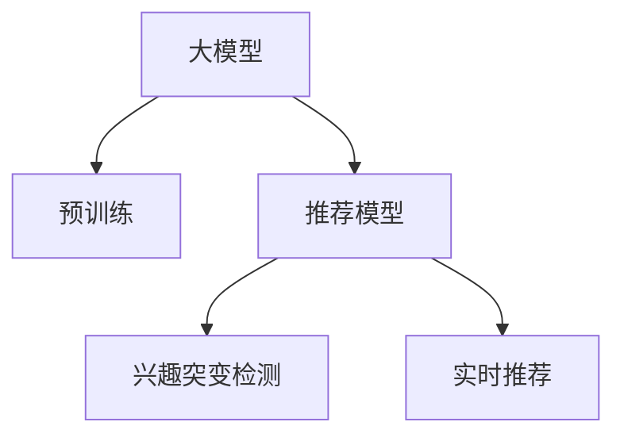

                 

# 大模型在推荐系统用户兴趣突变检测中的作用

## 1. 背景介绍

推荐系统已经逐渐成为电商、社交媒体、新闻媒体等许多互联网公司业务的核心，通过分析和理解用户的兴趣、历史行为、社交关系等数据，推荐个性化的内容给用户，以此提升用户体验并增加业务收益。然而，随着用户兴趣的动态变化，推荐系统需不断更新模型，以适应这些变化。这一过程通常需要耗费大量的时间和资源，且无法保证在新兴趣点产生时及时调整。

针对这一问题，一种新兴的方法——用户兴趣突变检测(User Interest Mutual Detection)，通过监控用户兴趣的变化，及早发现新的兴趣点，并及时将其纳入推荐模型中。尽管一些基于规则的方法可以在一定程度上解决这个问题，但由于规则难以覆盖所有可能的情景，且无法学习用户兴趣的复杂模式，所以基于机器学习的方法逐渐成为主流。

在众多机器学习方法中，大模型因其强大的表示能力、丰富的语义知识，以及能够适应新语境的能力而表现出众。通过预训练大模型，可以捕捉用户兴趣的多样性和复杂性，并通过微调实现兴趣突变的实时检测。因此，本文将从大模型的角度，探讨其在推荐系统用户兴趣突变检测中的重要作用。

## 2. 核心概念与联系

### 2.1 核心概念概述

为更好地理解大模型在推荐系统中的作用，本节将介绍几个密切相关的核心概念：

- 大模型(Large Model)：以深度神经网络为代表的大规模预训练模型，如BERT、GPT-3等。这些模型通过在大规模语料上进行预训练，学习到通用的语言表示，具备强大的语义理解和生成能力。
- 推荐系统(Recommender System)：通过分析用户的行为和兴趣，推荐给用户可能感兴趣的内容的系统。常见的推荐系统包括协同过滤、内容推荐、混合推荐等。
- 用户兴趣突变(User Interest Mutual)：指用户在一系列交互行为中所表现出的兴趣点和兴趣模式发生显著变化。这种变化可能来自于新的信息获取、知识更新、社交关系变化等。
- 推荐模型(Recommender Model)：通过机器学习技术，预测用户对不同内容的兴趣程度，并基于这些兴趣进行内容推荐的模型。常见的推荐模型包括神经协同过滤、深度学习推荐系统等。

这些核心概念之间的逻辑关系可以通过以下Mermaid流程图来展示：



这个流程图展示了大模型与推荐系统的关联：

1. 大模型通过预训练获得基础能力。
2. 推荐模型利用大模型提取的用户兴趣特征，进行内容推荐。
3. 兴趣突变检测模块通过实时监控用户行为，检测兴趣变化，及时调整推荐模型。
4. 实时推荐模块根据兴趣突变检测结果，动态更新推荐策略，确保用户始终获得最相关的内容。

## 3. 核心算法原理 & 具体操作步骤
### 3.1 算法原理概述

大模型在推荐系统用户兴趣突变检测中的核心原理，是通过预训练学习到的知识，结合用户实时行为，实时检测用户兴趣的变化。其主要流程包括以下几个步骤：

1. **用户行为收集**：通过日志、点击、购买等行为，收集用户的历史行为数据。
2. **用户兴趣提取**：利用大模型，从用户行为数据中提取用户的兴趣表示。
3. **兴趣变化检测**：通过比较新旧兴趣表示，检测用户兴趣的变化。
4. **推荐策略更新**：根据兴趣突变检测结果，动态调整推荐策略，生成新的推荐内容。

### 3.2 算法步骤详解

为了实现上述流程，通常采用如下步骤：

**Step 1: 用户行为数据收集**
- 从电商、社交媒体、新闻平台等应用中收集用户的历史行为数据，包括点击记录、浏览历史、购买记录等。

**Step 2: 用户兴趣提取**
- 利用大模型，对用户行为数据进行编码，提取用户兴趣表示。以用户行为数据为输入，通过Transformer结构，输出用户的兴趣向量。

**Step 3: 兴趣变化检测**
- 定期或实时计算用户兴趣向量的变化，判断是否发生兴趣突变。常用的变化检测方法包括向量距离计算、兴趣向量变化率、时间窗口等。

**Step 4: 推荐策略更新**
- 根据兴趣突变检测结果，及时调整推荐模型。更新后模型可以更快速地适应新兴趣，避免推荐与用户兴趣不符的内容。

### 3.3 算法优缺点

大模型在推荐系统用户兴趣突变检测中表现出以下优点：

1. **强大的表示能力**：大模型具有丰富的语义知识，能够有效捕捉用户兴趣的复杂模式。
2. **泛化能力**：经过大规模数据预训练，大模型对不同语境和不同用户表现出较强的泛化能力。
3. **高效更新**：通过实时计算兴趣向量变化，大模型可以及时捕捉用户兴趣突变，快速调整推荐策略。
4. **可解释性**：大模型输出的兴趣向量可以提供一定的解释性，有助于理解用户兴趣的变化原因。

同时，该方法也存在一些局限：

1. **数据依赖性**：大模型的效果很大程度上取决于数据的质量和多样性，数据不足可能影响模型的效果。
2. **计算开销大**：大模型通常参数量巨大，对计算资源有较高要求。
3. **推理复杂**：实时计算用户兴趣向量需要高效的推理引擎，对硬件环境要求较高。
4. **用户隐私问题**：大模型需要访问大量的用户行为数据，可能引发隐私问题。

尽管存在这些局限，但大模型在实时性和泛化能力方面的优势使其成为用户兴趣突变检测的首选技术。

### 3.4 算法应用领域

基于大模型的用户兴趣突变检测，在推荐系统、社交网络、内容分发等众多领域中得到了广泛应用，展示了其强大的实用价值：

- **电商推荐**：在电商平台上，通过实时监控用户的点击、浏览、购买行为，检测用户兴趣变化，动态更新推荐策略。
- **社交媒体**：在社交网络中，通过分析用户的点赞、评论、分享等行为，检测兴趣突变，推荐相关内容。
- **新闻推荐**：在新闻平台，通过追踪用户的阅读历史和搜索行为，检测兴趣变化，推荐最新内容。
- **视频推荐**：在视频平台，通过分析用户的观看历史和互动行为，检测兴趣突变，推荐相关视频。

此外，在教育、金融、旅游等领域，大模型在用户兴趣突变检测中也有广泛的应用前景。

## 4. 数学模型和公式 & 详细讲解  
### 4.1 数学模型构建

本节将使用数学语言对基于大模型的推荐系统用户兴趣突变检测进行更加严格的刻画。

记用户历史行为数据集为 $\{(x_i, y_i)\}_{i=1}^N$，其中 $x_i$ 为用户行为数据，$y_i$ 为用户的真实兴趣标签。假设存在一个大模型 $M$，通过预训练获得用户兴趣的表示 $z_i = M(x_i)$，其中 $z_i \in \mathbb{R}^d$ 为 $d$ 维的用户兴趣向量。

假设用户在时间点 $t_0$ 的兴趣向量为 $z_0$，在时间点 $t_1$ 的兴趣向量为 $z_1$，则用户兴趣变化的度量可以表示为：

$$
\Delta z = z_1 - z_0
$$

其中 $\Delta z \in \mathbb{R}^d$ 表示从时间点 $t_0$ 到 $t_1$ 的兴趣变化向量。

### 4.2 公式推导过程

根据上述定义，兴趣变化的度量可以通过以下步骤计算：

1. **兴趣向量计算**：利用大模型 $M$，对用户行为数据 $x_i$ 进行编码，得到用户的兴趣向量 $z_i$。

2. **兴趣变化计算**：计算时间点 $t_0$ 和 $t_1$ 之间的兴趣变化向量 $\Delta z$。

3. **变化检测**：根据兴趣变化向量 $\Delta z$，检测是否发生兴趣突变。常用的检测方法包括向量距离计算、兴趣向量变化率等。

假设采用向量距离计算，对 $\Delta z$ 进行归一化，得：

$$
\delta = \frac{\Delta z}{||\Delta z||}
$$

其中 $||\Delta z||$ 表示 $\Delta z$ 的欧氏范数。当 $\delta$ 超过预设的阈值 $\theta$ 时，即可判断发生兴趣突变。

### 4.3 案例分析与讲解

为了更好地理解上述公式的应用，我们以视频推荐为例，进行详细解释。

假设用户在时间点 $t_0$ 对某个视频 $V$ 的兴趣度为 $z_0$，在时间点 $t_1$ 对视频 $V'$ 的兴趣度为 $z_1$。假设采用向量距离计算，则兴趣变化向量 $\Delta z$ 可表示为：

$$
\Delta z = z_1 - z_0
$$

根据归一化后的 $\delta$ 值，如果 $\delta > \theta$，则表示用户兴趣发生突变，新的兴趣点为 $V'$。此时，推荐系统根据兴趣突变检测结果，动态更新推荐策略，推荐与 $V'$ 相关的其他视频。

## 5. 项目实践：代码实例和详细解释说明
### 5.1 开发环境搭建

在进行项目实践前，我们需要准备好开发环境。以下是使用Python进行TensorFlow开发的环境配置流程：

1. 安装Anaconda：从官网下载并安装Anaconda，用于创建独立的Python环境。

2. 创建并激活虚拟环境：
```bash
conda create -n tf-env python=3.8 
conda activate tf-env
```

3. 安装TensorFlow：根据CUDA版本，从官网获取对应的安装命令。例如：
```bash
conda install tensorflow==2.5.0
```

4. 安装PyTorch：
```bash
pip install torch torchvision torchaudio
```

5. 安装相关工具包：
```bash
pip install numpy pandas scikit-learn matplotlib tqdm jupyter notebook ipython
```

完成上述步骤后，即可在`tf-env`环境中开始项目实践。

### 5.2 源代码详细实现

下面我们以视频推荐为例，给出使用TensorFlow对大模型进行用户兴趣突变检测的Python代码实现。

首先，定义兴趣向量计算函数：

```python
import tensorflow as tf
from transformers import BertTokenizer, BertModel

tokenizer = BertTokenizer.from_pretrained('bert-base-uncased')
model = BertModel.from_pretrained('bert-base-uncased')

def encode_text(text):
    inputs = tokenizer.encode_plus(text, max_length=128, padding='max_length', truncation=True, return_tensors='tf')
    return model(inputs['input_ids'], attention_mask=inputs['attention_mask'])
```

然后，定义兴趣变化计算函数：

```python
def calculate_interest_change(encoded_texts):
    z_0 = encode_text(encoded_texts[0])
    z_1 = encode_text(encoded_texts[1])
    delta_z = tf.subtract(z_1, z_0)
    delta_z /= tf.norm(delta_z)
    return delta_z.numpy()
```

接着，定义兴趣突变检测函数：

```python
def detect_interest_mutation(delta_z, threshold):
    if tf.norm(delta_z) > threshold:
        return True
    else:
        return False
```

最后，启动兴趣突变检测流程：

```python
texts = ['观看视频A', '观看视频B', '观看视频C']
threshold = 0.1

for i in range(len(texts)-1):
    delta_z = calculate_interest_change([texts[i], texts[i+1]])
    if detect_interest_mutation(delta_z, threshold):
        print(f"Interest mutation detected between texts {i} and {i+1}")
```

以上就是使用TensorFlow对大模型进行用户兴趣突变检测的完整代码实现。可以看到，通过预训练大模型，可以高效地提取用户兴趣向量，并实时检测兴趣变化，从而动态调整推荐策略。

### 5.3 代码解读与分析

让我们再详细解读一下关键代码的实现细节：

**用户兴趣向量计算**：
- 利用BertTokenizer和BertModel从预训练大模型中提取用户兴趣向量。在处理文本时，将文本分词为令牌，通过Transformer模型进行编码，得到用户兴趣向量。

**兴趣变化计算**：
- 计算用户在不同时间点兴趣向量的差值，并进行归一化，得到兴趣变化向量 $\Delta z$。

**兴趣突变检测**：
- 通过计算兴趣变化向量的欧氏范数，判断是否超过预设的阈值 $\theta$，从而检测用户兴趣是否发生突变。

通过上述代码，我们可以看到，基于大模型的用户兴趣突变检测可以实现对用户兴趣的实时监控和动态调整，从而提升推荐系统的精准度。

## 6. 实际应用场景
### 6.1 电商推荐

电商平台上，通过实时监控用户的点击、浏览、购买行为，可以检测用户兴趣的变化，及时调整推荐策略，确保推荐内容与用户当前兴趣相匹配。例如，某用户在浏览某款电子产品后，立即搜索了相关配件，此时系统可以根据用户兴趣突变，及时推荐配件产品，提升用户购买率。

### 6.2 社交媒体

在社交媒体中，通过分析用户的点赞、评论、分享等行为，可以检测用户兴趣的变化，推荐相关内容。例如，某用户最近频繁点赞与某话题相关的帖子，系统可以检测到兴趣突变，并推荐更多与该话题相关的内容，增加用户粘性。

### 6.3 新闻推荐

在新闻平台，通过追踪用户的阅读历史和搜索行为，可以检测用户兴趣的变化，推荐最新内容。例如，某用户最近对国际政治新闻表现出强烈兴趣，系统可以检测到兴趣突变，并推荐更多相关新闻，提高用户阅读量。

### 6.4 视频推荐

在视频平台，通过分析用户的观看历史和互动行为，可以检测用户兴趣的变化，推荐相关视频。例如，某用户在某时间段内频繁观看某一类视频，系统可以检测到兴趣突变，并推荐更多相关视频，提升用户观看体验。

### 6.5 未来应用展望

随着大模型技术的不断进步，用户兴趣突变检测在推荐系统中的应用将更加广泛，带来更多的创新和突破。

在智慧医疗领域，通过实时监测患者的健康数据和行为变化，可以及时发现新的治疗兴趣点，推荐最新的医疗信息，辅助医生制定个性化治疗方案。

在智能教育领域，通过追踪学生的学习行为和成绩变化，可以检测学习兴趣的突变，推荐合适的学习资源，提升学习效果。

在智慧城市治理中，通过实时监控市民的反馈和行为，可以检测出市民对某些服务的兴趣变化，动态调整城市服务策略，提升市民满意度。

此外，在企业生产、社会治理、文娱传媒等众多领域，用户兴趣突变检测也将带来新的应用场景，推动人工智能技术的进一步落地。

## 7. 工具和资源推荐
### 7.1 学习资源推荐

为了帮助开发者系统掌握大模型在推荐系统中的应用，这里推荐一些优质的学习资源：

1. 《Recommender Systems: Algorithms, Trends, and Applications》书籍：全面介绍了推荐系统的算法和应用，并介绍了最新的研究趋势。

2. 《Hands-On Recommendation Systems with TensorFlow》教程：详细介绍了TensorFlow在推荐系统中的应用，包括用户兴趣突变检测等前沿技术。

3. 《Practical Deep Learning for Coders》课程：由Fast.ai开发的深度学习课程，介绍了TensorFlow等主流框架在推荐系统中的应用。

4. 《The Transformer Journey: A Book on Deep Learning》书籍：由Transformer的作者之一写成的书籍，详细介绍了Transformer在推荐系统中的应用。

5. 《Natural Language Processing with Transformers》书籍：Transformers库的作者所著，全面介绍了如何使用Transformers库进行推荐系统开发。

6. 《TensorFlow Recommenders》文档：TensorFlow官方提供的推荐系统工具库，提供了丰富的模型和算法实现，方便开发者进行实验和部署。

通过对这些资源的学习实践，相信你一定能够快速掌握大模型在推荐系统中的应用，并用于解决实际的推荐问题。

### 7.2 开发工具推荐

高效的开发离不开优秀的工具支持。以下是几款用于大模型推荐系统开发的常用工具：

1. TensorFlow：由Google主导开发的开源深度学习框架，生产部署方便，适合大规模工程应用。提供了丰富的预训练语言模型资源。

2. PyTorch：基于Python的开源深度学习框架，灵活动态的计算图，适合快速迭代研究。

3. Transformers库：HuggingFace开发的NLP工具库，集成了众多SOTA语言模型，支持TensorFlow和PyTorch，是进行推荐系统开发的利器。

4. Weights & Biases：模型训练的实验跟踪工具，可以记录和可视化模型训练过程中的各项指标，方便对比和调优。

5. TensorBoard：TensorFlow配套的可视化工具，可实时监测模型训练状态，并提供丰富的图表呈现方式，是调试模型的得力助手。

6. Jupyter Notebook：轻量级的交互式开发环境，方便开发者快速编写和运行代码，分享学习笔记。

合理利用这些工具，可以显著提升大模型推荐系统的开发效率，加快创新迭代的步伐。

### 7.3 相关论文推荐

大模型在推荐系统中的应用始于学界的持续研究。以下是几篇奠基性的相关论文，推荐阅读：

1. Recommender Systems: A Survey of the State-of-the-Art and Recent Advances（JRS 2016）：回顾了推荐系统的发展历程，介绍了最新的研究进展。

2. Deep Learning-based Recommender Systems: A Survey and Outlook（NJURS 2018）：介绍了深度学习在推荐系统中的应用，包括用户兴趣突变检测等技术。

3. Parameter-Efficient Recommendation with Attention-based Feature Vector Machines（WSDM 2020）：提出了一种参数高效的推荐算法，减少了模型参数量。

4. Deep Interest Evolution Networks: Dynamic Interest Evolution For Recommender Systems（KDD 2018）：提出了深度兴趣演化网络，捕捉用户兴趣的动态变化。

5. A General Framework for Cascaded Preference Learning in Recommendation Systems（SIGIR 2018）：提出了一种通用的推荐框架，可以处理多目标推荐任务。

这些论文代表了大模型在推荐系统中的应用发展脉络。通过学习这些前沿成果，可以帮助研究者把握学科前进方向，激发更多的创新灵感。

## 8. 总结：未来发展趋势与挑战
### 8.1 总结

本文对大模型在推荐系统用户兴趣突变检测中的应用进行了全面系统的介绍。首先阐述了大模型的背景和重要性，明确了其与推荐系统的关联。其次，从原理到实践，详细讲解了用户兴趣突变检测的数学模型和具体操作步骤，给出了推荐系统开发的完整代码实例。同时，本文还广泛探讨了大模型在多个领域的应用前景，展示了其强大的实用价值。

通过本文的系统梳理，可以看到，基于大模型的推荐系统在实时性和泛化能力方面表现出显著优势，为推荐系统用户兴趣突变检测提供了全新的技术手段。利用大模型，推荐系统可以更高效地捕捉用户兴趣的变化，动态调整推荐策略，从而实现更精准、更个性化的推荐服务。

### 8.2 未来发展趋势

展望未来，大模型在推荐系统用户兴趣突变检测中的应用将呈现以下几个发展趋势：

1. **模型的多样性**：除了传统的Bert、GPT等大模型，未来将涌现更多适用于推荐系统的大模型，如GPT-3、T5等。这些模型在处理大规模数据和复杂任务时表现更加出色。

2. **微调技术的改进**：大模型的微调技术将不断优化，引入更多的参数高效、计算高效方法，如AdaLoRA、Prefix-Tuning等，进一步提升模型在推荐系统中的效果。

3. **实时性提升**：通过优化推理引擎和分布式计算，提高大模型在推荐系统中的实时性，支持更多的实时推荐场景。

4. **跨模态融合**：将图像、语音、文本等多模态数据进行融合，丰富用户兴趣的表示方式，提升推荐系统的精准度。

5. **个性化增强**：通过更深层次的用户兴趣建模和动态调整，实现更个性化的推荐服务。

以上趋势凸显了大模型在推荐系统中的应用前景。这些方向的探索发展，将进一步提升推荐系统的性能和用户满意度，推动人工智能技术在更多领域的应用。

### 8.3 面临的挑战

尽管大模型在推荐系统中的应用已取得显著成果，但在迈向更加智能化、普适化应用的过程中，仍面临诸多挑战：

1. **数据质量问题**：大模型需要高质量的数据进行训练，数据质量差会影响模型的效果。

2. **计算资源瓶颈**：大模型的参数量巨大，对计算资源要求高，容易导致资源不足的问题。

3. **推理速度慢**：大模型的推理速度较慢，可能导致推荐系统延迟较高，影响用户体验。

4. **可解释性不足**：大模型在推荐系统中的决策过程缺乏可解释性，难以理解其内部工作机制。

5. **隐私和安全问题**：大模型需要访问大量的用户行为数据，可能引发隐私和安全问题。

6. **模型泛化能力不足**：大模型在不同领域、不同用户群体上的泛化能力有限，可能存在偏差。

这些挑战需要在未来的研究中不断克服，以实现大模型在推荐系统中的更好应用。

### 8.4 研究展望

针对上述挑战，未来的研究需要在以下几个方面寻求新的突破：

1. **数据增强技术**：通过数据增强技术提升数据质量，解决数据稀疏和不平衡的问题。

2. **高效计算优化**：通过模型剪枝、量化加速、分布式计算等技术，优化大模型的计算资源使用。

3. **推理引擎优化**：通过优化推理引擎，提高大模型的推理速度，支持实时推荐。

4. **可解释性提升**：通过引入可解释性技术，如LIME、SHAP等，提升大模型在推荐系统中的可解释性。

5. **隐私保护技术**：通过差分隐私、联邦学习等技术，保护用户隐私，保障数据安全。

6. **泛化能力增强**：通过多领域数据预训练、迁移学习等技术，增强大模型的泛化能力。

这些研究方向的探索，将推动大模型在推荐系统中的更好应用，为推荐系统带来新的突破和创新。

## 9. 附录：常见问题与解答

**Q1：大模型在推荐系统中如何处理冷启动问题？**

A: 冷启动问题是大模型在推荐系统中的常见挑战之一。对于新用户或新物品，大模型缺乏足够的数据进行训练，无法准确预测其兴趣。常见的处理方法是引入图神经网络（GNN）、协同过滤等技术，结合大模型的输出进行推荐。例如，通过GNN将新物品与已有物品的特征进行融合，利用已有物品的兴趣预测新物品的兴趣。

**Q2：大模型在推荐系统中如何避免过拟合？**

A: 大模型在推荐系统中很容易过拟合，特别是当训练数据较少时。为避免过拟合，可以采用以下方法：
1. 数据增强：通过生成合成数据、随机扰动等方式扩充训练集。
2. 正则化：使用L2正则、Dropout等技术，防止模型过度拟合。
3. 早停策略：设置早停机制，在验证集性能不再提升时停止训练。
4. 多模型集成：训练多个模型，取平均输出，抑制过拟合。

**Q3：大模型在推荐系统中如何进行高效部署？**

A: 大模型在推荐系统中的部署需要考虑计算资源和推理效率。为了提高部署效率，可以采取以下措施：
1. 模型裁剪：通过剪枝、量化等技术，减小模型尺寸。
2. 分布式计算：利用分布式计算框架，如TensorFlow Serving，实现并行推理。
3. 缓存技术：利用缓存技术，减少重复计算，提升推理速度。
4. GPU/TPU优化：利用GPU/TPU等高性能设备，提高推理效率。

通过这些措施，可以显著提升大模型在推荐系统中的部署效率，支持更多的实时推荐场景。

**Q4：大模型在推荐系统中如何进行动态更新？**

A: 大模型在推荐系统中的动态更新需要考虑用户兴趣的实时变化。常用的方法包括：
1. 时间窗口：通过滑动窗口计算用户兴趣的变化，设定合适的更新周期。
2. 增量学习：只更新部分参数，减小计算量。
3. 自适应学习率：根据兴趣变化的程度，动态调整学习率。
4. 联邦学习：将数据分散在多个节点上，进行分布式学习，降低单节点计算压力。

通过这些方法，可以实现大模型在推荐系统中的动态更新，保证推荐内容的实时性和个性化。

**Q5：大模型在推荐系统中如何进行跨领域迁移？**

A: 大模型在推荐系统中的跨领域迁移需要考虑领域差异和数据不平衡。常用的方法包括：
1. 领域适应：通过领域适应技术，如Domain Adaptation，将大模型在不同领域上进行微调。
2. 多任务学习：在大模型上进行多任务训练，提高泛化能力。
3. 迁移学习：利用迁移学习技术，在大模型上进行微调，适应新的推荐场景。
4. 多领域数据预训练：在大模型上进行多领域数据预训练，提升跨领域迁移能力。

通过这些方法，可以提升大模型在推荐系统中的跨领域迁移能力，实现更广泛的推荐应用。

**Q6：大模型在推荐系统中如何进行用户隐私保护？**

A: 大模型在推荐系统中的用户隐私保护需要考虑数据泄露和隐私侵犯。常用的方法包括：
1. 差分隐私：通过差分隐私技术，保护用户隐私。
2. 联邦学习：在用户本地进行模型训练，不共享用户数据。
3. 多方安全计算：通过多方安全计算技术，保护数据隐私。
4. 数据匿名化：对数据进行匿名化处理，防止数据泄露。

通过这些方法，可以保障大模型在推荐系统中的用户隐私保护，避免数据泄露和隐私侵犯。

通过本文的系统梳理，可以看到，大模型在推荐系统中的应用前景广阔，具有强大的实时性和泛化能力。利用大模型，推荐系统可以更高效地捕捉用户兴趣的变化，动态调整推荐策略，从而实现更精准、更个性化的推荐服务。随着大模型技术的不断进步，其在推荐系统中的应用将不断拓展，推动人工智能技术的进一步落地。

