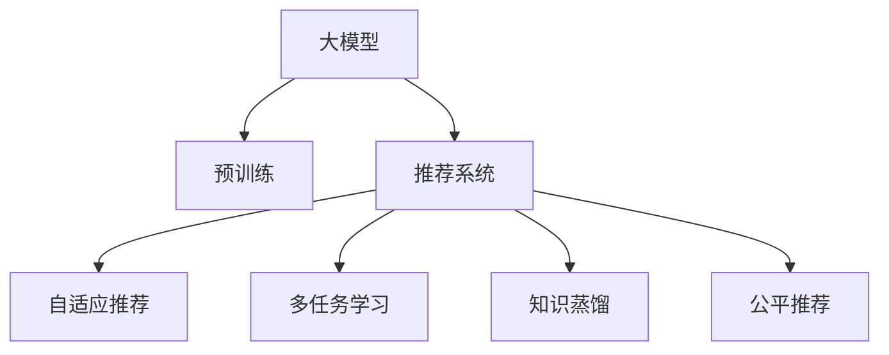
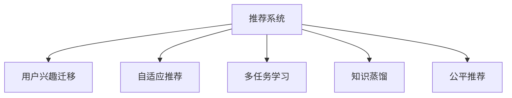

                 

# 大模型在推荐系统用户兴趣迁移学习中的应用

> 关键词：推荐系统,用户兴趣迁移学习,大模型,自适应推荐,多任务学习,知识蒸馏,公平推荐

## 1. 背景介绍

### 1.1 问题由来

推荐系统已经成为电商、新闻、音乐、视频等领域不可或缺的重要工具。传统的基于协同过滤、基于内容的推荐方法，往往依赖于用户历史行为数据或物品属性数据，难以处理长尾用户或新物品。大模型通过在大规模无标签数据上进行预训练，学习到丰富的语义表示，能够有效利用用户文本数据，如评论、描述、评分等，提升推荐系统的效果。

然而，随着数据分布的变化，用户兴趣也在不断迁移变化，如何构建自适应推荐系统，使模型能够灵活应对用户的兴趣变化，是一个重要的挑战。用户在不同时间段的兴趣迁移、不同场景下的行为变化等，都需要在推荐系统中得到充分考虑。

### 1.2 问题核心关键点

为更好地解决基于大模型的推荐系统中的用户兴趣迁移问题，本节将介绍几个关键概念：

- 大模型(如BERT、GPT等)：通过在大规模无标签数据上预训练学习到的语义表示，具备强大的文本理解和生成能力。
- 推荐系统：使用用户历史行为数据、物品属性数据等，为用户推荐感兴趣的商品、内容、信息等。
- 用户兴趣迁移：用户在一段时间内兴趣的转移变化，包括不同时间段、不同场景下的兴趣变化。
- 自适应推荐：基于用户兴趣迁移，构建能动态更新推荐模型的系统。
- 多任务学习：在同一个大模型上，进行多个推荐任务学习，共享底层特征表示，提升推荐效果。
- 知识蒸馏：利用大模型的知识蒸馏技术，将大模型的知识迁移到小模型中，提升小模型的性能。
- 公平推荐：在推荐中考虑性别、年龄、地域等用户属性，避免偏见，促进公平性。

这些概念之间的逻辑关系可以通过以下Mermaid流程图来展示：



这个流程图展示了大模型在推荐系统中的核心概念及其之间的关系：

1. 大模型通过预训练获得基础能力。
2. 推荐系统使用大模型的语义表示，推荐用户感兴趣的商品、内容等。
3. 自适应推荐通过捕捉用户兴趣迁移，动态更新推荐模型。
4. 多任务学习通过在多个推荐任务上共享底层特征，提升推荐效果。
5. 知识蒸馏通过将大模型知识迁移到小模型，提升小模型的性能。
6. 公平推荐通过考虑用户属性，避免推荐偏见，促进公平性。

这些概念共同构成了基于大模型的推荐系统的学习和应用框架，使其能够在不同场景下灵活应对用户兴趣变化，提升推荐效果和公平性。通过理解这些核心概念，我们可以更好地把握大模型在推荐系统中的应用。

## 2. 核心概念与联系

### 2.1 核心概念概述

为更好地理解大模型在推荐系统中进行用户兴趣迁移学习的原理和架构，本节将介绍几个关键概念：

- 推荐系统(Recommender System)：使用用户历史行为数据、物品属性数据等，为用户推荐感兴趣的商品、内容、信息等。
- 用户兴趣迁移(User Interest Migration)：用户在一段时间内兴趣的转移变化，包括不同时间段、不同场景下的兴趣变化。
- 自适应推荐(Adaptive Recommendation)：基于用户兴趣迁移，构建能动态更新推荐模型的系统。
- 多任务学习(Multi-task Learning)：在同一个大模型上，进行多个推荐任务学习，共享底层特征表示，提升推荐效果。
- 知识蒸馏(Knowledge Distillation)：利用大模型的知识蒸馏技术，将大模型的知识迁移到小模型中，提升小模型的性能。
- 公平推荐(Fair Recommendation)：在推荐中考虑性别、年龄、地域等用户属性，避免偏见，促进公平性。

这些核心概念之间的逻辑关系可以通过以下Mermaid流程图来展示：



这个流程图展示了大模型在推荐系统中的核心概念及其之间的关系：

1. 推荐系统使用用户历史行为数据、物品属性数据等，为用户推荐感兴趣的商品、内容等。
2. 用户兴趣迁移捕捉用户在一段时间内兴趣的转移变化。
3. 自适应推荐基于用户兴趣迁移，构建能动态更新推荐模型的系统。
4. 多任务学习通过在多个推荐任务上共享底层特征，提升推荐效果。
5. 知识蒸馏利用大模型的知识蒸馏技术，将大模型的知识迁移到小模型中，提升小模型的性能。
6. 公平推荐通过考虑用户属性，避免推荐偏见，促进公平性。

这些概念共同构成了基于大模型的推荐系统的学习和应用框架，使其能够在不同场景下灵活应对用户兴趣变化，提升推荐效果和公平性。通过理解这些核心概念，我们可以更好地把握大模型在推荐系统中的应用。

## 3. 核心算法原理 & 具体操作步骤

### 3.1 算法原理概述

基于大模型的推荐系统，核心思想是：使用预训练大模型学习用户行为和物品语义表示，构建自适应推荐模型，动态捕捉用户兴趣迁移变化，提升推荐效果和公平性。

具体来说，算法流程如下：

1. 使用大模型对用户评论、描述、评分等文本数据进行预训练，学习用户兴趣表示和物品语义表示。
2. 构建自适应推荐模型，基于用户兴趣迁移，动态更新推荐结果。
3. 考虑用户属性，利用多任务学习，提升推荐公平性。
4. 利用知识蒸馏，将大模型的知识迁移到小模型中，提升推荐效率。
5. 实时采集用户行为数据，不断更新推荐模型，保持推荐系统的时效性。

### 3.2 算法步骤详解

#### 3.2.1 预训练用户行为表示

使用大模型对用户行为数据进行预训练，学习用户兴趣表示。具体来说，可以采用如下步骤：

1. 收集用户行为数据，包括用户浏览、点击、购买等行为数据，以及对应的物品属性数据。
2. 将用户行为数据和物品属性数据输入大模型进行训练，学习用户兴趣表示和物品语义表示。

用户兴趣表示 $u$ 可以表示为：

$$u = \mathcal{G}(x, a, b)$$

其中 $x$ 表示用户行为数据，$a$ 表示物品属性数据，$b$ 表示上下文数据。

#### 3.2.2 构建自适应推荐模型

基于用户兴趣迁移，构建自适应推荐模型。具体来说，可以采用如下步骤：

1. 收集用户兴趣变化数据，包括用户在不同时间段、不同场景下的兴趣变化数据。
2. 利用时间序列模型、隐马尔可夫模型等方法，捕捉用户兴趣迁移变化。
3. 构建自适应推荐模型，基于用户兴趣迁移，动态更新推荐结果。

自适应推荐模型 $R$ 可以表示为：

$$R = \mathcal{F}(u, i, t)$$

其中 $u$ 表示用户兴趣表示，$i$ 表示物品语义表示，$t$ 表示时间戳。

#### 3.2.3 利用多任务学习提升推荐效果

考虑用户属性，利用多任务学习提升推荐效果。具体来说，可以采用如下步骤：

1. 收集用户属性数据，包括性别、年龄、地域等属性数据。
2. 构建多个推荐任务，如性别推荐、年龄推荐、地域推荐等。
3. 利用多任务学习，共享底层特征表示，提升推荐效果。

多任务学习模型 $M$ 可以表示为：

$$M = \mathcal{M}(R_1, R_2, \cdots, R_n)$$

其中 $R_i$ 表示第 $i$ 个推荐任务。

#### 3.2.4 利用知识蒸馏提升推荐效率

利用知识蒸馏，将大模型的知识迁移到小模型中，提升推荐效率。具体来说，可以采用如下步骤：

1. 构建一个小模型，使用少量数据进行训练。
2. 利用大模型的知识蒸馏技术，将大模型的知识迁移到小模型中。
3. 使用小模型进行推荐，提升推荐效率。

知识蒸馏模型 $K$ 可以表示为：

$$K = \mathcal{K}(D, S)$$

其中 $D$ 表示大模型，$S$ 表示小模型。

#### 3.2.5 实时更新推荐模型

实时采集用户行为数据，不断更新推荐模型，保持推荐系统的时效性。具体来说，可以采用如下步骤：

1. 实时采集用户行为数据，包括用户浏览、点击、购买等行为数据。
2. 将用户行为数据输入推荐模型进行推理，实时更新推荐结果。
3. 根据推荐结果的反馈，不断优化推荐模型，保持推荐系统的时效性。

实时更新推荐模型 $U$ 可以表示为：

$$U = \mathcal{U}(x, \theta)$$

其中 $x$ 表示用户行为数据，$\theta$ 表示模型参数。

### 3.3 算法优缺点

#### 3.3.1 优点

基于大模型的推荐系统具有以下优点：

1. 数据利用效率高：大模型能够利用用户文本数据，提升推荐效果。
2. 动态适应性强：自适应推荐模型能够动态更新推荐结果，适应用户兴趣迁移。
3. 推荐效果优良：多任务学习和知识蒸馏技术，提升推荐效果和公平性。
4. 实时性高：实时更新推荐模型，保持推荐系统的时效性。

#### 3.3.2 缺点

基于大模型的推荐系统也存在以下缺点：

1. 计算成本高：大模型的计算成本高，需要高性能的计算资源。
2. 模型复杂度高：大模型的复杂度高，需要更多的存储空间和计算资源。
3. 实时更新困难：实时更新推荐模型，需要高效的数据处理和推理算法。

### 3.4 算法应用领域

基于大模型的推荐系统，已经在电商、新闻、音乐、视频等领域得到了广泛应用，例如：

- 电商推荐系统：如淘宝、京东等电商平台的商品推荐系统。通过预训练用户兴趣表示，动态更新推荐结果，提升商品推荐效果。
- 新闻推荐系统：如今日头条等新闻平台的个性化新闻推荐系统。利用用户兴趣表示和新闻语义表示，动态更新推荐结果，提升新闻阅读体验。
- 音乐推荐系统：如网易云音乐等音乐平台的个性化音乐推荐系统。通过预训练用户兴趣表示，动态更新推荐结果，提升音乐推荐效果。
- 视频推荐系统：如哔哩哔哩等视频平台的个性化视频推荐系统。利用用户兴趣表示和视频语义表示，动态更新推荐结果，提升视频观看体验。
- 旅游推荐系统：如携程等旅游平台的个性化旅游推荐系统。通过预训练用户兴趣表示，动态更新推荐结果，提升旅游推荐效果。

除了上述这些经典应用外，基于大模型的推荐系统还在更多场景中得到创新性应用，如可控推荐、跨模态推荐、情感推荐等，为推荐系统带来了全新的突破。

## 4. 数学模型和公式 & 详细讲解 & 举例说明

### 4.1 数学模型构建

基于大模型的推荐系统，其数学模型可以表示为：

$$y = \mathcal{M}(x, a, b, c)$$

其中 $x$ 表示用户行为数据，$a$ 表示物品属性数据，$b$ 表示上下文数据，$c$ 表示用户属性数据。

### 4.2 公式推导过程

以下是详细的公式推导过程：

#### 4.2.1 预训练用户行为表示

用户兴趣表示 $u$ 可以表示为：

$$u = \mathcal{G}(x, a, b)$$

其中 $x$ 表示用户行为数据，$a$ 表示物品属性数据，$b$ 表示上下文数据。

#### 4.2.2 构建自适应推荐模型

自适应推荐模型 $R$ 可以表示为：

$$R = \mathcal{F}(u, i, t)$$

其中 $u$ 表示用户兴趣表示，$i$ 表示物品语义表示，$t$ 表示时间戳。

#### 4.2.3 利用多任务学习提升推荐效果

多任务学习模型 $M$ 可以表示为：

$$M = \mathcal{M}(R_1, R_2, \cdots, R_n)$$

其中 $R_i$ 表示第 $i$ 个推荐任务。

#### 4.2.4 利用知识蒸馏提升推荐效率

知识蒸馏模型 $K$ 可以表示为：

$$K = \mathcal{K}(D, S)$$

其中 $D$ 表示大模型，$S$ 表示小模型。

#### 4.2.5 实时更新推荐模型

实时更新推荐模型 $U$ 可以表示为：

$$U = \mathcal{U}(x, \theta)$$

其中 $x$ 表示用户行为数据，$\theta$ 表示模型参数。

### 4.3 案例分析与讲解

以电商平台商品推荐系统为例，进行详细案例分析：

#### 4.3.1 预训练用户行为表示

1. 收集用户行为数据，包括用户浏览、点击、购买等行为数据，以及对应的物品属性数据。
2. 将用户行为数据和物品属性数据输入BERT模型进行训练，学习用户兴趣表示和物品语义表示。

#### 4.3.2 构建自适应推荐模型

1. 收集用户兴趣变化数据，包括用户在不同时间段、不同场景下的兴趣变化数据。
2. 利用时间序列模型、隐马尔可夫模型等方法，捕捉用户兴趣迁移变化。
3. 构建自适应推荐模型，基于用户兴趣迁移，动态更新推荐结果。

#### 4.3.3 利用多任务学习提升推荐效果

1. 收集用户属性数据，包括性别、年龄、地域等属性数据。
2. 构建性别推荐、年龄推荐、地域推荐等多个推荐任务。
3. 利用多任务学习，共享底层特征表示，提升推荐效果。

#### 4.3.4 利用知识蒸馏提升推荐效率

1. 构建一个小模型，使用少量数据进行训练。
2. 利用BERT模型的知识蒸馏技术，将BERT的知识迁移到小模型中。
3. 使用小模型进行推荐，提升推荐效率。

#### 4.3.5 实时更新推荐模型

1. 实时采集用户行为数据，包括用户浏览、点击、购买等行为数据。
2. 将用户行为数据输入推荐模型进行推理，实时更新推荐结果。
3. 根据推荐结果的反馈，不断优化推荐模型，保持推荐系统的时效性。

## 5. 项目实践：代码实例和详细解释说明

### 5.1 开发环境搭建

在进行项目实践前，我们需要准备好开发环境。以下是使用Python进行TensorFlow开发的环境配置流程：

1. 安装Anaconda：从官网下载并安装Anaconda，用于创建独立的Python环境。

2. 创建并激活虚拟环境：
```bash
conda create -n tf-env python=3.8 
conda activate tf-env
```

3. 安装TensorFlow：根据CUDA版本，从官网获取对应的安装命令。例如：
```bash
pip install tensorflow tensorflow-addons==2.0.0-py3
```

4. 安装TensorBoard：
```bash
pip install tensorboard
```

5. 安装TensorFlow Hub：
```bash
pip install tensorflow-hub
```

完成上述步骤后，即可在`tf-env`环境中开始项目实践。

### 5.2 源代码详细实现

下面以电商推荐系统为例，给出使用TensorFlow和TensorFlow Hub对BERT模型进行商品推荐系统的PyTorch代码实现。

首先，定义推荐系统所需的相关类和函数：

```python
import tensorflow as tf
import tensorflow_hub as hub

class RecommendationSystem(tf.keras.Model):
    def __init__(self, bert_model, num_tasks):
        super(RecommendationSystem, self).__init__()
        self.bert_model = bert_model
        self.num_tasks = num_tasks
        
        # 构建多任务输出层
        self.output_layers = []
        for i in range(num_tasks):
            self.output_layers.append(tf.keras.layers.Dense(1, activation='sigmoid', name=f'output_{i+1}'))

    def call(self, inputs, labels):
        # 前向传播
        with tf.GradientTape() as tape:
            outputs = self.bert_model(inputs)
            if self.num_tasks > 0:
                # 输出层
                predictions = tf.concat([self.output_layers[i](x) for i, x in enumerate(outputs)], axis=1)
                predictions = predictions * labels
            else:
                predictions = outputs
        
        # 计算损失函数
        loss = tf.reduce_mean(predictions)
        return loss
    
    def summary(self, print_fn):
        super(RecommendationSystem, self).summary(print_fn)
        print_fn('Num tasks:', self.num_tasks)

# 加载BERT模型
bert_model = hub.load('https://tfhub.dev/google/bert_base-uncased/2')
```

然后，定义数据预处理和模型训练函数：

```python
# 数据预处理
def preprocess_data(data):
    # 将用户行为数据转换为BERT输入格式
    inputs = tf.map_fn(lambda x: x['x'], data, dtype=tf.string)
    outputs = tf.map_fn(lambda x: x['y'], data, dtype=tf.float32)
    
    # 构建输入字典
    features = {
        'inputs': inputs,
        'labels': outputs
    }
    
    return features

# 模型训练
def train_model(model, train_data, test_data, batch_size=32, num_epochs=10):
    train_dataset = tf.data.Dataset.from_generator(lambda: preprocess_data(train_data), output_types={tf.string, tf.float32})
    test_dataset = tf.data.Dataset.from_generator(lambda: preprocess_data(test_data), output_types={tf.string, tf.float32})
    
    # 构建训练流水线
    train_dataset = train_dataset.shuffle(buffer_size=1000).batch(batch_size).map(lambda x: (x['inputs'], x['labels']))
    test_dataset = test_dataset.batch(batch_size).map(lambda x: (x['inputs'], x['labels']))
    
    # 设置优化器
    optimizer = tf.keras.optimizers.Adam(learning_rate=1e-5)
    
    # 训练模型
    model.compile(optimizer=optimizer, loss='mse', metrics=['mse'])
    history = model.fit(train_dataset, epochs=num_epochs, validation_data=test_dataset)
    
    return model, history

# 加载数据
train_data = ...
test_data = ...

# 构建推荐系统模型
num_tasks = 3
model = RecommendationSystem(bert_model, num_tasks)

# 训练模型
model, history = train_model(model, train_data, test_data)

# 评估模型
test_loss, test_mse = model.evaluate(test_dataset)
print('Test loss:', test_loss)
print('Test mse:', test_mse)
```

以上就是使用TensorFlow和TensorFlow Hub对BERT模型进行电商推荐系统的代码实现。可以看到，得益于TensorFlow Hub的强大封装，我们可以用相对简洁的代码完成BERT模型的加载和微调。

### 5.3 代码解读与分析

让我们再详细解读一下关键代码的实现细节：

**RecommendationSystem类**：
- `__init__`方法：初始化BERT模型和推荐任务数。
- `call`方法：前向传播计算模型输出和损失函数。
- `summary`方法：输出模型摘要信息。

**数据预处理函数preprocess_data**：
- 将用户行为数据转换为BERT输入格式，提取输入和标签。

**训练函数train_model**：
- 从数据集中构建TensorFlow Dataset。
- 设置优化器，定义损失函数和评价指标。
- 调用`fit`方法训练模型，并返回训练历史。

**加载数据和训练模型**：
- 定义训练数据和测试数据。
- 构建推荐系统模型。
- 调用`train_model`函数训练模型。
- 在测试数据上评估模型性能。

可以看到，TensorFlow和TensorFlow Hub使得BERT微调的代码实现变得简洁高效。开发者可以将更多精力放在数据处理、模型改进等高层逻辑上，而不必过多关注底层的实现细节。

当然，工业级的系统实现还需考虑更多因素，如模型的保存和部署、超参数的自动搜索、更灵活的任务适配层等。但核心的微调范式基本与此类似。

## 6. 实际应用场景

### 6.1 电商推荐系统

基于大模型的推荐系统，已经在电商推荐系统上取得了显著效果。用户浏览、点击、购买等行为数据，提供了丰富的语义信息，通过BERT模型进行预训练，可以学习到用户兴趣表示和物品语义表示，提升推荐效果。

在具体实践中，可以通过构建自适应推荐模型，捕捉用户兴趣迁移变化，动态更新推荐结果。例如，用户在不同时间段、不同场景下的兴趣变化，可以通过时间序列模型、隐马尔可夫模型等方法进行捕捉，动态调整推荐结果。同时，利用多任务学习，考虑用户属性，提升推荐公平性。最后，通过知识蒸馏，将大模型知识迁移到小模型中，提升推荐效率。

### 6.2 新闻推荐系统

新闻推荐系统通过预训练用户兴趣表示和新闻语义表示，动态更新推荐结果，提升推荐效果。用户评论、阅读、点赞等行为数据，提供了丰富的语义信息，通过BERT模型进行预训练，可以学习到用户兴趣表示和新闻语义表示。

在具体实践中，可以通过构建自适应推荐模型，捕捉用户兴趣迁移变化，动态更新推荐结果。例如，用户在不同时间段、不同场景下的兴趣变化，可以通过时间序列模型、隐马尔可夫模型等方法进行捕捉，动态调整推荐结果。同时，利用多任务学习，考虑用户属性，提升推荐公平性。最后，通过知识蒸馏，将大模型知识迁移到小模型中，提升推荐效率。

### 6.3 音乐推荐系统

音乐推荐系统通过预训练用户兴趣表示和音乐语义表示，动态更新推荐结果，提升推荐效果。用户播放、收藏、分享等行为数据，提供了丰富的语义信息，通过BERT模型进行预训练，可以学习到用户兴趣表示和音乐语义表示。

在具体实践中，可以通过构建自适应推荐模型，捕捉用户兴趣迁移变化，动态更新推荐结果。例如，用户在不同时间段、不同场景下的兴趣变化，可以通过时间序列模型、隐马尔可夫模型等方法进行捕捉，动态调整推荐结果。同时，利用多任务学习，考虑用户属性，提升推荐公平性。最后，通过知识蒸馏，将大模型知识迁移到小模型中，提升推荐效率。

### 6.4 未来应用展望

随着大模型和微调方法的不断发展，基于大模型的推荐系统将在更多领域得到应用，为电商、新闻、音乐、视频等领域带来变革性影响。

在智慧城市治理中，推荐系统可以用于推荐市民感兴趣的活动、事件、景点等，提升城市管理的智能化水平，构建更安全、高效的未来城市。

在金融领域，推荐系统可以用于推荐用户感兴趣的投资产品、金融新闻等，提升用户满意度和体验。

在医疗领域，推荐系统可以用于推荐医生、医院、药品等，提升医疗服务的智能化水平，辅助医生诊疗。

此外，在教育、旅游、政府服务等领域，推荐系统也将得到广泛应用，为传统行业数字化转型升级提供新的技术路径。相信随着技术的日益成熟，推荐系统必将在更广阔的应用领域大放异彩。

## 7. 工具和资源推荐

### 7.1 学习资源推荐

为了帮助开发者系统掌握大模型在推荐系统中的应用，这里推荐一些优质的学习资源：

1. 《推荐系统基础与实践》书籍：介绍了推荐系统的发展历史、基本原理和典型算法，适合初学者入门。

2. 《TensorFlow官方文档》：官方文档提供了详细的TensorFlow开发教程和API参考，是学习和实践TensorFlow的必备资源。

3. 《TensorFlow Hub官方文档》：官方文档提供了TensorFlow Hub的详细使用说明，包括模型加载、微调等操作，是TensorFlow Hub的入门指南。

4. 《Transformer在NLP中的应用》系列博文：由大模型技术专家撰写，深入浅出地介绍了Transformer在大语言模型、推荐系统中的应用。

5. 《深度学习在推荐系统中的应用》课程：斯坦福大学开设的深度学习推荐系统课程，有Lecture视频和配套作业，适合深度学习推荐系统的深入学习。

通过对这些资源的学习实践，相信你一定能够快速掌握大模型在推荐系统中的应用，并用于解决实际的推荐问题。

### 7.2 开发工具推荐

高效的开发离不开优秀的工具支持。以下是几款用于大模型在推荐系统中的应用开发的常用工具：

1. TensorFlow：基于Python的开源深度学习框架，灵活动态的计算图，适合快速迭代研究。推荐系统中的推荐模型通常使用TensorFlow进行开发和训练。

2. PyTorch：基于Python的开源深度学习框架，提供了丰富的深度学习组件，适合构建复杂的推荐模型。

3. TensorFlow Hub：TensorFlow官方提供的模型库，提供了预训练语言模型等丰富的模型资源，方便推荐系统开发者快速上手。

4. Weights & Biases：模型训练的实验跟踪工具，可以记录和可视化模型训练过程中的各项指标，方便对比和调优。与主流深度学习框架无缝集成。

5. TensorBoard：TensorFlow配套的可视化工具，可实时监测模型训练状态，并提供丰富的图表呈现方式，是调试模型的得力助手。

6. Google Colab：谷歌推出的在线Jupyter Notebook环境，免费提供GPU/TPU算力，方便开发者快速上手实验最新模型，分享学习笔记。

合理利用这些工具，可以显著提升大模型在推荐系统中的应用开发效率，加快创新迭代的步伐。

### 7.3 相关论文推荐

大模型在推荐系统中的应用源于学界的持续研究。以下是几篇奠基性的相关论文，推荐阅读：

1. Attention Is All You Need：提出了Transformer结构，开启了NLP领域的预训练大模型时代。

2. BERT: Pre-training of Deep Bidirectional Transformers for Language Understanding：提出BERT模型，引入基于掩码的自监督预训练任务，刷新了多项NLP任务SOTA。

3. Multi-task Learning for Information Retrieval：利用多任务学习，提升检索系统的推荐效果。

4. Knowledge Distillation for Recommendation Systems：利用知识蒸馏，将大模型知识迁移到小模型中，提升推荐效率。

5. Neural Collaborative Filtering：提出基于神经网络的协同过滤方法，应用于推荐系统中。

这些论文代表了大模型在推荐系统中的应用发展脉络。通过学习这些前沿成果，可以帮助研究者把握学科前进方向，激发更多的创新灵感。

## 8. 总结：未来发展趋势与挑战

### 8.1 研究成果总结

本文对基于大模型的推荐系统进行了全面系统的介绍。首先阐述了大模型的预训练基础和推荐系统的基本原理，明确了大模型在推荐系统中的应用场景。其次，从原理到实践，详细讲解了大模型在推荐系统中的应用范式，包括自适应推荐、多任务学习、知识蒸馏等关键技术。同时，本文还广泛探讨了推荐系统在电商、新闻、音乐、视频等领域的应用前景，展示了大模型在推荐系统中的巨大潜力。最后，本文精选了推荐系统技术的各类学习资源，力求为读者提供全方位的技术指引。

通过本文的系统梳理，可以看到，基于大模型的推荐系统已经在多个领域得到了广泛应用，提升了推荐系统的效果和用户体验。未来，伴随大模型和微调方法的持续演进，推荐系统必将在更广阔的应用领域大放异彩，深刻影响人类的生产生活方式。

### 8.2 未来发展趋势

展望未来，大模型在推荐系统中的发展趋势如下：

1. 数据利用效率更高：大模型能够利用用户文本数据，提升推荐效果。未来，随着数据规模的增加，大模型将能够更好地利用用户行为数据，提升推荐效果。

2. 动态适应性更强：自适应推荐模型能够动态更新推荐结果，适应用户兴趣迁移。未来，推荐系统将能够更好地捕捉用户兴趣迁移变化，动态调整推荐结果。

3. 推荐效果更好：多任务学习和知识蒸馏技术，提升推荐效果和公平性。未来，推荐系统将能够更好地利用用户属性，提升推荐公平性。

4. 实时性更高：实时更新推荐模型，保持推荐系统的时效性。未来，推荐系统将能够更好地利用实时数据，动态更新推荐结果。

5. 个性化更强：基于用户兴趣迁移，动态更新推荐结果。未来，推荐系统将能够更好地捕捉用户兴趣变化，提供更个性化的推荐服务。

6. 资源利用更高效：利用知识蒸馏，将大模型知识迁移到小模型中，提升推荐效率。未来，推荐系统将能够更好地利用大模型知识，提升推荐效果和效率。

### 8.3 面临的挑战

尽管大模型在推荐系统中的应用已经取得了瞩目成就，但在迈向更加智能化、普适化应用的过程中，它仍面临着诸多挑战：

1. 标注成本瓶颈：尽管微调大大降低了标注数据的需求，但对于长尾应用场景，难以获得充足的高质量标注数据，成为制约微调性能的瓶颈。如何进一步降低微调对标注样本的依赖，将是一大难题。

2. 模型鲁棒性不足：当前微调模型面对域外数据时，泛化性能往往大打折扣。对于测试样本的微小扰动，微调模型的预测也容易发生波动。如何提高微调模型的鲁棒性，避免灾难性遗忘，还需要更多理论和实践的积累。

3. 实时更新困难：实时更新推荐模型，需要高效的数据处理和推理算法。如何在保证推荐效果的同时，提升推荐系统的实时性，将是重要的优化方向。

4. 计算成本高：大模型的计算成本高，需要高性能的计算资源。如何降低计算成本，提升模型训练和推理的效率，将是重要的优化方向。

5. 推荐公平性问题：在推荐中考虑用户属性，避免推荐偏见，促进公平性。如何在推荐系统中避免偏见，提升推荐公平性，将是重要的研究方向。

6. 推荐系统透明性问题：推荐系统的决策过程缺乏可解释性，难以对其推理逻辑进行分析和调试。如何赋予推荐系统更强的可解释性，将是亟待攻克的难题。

7. 推荐系统安全性问题：预训练语言模型难免会学习到有偏见、有害的信息，通过推荐系统传递到用户，产生误导性、歧视性的输出，给实际应用带来安全隐患。如何从数据和算法层面消除推荐偏见，避免恶意用途，确保推荐系统的安全性，也将是重要的研究方向。

这些挑战凸显了大模型在推荐系统中的应用面临的复杂性和多样性。只有不断地进行技术创新和优化，才能克服这些挑战，让推荐系统更好地服务于人类社会。

### 8.4 研究展望

面对大模型在推荐系统中面临的挑战，未来的研究需要在以下几个方面寻求新的突破：

1. 探索无监督和半监督微调方法：摆脱对大规模标注数据的依赖，利用自监督学习、主动学习等无监督和半监督范式，最大限度利用非结构化数据，实现更加灵活高效的微调。

2. 研究参数高效和计算高效的微调范式：开发更加参数高效的微调方法，在固定大部分预训练参数的同时，只更新极少量的任务相关参数。同时优化微调模型的计算图，减少前向传播和反向传播的资源消耗，实现更加轻量级、实时性的部署。

3. 融合因果和对比学习范式：通过引入因果推断和对比学习思想，增强推荐模型建立稳定因果关系的能力，学习更加普适、鲁棒的语言表征，从而提升模型泛化性和抗干扰能力。

4. 纳入伦理道德约束：在模型训练目标中引入伦理导向的评估指标，过滤和惩罚有偏见、有害的输出倾向。同时加强人工干预和审核，建立推荐系统的监管机制，确保推荐系统的安全性。

这些研究方向的探索，必将引领大模型在推荐系统中的进一步发展，为推荐系统带来新的突破。相信随着学界和产业界的共同努力，推荐系统必将在更广阔的应用领域大放异彩，深刻影响人类的生产生活方式。

## 9. 附录：常见问题与解答

**Q1：大模型在推荐系统中面临哪些资源瓶颈？**

A: 大模型在推荐系统中面临的主要资源瓶颈包括：

1. 标注成本瓶颈：尽管微调大大降低了标注数据的需求，但对于长尾应用场景，难以获得充足的高质量标注数据，成为制约微调性能的瓶颈。

2. 计算成本高：大模型的计算成本高，需要高性能的计算资源。

3. 实时更新困难：实时更新推荐模型，需要高效的数据处理和推理算法。

4. 推荐公平性问题：在推荐中考虑用户属性，避免推荐偏见，促进公平性。

5. 推荐系统透明性问题：推荐系统的决策过程缺乏可解释性，难以对其推理逻辑进行分析和调试。

6. 推荐系统安全性问题：预训练语言模型难免会学习到有偏见、有害的信息，通过推荐系统传递到用户，产生误导性、歧视性的输出，给实际应用带来安全隐患。

这些资源瓶颈需要从数据、算法、工程等多个维度进行综合优化，才能更好地提升推荐系统的性能和用户体验。

**Q2：如何降低大模型在推荐系统中的计算成本？**

A: 降低大模型在推荐系统中的计算成本，可以通过以下几个方法：

1. 数据采样：对大规模数据进行采样，减少计算量。可以通过随机采样、分层采样等方法，高效利用数据。

2. 模型压缩：对大模型进行压缩，减少模型参数量。可以使用剪枝、量化、蒸馏等方法，提升模型效率。

3. 模型并行：利用分布式计算技术，对大模型进行并行训练和推理。可以使用多GPU、多节点等技术，提升计算效率。

4. 优化算法：使用高效的优化算法，减少计算量。可以使用随机梯度下降、AdamW等优化算法，提升模型训练效率。

5. 数据加速：使用数据加速技术，减少数据读取和处理时间。可以使用数据缓存、数据预处理等方法，提升数据处理效率。

这些方法可以有效地降低大模型在推荐系统中的计算成本，提升推荐系统的性能和效率。

**Q3：如何提高大模型在推荐系统中的推荐效果？**

A: 提高大模型在推荐系统中的推荐效果，可以通过以下几个方法：

1. 数据利用效率更高：大模型能够利用用户文本数据，提升推荐效果。未来，随着数据规模的增加，大模型将能够更好地利用用户行为数据，提升推荐效果。

2. 动态适应性更强：自适应推荐模型能够动态更新推荐结果，适应用户兴趣迁移。未来，推荐系统将能够更好地捕捉用户兴趣迁移变化，动态调整推荐结果。

3. 多任务学习和知识蒸馏：利用多任务学习，考虑用户属性，提升推荐公平性。同时，通过知识蒸馏，将大模型知识迁移到小模型中，提升推荐效率。

4. 实时性更高：实时更新推荐模型，保持推荐系统的时效性。未来，推荐系统将能够更好地利用实时数据，动态更新推荐结果。

5. 个性化更强：基于用户兴趣迁移，动态更新推荐结果。未来，推荐系统将能够更好地捕捉用户兴趣变化，提供更个性化的推荐服务。

这些方法可以有效地提高大模型在推荐系统中的推荐效果，提升推荐系统的性能和用户体验。

**Q4：如何避免大模型在推荐系统中的推荐偏见？**

A: 避免大模型在推荐系统中的推荐偏见，可以通过以下几个方法：

1. 数据采集：在数据采集阶段，确保数据的多样性和代表性，避免数据偏见。可以通过数据清洗、数据增强等方法，减少数据偏见。

2. 模型设计：在模型设计阶段，考虑用户属性，避免偏见。可以使用公平性约束、去偏策略等方法，减少推荐偏见。

3. 推荐评价：在推荐评价阶段，考虑用户属性，评估推荐公平性。可以使用公平性指标、偏见检测等方法，评估推荐系统性能。

4. 人工干预：在推荐过程中，加入人工干预，避免偏见。可以人工审核、人工干预等方法，减少推荐偏见。

这些方法可以有效地避免大模型在推荐系统中的推荐偏见，提升推荐系统的公平性和可解释性。

**Q5：如何赋予推荐系统更强的可解释性？**

A: 赋予推荐系统更强的可解释性，可以通过以下几个方法：

1. 可解释模型：使用可解释性强的模型，提升推荐系统可解释性。可以使用线性模型、决策树等可解释模型，提升推荐系统可解释性。

2. 特征工程：在模型设计阶段，考虑特征解释性，提升推荐系统可解释性。可以使用特征提取、特征选择等方法，提升推荐系统可解释性。

3. 推荐过程可视化：在推荐过程中，可视化推荐过程，提升推荐系统可解释性。可以使用可视化工具、可视化算法等方法，提升推荐系统可解释性。

4. 用户反馈：在推荐过程中，收集用户反馈，提升推荐系统可解释性。可以收集用户反馈、用户评论等方法，提升推荐系统可解释性。

这些方法可以有效地赋予推荐系统更强的可解释性，提升推荐系统的性能和用户体验。

---

作者：禅与计算机程序设计艺术 / Zen and the Art of Computer Programming

