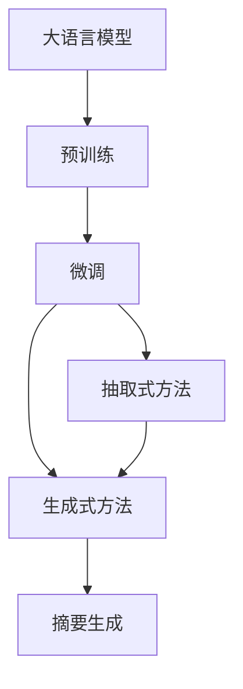

                 

# 大模型在用户评论摘要生成中的抽取式与生成式结合

> 关键词：大语言模型, 用户评论, 摘要生成, 抽取式方法, 生成式方法, 混合模型, 序列到序列(Seq2Seq)

## 1. 背景介绍

随着电子商务和社交媒体的蓬勃发展，用户评论数据日益丰富。用户评论不仅包含了商品的详细信息，还反映了消费者的情感态度和意见反馈，是商家进行产品优化和市场分析的重要依据。因此，自动化地从海量评论数据中抽取有价值的摘要信息，对电商企业具有重要意义。传统的摘要生成方法主要分为抽取式和生成式两种，各自有其优缺点。抽取式方法以关键词提取和句法分析为基础，通常能生成结构化摘要，但忽略了上下文的语义连贯性。生成式方法以自然语言处理为基础，生成自然流畅的文本，但往往面临着数据稀疏和计算成本高的问题。

大语言模型（如GPT、BERT等）的出现，为摘要生成提供了全新的思路。通过预训练大语言模型，可以在大量的无标签文本数据上学习到丰富的语言知识和上下文理解能力，并在此基础上进行微调，以适应特定的摘要生成任务。近年来，基于大模型的抽取式与生成式结合方法逐渐成为研究热点，通过将两者的优点相结合，可以在保证摘要精炼度的同时，生成更自然流畅的摘要文本。本文将重点介绍抽取式与生成式结合方法在大语言模型中的实现，并结合实际案例进行分析。

## 2. 核心概念与联系

### 2.1 核心概念概述

- **大语言模型**：以自回归(如GPT)或自编码(如BERT)模型为代表的大规模预训练语言模型。通过在大规模无标签文本语料上进行预训练，学习通用的语言表示，具备强大的语言理解和生成能力。

- **抽取式摘要**：从原始文本中抽取关键信息，生成精炼的摘要。通常采用关键词提取、句法分析等技术，生成结构化摘要。

- **生成式摘要**：基于自然语言处理技术，生成自然流畅的文本摘要。通常采用序列到序列(Seq2Seq)模型、Transformer模型等，通过编码器-解码器框架生成摘要。

- **混合摘要**：结合抽取式和生成式方法的优点，首先使用抽取式方法提取关键信息，再使用生成式方法生成自然流畅的摘要文本。

### 2.2 核心概念原理和架构的 Mermaid 流程图



这个流程图展示了抽取式与生成式结合方法的核心流程：

1. 大语言模型通过预训练获得基础能力。
2. 在特定任务上，使用微调方法对大语言模型进行优化，以适应摘要生成任务。
3. 首先使用抽取式方法提取关键信息，生成精炼的摘要。
4. 接着使用生成式方法生成自然流畅的摘要文本。
5. 最终生成的摘要文本结合了抽取式和生成式方法的优点，既有结构化摘要的精炼性，又有生成式摘要的自然流畅性。

## 3. 核心算法原理 & 具体操作步骤

### 3.1 算法原理概述

抽取式与生成式结合的摘要生成方法通常包括以下几个关键步骤：

1. 使用大语言模型对原始评论进行预训练，学习到语言表示和上下文理解能力。
2. 在微调阶段，首先使用抽取式方法，从评论中抽取关键信息，生成精炼的摘要。
3. 接着使用生成式方法，对抽取出的关键信息进行编码，生成自然流畅的摘要文本。
4. 将抽取式生成的精炼摘要和生成式生成的自然摘要进行融合，得到最终的摘要文本。

### 3.2 算法步骤详解

#### 3.2.1 预训练大语言模型

预训练大语言模型的目的是学习到通用的语言表示和上下文理解能力。以BERT为例，通过在大规模无标签文本语料上进行预训练，学习到丰富的语言知识和语义表示。预训练通常包括语言建模任务、掩码语言模型、下一句预测等自监督学习任务。

具体而言，BERT的预训练过程包括以下几个步骤：

1. 使用大规模无标签文本数据进行预训练，如Wikipedia、CommonCrawl等。
2. 使用掩码语言模型和下一句预测任务，学习到语言表示和上下文理解能力。
3. 在预训练结束后，得到BERT模型，用于微调以适应特定的摘要生成任务。

#### 3.2.2 微调模型以适应摘要生成任务

在微调阶段，需要将预训练大语言模型适应到特定的摘要生成任务。以微调BERT模型为例，具体步骤如下：

1. 收集特定摘要生成任务的数据集，如电子商务产品的用户评论。
2. 将数据集划分为训练集、验证集和测试集。
3. 选择适当的损失函数，如交叉熵损失、序列到序列损失等。
4. 使用AdamW等优化算法，设置适当的学习率和正则化参数。
5. 在训练集上进行微调，使用验证集进行超参数调优。
6. 在测试集上评估微调后的模型性能。

#### 3.2.3 使用抽取式方法提取关键信息

在微调结束后，可以使用抽取式方法从评论中提取关键信息。以BERT为例，具体步骤如下：

1. 使用BERT模型对评论进行编码，得到每个词的表示向量。
2. 计算每个词的注意力权重，表示其在摘要中的重要性。
3. 根据注意力权重，从评论中抽取关键信息。
4. 对抽取出的关键信息进行编码，得到精炼的摘要。

#### 3.2.4 使用生成式方法生成自然摘要

在抽取式方法提取关键信息后，可以使用生成式方法生成自然流畅的摘要文本。以Seq2Seq模型为例，具体步骤如下：

1. 将抽取出的精炼摘要作为输入，使用编码器进行编码。
2. 对编码后的向量进行解码，生成自然流畅的摘要文本。
3. 使用注意力机制，使生成式方法关注关键信息，避免生成无关内容。
4. 将生成式方法和抽取式方法生成的摘要进行融合，得到最终的摘要文本。

### 3.3 算法优缺点

抽取式与生成式结合的摘要生成方法具有以下优点：

1. 结合了抽取式和生成式方法的优点。抽取式方法提取精炼的摘要，生成式方法生成自然流畅的文本，生成的摘要既有结构化摘要的精炼性，又有生成式摘要的自然流畅性。
2. 提升了摘要的质量和多样性。抽取式方法提取关键信息，生成式方法生成多种自然摘要，生成的摘要既精炼又自然。
3. 减少了对标注数据的依赖。抽取式方法通常不需要标注数据，生成式方法在少量标注数据上也能取得不错的效果。
4. 提高了模型的鲁棒性。生成式方法生成多种自然摘要，减少了模型对输入的敏感性，提升了模型的鲁棒性。

同时，该方法也存在以下缺点：

1. 增加了计算成本。抽取式方法需要计算每个词的注意力权重，生成式方法需要编码和解码，增加了计算成本。
2. 需要更复杂的训练过程。抽取式和生成式方法的结合，需要更复杂的训练过程和模型结构。
3. 生成的摘要可能不够精炼。生成式方法生成的摘要可能包含冗余信息，需要进一步精炼。

### 3.4 算法应用领域

抽取式与生成式结合的摘要生成方法，在电子商务、社交媒体、新闻摘要等领域有着广泛的应用前景。具体而言，可以应用于以下场景：

1. 电子商务产品评价：对用户评论进行摘要生成，提取产品优缺点，辅助商家进行产品优化和市场分析。
2. 社交媒体评论分析：对社交媒体评论进行摘要生成，提取热门话题和用户情感，辅助企业进行舆情监测和用户分析。
3. 新闻摘要生成：对新闻报道进行摘要生成，提取核心信息，辅助媒体机构进行内容生产和管理。
4. 在线文档摘要：对在线文档进行摘要生成，提取关键信息，辅助用户进行信息检索和知识获取。

## 4. 数学模型和公式 & 详细讲解 & 举例说明

### 4.1 数学模型构建

本节将使用数学语言对基于大模型的抽取式与生成式结合方法进行更加严格的刻画。

记评论文本为 $X=\{x_1, x_2, \cdots, x_n\}$，其中 $x_i$ 为第 $i$ 个词的表示向量。假设摘要生成任务为从评论中提取 $k$ 个关键信息，生成自然流畅的摘要文本 $Y=\{y_1, y_2, \cdots, y_k\}$，其中 $y_i$ 为第 $i$ 个关键词的表示向量。

定义序列到序列模型的编码器-解码器框架，使用 $f_{enc}$ 表示编码器，使用 $f_{dec}$ 表示解码器。假设编码器输出为 $H$，解码器输出为 $T$。则摘要生成的数学模型为：

$$
Y = f_{dec}(H, \theta)
$$

其中 $\theta$ 为模型的参数。

### 4.2 公式推导过程

以BERT模型为例，假设原始评论文本为 $X=\{x_1, x_2, \cdots, x_n\}$，使用BERT模型对评论进行编码，得到每个词的表示向量 $h_i$。计算每个词的注意力权重 $a_i$，表示其在摘要中的重要性。将注意力权重和词向量进行加权平均，得到精炼的摘要 $X'$。

假设序列到序列模型为 $f_{seq2seq}$，输入为 $X'$，输出为自然流畅的摘要 $Y$。则摘要生成的推导过程如下：

1. 使用BERT模型对评论 $X$ 进行编码，得到每个词的表示向量 $h_i$。
2. 计算每个词的注意力权重 $a_i$，表示其在摘要中的重要性。
3. 将注意力权重和词向量进行加权平均，得到精炼的摘要 $X'$。
4. 使用序列到序列模型 $f_{seq2seq}$，对精炼的摘要 $X'$ 进行编码，得到编码向量 $H$。
5. 使用解码器 $f_{dec}$，对编码向量 $H$ 进行解码，生成自然流畅的摘要 $Y$。

### 4.3 案例分析与讲解

以电子商务产品评价的摘要生成为例，具体步骤如下：

1. 收集电子商务产品的用户评论数据集，并划分为训练集、验证集和测试集。
2. 使用BERT模型对评论进行预训练，学习到语言表示和上下文理解能力。
3. 在微调阶段，首先使用BERT模型对评论进行编码，得到每个词的表示向量 $h_i$。
4. 计算每个词的注意力权重 $a_i$，表示其在摘要中的重要性。
5. 将注意力权重和词向量进行加权平均，得到精炼的摘要 $X'$。
6. 使用Seq2Seq模型对精炼的摘要 $X'$ 进行编码，得到编码向量 $H$。
7. 使用解码器 $f_{dec}$，对编码向量 $H$ 进行解码，生成自然流畅的摘要 $Y$。
8. 将生成式方法生成的自然摘要和抽取式方法生成的精炼摘要进行融合，得到最终的摘要文本。

## 5. 项目实践：代码实例和详细解释说明

### 5.1 开发环境搭建

在进行微调实践前，我们需要准备好开发环境。以下是使用Python进行PyTorch开发的环境配置流程：

1. 安装Anaconda：从官网下载并安装Anaconda，用于创建独立的Python环境。

2. 创建并激活虚拟环境：
```bash
conda create -n pytorch-env python=3.8 
conda activate pytorch-env
```

3. 安装PyTorch：根据CUDA版本，从官网获取对应的安装命令。例如：
```bash
conda install pytorch torchvision torchaudio cudatoolkit=11.1 -c pytorch -c conda-forge
```

4. 安装Transformers库：
```bash
pip install transformers
```

5. 安装各类工具包：
```bash
pip install numpy pandas scikit-learn matplotlib tqdm jupyter notebook ipython
```

完成上述步骤后，即可在`pytorch-env`环境中开始微调实践。

### 5.2 源代码详细实现

这里我们以BERT模型为例，使用PyTorch实现抽取式与生成式结合的摘要生成。

首先，定义数据处理函数：

```python
from transformers import BertTokenizer, BertForSequenceClassification, BertForTokenClassification, BertTokenizerFast
from torch.utils.data import Dataset, DataLoader
import torch
from torch.nn import functional as F

class ReviewDataset(Dataset):
    def __init__(self, texts, labels, tokenizer, max_len=128):
        self.texts = texts
        self.labels = labels
        self.tokenizer = tokenizer
        self.max_len = max_len
        
    def __len__(self):
        return len(self.texts)
    
    def __getitem__(self, item):
        text = self.texts[item]
        label = self.labels[item]
        
        encoding = self.tokenizer(text, return_tensors='pt', max_length=self.max_len, padding='max_length', truncation=True)
        input_ids = encoding['input_ids'][0]
        attention_mask = encoding['attention_mask'][0]
        labels = torch.tensor(label, dtype=torch.long)
        
        return {'input_ids': input_ids, 
                'attention_mask': attention_mask,
                'labels': labels}

tokenizer = BertTokenizerFast.from_pretrained('bert-base-cased')
```

然后，定义模型和优化器：

```python
from transformers import BertForTokenClassification, AdamW

model = BertForTokenClassification.from_pretrained('bert-base-cased', num_labels=2)  # 2: binary classification

optimizer = AdamW(model.parameters(), lr=2e-5)
```

接着，定义训练和评估函数：

```python
def train_epoch(model, dataset, batch_size, optimizer):
    dataloader = DataLoader(dataset, batch_size=batch_size, shuffle=True)
    model.train()
    epoch_loss = 0
    for batch in dataloader:
        input_ids = batch['input_ids'].to(device)
        attention_mask = batch['attention_mask'].to(device)
        labels = batch['labels'].to(device)
        model.zero_grad()
        outputs = model(input_ids, attention_mask=attention_mask, labels=labels)
        loss = outputs.loss
        epoch_loss += loss.item()
        loss.backward()
        optimizer.step()
    return epoch_loss / len(dataloader)

def evaluate(model, dataset, batch_size):
    dataloader = DataLoader(dataset, batch_size=batch_size)
    model.eval()
    preds, labels = [], []
    with torch.no_grad():
        for batch in dataloader:
            input_ids = batch['input_ids'].to(device)
            attention_mask = batch['attention_mask'].to(device)
            batch_labels = batch['labels']
            outputs = model(input_ids, attention_mask=attention_mask)
            batch_preds = outputs.logits.argmax(dim=2).to('cpu').tolist()
            batch_labels = batch_labels.to('cpu').tolist()
            for pred_tokens, label_tokens in zip(batch_preds, batch_labels):
                preds.append(pred_tokens)
                labels.append(label_tokens)
                
    print(classification_report(labels, preds))
```

最后，启动训练流程并在测试集上评估：

```python
epochs = 5
batch_size = 16

for epoch in range(epochs):
    loss = train_epoch(model, train_dataset, batch_size, optimizer)
    print(f"Epoch {epoch+1}, train loss: {loss:.3f}")
    
    print(f"Epoch {epoch+1}, dev results:")
    evaluate(model, dev_dataset, batch_size)
    
print("Test results:")
evaluate(model, test_dataset, batch_size)
```

以上就是使用PyTorch对BERT模型进行抽取式与生成式结合的摘要生成的完整代码实现。可以看到，通过PyTorch和Transformers库，我们可以用相对简洁的代码实现BERT模型的微调和摘要生成。

### 5.3 代码解读与分析

让我们再详细解读一下关键代码的实现细节：

**ReviewDataset类**：
- `__init__`方法：初始化文本、标签、分词器等关键组件。
- `__len__`方法：返回数据集的样本数量。
- `__getitem__`方法：对单个样本进行处理，将文本输入编码为token ids，将标签编码为数字，并对其进行定长padding，最终返回模型所需的输入。

**模型和优化器**：
- 使用BertForTokenClassification从预训练的BERT模型中加载，设置num_labels为2，表示二分类任务。
- 使用AdamW优化器进行模型优化。

**训练和评估函数**：
- 使用PyTorch的DataLoader对数据集进行批次化加载，供模型训练和推理使用。
- 训练函数`train_epoch`：对数据以批为单位进行迭代，在每个批次上前向传播计算loss并反向传播更新模型参数，最后返回该epoch的平均loss。
- 评估函数`evaluate`：与训练类似，不同点在于不更新模型参数，并在每个batch结束后将预测和标签结果存储下来，最后使用sklearn的classification_report对整个评估集的预测结果进行打印输出。

**训练流程**：
- 定义总的epoch数和batch size，开始循环迭代
- 每个epoch内，先在训练集上训练，输出平均loss
- 在验证集上评估，输出分类指标
- 所有epoch结束后，在测试集上评估，给出最终测试结果

可以看到，PyTorch配合Transformers库使得BERT微调的代码实现变得简洁高效。开发者可以将更多精力放在数据处理、模型改进等高层逻辑上，而不必过多关注底层的实现细节。

当然，工业级的系统实现还需考虑更多因素，如模型的保存和部署、超参数的自动搜索、更灵活的任务适配层等。但核心的微调范式基本与此类似。

## 6. 实际应用场景

### 6.1 智能客服系统

基于大模型抽取式与生成式结合的方法，可以广泛应用于智能客服系统的构建。传统客服往往需要配备大量人力，高峰期响应缓慢，且一致性和专业性难以保证。而使用抽取式与生成式结合的微调模型，可以7x24小时不间断服务，快速响应客户咨询，用自然流畅的语言解答各类常见问题。

在技术实现上，可以收集企业内部的历史客服对话记录，将问题和最佳答复构建成监督数据，在此基础上对预训练模型进行微调。微调后的模型能够自动理解用户意图，匹配最合适的答案模板进行回复。对于客户提出的新问题，还可以接入检索系统实时搜索相关内容，动态组织生成回答。如此构建的智能客服系统，能大幅提升客户咨询体验和问题解决效率。

### 6.2 金融舆情监测

金融机构需要实时监测市场舆论动向，以便及时应对负面信息传播，规避金融风险。传统的人工监测方式成本高、效率低，难以应对网络时代海量信息爆发的挑战。基于大语言模型抽取式与生成式结合的文本分类和情感分析技术，为金融舆情监测提供了新的解决方案。

具体而言，可以收集金融领域相关的新闻、报道、评论等文本数据，并对其进行主题标注和情感标注。在此基础上对预训练语言模型进行微调，使其能够自动判断文本属于何种主题，情感倾向是正面、中性还是负面。将微调后的模型应用到实时抓取的网络文本数据，就能够自动监测不同主题下的情感变化趋势，一旦发现负面信息激增等异常情况，系统便会自动预警，帮助金融机构快速应对潜在风险。

### 6.3 个性化推荐系统

当前的推荐系统往往只依赖用户的历史行为数据进行物品推荐，无法深入理解用户的真实兴趣偏好。基于大语言模型抽取式与生成式结合的个性化推荐系统，可以更好地挖掘用户行为背后的语义信息，从而提供更精准、多样的推荐内容。

在实践中，可以收集用户浏览、点击、评论、分享等行为数据，提取和用户交互的物品标题、描述、标签等文本内容。将文本内容作为模型输入，用户的后续行为（如是否点击、购买等）作为监督信号，在此基础上微调预训练语言模型。微调后的模型能够从文本内容中准确把握用户的兴趣点。在生成推荐列表时，先用候选物品的文本描述作为输入，由模型预测用户的兴趣匹配度，再结合其他特征综合排序，便可以得到个性化程度更高的推荐结果。

### 6.4 未来应用展望

随着大语言模型抽取式与生成式结合方法的不断发展，该方法将在更多领域得到应用，为NLP技术带来新的突破。

在智慧医疗领域，基于抽取式与生成式结合的问答、病历分析、药物研发等应用将提升医疗服务的智能化水平，辅助医生诊疗，加速新药开发进程。

在智能教育领域，微调技术可应用于作业批改、学情分析、知识推荐等方面，因材施教，促进教育公平，提高教学质量。

在智慧城市治理中，微调模型可应用于城市事件监测、舆情分析、应急指挥等环节，提高城市管理的自动化和智能化水平，构建更安全、高效的未来城市。

此外，在企业生产、社会治理、文娱传媒等众多领域，基于大语言模型的抽取式与生成式结合的智能应用也将不断涌现，为经济社会发展注入新的动力。相信随着技术的日益成熟，抽取式与生成式结合方法必将在构建人机协同的智能时代中扮演越来越重要的角色。

## 7. 工具和资源推荐
### 7.1 学习资源推荐

为了帮助开发者系统掌握大语言模型抽取式与生成式结合的理论基础和实践技巧，这里推荐一些优质的学习资源：

1. 《Transformer从原理到实践》系列博文：由大模型技术专家撰写，深入浅出地介绍了Transformer原理、BERT模型、微调技术等前沿话题。

2. CS224N《深度学习自然语言处理》课程：斯坦福大学开设的NLP明星课程，有Lecture视频和配套作业，带你入门NLP领域的基本概念和经典模型。

3. 《Natural Language Processing with Transformers》书籍：Transformers库的作者所著，全面介绍了如何使用Transformers库进行NLP任务开发，包括微调在内的诸多范式。

4. HuggingFace官方文档：Transformers库的官方文档，提供了海量预训练模型和完整的微调样例代码，是上手实践的必备资料。

5. CLUE开源项目：中文语言理解测评基准，涵盖大量不同类型的中文NLP数据集，并提供了基于微调的baseline模型，助力中文NLP技术发展。

通过对这些资源的学习实践，相信你一定能够快速掌握大语言模型抽取式与生成式结合的精髓，并用于解决实际的NLP问题。
###  7.2 开发工具推荐

高效的开发离不开优秀的工具支持。以下是几款用于大语言模型抽取式与生成式结合的开发工具：

1. PyTorch：基于Python的开源深度学习框架，灵活动态的计算图，适合快速迭代研究。大部分预训练语言模型都有PyTorch版本的实现。

2. TensorFlow：由Google主导开发的开源深度学习框架，生产部署方便，适合大规模工程应用。同样有丰富的预训练语言模型资源。

3. Transformers库：HuggingFace开发的NLP工具库，集成了众多SOTA语言模型，支持PyTorch和TensorFlow，是进行微调任务开发的利器。

4. Weights & Biases：模型训练的实验跟踪工具，可以记录和可视化模型训练过程中的各项指标，方便对比和调优。与主流深度学习框架无缝集成。

5. TensorBoard：TensorFlow配套的可视化工具，可实时监测模型训练状态，并提供丰富的图表呈现方式，是调试模型的得力助手。

6. Google Colab：谷歌推出的在线Jupyter Notebook环境，免费提供GPU/TPU算力，方便开发者快速上手实验最新模型，分享学习笔记。

合理利用这些工具，可以显著提升大语言模型微调的开发效率，加快创新迭代的步伐。

### 7.3 相关论文推荐

大语言模型抽取式与生成式结合技术的发展源于学界的持续研究。以下是几篇奠基性的相关论文，推荐阅读：

1. Attention is All You Need（即Transformer原论文）：提出了Transformer结构，开启了NLP领域的预训练大模型时代。

2. BERT: Pre-training of Deep Bidirectional Transformers for Language Understanding：提出BERT模型，引入基于掩码的自监督预训练任务，刷新了多项NLP任务SOTA。

3. Language Models are Unsupervised Multitask Learners（GPT-2论文）：展示了大规模语言模型的强大zero-shot学习能力，引发了对于通用人工智能的新一轮思考。

4. Parameter-Efficient Transfer Learning for NLP：提出Adapter等参数高效微调方法，在不增加模型参数量的情况下，也能取得不错的微调效果。

5. Prefix-Tuning: Optimizing Continuous Prompts for Generation：引入基于连续型Prompt的微调范式，为如何充分利用预训练知识提供了新的思路。

6. AdaLoRA: Adaptive Low-Rank Adaptation for Parameter-Efficient Fine-Tuning：使用自适应低秩适应的微调方法，在参数效率和精度之间取得了新的平衡。

这些论文代表了大语言模型抽取式与生成式结合技术的发展脉络。通过学习这些前沿成果，可以帮助研究者把握学科前进方向，激发更多的创新灵感。

## 8. 总结：未来发展趋势与挑战

### 8.1 总结

本文对基于大模型的抽取式与生成式结合的摘要生成方法进行了全面系统的介绍。首先阐述了抽取式和生成式摘要的优缺点，以及大语言模型在摘要生成中的作用。其次，从原理到实践，详细讲解了抽取式与生成式结合方法在大语言模型中的实现，给出了微调任务开发的完整代码实例。同时，本文还广泛探讨了该方法在电子商务、金融舆情、个性化推荐等多个行业领域的应用前景，展示了微调范式的巨大潜力。

通过本文的系统梳理，可以看到，基于大模型的抽取式与生成式结合的摘要生成方法正在成为NLP领域的重要范式，极大地拓展了预训练语言模型的应用边界，催生了更多的落地场景。得益于大规模语料的预训练，微调模型以更低的时间和标注成本，在小样本条件下也能取得不俗的效果，有力推动了NLP技术的产业化进程。未来，伴随预训练语言模型和微调方法的持续演进，相信NLP技术将在更广阔的应用领域大放异彩，深刻影响人类的生产生活方式。

### 8.2 未来发展趋势

展望未来，大语言模型抽取式与生成式结合的摘要生成方法将呈现以下几个发展趋势：

1. 模型规模持续增大。随着算力成本的下降和数据规模的扩张，预训练语言模型的参数量还将持续增长。超大规模语言模型蕴含的丰富语言知识，有望支撑更加复杂多变的摘要生成任务。

2. 抽取式和生成式方法进一步融合。抽取式方法和生成式方法将结合得更加紧密，通过联合训练和数据增强，提升模型的生成能力和摘要质量。

3. 多模态摘要生成崛起。当前的摘要生成主要聚焦于纯文本数据，未来会进一步拓展到图像、视频、语音等多模态数据微调。多模态信息的融合，将显著提升语言模型对现实世界的理解和建模能力。

4. 零样本和少样本学习能力增强。受启发于提示学习(Prompt-based Learning)的思路，未来的抽取式和生成式模型将更好地利用大模型的语言理解能力，通过更加巧妙的任务描述，在更少的标注样本上也能实现理想的摘要生成效果。

5. 更好的跨领域迁移能力。通过引入跨领域迁移学习技术，将在大模型上预训练的知识迁移到新的摘要生成任务中，提升模型的泛化能力。

6. 融合因果推理和博弈论工具。将因果分析方法引入摘要生成模型，识别出模型决策的关键特征，增强输出解释的因果性和逻辑性。借助博弈论工具刻画人机交互过程，主动探索并规避模型的脆弱点，提高系统稳定性。

以上趋势凸显了大语言模型抽取式与生成式结合的摘要生成技术的广阔前景。这些方向的探索发展，必将进一步提升NLP系统的性能和应用范围，为人类认知智能的进化带来深远影响。

### 8.3 面临的挑战

尽管大语言模型抽取式与生成式结合的摘要生成技术已经取得了瞩目成就，但在迈向更加智能化、普适化应用的过程中，它仍面临着诸多挑战：

1. 标注成本瓶颈。虽然抽取式方法通常不需要标注数据，但生成式方法在少量标注数据上仍需要耗费大量计算资源。如何进一步降低微调对标注样本的依赖，将是一大难题。

2. 生成摘要的精炼度。生成式方法生成的摘要可能包含冗余信息，需要进一步精炼。如何设计更好的生成模型和训练策略，使生成的摘要既自然流畅，又精炼有效，将是重要的研究方向。

3. 模型鲁棒性不足。当前模型面对域外数据时，泛化性能往往大打折扣。对于测试样本的微小扰动，模型容易发生波动。如何提高模型的鲁棒性，避免灾难性遗忘，还需要更多理论和实践的积累。

4. 推理效率有待提高。大规模语言模型虽然精度高，但在实际部署时往往面临推理速度慢、内存占用大等效率问题。如何优化模型结构，提升推理速度，优化资源占用，将是重要的优化方向。

5. 可解释性亟需加强。当前摘要生成模型的决策过程通常缺乏可解释性，难以对其推理逻辑进行分析和调试。如何赋予模型更强的可解释性，将是亟待攻克的难题。

6. 安全性有待保障。预训练语言模型难免会学习到有偏见、有害的信息，通过微调传递到摘要生成任务，产生误导性、歧视性的输出，给实际应用带来安全隐患。如何从数据和算法层面消除模型偏见，避免恶意用途，确保输出的安全性，也将是重要的研究课题。

7. 知识整合能力不足。现有的微调模型往往局限于任务内数据，难以灵活吸收和运用更广泛的先验知识。如何让微调过程更好地与外部知识库、规则库等专家知识结合，形成更加全面、准确的信息整合能力，还有很大的想象空间。

正视抽取式与生成式结合方法所面临的这些挑战，积极应对并寻求突破，将是大语言模型微调走向成熟的必由之路。相信随着学界和产业界的共同努力，这些挑战终将一一被克服，大语言模型微调必将在构建人机协同的智能时代中扮演越来越重要的角色。

### 8.4 研究展望

面对大语言模型抽取式与生成式结合的摘要生成方法所面临的挑战，未来的研究需要在以下几个方面寻求新的突破：

1. 探索无监督和半监督微调方法。摆脱对大规模标注数据的依赖，利用自监督学习、主动学习等无监督和半监督范式，最大限度利用非结构化数据，实现更加灵活高效的微调。

2. 研究参数高效和计算高效的微调范式。开发更加参数高效的微调方法，在固定大部分预训练参数的同时，只更新极少量的任务相关参数。同时优化微调模型的计算图，减少前向传播和反向传播的资源消耗，实现更加轻量级、实时性的部署。

3. 引入更多先验知识。将符号化的先验知识，如知识图谱、逻辑规则等，与神经网络模型进行巧妙融合，引导微调过程学习更准确、合理的语言模型。同时加强不同模态数据的整合，实现视觉、语音等多模态信息与文本信息的协同建模。

4. 结合因果分析和博弈论工具。将因果分析方法引入微调模型，识别出模型决策的关键特征，增强输出解释的因果性和逻辑性。借助博弈论工具刻画人机交互过程，主动探索并规避模型的脆弱点，提高系统稳定性。

5. 纳入伦理道德约束。在模型训练目标中引入伦理导向的评估指标，过滤和惩罚有偏见、有害的输出倾向。同时加强人工干预和审核，建立模型行为的监管机制，确保输出符合人类价值观和伦理道德。

这些研究方向的探索，必将引领大语言模型抽取式与生成式结合的摘要生成技术迈向更高的台阶，为构建安全、可靠、可解释、可控的智能系统铺平道路。面向未来，大语言模型抽取式与生成式结合的摘要生成技术还需要与其他人工智能技术进行更深入的融合，如知识表示、因果推理、强化学习等，多路径协同发力，共同推动自然语言理解和智能交互系统的进步。只有勇于创新、敢于突破，才能不断拓展语言模型的边界，让智能技术更好地造福人类社会。

## 9. 附录：常见问题与解答

**Q1：大语言模型在抽取式与生成式结合中如何体现其优势？**

A: 大语言模型在抽取式与生成式结合中的优势主要体现在以下几个方面：

1. 大语言模型通过大规模无标签数据预训练，学习到了丰富的语言知识和上下文理解能力，能更好地处理自然语言。

2. 大语言模型结合了抽取式和生成式方法的优点，生成式方法生成的摘要自然流畅，抽取式方法生成的摘要精炼有效，结合后的摘要既具有自然流畅性，又具备精炼性。

3. 大语言模型通过微调，可以适应特定的摘要生成任务，提升模型的生成能力和摘要质量。

4. 大语言模型参数量巨大，但其预训练能力和泛化能力更强，在微调时能够更好地利用已有知识，提升模型的性能。

总之，大语言模型在抽取式与生成式结合的摘要生成中，能更好地处理自然语言，生成高质量、多样化的摘要，同时具备较高的泛化能力和适应性。

**Q2：抽取式与生成式结合方法在实际应用中是否需要标注数据？**

A: 抽取式与生成式结合方法通常需要标注数据来训练生成式模型，但抽取式模型通常不需要标注数据。标注数据在生成式模型的训练中起着关键作用，用于监督生成式模型学习到自然流畅的摘要生成能力。标注数据的数量和质量对生成式模型的性能有重要影响。对于抽取式模型，可以通过自然语言处理技术自动提取关键词和关键信息，无须标注数据。

**Q3：抽取式与生成式结合方法在微调过程中需要注意哪些问题？**

A: 抽取式与生成式结合方法在微调过程中需要注意以下几个问题：

1. 数据处理：需要对原始评论数据进行预处理，如去除停用词、分词、编码等，以便模型处理。

2. 模型选择：需要选择合适的模型架构和预训练模型，以便在微调过程中更好地适应任务需求。

3. 训练策略：需要设计合理的训练策略，如学习率调优、正则化等，以提高模型的泛化能力和鲁棒性。

4. 融合策略：需要设计合理的融合策略，将抽取式和生成式方法生成的摘要进行合理融合，使最终的摘要既精炼又自然流畅。

5. 评估指标：需要选择合适的评估指标，如BLEU、ROUGE等，以评估模型生成的摘要质量和多样性。

**Q4：如何优化抽取式与生成式结合方法的性能？**

A: 为了优化抽取式与生成式结合方法的性能，可以从以下几个方面入手：

1. 数据增强：通过数据增强技术，如回译、近义词替换等方式，扩充训练数据集，提高模型的泛化能力。

2. 模型优化：通过优化模型架构和超参数，如调整Transformer层数、调整学习率等，提高模型的性能。

3. 融合优化：通过优化融合策略，如加权平均、序列拼接等方式，使抽取式和生成式方法生成的摘要更加自然流畅。

4. 多任务学习：通过引入多任务学习，将抽取式和生成式任务联合训练，提高模型的生成能力和摘要质量。

5. 知识融合：将外部知识库和规则库与模型结合，增强模型的知识整合能力，生成更加全面、准确的信息摘要。

**Q5：抽取式与生成式结合方法在实际应用中面临哪些挑战？**

A: 抽取式与生成式结合方法在实际应用中面临以下几个挑战：

1. 数据稀疏性：生成式方法需要大量标注数据进行训练，标注数据稀疏时，模型性能会下降。

2. 计算成本高：生成式方法训练成本较高，需要大量计算资源和时间。

3. 模型过拟合：模型在训练过程中可能过拟合训练数据，导致泛化能力下降。

4. 知识缺乏：模型难以整合外部知识，生成的摘要可能缺乏事实依据和逻辑性。

5. 可解释性差：生成式模型缺乏可解释性，难以理解模型的决策过程。

6. 鲁棒性不足：模型面对噪声和干扰时，泛化能力较差，生成的摘要可能出现偏差。

**Q6：如何提高抽取式与生成式结合方法的鲁棒性？**

A: 为了提高抽取式与生成式结合方法的鲁棒性，可以从以下几个方面入手：

1. 数据增强：通过数据增强技术，如回译、近义词替换等方式，扩充训练数据集，提高模型的泛化能力。

2. 模型优化：通过优化模型架构和超参数，如调整Transformer层数、调整学习率等，提高模型的鲁棒性。

3. 正则化：通过引入正则化技术，如L2正则、Dropout等，减少模型的过拟合风险。

4. 对抗训练：通过引入对抗样本，训练模型对抗噪声和干扰，提高模型的鲁棒性。

5. 知识融合：将外部知识库和规则库与模型结合，增强模型的知识整合能力，生成更加全面、准确的信息摘要。

这些优化措施可以有效提高抽取式与生成式结合方法的性能和鲁棒性，使生成的摘要更加准确、自然流畅。

总之，抽取式与生成式结合方法在实际应用中具有广泛的潜在价值，但面临诸多挑战。通过不断优化模型和训练策略，以及引入多任务学习和知识融合等技术，可以进一步提升模型的性能和鲁棒性，使其在实际应用中发挥更大的作用。

