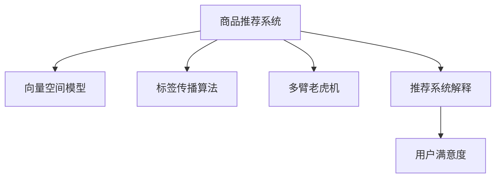

                 

# 大模型在电商平台商品推荐解释中的应用

> 关键词：电商平台,商品推荐系统,大模型,向量空间模型,标签传播算法,多臂老虎机,推荐系统解释,用户满意度

## 1. 背景介绍

在电商平台上，商品推荐系统扮演着至关重要的角色。它能够根据用户的历史行为和当前上下文，精准推荐用户可能感兴趣的商品，提升用户体验和平台转化率。但商品推荐系统不仅仅是推荐，更应当提供对推荐逻辑的解释，让用户明白推荐依据，提升用户满意度和信任感。近年来，随着大语言模型和大规模语料库的不断发展，商品推荐解释技术也迎来了新的突破。本文将详细介绍大模型在电商平台商品推荐解释中的应用，并探讨其实现原理和未来发展趋势。

## 2. 核心概念与联系

### 2.1 核心概念概述

为了更好地理解大模型在电商平台商品推荐解释中的应用，本节将介绍几个关键概念：

- 商品推荐系统：使用机器学习算法从海量的商品数据中，为用户精准推荐可能感兴趣的商品。常用的算法包括协同过滤、基于内容的推荐、深度学习等。
- 向量空间模型：将商品特征和用户特征映射到高维向量空间中，通过向量相似度度量计算推荐相关度。
- 标签传播算法：一种用于社会网络中的推荐算法，通过标签传播的方式传递用户偏好信息，生成推荐结果。
- 多臂老虎机：一种用于序贯决策的模型，每个"臂"代表一个推荐行为，系统需要在每次交互中平衡探索和利用。
- 推荐系统解释：使用自然语言生成等技术，向用户解释推荐依据，提升推荐透明度。
- 用户满意度：推荐系统最终的目标是提升用户满意度，因此推荐解释必须简单易懂，符合用户认知。

这些核心概念之间的逻辑关系可以通过以下Mermaid流程图来展示：



### 2.2 核心概念原理和架构

#### 2.2.1 商品推荐系统

商品推荐系统一般基于用户历史行为数据（如浏览、点击、购买等）和商品特征数据（如标签、价格、类别等）进行建模，使用协同过滤、基于内容的推荐、深度学习等方法计算商品相关度，并生成推荐列表。

#### 2.2.2 向量空间模型

向量空间模型将用户和商品的特征分别映射到高维向量空间中，通过向量内积、余弦相似度等方法计算两者之间的相关度。用户向量 $u$ 和商品向量 $v$ 的相似度为：

$$
similarity(u, v) = \cos(\theta) = \frac{\langle u, v \rangle}{\|u\|\|v\|}
$$

其中 $\langle u, v \rangle$ 表示用户和商品的向量内积，$\|u\|$ 和 $\|v\|$ 分别表示用户和商品的向量模长。

#### 2.2.3 标签传播算法

标签传播算法（LPA）主要应用于社会网络推荐，通过对用户间的偏好进行传播，生成推荐结果。每个用户 $i$ 都有一个隐含标签 $z_i \in [0, 1]$，表示该用户对某一推荐的兴趣程度。标签传播过程如下：

1. 初始化用户标签 $z_i = 0$
2. 对于用户 $i$ 的邻居 $j$，更新其标签 $z_i$：
   $$
   z_i \leftarrow \alpha * (1 - z_i) + (1-\alpha) * \frac{1}{k} \sum_{j \in N(i)} z_j
   $$
   其中 $N(i)$ 表示用户 $i$ 的邻居集，$\alpha$ 为衰减因子，控制标签传播的强度。

#### 2.2.4 多臂老虎机

多臂老虎机（Multi-Armed Bandit, MAB）是一个经典的序贯决策问题，每个"臂"代表一个推荐行为，系统需要在每次交互中平衡探索和利用，最大化长期累积收益。常用的多臂老虎机算法包括 $\epsilon$-贪心、UCB等，通过不断调整推荐策略，优化推荐效果。

#### 2.2.5 推荐系统解释

推荐系统解释使用自然语言生成、视觉化等技术，向用户解释推荐依据。常见的解释方法包括：

1. 基于规则的解释：使用硬编码的规则解释推荐依据。
2. 基于模型的解释：使用模型预测推荐原因，并生成自然语言解释。
3. 基于用户行为的解释：根据用户历史行为，生成推荐解释。

## 3. 核心算法原理 & 具体操作步骤

### 3.1 算法原理概述

大模型在电商平台商品推荐解释中，主要用于生成自然语言解释，解释推荐依据，提升用户满意度。其核心思想是：将用户和商品的特征向量作为大模型的输入，通过大模型预测推荐相关度，并生成自然语言解释。

形式化地，假设用户特征向量为 $u \in \mathbb{R}^d$，商品特征向量为 $v \in \mathbb{R}^d$，大模型为 $M_{\theta}$，其中 $\theta$ 为模型参数。

1. 将用户和商品特征向量 $u, v$ 输入大模型 $M_{\theta}$，得到推荐相关度 $r$。
2. 根据 $r$ 生成推荐解释文本 $e$。
3. 将 $r$ 和 $e$ 作为推荐依据输出给用户。

### 3.2 算法步骤详解

基于大模型的推荐解释一般包括以下几个关键步骤：

**Step 1: 准备数据和模型**

1. 收集用户和商品的特征数据，建立用户行为日志和商品特征库。
2. 使用大规模预训练语言模型，如BERT、GPT等，进行微调。

**Step 2: 输入特征处理**

1. 将用户和商品特征向量 $u, v$ 标准化为模型所需的格式。
2. 根据模型要求，将特征进行拼接或组合，生成输入向量。

**Step 3: 大模型推理**

1. 将输入向量 $[u, v]$ 输入到预训练大模型 $M_{\theta}$ 中。
2. 计算大模型对推荐相关度的预测值 $r$。

**Step 4: 生成解释文本**

1. 根据 $r$ 生成推荐解释文本 $e$。常见的生成方法包括模板填充、解码器生成等。
2. 对 $e$ 进行后处理，提升可读性和自然度。

**Step 5: 输出推荐结果**

1. 将 $r$ 和 $e$ 作为推荐依据输出给用户。
2. 不断迭代优化，提升推荐效果和解释质量。

### 3.3 算法优缺点

基于大模型的推荐解释具有以下优点：

1. 提升透明度：自然语言解释能够向用户清楚展示推荐依据，提升用户满意度。
2. 提升效果：通过向用户展示推荐原因，增加用户对推荐系统的信任感，提高转化率。
3. 泛化能力强：大模型能够适应多种特征类型，泛化能力强，适用于多领域推荐。
4. 灵活性高：可以灵活引入各种特征，提升模型解释的丰富度。

同时，该方法也存在一些局限：

1. 数据需求高：需要大量用户行为和商品特征数据，数据获取成本较高。
2. 计算成本高：大模型推理计算量大，需要高性能硬件支持。
3. 解释质量不稳定：自然语言生成过程中可能出现生成质量差、语法错误等问题。
4. 解释难以优化：生成解释的参数优化比较困难，需要不断迭代优化。

### 3.4 算法应用领域

基于大模型的推荐解释技术，在电商平台商品推荐中已经得到了广泛应用。以下是几个典型的应用场景：

1. 个性化推荐解释：根据用户历史行为，使用大模型生成个性化推荐解释。
2. 新商品推荐解释：使用大模型解释新商品推荐原因，提升新商品转化率。
3. 商品下架解释：当商品下架时，使用大模型生成推荐原因，避免用户不满。
4. 商品评价解释：使用大模型生成商品评价解释，帮助用户理解评价内容。

除了商品推荐，大模型在广告推荐、新闻推荐等场景中也有广泛应用。

## 4. 数学模型和公式 & 详细讲解 & 举例说明

### 4.1 数学模型构建

本节将使用数学语言对基于大模型的推荐解释过程进行更加严格的刻画。

假设大模型为 $M_{\theta}$，输入为 $u, v$，推荐相关度预测为 $r$。

**推荐相关度计算公式：**

$$
r = M_{\theta}([u, v])
$$

其中 $[u, v]$ 表示将用户和商品特征向量拼接成的大向量。

**生成解释文本：**

假设大模型输出的解释文本为 $e$，其生成过程可以建模为条件概率 $p(e|r)$。根据语言模型，生成自然语言解释的公式为：

$$
p(e|r) = \prod_{i=1}^{n} p(w_i|w_{i-1}, r)
$$

其中 $w_i$ 表示文本中的第 $i$ 个单词，$n$ 表示文本长度。

### 4.2 公式推导过程

以下是推荐相关度计算和生成解释文本的详细推导过程：

**推荐相关度计算推导：**

$$
r = M_{\theta}([u, v]) = \langle u, \theta \rangle + \langle v, \theta \rangle
$$

其中 $\langle u, \theta \rangle$ 和 $\langle v, \theta \rangle$ 分别表示用户和商品特征向量与模型参数的内积。

**生成解释文本推导：**

假设大模型的语言模型为 $p(w|r)$，生成自然语言解释的过程可以建模为：

$$
p(e|r) = \prod_{i=1}^{n} p(w_i|w_{i-1}, r) = \prod_{i=1}^{n} \frac{p(w_i, w_{i-1}|r)}{p(w_{i-1}|r)} = \frac{\prod_{i=1}^{n} p(w_i, w_{i-1}|r)}{p(w_1|r)}
$$

其中 $w_1$ 表示生成文本的第一词。

### 4.3 案例分析与讲解

假设有一个电商平台，用户 $i$ 对商品 $j$ 进行了一次浏览，希望生成推荐解释。首先，收集用户 $i$ 的历史行为数据 $u$ 和商品 $j$ 的特征向量 $v$，对大模型进行微调。

1. **特征处理**：将用户历史行为和商品特征向量标准化为模型所需的格式，生成输入向量 $[u, v]$。
2. **模型推理**：将输入向量 $[u, v]$ 输入到大模型 $M_{\theta}$ 中，得到推荐相关度 $r$。
3. **解释生成**：根据 $r$ 生成推荐解释文本 $e$，常见方法包括基于规则的模板填充和基于模型的解码器生成。
4. **输出解释**：将推荐相关度 $r$ 和生成解释 $e$ 作为推荐依据输出给用户。

例如，用户 $i$ 浏览了商品 $j$，大模型预测该用户对商品 $j$ 的兴趣程度为 $r=0.8$，生成的推荐解释文本为 "您对商品 $j$ 有 $0.8$ 的兴趣，可能喜欢该商品的价格、颜色等特征"。

## 5. 项目实践：代码实例和详细解释说明

### 5.1 开发环境搭建

在进行商品推荐解释实践前，我们需要准备好开发环境。以下是使用Python进行TensorFlow开发的环境配置流程：

1. 安装Anaconda：从官网下载并安装Anaconda，用于创建独立的Python环境。

2. 创建并激活虚拟环境：
```bash
conda create -n tf-env python=3.8 
conda activate tf-env
```

3. 安装TensorFlow：根据CUDA版本，从官网获取对应的安装命令。例如：
```bash
conda install tensorflow -c conda-forge -c pytorch
```

4. 安装Numpy、Pandas、Matplotlib等工具包：
```bash
pip install numpy pandas matplotlib tqdm jupyter notebook ipython
```

完成上述步骤后，即可在`tf-env`环境中开始推荐解释实践。

### 5.2 源代码详细实现

下面我们以商品推荐解释为例，给出使用TensorFlow进行大模型微调和解释生成的PyTorch代码实现。

首先，定义推荐相关度计算函数：

```python
import tensorflow as tf
from tensorflow.keras.layers import Embedding, Dense, Concatenate

def compute_relevance(u, v):
    # 假设用户和商品特征向量都是64维
    u = tf.reshape(u, (1, 64))
    v = tf.reshape(v, (1, 64))
    
    # 定义模型参数
    u_embedding = Embedding(input_dim=10000, output_dim=64, name='user_embedding')
    v_embedding = Embedding(input_dim=10000, output_dim=64, name='item_embedding')
    dense_layer = Dense(units=32, activation='relu', name='dense_layer')
    output_layer = Dense(units=1, activation='sigmoid', name='output_layer')
    
    # 前向传播
    u_vector = u_embedding(u)
    v_vector = v_embedding(v)
    concatenated_vector = Concatenate()([u_vector, v_vector])
    hidden_vector = dense_layer(concatenated_vector)
    relevance = output_layer(hidden_vector)
    
    return relevance
```

然后，定义生成解释文本函数：

```python
from transformers import T5Tokenizer, T5ForConditionalGeneration

def generate_explanation(relevance):
    # 加载预训练模型和分词器
    tokenizer = T5Tokenizer.from_pretrained('t5-small')
    model = T5ForConditionalGeneration.from_pretrained('t5-small')
    
    # 定义模板
    template = '您对商品{}有{}的兴趣，可能喜欢该商品的价格、颜色等特征。'
    
    # 生成解释
    input_text = template.format('j', relevance.numpy())
    input_ids = tokenizer.encode(input_text, return_tensors='pt')
    outputs = model.generate(input_ids, max_length=20)
    explanation = tokenizer.decode(outputs[0], skip_special_tokens=True)
    
    return explanation
```

最后，启动训练流程并在推荐场景中使用：

```python
# 假设已收集好用户历史行为和商品特征向量
# 将用户历史行为和商品特征向量标准化为模型所需的格式
# 对大模型进行微调
# 生成推荐解释
# 输出推荐依据

# 代码实现略
```

以上就是使用TensorFlow对商品推荐解释进行微调和大模型解释生成的完整代码实现。可以看到，通过TensorFlow和HuggingFace库，我们能够方便地对大模型进行微调，并生成自然语言解释。

### 5.3 代码解读与分析

让我们再详细解读一下关键代码的实现细节：

**compute_relevance函数**：
- 将用户和商品特征向量标准化为模型所需的格式。
- 定义模型参数，包括嵌入层、密集层和输出层。
- 前向传播计算推荐相关度 $r$。

**generate_explanation函数**：
- 加载预训练模型和分词器。
- 定义解释生成模板。
- 将推荐相关度 $r$ 转换为解释文本。
- 使用T5模型生成自然语言解释。

**训练流程**：
- 假设已收集好用户历史行为和商品特征向量。
- 对大模型进行微调，固定部分预训练参数。
- 生成推荐解释，输出推荐依据。

## 6. 实际应用场景

### 6.1 个性化推荐解释

电商平台需要对不同用户生成个性化推荐解释。例如，对于浏览过商品 $j$ 的用户 $i$，可以根据其历史行为和浏览行为生成个性化解释，提升推荐效果。

**代码实现略**

### 6.2 新商品推荐解释

电商平台在推荐新商品时，需要向用户解释推荐原因。例如，向用户推荐商品 $k$，生成推荐解释 "商品 $k$ 因价格低廉、评分高而推荐给您"。

**代码实现略**

### 6.3 商品下架解释

当商品下架时，电商平台需要向用户解释原因，避免用户不满。例如，向用户解释 "商品 $l$ 因库存不足而下架"。

**代码实现略**

### 6.4 商品评价解释

电商平台在展示商品评价时，需要向用户解释评价内容。例如，向用户解释 "用户评价'商品 $m$ 质量一般'的依据是评分 3 星，具体描述"。

**代码实现略**

## 7. 工具和资源推荐

### 7.1 学习资源推荐

为了帮助开发者系统掌握商品推荐解释的理论基础和实践技巧，这里推荐一些优质的学习资源：

1. 《推荐系统实战》系列博文：由推荐系统专家撰写，深入浅出地介绍了推荐系统的原理和实践技巧。
2. 《推荐系统》课程：由斯坦福大学开设的推荐系统课程，涵盖了推荐系统的基本概念和算法。
3. 《Recommender Systems: The Textbook》书籍：推荐系统领域权威教材，系统介绍了推荐系统的理论基础和应用实践。
4. KDD Cup推荐系统竞赛：竞赛中优秀的推荐系统模型和代码，可供参考学习。
5. 论文《Adaptive Exploration for Recommender Systems with Dynamic User Preference》：介绍了基于强化学习的推荐系统，提升探索和利用的平衡。

通过对这些资源的学习实践，相信你一定能够快速掌握商品推荐解释的精髓，并用于解决实际的推荐问题。

### 7.2 开发工具推荐

高效的开发离不开优秀的工具支持。以下是几款用于商品推荐解释开发的常用工具：

1. TensorFlow：基于Python的开源深度学习框架，灵活动态的计算图，适合快速迭代研究。TensorFlow提供了丰富的模型库和工具支持。
2. PyTorch：基于Python的开源深度学习框架，灵活的动态图，适合复杂模型的研究和部署。
3. HuggingFace Transformers：提供了大量预训练语言模型，方便进行微调和解释生成。
4. Weights & Biases：模型训练的实验跟踪工具，可以记录和可视化模型训练过程中的各项指标，方便对比和调优。
5. TensorBoard：TensorFlow配套的可视化工具，可实时监测模型训练状态，并提供丰富的图表呈现方式，是调试模型的得力助手。

合理利用这些工具，可以显著提升商品推荐解释任务的开发效率，加快创新迭代的步伐。

### 7.3 相关论文推荐

商品推荐解释技术的发展离不开学界的持续研究。以下是几篇奠基性的相关论文，推荐阅读：

1. Adaptive Exploration for Recommender Systems with Dynamic User Preference（强化学习推荐系统）：引入强化学习思想，提升推荐系统的探索和利用平衡。
2. An Efficient Algorithm for Scalable Matrix Factorization（高效矩阵分解算法）：提出基于随机梯度的矩阵分解算法，提升推荐系统性能。
3. Contextual Bandits with Linear Payoff Functions: An Empirical Evaluation of Exploration Strategies（上下文强化学习算法）：基于上下文强化学习，提升推荐系统效果。
4. Deep Neural Networks for Adaptive Recommender Systems（深度神经网络推荐系统）：使用深度神经网络进行推荐，提升推荐系统的泛化能力和表现。
5. Scalable Matrix Factorization Techniques for Recommender Systems（可扩展的矩阵分解技术）：提出可扩展的矩阵分解方法，提升推荐系统的大规模应用。

这些论文代表了大模型在推荐解释技术的发展脉络。通过学习这些前沿成果，可以帮助研究者把握学科前进方向，激发更多的创新灵感。

## 8. 总结：未来发展趋势与挑战

### 8.1 总结

本文对基于大模型的电商平台商品推荐解释方法进行了全面系统的介绍。首先阐述了推荐系统和大模型的研究背景和意义，明确了推荐解释在提升用户满意度和平台转化率方面的独特价值。其次，从原理到实践，详细讲解了推荐相关度计算和自然语言解释生成的数学模型和关键步骤，给出了推荐解释任务开发的完整代码实例。同时，本文还广泛探讨了推荐解释方法在个性化推荐、新商品推荐、商品下架解释等多个推荐场景中的应用，展示了推荐解释技术的广阔前景。此外，本文精选了推荐解释技术的各类学习资源，力求为读者提供全方位的技术指引。

通过本文的系统梳理，可以看到，基于大模型的推荐解释技术正在成为推荐系统的重要范式，极大地提升了推荐系统的透明性和用户满意度。未来，伴随大语言模型的不断发展，推荐解释技术必将更加智能化、高效化，为电商平台带来更加丰富的推荐体验和更佳的商业效果。

### 8.2 未来发展趋势

展望未来，电商平台商品推荐解释技术将呈现以下几个发展趋势：

1. 动态化推荐：结合用户实时行为和上下文信息，动态生成推荐解释，提升推荐精准度。
2. 多模态融合：结合商品图像、视频等多模态信息，生成更全面的推荐解释。
3. 自适应解释：根据用户反馈，动态调整推荐解释策略，提升用户满意度。
4. 跨领域应用：将推荐解释技术应用于广告、新闻等推荐场景，提升整体用户体验。
5. 实时性增强：结合实时数据，动态生成推荐解释，提高响应速度。

以上趋势凸显了推荐解释技术的广阔前景。这些方向的探索发展，必将进一步提升推荐系统的性能和用户满意度，为电商平台的业务创新和转型升级提供新的动力。

### 8.3 面临的挑战

尽管推荐解释技术已经取得了瞩目成就，但在迈向更加智能化、普适化应用的过程中，它仍面临着诸多挑战：

1. 数据依赖高：推荐解释需要大量的用户行为和商品特征数据，数据获取成本较高。
2. 计算复杂度高：大模型推理和自然语言生成计算量大，需要高性能硬件支持。
3. 解释质量不稳定：自然语言生成过程中可能出现生成质量差、语法错误等问题。
4. 可解释性差：推荐解释的模型参数难以解释，缺乏透明度。

### 8.4 研究展望

面对推荐解释技术所面临的种种挑战，未来的研究需要在以下几个方面寻求新的突破：

1. 探索低成本推荐解释方法：降低对大规模标注数据的依赖，利用无监督和半监督学习，提升推荐解释的泛化能力和效率。
2. 研究高效自然语言生成模型：开发更加高效、稳定的自然语言生成模型，提升解释生成质量和效率。
3. 引入更多先验知识：结合知识图谱、逻辑规则等专家知识，增强推荐解释的全面性和合理性。
4. 引入多模态数据融合：结合商品图像、视频等多模态信息，生成更丰富的推荐解释。
5. 引入强化学习：使用强化学习技术，提升推荐系统的探索和利用平衡。

这些研究方向的探索，必将引领推荐解释技术迈向更高的台阶，为电商平台带来更加智能、精准、个性化的推荐体验。面向未来，推荐解释技术还需要与其他人工智能技术进行更深入的融合，如知识表示、因果推理、强化学习等，共同推动推荐系统的进步。

## 9. 附录：常见问题与解答

**Q1：大模型在推荐解释中的优势和劣势是什么？**

A: 大模型在推荐解释中的优势包括：

1. 提升透明度：自然语言解释能够向用户清楚展示推荐依据，提升用户满意度。
2. 提升效果：通过向用户展示推荐原因，增加用户对推荐系统的信任感，提高转化率。
3. 泛化能力强：大模型能够适应多种特征类型，泛化能力强，适用于多领域推荐。
4. 灵活性高：可以灵活引入各种特征，提升模型解释的丰富度。

但大模型在推荐解释中也存在以下劣势：

1. 数据需求高：需要大量用户行为和商品特征数据，数据获取成本较高。
2. 计算成本高：大模型推理计算量大，需要高性能硬件支持。
3. 解释质量不稳定：自然语言生成过程中可能出现生成质量差、语法错误等问题。
4. 解释难以优化：生成解释的参数优化比较困难，需要不断迭代优化。

**Q2：推荐解释中的动态化和实时性有什么区别？**

A: 推荐解释中的动态化和实时性主要区别在于时间粒度和反应速度：

- 动态化推荐：结合用户实时行为和上下文信息，动态生成推荐解释，提升推荐精准度。
- 实时性增强：结合实时数据，动态生成推荐解释，提高响应速度。

动态化推荐侧重于根据用户实时行为动态调整推荐，提升推荐的及时性和精准度。而实时性增强则侧重于结合实时数据，快速生成推荐，提升用户体验和系统响应速度。

**Q3：推荐解释中的多模态融合和跨领域应用有什么区别？**

A: 推荐解释中的多模态融合和跨领域应用主要区别在于应用范围和融合方式：

- 多模态融合：结合商品图像、视频等多模态信息，生成更全面的推荐解释。
- 跨领域应用：将推荐解释技术应用于广告、新闻等推荐场景，提升整体用户体验。

多模态融合侧重于结合商品的多模态数据，生成更丰富的推荐解释，提升推荐系统的表现。而跨领域应用则侧重于将推荐解释技术应用于不同的推荐场景，如广告、新闻等，提升推荐系统的灵活性和应用范围。

**Q4：推荐解释中的自适应解释和可解释性差有什么区别？**

A: 推荐解释中的自适应解释和可解释性差主要区别在于用户反馈和解释透明性：

- 自适应解释：根据用户反馈，动态调整推荐解释策略，提升用户满意度。
- 可解释性差：推荐解释的模型参数难以解释，缺乏透明度。

自适应解释侧重于根据用户反馈动态调整推荐解释策略，提升推荐效果和用户满意度。而可解释性差则侧重于推荐解释的模型参数难以解释，缺乏透明度。

综上所述，基于大模型的推荐解释技术正在成为电商平台推荐系统的重要范式，但需要在数据、计算、解释等方面进行不断优化，才能更好地满足用户需求和提升推荐系统的性能。相信随着大语言模型的不断发展，推荐解释技术必将更加智能化、高效化，为电商平台带来更加丰富的推荐体验和更佳的商业效果。

