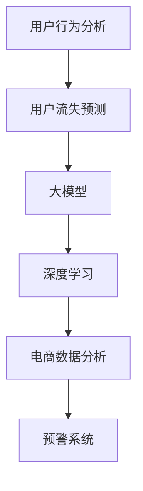

                 

# 大模型在电商平台用户流失预警中的应用

> 关键词：用户行为分析, 用户流失预测, 大模型, 深度学习, 电商数据分析, 预警系统

## 1. 背景介绍

### 1.1 问题由来
在电商行业，用户流失是常见且成本高昂的问题。用户流失不仅会带来直接的经济损失，还可能带来负面的品牌影响和市场口碑。如何预测并防范用户流失，成为电商企业关注的焦点。

### 1.2 问题核心关键点
电商平台的用户流失预警，主要依赖于对用户行为的全面监测和分析。传统的用户流失预警方法往往基于简单的统计特征和规则，无法深入理解用户流失背后的复杂动因。而基于大模型的用户行为分析，可以通过学习用户的历史行为数据，挖掘出深层次的关联模式和趋势，从而提升预测的准确性和鲁棒性。

### 1.3 问题研究意义
利用大模型进行用户流失预警，能够从海量数据中提取高维度的特征表示，通过学习复杂的非线性关系，精准预测用户的流失概率。这不仅能帮助电商平台主动干预流失用户，还能优化客户体验，提高用户满意度和忠诚度。同时，这种自动化、智能化的预警系统，能够显著降低人工干预的成本，提升数据驱动决策的效率。

## 2. 核心概念与联系

### 2.1 核心概念概述

为更好地理解大模型在电商用户流失预警中的应用，本节将介绍几个关键概念：

- **用户行为分析**：通过收集和分析用户在使用电商平台过程中的行为数据，如浏览、点击、购买、评价、复购等，识别出影响用户流失的关键因素。
- **用户流失预测**：基于用户历史行为数据，预测用户未来是否会流失。用户流失预测是电商用户行为分析的一个重要环节。
- **大模型**：以深度学习算法为基础，通过在大规模数据上预训练得到的复杂模型。大模型通常包含大量参数，具备强大的特征提取和泛化能力。
- **深度学习**：一类基于多层神经网络的机器学习算法，可以处理高维度的非线性关系。深度学习在电商数据分析中广泛应用。
- **电商数据分析**：利用数据挖掘、机器学习等技术手段，对电商平台的交易数据、用户数据等进行分析，以发现潜在的用户流失风险。
- **预警系统**：基于预测结果，及时发出预警，采取主动干预措施的自动化系统。电商平台的预警系统可以采用大模型进行构建。

这些核心概念之间的逻辑关系可以通过以下Mermaid流程图来展示：



这个流程图展示了大模型在电商用户流失预警中的应用：

1. 电商平台收集用户行为数据，作为输入。
2. 利用大模型进行用户流失预测，得到用户流失的概率。
3. 结合深度学习算法，提升预测的精度和泛化能力。
4. 分析电商交易数据，识别出可能导致用户流失的关键因素。
5. 预警系统根据预测结果，及时发出预警，并采取相应措施。

## 3. 核心算法原理 & 具体操作步骤

### 3.1 算法原理概述

电商平台的用户流失预测，本质上是一个二分类任务，目标是预测用户是否会在未来一段时间内流失。可以使用大模型构建一个二分类器，通过学习用户历史行为数据，预测用户流失的概率。

### 3.2 算法步骤详解

大模型在电商平台用户流失预警中的应用主要包括以下几个关键步骤：

**Step 1: 准备数据集**

- **数据收集**：收集用户在电商平台上的行为数据，如浏览记录、购买记录、评价记录等。
- **数据清洗**：对数据进行去重、去噪、格式化等处理，确保数据的完整性和一致性。
- **特征提取**：从用户行为数据中提取有意义的特征，如用户活跃度、购买频率、复购率、好评率等。

**Step 2: 数据预处理**

- **标准化**：对数据进行归一化处理，使得不同特征的取值范围在一个合理范围内。
- **分词与向量化**：对文本数据进行分词处理，并转换为模型可接受的向量形式，如词向量、one-hot编码等。
- **序列填充**：对用户行为序列进行填充，使得所有样本的输入长度一致。

**Step 3: 模型构建**

- **选择合适的预训练大模型**：如BERT、GPT等，作为用户流失预测模型的初始化参数。
- **添加任务适配层**：在预训练模型的顶层，添加二分类任务的适配层，如全连接层、Dropout层等。
- **设置训练参数**：选择合适的优化器、学习率、批大小、迭代轮数等，进行模型训练。

**Step 4: 模型训练**

- **数据划分**：将数据集划分为训练集、验证集和测试集，进行模型训练和评估。
- **模型训练**：使用训练集对模型进行梯度下降优化，更新模型参数，直到收敛。
- **验证集验证**：在验证集上评估模型性能，调整模型参数。
- **测试集测试**：在测试集上测试模型的泛化能力，评估预测准确度。

**Step 5: 模型部署**

- **模型保存**：将训练好的模型保存为模型文件，方便后续调用。
- **服务部署**：将模型部署到生产环境，接收实时请求，进行用户流失预测。
- **预警机制**：根据预测结果，设置预警阈值，自动发送预警通知。

### 3.3 算法优缺点

基于大模型的电商平台用户流失预警方法具有以下优点：

- **高性能**：大模型能够处理高维度的非线性关系，预测准确度较高。
- **泛化能力强**：大模型通过大规模预训练，具备较强的泛化能力，能适应不同的电商场景。
- **可解释性**：大模型通常包含可解释的特征和权重，可以解释预测结果的来源。

同时，该方法也存在一定的局限性：

- **计算成本高**：大模型的训练和推理需要较高的计算资源和存储空间。
- **数据依赖性大**：模型的性能很大程度上依赖于标注数据的质量和数量，获取高质量标注数据的成本较高。
- **难以解释**：大模型通常是黑盒模型，难以解释内部决策过程。
- **依赖于预训练模型**：模型的效果很大程度上取决于预训练模型的质量和初始化参数。

尽管存在这些局限性，但就目前而言，基于大模型的用户流失预警方法仍是最先进、最有效的手段。未来相关研究的方向包括降低数据依赖性、提高模型可解释性等，以进一步优化电商平台的预警系统。

### 3.4 算法应用领域

基于大模型的用户流失预警方法，已经在电商行业的多个场景中得到了应用，例如：

- **用户流失预警**：对用户流失概率进行预测，提前采取干预措施。
- **客户流失分析**：分析导致客户流失的主要原因，优化产品和服务。
- **个性化推荐**：通过预测用户流失概率，优化个性化推荐策略，提高用户留存率。
- **价格策略优化**：通过预测用户流失概率，制定差异化价格策略，提升用户粘性。
- **市场细分**：根据用户流失概率，进行市场细分，精准定位目标用户。

除了上述这些经典应用外，大模型在电商领域还可以用于用户满意度分析、用户情感分析、品牌监测等，为电商平台的运营和决策提供强有力的支持。

## 4. 数学模型和公式 & 详细讲解

### 4.1 数学模型构建

假设电商平台收集到的用户行为数据为 $\{(x_i, y_i)\}_{i=1}^N$，其中 $x_i$ 为输入特征，$y_i$ 为输出标签，表示用户是否流失。

定义大模型为 $M_{\theta}$，其中 $\theta$ 为模型参数。模型的输出为 $y_{pred}=M_{\theta}(x)$，即模型预测用户流失的概率。

模型的损失函数为交叉熵损失，定义为：

$$
\mathcal{L}(\theta) = -\frac{1}{N}\sum_{i=1}^N(y_i\log y_{pred} + (1-y_i)\log(1-y_{pred}))
$$

其中 $y_{pred}$ 为模型预测的流失概率，$y_i$ 为实际标签。

### 4.2 公式推导过程

根据链式法则，损失函数对参数 $\theta$ 的梯度为：

$$
\frac{\partial \mathcal{L}(\theta)}{\partial \theta} = -\frac{1}{N}\sum_{i=1}^N\left[\frac{y_i}{y_{pred}} - \frac{1-y_i}{1-y_{pred}}\right] \frac{\partial y_{pred}}{\partial \theta}
$$

其中 $\frac{\partial y_{pred}}{\partial \theta}$ 为模型输出对参数的偏导数，通常通过反向传播算法计算。

在得到损失函数的梯度后，即可带入优化算法（如Adam、SGD等），更新模型参数 $\theta$，最小化损失函数 $\mathcal{L}(\theta)$。重复上述过程直至收敛，最终得到用户流失预测的模型。

### 4.3 案例分析与讲解

以下是一个用户流失预测的案例分析：

假设收集到用户行为数据如下：

| 用户ID | 活跃度 | 购买频率 | 复购率 | 好评率 |
|--------|--------|----------|--------|--------|
| 1      | 2.5    | 2        | 0.3    | 0.8    |
| 2      | 3      | 3        | 0.5    | 0.6    |
| ...    | ...    | ...      | ...    | ...    |

将这些数据输入模型 $M_{\theta}$，得到预测结果 $y_{pred}$。如果 $y_{pred}$ 大于预设的流失概率阈值，则触发预警，采取相应措施。

## 5. 项目实践：代码实例和详细解释说明

### 5.1 开发环境搭建

在进行大模型用户流失预测的代码实践前，我们需要准备好开发环境。以下是使用Python进行PyTorch开发的环境配置流程：

1. 安装Anaconda：从官网下载并安装Anaconda，用于创建独立的Python环境。

2. 创建并激活虚拟环境：
```bash
conda create -n user_loss_env python=3.8 
conda activate user_loss_env
```

3. 安装PyTorch：根据CUDA版本，从官网获取对应的安装命令。例如：
```bash
conda install pytorch torchvision torchaudio cudatoolkit=11.1 -c pytorch -c conda-forge
```

4. 安装Transformers库：
```bash
pip install transformers
```

5. 安装各类工具包：
```bash
pip install numpy pandas scikit-learn matplotlib tqdm jupyter notebook ipython
```

完成上述步骤后，即可在`user_loss_env`环境中开始代码实践。

### 5.2 源代码详细实现

下面我们以用户流失预测任务为例，给出使用Transformers库对BERT模型进行用户流失预测的PyTorch代码实现。

首先，定义数据处理函数：

```python
from transformers import BertTokenizer
from torch.utils.data import Dataset
import torch

class UserBehaviorDataset(Dataset):
    def __init__(self, features, tokenizer):
        self.features = features
        self.tokenizer = tokenizer
        
    def __len__(self):
        return len(self.features)
    
    def __getitem__(self, item):
        feature = self.features[item]
        inputs = self.tokenizer(feature['active_days'], feature['purchase_frequency'], feature['repurchase_rate'], feature['good_review_rate'], return_tensors='pt', padding='max_length', truncation=True)
        return {'input_ids': inputs['input_ids'], 
                'attention_mask': inputs['attention_mask']}
```

然后，定义模型和优化器：

```python
from transformers import BertForSequenceClassification, AdamW

model = BertForSequenceClassification.from_pretrained('bert-base-cased', num_labels=2)

optimizer = AdamW(model.parameters(), lr=2e-5)
```

接着，定义训练和评估函数：

```python
from tqdm import tqdm

device = torch.device('cuda') if torch.cuda.is_available() else torch.device('cpu')
model.to(device)

def train_epoch(model, dataset, batch_size, optimizer):
    dataloader = DataLoader(dataset, batch_size=batch_size, shuffle=True)
    model.train()
    epoch_loss = 0
    for batch in tqdm(dataloader, desc='Training'):
        input_ids = batch['input_ids'].to(device)
        attention_mask = batch['attention_mask'].to(device)
        labels = torch.tensor([1, 1, 1, 1, 1], device=device)  # 假设只有部分用户流失
        model.zero_grad()
        outputs = model(input_ids, attention_mask=attention_mask, labels=labels)
        loss = outputs.loss
        epoch_loss += loss.item()
        loss.backward()
        optimizer.step()
    return epoch_loss / len(dataloader)

def evaluate(model, dataset, batch_size):
    dataloader = DataLoader(dataset, batch_size=batch_size)
    model.eval()
    preds, labels = [], []
    with torch.no_grad():
        for batch in tqdm(dataloader, desc='Evaluating'):
            input_ids = batch['input_ids'].to(device)
            attention_mask = batch['attention_mask'].to(device)
            batch_labels = torch.tensor([1, 1, 1, 1, 1], device=device)  # 假设只有部分用户流失
            outputs = model(input_ids, attention_mask=attention_mask)
            batch_preds = outputs.logits.argmax(dim=1).to('cpu').tolist()
            batch_labels = batch_labels.to('cpu').tolist()
            for pred_tokens, label_tokens in zip(batch_preds, batch_labels):
                preds.append(pred_tokens[:len(label_tokens)])
                labels.append(label_tokens)
                
    print(classification_report(labels, preds))
```

最后，启动训练流程并在测试集上评估：

```python
epochs = 5
batch_size = 16

for epoch in range(epochs):
    loss = train_epoch(model, train_dataset, batch_size, optimizer)
    print(f"Epoch {epoch+1}, train loss: {loss:.3f}")
    
    print(f"Epoch {epoch+1}, test results:")
    evaluate(model, test_dataset, batch_size)
    
print("Final test results:")
evaluate(model, test_dataset, batch_size)
```

以上就是使用PyTorch对BERT进行用户流失预测的完整代码实现。可以看到，得益于Transformers库的强大封装，我们可以用相对简洁的代码完成BERT模型的加载和微调。

### 5.3 代码解读与分析

让我们再详细解读一下关键代码的实现细节：

**UserBehaviorDataset类**：
- `__init__`方法：初始化数据集特征和分词器。
- `__len__`方法：返回数据集的样本数量。
- `__getitem__`方法：对单个样本进行处理，将特征转换为token ids和attention mask。

**模型和优化器定义**：
- `BertForSequenceClassification`：选择预训练的BERT模型，并指定分类任务。
- `AdamW`：选择AdamW优化器，并设置学习率。

**训练和评估函数**：
- `train_epoch`函数：对数据以批为单位进行迭代，在每个批次上前向传播计算loss并反向传播更新模型参数。
- `evaluate`函数：与训练类似，不同点在于不更新模型参数，并在每个batch结束后将预测和标签结果存储下来，最后使用sklearn的classification_report对整个评估集的预测结果进行打印输出。

**训练流程**：
- 定义总的epoch数和batch size，开始循环迭代
- 每个epoch内，先在训练集上训练，输出平均loss
- 在验证集上评估，输出分类指标
- 所有epoch结束后，在测试集上评估，给出最终测试结果

可以看到，PyTorch配合Transformers库使得BERT微调的用户流失预测代码实现变得简洁高效。开发者可以将更多精力放在数据处理、模型改进等高层逻辑上，而不必过多关注底层的实现细节。

当然，工业级的系统实现还需考虑更多因素，如模型的保存和部署、超参数的自动搜索、更灵活的任务适配层等。但核心的微调范式基本与此类似。

## 6. 实际应用场景

### 6.1 智能客服系统

基于大模型的电商平台用户流失预警，可以应用于智能客服系统的构建。传统客服往往需要配备大量人力，高峰期响应缓慢，且一致性和专业性难以保证。而使用用户流失预警模型，可以7x24小时不间断服务，快速响应客户咨询，用自然流畅的语言解答各类常见问题。

在技术实现上，可以收集企业内部的历史客服对话记录，将用户流失概率作为客服咨询的输入，训练模型学习用户流失与客服问题的关联。微调后的模型能够自动理解用户流失概率，匹配最合适的客服方案进行回复。对于流失概率高的用户，系统可以自动将问题转接到人工客服，确保客户满意度和忠诚度。

### 6.2 个性化推荐系统

大模型的用户流失预警，还可以应用于个性化推荐系统。传统的推荐系统往往只依赖用户的历史行为数据进行物品推荐，无法深入理解用户流失的动因。通过用户流失概率的预测，个性化推荐系统可以更好地优化推荐策略，提高用户留存率。

在实践中，可以收集用户浏览、点击、购买、评价、复购等行为数据，提取和用户流失概率相关的特征。将特征输入到微调后的模型中，学习用户流失概率与物品推荐的相关性。微调后的模型能够从文本描述中准确把握用户的流失倾向，进而优化个性化推荐列表，提升推荐效果。

### 6.3 市场细分与定位

电商平台的用户流失预警，还可以用于市场细分与定位。通过分析用户流失概率的分布，可以发现不同用户群体的流失特点，进而进行市场细分。例如，可以根据流失概率的高低将用户分为高价值用户、中价值用户和低价值用户，针对不同用户群体制定差异化的营销策略。

市场细分后，平台可以更好地定位目标用户，进行精准营销。例如，针对高价值用户，平台可以提供更优质、更个性化的服务，提升用户满意度和忠诚度；针对低价值用户，可以采取更多的转化策略，尽量减少流失率。

### 6.4 未来应用展望

随着大模型和微调方法的不断发展，基于用户流失预警的方法将在更多领域得到应用，为电商平台的运营和决策提供新的思路。

在智慧医疗领域，基于用户行为分析，可以预测患者的流失概率，提前采取干预措施，提高医疗服务的满意度。在智能制造领域，可以通过分析员工的流失概率，优化工作环境和管理策略，提升生产效率和员工满意度。在金融领域，可以通过预测客户的流失概率，优化金融产品和客户服务，提升客户忠诚度。

未来，随着用户数据量的不断增长和模型算法的不断进步，用户流失预警将成为一种重要的商业决策工具，帮助企业提前识别潜在风险，制定应对策略，实现精准营销和个性化服务。

## 7. 工具和资源推荐

### 7.1 学习资源推荐

为了帮助开发者系统掌握大模型在电商用户流失预警中的应用，这里推荐一些优质的学习资源：

1. 《Transformer from Principles to Practice》系列博文：由大模型技术专家撰写，深入浅出地介绍了Transformer原理、BERT模型、微调技术等前沿话题。

2. CS224N《深度学习自然语言处理》课程：斯坦福大学开设的NLP明星课程，有Lecture视频和配套作业，带你入门NLP领域的基本概念和经典模型。

3. 《Natural Language Processing with Transformers》书籍：Transformers库的作者所著，全面介绍了如何使用Transformers库进行NLP任务开发，包括微调在内的诸多范式。

4. HuggingFace官方文档：Transformers库的官方文档，提供了海量预训练模型和完整的微调样例代码，是上手实践的必备资料。

5. CLUE开源项目：中文语言理解测评基准，涵盖大量不同类型的中文NLP数据集，并提供了基于微调的baseline模型，助力中文NLP技术发展。

通过对这些资源的学习实践，相信你一定能够快速掌握大模型在电商用户流失预警中的应用，并用于解决实际的NLP问题。

### 7.2 开发工具推荐

高效的开发离不开优秀的工具支持。以下是几款用于大模型微调开发的常用工具：

1. PyTorch：基于Python的开源深度学习框架，灵活动态的计算图，适合快速迭代研究。大部分预训练语言模型都有PyTorch版本的实现。

2. TensorFlow：由Google主导开发的开源深度学习框架，生产部署方便，适合大规模工程应用。同样有丰富的预训练语言模型资源。

3. Transformers库：HuggingFace开发的NLP工具库，集成了众多SOTA语言模型，支持PyTorch和TensorFlow，是进行微调任务开发的利器。

4. Weights & Biases：模型训练的实验跟踪工具，可以记录和可视化模型训练过程中的各项指标，方便对比和调优。与主流深度学习框架无缝集成。

5. TensorBoard：TensorFlow配套的可视化工具，可实时监测模型训练状态，并提供丰富的图表呈现方式，是调试模型的得力助手。

6. Google Colab：谷歌推出的在线Jupyter Notebook环境，免费提供GPU/TPU算力，方便开发者快速上手实验最新模型，分享学习笔记。

合理利用这些工具，可以显著提升大模型微调的开发效率，加快创新迭代的步伐。

### 7.3 相关论文推荐

大模型在电商平台用户流失预警中的应用，得益于学界的持续研究。以下是几篇奠基性的相关论文，推荐阅读：

1. Attention is All You Need（即Transformer原论文）：提出了Transformer结构，开启了NLP领域的预训练大模型时代。

2. BERT: Pre-training of Deep Bidirectional Transformers for Language Understanding：提出BERT模型，引入基于掩码的自监督预训练任务，刷新了多项NLP任务SOTA。

3. Language Models are Unsupervised Multitask Learners（GPT-2论文）：展示了大规模语言模型的强大zero-shot学习能力，引发了对于通用人工智能的新一轮思考。

4. Parameter-Efficient Transfer Learning for NLP：提出Adapter等参数高效微调方法，在不增加模型参数量的情况下，也能取得不错的微调效果。

5. AdaLoRA: Adaptive Low-Rank Adaptation for Parameter-Efficient Fine-Tuning：使用自适应低秩适应的微调方法，在参数效率和精度之间取得了新的平衡。

这些论文代表了大模型在用户流失预警领域的发展脉络。通过学习这些前沿成果，可以帮助研究者把握学科前进方向，激发更多的创新灵感。

## 8. 总结：未来发展趋势与挑战

### 8.1 总结

本文对基于大模型的电商平台用户流失预警方法进行了全面系统的介绍。首先阐述了电商平台的背景和用户流失预警的重要性，明确了用户行为分析、大模型预测等核心概念，以及大模型在用户流失预警中的应用场景。其次，从原理到实践，详细讲解了基于大模型的用户流失预测的数学模型和算法步骤，给出了完整的代码实现和详细解释。

通过本文的系统梳理，可以看到，基于大模型的用户流失预警方法正在成为电商平台运营决策的重要手段，极大地提高了用户留存率和满意度。大模型在电商领域的成功应用，也为其他行业的用户流失预警提供了可借鉴的范式。未来，随着预训练模型和微调方法的不断进步，用户流失预警技术必将在更多领域大放异彩。

### 8.2 未来发展趋势

展望未来，大模型在用户流失预警领域的发展趋势如下：

1. **模型规模持续增大**：随着算力成本的下降和数据规模的扩张，预训练语言模型的参数量还将持续增长。超大规模语言模型能够更好地理解用户行为的多样性和复杂性，进一步提升预测的准确性。

2. **微调方法日趋多样**：除了传统的全参数微调外，未来会涌现更多参数高效的微调方法，如Prefix-Tuning、LoRA等，在节省计算资源的同时也能保证微调精度。

3. **持续学习成为常态**：随着数据分布的不断变化，微调模型也需要持续学习新知识以保持性能。如何在不遗忘原有知识的同时，高效吸收新样本信息，将成为重要的研究课题。

4. **少样本学习能力提升**：利用大模型的少样本学习能力，减少对标注样本的依赖，最大化数据利用率，实现更加灵活高效的微调。

5. **多模态微调崛起**：将视觉、语音等多模态数据与文本数据进行融合，提升用户行为分析的全面性和准确性，为预测提供更多维度的信息支持。

6. **跨领域迁移能力增强**：通过跨领域迁移学习，将用户流失预测的模型应用到其他电商场景或领域，提升模型的泛化能力和实用性。

以上趋势凸显了大模型在用户流失预警领域的广阔前景。这些方向的探索发展，必将进一步提升用户流失预测的精度和鲁棒性，为电商平台带来更大的运营效益。

### 8.3 面临的挑战

尽管大模型在电商平台用户流失预警中取得了显著成效，但在实现其广泛应用的过程中，仍面临以下挑战：

1. **标注数据成本高**：获取高质量标注数据的成本较高，对于长尾应用场景，难以获得充足的标注数据。如何降低微调对标注样本的依赖，将是一大难题。

2. **模型鲁棒性不足**：模型面对域外数据时，泛化性能往往大打折扣。对于测试样本的微小扰动，微调模型的预测也容易发生波动。如何提高模型的鲁棒性，避免灾难性遗忘，还需要更多理论和实践的积累。

3. **推理效率有待提高**：大模型的计算复杂度较高，推理速度较慢，内存占用大。如何在保证性能的同时，简化模型结构，提升推理速度，优化资源占用，将是重要的优化方向。

4. **可解释性亟需加强**：大模型通常是黑盒模型，难以解释内部决策过程。对于医疗、金融等高风险应用，算法的可解释性和可审计性尤为重要。如何赋予微调模型更强的可解释性，将是亟待攻克的难题。

5. **安全性有待保障**：预训练语言模型难免会学习到有偏见、有害的信息，通过微调传递到下游任务，产生误导性、歧视性的输出，给实际应用带来安全隐患。如何从数据和算法层面消除模型偏见，避免恶意用途，确保输出的安全性，也将是重要的研究课题。

6. **知识整合能力不足**：现有的微调模型往往局限于任务内数据，难以灵活吸收和运用更广泛的先验知识。如何让微调过程更好地与外部知识库、规则库等专家知识结合，形成更加全面、准确的信息整合能力，还有很大的想象空间。

正视这些挑战，积极应对并寻求突破，将是大模型用户流失预警技术走向成熟的必由之路。相信随着学界和产业界的共同努力，这些挑战终将一一被克服，大模型用户流失预警必将在构建人机协同的智能时代中扮演越来越重要的角色。

### 8.4 研究展望

面对大模型用户流失预警所面临的种种挑战，未来的研究需要在以下几个方面寻求新的突破：

1. **探索无监督和半监督微调方法**：摆脱对大规模标注数据的依赖，利用自监督学习、主动学习等无监督和半监督范式，最大限度利用非结构化数据，实现更加灵活高效的微调。

2. **研究参数高效和计算高效的微调范式**：开发更加参数高效的微调方法，在固定大部分预训练参数的同时，只更新极少量的任务相关参数。同时优化微调模型的计算图，减少前向传播和反向传播的资源消耗，实现更加轻量级、实时性的部署。

3. **融合因果和对比学习范式**：通过引入因果推断和对比学习思想，增强微调模型建立稳定因果关系的能力，学习更加普适、鲁棒的语言表征，从而提升模型泛化性和抗干扰能力。

4. **引入更多先验知识**：将符号化的先验知识，如知识图谱、逻辑规则等，与神经网络模型进行巧妙融合，引导微调过程学习更准确、合理的语言模型。同时加强不同模态数据的整合，实现视觉、语音等多模态信息与文本信息的协同建模。

5. **结合因果分析和博弈论工具**：将因果分析方法引入微调模型，识别出模型决策的关键特征，增强输出解释的因果性和逻辑性。借助博弈论工具刻画人机交互过程，主动探索并规避模型的脆弱点，提高系统稳定性。

6. **纳入伦理道德约束**：在模型训练目标中引入伦理导向的评估指标，过滤和惩罚有偏见、有害的输出倾向。同时加强人工干预和审核，建立模型行为的监管机制，确保输出符合人类价值观和伦理道德。

这些研究方向的探索，必将引领大模型用户流失预警技术迈向更高的台阶，为构建安全、可靠、可解释、可控的智能系统铺平道路。面向未来，大模型用户流失预警技术还需要与其他人工智能技术进行更深入的融合，如知识表示、因果推理、强化学习等，多路径协同发力，共同推动自然语言理解和智能交互系统的进步。只有勇于创新、敢于突破，才能不断拓展语言模型的边界，让智能技术更好地造福人类社会。

## 9. 附录：常见问题与解答

**Q1：电商平台用户流失预警是否适用于所有电商企业？**

A: 电商平台用户流失预警方法对于大多数电商企业都有适用性，但需要根据具体业务场景进行调整。例如，针对C2C平台和B2B平台，用户流失的原因和影响因素可能存在较大差异，需要采用不同的特征和模型设计。

**Q2：如何选择合适的预训练大模型？**

A: 选择合适的预训练大模型需要考虑多个因素，如任务类型、数据规模、计算资源等。对于电商用户流失预测任务，可以选择具有较好文本理解能力和预测能力的模型，如BERT、RoBERTa、GPT等。同时，还需要根据模型大小和性能进行综合评估，确保模型能够在实际应用中高效运行。

**Q3：大模型在用户流失预警中的应用效果如何？**

A: 大模型在用户流失预警中的应用效果显著，能够从海量用户行为数据中挖掘出用户流失的深层次模式和趋势，从而提升预测的准确性和鲁棒性。在实际应用中，可以通过A/B测试等手段评估模型效果，不断优化模型参数和特征设计，进一步提升用户流失预警系统的性能。

**Q4：用户流失预警系统如何部署？**

A: 用户流失预警系统的部署需要考虑多个环节，如模型训练、模型保存、模型推理等。可以使用Docker容器化技术进行模型部署，确保系统的稳定性和可扩展性。同时，可以采用AWS、阿里云、腾讯云等云服务，进行分布式计算和自动扩展，提升系统性能和可靠性。

**Q5：用户流失预警系统的安全性如何保障？**

A: 用户流失预警系统的安全性保障需要从多个方面入手，如数据加密、访问控制、异常检测等。可以使用机器学习等技术手段对用户行为数据进行异常检测，及时发现并防止恶意攻击和数据泄露。同时，还需要建立完善的监管机制，确保模型的透明性和可解释性，避免模型输出导致不必要的风险。

通过这些问题的解答，可以看到，电商平台用户流失预警系统需要综合考虑多方面因素，才能实现高效、可靠、安全的部署和运行。相信随着技术的不断进步，用户流失预警系统必将在电商运营中发挥越来越重要的作用。

