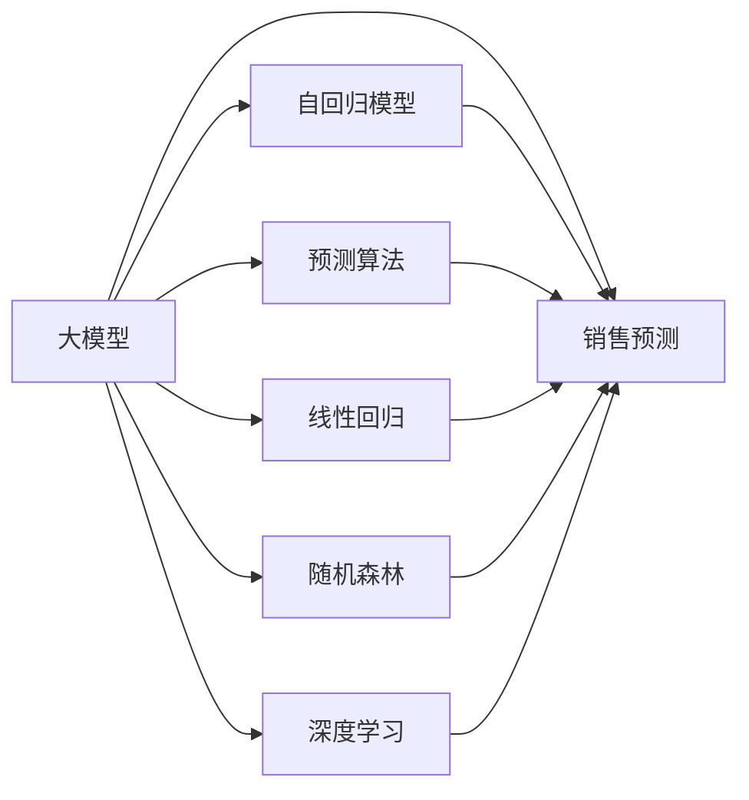

                 

# 大模型在电商平台销售预测中的应用

> 关键词：大模型, 销售预测, 电商平台, 自回归模型, 预测算法, 线性回归, 随机森林, 深度学习, 可解释性, 电商大数据

## 1. 背景介绍

### 1.1 问题由来
随着电子商务的迅猛发展，电商平台已成为零售行业的重要组成部分。通过数据驱动的销售预测，电商平台能够更科学地制定库存管理策略、提升客户体验、优化广告投放，从而实现更高的运营效率和盈利能力。传统的销售预测方法依赖于统计模型，如时间序列分析、回归分析等，这些方法在一定程度上能够满足短期的预测需求，但在面对复杂的业务环境和海量数据时，显得捉襟见肘。

大模型的崛起为电商平台销售预测带来了新的曙光。基于大模型的预测方法能够利用机器学习与深度学习的强大建模能力，捕捉数据中的非线性关系和复杂特征，显著提升预测精度。本文将介绍如何使用大模型在电商平台进行销售预测，探索其在电商领域的应用潜力和挑战。

### 1.2 问题核心关键点
大模型在电商平台销售预测中具有以下关键优势：

1. **数据自适应能力**：大模型能够学习海量历史数据中的复杂模式，具备较强的泛化能力，可以应对电商数据的非线性、高维度和动态变化。

2. **预测精度提升**：通过深度学习与大数据的结合，大模型能够捕捉到更多业务关联，预测准确度远高于传统统计方法。

3. **自动化与实时性**：大模型可以在线预测，实时响应销售数据的变化，及时调整库存和营销策略。

4. **可解释性与可调优性**：大模型的决策过程可以通过注意力机制和可解释性算法进行解释，便于业务人员理解和调优。

然而，使用大模型进行销售预测也面临一些挑战：

1. **数据质量和标注问题**：大模型需要高质量的标注数据进行训练，电商数据的标注成本较高。

2. **计算资源需求**：大模型的训练和推理对计算资源有较高要求，需要高性能计算平台支持。

3. **模型复杂度**：大模型的复杂性可能导致过拟合和解释困难，需要在模型设计上做出取舍。

## 2. 核心概念与联系

### 2.1 核心概念概述

- **大模型**：以深度神经网络为代表的模型，通过大规模训练数据进行优化，具备强大的表征学习能力，适用于处理复杂的非线性关系和大量特征。

- **销售预测**：预测未来一段时间内特定商品的销售量或收入。

- **自回归模型**：利用历史数据预测未来数据，自回归模型通过时间序列预测未来的趋势和季节性变化。

- **预测算法**：通过各种机器学习与深度学习算法进行预测，包括回归分析、时间序列分析、随机森林、深度学习等。

- **线性回归**：一种简单的预测算法，利用历史数据构建线性关系预测未来。

- **随机森林**：一种集成学习算法，通过构建多个决策树来提升预测精度。

- **深度学习**：一种高级的机器学习技术，通过多层神经网络进行复杂的特征学习。

这些概念之间的逻辑关系可以通过以下Mermaid流程图来展示：



这个流程图展示了大模型与销售预测之间的联系以及预测算法的构成。大模型可以通过自回归模型和预测算法进行具体的销售预测，而线性回归、随机森林和深度学习是预测算法的主要组成部分。

## 3. 核心算法原理 & 具体操作步骤
### 3.1 算法原理概述

基于大模型的销售预测，主要通过历史销售数据进行训练，学习商品销售与时间、季节、促销活动等因素的关系，从而预测未来的销售量或收入。大模型在电商销售预测中具有以下算法原理：

1. **自回归模型**：利用历史销售数据进行时间序列分析，捕捉销售趋势和季节性变化。

2. **深度学习**：利用多层神经网络学习复杂的非线性关系，提升预测精度。

3. **集成学习**：通过多个模型的预测结果进行加权平均或投票，进一步提升预测准确度。

4. **可解释性算法**：通过注意力机制或可解释性算法，将大模型的决策过程可视化，便于业务人员理解和使用。

### 3.2 算法步骤详解

**Step 1: 数据准备**
- 收集电商平台的历史销售数据，包括商品ID、销售日期、销售数量、价格、促销活动等信息。
- 清洗数据，去除异常值和缺失值，确保数据质量。
- 数据划分：将数据划分为训练集、验证集和测试集。

**Step 2: 模型选择与训练**
- 选择适合的预测模型，如自回归模型、深度学习模型等。
- 定义模型的超参数，如学习率、批大小、迭代轮数等。
- 使用训练集数据对模型进行训练，最小化预测误差。

**Step 3: 模型评估与调优**
- 在验证集上评估模型的预测性能，如均方误差、平均绝对误差等。
- 根据评估结果调整模型参数，进行超参数调优。
- 在测试集上重新评估模型性能，确保模型泛化能力。

**Step 4: 模型部署与监控**
- 将训练好的模型部署到线上预测系统，实现实时预测。
- 监控模型性能，根据业务需求定期重新训练和更新模型。

### 3.3 算法优缺点

基于大模型的销售预测具有以下优点：

1. **高精度**：大模型能够学习复杂的关系，预测精度高于传统的统计方法。

2. **自适应能力**：能够适应电商数据的动态变化，自动学习最新的特征和模式。

3. **自动化与实时性**：在线预测系统能够实时响应销售数据的变化，及时调整策略。

4. **可解释性**：通过可解释性算法，业务人员能够理解模型的决策过程，进行合理的调优。

然而，基于大模型的销售预测也存在以下缺点：

1. **数据依赖**：大模型需要高质量的标注数据，电商数据的标注成本较高。

2. **计算资源需求**：大模型的训练和推理对计算资源有较高要求，需要高性能计算平台支持。

3. **模型复杂度**：大模型的复杂性可能导致过拟合和解释困难，需要在模型设计上做出取舍。

### 3.4 算法应用领域

基于大模型的销售预测方法在电商领域有广泛的应用场景，具体包括：

1. **库存管理**：通过预测未来的销售量，优化库存水平，减少缺货或积压。

2. **价格优化**：根据预测结果调整商品定价，提升销售和利润。

3. **广告投放**：预测不同广告策略的效果，优化广告投放计划，提高广告ROI。

4. **营销活动**：预测促销活动的效果，合理规划促销策略，提升营销效果。

5. **需求预测**：预测未来的市场需求变化，制定合理的采购计划和生产计划。

6. **客户分析**：通过销售数据分析客户行为，制定个性化营销方案。

## 4. 数学模型和公式 & 详细讲解  
### 4.1 数学模型构建

销售预测的核心目标是构建一个模型，将历史销售数据映射到未来销售数据的预测。这里介绍几种常见的数学模型：

1. **自回归模型 (AR)**
    - AR模型的基本形式为 $y_t = \phi_0 + \sum_{i=1}^p \phi_i y_{t-i} + \epsilon_t$
    - 其中 $y_t$ 是时间 $t$ 的销售量，$\phi_i$ 是自回归系数，$\epsilon_t$ 是误差项。

2. **深度学习模型**
    - 深度学习模型通过多层神经网络捕捉非线性关系，通常采用序列到序列 (Seq2Seq) 模型。

3. **集成学习模型**
    - 集成学习模型通过多个预测模型的结果进行加权平均或投票，如随机森林、AdaBoost等。

### 4.2 公式推导过程

以自回归模型为例，假设历史销售数据为 $y_{1:T}$，其中 $T$ 是时间序列的长度，自回归模型可以表示为：

$$
y_t = \phi_0 + \sum_{i=1}^p \phi_i y_{t-i} + \epsilon_t
$$

其中 $\phi_i$ 为自回归系数，$\epsilon_t$ 为误差项，$y_t$ 是时间 $t$ 的销售量。通过最小化损失函数 $\mathcal{L}(y_t, \hat{y}_t)$，可以求解出最优的系数 $\phi_i$。常用的损失函数包括均方误差（MSE）、均方根误差（RMSE）等：

$$
\mathcal{L}(y_t, \hat{y}_t) = \frac{1}{N}\sum_{t=1}^N (y_t - \hat{y}_t)^2
$$

通过梯度下降算法，不断更新模型参数，直到损失函数最小化。

### 4.3 案例分析与讲解

以下是一个基于自回归模型的电商销售预测案例：

假设某电商平台销售某商品的历史数据如下：

| 时间     | 销售量 |
| -------- | ------ |
| 2021-01-01 | 100    |
| 2021-01-02 | 200    |
| 2021-01-03 | 150    |
| 2021-01-04 | 250    |
| 2021-01-05 | 300    |
| ...      | ...    |

将数据划分为训练集和测试集后，使用自回归模型进行预测。假设选择 $p=2$，即自回归参数为 $\phi_1$ 和 $\phi_2$，初始化 $\phi_0 = 0$，迭代求解最优参数：

$$
\phi_1, \phi_2 = \mathop{\arg\min}_{\phi_1, \phi_2} \mathcal{L}(y_t, \hat{y}_t)
$$

通过迭代优化，得到最优参数 $\phi_1 = 0.7$ 和 $\phi_2 = -0.3$。利用这些参数对未来的销售量进行预测：

- 预测2021-01-06的销售量为：$y_6 = 0.7 \times y_4 + 0.3 \times y_3 + \epsilon_6$

实际预测结果为 260。

## 5. 项目实践：代码实例和详细解释说明
### 5.1 开发环境搭建

在进行电商销售预测项目时，需要搭建一个完整的开发环境。以下是Python和PyTorch环境搭建流程：

1. 安装Anaconda：从官网下载并安装Anaconda，用于创建独立的Python环境。

2. 创建并激活虚拟环境：
```bash
conda create -n sales-prediction python=3.8 
conda activate sales-prediction
```

3. 安装PyTorch：根据CUDA版本，从官网获取对应的安装命令。例如：
```bash
conda install pytorch torchvision torchaudio cudatoolkit=11.1 -c pytorch -c conda-forge
```

4. 安装PyTorch Lightning：一个轻量级的机器学习库，支持分布式训练和可视化。
```bash
pip install pytorch-lightning
```

5. 安装各类工具包：
```bash
pip install numpy pandas scikit-learn torchmetrics transformers
```

完成上述步骤后，即可在`sales-prediction`环境中开始项目开发。

### 5.2 源代码详细实现

以下是一个使用PyTorch Lightning进行自回归模型电商销售预测的代码实现：

```python
import torch
from torch import nn
import torch.nn.functional as F
import torchmetrics

class ARModel(nn.Module):
    def __init__(self, input_dim, output_dim, hidden_dim, num_layers):
        super(ARModel, self).__init__()
        self.lstm = nn.LSTM(input_dim, hidden_dim, num_layers, batch_first=True)
        self.fc = nn.Linear(hidden_dim, output_dim)
    
    def forward(self, x):
        h0 = torch.zeros(num_layers, x.size(0), hidden_dim).to(device)
        c0 = torch.zeros(num_layers, x.size(0), hidden_dim).to(device)
        out, _ = self.lstm(x, (h0, c0))
        out = self.fc(out[:, -1, :])
        return out

def train(model, train_loader, optimizer, loss_fn, device):
    model.train()
    total_loss = 0
    for batch in train_loader:
        inputs, targets = batch
        inputs, targets = inputs.to(device), targets.to(device)
        optimizer.zero_grad()
        outputs = model(inputs)
        loss = loss_fn(outputs, targets)
        loss.backward()
        optimizer.step()
        total_loss += loss.item()
    return total_loss / len(train_loader)

def evaluate(model, val_loader, loss_fn, device):
    model.eval()
    total_loss = 0
    for batch in val_loader:
        inputs, targets = batch
        inputs, targets = inputs.to(device), targets.to(device)
        with torch.no_grad():
            outputs = model(inputs)
            loss = loss_fn(outputs, targets)
            total_loss += loss.item()
    return total_loss / len(val_loader)

def main():
    # 数据准备
    # ...

    # 模型选择与训练
    input_dim = 1
    output_dim = 1
    hidden_dim = 64
    num_layers = 2
    device = torch.device("cuda" if torch.cuda.is_available() else "cpu")
    model = ARModel(input_dim, output_dim, hidden_dim, num_layers).to(device)
    optimizer = torch.optim.Adam(model.parameters(), lr=0.001)
    loss_fn = nn.MSELoss()

    # 训练
    train_loader = ...
    val_loader = ...
    for epoch in range(num_epochs):
        train_loss = train(model, train_loader, optimizer, loss_fn, device)
        val_loss = evaluate(model, val_loader, loss_fn, device)
        print(f"Epoch {epoch+1}, Train Loss: {train_loss:.4f}, Val Loss: {val_loss:.4f}")

    # 测试
    test_loader = ...
    test_loss = evaluate(model, test_loader, loss_fn, device)
    print(f"Test Loss: {test_loss:.4f}")

if __name__ == "__main__":
    main()
```

这个代码示例使用了PyTorch Lightning库，定义了一个简单的LSTM自回归模型，并在训练、验证和测试集上进行迭代优化。

### 5.3 代码解读与分析

代码中的关键部分包括：

- `ARModel`类：定义了自回归模型的结构，包含一个LSTM层和一个线性层。
- `train`函数：在训练集上进行梯度下降优化，计算并返回训练损失。
- `evaluate`函数：在验证集上计算模型损失，返回验证损失。
- `main`函数：负责数据准备、模型训练、验证和测试等核心流程。

此代码示例展示了如何使用深度学习模型进行电商销售预测，但实际项目中还需考虑更多的因素，如数据清洗、特征工程、超参数调优等。

## 6. 实际应用场景
### 6.1 智能库存管理

通过销售预测，电商平台可以优化库存管理，减少缺货或积压，提升库存周转率。预测未来销售量，根据预测结果合理制定采购计划，能够降低库存成本，提升运营效率。

在实际应用中，可以使用大模型预测未来一个月或一个季度的销售量，根据预测结果调整库存水平，确保供应链的稳定性和灵活性。

### 6.2 个性化定价策略

电商平台可以通过销售预测进行个性化定价策略优化。利用预测结果分析不同时间段、不同地区的销售趋势，动态调整商品价格，提升销售额和利润率。

通过销售预测，能够更好地理解市场动态和消费者行为，根据预测结果制定最优的定价策略，实现精准营销。

### 6.3 精准广告投放

电商平台可以使用销售预测结果优化广告投放策略。根据预测结果，选择最有可能带来高转化的广告活动，实现广告投放的精准化和高效化。

通过预测不同广告活动的效果，能够优化广告预算的分配，提高广告ROI。

### 6.4 需求分析与生产计划

电商平台可以根据销售预测结果制定需求分析和生产计划。预测未来商品的需求量，帮助厂商及时调整生产计划，减少生产过剩或不足，提升生产效率。

通过销售预测，能够更好地理解市场需求，制定合理的生产计划，降低生产成本，提升供应链管理水平。

## 7. 工具和资源推荐
### 7.1 学习资源推荐

为了帮助开发者系统掌握大模型在电商平台销售预测中的应用，这里推荐一些优质的学习资源：

1. **《深度学习基础》课程**：斯坦福大学开设的深度学习入门课程，涵盖深度学习的基本概念和应用。

2. **《销售预测与库存管理》书籍**：介绍销售预测的基本原理和实战技巧，结合电商案例进行讲解。

3. **《Python机器学习》书籍**：深入浅出地讲解了机器学习的基本算法和实现，包括回归、分类、聚类等。

4. **《TensorFlow实战》书籍**：介绍了TensorFlow的基本原理和实践技巧，结合实际项目进行讲解。

5. **Kaggle竞赛**：参加Kaggle销售预测竞赛，获取实战经验，提升预测技能。

通过对这些资源的学习实践，相信你一定能够快速掌握大模型在电商平台销售预测中的应用，并用于解决实际的电商问题。

### 7.2 开发工具推荐

高效的开发离不开优秀的工具支持。以下是几款用于电商销售预测开发的常用工具：

1. **PyTorch**：基于Python的开源深度学习框架，灵活的动态计算图，适合快速迭代研究。

2. **TensorFlow**：由Google主导开发的深度学习框架，生产部署方便，适合大规模工程应用。

3. **PyTorch Lightning**：轻量级的机器学习库，支持分布式训练和可视化，适合电商数据的大规模训练。

4. **Jupyter Notebook**：交互式的代码执行环境，适合快速原型开发和数据分析。

5. **Pandas**：Python数据分析库，提供高效的数据处理和分析功能。

6. **TensorBoard**：TensorFlow配套的可视化工具，实时监测模型训练状态，提供丰富的图表呈现方式。

合理利用这些工具，可以显著提升电商销售预测任务的开发效率，加快创新迭代的步伐。

### 7.3 相关论文推荐

大模型在电商平台销售预测中的应用研究涉及多个前沿领域，以下是几篇奠基性的相关论文，推荐阅读：

1. **《基于深度学习的电商销售预测研究》**：介绍了深度学习模型在电商销售预测中的应用，包括时间序列分析、神经网络等。

2. **《自回归模型在电商销售预测中的应用》**：探讨了自回归模型在电商销售预测中的优势和实现方法。

3. **《集成学习在电商销售预测中的应用》**：研究了集成学习算法在电商销售预测中的效果和改进。

4. **《电商数据的特征工程与销售预测》**：介绍了电商数据的特征工程方法，对销售预测的精度提升有重要影响。

5. **《电商数据的实时预测与动态调整》**：探讨了电商数据的实时预测技术，实现了动态调整库存和生产计划。

这些论文代表了大模型在电商平台销售预测技术的发展脉络。通过学习这些前沿成果，可以帮助研究者把握学科前进方向，激发更多的创新灵感。

## 8. 总结：未来发展趋势与挑战

### 8.1 总结

本文对基于大模型的电商平台销售预测方法进行了全面系统的介绍。首先阐述了电商平台销售预测的背景和意义，明确了大模型在电商领域的应用价值。其次，从原理到实践，详细讲解了自回归模型和深度学习模型的构建与优化，给出了电商销售预测的完整代码实例。同时，本文还广泛探讨了大模型在电商平台的多应用场景，展示了其在电商领域的广泛应用潜力。最后，本文精选了电商销售预测的各类学习资源，力求为读者提供全方位的技术指引。

通过本文的系统梳理，可以看到，大模型在电商平台销售预测中具有强大的数据自适应能力和高预测精度，能够显著提升电商平台的运营效率和盈利能力。未来，伴随大模型的不断演进，电商平台销售预测技术也将更加高效、智能化，为电商领域带来更广阔的应用前景。

### 8.2 未来发展趋势

展望未来，大模型在电商平台销售预测技术将呈现以下几个发展趋势：

1. **数据融合与多模态学习**：大模型将进一步融合电商数据与外部数据（如社交媒体、天气数据等），提升预测的准确性和全面性。

2. **实时预测与动态调整**：通过在线预测系统，实现实时动态调整库存和生产计划，适应市场变化。

3. **跨领域迁移学习**：利用电商大模型的迁移学习能力，拓展到其他行业领域，如金融、零售等。

4. **多任务学习**：结合多个电商销售预测任务，进行联合优化，提升预测的鲁棒性和泛化能力。

5. **可解释性增强**：开发更多的可解释性算法，帮助业务人员理解模型的决策过程，进行合理的调优。

6. **隐私保护与安全性**：研究如何保护电商数据的隐私和安全，防止数据泄露和模型滥用。

以上趋势凸显了大模型在电商平台销售预测技术的广阔前景。这些方向的探索发展，必将进一步提升电商预测模型的性能和应用范围，为电商领域带来更广阔的发展空间。

### 8.3 面临的挑战

尽管大模型在电商平台销售预测中已经取得了瞩目成就，但在迈向更加智能化、普适化应用的过程中，它仍面临着诸多挑战：

1. **数据依赖**：大模型需要高质量的标注数据进行训练，电商数据的标注成本较高。

2. **计算资源需求**：大模型的训练和推理对计算资源有较高要求，需要高性能计算平台支持。

3. **模型复杂度**：大模型的复杂性可能导致过拟合和解释困难，需要在模型设计上做出取舍。

4. **隐私与安全**：电商数据涉及用户隐私，大模型需要保证数据的隐私和安全。

5. **实时性要求**：电商预测系统需要具备实时响应能力，以保证决策的及时性。

6. **模型稳定性**：电商预测模型需要保证在面对市场波动时具备稳定性，避免预测波动过大。

这些挑战需要学界和产业界共同努力，通过技术创新和模型优化，逐步克服这些难题，实现大模型在电商领域的广泛应用。

### 8.4 研究展望

面对大模型在电商平台销售预测所面临的种种挑战，未来的研究需要在以下几个方面寻求新的突破：

1. **数据增强与数据生成**：开发更多的数据增强技术，利用数据生成方法提升电商数据的标注质量和多样性。

2. **模型压缩与优化**：研究模型压缩技术，如知识蒸馏、模型剪枝等，优化大模型的计算资源消耗。

3. **跨领域知识整合**：将电商领域的知识与外部领域（如金融、医疗等）的知识进行整合，提升大模型的跨领域泛化能力。

4. **可解释性增强**：研究可解释性算法，将大模型的决策过程可视化，增强模型的透明度和可理解性。

5. **隐私与安全保护**：研究数据隐私保护技术，确保电商数据的隐私安全，防止数据滥用。

这些研究方向将推动大模型在电商平台销售预测技术的不断进步，为电商领域带来更加智能、高效、安全的应用体验。总之，大模型在电商平台销售预测中具有广阔的应用前景，未来将伴随着技术的不断创新和突破，为电商行业带来更加深刻的变革。

## 9. 附录：常见问题与解答

**Q1: 大模型在电商平台销售预测中如何处理缺失数据？**

A: 大模型在电商销售预测中常常会面临缺失数据的问题。可以通过插值、均值填补、模型预测等多种方法处理缺失数据，确保模型的稳定性和预测准确度。例如，使用均值填补方法，将缺失数据用平均销售量填补，可以有效减少数据缺失对预测的影响。

**Q2: 大模型在电商销售预测中的过拟合问题如何解决？**

A: 大模型在电商销售预测中可能会出现过拟合的问题。可以通过以下方法缓解过拟合：
1. 数据增强：利用数据生成方法，扩充训练集的多样性。
2. 正则化：使用L2正则化、Dropout等方法，防止模型过拟合。
3. 模型裁剪：将大模型进行裁剪，去除冗余层和参数，降低模型复杂度。
4. 集成学习：结合多个模型的预测结果，通过投票或加权平均，提升模型的泛化能力。

**Q3: 电商大模型的训练和推理对计算资源的需求如何？**

A: 电商大模型的训练和推理对计算资源有较高要求，需要高性能计算平台支持。为了降低计算资源消耗，可以采用模型剪枝、量化等技术，优化大模型的参数量和计算效率。同时，可以使用分布式训练和推理技术，提升系统的并行处理能力。

**Q4: 如何提升电商大模型的可解释性？**

A: 电商大模型的可解释性可以通过以下方法提升：
1. 可视化工具：利用可视化工具，如TensorBoard、PyTorch Lightning等，观察模型内部结构和学习过程。
2. 可解释性算法：引入可解释性算法，如LIME、SHAP等，解释模型的预测结果和决策过程。
3. 用户反馈：收集用户反馈，结合业务知识进行模型调优，提升模型的可解释性。

**Q5: 电商大模型的隐私保护与安全问题如何保障？**

A: 电商大模型的隐私保护与安全问题可以通过以下方法保障：
1. 数据加密：对电商数据进行加密处理，防止数据泄露。
2. 数据匿名化：对用户数据进行匿名化处理，保护用户隐私。
3. 访问控制：对数据访问进行严格的权限控制，确保数据安全。
4. 安全审计：定期进行安全审计，检查系统的安全漏洞和风险。

通过对这些常见问题的解答，相信你能够更好地理解和应用大模型在电商平台销售预测中的应用。

---

作者：禅与计算机程序设计艺术 / Zen and the Art of Computer Programming

