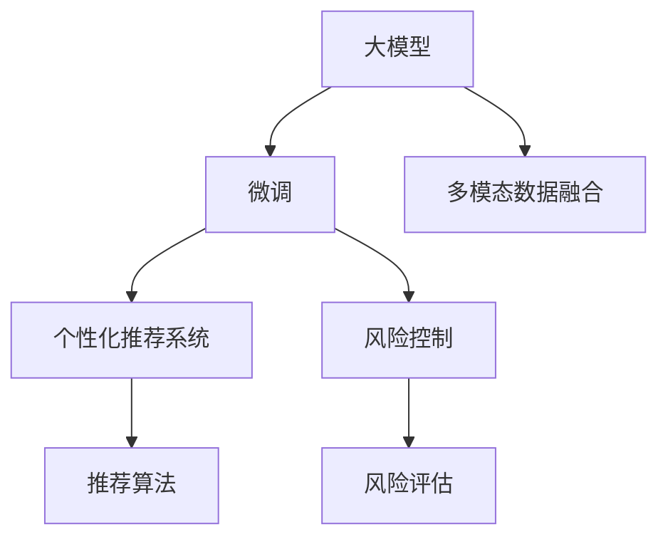

                 

# 大模型在金融产品推荐中的应用与风险

## 1. 背景介绍

### 1.1 问题由来

近年来，人工智能技术在金融行业中的应用逐步深入，通过机器学习和大模型技术的引入，金融机构在风险评估、信用评分、投资组合优化等诸多领域取得了显著进展。尤其是自然语言处理技术的进步，使得金融智能客服、智能投顾、自动化合规审核等智能应用得以快速发展。

然而，在产品推荐这一核心金融服务环节，尽管依赖客户行为数据的推荐系统已经得到广泛应用，但基于深度学习的大模型推荐系统，特别是基于大模型的微调方法，在金融领域的应用尚处于初期阶段。这主要受限于以下几个因素：

- **数据隐私与安全**：金融行业对客户数据隐私有着极高的要求，如何在不泄露客户隐私的前提下，利用大模型进行个性化推荐，是业界关注的焦点。
- **模型透明性与可解释性**：金融机构对推荐模型的输出结果要求高度透明和可解释，以确保合规性和业务决策的合理性。
- **模型鲁棒性与泛化能力**：金融市场的复杂性决定了推荐模型必须具备强大的鲁棒性和泛化能力，能够在多变的市场环境中稳定运行。
- **技术与业务的融合**：金融业务具有极强的专业性和复杂性，如何将大模型推荐技术与金融产品特性、客户需求、市场环境等因素深度融合，是技术落地应用的关键。

### 1.2 问题核心关键点

大模型在金融产品推荐中的应用，主要围绕以下三个关键点进行：

1. **数据准备与预处理**：从客户行为数据中提取有价值的信息，构建训练集和测试集。
2. **模型微调与优化**：基于预训练的大模型进行微调，获得适应金融业务特征的推荐模型。
3. **推荐算法与风险控制**：选择合适的推荐算法，并加入风险控制机制，确保推荐结果的安全与合规。

### 1.3 问题研究意义

研究大模型在金融产品推荐中的应用，对于推动金融科技的创新与发展，提升金融服务的智能化水平，具有重要意义：

1. **提升用户体验**：通过智能推荐，金融机构能够提供更符合用户需求的产品和服务，提高用户满意度。
2. **优化资源配置**：智能推荐能够优化金融资源的配置，提高投资回报率和风险管理效率。
3. **增强决策依据**：推荐模型可以作为决策的重要依据，帮助业务人员进行更科学的业务分析和决策。
4. **降低业务成本**：智能推荐可以减少人工干预，降低业务运营成本，提高业务效率。
5. **推动普惠金融**：智能推荐能够覆盖更多长尾客户，推动普惠金融的发展，增强金融服务的包容性。

## 2. 核心概念与联系

### 2.1 核心概念概述

为更好地理解大模型在金融产品推荐中的应用，本节将介绍几个密切相关的核心概念：

- **大模型**：以Transformer、BERT等深度学习模型为代表的预训练语言模型，能够从大规模文本数据中学习到丰富的语言知识和语义表示。
- **微调**：基于预训练大模型的微调方法，通过少量标注数据，在特定任务上进行有监督的参数更新，以获得更适应该任务的表现。
- **个性化推荐系统**：利用用户行为数据，通过机器学习模型对用户进行画像，推荐个性化的金融产品。
- **风险控制**：在推荐过程中，通过加入风险评估机制，避免推荐错误或有害的产品，保障金融服务的安全和合规。
- **多模态数据融合**：结合文本、图片、语音等多模态数据，提升推荐模型的泛化能力和鲁棒性。

这些核心概念之间的逻辑关系可以通过以下Mermaid流程图来展示：



这个流程图展示了大模型推荐系统的核心概念及其之间的关系：

1. 大模型通过预训练获得基础能力。
2. 微调使得模型适配金融任务，提升性能。
3. 推荐系统基于微调后的模型进行推荐。
4. 风险控制对推荐结果进行安全评估。
5. 多模态数据融合提高模型的泛化能力。

## 3. 核心算法原理 & 具体操作步骤
### 3.1 算法原理概述

大模型在金融产品推荐中的应用，主要基于监督学习进行微调。其核心思想是：将预训练的大模型视作强大的"特征提取器"，通过在金融产品推荐数据上进行有监督的微调，使得模型输出能够匹配推荐目标，从而获得针对金融产品推荐优化的模型。

形式化地，假设预训练模型为 $M_{\theta}$，其中 $\theta$ 为预训练得到的模型参数。给定金融产品推荐任务 $T$ 的训练集 $D=\{(x_i, y_i)\}_{i=1}^N$，微调的目标是找到新的模型参数 $\hat{\theta}$，使得：

$$
\hat{\theta}=\mathop{\arg\min}_{\theta} \mathcal{L}(M_{\theta},D)
$$

其中 $\mathcal{L}$ 为针对任务 $T$ 设计的损失函数，用于衡量模型预测输出与推荐目标之间的差异。常见的损失函数包括交叉熵损失、均方误差损失等。

通过梯度下降等优化算法，微调过程不断更新模型参数 $\theta$，最小化损失函数 $\mathcal{L}$，使得模型输出逼近推荐目标。由于 $\theta$ 已经通过预训练获得了较好的初始化，因此即便在金融产品推荐数据集上，模型也能够较快收敛到理想的模型参数 $\hat{\theta}$。

### 3.2 算法步骤详解

基于监督学习的大模型金融产品推荐微调一般包括以下几个关键步骤：

**Step 1: 准备预训练模型和数据集**
- 选择合适的预训练语言模型 $M_{\theta}$ 作为初始化参数，如 BERT、GPT 等。
- 准备金融产品推荐任务的训练集 $D$，划分为训练集、验证集和测试集。一般要求训练数据与预训练数据的分布不要差异过大。

**Step 2: 添加推荐适配层**
- 根据金融产品推荐任务类型，在预训练模型顶层设计合适的输出层和损失函数。
- 对于推荐任务，通常在顶层添加分类器或回归器，以回归用户评分或概率分布。
- 对于多标签推荐任务，通常使用二分类交叉熵损失函数。

**Step 3: 设置微调超参数**
- 选择合适的优化算法及其参数，如 AdamW、SGD 等，设置学习率、批大小、迭代轮数等。
- 设置正则化技术及强度，包括权重衰减、Dropout、Early Stopping 等。
- 确定冻结预训练参数的策略，如仅微调顶层，或全部参数都参与微调。

**Step 4: 执行梯度训练**
- 将训练集数据分批次输入模型，前向传播计算损失函数。
- 反向传播计算参数梯度，根据设定的优化算法和学习率更新模型参数。
- 周期性在验证集上评估模型性能，根据性能指标决定是否触发 Early Stopping。
- 重复上述步骤直到满足预设的迭代轮数或 Early Stopping 条件。

**Step 5: 测试和部署**
- 在测试集上评估微调后模型 $M_{\hat{\theta}}$ 的性能，对比微调前后的精度提升。
- 使用微调后的模型对新用户进行产品推荐，集成到实际的应用系统中。
- 持续收集新的用户行为数据，定期重新微调模型，以适应数据分布的变化。

以上是基于监督学习微调大模型进行金融产品推荐的一般流程。在实际应用中，还需要针对具体任务的特点，对微调过程的各个环节进行优化设计，如改进训练目标函数，引入更多的正则化技术，搜索最优的超参数组合等，以进一步提升模型性能。

### 3.3 算法优缺点

基于监督学习的大模型金融产品推荐微调方法具有以下优点：
1. 简单高效。只需准备少量标注数据，即可对预训练模型进行快速适配，获得较大的性能提升。
2. 通用适用。适用于各类金融产品推荐任务，包括信用卡、保险、理财产品等，设计简单的推荐适配层即可实现微调。
3. 参数高效。利用参数高效微调技术，在固定大部分预训练参数的情况下，仍可取得不错的提升。
4. 效果显著。在学术界和工业界的诸多任务上，基于微调的方法已经刷新了最先进的性能指标。

同时，该方法也存在一定的局限性：
1. 依赖标注数据。推荐系统的效果很大程度上取决于标注数据的质量和数量，获取高质量标注数据的成本较高。
2. 迁移能力有限。当目标任务与预训练数据的分布差异较大时，推荐模型的性能提升有限。
3. 负面效果传递。预训练模型的固有偏见、有害信息等，可能通过推荐模型传递到下游任务，造成负面影响。
4. 可解释性不足。推荐模型的决策过程通常缺乏可解释性，难以对其推理逻辑进行分析和调试。

尽管存在这些局限性，但就目前而言，基于监督学习的微调方法仍是大模型推荐系统应用的最主流范式。未来相关研究的重点在于如何进一步降低推荐对标注数据的依赖，提高模型的少样本学习和跨领域迁移能力，同时兼顾可解释性和伦理安全性等因素。

### 3.4 算法应用领域

基于大模型微调的推荐方法，在金融行业已经得到了广泛的应用，覆盖了从客户画像、产品匹配到风险评估等多个环节，具体如下：

1. **客户画像**：通过对客户的历史行为数据进行预处理和特征提取，利用预训练大模型进行微调，构建用户画像。
2. **产品匹配**：将产品特性、用户画像作为输入，微调模型进行产品推荐，实现个性化推荐。
3. **风险评估**：在推荐过程中，加入风险评估机制，通过微调模型判断推荐产品的风险等级，规避不良产品。
4. **舆情分析**：利用金融舆情数据对预训练大模型进行微调，分析市场情绪，辅助投资决策。
5. **智能投顾**：在智能投顾系统中，微调大模型进行用户行为分析和投资策略推荐，提高智能投顾的准确性和用户满意度。
6. **自动化合规审核**：利用金融法规文本对预训练大模型进行微调，实现自动化合规审核，减少合规成本。

除了上述这些核心应用外，大模型推荐方法还被创新性地应用到更多场景中，如产品组合优化、欺诈检测、市场预测等，为金融科技的发展提供了新的技术手段。随着预训练模型和微调方法的不断进步，相信金融推荐系统将在更广阔的应用领域大放异彩。

## 4. 数学模型和公式 & 详细讲解 & 举例说明
### 4.1 数学模型构建

本节将使用数学语言对基于监督学习的大模型金融产品推荐微调过程进行更加严格的刻画。

记预训练语言模型为 $M_{\theta}$，其中 $\theta$ 为预训练得到的模型参数。假设金融产品推荐任务 $T$ 的训练集为 $D=\{(x_i, y_i)\}_{i=1}^N$，其中 $x_i$ 为推荐目标（如评分、标签等），$y_i$ 为产品特征向量。

定义模型 $M_{\theta}$ 在数据样本 $(x,y)$ 上的损失函数为 $\ell(M_{\theta}(x),y)$，则在数据集 $D$ 上的经验风险为：

$$
\mathcal{L}(\theta) = \frac{1}{N} \sum_{i=1}^N \ell(M_{\theta}(x_i),y_i)
$$

其中 $\ell$ 为推荐任务设计的损失函数，用于衡量模型预测输出与推荐目标之间的差异。常见的损失函数包括均方误差、交叉熵损失等。

微调的优化目标是最小化经验风险，即找到最优参数：

$$
\theta^* = \mathop{\arg\min}_{\theta} \mathcal{L}(\theta)
$$

在实践中，我们通常使用基于梯度的优化算法（如SGD、Adam等）来近似求解上述最优化问题。设 $\eta$ 为学习率，$\lambda$ 为正则化系数，则参数的更新公式为：

$$
\theta \leftarrow \theta - \eta \nabla_{\theta}\mathcal{L}(\theta) - \eta\lambda\theta
$$

其中 $\nabla_{\theta}\mathcal{L}(\theta)$ 为损失函数对参数 $\theta$ 的梯度，可通过反向传播算法高效计算。

### 4.2 公式推导过程

以下我们以金融产品推荐任务为例，推导均方误差损失函数及其梯度的计算公式。

假设模型 $M_{\theta}$ 在输入 $x_i$ 上的输出为 $\hat{y}=M_{\theta}(x_i)$，表示推荐产品的评分预测。真实标签 $y_i$ 为产品的真实评分，假设 $y_i$ 服从均值为 $\mu$，标准差为 $\sigma$ 的分布，则均方误差损失函数定义为：

$$
\ell(M_{\theta}(x_i),y_i) = \frac{1}{2} (y_i - \hat{y})^2
$$

将其代入经验风险公式，得：

$$
\mathcal{L}(\theta) = \frac{1}{N} \sum_{i=1}^N \frac{1}{2} (y_i - \hat{y})^2
$$

根据链式法则，损失函数对参数 $\theta_k$ 的梯度为：

$$
\frac{\partial \mathcal{L}(\theta)}{\partial \theta_k} = -\frac{1}{N}\sum_{i=1}^N (y_i - \hat{y}) \frac{\partial \hat{y}}{\partial \theta_k}
$$

其中 $\frac{\partial \hat{y}}{\partial \theta_k}$ 可进一步递归展开，利用自动微分技术完成计算。

在得到损失函数的梯度后，即可带入参数更新公式，完成模型的迭代优化。重复上述过程直至收敛，最终得到适应金融推荐任务的最优模型参数 $\theta^*$。

## 5. 项目实践：代码实例和详细解释说明
### 5.1 开发环境搭建

在进行金融产品推荐微调实践前，我们需要准备好开发环境。以下是使用Python进行PyTorch开发的环境配置流程：

1. 安装Anaconda：从官网下载并安装Anaconda，用于创建独立的Python环境。

2. 创建并激活虚拟环境：
```bash
conda create -n pytorch-env python=3.8 
conda activate pytorch-env
```

3. 安装PyTorch：根据CUDA版本，从官网获取对应的安装命令。例如：
```bash
conda install pytorch torchvision torchaudio cudatoolkit=11.1 -c pytorch -c conda-forge
```

4. 安装Transformers库：
```bash
pip install transformers
```

5. 安装各类工具包：
```bash
pip install numpy pandas scikit-learn matplotlib tqdm jupyter notebook ipython
```

完成上述步骤后，即可在`pytorch-env`环境中开始微调实践。

### 5.2 源代码详细实现

这里我们以推荐信用评分任务为例，给出使用Transformers库对BERT模型进行微调的PyTorch代码实现。

首先，定义信用评分任务的训练数据处理函数：

```python
from transformers import BertTokenizer
from torch.utils.data import Dataset
import torch

class CreditDataset(Dataset):
    def __init__(self, features, labels, tokenizer, max_len=128):
        self.features = features
        self.labels = labels
        self.tokenizer = tokenizer
        self.max_len = max_len
        
    def __len__(self):
        return len(self.features)
    
    def __getitem__(self, item):
        feature = self.features[item]
        label = self.labels[item]
        
        encoding = self.tokenizer(feature, return_tensors='pt', max_length=self.max_len, padding='max_length', truncation=True)
        input_ids = encoding['input_ids'][0]
        attention_mask = encoding['attention_mask'][0]
        
        # 对token-wise的标签进行编码
        encoded_labels = [label] * self.max_len
        labels = torch.tensor(encoded_labels, dtype=torch.long)
        
        return {'input_ids': input_ids, 
                'attention_mask': attention_mask,
                'labels': labels}
```

然后，定义模型和优化器：

```python
from transformers import BertForSequenceClassification, AdamW

model = BertForSequenceClassification.from_pretrained('bert-base-cased', num_labels=3)

optimizer = AdamW(model.parameters(), lr=2e-5)
```

接着，定义训练和评估函数：

```python
from torch.utils.data import DataLoader
from tqdm import tqdm
from sklearn.metrics import classification_report

device = torch.device('cuda') if torch.cuda.is_available() else torch.device('cpu')
model.to(device)

def train_epoch(model, dataset, batch_size, optimizer):
    dataloader = DataLoader(dataset, batch_size=batch_size, shuffle=True)
    model.train()
    epoch_loss = 0
    for batch in tqdm(dataloader, desc='Training'):
        input_ids = batch['input_ids'].to(device)
        attention_mask = batch['attention_mask'].to(device)
        labels = batch['labels'].to(device)
        model.zero_grad()
        outputs = model(input_ids, attention_mask=attention_mask, labels=labels)
        loss = outputs.loss
        epoch_loss += loss.item()
        loss.backward()
        optimizer.step()
    return epoch_loss / len(dataloader)

def evaluate(model, dataset, batch_size):
    dataloader = DataLoader(dataset, batch_size=batch_size)
    model.eval()
    preds, labels = [], []
    with torch.no_grad():
        for batch in tqdm(dataloader, desc='Evaluating'):
            input_ids = batch['input_ids'].to(device)
            attention_mask = batch['attention_mask'].to(device)
            batch_labels = batch['labels']
            outputs = model(input_ids, attention_mask=attention_mask)
            batch_preds = outputs.logits.argmax(dim=2).to('cpu').tolist()
            batch_labels = batch_labels.to('cpu').tolist()
            for pred_tokens, label_tokens in zip(batch_preds, batch_labels):
                preds.append(pred_tokens[:len(label_tokens)])
                labels.append(label_tokens)
                
    print(classification_report(labels, preds))
```

最后，启动训练流程并在测试集上评估：

```python
epochs = 5
batch_size = 16

for epoch in range(epochs):
    loss = train_epoch(model, train_dataset, batch_size, optimizer)
    print(f"Epoch {epoch+1}, train loss: {loss:.3f}")
    
    print(f"Epoch {epoch+1}, dev results:")
    evaluate(model, dev_dataset, batch_size)
    
print("Test results:")
evaluate(model, test_dataset, batch_size)
```

以上就是使用PyTorch对BERT进行信用评分任务微调的完整代码实现。可以看到，得益于Transformers库的强大封装，我们可以用相对简洁的代码完成BERT模型的加载和微调。

### 5.3 代码解读与分析

让我们再详细解读一下关键代码的实现细节：

**CreditDataset类**：
- `__init__`方法：初始化特征、标签、分词器等关键组件。
- `__len__`方法：返回数据集的样本数量。
- `__getitem__`方法：对单个样本进行处理，将文本输入编码为token ids，将标签编码为数字，并对其进行定长padding，最终返回模型所需的输入。

**模型和优化器**：
- 使用BertForSequenceClassification从预训练模型Bert-Base加载模型，设置输出标签数为3（违约、正常、预测未知）。
- 使用AdamW优化器进行微调，学习率为2e-5。

**训练和评估函数**：
- 使用PyTorch的DataLoader对数据集进行批次化加载，供模型训练和推理使用。
- 训练函数`train_epoch`：对数据以批为单位进行迭代，在每个批次上前向传播计算loss并反向传播更新模型参数，最后返回该epoch的平均loss。
- 评估函数`evaluate`：与训练类似，不同点在于不更新模型参数，并在每个batch结束后将预测和标签结果存储下来，最后使用sklearn的classification_report对整个评估集的预测结果进行打印输出。

**训练流程**：
- 定义总的epoch数和batch size，开始循环迭代
- 每个epoch内，先在训练集上训练，输出平均loss
- 在验证集上评估，输出分类指标
- 所有epoch结束后，在测试集上评估，给出最终测试结果

可以看到，PyTorch配合Transformers库使得BERT微调的代码实现变得简洁高效。开发者可以将更多精力放在数据处理、模型改进等高层逻辑上，而不必过多关注底层的实现细节。

当然，工业级的系统实现还需考虑更多因素，如模型的保存和部署、超参数的自动搜索、更灵活的任务适配层等。但核心的微调范式基本与此类似。

## 6. 实际应用场景
### 6.1 智能客服系统

基于大模型微调的金融智能客服系统，可以广泛应用于客户咨询、账户管理、交易处理等环节。传统客服往往需要配备大量人力，高峰期响应缓慢，且一致性和专业性难以保证。而使用微调后的金融智能客服系统，能够24小时不间断服务，快速响应客户咨询，用自然流畅的语言解答各类金融问题。

在技术实现上，可以收集客户的历史咨询记录，将问题-回答对作为监督数据，在此基础上对预训练金融客服模型进行微调。微调后的金融客服模型能够自动理解客户意图，匹配最合适的答案模板进行回复。对于客户提出的新问题，还可以接入检索系统实时搜索相关内容，动态组织生成回答。如此构建的智能客服系统，能大幅提升客户咨询体验和问题解决效率。

### 6.2 投资组合优化

通过大模型微调技术，可以实现基于用户风险偏好的智能投资组合优化。投资组合优化是金融风险管理中的重要环节，传统的量化投资组合方法需要大量经验和数据积累，往往难以灵活应对多变的市场环境。利用微调后的金融推荐模型，可以实时分析用户的历史投资行为和风险偏好，生成个性化的投资组合推荐，优化投资组合的表现和风险水平。

在技术实现上，可以收集用户的历史交易数据和投资偏好，构建训练集和测试集，对预训练大模型进行微调。微调后的模型能够根据用户的最新情况，生成个性化的投资组合推荐，帮助用户进行更科学的投资决策。

### 6.3 信用评分

基于大模型微调的信用评分系统，可以实时分析用户的财务状况和行为数据，生成准确的信用评分。传统的信用评分方法依赖于复杂的模型和大量的历史数据，难以应对数据分布的变化。利用微调后的金融推荐模型，可以实时分析用户的多维数据，生成动态更新的信用评分，提升信用评估的准确性和及时性。

在技术实现上，可以收集用户的银行流水、信用卡账单、贷款记录等多维数据，构建训练集和测试集，对预训练大模型进行微调。微调后的模型能够根据用户的最新数据，生成实时更新的信用评分，帮助金融机构进行更精确的贷款审批和风险评估。

### 6.4 风险管理

基于大模型微调的风险管理系统，可以实时监测金融市场的风险状况，提前预警潜在的风险事件。传统的风险管理方法依赖于复杂的数据处理和模型构建，难以灵活应对多变的市场环境。利用微调后的金融推荐模型，可以实时分析市场的舆情数据和交易数据，生成风险预警报告，帮助金融机构及时调整投资策略和风险控制措施。

在技术实现上，可以收集市场舆情数据和交易数据，构建训练集和测试集，对预训练大模型进行微调。微调后的模型能够实时分析市场数据，生成风险预警报告，帮助金融机构及时应对市场风险。

## 7. 工具和资源推荐
### 7.1 学习资源推荐

为了帮助开发者系统掌握大模型在金融产品推荐中的应用，这里推荐一些优质的学习资源：

1. 《深度学习与金融科技》系列博文：由大模型技术专家撰写，深入浅出地介绍了深度学习在金融领域的应用，包括推荐系统、信用评分、风险管理等主题。

2. 《金融科技与人工智能》课程：北京大学开设的在线课程，涵盖金融科技的基础理论、前沿技术和实际应用，适合金融领域的从业人员和科研人员学习。

3. 《人工智能与金融产品推荐》书籍：深入讲解了金融推荐系统的原理和实践，结合大量案例，帮助读者掌握金融推荐技术。

4. 《金融推荐系统理论与实践》书籍：全面介绍了金融推荐系统的构建方法、评价指标和应用场景，适合金融科技领域的开发者和研究人员。

5. 《金融大数据与人工智能》期刊：聚焦于金融大数据与人工智能领域的最新研究进展和技术实践，提供丰富的学术论文和行业资讯。

通过对这些资源的学习实践，相信你一定能够快速掌握大模型在金融产品推荐中的应用，并用于解决实际的金融问题。
###  7.2 开发工具推荐

高效的开发离不开优秀的工具支持。以下是几款用于金融产品推荐微调开发的常用工具：

1. PyTorch：基于Python的开源深度学习框架，灵活动态的计算图，适合快速迭代研究。大部分预训练语言模型都有PyTorch版本的实现。

2. TensorFlow：由Google主导开发的开源深度学习框架，生产部署方便，适合大规模工程应用。同样有丰富的预训练语言模型资源。

3. Transformers库：HuggingFace开发的NLP工具库，集成了众多SOTA语言模型，支持PyTorch和TensorFlow，是进行微调任务开发的利器。

4. Weights & Biases：模型训练的实验跟踪工具，可以记录和可视化模型训练过程中的各项指标，方便对比和调优。与主流深度学习框架无缝集成。

5. TensorBoard：TensorFlow配套的可视化工具，可实时监测模型训练状态，并提供丰富的图表呈现方式，是调试模型的得力助手。

6. Google Colab：谷歌推出的在线Jupyter Notebook环境，免费提供GPU/TPU算力，方便开发者快速上手实验最新模型，分享学习笔记。

合理利用这些工具，可以显著提升金融产品推荐微调的开发效率，加快创新迭代的步伐。

### 7.3 相关论文推荐

大模型在金融产品推荐中的应用，源于学界的持续研究。以下是几篇奠基性的相关论文，推荐阅读：

1. Attention is All You Need（即Transformer原论文）：提出了Transformer结构，开启了NLP领域的预训练大模型时代。

2. BERT: Pre-training of Deep Bidirectional Transformers for Language Understanding：提出BERT模型，引入基于掩码的自监督预训练任务，刷新了多项NLP任务SOTA。

3. Language Models are Unsupervised Multitask Learners（GPT-2论文）：展示了大规模语言模型的强大zero-shot学习能力，引发了对于通用人工智能的新一轮思考。

4. Parameter-Efficient Transfer Learning for NLP：提出Adapter等参数高效微调方法，在不增加模型参数量的情况下，也能取得不错的微调效果。

5. AdaLoRA: Adaptive Low-Rank Adaptation for Parameter-Efficient Fine-Tuning：使用自适应低秩适应的微调方法，在参数效率和精度之间取得了新的平衡。

6. Efficient Recommendation Models for Large-scale Recommendation Systems：提出基于稀疏矩阵分解的推荐模型，在稀疏数据上表现优异。

这些论文代表了大模型微调在金融产品推荐中的应用趋势。通过学习这些前沿成果，可以帮助研究者把握学科前进方向，激发更多的创新灵感。

## 8. 总结：未来发展趋势与挑战
### 8.1 总结

本文对基于监督学习的大模型在金融产品推荐中的应用进行了全面系统的介绍。首先阐述了大模型和微调技术在金融推荐系统中的应用背景和意义，明确了微调在拓展金融推荐模型应用、提升金融服务智能化水平方面的独特价值。其次，从原理到实践，详细讲解了监督微调的数学原理和关键步骤，给出了微调任务开发的完整代码实例。同时，本文还广泛探讨了微调方法在智能客服、投资组合优化、信用评分、风险管理等多个金融场景中的应用前景，展示了微调范式的巨大潜力。此外，本文精选了微调技术的各类学习资源，力求为读者提供全方位的技术指引。

通过本文的系统梳理，可以看到，基于大模型微调的推荐方法正在成为金融科技领域的重要范式，极大地提升了金融推荐系统的性能和应用范围，为金融服务的智能化发展提供了新动力。未来，伴随预训练语言模型和微调方法的持续演进，相信金融推荐系统将在更广阔的应用领域大放异彩，深刻影响金融机构的业务模式和用户体验。

### 8.2 未来发展趋势

展望未来，大模型在金融产品推荐中的应用，将呈现以下几个发展趋势：

1. **数据驱动与模型融合**：更多依赖数据驱动的推荐模型，如矩阵分解、深度学习模型等，将与领域知识、规则库等专家知识深度融合，形成更加全面、准确的信息整合能力。

2. **多模态数据融合**：结合文本、图片、语音等多模态数据，提升推荐模型的泛化能力和鲁棒性，解决金融推荐系统的多维度信息整合问题。

3. **实时化与自动化**：实时分析用户行为数据，动态更新推荐结果，降低人工干预，提高金融推荐系统的自动化水平。

4. **风险控制与合规性**：在推荐过程中，加入更强的风险控制机制，如异常检测、行为预测等，保障推荐结果的安全与合规。

5. **跨平台与多渠道**：推荐系统将覆盖更多平台和渠道，包括PC端、移动端、第三方应用等，实现多渠道的协同推荐，提升用户体验。

6. **个性化与普惠性**：利用大模型微调技术，实现更精准的个性化推荐，同时增强对长尾客户的覆盖，推动普惠金融的发展。

以上趋势凸显了大模型微调在金融推荐系统中的应用前景。这些方向的探索发展，必将进一步提升金融推荐系统的性能和应用范围，为金融科技的发展注入新的活力。

### 8.3 面临的挑战

尽管大模型微调技术已经取得了瞩目成就，但在迈向更加智能化、普适化应用的过程中，它仍面临着诸多挑战：

1. **数据隐私与安全**：金融行业对客户数据隐私有着极高的要求，如何在不泄露客户隐私的前提下，利用大模型进行个性化推荐，是业界关注的焦点。

2. **模型鲁棒性与泛化能力**：金融市场的复杂性决定了推荐模型必须具备强大的鲁棒性和泛化能力，能够在多变的市场环境中稳定运行。

3. **模型透明性与可解释性**：金融机构对推荐模型的输出结果要求高度透明和可解释，以确保合规性和业务决策的合理性。

4. **技术与业务的融合**：金融业务具有极强的专业性和复杂性，如何将大模型推荐技术与金融产品特性、客户需求、市场环境等因素深度融合，是技术落地应用的关键。

5. **资源消耗与部署**：超大批次的训练和推理，可能导致计算资源消耗过大，如何高效利用资源，提高模型的运行效率，是部署应用的难点。

6. **模型更新与维护**：随着市场环境和客户行为的变化，推荐模型需要不断更新和维护，保持模型性能的持续提升。

正视微调面临的这些挑战，积极应对并寻求突破，将是大模型微调走向成熟的必由之路。相信随着学界和产业界的共同努力，这些挑战终将一一被克服，大模型微调必将在构建人机协同的智能金融中扮演越来越重要的角色。

### 8.4 研究展望

面对大模型微调所面临的种种挑战，未来的研究需要在以下几个方面寻求新的突破：

1. **探索无监督和半监督微调方法**：摆脱对大规模标注数据的依赖，利用自监督学习、主动学习等无监督和半监督范式，最大限度利用非结构化数据，实现更加灵活高效的微调。

2. **研究参数高效和计算高效的微调范式**：开发更加参数高效的微调方法，在固定大部分预训练参数的同时，只更新极少量的任务相关参数。同时优化微调模型的计算图，减少前向传播和反向传播的资源消耗，实现更加轻量级、实时性的部署。

3. **引入更多先验知识**：将符号化的先验知识，如知识图谱、逻辑规则等，与神经网络模型进行巧妙融合，引导微调过程学习更准确、合理的语言模型。同时加强不同模态数据的整合，实现视觉、语音等多模态信息与文本信息的协同建模。

4. **结合因果分析和博弈论工具**：将因果分析方法引入微调模型，识别出模型决策的关键特征，增强输出解释的因果性和逻辑性。借助博弈论工具刻画人机交互过程，主动探索并规避模型的脆弱点，提高系统稳定性。

5. **纳入伦理道德约束**：在模型训练目标中引入伦理导向的评估指标，过滤和惩罚有偏见、有害的输出倾向。同时加强人工干预和审核，建立模型行为的监管机制，确保输出符合人类价值观和伦理道德。

这些研究方向的探索，必将引领大模型微调技术迈向更高的台阶，为构建安全、可靠、可解释、可控的智能金融系统铺平道路。面向未来，大模型微调技术还需要与其他人工智能技术进行更深入的融合，如知识表示、因果推理、强化学习等，多路径协同发力，共同推动金融推荐系统的进步。只有勇于创新、敢于突破，才能不断拓展语言模型的边界，让智能技术更好地造福金融行业。

## 9. 附录：常见问题与解答

**Q1：大模型微调在金融产品推荐中是否存在隐私风险？**

A: 金融行业对客户数据隐私有着极高的要求，因此在使用大模型微调进行金融产品推荐时，需要严格遵守数据隐私法律法规，如GDPR、CCPA等。此外，可以采用联邦学习、差分隐私等技术，在不暴露个人隐私的前提下，利用分布式数据进行模型微调。

**Q2：大模型微调如何进行数据预处理？**

A: 数据预处理是大模型微调的重要环节，主要包括以下几个步骤：
1. 数据清洗：去除噪声数据、重复数据，处理缺失值和异常值。
2. 特征提取：从原始数据中提取有意义的特征，如用户行为、产品属性、交易记录等。
3. 数据增强：通过回译、近义替换等方式扩充训练集，提高模型的泛化能力。
4. 数据归一化：将特征值缩放到一个标准范围内，便于模型训练。

这些预处理步骤需要根据具体任务的特点进行调整，确保数据的质量和多样性。

**Q3：金融产品推荐中的风险控制如何实现？**

A: 风险控制是金融推荐系统的重要环节，主要包括以下几个方面：
1. 异常检测：利用异常检测算法，识别出异常的交易行为或用户行为，进行风险预警。
2. 行为预测：通过分析用户的历史行为数据，预测其未来的行为趋势，避免推荐有害产品。
3. 模型监控：实时监控模型的输出结果，及时发现和纠正错误的推荐，确保推荐结果的安全与合规。
4. 人工审核：对高风险的推荐结果进行人工审核，确保推荐决策的准确性和合理性。

这些风险控制措施需要与金融推荐模型深度融合，形成完整的风险管理体系。

**Q4：大模型微调在金融推荐中的效果如何评价？**

A: 评价金融推荐系统的效果，通常需要考虑以下几个指标：
1. 准确率：推荐系统推荐的准确率，即推荐结果与真实结果的一致性。
2. 召回率：推荐系统推荐的相关产品覆盖率，即推荐结果中包含真实产品的比例。
3. 点击率：用户点击推荐产品的比例，即推荐系统的吸引力。
4. 转化率：用户最终购买推荐产品的比例，即推荐系统的有效性。
5. 用户体验：用户对推荐系统的满意度，包括界面友好性、响应速度、个性化程度等。

这些指标需要根据具体的业务场景进行选择和优化，确保推荐系统的综合表现。

**Q5：大模型微调在金融推荐中的应用前景如何？**

A: 大模型微调在金融产品推荐中的应用前景广阔，特别是在智能化、个性化、实时化、自动化等方面具有显著优势。通过微调技术，可以构建更精准、高效的金融推荐系统，提升金融服务的智能化水平，推动金融科技的发展。随着技术的不断进步，大模型微调将在金融推荐系统中的应用不断深入，为金融机构提供更强大的决策支持和更优质的用户体验。

