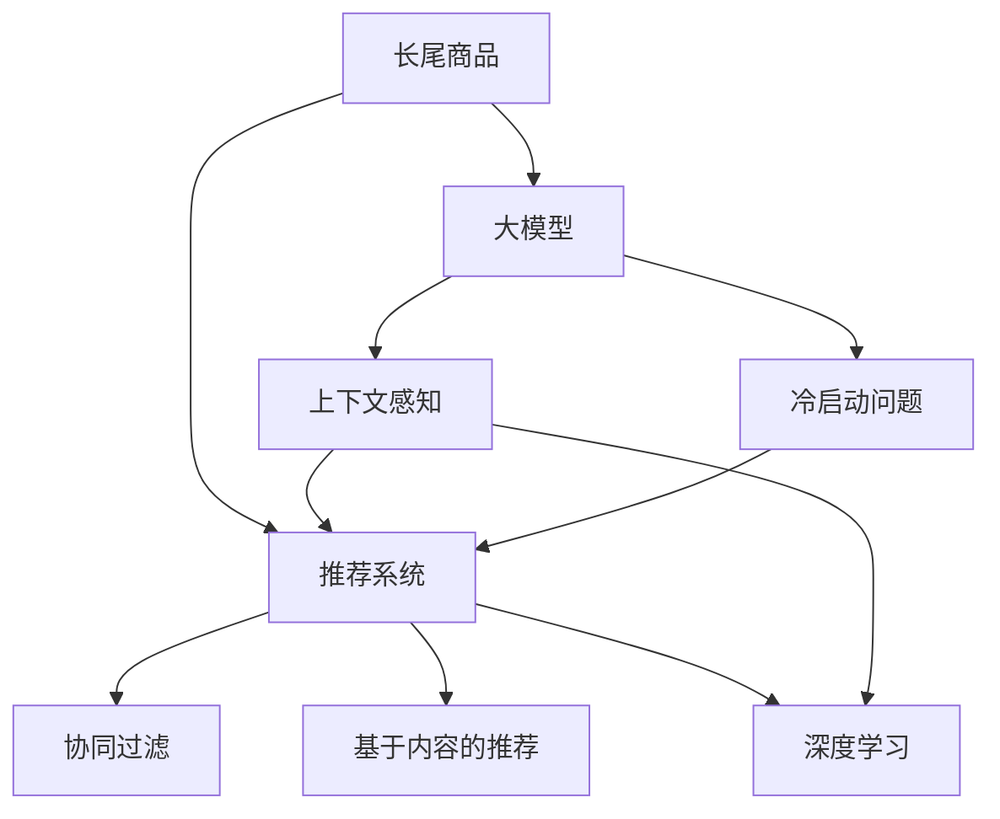

                 

# 大模型在长尾商品推荐中的优势

## 1. 背景介绍

随着电子商务的迅猛发展，在线商品推荐系统成为连接消费者与电商平台的桥梁，极大地提升了用户体验和平台收益。但面对海量商品，传统推荐系统在精确度和覆盖度上仍存在较大局限性，特别是在长尾商品推荐方面，更难实现精准推荐。大模型的应用，为长尾商品推荐带来了新的解决思路。

### 1.1 问题由来
电商平台的商品种类繁多，不仅有热销商品，还有数量庞大的长尾商品。传统推荐算法基于协同过滤、SVD、FM等方法，依赖用户历史行为数据，难以发现长尾商品的潜在用户，无法实现冷门商品的精准推荐。而大模型则通过对大规模数据的训练，学到了更丰富的商品语义表示，能够识别出更多隐含的关联关系，从而提升长尾商品的推荐效果。

### 1.2 问题核心关键点
1. **数据稀疏性**：电商平台用户历史行为数据往往非常稀疏，无法充分覆盖所有长尾商品。
2. **冷门商品**：长尾商品用户数量少，难以通过用户行为数据进行精准推荐。
3. **多样性需求**：长尾商品需求多样化，对个性化推荐提出了更高要求。
4. **数据噪声**：用户数据存在噪声，推荐算法需要具备较强的鲁棒性。

## 2. 核心概念与联系

### 2.1 核心概念概述

为更好地理解大模型在长尾商品推荐中的应用，本节将介绍几个密切相关的核心概念：

- **长尾商品**：在电商平台中，销售额较低的商品，虽然数量众多，但单个商品销量极低。长尾商品往往是用户个性化需求的重要来源，但传统推荐算法难以有效处理。
- **大模型**：以深度神经网络为代表的大规模预训练模型，如BERT、GPT等。通过在大规模无标签数据上进行预训练，学到了丰富的语义表示和知识，能够进行复杂的语言理解和生成。
- **推荐系统**：利用用户行为数据，为每个用户推荐感兴趣的商品或服务。传统推荐算法包括协同过滤、基于内容的推荐、深度学习等。
- **冷启动问题**：新用户或新商品进入推荐系统时，难以获取足够的行为数据，推荐效果差。大模型可以更好地处理冷启动问题。
- **上下文感知**：推荐系统需要考虑用户、商品、时间等多种上下文信息，大模型能够处理多模态数据，提取上下文相关特征。

这些核心概念之间的逻辑关系可以通过以下Mermaid流程图来展示：



这个流程图展示了大模型在推荐系统中的应用逻辑：

1. 长尾商品通过大模型的语义表示，捕捉到商品特征和关联关系。
2. 推荐系统利用大模型的上下文感知能力，结合协同过滤、内容推荐等算法，进行精准推荐。
3. 大模型还能处理冷启动问题，为新的用户和商品提供更好的推荐。

## 3. 核心算法原理 & 具体操作步骤
### 3.1 算法原理概述

大模型在长尾商品推荐中的主要原理是通过大规模语料预训练，学习到商品的语义表示和关联关系，再结合推荐算法进行精准推荐。具体来说，包括以下几个步骤：

1. **大模型预训练**：在大规模商品数据上进行预训练，学习商品的语义表示。
2. **特征提取**：利用大模型提取商品和用户的特征表示，捕捉商品属性和关联关系。
3. **推荐模型训练**：在用户-商品交互数据上，利用协同过滤、内容推荐等方法，训练推荐模型。
4. **模型微调**：针对长尾商品的推荐效果，对大模型进行微调，提升对长尾商品的识别和推荐能力。

### 3.2 算法步骤详解

基于大模型的长尾商品推荐，通常包括以下几个关键步骤：

**Step 1: 数据准备与预处理**
- 收集电商平台的商品数据，包括商品描述、属性、类别等信息。
- 清洗和标注数据，去除噪声，保证数据质量。
- 将商品数据进行分词、编码等预处理，使其能够被大模型处理。

**Step 2: 大模型预训练**
- 在大规模商品语料上，使用深度学习模型进行预训练，学习商品语义表示。
- 常用的预训练任务包括单词语言模型、句子语言模型、掩码语言模型等。
- 预训练完成后，得到商品的预训练表示向量。

**Step 3: 特征提取**
- 将商品数据输入大模型，获取商品和用户的特征向量表示。
- 常用的特征提取方式包括预训练语言模型的线性变换、注意力机制等。
- 通过特征提取，捕捉商品和用户的上下文信息，生成商品嵌入向量。

**Step 4: 推荐模型训练**
- 利用用户-商品交互数据，训练推荐模型。
- 常用的推荐算法包括基于协同过滤的ALS、基于内容的推荐、深度学习中的MLP、CNN、RNN等。
- 推荐模型学习商品-用户的相关性，输出推荐列表。

**Step 5: 模型微调**
- 在推荐模型中，针对长尾商品的推荐效果，对大模型进行微调。
- 微调的目标是提升大模型对长尾商品的识别能力，优化推荐效果。
- 微调方法包括添加长尾商品分类器、修改损失函数、加入长尾商品损失等。

**Step 6: 实时推荐**
- 将微调后的模型集成到实时推荐系统中，进行商品推荐。
- 通过在线A/B测试，对比推荐效果，不断优化模型参数。
- 定期更新数据集，重新训练和微调模型。

### 3.3 算法优缺点

大模型在长尾商品推荐中的优点包括：

1. **广泛覆盖**：大模型可以处理海量商品数据，涵盖长尾商品，提升推荐系统的覆盖度和精度。
2. **鲁棒性强**：大模型通过大规模语料预训练，具有较强的泛化能力，能够应对数据噪声和稀疏性问题。
3. **冷启动效果好**：大模型能够根据商品语义进行推荐，无需依赖用户历史行为数据，对于新商品和老商品都有较好的推荐效果。
4. **上下文感知能力强**：大模型能够捕捉商品和用户的上下文信息，进行更加个性化推荐。
5. **动态更新**：大模型可以不断吸收新的数据，进行持续学习，提升推荐效果。

但大模型在长尾商品推荐中也存在一些缺点：

1. **高成本**：大模型预训练和微调需要大量的计算资源和存储资源，成本较高。
2. **复杂性**：大模型的训练和微调过程复杂，需要较高的技术门槛。
3. **过拟合风险**：大模型可能过拟合长尾商品的特征，导致对真实用户需求判断不准确。

## 4. 数学模型和公式 & 详细讲解 & 举例说明

### 4.1 数学模型构建

在大模型应用于长尾商品推荐时，主要涉及的数学模型包括：

1. **预训练语言模型**：通过大规模无标签语料进行预训练，学习商品的语义表示。常用的模型包括BERT、GPT等。
2. **推荐模型**：利用用户和商品的数据，训练推荐算法，生成推荐列表。常用的算法包括协同过滤、内容推荐、深度学习等。
3. **微调模型**：对预训练模型进行微调，优化长尾商品的推荐效果。常用的微调方法包括添加长尾商品分类器、修改损失函数等。

### 4.2 公式推导过程

假设推荐系统包含 $N$ 个用户，$M$ 个商品，$D$ 个特征。记用户-商品交互矩阵为 $X \in \mathbb{R}^{N \times M}$，其中 $X_{ij} = 1$ 表示用户 $i$ 购买了商品 $j$。记商品特征向量为 $F \in \mathbb{R}^{M \times D}$，用户特征向量为 $U \in \mathbb{R}^{N \times D}$。

1. **大模型预训练**
   - 假设大模型通过语言模型进行预训练，得到商品语义向量 $E \in \mathbb{R}^{M \times d_E}$。其中 $d_E$ 为大模型的输出维度。
   - 预训练损失函数为：$$
   \mathcal{L}_{pre} = -\frac{1}{N} \sum_{i=1}^N \sum_{j=1}^M \log \sigma(E_j^T X_i)
   $$
   其中 $\sigma$ 为sigmoid函数。

2. **特征提取**
   - 利用大模型对商品特征 $F$ 进行线性变换，得到商品嵌入向量 $V \in \mathbb{R}^{M \times d_V}$。其中 $d_V$ 为特征向量的维度。
   - 特征提取的线性变换为：$$
   V = W_1F + b_1
   $$
   其中 $W_1 \in \mathbb{R}^{d_V \times D}$ 为线性变换矩阵，$b_1 \in \mathbb{R}^{d_V}$ 为偏置向量。

3. **推荐模型训练**
   - 利用协同过滤算法，得到用户和商品的相似度矩阵 $S \in \mathbb{R}^{N \times M}$。
   - 常用的协同过滤算法包括ALS（交替最小二乘）和PMI（点乘内积）等。
   - 推荐模型的损失函数为：$$
   \mathcal{L}_{rec} = -\frac{1}{N} \sum_{i=1}^N \sum_{j=1}^M \log \sigma(S_{ij}V_j^T U_i)
   $$
   其中 $S_{ij}$ 为相似度矩阵的元素。

4. **模型微调**
   - 在推荐模型的基础上，针对长尾商品的推荐效果，对大模型进行微调。
   - 微调的目标是提升大模型对长尾商品的识别能力，优化推荐效果。
   - 微调方法包括添加长尾商品分类器、修改损失函数、加入长尾商品损失等。

### 4.3 案例分析与讲解

以长尾商品的情感分析为例，展示大模型在推荐系统中的应用。假设电商平台有大量长尾商品，需要为每个商品标注情感标签，从而进行推荐。

1. **预训练模型**
   - 使用BERT模型对电商平台所有商品描述进行预训练，得到商品的语义表示向量。
   - BERT模型通过语言模型预训练，学到了丰富的语义知识，能够捕捉商品描述中的情感倾向。

2. **特征提取**
   - 将商品描述输入BERT模型，得到商品的嵌入向量 $V$。
   - 通过向量拼接或注意力机制，将商品嵌入向量 $V$ 与用户特征向量 $U$ 融合，得到用户-商品交互向量。

3. **推荐模型训练**
   - 利用用户和商品的情感标签数据，训练情感分类模型。常用的算法包括SVM、深度学习中的MLP等。
   - 情感分类模型的损失函数为：$$
   \mathcal{L}_{em} = -\frac{1}{N} \sum_{i=1}^N \sum_{j=1}^M \log \sigma(E_{ij})
   $$
   其中 $E_{ij}$ 为分类器预测结果。

4. **模型微调**
   - 针对长尾商品，在情感分类模型中，对大模型进行微调。
   - 微调的目标是提升大模型对长尾商品的情感分析能力，优化推荐效果。
   - 微调方法包括添加长尾商品分类器、修改损失函数、加入长尾商品损失等。

5. **实时推荐**
   - 将微调后的模型集成到实时推荐系统中，进行商品推荐。
   - 通过在线A/B测试，对比推荐效果，不断优化模型参数。
   - 定期更新数据集，重新训练和微调模型。

## 5. 项目实践：代码实例和详细解释说明

### 5.1 开发环境搭建

在进行大模型应用于长尾商品推荐的开发时，需要准备好开发环境。以下是使用Python进行PyTorch开发的环境配置流程：

1. 安装Anaconda：从官网下载并安装Anaconda，用于创建独立的Python环境。

2. 创建并激活虚拟环境：
```bash
conda create -n pytorch-env python=3.8 
conda activate pytorch-env
```

3. 安装PyTorch：根据CUDA版本，从官网获取对应的安装命令。例如：
```bash
conda install pytorch torchvision torchaudio cudatoolkit=11.1 -c pytorch -c conda-forge
```

4. 安装Transformers库：
```bash
pip install transformers
```

5. 安装各类工具包：
```bash
pip install numpy pandas scikit-learn matplotlib tqdm jupyter notebook ipython
```

完成上述步骤后，即可在`pytorch-env`环境中开始大模型应用于长尾商品推荐的实践。

### 5.2 源代码详细实现

下面我们以长尾商品情感分析为例，给出使用Transformers库对BERT模型进行微调的PyTorch代码实现。

首先，定义情感分类任务的数据处理函数：

```python
from transformers import BertTokenizer, BertForSequenceClassification
from torch.utils.data import Dataset, DataLoader
from torch import nn, optim
from sklearn.metrics import classification_report

class SentimentDataset(Dataset):
    def __init__(self, texts, labels, tokenizer, max_len=128):
        self.texts = texts
        self.labels = labels
        self.tokenizer = tokenizer
        self.max_len = max_len
        
    def __len__(self):
        return len(self.texts)
    
    def __getitem__(self, item):
        text = self.texts[item]
        label = self.labels[item]
        
        encoding = self.tokenizer(text, return_tensors='pt', max_length=self.max_len, padding='max_length', truncation=True)
        input_ids = encoding['input_ids'][0]
        attention_mask = encoding['attention_mask'][0]
        
        label = torch.tensor(label, dtype=torch.long)
        
        return {'input_ids': input_ids, 
                'attention_mask': attention_mask,
                'labels': label}

# 标签与id的映射
label2id = {'negative': 0, 'positive': 1}
id2label = {v: k for k, v in label2id.items()}

# 创建dataset
tokenizer = BertTokenizer.from_pretrained('bert-base-cased')

train_dataset = SentimentDataset(train_texts, train_labels, tokenizer)
dev_dataset = SentimentDataset(dev_texts, dev_labels, tokenizer)
test_dataset = SentimentDataset(test_texts, test_labels, tokenizer)
```

然后，定义模型和优化器：

```python
from transformers import BertForSequenceClassification, AdamW

model = BertForSequenceClassification.from_pretrained('bert-base-cased', num_labels=len(label2id))

optimizer = AdamW(model.parameters(), lr=2e-5)
```

接着，定义训练和评估函数：

```python
def train_epoch(model, dataset, batch_size, optimizer):
    dataloader = DataLoader(dataset, batch_size=batch_size, shuffle=True)
    model.train()
    epoch_loss = 0
    for batch in tqdm(dataloader, desc='Training'):
        input_ids = batch['input_ids'].to(device)
        attention_mask = batch['attention_mask'].to(device)
        labels = batch['labels'].to(device)
        model.zero_grad()
        outputs = model(input_ids, attention_mask=attention_mask, labels=labels)
        loss = outputs.loss
        epoch_loss += loss.item()
        loss.backward()
        optimizer.step()
    return epoch_loss / len(dataloader)

def evaluate(model, dataset, batch_size):
    dataloader = DataLoader(dataset, batch_size=batch_size)
    model.eval()
    preds, labels = [], []
    with torch.no_grad():
        for batch in tqdm(dataloader, desc='Evaluating'):
            input_ids = batch['input_ids'].to(device)
            attention_mask = batch['attention_mask'].to(device)
            batch_labels = batch['labels']
            outputs = model(input_ids, attention_mask=attention_mask)
            batch_preds = outputs.logits.argmax(dim=2).to('cpu').tolist()
            batch_labels = batch_labels.to('cpu').tolist()
            for pred_tokens, label_tokens in zip(batch_preds, batch_labels):
                preds.append(pred_tokens)
                labels.append(label_tokens)
                
    print(classification_report(labels, preds))
```

最后，启动训练流程并在测试集上评估：

```python
epochs = 5
batch_size = 16

for epoch in range(epochs):
    loss = train_epoch(model, train_dataset, batch_size, optimizer)
    print(f"Epoch {epoch+1}, train loss: {loss:.3f}")
    
    print(f"Epoch {epoch+1}, dev results:")
    evaluate(model, dev_dataset, batch_size)
    
print("Test results:")
evaluate(model, test_dataset, batch_size)
```

以上就是使用PyTorch对BERT进行情感分析任务微调的完整代码实现。可以看到，得益于Transformers库的强大封装，我们可以用相对简洁的代码完成BERT模型的加载和微调。

### 5.3 代码解读与分析

让我们再详细解读一下关键代码的实现细节：

**SentimentDataset类**：
- `__init__`方法：初始化文本、标签、分词器等关键组件。
- `__len__`方法：返回数据集的样本数量。
- `__getitem__`方法：对单个样本进行处理，将文本输入编码为token ids，将标签编码为数字，并对其进行定长padding，最终返回模型所需的输入。

**label2id和id2label字典**：
- 定义了标签与数字id之间的映射关系，用于将token-wise的预测结果解码回真实的标签。

**训练和评估函数**：
- 使用PyTorch的DataLoader对数据集进行批次化加载，供模型训练和推理使用。
- 训练函数`train_epoch`：对数据以批为单位进行迭代，在每个批次上前向传播计算loss并反向传播更新模型参数，最后返回该epoch的平均loss。
- 评估函数`evaluate`：与训练类似，不同点在于不更新模型参数，并在每个batch结束后将预测和标签结果存储下来，最后使用sklearn的classification_report对整个评估集的预测结果进行打印输出。

**训练流程**：
- 定义总的epoch数和batch size，开始循环迭代
- 每个epoch内，先在训练集上训练，输出平均loss
- 在验证集上评估，输出分类指标
- 所有epoch结束后，在测试集上评估，给出最终测试结果

可以看到，PyTorch配合Transformers库使得BERT微调的代码实现变得简洁高效。开发者可以将更多精力放在数据处理、模型改进等高层逻辑上，而不必过多关注底层的实现细节。

当然，工业级的系统实现还需考虑更多因素，如模型的保存和部署、超参数的自动搜索、更灵活的任务适配层等。但核心的微调范式基本与此类似。

## 6. 实际应用场景
### 6.1 智能客服系统

大模型在长尾商品推荐中的应用，可以进一步拓展到智能客服系统。传统客服往往需要配备大量人力，高峰期响应缓慢，且一致性和专业性难以保证。而使用大模型进行长尾商品推荐，可以7x24小时不间断服务，快速响应客户咨询，用自然流畅的语言解答各类长尾商品的问题。

在技术实现上，可以收集企业内部的历史客服对话记录，将问题和最佳答复构建成监督数据，在此基础上对预训练大模型进行微调。微调后的对话模型能够自动理解用户意图，匹配最合适的答案模板进行回复。对于客户提出的新问题，还可以接入检索系统实时搜索相关内容，动态组织生成回答。如此构建的智能客服系统，能大幅提升客户咨询体验和问题解决效率。

### 6.2 金融舆情监测

金融机构需要实时监测市场舆论动向，以便及时应对负面信息传播，规避金融风险。传统的人工监测方式成本高、效率低，难以应对网络时代海量信息爆发的挑战。大模型可以通过长尾商品推荐，获取金融市场中的隐含信息和情绪变化，从而实现更智能、高效的舆情监测。

具体而言，可以收集金融领域相关的新闻、报道、评论等文本数据，并对其进行主题标注和情感标注。在此基础上对预训练语言模型进行微调，使其能够自动判断文本属于何种主题，情感倾向是正面、中性还是负面。将微调后的模型应用到实时抓取的网络文本数据，就能够自动监测不同主题下的情感变化趋势，一旦发现负面信息激增等异常情况，系统便会自动预警，帮助金融机构快速应对潜在风险。

### 6.3 个性化推荐系统

当前的推荐系统往往只依赖用户的历史行为数据进行物品推荐，无法深入理解用户的真实兴趣偏好。大模型可以通过长尾商品推荐，更好地挖掘用户行为背后的语义信息，从而提供更精准、多样的推荐内容。

在实践中，可以收集用户浏览、点击、评论、分享等行为数据，提取和用户交互的物品标题、描述、标签等文本内容。将文本内容作为模型输入，用户的后续行为（如是否点击、购买等）作为监督信号，在此基础上微调预训练语言模型。微调后的模型能够从文本内容中准确把握用户的兴趣点。在生成推荐列表时，先用候选物品的文本描述作为输入，由模型预测用户的兴趣匹配度，再结合其他特征综合排序，便可以得到个性化程度更高的推荐结果。

### 6.4 未来应用展望

随着大模型和推荐技术的不断发展，长尾商品推荐将呈现以下几个发展趋势：

1. **推荐精度提升**：大模型可以处理海量长尾商品数据，挖掘出更多的关联关系和用户需求，提升推荐系统的精度和覆盖度。
2. **个性化推荐**：利用大模型的上下文感知能力，实现更加精准、个性化的推荐，提升用户体验。
3. **实时动态调整**：大模型可以实时动态更新，不断吸收新数据，提升推荐系统的时效性。
4. **多模态融合**：结合视觉、语音等多模态数据，实现更全面的推荐系统。
5. **跨领域迁移**：利用大模型的预训练知识，实现不同领域之间的知识迁移，拓展应用场景。

以上趋势凸显了大模型在长尾商品推荐中的巨大潜力。这些方向的探索发展，必将进一步提升长尾商品的推荐效果，推动电商行业的数字化转型。

## 7. 工具和资源推荐
### 7.1 学习资源推荐

为了帮助开发者系统掌握大模型应用于长尾商品推荐的技术基础和实践技巧，这里推荐一些优质的学习资源：

1. 《Transformer从原理到实践》系列博文：由大模型技术专家撰写，深入浅出地介绍了Transformer原理、BERT模型、长尾推荐技术等前沿话题。

2. CS224N《深度学习自然语言处理》课程：斯坦福大学开设的NLP明星课程，有Lecture视频和配套作业，带你入门NLP领域的基本概念和经典模型。

3. 《Natural Language Processing with Transformers》书籍：Transformers库的作者所著，全面介绍了如何使用Transformers库进行NLP任务开发，包括长尾推荐在内的诸多范式。

4. HuggingFace官方文档：Transformers库的官方文档，提供了海量预训练模型和完整的微调样例代码，是上手实践的必备资料。

5. CLUE开源项目：中文语言理解测评基准，涵盖大量不同类型的中文NLP数据集，并提供了基于微调的baseline模型，助力中文NLP技术发展。

通过对这些资源的学习实践，相信你一定能够快速掌握大模型应用于长尾商品推荐的方法，并用于解决实际的NLP问题。
###  7.2 开发工具推荐

高效的开发离不开优秀的工具支持。以下是几款用于大模型应用于长尾商品推荐开发的常用工具：

1. PyTorch：基于Python的开源深度学习框架，灵活动态的计算图，适合快速迭代研究。大部分预训练语言模型都有PyTorch版本的实现。

2. TensorFlow：由Google主导开发的开源深度学习框架，生产部署方便，适合大规模工程应用。同样有丰富的预训练语言模型资源。

3. Transformers库：HuggingFace开发的NLP工具库，集成了众多SOTA语言模型，支持PyTorch和TensorFlow，是进行长尾推荐任务开发的利器。

4. Weights & Biases：模型训练的实验跟踪工具，可以记录和可视化模型训练过程中的各项指标，方便对比和调优。与主流深度学习框架无缝集成。

5. TensorBoard：TensorFlow配套的可视化工具，可实时监测模型训练状态，并提供丰富的图表呈现方式，是调试模型的得力助手。

6. Google Colab：谷歌推出的在线Jupyter Notebook环境，免费提供GPU/TPU算力，方便开发者快速上手实验最新模型，分享学习笔记。

合理利用这些工具，可以显著提升大模型应用于长尾商品推荐的开发效率，加快创新迭代的步伐。

### 7.3 相关论文推荐

大模型应用于长尾商品推荐技术的发展源于学界的持续研究。以下是几篇奠基性的相关论文，推荐阅读：

1. Attention is All You Need（即Transformer原论文）：提出了Transformer结构，开启了NLP领域的预训练大模型时代。

2. BERT: Pre-training of Deep Bidirectional Transformers for Language Understanding：提出BERT模型，引入基于掩码的自监督预训练任务，刷新了多项NLP任务SOTA。

3. Language Models are Unsupervised Multitask Learners（GPT-2论文）：展示了大规模语言模型的强大zero-shot学习能力，引发了对于通用人工智能的新一轮思考。

4. Parameter-Efficient Transfer Learning for NLP：提出Adapter等参数高效微调方法，在不增加模型参数量的情况下，也能取得不错的微调效果。

5. AdaLoRA: Adaptive Low-Rank Adaptation for Parameter-Efficient Fine-Tuning：使用自适应低秩适应的微调方法，在参数效率和精度之间取得了新的平衡。

这些论文代表了大模型应用于长尾商品推荐技术的发展脉络。通过学习这些前沿成果，可以帮助研究者把握学科前进方向，激发更多的创新灵感。

## 8. 总结：未来发展趋势与挑战

### 8.1 总结

本文对大模型应用于长尾商品推荐的方法进行了全面系统的介绍。首先阐述了大模型和推荐系统在长尾商品推荐中的研究背景和意义，明确了长尾推荐在电商平台的广泛应用价值。其次，从原理到实践，详细讲解了大模型应用于长尾商品推荐的核心算法步骤，给出了微调任务开发的完整代码实例。同时，本文还广泛探讨了大模型在长尾商品推荐中的实际应用场景，展示了其巨大的应用潜力。此外，本文精选了大模型应用于长尾商品推荐的技术资源，力求为读者提供全方位的技术指引。

通过本文的系统梳理，可以看到，大模型应用于长尾商品推荐的方法不仅能够有效提升推荐系统的覆盖度和精度，还能显著降低数据稀疏性和冷启动问题。未来，随着大模型和推荐技术的发展，长尾商品推荐必将在电商行业中发挥更大的作用，推动平台经济的高质量发展。

### 8.2 未来发展趋势

展望未来，大模型应用于长尾商品推荐将呈现以下几个发展趋势：

1. **推荐精度提升**：大模型能够处理海量长尾商品数据，挖掘出更多的关联关系和用户需求，提升推荐系统的精度和覆盖度。
2. **个性化推荐**：利用大模型的上下文感知能力，实现更加精准、个性化的推荐，提升用户体验。
3. **实时动态调整**：大模型可以实时动态更新，不断吸收新数据，提升推荐系统的时效性。
4. **多模态融合**：结合视觉、语音等多模态数据，实现更全面的推荐系统。
5. **跨领域迁移**：利用大模型的预训练知识，实现不同领域之间的知识迁移，拓展应用场景。

以上趋势凸显了大模型在长尾商品推荐中的巨大潜力。这些方向的探索发展，必将进一步提升长尾商品的推荐效果，推动电商行业的数字化转型。

### 8.3 面临的挑战

尽管大模型应用于长尾商品推荐已经取得了一定进展，但在实际落地过程中，仍面临诸多挑战：

1. **数据质量问题**：长尾商品的数据往往稀疏且噪声较多，如何提高数据质量，保证数据的代表性，是一个关键问题。
2. **模型鲁棒性不足**：大模型对长尾商品的推荐效果不稳定，可能受到数据分布、模型参数等因素的影响。如何提高模型的鲁棒性，是未来的一个研究方向。
3. **资源消耗大**：大模型的训练和微调需要大量计算资源和存储资源，成本较高。如何在资源有限的情况下，优化模型结构，降低计算开销，是一个重要的研究方向。
4. **可解释性不足**：大模型在推荐过程中的决策逻辑缺乏可解释性，用户难以理解推荐结果的来源和依据。如何提高模型的可解释性，增强用户信任，是未来的一个研究课题。

尽管存在这些挑战，但大模型在长尾商品推荐中的应用前景广阔，未来仍需多方共同努力，不断克服技术难题，才能充分发挥其巨大的应用潜力。

### 8.4 研究展望

面向未来，大模型应用于长尾商品推荐的研究方向包括：

1. **数据增强技术**：结合数据增强技术，扩充长尾商品的数据集，提升模型的泛化能力。
2. **参数高效微调**：开发参数高效的长尾商品推荐模型，减少计算资源消耗。
3. **跨领域知识迁移**：利用大模型的预训练知识，实现不同领域之间的知识迁移，拓展应用场景。
4. **模型可解释性**：提高推荐模型的可解释性，增强用户信任。

这些研究方向将进一步推动大模型在长尾商品推荐中的应用，提升推荐系统的精度和用户体验，为电商平台创造更大的商业价值。相信随着技术的不断进步，大模型应用于长尾商品推荐必将在电商行业中发挥更大的作用，推动平台经济的高质量发展。

## 9. 附录：常见问题与解答

**Q1：大模型应用于长尾商品推荐是否适用于所有电商平台？**

A: 大模型应用于长尾商品推荐，对于电商平台的数据质量、用户行为数据分布、推荐算法设计等方面都有较高要求。不同电商平台的特点不同，需要针对具体情况进行定制化设计和优化。但对于数据质量较好、用户行为数据分布均衡的电商平台，大模型推荐能够取得较好的效果。

**Q2：大模型应用于长尾商品推荐是否需要大量标注数据？**

A: 相对于传统的推荐算法，大模型应用于长尾商品推荐可以缓解数据稀疏性问题，但仍然需要一定数量的标注数据来训练模型。对于长尾商品推荐任务，标注数据量的大小和质量对模型的推荐效果有很大影响。数据标注成本较高，需要权衡数据质量和成本之间的关系，合理设计标注策略。

**Q3：大模型应用于长尾商品推荐是否会导致计算资源消耗大？**

A: 大模型应用于长尾商品推荐，由于其规模大、参数多，训练和微调过程中确实会消耗大量计算资源。但随着计算硬件和算法技术的进步，已经在一定程度上解决了资源消耗过大的问题。选择合适的硬件配置、优化模型结构、利用分布式训练等方法，可以在资源有限的情况下，提升推荐模型的效果。

**Q4：大模型应用于长尾商品推荐是否需要设计复杂的推荐算法？**

A: 大模型应用于长尾商品推荐，需要对传统推荐算法进行改进，但并不需要设计复杂的算法。简单的推荐算法如协同过滤、内容推荐等，在结合大模型的上下文感知能力后，可以获得较好的推荐效果。复杂推荐算法可能会引入额外的噪声，影响推荐系统的稳定性和准确性。

**Q5：大模型应用于长尾商品推荐是否需要持续更新和维护？**

A: 大模型应用于长尾商品推荐，需要定期更新模型，吸收新的长尾商品数据，以保持推荐模型的最新状态。模型更新和维护需要持续投入，但相对于传统推荐系统，大模型的智能性更强，推荐效果更优。持续更新和维护将进一步提升推荐系统的覆盖度和精度，为用户带来更好的购物体验。

**Q6：大模型应用于长尾商品推荐是否需要考虑用户隐私问题？**

A: 大模型应用于长尾商品推荐，涉及用户行为数据的收集和使用，需要严格遵守相关法律法规，保护用户隐私。在推荐系统的设计和开发过程中，应遵循用户隐私保护的原则，采用数据脱敏、加密等技术手段，确保用户数据的安全。

通过这些问题与解答，希望能够帮助读者更好地理解大模型在长尾商品推荐中的应用，并为后续的实践提供一些参考和指导。

