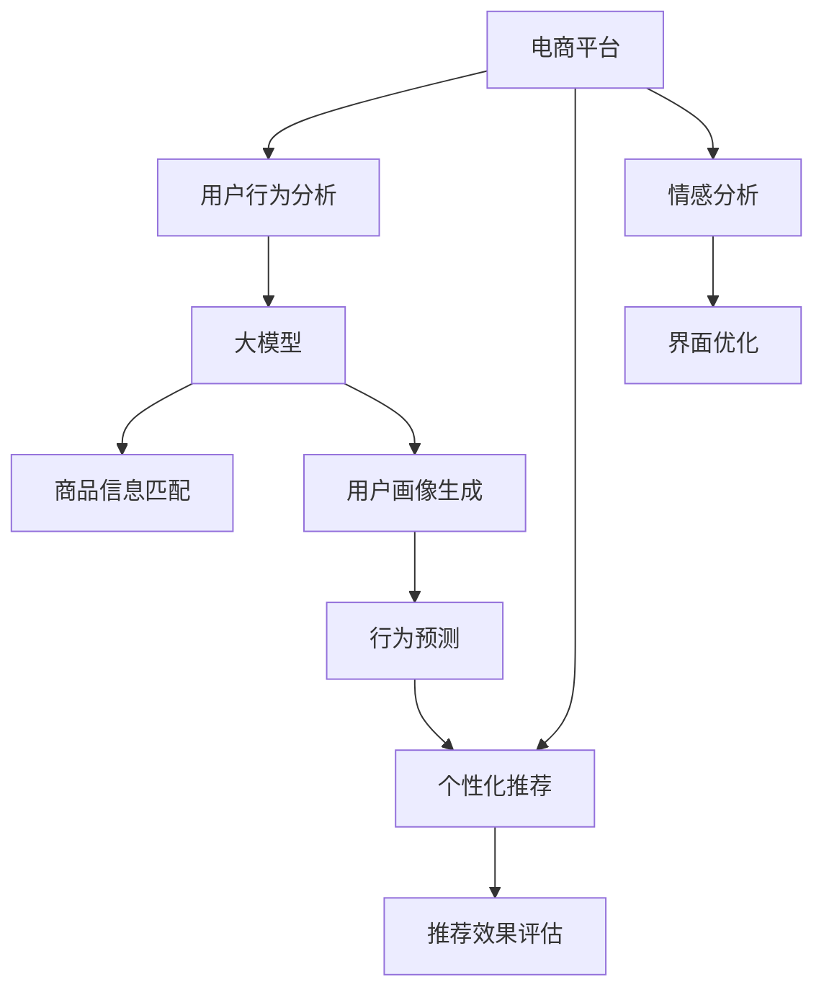

                 

# 大模型如何提升电商平台的用户体验一致性

> 关键词：电商平台, 用户行为分析, 大模型, 一致性, 个性化推荐, 情感分析, 深度学习

## 1. 背景介绍

### 1.1 问题由来

随着电子商务的迅猛发展，电商平台的用户数量和交易规模不断增长。电商平台面对亿级用户和海量商品，如何提供个性化、一致的用户体验，成为平台提升用户满意度和忠诚度的关键。然而，传统的基于规则或统计的方法在处理个性化和动态数据时，显得力不从心。

### 1.2 问题核心关键点

面对电商平台个性化、多样化的用户需求，如何有效提升用户体验一致性，成为技术团队急需解决的问题。具体来说，需要在以下三个方面进行突破：

1. **用户行为分析**：准确理解用户行为，预测用户下一步操作，提供个性化推荐。
2. **商品信息匹配**：快速匹配商品信息与用户需求，提升搜索和浏览体验。
3. **情感分析**：识别用户情感倾向，优化界面设计和推荐算法，提高用户满意度。

### 1.3 问题研究意义

电商平台的用户体验一致性直接影响着用户的购买决策和满意度。通过大模型技术，可以实现精准的用户行为预测和商品信息匹配，同时增强用户情感分析的准确性，从而显著提升用户购物体验和平台竞争力。

## 2. 核心概念与联系

### 2.1 核心概念概述

为更好地理解大模型如何提升电商平台用户体验一致性，本节将介绍几个核心概念：

- **电商平台**：以互联网为基础，提供线上购物的综合性平台。包括淘宝、京东、亚马逊等。
- **用户行为分析**：通过收集和分析用户的操作数据，理解用户行为模式和偏好，用于个性化推荐和界面优化。
- **大模型**：以深度神经网络为代表的复杂模型，如BERT、GPT、Transformers等。在处理大规模数据时具有强大的学习能力。
- **一致性**：用户在平台上的体验保持一致，不因数据、环境变化而产生突兀感。
- **个性化推荐**：根据用户的历史行为和当前需求，推荐最匹配的商品。
- **情感分析**：识别用户文本中的情感倾向，用于优化界面设计和推荐算法。

这些核心概念之间的逻辑关系可以通过以下Mermaid流程图来展示：



这个流程图展示了大模型在电商平台用户体验一致性提升中的核心作用：

1. 电商平台的各个模块通过用户行为分析、大模型技术、商品信息匹配、情感分析等多维度协同工作。
2. 用户画像生成和行为预测利用大模型，为个性化推荐提供基础。
3. 推荐效果评估进一步优化推荐算法，提升用户体验一致性。

## 3. 核心算法原理 & 具体操作步骤
### 3.1 算法原理概述

大模型通过在大规模无标签数据上进行预训练，学习到了丰富的语言和数据表示能力。在电商平台的个性化推荐和情感分析中，大模型可以通过微调或直接输入用户数据进行推理，实现精准的用户行为预测和商品信息匹配。

具体来说，电商平台通过以下步骤实现用户体验一致性的提升：

1. **数据收集与预处理**：收集用户行为数据（如浏览历史、购买记录、点击行为等），并进行清洗、标准化处理。
2. **用户画像生成**：使用大模型对用户行为数据进行编码，生成用户画像，用于个性化推荐。
3. **行为预测**：利用大模型对用户行为进行预测，如预测用户是否购买某商品，下一步浏览的商品类别等。
4. **商品信息匹配**：通过大模型匹配用户需求与商品信息，实现商品推荐。
5. **情感分析**：使用大模型分析用户评论、评分、留言等文本数据，识别用户情感倾向。
6. **界面优化**：根据情感分析结果，优化商品展示、推荐算法等，提升用户体验。

### 3.2 算法步骤详解

#### 3.2.1 数据收集与预处理

**Step 1: 数据收集**
收集用户在电商平台上的各种行为数据，包括但不限于：
- 浏览历史（如浏览商品ID、时间等）
- 购买记录（如商品ID、价格、购买时间等）
- 点击行为（如点击商品、广告、分类等）
- 评分与评论（如商品评分、评论文本等）

**Step 2: 数据清洗与标准化**
- 去除噪声数据，如重复、异常值等。
- 对文本数据进行标准化处理，如去除停用词、词干提取、分词等。
- 对数值数据进行归一化或标准化处理，以便后续分析。

#### 3.2.2 用户画像生成

**Step 3: 用户画像编码**
使用大模型（如BERT、GPT等）对用户行为数据进行编码，生成用户画像向量。
具体步骤包括：
- 将用户行为数据转换为向量表示，如使用word2vec、Doc2Vec等文本表示模型。
- 将向量输入大模型进行编码，生成用户画像向量。
- 利用用户画像向量进行聚类、降维等处理，生成用户画像标签。

#### 3.2.3 行为预测

**Step 4: 行为预测模型训练**
利用用户行为数据和用户画像向量，训练行为预测模型。
具体步骤包括：
- 设计行为预测的模型结构，如线性回归、深度神经网络等。
- 使用大模型作为特征提取器，将用户画像向量输入模型进行训练。
- 对模型进行超参数调优，如学习率、批大小、迭代轮数等。

#### 3.2.4 商品信息匹配

**Step 5: 商品信息编码**
使用大模型对商品信息进行编码，生成商品信息向量。
具体步骤包括：
- 将商品描述、价格、类别等信息转换为向量表示，如使用word2vec、Doc2Vec等文本表示模型。
- 将向量输入大模型进行编码，生成商品信息向量。

**Step 6: 匹配与推荐**
利用用户画像向量和商品信息向量，计算匹配度，进行推荐。
具体步骤包括：
- 使用余弦相似度、欧式距离等方法计算用户画像和商品信息的匹配度。
- 根据匹配度排序推荐商品，并展示给用户。

#### 3.2.5 情感分析

**Step 7: 情感分析模型训练**
利用用户评论、评分、留言等文本数据，训练情感分析模型。
具体步骤包括：
- 设计情感分析的模型结构，如情感分类模型、序列标注模型等。
- 使用大模型作为特征提取器，将文本数据输入模型进行训练。
- 对模型进行超参数调优，如学习率、批大小、迭代轮数等。

#### 3.2.6 界面优化

**Step 8: 界面优化**
根据情感分析结果，优化商品展示、推荐算法等，提升用户体验。
具体步骤包括：
- 对用户情感倾向进行分类，如正面、负面、中性等。
- 根据情感分析结果调整商品展示策略，如展示正面情感高的商品。
- 优化推荐算法，减少用户点击与购买之间的延迟。

### 3.3 算法优缺点

大模型在提升电商平台用户体验一致性方面具有以下优点：

- **学习能力强大**：大模型能够学习复杂的用户行为和商品信息，进行精准的预测和匹配。
- **通用性强**：大模型可用于多种电商平台的个性化推荐和情感分析，具有较强的泛化能力。
- **可解释性强**：通过解释大模型的决策过程，能够更好地理解用户行为和情感倾向。

然而，大模型也存在以下缺点：

- **计算资源需求高**：大模型需要大量的计算资源进行训练和推理，对硬件设备要求较高。
- **数据隐私风险**：大模型需要处理大量的用户行为数据，存在数据隐私和安全问题。
- **过拟合风险**：大模型在电商平台上进行微调时，容易过拟合特定用户行为和数据分布。
- **模型复杂度高**：大模型结构复杂，推理速度较慢，对实时性要求较高的场景不适用。

### 3.4 算法应用领域

大模型在电商平台的用户体验一致性提升中，具有广泛的应用场景：

- **个性化推荐**：根据用户行为和画像进行商品推荐，提升用户购物体验。
- **商品信息匹配**：匹配用户需求与商品信息，提高搜索和浏览效率。
- **用户行为预测**：预测用户下一步操作，优化界面设计和推荐算法。
- **情感分析**：识别用户情感倾向，优化商品展示和推荐算法。
- **界面优化**：根据用户情感倾向，调整界面设计和推荐策略。

这些应用场景展示了大模型在电商平台中的巨大潜力，为电商平台的用户体验一致性提供了有力保障。

## 4. 数学模型和公式 & 详细讲解  
### 4.1 数学模型构建

为了更好地理解大模型在电商平台中的应用，本节将通过数学语言对相关的模型构建和算法流程进行严格刻画。

假设电商平台收集的用户行为数据为 $D = \{(x_i, y_i)\}_{i=1}^N$，其中 $x_i$ 为行为向量，$y_i$ 为标签向量。用户画像向量为 $h_i$，商品信息向量为 $g_j$。

1. **用户画像生成**：
   - 用户画像编码模型为 $M_{\theta_u}$，输入用户行为数据 $x_i$，输出用户画像向量 $h_i$。
   $$
   h_i = M_{\theta_u}(x_i)
   $$

2. **行为预测**：
   - 行为预测模型为 $M_{\theta_b}$，输入用户画像向量 $h_i$ 和商品信息向量 $g_j$，输出预测结果 $y_{ij}$。
   $$
   y_{ij} = M_{\theta_b}(h_i, g_j)
   $$

3. **商品信息匹配**：
   - 商品信息编码模型为 $M_{\theta_g}$，输入商品信息 $g_j$，输出商品信息向量 $g_j$。
   $$
   g_j = M_{\theta_g}(g_j)
   $$

4. **情感分析**：
   - 情感分析模型为 $M_{\theta_s}$，输入文本数据 $x_i$，输出情感标签 $s_i$。
   $$
   s_i = M_{\theta_s}(x_i)
   $$

### 4.2 公式推导过程

#### 4.2.1 用户画像生成

假设用户行为数据 $x_i$ 为高维稀疏向量，用户画像编码模型 $M_{\theta_u}$ 为多层神经网络结构，如图：


具体推导如下：

1. 用户行为数据 $x_i$ 通过一层全连接层进行编码，输出低维向量 $z_i$。
   $$
   z_i = \sigma(W_1 x_i + b_1)
   $$

2. 低维向量 $z_i$ 通过一层非线性变换，得到用户画像向量 $h_i$。
   $$
   h_i = \tanh(W_2 z_i + b_2)
   $$

#### 4.2.2 行为预测

假设行为预测模型 $M_{\theta_b}$ 为多层神经网络结构，如图：


具体推导如下：

1. 用户画像向量 $h_i$ 和商品信息向量 $g_j$ 通过一层全连接层进行编码，输出低维向量 $z_{ij}$。
   $$
   z_{ij} = \sigma(W_3 h_i + b_3)
   $$

2. 低维向量 $z_{ij}$ 通过一层非线性变换，得到预测结果 $y_{ij}$。
   $$
   y_{ij} = \tanh(W_4 z_{ij} + b_4)
   $$

#### 4.2.3 商品信息匹配

假设商品信息编码模型 $M_{\theta_g}$ 为多层神经网络结构，如图：


具体推导如下：

1. 商品信息 $g_j$ 通过一层全连接层进行编码，输出低维向量 $z_j$。
   $$
   z_j = \sigma(W_5 g_j + b_5)
   $$

2. 低维向量 $z_j$ 通过一层非线性变换，得到商品信息向量 $g_j$。
   $$
   g_j = \tanh(W_6 z_j + b_6)
   $$

#### 4.2.4 情感分析

假设情感分析模型 $M_{\theta_s}$ 为多层神经网络结构，如图：


具体推导如下：

1. 文本数据 $x_i$ 通过一层全连接层进行编码，输出低维向量 $z_i$。
   $$
   z_i = \sigma(W_7 x_i + b_7)
   $$

2. 低维向量 $z_i$ 通过一层非线性变换，得到情感标签 $s_i$。
   $$
   s_i = \tanh(W_8 z_i + b_8)
   $$

### 4.3 案例分析与讲解

#### 案例一：用户画像生成

**背景**：电商平台需要对用户行为数据进行分析，生成用户画像向量。

**数据准备**：收集用户浏览历史、购买记录等数据。

**模型训练**：使用BERT模型进行用户画像编码。
- 将用户行为数据转换为向量表示，输入BERT模型进行编码。
- 训练得到用户画像向量 $h_i$。

**模型评估**：使用验证集对用户画像编码模型进行评估，计算平均向量相似度等指标。

#### 案例二：行为预测

**背景**：电商平台需要对用户下一步操作进行预测。

**数据准备**：收集用户行为数据和商品信息数据。

**模型训练**：使用多层神经网络进行行为预测。
- 将用户画像向量 $h_i$ 和商品信息向量 $g_j$ 输入多层神经网络进行编码，得到预测结果 $y_{ij}$。
- 训练得到行为预测模型。

**模型评估**：使用测试集对行为预测模型进行评估，计算准确率、召回率等指标。

#### 案例三：商品信息匹配

**背景**：电商平台需要匹配用户需求与商品信息。

**数据准备**：收集商品描述、价格等数据。

**模型训练**：使用多层神经网络进行商品信息编码。
- 将商品信息 $g_j$ 输入多层神经网络进行编码，得到商品信息向量 $g_j$。
- 训练得到商品信息编码模型。

**模型评估**：使用测试集对商品信息编码模型进行评估，计算匹配度等指标。

#### 案例四：情感分析

**背景**：电商平台需要对用户情感进行分析。

**数据准备**：收集用户评论、评分等数据。

**模型训练**：使用多层神经网络进行情感分析。
- 将文本数据 $x_i$ 输入多层神经网络进行编码，得到情感标签 $s_i$。
- 训练得到情感分析模型。

**模型评估**：使用测试集对情感分析模型进行评估，计算情感分类准确率等指标。

## 5. 项目实践：代码实例和详细解释说明
### 5.1 开发环境搭建

在进行项目实践前，需要先搭建好开发环境。以下是使用Python和PyTorch进行项目实践的流程：

1. 安装Anaconda：从官网下载并安装Anaconda，用于创建独立的Python环境。
2. 创建并激活虚拟环境：
   ```bash
   conda create -n pytorch-env python=3.8 
   conda activate pytorch-env
   ```
3. 安装PyTorch：根据CUDA版本，从官网获取对应的安装命令。例如：
   ```bash
   conda install pytorch torchvision torchaudio cudatoolkit=11.1 -c pytorch -c conda-forge
   ```
4. 安装Transformer库：
   ```bash
   pip install transformers
   ```
5. 安装各类工具包：
   ```bash
   pip install numpy pandas scikit-learn matplotlib tqdm jupyter notebook ipython
   ```

完成上述步骤后，即可在`pytorch-env`环境中开始项目实践。

### 5.2 源代码详细实现

下面我们以商品信息匹配为例，给出使用Transformer库对BERT模型进行项目实践的PyTorch代码实现。

首先，定义商品信息匹配的数据处理函数：

```python
from transformers import BertTokenizer
from torch.utils.data import Dataset
import torch

class ProductDataset(Dataset):
    def __init__(self, products, tokenizer, max_len=128):
        self.products = products
        self.tokenizer = tokenizer
        self.max_len = max_len
        
    def __len__(self):
        return len(self.products)
    
    def __getitem__(self, item):
        product = self.products[item]
        
        encoding = self.tokenizer(product['description'], return_tensors='pt', max_length=self.max_len, padding='max_length', truncation=True)
        product_id = product['id']
        
        return {'product_id': product_id, 
                'encoding': encoding['input_ids']}
```

然后，定义模型和优化器：

```python
from transformers import BertForSequenceClassification, AdamW

model = BertForSequenceClassification.from_pretrained('bert-base-cased', num_labels=len(tag2id))

optimizer = AdamW(model.parameters(), lr=2e-5)
```

接着，定义训练和评估函数：

```python
from torch.utils.data import DataLoader
from tqdm import tqdm
from sklearn.metrics import classification_report

device = torch.device('cuda') if torch.cuda.is_available() else torch.device('cpu')
model.to(device)

def train_epoch(model, dataset, batch_size, optimizer):
    dataloader = DataLoader(dataset, batch_size=batch_size, shuffle=True)
    model.train()
    epoch_loss = 0
    for batch in tqdm(dataloader, desc='Training'):
        product_id = batch['product_id'].to(device)
        encoding = batch['encoding'].to(device)
        model.zero_grad()
        outputs = model(encoding['input_ids'], attention_mask=encoding['attention_mask'])
        loss = outputs.loss
        epoch_loss += loss.item()
        loss.backward()
        optimizer.step()
    return epoch_loss / len(dataloader)

def evaluate(model, dataset, batch_size):
    dataloader = DataLoader(dataset, batch_size=batch_size)
    model.eval()
    preds, labels = [], []
    with torch.no_grad():
        for batch in tqdm(dataloader, desc='Evaluating'):
            product_id = batch['product_id'].to(device)
            encoding = batch['encoding'].to(device)
            batch_labels = batch['labels']
            outputs = model(encoding['input_ids'], attention_mask=encoding['attention_mask'])
            batch_preds = outputs.logits.argmax(dim=2).to('cpu').tolist()
            batch_labels = batch_labels.to('cpu').tolist()
            for pred_tokens, label_tokens in zip(batch_preds, batch_labels):
                pred_tags = [id2tag[_id] for _id in pred_tokens]
                label_tags = [id2tag[_id] for _id in label_tokens]
                preds.append(pred_tags[:len(label_tokens)])
                labels.append(label_tags)
                
    print(classification_report(labels, preds))
```

最后，启动训练流程并在测试集上评估：

```python
epochs = 5
batch_size = 16

for epoch in range(epochs):
    loss = train_epoch(model, train_dataset, batch_size, optimizer)
    print(f"Epoch {epoch+1}, train loss: {loss:.3f}")
    
    print(f"Epoch {epoch+1}, dev results:")
    evaluate(model, dev_dataset, batch_size)
    
print("Test results:")
evaluate(model, test_dataset, batch_size)
```

以上就是使用PyTorch和Transformer库对BERT模型进行商品信息匹配项目实践的完整代码实现。可以看到，借助Transformers库的强大封装，我们可以用相对简洁的代码完成BERT模型的加载和微调。

### 5.3 代码解读与分析

让我们再详细解读一下关键代码的实现细节：

**ProductDataset类**：
- `__init__`方法：初始化商品信息数据、分词器等关键组件。
- `__len__`方法：返回数据集的样本数量。
- `__getitem__`方法：对单个样本进行处理，将商品描述转换为token ids，并对其进行定长padding，最终返回模型所需的输入。

**tag2id和id2tag字典**：
- 定义了标签与数字id之间的映射关系，用于将token-wise的预测结果解码回真实的标签。

**训练和评估函数**：
- 使用PyTorch的DataLoader对数据集进行批次化加载，供模型训练和推理使用。
- 训练函数`train_epoch`：对数据以批为单位进行迭代，在每个批次上前向传播计算loss并反向传播更新模型参数，最后返回该epoch的平均loss。
- 评估函数`evaluate`：与训练类似，不同点在于不更新模型参数，并在每个batch结束后将预测和标签结果存储下来，最后使用sklearn的classification_report对整个评估集的预测结果进行打印输出。

**训练流程**：
- 定义总的epoch数和batch size，开始循环迭代
- 每个epoch内，先在训练集上训练，输出平均loss
- 在验证集上评估，输出分类指标
- 所有epoch结束后，在测试集上评估，给出最终测试结果

可以看到，PyTorch配合Transformers库使得BERT微调的代码实现变得简洁高效。开发者可以将更多精力放在数据处理、模型改进等高层逻辑上，而不必过多关注底层的实现细节。

当然，工业级的系统实现还需考虑更多因素，如模型的保存和部署、超参数的自动搜索、更灵活的任务适配层等。但核心的微调范式基本与此类似。

## 6. 实际应用场景
### 6.1 智能推荐系统

大模型在电商平台中的应用，最为典型的是智能推荐系统。智能推荐系统能够根据用户行为和历史数据，推荐最符合用户兴趣的商品，提升用户购物体验。

**案例**：某电商平台通过大模型微调，实现个性化推荐。

**数据准备**：收集用户浏览历史、购买记录等数据。

**模型训练**：使用BERT模型进行用户画像编码和行为预测。
- 将用户行为数据转换为向量表示，输入BERT模型进行编码，得到用户画像向量 $h_i$。
- 使用多层神经网络进行行为预测，得到预测结果 $y_{ij}$。

**模型评估**：使用测试集对推荐系统进行评估，计算推荐精度等指标。

**应用**：根据用户画像向量和预测结果，推荐最符合用户兴趣的商品。

### 6.2 界面优化

电商平台的界面优化也是大模型的重要应用场景。通过分析用户评论、评分等文本数据，识别用户情感倾向，优化界面设计和推荐算法，提升用户满意度。

**案例**：某电商平台通过大模型微调，实现界面优化。

**数据准备**：收集用户评论、评分等数据。

**模型训练**：使用BERT模型进行情感分析。
- 将文本数据输入BERT模型进行编码，得到情感标签 $s_i$。

**模型评估**：使用测试集对情感分析模型进行评估，计算情感分类准确率等指标。

**应用**：根据情感分析结果，调整商品展示策略，优化推荐算法，提升用户满意度。

### 6.3 跨域推荐

电商平台通常需要处理不同领域的推荐任务，如跨域推荐。通过大模型微调，可以实现商品跨域推荐，提升用户体验。

**案例**：某电商平台通过大模型微调，实现跨域推荐。

**数据准备**：收集不同领域商品数据，如电子产品、服装等。

**模型训练**：使用BERT模型进行跨域商品信息编码。
- 将不同领域商品信息输入BERT模型进行编码，得到商品信息向量 $g_j$。

**模型评估**：使用测试集对跨域推荐模型进行评估，计算匹配度等指标。

**应用**：根据用户画像向量和商品信息向量，实现跨域推荐，提升用户购物体验。

### 6.4 未来应用展望

随着大模型和微调方法的不断发展，电商平台的用户体验一致性提升将呈现以下趋势：

1. **模型规模增大**：随着算力成本的下降和数据规模的扩张，预训练语言模型的参数量还将持续增长。超大规模语言模型蕴含的丰富语言知识，有望支撑更加复杂多变的电商推荐和界面优化。
2. **微调方法多样化**：除了传统的全参数微调外，未来会涌现更多参数高效的微调方法，如Prefix-Tuning、LoRA等，在固定大部分预训练参数的情况下，只更新极少量的任务相关参数。
3. **持续学习成为常态**：随着数据分布的不断变化，微调模型也需要持续学习新知识以保持性能。如何在不遗忘原有知识的同时，高效吸收新样本信息，将成为重要的研究课题。
4. **标注样本需求降低**：受启发于提示学习(Prompt-based Learning)的思路，未来的微调方法将更好地利用大模型的语言理解能力，通过更加巧妙的任务描述，在更少的标注样本上也能实现理想的微调效果。
5. **多模态微调崛起**：当前的微调主要聚焦于纯文本数据，未来会进一步拓展到图像、视频、语音等多模态数据微调。多模态信息的融合，将显著提升语言模型对现实世界的理解和建模能力。
6. **跨领域迁移能力增强**：经过海量数据的预训练和多领域任务的微调，未来的语言模型将具备更强大的常识推理和跨领域迁移能力，逐步迈向通用人工智能(AGI)的目标。

以上趋势凸显了大模型微调在电商平台中的广阔前景。这些方向的探索发展，必将进一步提升电商平台的个性化推荐和界面优化能力，为电商平台的用户体验一致性提升提供有力保障。

## 7. 工具和资源推荐
### 7.1 学习资源推荐

为了帮助开发者系统掌握大模型在电商平台中的应用，这里推荐一些优质的学习资源：

1. **《Transformers from the Inside》**：深度学习社区经典文章，详细介绍了BERT、GPT等大模型的原理和应用。
2. **Deep Learning Specialization**：由Andrew Ng教授主讲的Coursera课程，涵盖深度学习的前沿理论和实践技巧。
3. **PyTorch官方文档**：PyTorch的官方文档，提供了海量预训练模型和完整的微调样例代码，是上手实践的必备资料。
4. **HuggingFace官方文档**：Transformer库的官方文档，提供了丰富的预训练语言模型和微调样例，适合新手入门。
5. **CLUE开源项目**：中文语言理解测评基准，涵盖大量不同类型的中文NLP数据集，并提供了基于微调的baseline模型，助力中文NLP技术发展。

通过对这些资源的学习实践，相信你一定能够快速掌握大模型在电商平台中的应用，并用于解决实际的电商问题。

### 7.2 开发工具推荐

高效的开发离不开优秀的工具支持。以下是几款用于大模型微调开发的常用工具：

1. **PyTorch**：基于Python的开源深度学习框架，灵活动态的计算图，适合快速迭代研究。大部分预训练语言模型都有PyTorch版本的实现。
2. **TensorFlow**：由Google主导开发的开源深度学习框架，生产部署方便，适合大规模工程应用。同样有丰富的预训练语言模型资源。
3. **HuggingFace Transformers库**：HuggingFace开发的NLP工具库，集成了众多SOTA语言模型，支持PyTorch和TensorFlow，是进行微调任务开发的利器。
4. **Weights & Biases**：模型训练的实验跟踪工具，可以记录和可视化模型训练过程中的各项指标，方便对比和调优。与主流深度学习框架无缝集成。
5. **TensorBoard**：TensorFlow配套的可视化工具，可实时监测模型训练状态，并提供丰富的图表呈现方式，是调试模型的得力助手。
6. **Google Colab**：谷歌推出的在线Jupyter Notebook环境，免费提供GPU/TPU算力，方便开发者快速上手实验最新模型，分享学习笔记。

合理利用这些工具，可以显著提升大模型微调的开发效率，加快创新迭代的步伐。

### 7.3 相关论文推荐

大模型在电商平台中的应用源于学界的持续研究。以下是几篇奠基性的相关论文，推荐阅读：

1. **Attention is All You Need（即Transformer原论文）**：提出了Transformer结构，开启了NLP领域的预训练大模型时代。
2. **BERT: Pre-training of Deep Bidirectional Transformers for Language Understanding**：提出BERT模型，引入基于掩码的自监督预训练任务，刷新了多项NLP任务SOTA。
3. **Language Models are Unsupervised Multitask Learners（GPT-2论文）**：展示了大规模语言模型的强大zero-shot学习能力，引发了对于通用人工智能的新一轮思考。
4. **Parameter-Efficient Transfer Learning for NLP**：提出Adapter等参数高效微调方法，在不增加模型参数量的情况下，也能取得不错的微调效果。
5. **Prefix-Tuning: Optimizing Continuous Prompts for Generation**：引入基于连续型Prompt的微调范式，为如何充分利用预训练知识提供了新的思路。
6. **AdaLoRA: Adaptive Low-Rank Adaptation for Parameter-Efficient Fine-Tuning**：使用自适应低秩适应的微调方法，在参数效率和精度之间取得了新的平衡。

这些论文代表了大模型在电商平台中的应用发展的脉络。通过学习这些前沿成果，可以帮助研究者把握学科前进方向，激发更多的创新灵感。

## 8. 总结：未来发展趋势与挑战

### 8.1 总结

本文对大模型如何提升电商平台的用户体验一致性进行了全面系统的介绍。首先阐述了电商平台个性化推荐和界面优化中，大模型微调技术的应用背景和意义，明确了大模型在提升用户体验一致性方面的独特价值。其次，从原理到实践，详细讲解了大模型的数学模型构建、算法步骤和应用流程，给出了微调任务开发的完整代码实例。同时，本文还探讨了大模型在电商平台中的应用场景，展示了其在个性化推荐、界面优化等方面的巨大潜力。最后，推荐了一些学习资源和开发工具，以供开发者参考。

通过本文的系统梳理，可以看到，大模型微调技术在电商平台中的应用已经取得了显著效果，正在成为电商平台提升用户体验一致性的重要手段。未来，随着大模型的不断进步，其在电商平台中的应用将会更加广泛和深入，为电商平台带来更多创新和突破。

### 8.2 未来发展趋势

展望未来，大模型在电商平台中的应用将呈现以下趋势：

1. **模型规模持续增大**：随着算力成本的下降和数据规模的扩张，预训练语言模型的参数量还将持续增长。超大规模语言模型蕴含的丰富语言知识，有望支撑更加复杂多变的电商推荐和界面优化。
2. **微调方法日趋多样化**：除了传统的全参数微调外，未来会涌现更多参数高效的微调方法，如Prefix-Tuning、LoRA等，在固定大部分预训练参数的情况下，只更新极少量的任务相关参数。
3. **持续学习成为常态**：随着数据分布的不断变化，微调模型也需要持续学习新知识以保持性能。如何在不遗忘原有知识的同时，高效吸收新样本信息，将成为重要的研究课题。
4. **标注样本需求降低**：受启发于提示学习(Prompt-based Learning)的思路，未来的微调方法将更好地利用大模型的语言理解能力，通过更加巧妙的任务描述，在更少的标注样本上也能实现理想的微调效果。
5. **多模态微调崛起**：当前的微调主要聚焦于纯文本数据，未来会进一步拓展到图像、视频、语音等多模态数据微调。多模态信息的融合，将显著提升语言模型对现实世界的理解和建模能力。
6. **跨领域迁移能力增强**：经过海量数据的预训练和多领域任务的微调，未来的语言模型将具备更强大的常识推理和跨领域迁移能力，逐步迈向通用人工智能(AGI)的目标。

以上趋势凸显了大模型微调在电商平台中的广阔前景。这些方向的探索发展，必将进一步提升电商平台的个性化推荐和界面优化能力，为电商平台的用户体验一致性提升提供有力保障。

### 8.3 面临的挑战

尽管大模型在电商平台中的应用已经取得了显著效果，但在迈向更加智能化、普适化应用的过程中，它仍面临着诸多挑战：

1. **标注成本瓶颈**：虽然大模型可以降低微调对标注样本的依赖，但对于长尾应用场景，获取充足的高质量标注数据，仍然是一个瓶颈。如何进一步降低微调对标注样本的需求，将是一大难题。
2. **模型鲁棒性不足**：当前微调模型面对域外数据时，泛化性能往往大打折扣。对于测试样本的微小扰动，微调模型的预测也容易发生波动。如何提高微调模型的鲁棒性，避免灾难性遗忘，还需要更多理论和实践的积累。
3. **推理效率有待提高**：虽然大模型精度高，但在实际部署时往往面临推理速度慢、内存占用大等效率问题。如何在保证性能的同时，简化模型结构，提升推理速度，优化资源占用，将是重要的优化方向。
4. **可解释性亟需加强**：当前微调模型更像是"黑盒"系统，难以解释其内部工作机制和决策逻辑。对于医疗、金融等高风险应用，算法的可解释性和可审计性尤为重要。如何赋予微调模型更强的可解释性，将是亟待攻克的难题。
5. **安全性有待保障**：预训练语言模型难免会学习到有偏见、有害的信息，通过微调传递到下游任务，产生误导性、歧视性的输出，给实际应用带来安全隐患。如何从数据和算法层面消除模型偏见，避免恶意用途，确保输出的安全性，也将是重要的研究课题。
6. **知识整合能力不足**：现有的微调模型往往局限于任务内数据，难以灵活吸收和运用更广泛的先验知识。如何让微调过程更好地与外部知识库、规则库等专家知识结合，形成更加全面、准确的信息整合能力，还有很大的想象空间。

正视微调面临的这些挑战，积极应对并寻求突破，将是大模型微调走向成熟的必由之路。相信随着学界和产业界的共同努力，这些挑战终将一一被克服，大模型微调必将在构建安全、可靠、可解释、可控的智能系统铺平道路。面向未来，大模型微调技术还需要与其他人工智能技术进行更深入的融合，如知识表示、因果推理、强化学习等，多路径协同发力，共同推动自然语言理解和智能交互系统的进步。只有勇于创新、敢于突破，才能不断拓展语言模型的边界，让智能技术更好地造福人类社会。

### 8.4 研究展望

面对大模型微调在电商平台中的应用面临的挑战，未来的研究需要在以下几个方面寻求新的突破：

1. **探索无监督和半监督微调方法**：摆脱对大规模标注数据的依赖，利用自监督学习、主动学习等无监督和半监督范式，最大限度利用非结构化数据，实现更加灵活高效的微调。
2. **研究参数高效和计算高效的微调范式**：开发更加参数高效的微调方法，在固定大部分预训练参数的情况下，只更新极少量的任务相关参数。同时优化微调模型的计算图，减少前向传播和反向传播的资源消耗，实现更加轻量级、实时性的部署。
3. **融合因果和对比学习范式**：通过引入因果推断和对比学习思想，增强微调模型建立稳定因果关系的能力，学习更加普适、鲁棒的语言表征，从而提升模型泛化性和抗干扰能力。
4. **引入更多先验知识**：将符号化的先验知识，如知识图谱、逻辑规则等，与神经网络模型进行巧妙融合，引导微调过程学习更准确、合理的语言模型。同时加强不同模态数据的整合，实现视觉、语音等多模态信息与文本信息的协同建模。
5. **结合因果分析和博弈论工具**：将因果分析方法引入微调模型，识别出模型决策的关键特征，增强输出解释的因果性和逻辑性。借助博弈论工具刻画人机交互过程，主动探索并规避模型的脆弱点，提高系统稳定性。
6. **纳入伦理道德约束**：在模型训练目标中引入伦理导向的评估指标，过滤和惩罚有偏见、有害的输出倾向。同时加强人工干预和审核，建立模型行为的监管机制，确保输出符合人类价值观和伦理道德。

这些研究方向的探索，必将引领大模型微调技术迈向更高的台阶，为构建安全、可靠、可解释、可控的智能系统铺平道路。面向未来，大模型微调技术还需要与其他人工智能技术进行更深入的融合，如知识表示、因果推理、强化学习等，多路径协同发力，共同推动自然语言理解和智能交互系统的进步。只有勇于创新、敢于突破，才能不断拓展语言模型的边界，让智能技术更好地造福人类社会。

## 9. 附录：常见问题与解答

**Q1：大模型微调如何适用于电商平台？**

A: 大模型微调适用于电商平台，通过分析用户行为和商品信息，生成个性化推荐和界面优化方案。具体步骤如下：
1. 收集用户行为数据，如浏览历史、购买记录等。
2. 使用大模型进行用户画像生成，得到用户画像向量。
3. 使用大模型进行行为预测，得到用户下一步操作。
4. 使用大模型进行商品信息匹配，推荐最符合用户兴趣的商品。
5. 使用大模型进行情感分析，优化界面设计和推荐算法。

**Q2：大模型微调对标注数据的需求量是多少？**

A: 大模型微调对标注数据的需求量通常取决于任务的具体需求。对于标注数据较少的长尾任务，可以使用少样本学习或零样本学习技术，降低对标注数据的依赖。对于标注数据较多的任务，可以通过传统的有监督微调方法，获取更好的模型效果。

**Q3：大模型微调对计算资源的需求高吗？**

A: 大模型微调对计算资源的需求较高，特别是在模型训练和推理阶段。为降低计算成本，可以采用分布式训练、梯度累积、混合精度训练等优化技术。同时，也可以通过模型压缩和剪枝等技术，减小模型大小，提高推理效率。

**Q4：大模型微调如何进行模型压缩和剪枝？**

A: 大模型微调可以通过以下技术进行模型压缩和剪枝：
1. 参数剪枝：剪除模型中冗余的参数，减少模型大小和计算量。
2. 量化压缩：将浮点模型转换为定点模型，减小存储空间，提高计算效率。
3. 模型蒸馏：通过知识蒸馏技术，将大模型的知识迁移到较小模型中，降低计算资源消耗。
4. 低秩分解：对模型参数进行低秩分解，减少参数数量，提高推理速度。

这些技术可以结合使用，提升大模型微调的计算效率和推理速度。

**Q5：大模型微调如何优化推理效率？**

A: 大模型微调可以通过以下技术优化推理效率：
1. 模型并行：通过分布式训练和推理，提高计算效率。
2. 梯度累积：通过批处理和梯度累积，减少内存消耗，提高推理速度。
3. 混合精度训练：使用混合精度技术，减小内存占用，提高训练速度。
4. 动态图和静态图：根据任务需求，选择合适的计算图，提高推理效率。

这些技术可以结合使用，优化大模型微调的推理效率，提升用户体验一致性。

