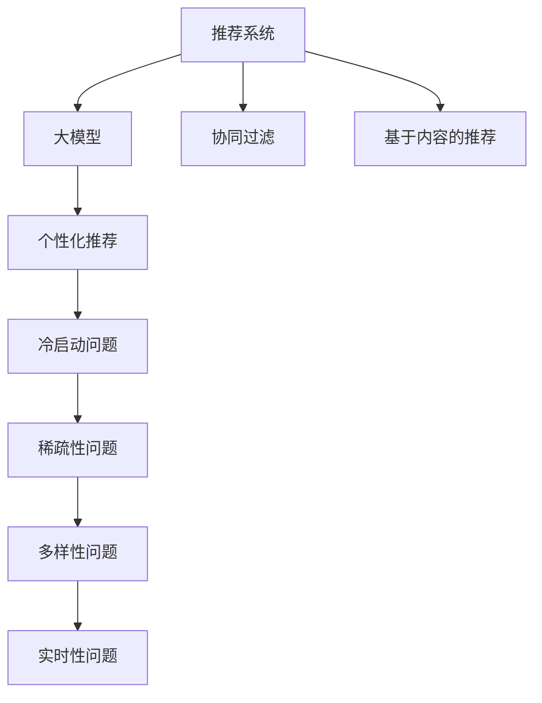

                 

## 1. 背景介绍

随着互联网的发展和数据的积累，推荐系统在各大电商平台上扮演着越来越重要的角色。通过推荐系统，用户可以高效地发现和利用海量的商品信息，提升购物体验，而商家也可以精准定位潜在客户，提升销售效率。传统的推荐系统主要基于用户行为数据，如浏览、点击、购买记录等，对用户进行标签化，然后通过协同过滤、基于内容的推荐等方法，预测用户的兴趣，推荐相关商品。

尽管如此，传统的推荐系统也面临着一系列挑战：

- **稀疏性问题**：用户行为数据往往非常稀疏，导致推荐系统难以捕捉到用户的真实兴趣。
- **冷启动问题**：对于新用户或新商品，缺乏足够的历史数据，难以进行推荐。
- **多样性问题**：推荐系统容易陷入局部最优，只推荐与用户历史行为相似的商品，无法提供多样性的推荐。
- **实时性问题**：推荐系统需要实时处理用户行为数据，进行推荐，对算力要求较高。

为了应对这些挑战，基于大模型的推荐系统应运而生。大模型利用大规模语料和先进的深度学习技术，能够更好地理解和刻画用户需求，提供更加个性化、多样性的商品推荐。本文将详细介绍大模型在推荐系统中的应用，包括原理、技术、实践和未来展望。

## 2. 核心概念与联系

### 2.1 核心概念概述

为更好地理解基于大模型的推荐系统，本节将介绍几个密切相关的核心概念：

- **推荐系统**：通过分析用户行为数据和商品属性，预测用户兴趣，推荐相关商品的系统。
- **大模型**：以深度神经网络为代表的预训练语言模型，如BERT、GPT等。大模型在大量无标签数据上进行预训练，学习到丰富的语言表示和知识，能够处理复杂的自然语言处理任务。
- **个性化推荐**：根据用户的历史行为和当前需求，推荐符合用户兴趣的商品。个性化推荐需要了解用户的深层兴趣，并能够动态适应用户的变化。
- **协同过滤**：利用用户行为数据，通过相似度计算，发现相似用户和商品，推荐相关商品。协同过滤算法包括基于用户的协同过滤和基于物品的协同过滤。
- **基于内容的推荐**：通过商品的属性特征，对商品进行编码，预测用户对这些商品感兴趣的程度，进行推荐。基于内容的推荐需要提取商品的显式特征。
- **冷启动问题**：对于新用户或新商品，缺乏足够的历史数据，难以进行推荐。冷启动问题是推荐系统面临的重要挑战之一。

这些核心概念之间的逻辑关系可以通过以下Mermaid流程图来展示：



这个流程图展示了大模型在推荐系统中的核心概念及其之间的关系：

1. 推荐系统通过协同过滤和基于内容的推荐方式，进行初步推荐。
2. 大模型作为推荐系统的一部分，在已有的推荐基础上，进一步提升个性化推荐的精准度。
3. 大模型可以处理冷启动问题，解决新用户或新商品推荐难的问题。
4. 大模型可以增强推荐的稀疏性、多样性和实时性，提升推荐效果。

## 3. 核心算法原理 & 具体操作步骤

### 3.1 算法原理概述

基于大模型的个性化推荐系统，核心思想是通过大模型学习用户的历史行为和上下文语境，从而对用户的当前需求进行预测，推荐符合用户兴趣的商品。其核心算法原理主要包括以下几个步骤：

1. **预训练**：在大规模无标签数据上进行预训练，学习丰富的语言表示和知识。
2. **微调**：在已有的推荐基础上，使用少量标注数据，对大模型进行微调，提升个性化推荐的效果。
3. **交互**：在用户进行交互的过程中，使用大模型对用户的实时需求进行预测，动态调整推荐结果。

### 3.2 算法步骤详解

基于大模型的个性化推荐系统主要包括以下几个关键步骤：

**Step 1: 准备预训练模型和数据集**
- 选择合适的预训练语言模型 $M_{\theta}$ 作为初始化参数，如 BERT、GPT等。
- 准备推荐系统的用户行为数据集 $D=\{(u_i, b_i)\}_{i=1}^N$，其中 $u_i$ 为用户的唯一标识符，$b_i$ 为用户的点击记录、浏览记录等行为数据。

**Step 2: 添加任务适配层**
- 根据推荐任务的类型，在预训练模型顶层设计合适的输出层和损失函数。
- 对于推荐任务，通常使用输出层输出商品的评分，并以均方误差损失函数进行训练。

**Step 3: 设置微调超参数**
- 选择合适的优化算法及其参数，如 AdamW、SGD 等，设置学习率、批大小、迭代轮数等。
- 设置正则化技术及强度，包括权重衰减、Dropout、Early Stopping等。
- 确定冻结预训练参数的策略，如仅微调顶层，或全部参数都参与微调。

**Step 4: 执行梯度训练**
- 将训练集数据分批次输入模型，前向传播计算损失函数。
- 反向传播计算参数梯度，根据设定的优化算法和学习率更新模型参数。
- 周期性在验证集上评估模型性能，根据性能指标决定是否触发 Early Stopping。
- 重复上述步骤直到满足预设的迭代轮数或 Early Stopping 条件。

**Step 5: 测试和部署**
- 在测试集上评估微调后模型 $M_{\hat{\theta}}$ 的性能，对比微调前后的精度提升。
- 使用微调后的模型对新商品进行评分预测，集成到实际的应用系统中。
- 持续收集新的用户行为数据，定期重新微调模型，以适应数据分布的变化。

以上是基于大模型的个性化推荐系统的一般流程。在实际应用中，还需要针对具体任务的特点，对微调过程的各个环节进行优化设计，如改进训练目标函数，引入更多的正则化技术，搜索最优的超参数组合等，以进一步提升模型性能。

### 3.3 算法优缺点

基于大模型的个性化推荐系统具有以下优点：
1. 能处理稀疏数据和冷启动问题。大模型通过语义理解，能够从少量用户行为数据中，提取出用户的深层兴趣和上下文信息。
2. 具备自适应能力。大模型在微调过程中，能够动态适应用户需求的变化，提供更加个性化、多样性的推荐。
3. 效果显著。在多个实际应用中，基于大模型的推荐系统已经刷新了推荐效果。
4. 可解释性强。大模型能够提供推荐结果的解释，帮助用户理解推荐的依据。

同时，该方法也存在一定的局限性：
1. 依赖大模型和数据。大模型需要大规模的语料和计算资源进行预训练和微调，且对数据质量要求较高。
2. 计算资源消耗较大。大模型的推理计算量较大，对系统算力有较高要求。
3. 泛化能力受限。大模型对于特定领域的推荐效果可能不如专业的领域模型。

尽管存在这些局限性，但就目前而言，基于大模型的推荐系统仍然是推荐系统研究的重要范式。未来相关研究的重点在于如何进一步降低计算资源消耗，提高模型的泛化能力和自适应性，同时兼顾可解释性和伦理安全性等因素。

### 3.4 算法应用领域

基于大模型的个性化推荐系统已经在多个领域得到应用，例如：

- **电商推荐**：在电商平台上，推荐系统可以根据用户的浏览、点击、购买记录，推荐符合用户兴趣的商品。
- **音乐推荐**：音乐平台可以推荐用户可能喜欢的歌曲和歌单，提高用户的使用体验。
- **视频推荐**：视频平台可以推荐用户可能感兴趣的视频内容，增加用户黏性。
- **新闻推荐**：新闻应用可以推荐用户可能感兴趣的新闻内容，提高用户停留时间。

除了上述这些经典应用外，大模型在更多场景中也有着广泛的应用，如智能搜索、智能广告、智能教育等，为信息服务领域带来了新的突破。随着大模型和推荐方法的不断进步，相信基于大模型的推荐系统将在更广阔的应用领域中发挥更大的作用。

## 4. 数学模型和公式 & 详细讲解  
### 4.1 数学模型构建

本节将使用数学语言对基于大模型的推荐系统进行更加严格的刻画。

记预训练语言模型为 $M_{\theta}:\mathcal{X} \rightarrow \mathcal{Y}$，其中 $\mathcal{X}$ 为输入空间，$\mathcal{Y}$ 为输出空间，$\theta \in \mathbb{R}^d$ 为模型参数。假设推荐系统的用户行为数据集为 $D=\{(u_i, b_i)\}_{i=1}^N$，其中 $u_i$ 为用户的唯一标识符，$b_i$ 为用户的点击记录、浏览记录等行为数据。

定义模型 $M_{\theta}$ 在用户行为数据 $b$ 上的损失函数为 $\ell(M_{\theta}(b),\mathbf{c})$，其中 $\mathbf{c}=\{c_{ij}\}$ 为用户的点击记录，$c_{ij}=1$ 表示用户 $u_i$ 对商品 $b_j$ 进行过点击，$c_{ij}=0$ 表示用户 $u_i$ 未对商品 $b_j$ 进行过点击。则在数据集 $D$ 上的经验风险为：

$$
\mathcal{L}(\theta) = -\frac{1}{N}\sum_{i=1}^N \sum_{j=1}^M \ell(M_{\theta}(b_i),c_{ij})
$$

其中 $\ell(M_{\theta}(b_i),c_{ij})$ 为点击损失函数，通常使用交叉熵损失函数，表示预测结果与真实标签之间的差异。

微调的优化目标是最小化经验风险，即找到最优参数：

$$
\theta^* = \mathop{\arg\min}_{\theta} \mathcal{L}(\theta)
$$

在实践中，我们通常使用基于梯度的优化算法（如SGD、Adam等）来近似求解上述最优化问题。设 $\eta$ 为学习率，$\lambda$ 为正则化系数，则参数的更新公式为：

$$
\theta \leftarrow \theta - \eta \nabla_{\theta}\mathcal{L}(\theta) - \eta\lambda\theta
$$

其中 $\nabla_{\theta}\mathcal{L}(\theta)$ 为损失函数对参数 $\theta$ 的梯度，可通过反向传播算法高效计算。

### 4.2 公式推导过程

以下我们以用户点击行为预测为例，推导点击损失函数及其梯度的计算公式。

假设模型 $M_{\theta}$ 在用户行为数据 $b$ 上的输出为 $\hat{y}=M_{\theta}(b) \in [0,1]$，表示用户 $u_i$ 对商品 $b_j$ 点击的概率。真实标签 $c_{ij} \in \{0,1\}$。则点击损失函数定义为：

$$
\ell(M_{\theta}(b_i),c_{ij}) = -c_{ij}\log \hat{y}_{ij} + (1-c_{ij})\log(1-\hat{y}_{ij})
$$

将其代入经验风险公式，得：

$$
\mathcal{L}(\theta) = -\frac{1}{N}\sum_{i=1}^N \sum_{j=1}^M [-c_{ij}\log \hat{y}_{ij} + (1-c_{ij})\log(1-\hat{y}_{ij})]
$$

根据链式法则，损失函数对参数 $\theta_k$ 的梯度为：

$$
\frac{\partial \mathcal{L}(\theta)}{\partial \theta_k} = -\frac{1}{N}\sum_{i=1}^N \sum_{j=1}^M [c_{ij}\frac{\partial \hat{y}_{ij}}{\partial \theta_k} + (1-c_{ij})\frac{\partial (1-\hat{y}_{ij})}{\partial \theta_k}]
$$

其中 $\frac{\partial \hat{y}_{ij}}{\partial \theta_k}$ 可进一步递归展开，利用自动微分技术完成计算。

在得到损失函数的梯度后，即可带入参数更新公式，完成模型的迭代优化。重复上述过程直至收敛，最终得到适应推荐任务的最优模型参数 $\theta^*$。

## 5. 项目实践：代码实例和详细解释说明
### 5.1 开发环境搭建

在进行推荐系统开发前，我们需要准备好开发环境。以下是使用Python进行PyTorch开发的环境配置流程：

1. 安装Anaconda：从官网下载并安装Anaconda，用于创建独立的Python环境。

2. 创建并激活虚拟环境：
```bash
conda create -n pytorch-env python=3.8 
conda activate pytorch-env
```

3. 安装PyTorch：根据CUDA版本，从官网获取对应的安装命令。例如：
```bash
conda install pytorch torchvision torchaudio cudatoolkit=11.1 -c pytorch -c conda-forge
```

4. 安装Transformers库：
```bash
pip install transformers
```

5. 安装各类工具包：
```bash
pip install numpy pandas scikit-learn matplotlib tqdm jupyter notebook ipython
```

完成上述步骤后，即可在`pytorch-env`环境中开始推荐系统开发。

### 5.2 源代码详细实现

下面我们以基于大模型的个性化推荐系统为例，给出使用Transformers库对BERT模型进行个性化推荐开发的PyTorch代码实现。

首先，定义推荐任务的数据处理函数：

```python
from transformers import BertTokenizer
from torch.utils.data import Dataset
import torch

class RecommendDataset(Dataset):
    def __init__(self, users, items, user_browsed, tokenizer, max_len=128):
        self.users = users
        self.items = items
        self.user_browsed = user_browsed
        self.tokenizer = tokenizer
        self.max_len = max_len
        
    def __len__(self):
        return len(self.users)
    
    def __getitem__(self, item):
        user = self.users[item]
        browsed = self.user_browsed[item]
        item = self.items[item]
        
        user_input = self.tokenizer(user, return_tensors='pt', max_length=self.max_len, padding='max_length', truncation=True)
        browsed_input = self.tokenizer(browsed, return_tensors='pt', max_length=self.max_len, padding='max_length', truncation=True)
        item_input = self.tokenizer(item, return_tensors='pt', max_length=self.max_len, padding='max_length', truncation=True)
        
        user_ids = user_input['input_ids'][0]
        user_mask = user_input['attention_mask'][0]
        browsed_ids = browsed_input['input_ids'][0]
        browsed_mask = browsed_input['attention_mask'][0]
        item_ids = item_input['input_ids'][0]
        item_mask = item_input['attention_mask'][0]
        
        return {'user_ids': user_ids, 
                'user_mask': user_mask,
                'browsed_ids': browsed_ids,
                'browsed_mask': browsed_mask,
                'item_ids': item_ids,
                'item_mask': item_mask}
```

然后，定义模型和优化器：

```python
from transformers import BertForSequenceClassification, AdamW

model = BertForSequenceClassification.from_pretrained('bert-base-cased', num_labels=len(items))

optimizer = AdamW(model.parameters(), lr=2e-5)
```

接着，定义训练和评估函数：

```python
from torch.utils.data import DataLoader
from tqdm import tqdm
from sklearn.metrics import roc_auc_score

device = torch.device('cuda') if torch.cuda.is_available() else torch.device('cpu')
model.to(device)

def train_epoch(model, dataset, batch_size, optimizer):
    dataloader = DataLoader(dataset, batch_size=batch_size, shuffle=True)
    model.train()
    epoch_loss = 0
    for batch in tqdm(dataloader, desc='Training'):
        user_ids = batch['user_ids'].to(device)
        user_mask = batch['user_mask'].to(device)
        browsed_ids = batch['browsed_ids'].to(device)
        browsed_mask = batch['browsed_mask'].to(device)
        item_ids = batch['item_ids'].to(device)
        item_mask = batch['item_mask'].to(device)
        model.zero_grad()
        outputs = model(user_ids, attention_mask=user_mask, labels=browsed_ids)
        loss = outputs.loss
        epoch_loss += loss.item()
        loss.backward()
        optimizer.step()
    return epoch_loss / len(dataloader)

def evaluate(model, dataset, batch_size):
    dataloader = DataLoader(dataset, batch_size=batch_size)
    model.eval()
    predictions = []
    labels = []
    with torch.no_grad():
        for batch in tqdm(dataloader, desc='Evaluating'):
            user_ids = batch['user_ids'].to(device)
            user_mask = batch['user_mask'].to(device)
            browsed_ids = batch['browsed_ids'].to(device)
            browsed_mask = batch['browsed_mask'].to(device)
            item_ids = batch['item_ids'].to(device)
            item_mask = batch['item_mask'].to(device)
            batch_predictions = model(user_ids, attention_mask=user_mask, labels=browsed_ids)[0].detach().cpu().numpy()
            batch_labels = model(user_ids, attention_mask=user_mask, labels=browsed_ids)[0].detach().cpu().numpy()
            for preds, labels in zip(batch_predictions, batch_labels):
                predictions.append(preds)
                labels.append(labels)
                
    print(roc_auc_score(labels, predictions))
```

最后，启动训练流程并在测试集上评估：

```python
epochs = 5
batch_size = 16

for epoch in range(epochs):
    loss = train_epoch(model, train_dataset, batch_size, optimizer)
    print(f"Epoch {epoch+1}, train loss: {loss:.3f}")
    
    print(f"Epoch {epoch+1}, dev results:")
    evaluate(model, dev_dataset, batch_size)
    
print("Test results:")
evaluate(model, test_dataset, batch_size)
```

以上就是使用PyTorch对BERT进行个性化推荐系统微调的完整代码实现。可以看到，得益于Transformers库的强大封装，我们可以用相对简洁的代码完成BERT模型的加载和微调。

### 5.3 代码解读与分析

让我们再详细解读一下关键代码的实现细节：

**RecommendDataset类**：
- `__init__`方法：初始化用户、商品、用户浏览历史等关键组件。
- `__len__`方法：返回数据集的样本数量。
- `__getitem__`方法：对单个样本进行处理，将用户、商品、用户浏览历史等输入编码为token ids，并对其进行定长padding，最终返回模型所需的输入。

**模型和优化器**：
- 使用BertForSequenceClassification作为基础模型，通过将序列输入编码成token ids，预测用户对商品是否进行过点击。
- 使用AdamW优化器，设置合适的学习率。

**训练和评估函数**：
- 使用PyTorch的DataLoader对数据集进行批次化加载，供模型训练和推理使用。
- 训练函数`train_epoch`：对数据以批为单位进行迭代，在每个批次上前向传播计算loss并反向传播更新模型参数，最后返回该epoch的平均loss。
- 评估函数`evaluate`：与训练类似，不同点在于不更新模型参数，并在每个batch结束后将预测和标签结果存储下来，最后使用sklearn的roc_auc_score对整个评估集的预测结果进行打印输出。

**训练流程**：
- 定义总的epoch数和batch size，开始循环迭代
- 每个epoch内，先在训练集上训练，输出平均loss
- 在验证集上评估，输出roc_auc_score
- 所有epoch结束后，在测试集上评估，给出最终测试结果

可以看到，PyTorch配合Transformers库使得BERT微调的代码实现变得简洁高效。开发者可以将更多精力放在数据处理、模型改进等高层逻辑上，而不必过多关注底层的实现细节。

当然，工业级的系统实现还需考虑更多因素，如模型的保存和部署、超参数的自动搜索、更灵活的任务适配层等。但核心的微调范式基本与此类似。

## 6. 实际应用场景
### 6.1 电商平台个性化推荐

基于大模型的个性化推荐系统在电商平台上得到了广泛应用。传统的电商推荐系统往往基于用户的浏览、点击记录，使用协同过滤算法进行推荐。但这种推荐方式存在以下问题：

- **稀疏性问题**：用户行为数据稀疏，难以捕捉到用户的真实兴趣。
- **多样性问题**：推荐结果容易陷入局部最优，只推荐与用户历史行为相似的商品，无法提供多样性的推荐。

为了解决这些问题，电商平台可以使用基于大模型的推荐系统。通过大模型的语义理解能力，能够从少量用户行为数据中，提取出用户的深层兴趣和上下文信息，从而提供更加个性化、多样性的推荐。

在技术实现上，可以收集用户的历史浏览、点击记录，使用BERT等预训练模型进行微调。微调后的模型可以根据用户的实时浏览历史，生成点击概率，推荐符合用户兴趣的商品。同时，大模型还可以处理新用户和冷启动问题，推荐用户可能感兴趣的商品。

### 6.2 新闻推荐系统

新闻推荐系统通过推荐用户可能感兴趣的新闻，增加用户的停留时间和使用体验。传统的推荐系统往往基于用户的历史阅读记录，使用协同过滤算法进行推荐。但这种推荐方式存在以下问题：

- **冷启动问题**：新用户缺乏足够的历史数据，难以进行推荐。
- **多样性问题**：推荐结果容易陷入局部最优，只推荐与用户历史行为相似的新闻，无法提供多样性的推荐。

为了解决这些问题，新闻推荐系统可以使用基于大模型的推荐系统。通过大模型的语义理解能力，能够从少量用户行为数据中，提取出用户的深层兴趣和上下文信息，从而提供更加个性化、多样性的推荐。

在技术实现上，可以收集用户的历史阅读记录，使用BERT等预训练模型进行微调。微调后的模型可以根据用户的实时浏览历史，生成点击概率，推荐符合用户兴趣的新闻。同时，大模型还可以处理新用户和冷启动问题，推荐用户可能感兴趣的新闻。

### 6.3 视频推荐系统

视频推荐系统通过推荐用户可能感兴趣的视频内容，增加用户的停留时间和使用体验。传统的推荐系统往往基于用户的历史观看记录，使用协同过滤算法进行推荐。但这种推荐方式存在以下问题：

- **冷启动问题**：新用户缺乏足够的历史数据，难以进行推荐。
- **多样性问题**：推荐结果容易陷入局部最优，只推荐与用户历史行为相似的视频，无法提供多样性的推荐。

为了解决这些问题，视频推荐系统可以使用基于大模型的推荐系统。通过大模型的语义理解能力，能够从少量用户行为数据中，提取出用户的深层兴趣和上下文信息，从而提供更加个性化、多样性的推荐。

在技术实现上，可以收集用户的历史观看记录，使用BERT等预训练模型进行微调。微调后的模型可以根据用户的实时观看历史，生成点击概率，推荐符合用户兴趣的视频。同时，大模型还可以处理新用户和冷启动问题，推荐用户可能感兴趣的视频。

### 6.4 未来应用展望

随着大模型的发展和推荐技术的演进，基于大模型的推荐系统将在更多领域得到应用，为信息服务领域带来变革性影响。

在智能客服、金融舆情、医疗健康等更多领域，基于大模型的推荐系统也将不断涌现，为各行各业提供更高效、更个性化的信息服务。

未来，大模型推荐系统还将与更多AI技术进行融合，如知识图谱、因果推理、强化学习等，多路径协同发力，共同推动信息服务领域的进步。

## 7. 工具和资源推荐
### 7.1 学习资源推荐

为了帮助开发者系统掌握大模型在推荐系统中的应用，这里推荐一些优质的学习资源：

1. 《Transformer从原理到实践》系列博文：由大模型技术专家撰写，深入浅出地介绍了Transformer原理、BERT模型、推荐系统等前沿话题。

2. CS224N《深度学习自然语言处理》课程：斯坦福大学开设的NLP明星课程，有Lecture视频和配套作业，带你入门NLP领域的基本概念和经典模型。

3. 《Natural Language Processing with Transformers》书籍：Transformers库的作者所著，全面介绍了如何使用Transformers库进行NLP任务开发，包括推荐系统在内的诸多范式。

4. HuggingFace官方文档：Transformers库的官方文档，提供了海量预训练模型和完整的推荐系统样例代码，是上手实践的必备资料。

5. KDD 2021论文：《Modeling Personalized Recommendation via Large Language Model》，介绍了一种基于大模型的推荐系统架构，展示了其在电商推荐中的应用效果。

通过对这些资源的学习实践，相信你一定能够快速掌握大模型在推荐系统中的应用，并用于解决实际的推荐问题。
### 7.2 开发工具推荐

高效的开发离不开优秀的工具支持。以下是几款用于大模型推荐系统开发的常用工具：

1. PyTorch：基于Python的开源深度学习框架，灵活动态的计算图，适合快速迭代研究。大部分预训练语言模型都有PyTorch版本的实现。

2. TensorFlow：由Google主导开发的开源深度学习框架，生产部署方便，适合大规模工程应用。同样有丰富的预训练语言模型资源。

3. Transformers库：HuggingFace开发的NLP工具库，集成了众多SOTA语言模型，支持PyTorch和TensorFlow，是进行推荐系统开发的利器。

4. Weights & Biases：模型训练的实验跟踪工具，可以记录和可视化模型训练过程中的各项指标，方便对比和调优。与主流深度学习框架无缝集成。

5. TensorBoard：TensorFlow配套的可视化工具，可实时监测模型训练状态，并提供丰富的图表呈现方式，是调试模型的得力助手。

6. Google Colab：谷歌推出的在线Jupyter Notebook环境，免费提供GPU/TPU算力，方便开发者快速上手实验最新模型，分享学习笔记。

合理利用这些工具，可以显著提升大模型推荐系统的开发效率，加快创新迭代的步伐。

### 7.3 相关论文推荐

大模型在推荐系统中的应用源于学界的持续研究。以下是几篇奠基性的相关论文，推荐阅读：

1. Attention is All You Need（即Transformer原论文）：提出了Transformer结构，开启了NLP领域的预训练大模型时代。

2. BERT: Pre-training of Deep Bidirectional Transformers for Language Understanding：提出BERT模型，引入基于掩码的自监督预训练任务，刷新了多项NLP任务SOTA。

3. Modeling Personalized Recommendation via Large Language Model：介绍了一种基于大模型的推荐系统架构，展示了其在电商推荐中的应用效果。

4. Masked Language Model Pretraining for Personalized Recommendation：提出基于掩码语言模型预训练的方法，用于推荐系统。

5. An end-to-end framework for personalized recommendation：介绍了一种基于深度学习的推荐系统架构，展示了其在新闻推荐中的应用效果。

这些论文代表了大模型在推荐系统中的应用方向。通过学习这些前沿成果，可以帮助研究者把握学科前进方向，激发更多的创新灵感。

## 8. 总结：未来发展趋势与挑战

### 8.1 总结

本文对基于大模型的推荐系统进行了全面系统的介绍。首先阐述了大模型在推荐系统中的应用背景和意义，明确了个性化推荐技术的核心范式。其次，从原理到实践，详细讲解了基于大模型的推荐系统数学模型和关键步骤，给出了推荐系统开发的完整代码实例。同时，本文还广泛探讨了大模型推荐系统在电商、新闻、视频等多个领域的应用前景，展示了个性化推荐技术的巨大潜力。此外，本文精选了推荐系统的各类学习资源，力求为开发者提供全方位的技术指引。

通过本文的系统梳理，可以看到，基于大模型的推荐系统正在成为推荐系统研究的重要范式，极大地拓展了推荐系统的应用边界，催生了更多的落地场景。得益于大规模语料的预训练，推荐系统能够处理稀疏数据和冷启动问题，提供更加个性化、多样性的推荐。未来，伴随大模型和推荐方法的不断进步，基于大模型的推荐系统将在更广阔的应用领域中发挥更大的作用。

### 8.2 未来发展趋势

展望未来，大模型在推荐系统中的应用将呈现以下几个发展趋势：

1. **模型规模持续增大**。随着算力成本的下降和数据规模的扩张，预训练语言模型的参数量还将持续增长。超大规模语言模型蕴含的丰富语言知识，有望支撑更加复杂多变的推荐任务。

2. **推荐方式更加多样化**。除了传统的协同过滤和基于内容的推荐外，未来将涌现更多基于大模型的推荐方式，如注意力机制、多任务学习等，提高推荐的精度和多样性。

3. **实时性进一步提升**。大模型的推理计算量较大，但可以通过优化模型结构和推理算法，实现更快的前向传播，提高推荐系统的实时性。

4. **推荐结果可解释性增强**。推荐系统需要提供推荐结果的解释，帮助用户理解推荐的依据。未来的研究将聚焦于如何更好地将大模型的语义理解能力应用于推荐系统，提升推荐结果的可解释性。

5. **跨领域跨模态推荐**。推荐系统不仅需要处理文本数据，还可以处理图像、视频、语音等多模态数据，提高推荐的全面性和准确性。

6. **个性化推荐模型融合**。推荐系统需要与其他AI技术进行融合，如知识图谱、因果推理、强化学习等，形成更加全面、准确的信息整合能力。

以上趋势凸显了大模型在推荐系统中的广阔前景。这些方向的探索发展，必将进一步提升推荐系统的性能和应用范围，为信息服务领域带来新的突破。

### 8.3 面临的挑战

尽管大模型推荐系统已经取得了瞩目成就，但在迈向更加智能化、普适化应用的过程中，它仍面临着诸多挑战：

1. **计算资源消耗较大**。大模型的推理计算量较大，对系统算力有较高要求。未来需要进一步优化模型结构和推理算法，提升推荐系统的实时性。

2. **数据质量要求较高**。大模型推荐系统依赖于高质量的标注数据和语料库，如何获取并利用这些数据，仍是一个重要的挑战。

3. **模型泛化能力不足**。大模型推荐系统容易过拟合，对于特定领域或特定数据集的效果可能不如专业的领域模型。

4. **推荐结果可解释性不足**。推荐系统需要提供推荐结果的解释，帮助用户理解推荐的依据。如何赋予推荐模型更强的可解释性，仍然是一个亟待解决的问题。

5. **安全性有待保障**。推荐系统需要保证数据和模型的安全，避免恶意用途。如何从数据和算法层面消除模型偏见，确保输出安全性，也将是一个重要的研究方向。

6. **跨模态数据整合能力不足**。推荐系统需要处理多模态数据，如何实现不同模态数据的融合，仍然是一个挑战。

正视推荐系统面临的这些挑战，积极应对并寻求突破，将是大模型推荐系统走向成熟的必由之路。相信随着学界和产业界的共同努力，这些挑战终将一一被克服，大模型推荐系统必将在构建智能推荐系统的过程中扮演越来越重要的角色。

### 8.4 研究展望

面对大模型推荐系统所面临的种种挑战，未来的研究需要在以下几个方面寻求新的突破：

1. **探索无监督和半监督推荐方法**。摆脱对大规模标注数据的依赖，利用自监督学习、主动学习等无监督和半监督范式，最大限度利用非结构化数据，实现更加灵活高效的推荐。

2. **研究参数高效和计算高效的推荐范式**。开发更加参数高效的推荐方法，在固定大部分预训练参数的同时，只更新极少量的任务相关参数。同时优化推荐模型的计算图，减少前向传播和反向传播的资源消耗，实现更加轻量级、实时性的部署。

3. **融合因果和对比学习范式**。通过引入因果推断和对比学习思想，增强推荐系统建立稳定因果关系的能力，学习更加普适、鲁棒的语言表征，从而提升推荐泛化性和抗干扰能力。

4. **引入更多先验知识**。将符号化的先验知识，如知识图谱、逻辑规则等，与神经网络模型进行巧妙融合，引导推荐过程学习更准确、合理的语言模型。同时加强不同模态数据的整合，实现视觉、语音等多模态信息与文本信息的协同建模。

5. **结合因果分析和博弈论工具**。将因果分析方法引入推荐系统，识别出推荐决策的关键特征，增强推荐结果的因果性和逻辑性。借助博弈论工具刻画人机交互过程，主动探索并规避推荐的脆弱点，提高系统稳定性。

6. **纳入伦理道德约束**。在推荐目标中引入伦理导向的评估指标，过滤和惩罚有偏见、有害的推荐结果。同时加强人工干预和审核，建立推荐行为的监管机制，确保推荐输出的安全性。

这些研究方向的探索，必将引领大模型推荐系统迈向更高的台阶，为构建智能推荐系统提供新的思路和技术支持。面向未来，大模型推荐系统还需要与其他AI技术进行更深入的融合，如知识表示、因果推理、强化学习等，多路径协同发力，共同推动信息服务领域的进步。只有勇于创新、敢于突破，才能不断拓展推荐系统的边界，让智能技术更好地服务于人类社会。

## 9. 附录：常见问题与解答

**Q1：大模型推荐系统如何处理冷启动问题？**

A: 大模型推荐系统可以通过以下几种方式处理冷启动问题：
1. 利用已有用户的行为数据进行预训练，使其具备一定的个性化推荐能力。
2. 使用零样本或少样本学习，利用大模型的语言理解能力，对新用户进行推荐。
3. 结合推荐系统和领域知识图谱，利用领域知识对新用户进行推荐。

**Q2：大模型推荐系统如何处理稀疏数据问题？**

A: 大模型推荐系统可以通过以下几种方式处理稀疏数据问题：
1. 利用用户的历史行为数据进行预训练，使其具备一定的个性化推荐能力。
2. 使用基于掩码的语言模型预训练，学习用户的深层兴趣和上下文信息。
3. 引入多任务学习，同时优化多个推荐任务，提升推荐结果的多样性。

**Q3：大模型推荐系统的可解释性如何提升？**

A: 大模型推荐系统的可解释性可以通过以下几种方式提升：
1. 利用预训练语言模型的语义理解能力，对推荐结果进行解释，帮助用户理解推荐的依据。
2. 引入注意力机制，增强推荐结果的透明度，让用户能够看到推荐的依据。
3. 结合推荐系统和领域知识图谱，利用领域知识对推荐结果进行解释，提升推荐结果的可解释性。

**Q4：大模型推荐系统如何处理多样性问题？**

A: 大模型推荐系统可以通过以下几种方式处理多样性问题：
1. 引入多任务学习，同时优化多个推荐任务，提升推荐结果的多样性。
2. 利用多模态数据，提升推荐结果的全面性和准确性。
3. 结合推荐系统和领域知识图谱，利用领域知识对推荐结果进行解释，提升推荐结果的多样性。

**Q5：大模型推荐系统如何处理实时性问题？**

A: 大模型推荐系统可以通过以下几种方式处理实时性问题：
1. 优化模型结构和推理算法，实现更快的前向传播，提高推荐系统的实时性。
2. 使用分布式计算框架，提升推荐系统的计算能力。
3. 使用缓存技术，加速推荐系统的响应速度。

通过本文的系统梳理，可以看到，大模型推荐系统正在成为推荐系统研究的重要范式，极大地拓展了推荐系统的应用边界，催生了更多的落地场景。得益于大规模语料的预训练，推荐系统能够处理稀疏数据和冷启动问题，提供更加个性化、多样性的推荐。未来，伴随大模型和推荐方法的不断进步，基于大模型的推荐系统将在更广阔的应用领域中发挥更大的作用。

---

作者：禅与计算机程序设计艺术 / Zen and the Art of Computer Programming

