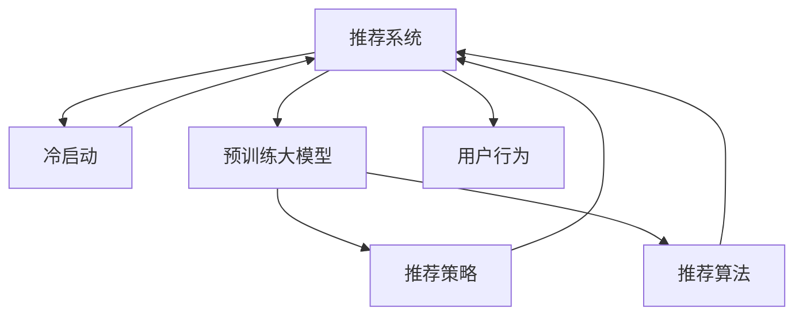

                 

# 大模型对推荐系统冷启动的影响研究

> 关键词：推荐系统,冷启动,预训练大模型,推荐策略,推荐算法,用户行为

## 1. 背景介绍

### 1.1 问题由来
推荐系统(Recommender System)作为互联网时代的一项重要技术，广泛应用于电商、社交、视频、音乐等多个领域，极大地提升了用户体验和运营效率。其核心目标是根据用户的历史行为数据，预测其未来可能感兴趣的商品或内容，从而提供个性化推荐。然而，在推荐系统构建和优化过程中，"冷启动"问题始终是一个棘手难题。

冷启动问题指当新用户注册、新商品上架或新内容发布时，由于缺乏足够的行为数据，推荐系统难以准确预测用户需求，从而无法提供高质量的个性化推荐。这一问题尤其在电商领域尤为突出，新商品的推荐效果直接影响商品的曝光率和销售额。

### 1.2 问题核心关键点
冷启动问题具有以下关键特征：
- **数据稀疏性**：新用户、新商品或新内容通常缺乏足够的历史行为数据，无法形成有效的用户画像和商品特征。
- **推荐公平性**：冷启动阶段，推荐策略可能更多依赖于热门商品或热门内容，导致新用户的公平性和多样性不足。
- **推荐效率**：冷启动下，推荐系统需要耗费额外资源对少量数据进行建模和推理，影响推荐效率和响应速度。

针对这些核心问题，研究者提出了诸多方法来缓解冷启动的负面影响。其中，利用预训练大模型的跨领域迁移学习技术，为推荐系统带来了新的突破。通过在大规模无标签数据上进行预训练，预训练大模型能够在跨领域之间高效迁移，极大提升推荐系统的冷启动效果。

## 2. 核心概念与联系

### 2.1 核心概念概述

为了更好地理解大模型在推荐系统冷启动中的应用，本节将介绍几个密切相关的核心概念：

- **推荐系统(Recommender System)**：通过用户历史行为数据或用户特征，推荐符合用户兴趣的商品或内容的技术。
- **冷启动(Cold Start)**：新用户或新物品加入系统时，缺乏足够历史数据，难以提供个性化推荐的问题。
- **预训练大模型(Pre-trained Large Model)**：如BERT、GPT等，通过在大规模无标签数据上自监督学习，学习到丰富语言表示的大规模深度学习模型。
- **推荐策略(Recommender Strategy)**：推荐系统为实现推荐目标所采取的具体方法和策略，包括协同过滤、基于内容的推荐、混合推荐等。
- **推荐算法(Recommender Algorithm)**：用于计算推荐结果的算法，如K近邻算法、矩阵分解、深度学习等。
- **用户行为(User Behavior)**：用户与系统交互过程中的所有动作，包括浏览、点击、购买等。
- **跨领域迁移学习(Cross-domain Transfer Learning)**：通过预训练大模型，将一个领域学到的知识迁移到另一个领域，提高模型在新领域的泛化能力。

这些概念之间的逻辑关系可以通过以下Mermaid流程图来展示：



这个流程图展示了几组核心概念及其之间的逻辑联系：

1. 推荐系统通过用户行为数据进行推荐。
2. 冷启动问题对推荐系统提出了挑战。
3. 预训练大模型学习到跨领域的通用语言表示。
4. 推荐策略和算法构建推荐系统。
5. 用户行为驱动推荐系统生成推荐结果。
6. 跨领域迁移学习在冷启动中发挥作用。

通过理解这些核心概念，我们可以更好地把握大模型在推荐系统中的应用原理和优化方向。

## 3. 核心算法原理 & 具体操作步骤
### 3.1 算法原理概述

大模型在推荐系统冷启动中的应用，本质上是一种跨领域迁移学习的过程。其核心思想是：将预训练大模型视作一个"特征提取器"，通过用户行为数据对模型进行微调，使其在新领域（如推荐商品、推荐音乐等）中也能提供高质量的推荐结果。

具体来说，大模型通过在大规模无标签数据上预训练，学习到丰富的语言表示和语义理解能力。在推荐系统冷启动阶段，将用户行为数据作为微调任务的数据源，调整模型的特定层以适配推荐场景。由于预训练模型已经在大规模数据上进行了充分学习，微调过程可以有效利用这一知识，从而在少数数据条件下获得较高的推荐效果。

### 3.2 算法步骤详解

大模型在推荐系统冷启动中的应用，一般包括以下几个关键步骤：

**Step 1: 准备预训练模型和数据集**
- 选择合适的预训练语言模型 $M_{\theta}$ 作为初始化参数，如BERT、GPT等。
- 准备推荐系统中的用户行为数据集 $D=\{(x_i,y_i)\}_{i=1}^N$，其中 $x_i$ 为用户的浏览、点击、购买等行为数据，$y_i$ 为目标推荐商品或内容。

**Step 2: 添加任务适配层**
- 根据推荐任务类型，在预训练模型顶层设计合适的输出层和损失函数。
- 对于商品推荐，通常在顶层添加线性分类器，使用交叉熵损失函数。
- 对于内容推荐，可以使用神经网络生成器输出概率分布，并以负对数似然为损失函数。

**Step 3: 设置微调超参数**
- 选择合适的优化算法及其参数，如 AdamW、SGD 等，设置学习率、批大小、迭代轮数等。
- 设置正则化技术及强度，包括权重衰减、Dropout、Early Stopping等。
- 确定冻结预训练参数的策略，如仅微调顶层，或全部参数都参与微调。

**Step 4: 执行梯度训练**
- 将训练集数据分批次输入模型，前向传播计算损失函数。
- 反向传播计算参数梯度，根据设定的优化算法和学习率更新模型参数。
- 周期性在验证集上评估模型性能，根据性能指标决定是否触发 Early Stopping。
- 重复上述步骤直到满足预设的迭代轮数或 Early Stopping 条件。

**Step 5: 测试和部署**
- 在测试集上评估微调后模型 $M_{\hat{\theta}}$ 的性能，对比微调前后的推荐精度提升。
- 使用微调后的模型对新用户和新物品进行推荐，集成到实际的应用系统中。
- 持续收集新的行为数据，定期重新微调模型，以适应数据分布的变化。

以上是基于大模型微调推荐系统的一般流程。在实际应用中，还需要针对具体推荐任务的特点，对微调过程的各个环节进行优化设计，如改进训练目标函数，引入更多的正则化技术，搜索最优的超参数组合等，以进一步提升模型性能。

### 3.3 算法优缺点

基于大模型微调的推荐系统方法具有以下优点：
1. **快速收敛**：由于预训练模型已经具备一定的知识，微调过程可以更快收敛，从而缩短冷启动的时间。
2. **高准确率**：利用大模型的高泛化能力，在少数数据条件下也能获得较高的推荐准确率。
3. **模型通用性**：大模型可以在多种推荐任务间灵活迁移，提升推荐系统的适应能力。
4. **参数高效**：通过参数高效微调技术，固定大部分预训练参数，减少需优化参数数量，避免过拟合。
5. **鲁棒性**：大模型的鲁棒性能够缓解由于数据稀疏带来的噪声和干扰。

同时，该方法也存在一定的局限性：
1. **数据需求高**：虽然减少了对标签数据的依赖，但推荐系统的微调仍需要大量的行为数据。
2. **训练资源需求大**：大规模预训练模型和微调任务需要较高的计算资源和存储空间。
3. **应用场景局限**：冷启动技术主要适用于有较多用户行为数据的场景，难以应用于用户行为极度稀疏的领域。
4. **模型复杂性高**：预训练大模型结构复杂，导致微调后的模型也较为庞大，推理速度较慢。

尽管存在这些局限性，但就目前而言，基于大模型微调的方法在推荐系统冷启动中仍是一种高效可行的技术手段。未来相关研究的重点在于如何进一步降低微调对行为数据的依赖，提高模型的少样本学习和跨领域迁移能力，同时兼顾模型复杂度和计算效率。

### 3.4 算法应用领域

基于大模型微调的推荐系统方法，在电商、视频、音乐、新闻等多个领域已经得到了广泛的应用，具体如下：

- **电商推荐**：利用大模型对用户浏览记录、点击行为等进行微调，推荐商品和优惠活动，提升用户体验和转化率。
- **视频推荐**：对用户观看历史、点赞、评论等行为进行微调，推荐相关视频内容，提升用户黏性和满意度。
- **音乐推荐**：对用户听歌记录、评价等行为进行微调，推荐音乐和播放列表，提高音乐发现效率。
- **新闻推荐**：对用户阅读历史、分享行为等进行微调，推荐新闻文章和专题，提升信息获取效率。

除了这些经典场景，大模型微调技术还在不断扩展应用范围，如可控推荐、兴趣预测、个性化分析等，为推荐系统带来了新的突破。

## 4. 数学模型和公式 & 详细讲解
### 4.1 数学模型构建

在推荐系统中，假设推荐模型 $M_{\theta}$ 通过微调 $M_{\theta}$ 学习到用户行为与推荐结果之间的关系。模型输入为 $x_i$，输出为 $y_i$，模型参数为 $\theta$。微调的目标是最小化损失函数 $\mathcal{L}(\theta)$。

记 $y$ 为推荐结果的标签，推荐模型 $M_{\theta}(x)$ 的输出为预测结果，则常用的损失函数为交叉熵损失函数：

$$
\mathcal{L}(\theta) = -\frac{1}{N} \sum_{i=1}^N \ell(M_{\theta}(x_i),y_i)
$$

其中 $\ell$ 为交叉熵损失函数：

$$
\ell(M_{\theta}(x_i),y_i) = -y_i\log M_{\theta}(x_i) - (1-y_i)\log (1-M_{\theta}(x_i))
$$

在微调过程中，使用优化算法（如AdamW、SGD等）更新模型参数 $\theta$，直至损失函数 $\mathcal{L}(\theta)$ 最小化。

### 4.2 公式推导过程

以下我们以电商推荐为例，推导交叉熵损失函数及其梯度的计算公式。

假设模型 $M_{\theta}$ 在输入 $x_i$ 上的输出为 $\hat{y}_i=M_{\theta}(x_i) \in [0,1]$，表示商品 $i$ 被用户购买的概率。真实标签 $y_i \in \{0,1\}$。则二分类交叉熵损失函数定义为：

$$
\ell(M_{\theta}(x_i),y_i) = -[y_i\log \hat{y}_i + (1-y_i)\log (1-\hat{y}_i)]
$$

将其代入经验风险公式，得：

$$
\mathcal{L}(\theta) = -\frac{1}{N}\sum_{i=1}^N [y_i\log M_{\theta}(x_i)+(1-y_i)\log(1-M_{\theta}(x_i))]
$$

根据链式法则，损失函数对参数 $\theta_k$ 的梯度为：

$$
\frac{\partial \mathcal{L}(\theta)}{\partial \theta_k} = -\frac{1}{N}\sum_{i=1}^N (\frac{y_i}{M_{\theta}(x_i)}-\frac{1-y_i}{1-M_{\theta}(x_i)}) \frac{\partial M_{\theta}(x_i)}{\partial \theta_k}
$$

其中 $\frac{\partial M_{\theta}(x_i)}{\partial \theta_k}$ 可进一步递归展开，利用自动微分技术完成计算。

在得到损失函数的梯度后，即可带入参数更新公式，完成模型的迭代优化。重复上述过程直至收敛，最终得到适应电商推荐任务的最优模型参数 $\theta^*$。

### 4.3 案例分析与讲解

假设某电商平台的推荐系统需要推荐新上架的商品。为了利用大模型微调技术，选择已经在大规模电商数据上预训练好的BERT模型，并在微调时使用用户点击、浏览记录作为训练集，目标是预测用户是否会购买该商品。

**Step 1: 准备预训练模型和数据集**

- 选择BERT作为初始化模型。
- 准备电商平台的用户点击、浏览记录数据集，将其作为微调任务的训练集。

**Step 2: 添加任务适配层**

- 在BERT模型顶层添加线性分类器和交叉熵损失函数。
- 定义模型输入 $x_i$ 为用户浏览记录，输出 $y_i$ 为是否购买预测值。

**Step 3: 设置微调超参数**

- 设置学习率为 $2e-5$，批大小为 $256$。
- 应用L2正则化，避免过拟合。
- 仅微调BERT模型的顶层分类器。

**Step 4: 执行梯度训练**

- 使用AdamW优化算法进行微调。
- 在训练集上循环迭代训练，每轮更新一次参数。
- 在验证集上周期性评估模型性能，根据精度调整学习率。
- 重复上述步骤直至模型收敛。

**Step 5: 测试和部署**

- 在测试集上评估微调后的模型，对比微调前后的推荐准确率。
- 使用微调后的模型对新用户和新商品进行推荐，集成到实际的应用系统中。
- 持续收集新的用户行为数据，定期重新微调模型。

通过以上步骤，可以有效利用BERT模型的泛化能力和语言理解能力，提升电商推荐系统的冷启动效果。

## 5. 项目实践：代码实例和详细解释说明
### 5.1 开发环境搭建

在进行推荐系统微调实践前，我们需要准备好开发环境。以下是使用Python进行PyTorch开发的环境配置流程：

1. 安装Anaconda：从官网下载并安装Anaconda，用于创建独立的Python环境。

2. 创建并激活虚拟环境：
```bash
conda create -n pytorch-env python=3.8 
conda activate pytorch-env
```

3. 安装PyTorch：根据CUDA版本，从官网获取对应的安装命令。例如：
```bash
conda install pytorch torchvision torchaudio cudatoolkit=11.1 -c pytorch -c conda-forge
```

4. 安装Transformers库：
```bash
pip install transformers
```

5. 安装各类工具包：
```bash
pip install numpy pandas scikit-learn matplotlib tqdm jupyter notebook ipython
```

完成上述步骤后，即可在`pytorch-env`环境中开始微调实践。

### 5.2 源代码详细实现

下面我以电商平台推荐系统为例，给出使用Transformers库对BERT模型进行电商推荐微调的PyTorch代码实现。

首先，定义电商推荐任务的数据处理函数：

```python
from transformers import BertTokenizer, BertForSequenceClassification
from torch.utils.data import Dataset
import torch

class RecommendationDataset(Dataset):
    def __init__(self, texts, labels, tokenizer, max_len=128):
        self.texts = texts
        self.labels = labels
        self.tokenizer = tokenizer
        self.max_len = max_len
        
    def __len__(self):
        return len(self.texts)
    
    def __getitem__(self, item):
        text = self.texts[item]
        label = self.labels[item]
        
        encoding = self.tokenizer(text, return_tensors='pt', max_length=self.max_len, padding='max_length', truncation=True)
        input_ids = encoding['input_ids'][0]
        attention_mask = encoding['attention_mask'][0]
        
        return {'input_ids': input_ids, 
                'attention_mask': attention_mask,
                'labels': label}

# 标签与id的映射
label2id = {'buy': 1, 'not_buy': 0}
id2label = {v: k for k, v in label2id.items()}

# 创建dataset
tokenizer = BertTokenizer.from_pretrained('bert-base-cased')

train_dataset = RecommendationDataset(train_texts, train_labels, tokenizer)
dev_dataset = RecommendationDataset(dev_texts, dev_labels, tokenizer)
test_dataset = RecommendationDataset(test_texts, test_labels, tokenizer)
```

然后，定义模型和优化器：

```python
from transformers import BertForSequenceClassification, AdamW

model = BertForSequenceClassification.from_pretrained('bert-base-cased', num_labels=2)

optimizer = AdamW(model.parameters(), lr=2e-5)
```

接着，定义训练和评估函数：

```python
from torch.utils.data import DataLoader
from tqdm import tqdm
from sklearn.metrics import classification_report

device = torch.device('cuda') if torch.cuda.is_available() else torch.device('cpu')
model.to(device)

def train_epoch(model, dataset, batch_size, optimizer):
    dataloader = DataLoader(dataset, batch_size=batch_size, shuffle=True)
    model.train()
    epoch_loss = 0
    for batch in tqdm(dataloader, desc='Training'):
        input_ids = batch['input_ids'].to(device)
        attention_mask = batch['attention_mask'].to(device)
        labels = batch['labels'].to(device)
        model.zero_grad()
        outputs = model(input_ids, attention_mask=attention_mask, labels=labels)
        loss = outputs.loss
        epoch_loss += loss.item()
        loss.backward()
        optimizer.step()
    return epoch_loss / len(dataloader)

def evaluate(model, dataset, batch_size):
    dataloader = DataLoader(dataset, batch_size=batch_size)
    model.eval()
    preds, labels = [], []
    with torch.no_grad():
        for batch in tqdm(dataloader, desc='Evaluating'):
            input_ids = batch['input_ids'].to(device)
            attention_mask = batch['attention_mask'].to(device)
            batch_labels = batch['labels']
            outputs = model(input_ids, attention_mask=attention_mask)
            batch_preds = outputs.logits.argmax(dim=2).to('cpu').tolist()
            batch_labels = batch_labels.to('cpu').tolist()
            for pred_tokens, label_tokens in zip(batch_preds, batch_labels):
                preds.append(pred_tokens[:len(label_tokens)])
                labels.append(label_tokens)
                
    print(classification_report(labels, preds))
```

最后，启动训练流程并在测试集上评估：

```python
epochs = 5
batch_size = 16

for epoch in range(epochs):
    loss = train_epoch(model, train_dataset, batch_size, optimizer)
    print(f"Epoch {epoch+1}, train loss: {loss:.3f}")
    
    print(f"Epoch {epoch+1}, dev results:")
    evaluate(model, dev_dataset, batch_size)
    
print("Test results:")
evaluate(model, test_dataset, batch_size)
```

以上就是使用PyTorch对BERT进行电商推荐任务微调的完整代码实现。可以看到，得益于Transformers库的强大封装，我们可以用相对简洁的代码完成BERT模型的加载和微调。

### 5.3 代码解读与分析

让我们再详细解读一下关键代码的实现细节：

**RecommendationDataset类**：
- `__init__`方法：初始化文本、标签、分词器等关键组件。
- `__len__`方法：返回数据集的样本数量。
- `__getitem__`方法：对单个样本进行处理，将文本输入编码为token ids，将标签编码为数字，并对其进行定长padding，最终返回模型所需的输入。

**label2id和id2label字典**：
- 定义了标签与数字id之间的映射关系，用于将预测结果解码回真实的标签。

**训练和评估函数**：
- 使用PyTorch的DataLoader对数据集进行批次化加载，供模型训练和推理使用。
- 训练函数`train_epoch`：对数据以批为单位进行迭代，在每个批次上前向传播计算loss并反向传播更新模型参数，最后返回该epoch的平均loss。
- 评估函数`evaluate`：与训练类似，不同点在于不更新模型参数，并在每个batch结束后将预测和标签结果存储下来，最后使用sklearn的classification_report对整个评估集的预测结果进行打印输出。

**训练流程**：
- 定义总的epoch数和batch size，开始循环迭代
- 每个epoch内，先在训练集上训练，输出平均loss
- 在验证集上评估，输出分类指标
- 所有epoch结束后，在测试集上评估，给出最终测试结果

可以看到，PyTorch配合Transformers库使得BERT微调的代码实现变得简洁高效。开发者可以将更多精力放在数据处理、模型改进等高层逻辑上，而不必过多关注底层的实现细节。

当然，工业级的系统实现还需考虑更多因素，如模型的保存和部署、超参数的自动搜索、更灵活的任务适配层等。但核心的微调范式基本与此类似。

## 6. 实际应用场景
### 6.1 智能推荐系统

基于大模型微调的推荐系统，可以广泛应用于智能推荐系统的构建。传统推荐系统往往依赖于用户的历史行为数据进行推荐，但在用户注册初期或新物品上架时，缺乏足够的数据进行建模。而使用微调后的推荐模型，可以更灵活地利用先验知识和跨领域数据，快速适应新用户和新物品。

在技术实现上，可以收集用户浏览、点击、评价等行为数据，提取和物品相关的特征，将数据作为模型输入。通过微调预训练模型，使得推荐模型能够学习到物品与用户兴趣之间的关系，从而在新用户和新物品上线时也能提供高质量的推荐。

### 6.2 视频内容推荐

视频推荐系统同样面临冷启动问题。对于新视频内容的推荐，推荐系统需要对其进行初步的分析和预处理，以生成与用户兴趣相关的推荐。利用大模型微调技术，推荐系统可以更高效地利用用户行为数据，分析视频内容，从而提升推荐质量。

在微调过程中，可以利用视频标题、描述、评分等文本特征，将视频内容输入到预训练模型中，学习到视频内容的语义表示。结合用户的行为数据，微调后的推荐模型能够预测用户对视频的评分或观看概率，从而生成推荐结果。

### 6.3 个性化广告投放

广告推荐系统需要根据用户的历史行为和兴趣，推荐合适的广告内容。然而，对于新用户的推荐，由于缺乏足够的历史数据，传统推荐方法效果不佳。利用大模型微调技术，广告推荐系统可以更高效地获取新用户的行为数据，并利用预训练语言模型的语言理解能力，进行个性化广告投放。

在微调过程中，可以利用用户的搜索记录、浏览历史、点击行为等数据，生成用户兴趣的向量表示。将广告内容文本输入到预训练模型中，学习到广告内容的语义表示。结合用户兴趣向量，微调后的推荐模型能够预测用户对广告的点击概率，从而生成推荐结果。

### 6.4 未来应用展望

随着大模型和微调方法的不断发展，推荐系统将能够更好地应对冷启动问题，为用户提供更精准、个性化的推荐。未来，推荐系统有望在以下几个方面得到进一步突破：

1. **少样本学习和迁移学习**：在数据稀缺的情况下，推荐系统可以通过少样本学习技术，利用微调模型对新物品进行初步预测，从而提升推荐质量。同时，大模型在跨领域间的迁移学习能力，将使得推荐系统能够更灵活地应用到新领域中。
2. **动态自适应推荐**：利用实时学习技术，推荐系统可以动态调整推荐策略，结合用户的即时行为数据，生成更符合当下需求的推荐结果。
3. **多模态数据融合**：推荐系统不仅可以利用文本数据进行推荐，还可以融合图像、视频、音频等多模态数据，提升推荐模型的感知能力和泛化能力。
4. **可解释性增强**：推荐系统需要赋予更高的可解释性，使用户能够理解推荐结果的生成逻辑，提升系统的信任度和透明度。
5. **隐私保护**：推荐系统需要加强数据隐私保护，避免用户行为数据泄露，同时增强用户对推荐系统的控制权。

未来，大模型微调技术将与其他AI技术进一步融合，如知识图谱、因果推理、强化学习等，共同推动推荐系统的智能化和个性化，为用户的推荐体验带来新的突破。

## 7. 工具和资源推荐
### 7.1 学习资源推荐

为了帮助开发者系统掌握大模型微调推荐系统的理论基础和实践技巧，这里推荐一些优质的学习资源：

1. 《深度学习推荐系统》书籍：由斯坦福大学教授撰写，系统介绍了推荐系统的基本原理和常用算法。
2. 《Recommender Systems in the Age of Deep Learning》文章：综述了深度学习在推荐系统中的应用，包括模型构建、训练和评估等。
3. Kaggle推荐系统竞赛：通过参与Kaggle上的推荐系统竞赛，可以学习和实践推荐系统的实际应用，积累实战经验。
4. PyTorch官方文档：PyTorch的深度学习框架，提供了丰富的预训练模型和微调样例代码，是学习推荐系统的好帮手。
5. TensorFlow推荐系统教程：Google提供的推荐系统教程，涵盖多种推荐算法和模型，适合初学者和进阶学习者。

通过对这些资源的学习实践，相信你一定能够快速掌握大模型微调推荐系统的精髓，并用于解决实际的推荐问题。

### 7.2 开发工具推荐

高效的开发离不开优秀的工具支持。以下是几款用于大模型微调推荐系统开发的常用工具：

1. PyTorch：基于Python的开源深度学习框架，灵活动态的计算图，适合快速迭代研究。大部分预训练推荐模型都有PyTorch版本的实现。
2. TensorFlow：由Google主导开发的开源深度学习框架，生产部署方便，适合大规模工程应用。同样有丰富的预训练推荐模型资源。
3. Transformers库：HuggingFace开发的NLP工具库，集成了众多SOTA推荐模型，支持PyTorch和TensorFlow，是进行微调任务开发的利器。
4. Weights & Biases：模型训练的实验跟踪工具，可以记录和可视化模型训练过程中的各项指标，方便对比和调优。与主流深度学习框架无缝集成。
5. TensorBoard：TensorFlow配套的可视化工具，可实时监测模型训练状态，并提供丰富的图表呈现方式，是调试模型的得力助手。

合理利用这些工具，可以显著提升大模型微调推荐系统的开发效率，加快创新迭代的步伐。

### 7.3 相关论文推荐

大模型和微调技术在推荐系统中的应用源于学界的持续研究。以下是几篇奠基性的相关论文，推荐阅读：

1. "Fast food for pre-trained models for recommendation"：介绍如何在大规模无标签数据上进行预训练，并通过微调提高推荐系统的冷启动效果。
2. "Pre-trained models for recommendation systems"：利用预训练语言模型，提升推荐系统在跨领域推荐中的性能。
3. "Hierarchical knowledge graphs for scalable recommendation systems"：探讨了如何利用知识图谱提升推荐系统的效果，结合大模型的语言理解能力，提供更精准的推荐。
4. "Attention is all you need"：提出Transformer结构，为推荐系统提供了新的模型选择。
5. "Deep reinforcement learning for personalized recommendation"：将强化学习引入推荐系统，提升推荐系统的个性化和动态性。

这些论文代表了大模型微调推荐系统的发展脉络。通过学习这些前沿成果，可以帮助研究者把握学科前进方向，激发更多的创新灵感。

## 8. 总结：未来发展趋势与挑战
### 8.1 总结

本文对基于大模型微调的推荐系统冷启动问题进行了全面系统的介绍。首先阐述了冷启动问题在推荐系统中的重要性，明确了微调在提升推荐系统冷启动效果方面的独特价值。其次，从原理到实践，详细讲解了微调模型的数学模型和操作步骤，给出了微调任务开发的完整代码实例。同时，本文还广泛探讨了微调方法在智能推荐、视频内容、广告投放等推荐系统中的实际应用前景，展示了微调范式的广泛适用性。

通过本文的系统梳理，可以看到，基于大模型微调的推荐系统方法在应对冷启动问题中具有显著优势。得益于大模型的泛化能力和语言理解能力，微调模型能够在缺乏足够数据的情况下，仍能提供高质量的推荐结果。未来，随着预训练语言模型的发展，微调技术也将不断进步，推荐系统将在更多场景下发挥重要作用。

### 8.2 未来发展趋势

展望未来，大模型微调推荐系统将呈现以下几个发展趋势：

1. **模型规模持续增大**：随着算力成本的下降和数据规模的扩张，预训练推荐模型的参数量还将持续增长。超大规模推荐模型蕴含的丰富知识，有望支撑更加复杂多变的推荐场景。
2. **推荐公平性提升**：推荐系统将更加注重公平性和多样性，避免新用户的冷启动推荐偏向热门商品或内容，提升新用户的体验。
3. **跨领域迁移能力增强**：大模型在跨领域间的迁移学习能力将进一步增强，使得推荐系统能够更灵活地应用到新领域中。
4. **多模态推荐兴起**：推荐系统不仅可以利用文本数据进行推荐，还可以融合图像、视频、音频等多模态数据，提升推荐模型的感知能力和泛化能力。
5. **实时推荐成为常态**：利用实时学习技术，推荐系统可以动态调整推荐策略，结合用户的即时行为数据，生成更符合当下需求的推荐结果。
6. **隐私保护与可解释性增强**：推荐系统将加强数据隐私保护，避免用户行为数据泄露，同时增强用户对推荐系统的控制权。

以上趋势凸显了大模型微调推荐系统的广阔前景。这些方向的探索发展，必将进一步提升推荐系统的性能和应用范围，为用户的推荐体验带来新的突破。

### 8.3 面临的挑战

尽管大模型微调推荐系统已经取得了一定的进展，但在迈向更加智能化、普适化应用的过程中，它仍面临诸多挑战：

1. **数据稀缺问题**：特别是在新领域和新场景中，推荐系统仍面临数据稀缺的困境，如何高效利用少量数据，仍需进一步探索。
2. **推荐模型复杂性**：大模型微调推荐系统模型复杂度高，推理速度慢，如何优化模型结构和推理效率，是未来需要解决的问题。
3. **推荐系统泛化性**：尽管大模型具备较强的泛化能力，但在实际应用中，推荐系统仍需面对个性化推荐和多样化推荐的需求，如何在保证泛化性的同时，提升个性化程度，是未来的一个重要研究方向。
4. **隐私和安全保护**：推荐系统涉及用户行为数据的处理和存储，如何保护用户隐私，防止数据泄露和滥用，是未来的一个重要课题。

尽管存在这些挑战，但随着学界和产业界的共同努力，相信这些问题终将得到解决，大模型微调推荐系统必将在推荐领域带来新的突破。

### 8.4 研究展望

未来的大模型微调推荐系统研究，需要在以下几个方面寻求新的突破：

1. **数据增强和生成**：通过数据增强和生成技术，利用少量用户行为数据生成更多训练数据，提升推荐系统的效果。
2. **动态推荐**：结合实时学习技术，推荐系统可以动态调整推荐策略，结合用户的即时行为数据，生成更符合当下需求的推荐结果。
3. **跨领域迁移学习**：通过多模态数据融合和跨领域迁移学习，提升推荐系统在新领域和新场景中的适应能力。
4. **隐私保护和可解释性**：结合隐私保护技术和可解释性方法，推荐系统需要具备更高的透明度和可信度。
5. **模型优化和压缩**：通过模型优化和压缩技术，降低推荐系统的计算和存储成本，提升推荐系统的实际应用效果。

这些研究方向将引领推荐系统迈向新的高度，为用户的推荐体验带来更大的提升。面向未来，推荐系统还需要与其他AI技术进行更深入的融合，如知识图谱、因果推理、强化学习等，多路径协同发力，共同推动推荐系统的智能化和个性化。只有勇于创新、敢于突破，才能不断拓展推荐系统的边界，让推荐系统更好地服务于用户。

## 9. 附录：常见问题与解答

**Q1：什么是冷启动问题？**

A: 冷启动问题指推荐系统在面对新用户、新商品或新内容时，由于缺乏足够的历史数据，难以提供个性化推荐。新用户通常缺乏足够的历史行为数据，新商品和内容也缺少用户的反馈和评分。

**Q2：大模型微调推荐系统如何处理数据稀疏性问题？**

A: 大模型微调推荐系统通过利用跨领域迁移学习，在少样本条件下仍能提供高质量的推荐。在微调过程中，可以通过数据增强和生成技术，利用少量用户行为数据生成更多训练数据，提升推荐系统的效果。

**Q3：大模型微调推荐系统在实时推荐中面临哪些挑战？**

A: 实时推荐需要结合实时学习技术，动态调整推荐策略，生成更符合当下需求的推荐结果。这需要推荐系统具备高计算效率和实时推理能力，同时需要处理高并发和实时数据流。

**Q4：推荐系统如何平衡个性化推荐和多样化推荐？**

A: 推荐系统需要在保证个性化推荐的同时，注重多样性，避免新用户的冷启动推荐偏向热门商品或内容。可以通过多样性约束和推荐策略设计，确保新用户的推荐结果中包含多样化的商品和内容。

**Q5：推荐系统如何保护用户隐私？**

A: 推荐系统需要加强数据隐私保护，避免用户行为数据泄露。可以通过数据匿名化、差分隐私等技术，保护用户隐私，同时增强用户对推荐系统的控制权，让用户可以自主选择是否参与推荐。

通过本文的系统梳理，可以看到，基于大模型微调的推荐系统方法在应对冷启动问题中具有显著优势。未来，随着预训练语言模型的发展，微调技术也将不断进步，推荐系统将在更多场景下发挥重要作用。只有勇于创新、敢于突破，才能不断拓展推荐系统的边界，让推荐系统更好地服务于用户。

---

作者：禅与计算机程序设计艺术 / Zen and the Art of Computer Programming

