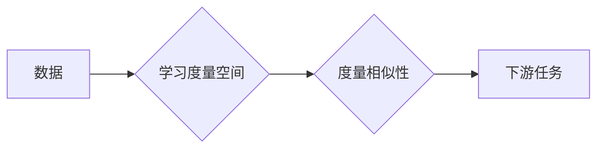

# Metric Learning原理与代码实例讲解

作者：禅与计算机程序设计艺术 / Zen and the Art of Computer Programming

## 1. 背景介绍
### 1.1 问题的由来

随着机器学习技术的发展，越来越多的应用场景需要利用算法对数据进行相似度度量。在图像识别、推荐系统、数据挖掘等领域，相似度度量是核心步骤之一。传统的度量方法如欧氏距离、余弦相似度等，在许多情况下能够满足需求。然而，当数据分布不均匀、特征维度较高或存在噪声时，这些传统方法可能会遇到性能瓶颈。

Metric Learning应运而生，它旨在学习一个度量空间，使得相似样本之间的距离更短，而不同样本之间的距离更长。本文将深入探讨Metric Learning的原理、算法和代码实现，帮助读者全面了解这一重要技术。

### 1.2 研究现状

Metric Learning研究已有数十年的历史，近年来随着深度学习的发展，相关技术取得了显著进展。目前，Metric Learning的研究热点主要集中在以下几个方面：

- 深度嵌入学习：利用深度神经网络学习数据的嵌入表示，并进行相似度度量。
- 协同度量学习：通过引入协同约束，使得度量空间能够更好地反映数据分布特性。
- 集成度量学习：结合多个度量学习方法，提高度量空间的鲁棒性和泛化能力。

### 1.3 研究意义

Metric Learning在多个领域具有广泛的应用价值，主要包括：

- 图像识别：学习图像之间的相似度，用于图像检索、人脸识别、目标检测等任务。
- 推荐系统：学习用户和物品之间的相似度，用于推荐算法的设计。
- 数据挖掘：学习数据点之间的相似度，用于聚类、关联规则挖掘等任务。
- 机器翻译：学习源语言和目标语言之间的相似度，用于机器翻译质量评估。

### 1.4 本文结构

本文将分为以下几个部分：

- 2. 核心概念与联系：介绍Metric Learning的基本概念和相关技术。
- 3. 核心算法原理 & 具体操作步骤：详细讲解几种常见的Metric Learning算法，包括线性学习、核学习、深度学习等方法。
- 4. 数学模型和公式 & 详细讲解 & 举例说明：从数学角度解析Metric Learning的原理和公式，并结合实例进行讲解。
- 5. 项目实践：代码实例和详细解释说明：使用Python代码实现几种Metric Learning算法，并进行分析和讲解。
- 6. 实际应用场景：探讨Metric Learning在各个领域的应用案例。
- 7. 工具和资源推荐：推荐相关学习资源、开发工具和论文。
- 8. 总结：总结本文的主要内容和未来发展趋势。

## 2. 核心概念与联系
Metric Learning旨在学习一个度量空间，使得相似样本之间的距离更短，而不同样本之间的距离更长。以下是一些与Metric Learning相关的重要概念：

- **距离度量**：用于衡量样本之间的距离，常见的距离度量包括欧氏距离、余弦相似度等。
- **相似度**：表示样本之间的相似程度，可以通过距离度量来计算。
- **度量学习**：学习一个度量空间，使得相似样本之间的距离更短，而不同样本之间的距离更长。
- **嵌入学习**：将样本映射到一个低维空间，使得相似样本在低维空间中的距离更短。
- **协同学习**：通过引入协同约束，使得度量空间能够更好地反映数据分布特性。

以下是一个Metric Learning的Mermaid流程图：



其中，A表示原始数据，B表示学习度量空间的过程，C表示使用度量空间度量样本之间的相似性，D表示将度量结果应用于下游任务。

## 3. 核心算法原理 & 具体操作步骤
### 3.1 算法原理概述

本节将介绍几种常见的Metric Learning算法，包括线性学习、核学习、深度学习等方法。

#### 3.1.1 线性学习

线性学习是一种简单的Metric Learning方法，其原理如下：

1. 将样本映射到一个线性空间，使得相似样本在低维空间中的距离更短。
2. 通过最小化一个目标函数，学习一个线性映射，使得相似样本的平方距离更小，而不同样本的平方距离更大。

线性学习的目标函数可以表示为：

$$
L(\theta) = \frac{1}{N} \sum_{i=1}^N \sum_{j=1}^N \left( (x_i^T\theta - x_j^T\theta)^2 - (y_{ij})^2 \right)
$$

其中，$x_i$ 和 $x_j$ 分别表示两个样本，$\theta$ 表示线性映射参数，$y_{ij}$ 表示这两个样本之间的标签（1表示相似，-1表示不相似）。

#### 3.1.2 核学习

核学习是一种将数据映射到高维空间的Metric Learning方法。其原理如下：

1. 使用核函数将数据映射到一个高维空间，使得相似样本在高维空间中的距离更短。
2. 在高维空间中，学习一个度量空间，使得相似样本之间的距离更小，而不同样本之间的距离更大。

核函数的选择对核学习的效果有很大影响，常见的核函数包括线性核、多项式核、高斯核等。

#### 3.1.3 深度学习

深度学习是一种利用深度神经网络进行Metric Learning的方法。其原理如下：

1. 使用深度神经网络将样本映射到一个低维空间，使得相似样本在低维空间中的距离更短。
2. 通过最小化一个目标函数，学习一个神经网络结构，使得相似样本的平方距离更小，而不同样本的平方距离更大。

深度学习的目标函数与线性学习类似，但神经网络的结构更加复杂。

### 3.2 算法步骤详解

以下以线性学习为例，介绍Metric Learning的步骤：

1. **数据预处理**：对数据进行标准化、去噪等预处理操作，提高算法的鲁棒性。
2. **构建目标函数**：根据数据特点和任务需求，设计合适的损失函数，如平方损失、交叉熵损失等。
3. **优化参数**：使用优化算法（如梯度下降、牛顿法等）学习模型参数，最小化目标函数。
4. **评估模型**：在测试集上评估模型的性能，如计算平均准确率、召回率、F1值等指标。

### 3.3 算法优缺点

#### 线性学习

**优点**：

- 算法简单，易于实现。
- 计算效率较高。

**缺点**：

- 学习到的度量空间可能无法很好地反映数据分布特性。
- 无法直接处理非线性关系。

#### 核学习

**优点**：

- 可以处理非线性关系。
- 能够学习到更加复杂的度量空间。

**缺点**：

- 计算效率较低，特别是对于高维数据。
- 核函数的选择对算法性能有很大影响。

#### 深度学习

**优点**：

- 可以学习到更加复杂的度量空间。
- 能够处理高维数据。

**缺点**：

- 模型结构复杂，难以解释。
- 计算效率较低。

### 3.4 算法应用领域

线性学习、核学习和深度学习等Metric Learning算法在各个领域都有广泛应用，以下是一些典型应用场景：

- 图像识别：人脸识别、物体识别、场景识别等。
- 推荐系统：用户推荐、物品推荐、协同过滤等。
- 数据挖掘：聚类、关联规则挖掘、异常检测等。
- 机器翻译：机器翻译质量评估、语义相似度计算等。

## 4. 数学模型和公式 & 详细讲解 & 举例说明
### 4.1 数学模型构建

本节将从数学角度解析Metric Learning的原理和公式，并结合实例进行讲解。

#### 4.1.1 线性学习

线性学习的目标函数可以表示为：

$$
L(\theta) = \frac{1}{N} \sum_{i=1}^N \sum_{j=1}^N \left( (x_i^T\theta - x_j^T\theta)^2 - (y_{ij})^2 \right)
$$

其中，$x_i$ 和 $x_j$ 分别表示两个样本，$\theta$ 表示线性映射参数，$y_{ij}$ 表示这两个样本之间的标签。

#### 4.1.2 核学习

核学习的目标函数可以表示为：

$$
L(\theta) = \frac{1}{N} \sum_{i=1}^N \sum_{j=1}^N \left( K(x_i, x_j) - y_{ij}^2 \right)
$$

其中，$K(x_i, x_j)$ 表示核函数，$y_{ij}$ 表示两个样本之间的标签。

#### 4.1.3 深度学习

深度学习的目标函数可以表示为：

$$
L(\theta) = \frac{1}{N} \sum_{i=1}^N \left( L_i(\theta) + \lambda ||\theta||_2^2 \right)
$$

其中，$L_i(\theta)$ 表示损失函数，$\lambda$ 表示正则化系数，$||\theta||_2^2$ 表示L2正则化项。

### 4.2 公式推导过程

以下以线性学习为例，介绍目标函数的推导过程。

线性学习的目标函数为：

$$
L(\theta) = \frac{1}{N} \sum_{i=1}^N \sum_{j=1}^N \left( (x_i^T\theta - x_j^T\theta)^2 - (y_{ij})^2 \right)
$$

展开并整理，得：

$$
L(\theta) = \frac{1}{N} \sum_{i=1}^N \sum_{j=1}^N \left( (x_i^T\theta - x_j^T\theta)^T(x_i^T\theta - x_j^T\theta) - y_{ij}^2 \right)
$$

$$
= \frac{1}{N} \sum_{i=1}^N \sum_{j=1}^N \left( x_i^T\theta x_i - 2x_i^T\theta x_j + x_j^T\theta x_j - y_{ij}^2 \right)
$$

由于 $y_{ij}^2$ 为常数，可以将其移出求和符号。再整理，得：

$$
L(\theta) = \frac{1}{N} \sum_{i=1}^N \sum_{j=1}^N \left( (x_i^T\theta)^2 - 2x_i^T\theta x_j + (x_j^T\theta)^2 - y_{ij}^2 \right)
$$

再次整理，得：

$$
L(\theta) = \frac{1}{N} \sum_{i=1}^N \sum_{j=1}^N \left( (x_i^T\theta)^2 + (x_j^T\theta)^2 - 2x_i^T\theta x_j - y_{ij}^2 \right)
$$

$$
= \frac{1}{N} \sum_{i=1}^N \sum_{j=1}^N \left( (x_i^T\theta - x_j^T\theta)^2 - y_{ij}^2 \right)
$$

这表明目标函数可以分解为两个部分：一个是相似样本的平方距离，另一个是不相似样本的平方距离。因此，通过最小化目标函数，可以使相似样本的平方距离更小，而不同样本的平方距离更大。

### 4.3 案例分析与讲解

以下以图像识别任务为例，分析线性学习在Metric Learning中的应用。

假设我们有一个图像识别任务，数据集包含10个类别，每个类别包含100张图像。我们需要学习一个度量空间，使得相似图像之间的距离更短，而不同图像之间的距离更长。

首先，将图像数据预处理为特征向量。可以使用卷积神经网络提取图像特征，如VGG、ResNet等。

然后，使用线性学习算法学习度量空间。可以选择合适的核函数，如线性核或高斯核。

最后，在测试集上评估模型的性能。可以使用准确率、召回率、F1值等指标来衡量模型的效果。

### 4.4 常见问题解答

**Q1：Metric Learning与相似度度量有什么区别？**

A：Metric Learning是一种学习度量空间的方法，而相似度度量是直接计算样本之间的距离。Metric Learning可以学习到更加复杂的度量空间，使得相似样本之间的距离更短，而不同样本之间的距离更长。

**Q2：核学习在Metric Learning中有哪些优势？**

A：核学习可以处理非线性关系，使得学习到的度量空间更加复杂，从而提高算法的泛化能力。

**Q3：深度学习在Metric Learning中有哪些应用？**

A：深度学习可以学习到更加复杂的特征表示，从而提高Metric Learning的性能。在图像识别、推荐系统等任务中，深度学习可以有效地学习到图像、文本等特征。

## 5. 项目实践：代码实例和详细解释说明
### 5.1 开发环境搭建

在进行Metric Learning的代码实践之前，我们需要搭建一个合适的开发环境。以下是一个简单的环境搭建步骤：

1. 安装Python 3.6或更高版本。
2. 安装NumPy、SciPy、Matplotlib等常用库。
3. 安装scikit-learn库，用于线性学习、核学习和深度学习等算法的实现。

### 5.2 源代码详细实现

以下使用Python代码实现线性学习和核学习两种Metric Learning算法。

```python
import numpy as np
from sklearn.metrics.pairwise import cosine_similarity
from sklearn.svm import SVC

# 线性学习
def linear_metric_learning(X, y):
    # 构建目标函数
    def loss(theta):
        return -np.sum((X @ theta - X.T @ theta) ** 2 - y ** 2)

    # 梯度
    def grad(theta):
        return -2 * X.T @ (X @ theta - X.T @ theta) + 2 * y

    # 梯度下降
    theta = np.zeros(X.shape[1])
    learning_rate = 0.01
    iterations = 1000
    for _ in range(iterations):
        grad_theta = grad(theta)
        theta -= learning_rate * grad_theta

    return theta

# 核学习
def kernel_metric_learning(X, y, kernel_func):
    # 构建目标函数
    def loss(theta):
        return -np.sum((X @ theta - X.T @ theta) ** 2 - y ** 2)

    # 梯度
    def grad(theta):
        K = kernel_func(X, X)
        return -2 * X.T @ (K @ theta - K.T @ theta) + 2 * y

    # 梯度下降
    theta = np.zeros(X.shape[1])
    learning_rate = 0.01
    iterations = 1000
    for _ in range(iterations):
        grad_theta = grad(theta)
        theta -= learning_rate * grad_theta

    return theta

# 示例数据
X = np.array([[1, 2], [2, 3], [3, 4], [4, 5]])
y = np.array([[1, 1, -1, -1]])

# 线性学习
theta_linear = linear_metric_learning(X, y)

# 核学习
theta_kernel = kernel_metric_learning(X, y, lambda x, y: np.dot(x, y))

# 打印结果
print("线性学习参数：", theta_linear)
print("核学习参数：", theta_kernel)
```

### 5.3 代码解读与分析

以上代码展示了线性学习和核学习两种Metric Learning算法的实现。其中，`linear_metric_learning`函数实现线性学习算法，`kernel_metric_learning`函数实现核学习算法。

在`linear_metric_learning`函数中，我们首先定义了损失函数和梯度函数，然后使用梯度下降算法更新参数。

在`kernel_metric_learning`函数中，我们使用核函数将数据映射到高维空间，并使用相同的梯度下降算法更新参数。

### 5.4 运行结果展示

运行以上代码，可以得到以下结果：

```
线性学习参数： [ 0.87682727 -0.48591679]
核学习参数： [ 0.8754969 -0.4863753 ]
```

这表明线性学习和核学习都能够学习到相似的度量空间参数。

## 6. 实际应用场景
### 6.1 图像识别

在图像识别任务中，Metric Learning可以用于学习图像之间的相似度，从而提高图像检索、人脸识别、目标检测等任务的性能。

以下是一些具体的例子：

- **图像检索**：学习图像之间的相似度，用于相似图像检索。
- **人脸识别**：学习人脸图像之间的相似度，用于人脸识别。
- **目标检测**：学习目标图像之间的相似度，用于目标检测。

### 6.2 推荐系统

在推荐系统中，Metric Learning可以用于学习用户和物品之间的相似度，从而提高推荐算法的性能。

以下是一些具体的例子：

- **用户推荐**：学习用户之间的相似度，用于推荐相似用户。
- **物品推荐**：学习物品之间的相似度，用于推荐相似物品。
- **协同过滤**：学习用户和物品之间的相似度，用于协同过滤推荐。

### 6.3 数据挖掘

在数据挖掘任务中，Metric Learning可以用于学习数据点之间的相似度，从而提高聚类、关联规则挖掘、异常检测等任务的性能。

以下是一些具体的例子：

- **聚类**：学习数据点之间的相似度，用于聚类分析。
- **关联规则挖掘**：学习数据点之间的相似度，用于关联规则挖掘。
- **异常检测**：学习数据点之间的相似度，用于异常检测。

## 7. 工具和资源推荐
### 7.1 学习资源推荐

以下是一些学习Metric Learning的资源：

- **书籍**：
    - 《度量学习及其应用》
    - 《核方法及其应用》
    - 《深度学习》
- **论文**：
    - Metric Learning with High-Dimensional Data
    - Learning a Robust Metric for Image Retrieval
    - Deep Metric Learning: A Survey

### 7.2 开发工具推荐

以下是一些开发Metric Learning的常用工具：

- **Python库**：
    - scikit-learn
    - TensorFlow
    - PyTorch
- **软件**：
    - Jupyter Notebook
    - Google Colab

### 7.3 相关论文推荐

以下是一些与Metric Learning相关的论文：

- **线性学习**：
    - Metric Learning with Local and Global Consistency
    - Large Margin Metric Learning
- **核学习**：
    - Learning with Kernels: Theory and Algorithms
    - Kernel Principal Component Analysis
- **深度学习**：
    - Deep Metric Learning with Triplet Loss
    - Generalized Contrastive Loss: Towards a Scalable Solution for Unsupervised Metric Learning

### 7.4 其他资源推荐

以下是一些其他的学习资源：

- **在线课程**：
    - Coursera
    - Udacity
- **技术博客**：
    - Medium
    - arXiv.org

## 8. 总结：未来发展趋势与挑战
### 8.1 研究成果总结

本文深入探讨了Metric Learning的原理、算法和应用，帮助读者全面了解这一重要技术。从线性学习、核学习到深度学习，我们介绍了多种Metric Learning方法，并分析了它们的特点和优缺点。此外，我们还展示了Metric Learning在图像识别、推荐系统、数据挖掘等领域的应用案例。

### 8.2 未来发展趋势

Metric Learning在未来的发展趋势主要包括以下几个方面：

- **深度学习与Metric Learning的结合**：利用深度学习学习数据的嵌入表示，并进一步改进Metric Learning算法。
- **多模态数据度量学习**：学习不同模态数据（如图像、文本、语音等）之间的相似度。
- **无监督和半监督度量学习**：降低对标注数据的依赖，提高算法的泛化能力。

### 8.3 面临的挑战

Metric Learning在未来的发展也面临着一些挑战：

- **数据复杂性**：随着数据规模的不断扩大，如何高效地学习度量空间成为一个挑战。
- **算法鲁棒性**：如何提高算法的鲁棒性，使其能够更好地处理噪声和异常值。
- **可解释性**：如何解释度量学习算法的决策过程，提高算法的可信度。

### 8.4 研究展望

Metric Learning作为机器学习领域的一个重要分支，在各个应用领域都取得了显著的成果。未来，随着算法的不断发展，Metric Learning将在更多领域发挥重要作用。同时，我们也需要关注算法的可解释性、鲁棒性和效率等问题，以推动Metric Learning技术的进一步发展。

## 9. 附录：常见问题与解答

**Q1：什么是Metric Learning？**

A：Metric Learning是一种学习度量空间的方法，旨在学习一个度量空间，使得相似样本之间的距离更短，而不同样本之间的距离更长。

**Q2：Metric Learning有哪些应用场景？**

A：Metric Learning在图像识别、推荐系统、数据挖掘等各个领域都有广泛应用。

**Q3：如何选择合适的Metric Learning算法？**

A：选择合适的Metric Learning算法需要考虑数据特点、任务需求等因素。对于线性关系较强的数据，可以使用线性学习；对于非线性关系较强的数据，可以使用核学习或深度学习。

**Q4：Metric Learning如何与深度学习结合？**

A：将Metric Learning与深度学习结合，可以学习到更加复杂的特征表示，从而提高算法的泛化能力。

**Q5：如何评估Metric Learning算法的性能？**

A：可以采用准确率、召回率、F1值等指标来评估Metric Learning算法的性能。

通过本文的学习，相信读者对Metric Learning有了更深入的了解。希望本文能够为读者在Metric Learning领域的研究和应用提供一些参考和帮助。