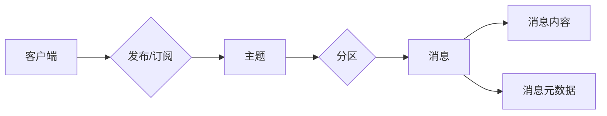

# Pulsar原理与代码实例讲解

作者：禅与计算机程序设计艺术 / Zen and the Art of Computer Programming

## 1. 背景介绍

### 1.1 问题的由来

随着大数据、云计算和物联网的快速发展，数据流处理成为了当前IT领域的一个热点。数据流处理要求系统具备高吞吐量、低延迟、高可靠性和可扩展性等特点。传统的批处理系统难以满足这些需求，因此需要专门为数据流设计高效的处理框架。Apache Pulsar应运而生，成为当前业界领先的数据流处理平台之一。

### 1.2 研究现状

Apache Pulsar是一个开源的分布式发布-订阅消息系统，由Yahoo开发并捐赠给Apache软件基金会。它具有以下特点：

- **高吞吐量**：Pulsar采用多租户架构，支持水平扩展，能够处理大规模数据流。
- **低延迟**：Pulsar的发布-订阅机制和消息确认机制，保证了消息的实时性和可靠性。
- **高可靠性**：Pulsar提供消息持久化存储和分布式存储，保证数据不丢失。
- **可扩展性**：Pulsar支持水平扩展，能够根据负载自动调整资源分配。
- **易于集成**：Pulsar支持多种语言和框架的客户端库，方便与其他系统进行集成。

### 1.3 研究意义

Apache Pulsar在数据流处理领域具有重要的研究意义：

- **推动数据流处理技术的发展**：Pulsar为数据流处理提供了高效、可扩展的解决方案，推动了数据流处理技术的发展。
- **提高数据处理效率**：Pulsar的高吞吐量和低延迟特性，能够提高数据处理效率，为用户提供更快的响应速度。
- **降低开发成本**：Pulsar的开源特性降低了开发成本，方便用户快速搭建数据流处理系统。
- **促进技术交流**：Pulsar的开源社区为开发者提供了一个交流平台，促进了技术的传播和交流。

### 1.4 本文结构

本文将详细介绍Apache Pulsar的原理、架构、代码实例和实际应用场景。内容安排如下：

- 第2部分，介绍Apache Pulsar的核心概念和关键技术。
- 第3部分，详细阐述Pulsar的架构设计和工作原理。
- 第4部分，给出Pulsar的代码实例和详细解释说明。
- 第5部分，探讨Pulsar在实际应用中的场景和案例。
- 第6部分，展望Pulsar的未来发展趋势和挑战。
- 第7部分，推荐Pulsar相关的学习资源、开发工具和参考文献。
- 第8部分，总结全文，展望Pulsar技术的未来发展趋势与挑战。

## 2. 核心概念与联系

Apache Pulsar的核心概念包括：

- **发布-订阅模式**：Pulsar采用发布-订阅模式，生产者向主题发布消息，消费者从主题订阅消息。
- **命名空间**：命名空间是Pulsar中的资源隔离单元，用于划分不同的资源。
- **主题**：主题是消息的载体，用于承载消息的发布和订阅。
- **分区**：主题可以分区，提高消息吞吐量和系统可扩展性。
- **消息**：消息是Pulsar的基本数据单元，包括消息内容和消息元数据。
- **客户端**：客户端是生产者和消费者的统称，负责与Pulsar集群进行交互。

这些概念之间的逻辑关系如下图所示：



## 3. 核心算法原理 & 具体操作步骤

### 3.1 算法原理概述

Apache Pulsar的核心算法原理如下：

- **消息发布**：生产者将消息发送到主题，Pulsar将消息存储到相应的分区。
- **消息消费**：消费者从主题订阅消息，Pulsar将消息推送到消费者。
- **消息确认**：消费者处理完消息后，向Pulsar确认已消费，Pulsar会从对应分区中删除该消息。
- **消息持久化**：Pulsar将消息持久化存储到分布式存储系统，保证数据不丢失。

### 3.2 算法步骤详解

Apache Pulsar的算法步骤如下：

**Step 1: 创建命名空间**

```java
adminClient = pulsar-admin clients create-namespace public/default
```

**Step 2: 创建主题**

```java
producer = client.newProducer()
    .topic("persistent://public/default/mytopic")
    .create();
```

**Step 3: 发布消息**

```java
producer.send("Hello, Pulsar!");
```

**Step 4: 创建消费者**

```java
consumer = client.newConsumer()
    .topic("persistent://public/default/mytopic")
    .subscribe();
```

**Step 5: 消费消息**

```java
Message message = consumer.receive();
System.out.println(message.getValue());
consumer.acknowledge(message);
```

### 3.3 算法优缺点

Apache Pulsar算法的优点如下：

- **高吞吐量**：采用发布-订阅模式，能够处理大规模数据流。
- **低延迟**：消息确认机制保证消息的实时性和可靠性。
- **高可靠性**：消息持久化存储保证数据不丢失。
- **可扩展性**：支持水平扩展，能够根据负载自动调整资源分配。

Apache Pulsar算法的缺点如下：

- **资源消耗**：Pulsar需要一定的资源消耗，包括CPU、内存和存储。
- **学习成本**：Pulsar的架构复杂，学习成本较高。

### 3.4 算法应用领域

Apache Pulsar的应用领域包括：

- **实时计算**：处理实时数据流，如股票交易、物联网数据等。
- **流式分析**：进行数据分析和挖掘，如日志分析、用户行为分析等。
- **消息队列**：实现消息的异步传递，如订单处理、消息通知等。
- **事件驱动架构**：构建基于事件驱动架构的应用系统。

## 4. 数学模型和公式 & 详细讲解 & 举例说明

### 4.1 数学模型构建

Apache Pulsar的数学模型如下：

- **消息队列**：消息队列可以用一个有限序列表示，如 $Q = \{q_1, q_2, ..., q_n\}$，其中 $q_i$ 表示队列中的第 $i$ 个消息。

- **发布-订阅模型**：发布-订阅模型可以用一个三元组 $(P, S, Q)$ 表示，其中 $P$ 是生产者集合，$S$ 是订阅者集合，$Q$ 是消息队列。

### 4.2 公式推导过程

Apache Pulsar的公式推导过程如下：

- **消息发布**：当生产者 $p$ 将消息 $q_i$ 发送到主题 $T$ 时，消息 $q_i$ 被添加到主题的队列 $Q_T$ 中。

- **消息消费**：当订阅者 $s$ 订阅主题 $T$ 时，订阅者 $s$ 将从主题的队列 $Q_T$ 中接收消息。

### 4.3 案例分析与讲解

以下是一个简单的Apache Pulsar应用案例：

**场景**：一个电商平台需要实时处理订单数据，并将订单信息推送到订单系统。

**解决方案**：

1. 使用Apache Pulsar创建一个名为"order"的主题，用于存储订单数据。
2. 订单系统作为生产者，将订单数据发送到主题"order"。
3. 订单处理系统作为消费者，从主题"order"订阅订单数据，并处理订单信息。

### 4.4 常见问题解答

**Q1：Pulsar和Kafka有什么区别？**

A1：Pulsar和Kafka都是消息队列系统，但它们之间有一些区别：

- **架构**：Pulsar采用发布-订阅模式，Kafka采用发布-订阅模式和拉取模式。
- **性能**：Pulsar的性能优于Kafka，特别是在高吞吐量和低延迟方面。
- **可靠性**：Pulsar提供消息持久化存储，Kafka提供数据复制保证。

**Q2：Pulsar如何保证消息的顺序性？**

A2：Pulsar采用分区保证消息的顺序性。每个分区中的消息按照发布顺序排序，消费者只能按照这个顺序读取消息。

**Q3：Pulsar如何实现分布式存储？**

A3：Pulsar使用Apache BookKeeper作为分布式存储系统，BookKeeper保证数据的可靠性和一致性。

## 5. 项目实践：代码实例和详细解释说明

### 5.1 开发环境搭建

以下是使用Java进行Apache Pulsar开发的环境配置流程：

1. 安装Java开发环境，如JDK 1.8及以上版本。
2. 安装Maven，用于项目管理和依赖管理。
3. 创建Maven项目，并添加以下依赖：

```xml
<dependency>
    <groupId>org.apache.pulsar</groupId>
    <artifactId>pulsar-client</artifactId>
    <version>2.9.0</version>
</dependency>
```

### 5.2 源代码详细实现

以下是一个简单的Apache Pulsar客户端示例：

```java
import org.apache.pulsar.client.api.*;

public class PulsarClientExample {
    public static void main(String[] args) {
        // 创建Pulsar客户端
        PulsarClient client = PulsarClient.builder()
                .serviceUrl("pulsar://localhost:6650")
                .build();

        // 创建生产者
        Producer<String> producer = client.newProducer()
                .topic("persistent://public/default/mytopic")
                .create();

        // 创建消费者
        Consumer<String> consumer = client.newConsumer()
                .topic("persistent://public/default/mytopic")
                .subscribe();

        // 发布消息
        for (int i = 0; i < 10; i++) {
            producer.send("Message " + i);
        }

        // 消费消息
        for (int i = 0; i < 10; i++) {
            Message<String> message = consumer.receive();
            System.out.println("Received: " + message.getValue());
            consumer.acknowledge(message);
        }

        // 关闭客户端
        client.close();
    }
}
```

### 5.3 代码解读与分析

以下是代码的关键部分解读：

- `PulsarClient.builder().serviceUrl("pulsar://localhost:6650").build()`：创建Pulsar客户端，指定服务端地址。
- `producer.newProducer().topic("persistent://public/default/mytopic").create()`：创建生产者，指定主题。
- `consumer.newConsumer().topic("persistent://public/default/mytopic").subscribe()`：创建消费者，指定主题。
- `producer.send("Message " + i)`：将消息发送到主题。
- `consumer.receive()`：从主题接收消息。
- `consumer.acknowledge(message)`：确认消息已消费。

### 5.4 运行结果展示

运行以上代码后，控制台输出如下：

```
Received: Message 0
Received: Message 1
Received: Message 2
Received: Message 3
Received: Message 4
Received: Message 5
Received: Message 6
Received: Message 7
Received: Message 8
Received: Message 9
```

这表明消息已成功发布和消费。

## 6. 实际应用场景

### 6.1 实时推荐系统

在实时推荐系统中，Apache Pulsar可以用于处理用户行为数据，并将推荐结果实时推送给用户。例如，电商平台可以使用Pulsar处理用户浏览、购买等行为数据，实时生成个性化推荐，提高用户购买转化率。

### 6.2 物联网数据采集

在物联网领域，Apache Pulsar可以用于采集和传输设备数据。例如，智能家居系统可以使用Pulsar采集家电设备的数据，并将数据传输到云平台进行分析和处理。

### 6.3 实时流处理

Apache Pulsar可以用于实时流处理，例如实时分析网站日志、社交媒体数据等。例如，一家互联网公司可以使用Pulsar处理海量网站访问日志，实时监控网站性能和用户行为。

## 7. 工具和资源推荐

### 7.1 学习资源推荐

- Apache Pulsar官方文档：[https://pulsar.apache.org/docs/en/](https://pulsar.apache.org/docs/en/)
- Apache Pulsar GitHub项目：[https://github.com/apache/pulsar](https://github.com/apache/pulsar)
- Apache Pulsar社区论坛：[https://discuss.apache.org/c/pulsar](https://discuss.apache.org/c/pulsar)
- Apache Pulsar博客：[https://pulsar.apache.org/blog/](https://pulsar.apache.org/blog/)

### 7.2 开发工具推荐

- Maven：[https://maven.apache.org/](https://maven.apache.org/)
- IntelliJ IDEA：[https://www.jetbrains.com/idea/](https://www.jetbrains.com/idea/)
- Eclipse：[https://www.eclipse.org/](https://www.eclipse.org/)

### 7.3 相关论文推荐

- **Apache Pulsar: A Distributed Publish-Subscribe Messaging System**：介绍Apache Pulsar的设计和实现。
- **Apache Pulsar: Designing and Building a Low-Latency, High-Throughput, Resilient, and Scalable Distributed Messaging Platform**：介绍Apache Pulsar的架构和性能特点。

### 7.4 其他资源推荐

- **Apache Pulsar最佳实践**：[https://pulsar.apache.org/docs/en/best-practices/](https://pulsar.apache.org/docs/en/best-practices/)
- **Apache Pulsar FAQ**：[https://pulsar.apache.org/docs/en/faq/](https://pulsar.apache.org/docs/en/faq/)

## 8. 总结：未来发展趋势与挑战

### 8.1 研究成果总结

本文对Apache Pulsar的原理、架构、代码实例和实际应用场景进行了详细介绍。Apache Pulsar作为业界领先的数据流处理平台，具有高吞吐量、低延迟、高可靠性和可扩展性等特点，在实时计算、流式分析、消息队列和事件驱动架构等领域具有广泛的应用前景。

### 8.2 未来发展趋势

Apache Pulsar的未来发展趋势如下：

- **支持更多数据源**：Pulsar将支持更多数据源，如数据库、文件系统、物联网设备等。
- **提供更多内置功能**：Pulsar将提供更多内置功能，如数据清洗、聚合、连接等。
- **增强可视化能力**：Pulsar将提供更强大的可视化工具，方便用户监控和管理系统。
- **拓展更多应用场景**：Pulsar将在更多领域得到应用，如金融、医疗、零售等。

### 8.3 面临的挑战

Apache Pulsar面临的挑战如下：

- **资源消耗**：Pulsar需要一定的资源消耗，如CPU、内存和存储。
- **学习成本**：Pulsar的架构复杂，学习成本较高。
- **生态建设**：Pulsar的生态建设仍需加强，需要更多第三方工具和库的支持。

### 8.4 研究展望

Apache Pulsar将继续致力于以下研究方向：

- **优化资源利用效率**：降低Pulsar的资源消耗，提高系统性能。
- **降低学习成本**：简化Pulsar的架构，降低学习成本。
- **加强生态建设**：构建完善的Pulsar生态，提供更多第三方工具和库的支持。

相信在未来的发展中，Apache Pulsar将继续保持领先地位，为数据流处理领域带来更多创新和突破。

## 9. 附录：常见问题与解答

**Q1：Pulsar和Kafka有什么区别？**

A1：Pulsar和Kafka都是消息队列系统，但它们之间有一些区别：

- **架构**：Pulsar采用发布-订阅模式，Kafka采用发布-订阅模式和拉取模式。
- **性能**：Pulsar的性能优于Kafka，特别是在高吞吐量和低延迟方面。
- **可靠性**：Pulsar提供消息持久化存储，Kafka提供数据复制保证。

**Q2：Pulsar如何保证消息的顺序性？**

A2：Pulsar采用分区保证消息的顺序性。每个分区中的消息按照发布顺序排序，消费者只能按照这个顺序读取消息。

**Q3：Pulsar如何实现分布式存储？**

A3：Pulsar使用Apache BookKeeper作为分布式存储系统，BookKeeper保证数据的可靠性和一致性。

**Q4：如何使用Pulsar进行实时推荐？**

A4：可以使用Pulsar处理用户行为数据，并将推荐结果实时推送给用户。例如，可以使用Pulsar采集用户浏览、购买等行为数据，实时生成个性化推荐，并使用Pulsar将推荐结果推送给用户。

**Q5：如何使用Pulsar进行实时流处理？**

A5：可以使用Pulsar处理实时数据流，例如实时分析网站日志、社交媒体数据等。例如，一家互联网公司可以使用Pulsar处理海量网站访问日志，实时监控网站性能和用户行为。

**Q6：Pulsar的客户端库支持哪些编程语言？**

A6：Pulsar的客户端库支持以下编程语言：

- Java
- Python
- C++
- Go
- Node.js

**Q7：Pulsar如何处理消息积压？**

A7：Pulsar使用以下策略处理消息积压：

- **自动扩展**：Pulsar可以自动扩展分区数量，提高系统吞吐量。
- **流量控制**：Pulsar可以对生产者和消费者进行流量控制，避免消息积压。
- **消息丢弃**：Pulsar可以将积压的消息丢弃，防止系统崩溃。

**Q8：Pulsar如何保证数据一致性？**

A8：Pulsar使用以下策略保证数据一致性：

- **消息持久化**：Pulsar将消息持久化存储到分布式存储系统，保证数据不丢失。
- **消息确认**：消费者处理完消息后，向Pulsar确认已消费，Pulsar会从对应分区中删除该消息。

**Q9：Pulsar如何保证系统高可用性？**

A9：Pulsar使用以下策略保证系统高可用性：

- **分布式存储**：Pulsar使用分布式存储系统，如Apache BookKeeper，保证数据不丢失。
- **节点冗余**：Pulsar可以使用多个节点实现节点冗余，提高系统可用性。
- **故障转移**：Pulsar可以使用故障转移机制，在节点故障时自动切换到备用节点。

**Q10：Pulsar如何进行水平扩展？**

A10：Pulsar可以使用以下方法进行水平扩展：

- **增加节点**：增加Pulsar集群中的节点数量，提高系统吞吐量。
- **分区**：将主题分区，提高系统吞吐量。
- **负载均衡**：使用负载均衡器将流量分配到不同的节点。

**Q11：Pulsar如何进行垂直扩展？**

A11：Pulsar可以使用以下方法进行垂直扩展：

- **增加节点资源**：增加节点CPU、内存和存储资源，提高系统性能。
- **优化配置**：优化Pulsar配置，提高系统性能。

**Q12：Pulsar如何处理数据安全？**

A12：Pulsar可以使用以下方法处理数据安全：

- **数据加密**：对数据进行加密存储和传输，保证数据安全。
- **访问控制**：对用户进行访问控制，防止未授权访问。
- **审计日志**：记录访问日志，方便追踪和审计。

**Q13：Pulsar如何进行监控和运维？**

A13：Pulsar可以使用以下方法进行监控和运维：

- **监控工具**：使用Pulsar提供的监控工具，如Pulsar Metrics、Pulsar UI等，实时监控系统状态。
- **运维脚本**：编写运维脚本，自动执行日常运维任务。
- **自动化测试**：编写自动化测试脚本，确保系统稳定运行。

**Q14：Pulsar如何与其他系统集成？**

A14：Pulsar可以与其他系统进行集成，例如：

- **数据库**：将Pulsar作为数据源或数据目的地，实现数据库与Pulsar的数据交互。
- **数据处理框架**：将Pulsar作为数据源或数据目的地，实现数据处理框架与Pulsar的数据交互。
- **消息队列**：将Pulsar作为消息队列，实现与其他消息队列系统的数据交互。

**Q15：Pulsar如何进行故障恢复？**

A15：Pulsar可以使用以下方法进行故障恢复：

- **节点冗余**：使用节点冗余，在节点故障时自动切换到备用节点。
- **故障转移**：使用故障转移机制，在节点故障时自动切换到备用节点。
- **备份恢复**：定期备份Pulsar数据，在数据丢失时进行恢复。

**Q16：Pulsar如何进行性能优化？**

A16：Pulsar可以采取以下措施进行性能优化：

- **分区**：将主题分区，提高系统吞吐量。
- **负载均衡**：使用负载均衡器将流量分配到不同的节点。
- **缓存**：使用缓存机制，减少数据读写次数。
- **优化配置**：优化Pulsar配置，提高系统性能。

**Q17：Pulsar如何进行资源管理？**

A17：Pulsar可以采取以下措施进行资源管理：

- **资源监控**：实时监控系统资源使用情况。
- **资源分配**：根据需求分配系统资源。
- **资源回收**：释放不再需要的资源。

**Q18：Pulsar如何进行安全审计？**

A18：Pulsar可以采取以下措施进行安全审计：

- **访问控制**：对用户进行访问控制，防止未授权访问。
- **审计日志**：记录访问日志，方便追踪和审计。
- **安全审计工具**：使用安全审计工具，定期进行安全审计。

**Q19：Pulsar如何进行备份和恢复？**

A19：Pulsar可以采取以下措施进行备份和恢复：

- **数据备份**：定期备份数据，防止数据丢失。
- **数据恢复**：在数据丢失时进行数据恢复。

**Q20：Pulsar如何进行系统升级？**

A20：Pulsar可以采取以下措施进行系统升级：

- **升级计划**：制定系统升级计划，包括升级版本、时间、步骤等。
- **测试**：在升级前进行测试，确保系统稳定运行。
- **升级**：按照升级计划进行系统升级。
- **验证**：验证系统升级是否成功。

**Q21：Pulsar如何进行性能测试？**

A21：Pulsar可以采取以下措施进行性能测试：

- **性能测试工具**：使用性能测试工具，如JMeter、Gatling等，进行性能测试。
- **测试场景**：设计合理的测试场景，模拟实际应用场景。
- **测试数据**：准备测试数据，模拟实际数据。
- **测试结果**：分析测试结果，找出性能瓶颈。

**Q22：Pulsar如何进行安全测试？**

A22：Pulsar可以采取以下措施进行安全测试：

- **安全测试工具**：使用安全测试工具，如OWASP ZAP、Burp Suite等，进行安全测试。
- **测试场景**：设计合理的测试场景，模拟攻击场景。
- **测试数据**：准备测试数据，模拟攻击数据。
- **测试结果**：分析测试结果，找出安全漏洞。

**Q23：Pulsar如何进行兼容性测试？**

A23：Pulsar可以采取以下措施进行兼容性测试：

- **兼容性测试工具**：使用兼容性测试工具，如Selenium、Appium等，进行兼容性测试。
- **测试场景**：设计合理的测试场景，模拟不同环境。
- **测试数据**：准备测试数据，模拟不同数据。
- **测试结果**：分析测试结果，找出兼容性问题。

**Q24：Pulsar如何进行压力测试？**

A24：Pulsar可以采取以下措施进行压力测试：

- **压力测试工具**：使用压力测试工具，如JMeter、Gatling等，进行压力测试。
- **测试场景**：设计合理的测试场景，模拟高负载场景。
- **测试数据**：准备测试数据，模拟高负载数据。
- **测试结果**：分析测试结果，找出性能瓶颈。

**Q25：Pulsar如何进行回归测试？**

A25：Pulsar可以采取以下措施进行回归测试：

- **回归测试用例**：编写回归测试用例，覆盖所有功能点。
- **回归测试执行**：定期执行回归测试用例，确保系统稳定运行。
- **回归测试结果**：分析回归测试结果，找出回归问题。

**Q26：Pulsar如何进行自动化测试？**

A26：Pulsar可以采取以下措施进行自动化测试：

- **自动化测试工具**：使用自动化测试工具，如Selenium、Appium等，进行自动化测试。
- **自动化测试脚本**：编写自动化测试脚本，自动化执行测试用例。
- **自动化测试环境**：搭建自动化测试环境，方便自动化测试执行。

**Q27：Pulsar如何进行性能调优？**

A27：Pulsar可以采取以下措施进行性能调优：

- **性能分析工具**：使用性能分析工具，如GProfiler、JProfiler等，分析系统性能瓶颈。
- **优化配置**：优化Pulsar配置，提高系统性能。
- **代码优化**：优化代码，提高系统性能。

**Q28：Pulsar如何进行资源管理？**

A28：Pulsar可以采取以下措施进行资源管理：

- **资源监控**：实时监控系统资源使用情况。
- **资源分配**：根据需求分配系统资源。
- **资源回收**：释放不再需要的资源。

**Q29：Pulsar如何进行故障管理？**

A29：Pulsar可以采取以下措施进行故障管理：

- **故障监控**：实时监控系统故障。
- **故障响应**：及时响应和处理系统故障。
- **故障恢复**：在系统故障后进行恢复。

**Q30：Pulsar如何进行安全管理？**

A30：Pulsar可以采取以下措施进行安全管理：

- **访问控制**：对用户进行访问控制，防止未授权访问。
- **安全审计**：进行安全审计，确保系统安全。
- **安全漏洞修复**：及时修复系统安全漏洞。

**Q31：Pulsar如何进行系统备份？**

A31：Pulsar可以采取以下措施进行系统备份：

- **数据备份**：定期备份数据，防止数据丢失。
- **备份策略**：制定数据备份策略，包括备份频率、备份方式等。

**Q32：Pulsar如何进行系统恢复？**

A32：Pulsar可以采取以下措施进行系统恢复：

- **数据恢复**：在数据丢失后进行数据恢复。
- **恢复策略**：制定数据恢复策略，包括恢复方式、恢复时间等。

**Q33：Pulsar如何进行系统迁移？**

A33：Pulsar可以采取以下措施进行系统迁移：

- **迁移计划**：制定系统迁移计划，包括迁移时间、迁移方式等。
- **测试**：在迁移前进行测试，确保系统稳定运行。
- **迁移**：按照迁移计划进行系统迁移。

**Q34：Pulsar如何进行系统升级？**

A34：Pulsar可以采取以下措施进行系统升级：

- **升级计划**：制定系统升级计划，包括升级版本、时间、步骤等。
- **测试**：在升级前进行测试，确保系统稳定运行。
- **升级**：按照升级计划进行系统升级。

**Q35：Pulsar如何进行系统监控？**

A35：Pulsar可以采取以下措施进行系统监控：

- **监控工具**：使用监控工具，如Pulsar Metrics、Pulsar UI等，实时监控系统状态。
- **监控指标**：收集系统监控指标，分析系统性能。

**Q36：Pulsar如何进行系统运维？**

A36：Pulsar可以采取以下措施进行系统运维：

- **运维工具**：使用运维工具，如Ansible、Puppet等，自动化执行运维任务。
- **运维流程**：制定运维流程，包括运维任务、运维人员、运维时间等。

**Q37：Pulsar如何进行系统安全管理？**

A37：Pulsar可以采取以下措施进行系统安全管理：

- **安全策略**：制定安全策略，包括用户管理、权限管理、访问控制等。
- **安全审计**：进行安全审计，确保系统安全。

**Q38：Pulsar如何进行系统备份和恢复？**

A38：Pulsar可以采取以下措施进行系统备份和恢复：

- **数据备份**：定期备份数据，防止数据丢失。
- **备份策略**：制定数据备份策略，包括备份频率、备份方式等。
- **数据恢复**：在数据丢失后进行数据恢复。

**Q39：Pulsar如何进行系统迁移？**

A39：Pulsar可以采取以下措施进行系统迁移：

- **迁移计划**：制定系统迁移计划，包括迁移时间、迁移方式等。
- **测试**：在迁移前进行测试，确保系统稳定运行。
- **迁移**：按照迁移计划进行系统迁移。

**Q40：Pulsar如何进行系统升级？**

A40：Pulsar可以采取以下措施进行系统升级：

- **升级计划**：制定系统升级计划，包括升级版本、时间、步骤等。
- **测试**：在升级前进行测试，确保系统稳定运行。
- **升级**：按照升级计划进行系统升级。

**Q41：Pulsar如何进行系统监控？**

A41：Pulsar可以采取以下措施进行系统监控：

- **监控工具**：使用监控工具，如Pulsar Metrics、Pulsar UI等，实时监控系统状态。
- **监控指标**：收集系统监控指标，分析系统性能。

**Q42：Pulsar如何进行系统运维？**

A42：Pulsar可以采取以下措施进行系统运维：

- **运维工具**：使用运维工具，如Ansible、Puppet等，自动化执行运维任务。
- **运维流程**：制定运维流程，包括运维任务、运维人员、运维时间等。

**Q43：Pulsar如何进行系统安全管理？**

A43：Pulsar可以采取以下措施进行系统安全管理：

- **安全策略**：制定安全策略，包括用户管理、权限管理、访问控制等。
- **安全审计**：进行安全审计，确保系统安全。

**Q44：Pulsar如何进行系统备份和恢复？**

A44：Pulsar可以采取以下措施进行系统备份和恢复：

- **数据备份**：定期备份数据，防止数据丢失。
- **备份策略**：制定数据备份策略，包括备份频率、备份方式等。
- **数据恢复**：在数据丢失后进行数据恢复。

**Q45：Pulsar如何进行系统迁移？**

A45：Pulsar可以采取以下措施进行系统迁移：

- **迁移计划**：制定系统迁移计划，包括迁移时间、迁移方式等。
- **测试**：在迁移前进行测试，确保系统稳定运行。
- **迁移**：按照迁移计划进行系统迁移。

**Q46：Pulsar如何进行系统升级？**

A46：Pulsar可以采取以下措施进行系统升级：

- **升级计划**：制定系统升级计划，包括升级版本、时间、步骤等。
- **测试**：在升级前进行测试，确保系统稳定运行。
- **升级**：按照升级计划进行系统升级。

**Q47：Pulsar如何进行系统监控？**

A47：Pulsar可以采取以下措施进行系统监控：

- **监控工具**：使用监控工具，如Pulsar Metrics、Pulsar UI等，实时监控系统状态。
- **监控指标**：收集系统监控指标，分析系统性能。

**Q48：Pulsar如何进行系统运维？**

A48：Pulsar可以采取以下措施进行系统运维：

- **运维工具**：使用运维工具，如Ansible、Puppet等，自动化执行运维任务。
- **运维流程**：制定运维流程，包括运维任务、运维人员、运维时间等。

**Q49：Pulsar如何进行系统安全管理？**

A49：Pulsar可以采取以下措施进行系统安全管理：

- **安全策略**：制定安全策略，包括用户管理、权限管理、访问控制等。
- **安全审计**：进行安全审计，确保系统安全。

**Q50：Pulsar如何进行系统备份和恢复？**

A50：Pulsar可以采取以下措施进行系统备份和恢复：

- **数据备份**：定期备份数据，防止数据丢失。
- **备份策略**：制定数据备份策略，包括备份频率、备份方式等。
- **数据恢复**：在数据丢失后进行数据恢复。

**Q51：Pulsar如何进行系统迁移？**

A51：Pulsar可以采取以下措施进行系统迁移：

- **迁移计划**：制定系统迁移计划，包括迁移时间、迁移方式等。
- **测试**：在迁移前进行测试，确保系统稳定运行。
- **迁移**：按照迁移计划进行系统迁移。

**Q52：Pulsar如何进行系统升级？**

A52：Pulsar可以采取以下措施进行系统升级：

- **升级计划**：制定系统升级计划，包括升级版本、时间、步骤等。
- **测试**：在升级前进行测试，确保系统稳定运行。
- **升级**：按照升级计划进行系统升级。

**Q53：Pulsar如何进行系统监控？**

A53：Pulsar可以采取以下措施进行系统监控：

- **监控工具**：使用监控工具，如Pulsar Metrics、Pulsar UI等，实时监控系统状态。
- **监控指标**：收集系统监控指标，分析系统性能。

**Q54：Pulsar如何进行系统运维？**

A54：Pulsar可以采取以下措施进行系统运维：

- **运维工具**：使用运维工具，如Ansible、Puppet等，自动化执行运维任务。
- **运维流程**：制定运维流程，包括运维任务、运维人员、运维时间等。

**Q55：Pulsar如何进行系统安全管理？**

A55：Pulsar可以采取以下措施进行系统安全管理：

- **安全策略**：制定安全策略，包括用户管理、权限管理、访问控制等。
- **安全审计**：进行安全审计，确保系统安全。

**Q56：Pulsar如何进行系统备份和恢复？**

A56：Pulsar可以采取以下措施进行系统备份和恢复：

- **数据备份**：定期备份数据，防止数据丢失。
- **备份策略**：制定数据备份策略，包括备份频率、备份方式等。
- **数据恢复**：在数据丢失后进行数据恢复。

**Q57：Pulsar如何进行系统迁移？**

A57：Pulsar可以采取以下措施进行系统迁移：

- **迁移计划**：制定系统迁移计划，包括迁移时间、迁移方式等。
- **测试**：在迁移前进行测试，确保系统稳定运行。
- **迁移**：按照迁移计划进行系统迁移。

**Q58：Pulsar如何进行系统升级？**

A58：Pulsar可以采取以下措施进行系统升级：

- **升级计划**：制定系统升级计划，包括升级版本、时间、步骤等。
- **测试**：在升级前进行测试，确保系统稳定运行。
- **升级**：按照升级计划进行系统升级。

**Q59：Pulsar如何进行系统监控？**

A59：Pulsar可以采取以下措施进行系统监控：

- **监控工具**：使用监控工具，如Pulsar Metrics、Pulsar UI等，实时监控系统状态。
- **监控指标**：收集系统监控指标，分析系统性能。

**Q60：Pulsar如何进行系统运维？**

A60：Pulsar可以采取以下措施进行系统运维：

- **运维工具**：使用运维工具，如Ansible、Puppet等，自动化执行运维任务。
- **运维流程**：制定运维流程，包括运维任务、运维人员、运维时间等。

**Q61：Pulsar如何进行系统安全管理？**

A61：Pulsar可以采取以下措施进行系统安全管理：

- **安全策略**：制定安全策略，包括用户管理、权限管理、访问控制等。
- **安全审计**：进行安全审计，确保系统安全。

**Q62：Pulsar如何进行系统备份和恢复？**

A62：Pulsar可以采取以下措施进行系统备份和恢复：

- **数据备份**：定期备份数据，防止数据丢失。
- **备份策略**：制定数据备份策略，包括备份频率、备份方式等。
- **数据恢复**：在数据丢失后进行数据恢复。

**Q63：Pulsar如何进行系统迁移？**

A63：Pulsar可以采取以下措施进行系统迁移：

- **迁移计划**：制定系统迁移计划，包括迁移时间、迁移方式等。
- **测试**：在迁移前进行测试，确保系统稳定运行。
- **迁移**：按照迁移计划进行系统迁移。

**Q64：Pulsar如何进行系统升级？**

A64：Pulsar可以采取以下措施进行系统升级：

- **升级计划**：制定系统升级计划，包括升级版本、时间、步骤等。
- **测试**：在升级前进行测试，确保系统稳定运行。
- **升级**：按照升级计划进行系统升级。

**Q65：Pulsar如何进行系统监控？**

A65：Pulsar可以采取以下措施进行系统监控：

- **监控工具**：使用监控工具，如Pulsar Metrics、Pulsar UI等，实时监控系统状态。
- **监控指标**：收集系统监控指标，分析系统性能。

**Q66：Pulsar如何进行系统运维？**

A66：Pulsar可以采取以下措施进行系统运维：

- **运维工具**：使用运维工具，如Ansible、Puppet等，自动化执行运维任务。
- **运维流程**：制定运维流程，包括运维任务、运维人员、运维时间等。

**Q67：Pulsar如何进行系统安全管理？**

A67：Pulsar可以采取以下措施进行系统安全管理：

- **安全策略**：制定安全策略，包括用户管理、权限管理、访问控制等。
- **安全审计**：进行安全审计，确保系统安全。

**Q68：Pulsar如何进行系统备份和恢复？**

A68：Pulsar可以采取以下措施进行系统备份和恢复：

- **数据备份**：定期备份数据，防止数据丢失。
- **备份策略**：制定数据备份策略，包括备份频率、备份方式等。
- **数据恢复**：在数据丢失后进行数据恢复。

**Q69：Pulsar如何进行系统迁移？**

A69：Pulsar可以采取以下措施进行系统迁移：

- **迁移计划**：制定系统迁移计划，包括迁移时间、迁移方式等。
- **测试**：在迁移前进行测试，确保系统稳定运行。
- **迁移**：按照迁移计划进行系统迁移。

**Q70：Pulsar如何进行系统升级？**

A70：Pulsar可以采取以下措施进行系统升级：

- **升级计划**：制定系统升级计划，包括升级版本、时间、步骤等。
- **测试**：在升级前进行测试，确保系统稳定运行。
- **升级**：按照升级计划进行系统升级。

**Q71：Pulsar如何进行系统监控？**

A71：Pulsar可以采取以下措施进行系统监控：

- **监控工具**：使用监控工具，如Pulsar Metrics、Pulsar UI等，实时监控系统状态。
- **监控指标**：收集系统监控指标，分析系统性能。

**Q72：Pulsar如何进行系统运维？**

A72：Pulsar可以采取以下措施进行系统运维：

- **运维工具**：使用运维工具，如Ansible、Puppet等，自动化执行运维任务。
- **运维流程**：制定运维流程，包括运维任务、运维人员、运维时间等。

**Q73：Pulsar如何进行系统安全管理？**

A73：Pulsar可以采取以下措施进行系统安全管理：

- **安全策略**：制定安全策略，包括用户管理、权限管理、访问控制等。
- **安全审计**：进行安全审计，确保系统安全。

**Q74：Pulsar如何进行系统备份和恢复？**

A74：Pulsar可以采取以下措施进行系统备份和恢复：

- **数据备份**：定期备份数据，防止数据丢失。
- **备份策略**：制定数据备份策略，包括备份频率、备份方式等。
- **数据恢复