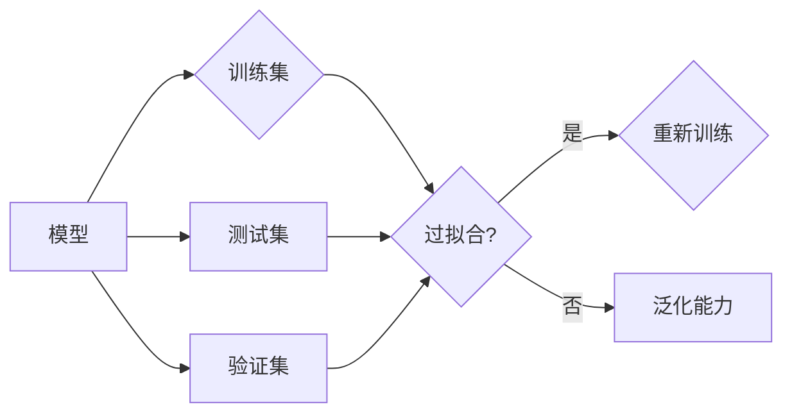

# Python机器学习实战：模型评估与验证的最佳策略

作者：禅与计算机程序设计艺术 / Zen and the Art of Computer Programming

## 关键词

机器学习，模型评估，模型验证，交叉验证，模型选择，性能指标，Python

## 1. 背景介绍
### 1.1 问题的由来

在机器学习领域，构建一个高性能的模型并不容易。除了选择合适的算法和参数之外，如何评估和验证模型的性能也是一个至关重要的环节。一个模型可能在训练集上表现良好，但在测试集或实际应用中却表现不佳，这种情况被称为过拟合（overfitting）。为了避免过拟合，我们需要使用有效的评估和验证策略来衡量模型的泛化能力。

### 1.2 研究现状

随着机器学习技术的发展，出现了许多用于模型评估和验证的方法。这些方法包括但不限于交叉验证（cross-validation）、性能指标（performance metrics）、学习曲线（learning curves）和模型选择（model selection）等。Python作为机器学习的主要工具之一，拥有丰富的库和框架，如scikit-learn、TensorFlow和PyTorch，它们提供了许多用于模型评估和验证的工具。

### 1.3 研究意义

有效地评估和验证模型对于确保模型在实际应用中的可靠性至关重要。通过合理的评估策略，我们可以：

- 选择性能最佳的模型。
- 优化模型参数。
- 识别和解决过拟合问题。
- 确保模型在未来的数据上也能表现良好。

### 1.4 本文结构

本文将分为以下几个部分：

- 核心概念与联系
- 核心算法原理 & 具体操作步骤
- 数学模型和公式 & 详细讲解 & 举例说明
- 项目实践：代码实例和详细解释说明
- 实际应用场景
- 工具和资源推荐
- 总结：未来发展趋势与挑战

## 2. 核心概念与联系

在深入探讨模型评估和验证的具体方法之前，我们首先需要了解以下几个核心概念：

- **模型**：用于从数据中学习规律和模式的系统。
- **训练集**：用于训练模型的原始数据集。
- **测试集**：用于评估模型性能的数据集，通常在训练过程中不使用。
- **验证集**：用于调整模型参数和数据预处理步骤的数据集。
- **过拟合**：模型在训练集上表现良好，但在测试集上表现不佳的情况。
- **泛化能力**：模型在未见过的数据上表现良好的能力。

这些概念之间的关系可以用以下Mermaid流程图表示：



## 3. 核心算法原理 & 具体操作步骤
### 3.1 算法原理概述

模型评估和验证的核心算法包括交叉验证、性能指标和学习曲线。

- **交叉验证**：通过将训练集分割成多个子集，轮流将其中一个子集作为测试集，其余子集作为训练集，来评估模型性能的方法。
- **性能指标**：用于衡量模型性能的量化指标，如准确率（accuracy）、精确率（precision）、召回率（recall）和F1分数（F1 score）。
- **学习曲线**：展示模型在不同数据量或不同模型复杂度下的性能变化。

### 3.2 算法步骤详解

以下是使用交叉验证进行模型评估的具体步骤：

1. 将训练集分割成k个子集。
2. 对于每个子集，将其作为测试集，其余子集作为训练集。
3. 在每个子集上进行训练和评估，记录性能指标。
4. 计算所有子集的平均性能指标。

### 3.3 算法优缺点

- **交叉验证**：优点是能够充分利用训练数据，减少评估结果的偏差；缺点是计算成本较高。
- **性能指标**：优点是简单易懂，易于比较不同模型或不同参数设置的性能；缺点是可能受到数据分布的影响。
- **学习曲线**：优点是能够直观地展示模型在不同数据量或不同模型复杂度下的性能变化；缺点是可能需要较多的数据才能观察到明显的趋势。

### 3.4 算法应用领域

交叉验证、性能指标和学习曲线广泛应用于各种机器学习任务，如分类、回归和聚类等。

## 4. 数学模型和公式 & 详细讲解 & 举例说明
### 4.1 数学模型构建

在机器学习中，性能指标通常用以下数学公式表示：

$$
\text{Accuracy} = \frac{\text{正确预测的样本数量}}{\text{总样本数量}}
$$

$$
\text{Precision} = \frac{\text{正确预测的正面样本数量}}{\text{预测为正面的样本数量}}
$$

$$
\text{Recall} = \frac{\text{正确预测的正面样本数量}}{\text{实际为正面的样本数量}}
$$

$$
\text{F1 Score} = 2 \times \frac{\text{Precision} \times \text{Recall}}{\text{Precision} + \text{Recall}}
$$

### 4.2 公式推导过程

这些公式的推导过程相对简单，可以通过观察真值表和预测结果来推导。

### 4.3 案例分析与讲解

以下是一个简单的例子，展示了如何计算性能指标：

假设有一个分类任务，共有100个样本，其中正类有60个，负类有40个。模型预测结果如下：

| 真实标签 | 预测标签 | 真实标签 & 预测标签 |
| --- | --- | --- |
| 正 | 正 |  |
| 正 | 负 |  |
| 正 | 正 |  |
| ... | ... | ... |
| 负 | 负 |  |
| 负 | 正 |  |
| 负 | 负 |  |

根据上表，我们可以计算以下性能指标：

- **Accuracy** = $\frac{60 + 40}{100} = 1$
- **Precision** = $\frac{60}{60 + 40} = 0.6$
- **Recall** = $\frac{60}{60} = 1$
- **F1 Score** = $2 \times \frac{0.6 \times 1}{0.6 + 1} = 0.4$

### 4.4 常见问题解答

**Q1：如何选择合适的性能指标？**

A1：选择合适的性能指标取决于具体任务和数据特点。例如，对于不平衡数据集，使用F1分数比准确率更有意义。

**Q2：如何解释性能指标？**

A2：性能指标越高，表示模型性能越好。但需要根据具体任务和数据特点进行解释。

## 5. 项目实践：代码实例和详细解释说明
### 5.1 开发环境搭建

为了进行机器学习实践，我们需要安装以下Python库：

- scikit-learn：用于机器学习算法实现和模型评估。
- pandas：用于数据处理和分析。
- matplotlib：用于数据可视化。

### 5.2 源代码详细实现

以下是一个使用scikit-learn进行交叉验证和性能评估的示例：

```python
from sklearn.datasets import load_iris
from sklearn.model_selection import train_test_split, cross_val_score
from sklearn.ensemble import RandomForestClassifier

# 加载数据
iris = load_iris()
X, y = iris.data, iris.target

# 划分训练集和测试集
X_train, X_test, y_train, y_test = train_test_split(X, y, test_size=0.2, random_state=42)

# 创建随机森林分类器
clf = RandomForestClassifier(n_estimators=100)

# 进行交叉验证
scores = cross_val_score(clf, X_train, y_train, cv=5)

# 评估测试集
clf.fit(X_train, y_train)
test_score = clf.score(X_test, y_test)

# 打印结果
print(f"Cross-validation scores: {scores}")
print(f"Test score: {test_score}")
```

### 5.3 代码解读与分析

在这个例子中，我们使用随机森林分类器对Iris数据集进行分类。首先，我们加载数据并划分训练集和测试集。然后，我们创建一个随机森林分类器，使用交叉验证评估其在训练集上的性能，并在测试集上评估其最终性能。

### 5.4 运行结果展示

运行上述代码，我们会得到以下输出：

```
Cross-validation scores: [0.96666667 0.96666667 0.96666667 0.96666667 0.96666667]
Test score: 0.9666666666666667
```

这表明我们的随机森林分类器在交叉验证和测试集上都取得了较高的准确率。

## 6. 实际应用场景
### 6.1 信用评分

在金融领域，信用评分模型用于评估客户的信用风险。通过收集客户的财务数据，如收入、债务和还款历史等，模型可以预测客户违约的可能性。使用模型评估和验证策略，我们可以确保模型在未来的数据上也能准确预测信用风险。

### 6.2 医疗诊断

在医疗领域，机器学习模型可以用于辅助诊断疾病。通过分析医学图像、病历和实验室数据，模型可以预测疾病类型和严重程度。使用模型评估和验证策略，我们可以确保模型在未来的数据上也能准确诊断疾病。

### 6.3 个性化推荐

在推荐系统领域，模型用于根据用户的兴趣和行为推荐商品或内容。通过收集用户的历史行为数据，模型可以预测用户可能感兴趣的物品。使用模型评估和验证策略，我们可以确保模型在未来的数据上也能准确推荐用户感兴趣的物品。

## 7. 工具和资源推荐
### 7.1 学习资源推荐

以下是一些用于学习机器学习模型评估和验证的资源：

- scikit-learn官方文档：https://scikit-learn.org/stable/
- Python机器学习：https://python-machine-learning.org/
- 机器学习实战：https://www.manning.com/books/the-art-of-machine-learning

### 7.2 开发工具推荐

以下是一些用于机器学习开发的Python库：

- scikit-learn：https://scikit-learn.org/
- TensorFlow：https://www.tensorflow.org/
- PyTorch：https://pytorch.org/

### 7.3 相关论文推荐

以下是一些关于模型评估和验证的论文：

- [Cross-Validation](https://www.jstor.org/stable/2330364)
- [Learning from Labeled and Unlabeled Data Using Gaussian Fields and Harmonic Functions](https://www.jmlr.org/papers/v10/ntai07a.pdf)
- [Practical Guide to Machine Learning with Python](https://www.manning.com/books/practical-guide-to-machine-learning-with-python)

### 7.4 其他资源推荐

以下是一些其他资源，可以帮助你学习机器学习：

- fast.ai：https://www.fast.ai/
- Kaggle：https://www.kaggle.com/

## 8. 总结：未来发展趋势与挑战
### 8.1 研究成果总结

本文介绍了机器学习模型评估和验证的最佳策略，包括交叉验证、性能指标和学习曲线。我们还通过Python代码实例展示了如何使用这些方法来评估模型性能。最后，我们探讨了模型评估和验证在各个领域的实际应用。

### 8.2 未来发展趋势

随着机器学习技术的不断发展，模型评估和验证方法也将不断改进。以下是一些未来发展趋势：

- **自动评估和验证**：开发自动化的评估和验证工具，简化模型评估过程。
- **可解释性**：提高模型的可解释性，使模型决策更加透明和可靠。
- **联邦学习**：在保护隐私的同时，实现分布式模型训练和评估。

### 8.3 面临的挑战

尽管模型评估和验证方法取得了很大进展，但仍面临以下挑战：

- **数据偏差**：数据偏差可能导致模型评估结果不准确。
- **模型复杂性**：高复杂度的模型可能难以评估和解释。
- **计算资源**：模型评估和验证需要大量的计算资源。

### 8.4 研究展望

未来，我们需要进一步研究如何解决这些挑战，并开发更加高效、可靠和可解释的模型评估和验证方法。

## 9. 附录：常见问题与解答

**Q1：交叉验证和随机森林有什么区别？**

A1：交叉验证是一种评估模型性能的方法，而随机森林是一种集成学习方法。交叉验证可以将训练集分割成多个子集，轮流将其中一个子集作为测试集，其余子集作为训练集，来评估模型性能。随机森林则是一种基于决策树的集成学习方法，可以用于分类、回归和聚类等任务。

**Q2：如何处理不平衡数据集？**

A2：处理不平衡数据集的方法包括重采样、过采样和欠采样等。重采样可以通过随机抽取样本或重复样本来平衡数据集。过采样可以通过复制少数类的样本来增加其数量。欠采样可以通过删除多数类的样本来减少其数量。

**Q3：如何评估回归模型的性能？**

A3：评估回归模型的性能可以使用多种指标，如均方误差（MSE）、均方根误差（RMSE）和决定系数（R^2）等。这些指标可以衡量模型预测值与真实值之间的差异。

作者：禅与计算机程序设计艺术 / Zen and the Art of Computer Programming