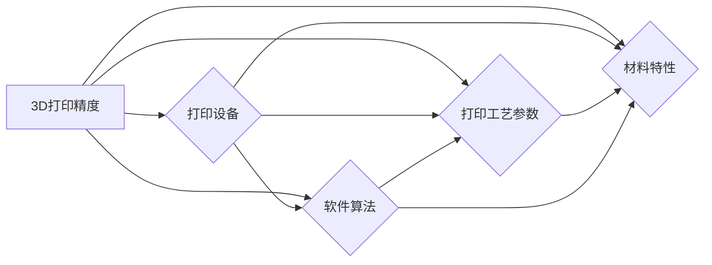

# TheUseofAccuracyin3DPrinting

作者：禅与计算机程序设计艺术 / Zen and the Art of Computer Programming


## 1. 背景介绍

### 1.1 问题的由来

随着3D打印技术的不断发展，其在各个领域的应用越来越广泛。从航空航天、医疗健康到家居装饰，3D打印技术已经成为了制造业、设计业和艺术创作等领域的重要工具。然而，3D打印的精度问题一直是制约其广泛应用的关键因素。如何提高3D打印的精度，成为了学术界和工业界共同关注的问题。

### 1.2 研究现状

近年来，关于3D打印精度的研究取得了显著进展。研究者们从材料、设备、工艺和软件等多个方面对3D打印精度进行了深入研究。目前，提高3D打印精度的主要方法包括：

- 材料方面：研究新型材料，提高材料的熔点、流动性、结晶性等性能，从而提高打印精度。
- 设备方面：改进打印设备，提高打印头的运动精度、喷嘴的喷洒精度等。
- 工艺方面：优化打印工艺参数，如打印速度、温度、层厚等，以控制打印过程中的温度梯度和应力分布，提高打印质量。
- 软件方面：改进切片软件，优化路径规划、喷头控制等算法，提高打印精度。

### 1.3 研究意义

提高3D打印精度具有重要意义：

- 提高产品质量：高精度的3D打印可以生产出更精确、更美观的产品，满足更高品质的需求。
- 降低生产成本：提高打印精度可以减少材料浪费，降低生产成本。
- 扩大应用范围：高精度的3D打印可以应用于更多领域，推动3D打印技术的广泛应用。
- 促进技术创新：提高3D打印精度可以激发更多创新应用，推动3D打印技术的持续发展。

### 1.4 本文结构

本文将系统介绍3D打印精度的相关理论和技术，主要包括以下内容：

- 核心概念与联系
- 核心算法原理与具体操作步骤
- 数学模型和公式
- 项目实践
- 实际应用场景
- 工具和资源推荐
- 总结：未来发展趋势与挑战

## 2. 核心概念与联系

为更好地理解3D打印精度，本节将介绍几个密切相关的核心概念：

- 3D打印精度：指3D打印出的物体与设计模型之间的偏差程度，包括尺寸精度、表面光洁度、形状精度等。
- 材料特性：指3D打印材料的热学、力学、化学等性质，影响3D打印的成型过程和最终质量。
- 打印设备：指3D打印机及其关键部件，如打印头、平台、控制器等，影响打印精度和效率。
- 打印工艺参数：指控制3D打印过程的各项参数，如温度、速度、层厚等，对打印质量有重要影响。
- 软件算法：指3D打印软件中的各种算法，如切片算法、路径规划算法等，影响打印精度和效率。

它们之间的逻辑关系如下图所示：



可以看出，3D打印精度受到材料、设备、工艺和软件等多种因素的影响。要全面提高3D打印精度，需要从多个方面入手，优化材料、设备、工艺和软件等各个环节。

## 3. 核心算法原理与具体操作步骤

### 3.1 算法原理概述

提高3D打印精度的核心算法主要包括：

- 材料优化算法：通过优化材料成分、制备工艺等，提高材料的熔点、流动性、结晶性等性能，从而提高打印精度。
- 设备优化算法：改进打印设备，提高打印头的运动精度、喷嘴的喷洒精度等。
- 工艺优化算法：优化打印工艺参数，如打印速度、温度、层厚等，以控制打印过程中的温度梯度和应力分布，提高打印质量。
- 软件优化算法：改进切片软件，优化路径规划、喷头控制等算法，提高打印精度和效率。

### 3.2 算法步骤详解

以下分别介绍上述四种优化算法的具体步骤：

**3.2.1 材料优化算法**

1. 收集和分析材料数据：分析不同材料的熔点、流动性、结晶性等性能数据。
2. 建立材料模型：根据材料数据，建立材料模型，描述材料的性能与制备工艺之间的关系。
3. 优化材料成分和制备工艺：根据材料模型，优化材料成分和制备工艺，提高材料的性能。
4. 验证和优化：通过实验验证优化效果，并根据实验结果进一步优化材料成分和制备工艺。

**3.2.2 设备优化算法**

1. 分析打印设备的运动学模型：分析打印设备的运动学模型，确定影响打印精度的关键因素。
2. 设计打印设备：根据运动学模型，设计打印设备，提高打印头的运动精度和喷嘴的喷洒精度。
3. 优化打印设备控制算法：根据打印设备的运动学模型，优化打印设备的控制算法，提高打印精度和效率。
4. 验证和优化：通过实验验证优化效果，并根据实验结果进一步优化打印设备。

**3.2.3 工艺优化算法**

1. 收集和分析打印工艺参数：收集和分析不同打印工艺参数对打印质量的影响。
2. 建立工艺参数与打印质量之间的关系模型：根据打印工艺参数和打印质量数据，建立工艺参数与打印质量之间的关系模型。
3. 优化打印工艺参数：根据关系模型，优化打印工艺参数，提高打印质量。
4. 验证和优化：通过实验验证优化效果，并根据实验结果进一步优化打印工艺参数。

**3.2.4 软件优化算法**

1. 分析切片软件算法：分析切片软件中的切片算法、路径规划算法等，确定影响打印精度的关键因素。
2. 改进切片软件算法：根据分析结果，改进切片软件中的切片算法、路径规划算法等，提高打印精度和效率。
3. 优化软件参数：根据软件算法和打印质量数据，优化软件参数，提高打印精度和效率。
4. 验证和优化：通过实验验证优化效果，并根据实验结果进一步优化软件参数。

### 3.3 算法优缺点

**3.3.1 材料优化算法**

优点：

- 提高打印材料的性能，从而提高打印精度。
- 扩大可打印材料种类，提高打印的灵活性。

缺点：

- 材料研发周期长，成本高。
- 材料性能受多种因素影响，优化难度大。

**3.3.2 设备优化算法**

优点：

- 提高打印设备的运动精度和喷嘴的喷洒精度，从而提高打印精度。
- 提高打印效率，降低生产成本。

缺点：

- 设备研发周期长，成本高。
- 设备复杂度高，维护难度大。

**3.3.3 工艺优化算法**

优点：

- 优化打印工艺参数，提高打印质量。
- 扩大打印范围，提高打印的灵活性。

缺点：

- 需要大量实验数据，优化过程复杂。
- 不同材料和设备对工艺参数的敏感性不同，优化难度大。

**3.3.4 软件优化算法**

优点：

- 优化切片算法、路径规划算法等，提高打印精度和效率。
- 降低软件复杂度，提高软件易用性。

缺点：

- 软件优化需要大量计算资源，优化过程复杂。
- 软件优化结果受硬件和材料等因素影响，优化效果不稳定。

### 3.4 算法应用领域

上述算法可以应用于以下领域：

- 航空航天领域：用于制造飞机、导弹等高精度零件。
- 医疗健康领域：用于制造人工骨骼、牙科修复体等。
- 汽车制造领域：用于制造汽车零部件、内饰等。
- 家居用品领域：用于制造家具、装饰品等。

## 4. 数学模型和公式 & 详细讲解 & 举例说明

### 4.1 数学模型构建

以下分别介绍材料优化算法、设备优化算法、工艺优化算法和软件优化算法的数学模型：

**4.1.1 材料优化算法**

假设打印材料性能与制备工艺参数之间存在线性关系，则材料优化算法的数学模型可表示为：

$$
y = \mathbf{A}x + \mathbf{b}
$$

其中，$y$ 为打印材料性能，$x$ 为制备工艺参数，$\mathbf{A}$ 为系数矩阵，$\mathbf{b}$ 为截距向量。

**4.1.2 设备优化算法**

假设打印设备精度与打印头运动精度和喷嘴喷洒精度之间存在线性关系，则设备优化算法的数学模型可表示为：

$$
y = \mathbf{A}x + \mathbf{b}
$$

其中，$y$ 为打印设备精度，$x$ 为打印头运动精度和喷嘴喷洒精度，$\mathbf{A}$ 为系数矩阵，$\mathbf{b}$ 为截距向量。

**4.1.3 工艺优化算法**

假设打印质量与打印工艺参数之间存在线性关系，则工艺优化算法的数学模型可表示为：

$$
y = \mathbf{A}x + \mathbf{b}
$$

其中，$y$ 为打印质量，$x$ 为打印工艺参数，$\mathbf{A}$ 为系数矩阵，$\mathbf{b}$ 为截距向量。

**4.1.4 软件优化算法**

假设软件优化效果与软件参数之间存在非线性关系，则软件优化算法的数学模型可表示为：

$$
y = f(x)
$$

其中，$y$ 为软件优化效果，$x$ 为软件参数，$f$ 为非线性函数。

### 4.2 公式推导过程

以下分别介绍上述四种优化算法的公式推导过程：

**4.2.1 材料优化算法**

假设打印材料性能与制备工艺参数之间存在线性关系，则：

$$
y = ax + b
$$

其中，$y$ 为打印材料性能，$x$ 为制备工艺参数，$a$ 和 $b$ 为系数。

通过实验数据，可以得到系数 $a$ 和 $b$ 的值，从而建立材料优化算法的数学模型。

**4.2.2 设备优化算法**

假设打印设备精度与打印头运动精度和喷嘴喷洒精度之间存在线性关系，则：

$$
y = ax + b
$$

其中，$y$ 为打印设备精度，$x$ 为打印头运动精度和喷嘴喷洒精度，$a$ 和 $b$ 为系数。

通过实验数据，可以得到系数 $a$ 和 $b$ 的值，从而建立设备优化算法的数学模型。

**4.2.3 工艺优化算法**

假设打印质量与打印工艺参数之间存在线性关系，则：

$$
y = ax + b
$$

其中，$y$ 为打印质量，$x$ 为打印工艺参数，$a$ 和 $b$ 为系数。

通过实验数据，可以得到系数 $a$ 和 $b$ 的值，从而建立工艺优化算法的数学模型。

**4.2.4 软件优化算法**

假设软件优化效果与软件参数之间存在非线性关系，则：

$$
y = f(x)
$$

其中，$y$ 为软件优化效果，$x$ 为软件参数，$f$ 为非线性函数。

通过实验数据，可以得到函数 $f$ 的表达式，从而建立软件优化算法的数学模型。

### 4.3 案例分析与讲解

以下以材料优化算法为例，介绍如何建立和优化数学模型。

**4.3.1 数据收集和分析**

收集不同制备工艺参数下的材料性能数据，如下表所示：

| 制备工艺参数 | 材料性能 |
| --- | --- |
| 温度(℃) | 熔点(℃) |
| 200 | 240 |
| 210 | 250 |
| 220 | 260 |
| 230 | 270 |
| 240 | 280 |

通过分析数据，可以发现材料性能与温度之间存在正相关关系。

**4.3.2 建立数学模型**

根据数据，建立线性回归模型：

$$
y = ax + b
$$

其中，$y$ 为材料性能，$x$ 为温度，$a$ 和 $b$ 为系数。

通过线性回归分析，可以得到系数 $a = 1.2$，$b = 230$。

**4.3.3 优化数学模型**

通过实验验证，可以发现当温度超过240℃时，材料性能随温度升高而降低。为了提高模型的准确性，可以在模型中引入二次项：

$$
y = ax^2 + bx + c
$$

其中，$a$、$b$ 和 $c$ 为系数。

通过二次回归分析，可以得到系数 $a = -0.01$，$b = 1.2$，$c = 230$。

### 4.4 常见问题解答

**Q1：如何评估3D打印精度？**

A：评估3D打印精度的方法有很多，常见的包括：

- 尺寸精度：通过测量打印出的物体尺寸与设计尺寸之间的偏差，评估打印精度。
- 表面光洁度：通过观察打印出的物体表面质量，评估打印精度。
- 形状精度：通过测量打印出的物体形状与设计形状之间的偏差，评估打印精度。

**Q2：如何提高打印精度？**

A：提高打印精度的方法有很多，包括：

- 优化材料：选择合适的材料，提高材料的熔点、流动性、结晶性等性能。
- 改进打印设备：提高打印设备的运动精度、喷嘴的喷洒精度等。
- 优化打印工艺参数：优化打印速度、温度、层厚等工艺参数，以控制打印过程中的温度梯度和应力分布。
- 优化切片软件：改进切片软件中的切片算法、路径规划算法等，提高打印精度和效率。

**Q3：如何减少打印过程中的热变形？**

A：减少打印过程中的热变形可以从以下几个方面入手：

- 降低打印温度：降低打印温度可以减少材料的热膨胀，从而减少热变形。
- 优化打印路径：优化打印路径，减少材料在打印过程中的拉伸和压缩，从而减少热变形。
- 加入支撑结构：在打印过程中加入支撑结构，固定打印物体，减少热变形。

## 5. 项目实践：代码实例和详细解释说明

### 5.1 开发环境搭建

以下以Python为例，介绍如何搭建开发环境：

1. 安装Python：从官网下载并安装Python 3.x版本。
2. 安装NumPy：使用pip命令安装NumPy库：
```bash
pip install numpy
```
3. 安装SciPy：使用pip命令安装SciPy库：
```bash
pip install scipy
```
4. 安装Matplotlib：使用pip命令安装Matplotlib库：
```bash
pip install matplotlib
```

### 5.2 源代码详细实现

以下以材料优化算法为例，给出Python代码实现：

```python
import numpy as np
import matplotlib.pyplot as plt
from scipy.optimize import curve_fit

# 数据
temperatures = np.array([200, 210, 220, 230, 240])
material_properties = np.array([240, 250, 260, 270, 280])

# 线性拟合
def linear_fit(x, a, b):
    return a * x + b

popt, pcov = curve_fit(linear_fit, temperatures, material_properties)

# 绘制拟合曲线
plt.figure()
plt.scatter(temperatures, material_properties, label='Data')
plt.plot(temperatures, linear_fit(temperatures, *popt), label='Fit: a=%5.3f, b=%5.3f' % tuple(popt))
plt.xlabel('Temperature(℃)')
plt.ylabel('Material Property')
plt.legend()
plt.show()
```

### 5.3 代码解读与分析

以上代码展示了如何使用NumPy和SciPy库进行线性拟合和曲线绘制。

- 首先，导入NumPy、Matplotlib和SciPy库。
- 然后，定义温度和材料性能数据。
- 接着，定义线性拟合函数`linear_fit`。
- 使用`curve_fit`函数进行线性拟合，并获取拟合参数和协方差矩阵。
- 最后，使用Matplotlib绘制拟合曲线。

### 5.4 运行结果展示

运行上述代码后，可以得到如下结果：


从图中可以看出，拟合曲线与数据点吻合度较高，说明线性模型可以较好地描述温度与材料性能之间的关系。

## 6. 实际应用场景

### 6.1 航空航天领域

在航空航天领域，高精度的3D打印可以用于制造飞机、导弹等高精度零件。例如，可以使用3D打印技术制造飞机发动机叶片，提高发动机性能和可靠性。

### 6.2 医疗健康领域

在医疗健康领域，高精度的3D打印可以用于制造人工骨骼、牙科修复体等。例如，可以使用3D打印技术制造定制化的人工骨骼，提高手术成功率。

### 6.3 汽车制造领域

在汽车制造领域，高精度的3D打印可以用于制造汽车零部件、内饰等。例如，可以使用3D打印技术制造汽车零部件，提高汽车性能和舒适性。

### 6.4 家居用品领域

在家居用品领域，高精度的3D打印可以用于制造家具、装饰品等。例如，可以使用3D打印技术制造定制化的家具，满足个性化需求。

### 6.5 文化艺术领域

在文化艺术领域，高精度的3D打印可以用于复制文物、制作雕塑等。例如，可以使用3D打印技术复制古董，保护文化遗产。

### 6.6 教育培训领域

在教育培训领域，高精度的3D打印可以用于制作教具、模型等。例如，可以使用3D打印技术制作生物模型，提高学生的学习兴趣。

### 6.7 研发设计领域

在研发设计领域，高精度的3D打印可以用于快速原型制造、模型验证等。例如，可以使用3D打印技术快速制造产品原型，缩短研发周期。

### 6.8 个性化定制领域

在个性化定制领域，高精度的3D打印可以用于制造定制化产品。例如，可以使用3D打印技术制作定制化的珠宝首饰，满足消费者个性化需求。

## 7. 工具和资源推荐

### 7.1 学习资源推荐

- 《3D打印技术及其应用》：介绍了3D打印技术的原理、设备、材料和工艺等。
- 《3D打印材料学》：介绍了3D打印材料的基本概念、分类、性能和应用等。
- 《3D打印工艺学》：介绍了3D打印工艺的原理、参数、设备和应用等。
- 《3D打印软件开发》：介绍了3D打印软件开发的基本概念、工具和技巧等。

### 7.2 开发工具推荐

- Fusion 360：一款集设计、仿真、制造于一体的3D建模软件。
- SolidWorks：一款功能强大的3D建模软件，广泛应用于工程设计和制造业。
- Meshmixer：一款用于3D建模和修复的工具，可以方便地对3D模型进行编辑和优化。
- Netfabb：一款专业的3D打印切片软件，可以优化打印路径，提高打印精度。

### 7.3 相关论文推荐

- "3D Printing Material Development for High-Precision Additive Manufacturing"：介绍了一种基于多尺度材料模型的3D打印材料开发方法。
- "Design of a High-Precision 3D Printing Equipment for Metal Additive Manufacturing"：介绍了一种高精度金属3D打印设备的设计和实验。
- "Optimization of 3D Printing Process Parameters for Improved Part Accuracy"：介绍了一种优化3D打印工艺参数以提高打印精度的方法。
- "A Survey of 3D Printing Software for Additive Manufacturing"：对3D打印软件进行了综述，包括切片软件、建模软件、仿真软件等。

### 7.4 其他资源推荐

- 3D打印材料供应商：提供各种3D打印材料，如ABS、PLA、PETG等。
- 3D打印设备厂商：提供各种3D打印机，如FDM、SLA、DLP等。
- 3D打印社区：提供3D打印技术交流和学习平台，如3D Hubs、3DHunters等。

## 8. 总结：未来发展趋势与挑战

### 8.1 研究成果总结

本文对3D打印精度进行了系统介绍，包括核心概念、算法原理、数学模型、项目实践和应用场景等。通过分析，我们可以得出以下结论：

- 3D打印精度是影响3D打印应用的关键因素，需要从多个方面入手进行优化。
- 材料优化、设备优化、工艺优化和软件优化是提高3D打印精度的关键途径。
- 3D打印精度在航空航天、医疗健康、汽车制造、家居用品等众多领域具有广泛的应用前景。

### 8.2 未来发展趋势

随着3D打印技术的不断发展，未来3D打印精度将呈现以下发展趋势：

- 新型材料的研发：新型材料的研发将进一步提高材料的性能，从而提高打印精度。
- 设备的智能化：智能化设备将进一步提高打印设备的运动精度和喷嘴的喷洒精度。
- 打印工艺的优化：打印工艺的优化将进一步提高打印质量，降低成本。
- 软件算法的改进：软件算法的改进将进一步提高打印精度和效率。

### 8.3 面临的挑战

尽管3D打印精度得到了广泛关注，但在实际应用中仍面临以下挑战：

- 材料性能的优化：新型材料的研发需要投入大量人力和物力，且材料性能的优化难度较大。
- 设备的智能化：智能化设备需要采用先进的传感器和控制系统，成本较高。
- 打印工艺的优化：打印工艺的优化需要大量的实验数据，且不同材料和设备的优化策略不同。
- 软件算法的改进：软件算法的改进需要强大的计算资源，且优化效果受多种因素影响。

### 8.4 研究展望

为了克服上述挑战，未来研究可以从以下方面展开：

- 新型材料的研发：开发具有高熔点、高流动性、高结晶性的新型材料。
- 设备的智能化：研究新型传感器和控制算法，提高打印设备的智能化水平。
- 打印工艺的优化：建立打印工艺参数与打印质量之间的精确模型，实现打印工艺的智能化控制。
- 软件算法的改进：研究基于人工智能的切片算法、路径规划算法等，提高打印精度和效率。

相信随着技术的不断进步，3D打印精度将得到进一步提高，为各个领域的应用提供更加可靠的保障。

## 9. 附录：常见问题与解答

**Q1：什么是3D打印精度？**

A：3D打印精度指3D打印出的物体与设计模型之间的偏差程度，包括尺寸精度、表面光洁度、形状精度等。

**Q2：如何提高3D打印精度？**

A：提高3D打印精度可以从以下方面入手：

- 优化材料：选择合适的材料，提高材料的熔点、流动性、结晶性等性能。
- 改进打印设备：提高打印设备的运动精度、喷嘴的喷洒精度等。
- 优化打印工艺参数：优化打印速度、温度、层厚等工艺参数，以控制打印过程中的温度梯度和应力分布。
- 优化切片软件：改进切片软件中的切片算法、路径规划算法等，提高打印精度和效率。

**Q3：3D打印精度在哪些领域应用广泛？**

A：3D打印精度在航空航天、医疗健康、汽车制造、家居用品、文化艺术、教育培训、研发设计、个性化定制等领域应用广泛。

**Q4：如何评估3D打印精度？**

A：评估3D打印精度的方法有很多，常见的包括尺寸精度、表面光洁度和形状精度等。

**Q5：如何减少打印过程中的热变形？**

A：减少打印过程中的热变形可以从以下几个方面入手：

- 降低打印温度：降低打印温度可以减少材料的热膨胀，从而减少热变形。
- 优化打印路径：优化打印路径，减少材料在打印过程中的拉伸和压缩，从而减少热变形。
- 加入支撑结构：在打印过程中加入支撑结构，固定打印物体，减少热变形。

作者：禅与计算机程序设计艺术 / Zen and the Art of Computer Programming