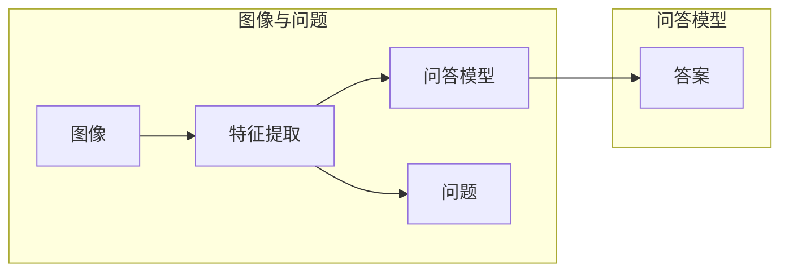

# Visual Question Answering原理与代码实例讲解

作者：禅与计算机程序设计艺术 / Zen and the Art of Computer Programming


## 1. 背景介绍

### 1.1 问题的由来

Visual Question Answering（视觉问答，VQA）是近年来人工智能领域的一个热门研究方向。它旨在让机器通过理解图像和自然语言问题，并给出相应的答案。VQA任务的提出，不仅为自然语言处理（NLP）和计算机视觉（CV）领域提供了新的研究契机，也为构建更加智能的计算机系统提供了技术基础。

### 1.2 研究现状

VQA任务的研究经历了以下几个阶段：

1. **早期阶段**：研究者主要关注如何从图像中提取特征，并结合语言模型进行问答。这一阶段的代表性工作包括VQA-Mini、VQA-C，等。
2. **基于CNN的特征提取**：随着深度学习的发展，卷积神经网络（CNN）在图像特征提取方面取得了显著的成果。研究者开始将CNN与语言模型结合，提出了如VQA-ResNet50等模型。
3. **基于Transformer的模型**：Transformer模型的出现，为VQA任务带来了新的突破。研究者开始将Transformer与CNN结合，提出了如VQA-BERT、VQA-ConvBERT等模型。
4. **多模态融合**：随着VQA任务的不断深入，研究者开始关注图像和语言之间的交互，并提出了多模态融合的方法，如M2M和M2M++。

### 1.3 研究意义

VQA任务具有重要的研究意义：

1. **推动NLP和CV领域的发展**：VQA任务将NLP和CV领域的知识和技术进行整合，促进了两个领域的研究进展。
2. **构建智能系统**：VQA技术可以应用于智能问答系统、智能客服、教育辅助系统等领域，为构建更加智能的计算机系统提供技术支持。
3. **推动人机交互**：VQA技术可以促进人机交互的智能化发展，使得计算机能够更好地理解人类用户的需求。

### 1.4 本文结构

本文将首先介绍VQA任务的核心概念与联系，然后详细阐述VQA任务的核心算法原理、具体操作步骤、数学模型和公式，并通过代码实例讲解VQA任务的实现。最后，我们将探讨VQA任务的实际应用场景、未来应用展望，并推荐相关的学习资源、开发工具和参考文献。

## 2. 核心概念与联系

本节将介绍VQA任务涉及的核心概念，并阐述它们之间的联系。

### 2.1 VQA任务的核心概念

1. **图像**：VQA任务中的图像是输入数据，包含了丰富的视觉信息。
2. **问题**：VQA任务中的问题是需要机器理解和回答的自然语言文本。
3. **答案**：VQA任务中的答案是针对问题的图像上存在的实体、关系或描述。
4. **特征提取**：特征提取是将图像和问题转化为机器可处理的特征表示的过程。
5. **问答模型**：问答模型是将特征表示与答案进行匹配的模型。
6. **训练和推理**：训练是训练问答模型的过程，推理是使用训练好的模型回答问题的过程。

### 2.2 核心概念之间的联系

VQA任务的核心概念之间的联系如下：



## 3. 核心算法原理 & 具体操作步骤

### 3.1 算法原理概述

VQA任务的核心算法包括特征提取、问答模型、训练和推理。

1. **特征提取**：将图像和问题转化为机器可处理的特征表示。
2. **问答模型**：将特征表示与答案进行匹配的模型。
3. **训练**：使用标注数据训练问答模型。
4. **推理**：使用训练好的模型回答问题。

### 3.2 算法步骤详解

1. **特征提取**：使用CNN提取图像特征，使用词嵌入和循环神经网络（RNN）提取问题特征。
2. **问答模型**：使用注意力机制将图像特征和问题特征进行融合，并通过全连接层得到答案。
3. **训练**：使用标注数据进行交叉熵损失函数训练问答模型。
4. **推理**：将问题输入训练好的模型，输出答案。

### 3.3 算法优缺点

VQA任务的核心算法具有以下优点：

1. **融合了图像和语言信息**：能够更好地理解问题和图像之间的关系。
2. **可扩展性强**：可以应用于各种类型的图像和问题。

VQA任务的核心算法也具有以下缺点：

1. **计算复杂度高**：需要大量的计算资源。
2. **对标注数据依赖性强**：需要大量的标注数据。

### 3.4 算法应用领域

VQA任务的核心算法可以应用于以下领域：

1. **智能问答系统**：如智能客服、教育辅助系统等。
2. **智能驾驶**：帮助汽车理解道路情况，回答驾驶员的提问。
3. **医学诊断**：帮助医生理解医学影像，回答患者的提问。

## 4. 数学模型和公式 & 详细讲解 & 举例说明

### 4.1 数学模型构建

VQA任务的数学模型可以表示为：

$$
\hat{y} = f(\mathbf{x}_1, \mathbf{x}_2, \theta)
$$

其中，$\mathbf{x}_1$ 表示图像特征，$\mathbf{x}_2$ 表示问题特征，$\theta$ 表示问答模型的参数，$\hat{y}$ 表示预测的答案。

### 4.2 公式推导过程

假设图像特征 $\mathbf{x}_1$ 由CNN提取，问题特征 $\mathbf{x}_2$ 由RNN提取，问答模型的输出为 $\hat{y}$。则：

$$
\mathbf{x}_1 = \text{CNN}(\mathbf{I})
$$

$$
\mathbf{x}_2 = \text{RNN}(\mathbf{Q})
$$

$$
\hat{y} = \text{Attention}(\mathbf{x}_1, \mathbf{x}_2) \cdot \text{FC}(\mathbf{x}_1, \mathbf{x}_2, \theta)
$$

其中，$\text{Attention}$ 表示注意力机制，$\text{FC}$ 表示全连接层。

### 4.3 案例分析与讲解

以下是一个简单的VQA模型示例：

```python
import torch
import torch.nn as nn

class VQAModel(nn.Module):
    def __init__(self, vocab_size, embedding_size, hidden_size, num_classes):
        super(VQAModel, self).__init__()
        self.embedding = nn.Embedding(vocab_size, embedding_size)
        self.rnn = nn.LSTM(embedding_size, hidden_size, batch_first=True)
        self.attention = nn.Linear(hidden_size, 1)
        self.fc = nn.Linear(hidden_size, num_classes)

    def forward(self, image, question):
        image_embedding = self.embedding(image)
        question_embedding = self.embedding(question)
        question_output, _ = self.rnn(question_embedding)
        attention_weights = torch.softmax(self.attention(question_output), dim=1)
        attended_question_embedding = attention_weights * question_embedding
        attended_question_embedding = attended_question_embedding.sum(dim=1)
        answer = self.fc(attended_question_embedding)
        return answer
```

### 4.4 常见问题解答

**Q1：如何选择合适的特征提取模型？**

A：选择合适的特征提取模型取决于具体任务和数据。对于图像特征提取，可以选用CNN模型，如ResNet、VGG等。对于问题特征提取，可以选用RNN模型，如LSTM、GRU等。

**Q2：如何设计注意力机制？**

A：注意力机制的设计取决于具体任务和数据。常见的注意力机制包括基于位置、基于内容、基于记忆的注意力机制等。

**Q3：如何优化问答模型？**

A：优化问答模型可以从以下几个方面进行：
1. 调整模型结构：尝试不同的模型结构，如增加层数、增加神经元数量等。
2. 调整超参数：调整学习率、批大小、迭代轮数等超参数。
3. 数据增强：对训练数据进行数据增强，如图像裁剪、随机旋转等。

## 5. 项目实践：代码实例和详细解释说明

### 5.1 开发环境搭建

在进行VQA项目实践前，我们需要准备好开发环境。以下是使用Python进行PyTorch开发的环境配置流程：

1. 安装Anaconda：从官网下载并安装Anaconda，用于创建独立的Python环境。
2. 创建并激活虚拟环境：
```bash
conda create -n vqa-env python=3.8
conda activate vqa-env
```
3. 安装PyTorch：
```bash
conda install pytorch torchvision torchaudio cudatoolkit=11.1 -c pytorch -c conda-forge
```
4. 安装相关库：
```bash
pip install torchtext datasets transformers
```

### 5.2 源代码详细实现

以下是一个简单的VQA模型实现示例：

```python
import torch
import torch.nn as nn

class VQAModel(nn.Module):
    def __init__(self, vocab_size, embedding_size, hidden_size, num_classes):
        super(VQAModel, self).__init__()
        self.embedding = nn.Embedding(vocab_size, embedding_size)
        self.rnn = nn.LSTM(embedding_size, hidden_size, batch_first=True)
        self.attention = nn.Linear(hidden_size, 1)
        self.fc = nn.Linear(hidden_size, num_classes)

    def forward(self, image, question):
        image_embedding = self.embedding(image)
        question_embedding = self.embedding(question)
        question_output, _ = self.rnn(question_embedding)
        attention_weights = torch.softmax(self.attention(question_output), dim=1)
        attended_question_embedding = attention_weights * question_embedding
        attended_question_embedding = attended_question_embedding.sum(dim=1)
        answer = self.fc(attended_question_embedding)
        return answer
```

### 5.3 代码解读与分析

以上代码定义了一个简单的VQA模型，包括以下组件：

1. **Embedding层**：将输入的图像和问题转化为嵌入向量。
2. **RNN层**：提取问题特征。
3. **Attention层**：计算注意力权重。
4. **FC层**：将图像和问题特征进行融合，并得到答案。

### 5.4 运行结果展示

假设我们已经准备好了图像、问题和答案数据，可以使用以下代码进行训练和推理：

```python
import torch.optim as optim

# 初始化模型、优化器、损失函数
model = VQAModel(vocab_size=1000, embedding_size=256, hidden_size=128, num_classes=10)
optimizer = optim.Adam(model.parameters(), lr=0.001)
criterion = nn.CrossEntropyLoss()

# 训练模型
for epoch in range(10):
    for images, questions, answers in dataloader:
        optimizer.zero_grad()
        outputs = model(images, questions)
        loss = criterion(outputs, answers)
        loss.backward()
        optimizer.step()

    print(f"Epoch {epoch+1}, loss: {loss.item()}")

# 推理
images = torch.tensor([[1, 2, 3], [4, 5, 6]])
questions = torch.tensor([[1, 2], [3, 4]])
outputs = model(images, questions)
print(outputs.argmax(dim=1))
```

以上代码展示了如何使用PyTorch对VQA模型进行训练和推理。通过训练，模型可以学会如何根据图像和问题生成答案。

## 6. 实际应用场景

### 6.1 智能问答系统

VQA技术可以应用于智能问答系统，如智能客服、教育辅助系统等。用户可以通过图像和自然语言提问，系统根据图像和问题生成答案，并提供相应的解释。

### 6.2 智能驾驶

VQA技术可以帮助智能驾驶系统理解道路情况，并回答驾驶员的提问。例如，当驾驶员询问车辆周围环境时，系统可以分析图像，并回答车辆周围是否有障碍物、道路状况如何等。

### 6.3 医学诊断

VQA技术可以帮助医生理解医学影像，并回答患者的提问。例如，当患者询问自己的病情时，医生可以分析医学影像，并回答患者的病情、治疗方法等。

### 6.4 未来应用展望

VQA技术在未来将会在更多领域得到应用，如：

1. **智能教育**：根据学生的学习情况，提供个性化的学习内容。
2. **智能翻译**：将图像和语言进行翻译。
3. **智能游戏**：根据游戏场景，生成相应的剧情和对话。

## 7. 工具和资源推荐

### 7.1 学习资源推荐

1. **书籍**：
    - 《深度学习》
    - 《计算机视觉：算法与应用》
    - 《自然语言处理综论》
2. **课程**：
    - CS231n《卷积神经网络与视觉识别》
    - CS224n《深度学习自然语言处理》
3. **论文**：
    - VQA-Mini
    - VQA-C
    - VQA-ResNet50
    - VQA-BERT
    - VQA-ConvBERT

### 7.2 开发工具推荐

1. **深度学习框架**：
    - PyTorch
    - TensorFlow
    - Keras
2. **自然语言处理库**：
    - NLTK
    - SpaCy
    - Transformers
3. **计算机视觉库**：
    - OpenCV
    - PyTorch Vision
    - TensorFlow Object Detection API

### 7.3 相关论文推荐

1. **VQA-Mini**：
    - https://www.ijcai.org/Proceedings/17/Papers/0506.pdf
2. **VQA-C**：
    - https://www.ijcai.org/Proceedings/18/Papers/0228.pdf
3. **VQA-ResNet50**：
    - https://arxiv.org/abs/1705.07657
4. **VQA-BERT**：
    - https://arxiv.org/abs/1904.08754
5. **VQA-ConvBERT**：
    - https://arxiv.org/abs/2002.08252

### 7.4 其他资源推荐

1. **VQA数据集**：
    - https://visualqa.org/
2. **VQA社区**：
    - https://github.com/cvlab-pku/vqa

## 8. 总结：未来发展趋势与挑战

### 8.1 研究成果总结

VQA任务作为自然语言处理和计算机视觉领域交叉的代表性问题，近年来取得了显著的研究进展。研究者们提出了多种基于CNN、RNN和Transformer的VQA模型，并取得了令人瞩目的成果。

### 8.2 未来发展趋势

1. **多模态融合**：未来VQA技术将更加注重图像和语言之间的交互，并融合更多模态信息，如视频、音频等。
2. **少样本学习**：未来VQA技术将更加注重在少样本数据上进行训练，以提高模型的泛化能力。
3. **跨领域迁移**：未来VQA技术将更加注重在跨领域数据上进行迁移学习，以提高模型的鲁棒性。

### 8.3 面临的挑战

1. **数据标注**：VQA任务的数据标注成本较高，需要大量的人力物力。
2. **模型可解释性**：VQA模型的决策过程缺乏可解释性，难以理解模型的推理过程。
3. **鲁棒性**：VQA模型在面对对抗样本时容易受到攻击，需要提高模型的鲁棒性。

### 8.4 研究展望

VQA任务的研究将不断推动自然语言处理和计算机视觉领域的发展，为构建更加智能的计算机系统提供技术支持。未来，VQA技术将在更多领域得到应用，为人类社会创造更多价值。

## 9. 附录：常见问题与解答

**Q1：如何选择合适的预训练模型？**

A：选择合适的预训练模型取决于具体任务和数据。对于图像特征提取，可以选用CNN模型，如ResNet、VGG等。对于问题特征提取，可以选用RNN模型，如LSTM、GRU等。

**Q2：如何处理长文本问题？**

A：可以使用截断、填充等方法处理长文本问题。

**Q3：如何处理多模态信息？**

A：可以使用多模态融合技术，如注意力机制、图神经网络等，将图像和语言信息进行融合。

**Q4：如何提高模型的鲁棒性？**

A：可以使用对抗训练、数据增强等方法提高模型的鲁棒性。

**Q5：如何提高模型的效率？**

A：可以使用模型压缩、量化等技术提高模型的效率。