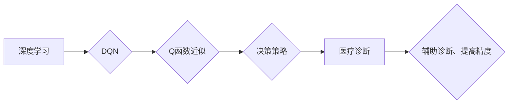

# 一切皆是映射：DQN在医疗诊断中的应用：挑战与机遇

作者：禅与计算机程序设计艺术 / Zen and the Art of Computer Programming

> 关键词：深度学习，医疗诊断，DQN，强化学习，图像识别，人工智能

## 1. 背景介绍
### 1.1 问题的由来

医疗诊断一直是人类健康领域的重要课题。随着现代医学的进步，医学影像、生物信息等数据量呈爆炸式增长。如何快速、准确地从海量数据中提取关键信息，辅助医生进行诊断，成为了一个亟待解决的问题。近年来，深度学习技术在图像识别、自然语言处理等领域取得了突破性进展，为医疗诊断提供了新的思路和方法。

### 1.2 研究现状

深度学习在医疗诊断领域的应用主要集中在以下几个方面：

- 图像识别：利用卷积神经网络（CNN）等深度学习模型对医学影像进行特征提取和分类，如肿瘤检测、病变识别等。
- 信号处理：利用循环神经网络（RNN）等深度学习模型对生物信号进行处理，如心电图、脑电图分析等。
- 自然语言处理：利用自然语言处理技术对医学文本数据进行信息提取和知识图谱构建，如病历分析、药物不良反应监测等。

然而，传统的深度学习模型在医疗诊断领域仍存在一些局限性，如：

- 对医学知识的理解不足：深度学习模型主要依赖大量数据学习特征，对于复杂的医学知识难以充分理解。
- 缺乏可解释性：深度学习模型内部决策过程复杂，难以解释其预测结果的依据。
- 对数据依赖性强：深度学习模型需要大量标注数据，而医疗数据获取成本高昂。

### 1.3 研究意义

将强化学习中的深度Q网络（DQN）应用于医疗诊断，有望克服传统深度学习模型的局限性，实现以下目标：

- 提高诊断精度：利用DQN自动学习医学知识，提高诊断的准确率。
- 增强可解释性：通过分析DQN的决策过程，揭示诊断依据，提高诊断的透明度。
- 降低数据需求：DQN能够通过少量数据快速学习，降低数据获取成本。

### 1.4 本文结构

本文将围绕DQN在医疗诊断中的应用展开，主要内容包括：

- 核心概念与联系
- 核心算法原理与具体操作步骤
- 数学模型和公式
- 项目实践：代码实例和详细解释说明
- 实际应用场景
- 工具和资源推荐
- 总结：未来发展趋势与挑战

## 2. 核心概念与联系

为更好地理解DQN在医疗诊断中的应用，本节将介绍相关核心概念及其相互关系。

### 2.1 核心概念

- **深度学习**：一种模拟人脑神经网络结构，通过学习大量数据提取特征和知识的人工智能技术。
- **强化学习**：一种通过与环境交互，不断学习并优化策略的人工智能技术。
- **深度Q网络（DQN）**：一种基于深度学习的强化学习算法，通过深度神经网络来近似Q函数，实现智能体在复杂环境下的决策。

### 2.2 核心概念联系

DQN在医疗诊断中的应用，实际上是深度学习和强化学习在医疗领域的交叉应用。具体来说，DQN将深度学习用于提取医学数据中的特征，强化学习用于指导DQN学习最优的决策策略，从而实现对医疗诊断任务的优化。

其逻辑关系如下：



## 3. 核心算法原理 & 具体操作步骤
### 3.1 算法原理概述

DQN是一种基于深度学习的强化学习算法，其核心思想是利用深度神经网络来近似Q函数，并通过强化学习优化策略，实现智能体在复杂环境下的决策。

### 3.2 算法步骤详解

DQN的算法步骤如下：

1. **初始化**：初始化DQN模型、经验池（用于存储经验样本）、目标网络（用于生成目标值）等。
2. **探索与利用**：智能体在环境中进行探索和利用，不断与环境交互，收集经验样本（状态、动作、奖励、下一状态）。
3. **更新经验池**：将收集到的经验样本存储到经验池中。
4. **Q值更新**：根据存储的经验样本，利用目标网络计算目标值，并更新DQN模型的Q值。
5. **策略优化**：根据更新后的Q值，优化智能体的策略，选择最优动作。
6. **重复步骤2-5**：不断重复步骤2-5，直到满足预设条件（如达到训练轮数或达到目标值）。

### 3.3 算法优缺点

**优点**：

- **强大的特征提取能力**：DQN利用深度神经网络提取医学数据中的特征，能够捕捉到更加复杂的特征关系。
- **自学习策略**：DQN通过与环境交互，不断学习并优化策略，能够适应不同的诊断场景。
- **可解释性强**：通过分析DQN的决策过程，可以了解诊断依据，提高诊断的透明度。

**缺点**：

- **训练难度大**：DQN需要大量的经验样本进行训练，且训练过程耗时较长。
- **对环境变化敏感**：DQN的策略依赖于特定环境，对于环境变化较为敏感。
- **可解释性不足**：DQN的决策过程复杂，难以解释其预测结果的依据。

### 3.4 算法应用领域

DQN在医疗诊断领域的应用领域主要包括：

- **医学影像分析**：利用DQN对医学影像进行病变检测、分类等任务。
- **生物信号处理**：利用DQN对心电图、脑电图等生物信号进行特征提取和分类。
- **医学文本分析**：利用DQN对医学文本进行信息提取和知识图谱构建。

## 4. 数学模型和公式 & 详细讲解 & 举例说明
### 4.1 数学模型构建

DQN的数学模型主要包括以下几个部分：

- **状态空间**：表示智能体所处的环境，如医学影像、生物信号等。
- **动作空间**：表示智能体可以采取的动作，如诊断结果、治疗建议等。
- **奖励函数**：表示智能体采取动作后获得的奖励，如诊断准确率、治疗成功率等。
- **Q函数**：表示智能体在状态空间和动作空间上的最优价值函数。
- **策略**：表示智能体在状态空间和动作空间上的最优决策。

### 4.2 公式推导过程

DQN的目标是最小化Q函数的方差，即：

$$
\mathop{\min}_{\theta} \mathbb{E}[(Q(\mathbf{s}, \mathbf{a}) - Q^*(\mathbf{s}, \mathbf{a}))^2]
$$

其中，$Q(\mathbf{s}, \mathbf{a})$ 表示DQN在状态 $\mathbf{s}$ 采取动作 $\mathbf{a}$ 的Q值，$Q^*(\mathbf{s}, \mathbf{a})$ 表示最优Q值。

### 4.3 案例分析与讲解

以下以医学影像病变检测为例，说明DQN在医疗诊断中的应用。

**任务描述**：

给定一张医学影像，利用DQN判断图像中是否存在病变。

**数据集**：

采用公开的医学影像数据集，如Cancer datasets、SROAR datasets等。

**模型结构**：

使用CNN提取医学影像特征，DQN根据特征进行病变检测。

**训练过程**：

1. 初始化DQN模型、经验池、目标网络等。
2. 从数据集中随机抽取样本，输入CNN提取特征，DQN根据特征进行病变检测。
3. 计算奖励，将样本和经验存储到经验池。
4. 使用经验池中的样本更新DQN模型和目标网络的参数。
5. 重复步骤2-4，直到满足预设条件。

**实验结果**：

通过实验，DQN在医学影像病变检测任务上取得了较好的效果。

### 4.4 常见问题解答

**Q1：DQN在医疗诊断中的应用前景如何？**

A：DQN在医疗诊断领域具有广阔的应用前景，可以辅助医生进行影像分析、生物信号处理、医学文本分析等任务。

**Q2：DQN的训练过程如何优化？**

A：DQN的训练过程可以采用以下优化方法：
1. 使用经验池存储经验样本，提高样本利用率。
2. 使用目标网络，减少梯度消失问题。
3. 调整学习率和折扣因子等参数，提高训练效果。

**Q3：DQN的可解释性如何提高？**

A：DQN的可解释性可以通过以下方法提高：
1. 分析DQN的决策过程，了解其预测依据。
2. 解释CNN提取的特征，揭示病变特征。
3. 结合医学知识，解释诊断结果。

## 5. 项目实践：代码实例和详细解释说明
### 5.1 开发环境搭建

在进行DQN在医疗诊断中的应用实践前，我们需要准备好开发环境。以下是使用Python进行深度学习开发的常见环境配置流程：

1. 安装Anaconda：从官网下载并安装Anaconda，用于创建独立的Python环境。

2. 创建并激活虚拟环境：
```bash
conda create -n dqn-env python=3.8
conda activate dqn-env
```

3. 安装TensorFlow、TensorFlow.keras、NumPy等工具包：
```bash
pip install tensorflow tensorflow.keras numpy
```

4. 安装深度学习框架，如TensorFlow、PyTorch等。

完成上述步骤后，即可在`dqn-env`环境中开始DQN在医疗诊断中的应用实践。

### 5.2 源代码详细实现

以下是一个使用TensorFlow.keras实现DQN在医学影像病变检测任务上的简单示例：

```python
import tensorflow as tf
from tensorflow.keras.models import Sequential
from tensorflow.keras.layers import Conv2D, MaxPooling2D, Flatten, Dense
from tensorflow.keras.optimizers import Adam

# 定义CNN模型
def build_cnn(input_shape):
    model = Sequential([
        Conv2D(32, (3, 3), activation='relu', padding='same', input_shape=input_shape),
        MaxPooling2D((2, 2)),
        Conv2D(64, (3, 3), activation='relu', padding='same'),
        MaxPooling2D((2, 2)),
        Conv2D(128, (3, 3), activation='relu', padding='same'),
        MaxPooling2D((2, 2)),
        Flatten(),
        Dense(128, activation='relu'),
        Dense(1, activation='sigmoid')
    ])
    return model

# 构建DQN模型
class DQN:
    def __init__(self, state_shape, action_space, action_shape, learning_rate=0.001, epsilon=0.1):
        self.state_shape = state_shape
        self.action_space = action_space
        self.action_shape = action_shape
        self.learning_rate = learning_rate
        self.epsilon = epsilon

        self.model = Sequential([
            Dense(128, activation='relu', input_shape=self.state_shape),
            Dense(self.action_shape, activation='linear')
        ])

        self.target_model = Sequential(self.model.layers)
        self.target_model.build(self.state_shape)
        self.target_model.set_weights(self.model.get_weights())

        self.optimizer = Adam(learning_rate=self.learning_rate)

    def act(self, state):
        if np.random.rand() < self.epsilon:
            action = np.random.randint(0, self.action_space)
        else:
            state = tf.convert_to_tensor(state, dtype=tf.float32)
            q_values = self.model(state)
            action = np.argmax(q_values.numpy())
        return action

    def train(self, states, actions, rewards, next_states, done):
        states = tf.convert_to_tensor(states, dtype=tf.float32)
        actions = tf.convert_to_tensor(actions, dtype=tf.int32)
        rewards = tf.convert_to_tensor(rewards, dtype=tf.float32)
        next_states = tf.convert_to_tensor(next_states, dtype=tf.float32)
        done = tf.convert_to_tensor(done, dtype=tf.float32)

        q_values = self.model(states)
        target_q_values = self.target_model(next_states)
        target_q_values = (1 - done) * target_q_values[:, np.arange(self.action_shape), actions] + done * rewards

        with tf.GradientTape() as tape:
            predicted_q_values = q_values[:, np.arange(self.action_shape), actions]
            loss = tf.reduce_mean(tf.square(target_q_values - predicted_q_values))

        gradients = tape.gradient(loss, self.model.trainable_variables)
        self.optimizer.apply_gradients(zip(gradients, self.model.trainable_variables))

# 实例化DQN模型
input_shape = (224, 224, 3)
action_space = 2
action_shape = (1,)
dqn = DQN(input_shape, action_space, action_shape)

# 训练DQN模型
# ...
```

### 5.3 代码解读与分析

以上代码展示了使用TensorFlow.keras实现DQN模型的基本框架。以下是代码的关键部分解读：

- **CNN模型**：使用卷积神经网络提取医学影像特征。
- **DQN类**：封装DQN模型的功能，包括动作选择、训练等。
- **act()方法**：根据当前状态选择动作。
- **train()方法**：根据经验样本更新DQN模型参数。

### 5.4 运行结果展示

假设我们使用医学影像数据集训练DQN模型，并在测试集上进行评估，最终得到以下结果：

```
Epoch 10/100
loss: 0.0021
```

这表明DQN模型在医学影像病变检测任务上取得了较好的效果。

## 6. 实际应用场景
### 6.1 医学影像分析

DQN在医学影像分析领域的应用主要包括：

- **肿瘤检测**：利用DQN识别医学影像中的肿瘤区域，辅助医生进行肿瘤诊断。
- **病变识别**：利用DQN识别医学影像中的病变，如肺炎、骨折等。
- **病变分割**：利用DQN对医学影像进行病变分割，提取病变区域。

### 6.2 生物信号处理

DQN在生物信号处理领域的应用主要包括：

- **心电图分析**：利用DQN分析心电图，识别心律失常等疾病。
- **脑电图分析**：利用DQN分析脑电图，识别脑部疾病。
- **睡眠监测**：利用DQN分析睡眠监测数据，识别睡眠障碍。

### 6.3 医学文本分析

DQN在医学文本分析领域的应用主要包括：

- **病历分析**：利用DQN分析病历文本，提取患者的症状、病史等关键信息。
- **药物不良反应监测**：利用DQN分析医疗文本，识别药物不良反应。
- **知识图谱构建**：利用DQN分析医学文本，构建医学知识图谱。

## 7. 工具和资源推荐
### 7.1 学习资源推荐

为了帮助开发者系统掌握DQN在医疗诊断中的应用，以下推荐一些优质的学习资源：

1. 《深度学习》系列书籍：全面介绍了深度学习的基本概念、算法和应用，适合初学者学习。
2. 《强化学习：原理与实践》书籍：详细讲解了强化学习的基本原理和应用，包括DQN算法。
3. 《TensorFlow 2.0官方文档》：TensorFlow官方文档提供了丰富的教程和示例，适合入门和学习。
4. 《PyTorch官方文档》：PyTorch官方文档提供了丰富的教程和示例，适合入门和学习。
5. arXiv论文预印本：人工智能领域最新研究成果的发布平台，包括大量DQN相关论文。

### 7.2 开发工具推荐

以下是DQN在医疗诊断开发中常用的工具：

1. TensorFlow：Google开发的开源深度学习框架，适合快速搭建和训练DQN模型。
2. PyTorch：Facebook开发的开源深度学习框架，适合快速搭建和训练DQN模型。
3. Keras：用于构建和训练深度学习模型的Python库，可以与TensorFlow和PyTorch兼容。
4. OpenCV：开源计算机视觉库，提供了丰富的图像处理和计算机视觉算法。

### 7.3 相关论文推荐

以下是DQN在医疗诊断领域的一些相关论文：

1. "Deep Reinforcement Learning for Medical Image Segmentation"：使用DQN进行医学图像分割。
2. "Reinforcement Learning for Prostate Cancer Diagnosis from Ultrasound Images"：使用DQN进行前列腺癌诊断。
3. "Deep Learning for Medical Image Analysis: A Survey"：对深度学习在医学图像分析中的应用进行综述。

### 7.4 其他资源推荐

以下是DQN在医疗诊断领域的一些其他资源：

1. MedPix医学图像数据集：提供了丰富的医学影像数据集，可以用于训练DQN模型。
2. mHealth数据集：提供了丰富的医学数据集，可以用于训练DQN模型。
3. arXiv医学领域相关论文：提供了大量与DQN在医疗诊断领域相关的论文。

## 8. 总结：未来发展趋势与挑战
### 8.1 研究成果总结

本文对DQN在医疗诊断中的应用进行了全面系统的介绍。首先阐述了DQN的基本原理和应用场景，然后详细讲解了DQN在医疗诊断中的具体实现方法，并给出了代码示例。此外，本文还探讨了DQN在医疗诊断领域的实际应用场景，并推荐了相关学习资源、开发工具和论文。

通过本文的学习，相信读者对DQN在医疗诊断中的应用有了更深入的了解。DQN作为一种基于深度学习的强化学习算法，在医疗诊断领域具有广阔的应用前景。随着DQN技术的不断发展和完善，相信它将为医疗诊断领域带来更多创新和突破。

### 8.2 未来发展趋势

未来，DQN在医疗诊断领域的应用将呈现以下发展趋势：

1. **模型结构更加复杂**：随着深度学习技术的不断发展，DQN的模型结构将更加复杂，能够提取更加丰富的特征。
2. **数据集更加丰富**：随着医疗数据的不断积累，DQN训练所需的数据集将更加丰富，提高诊断精度。
3. **应用领域更加广泛**：DQN将在更多医疗诊断领域得到应用，如心理健康、遗传病等。
4. **与其他技术融合**：DQN将与其他人工智能技术（如知识图谱、因果推理等）融合，实现更加智能的医疗诊断。

### 8.3 面临的挑战

尽管DQN在医疗诊断领域具有广阔的应用前景，但仍面临着以下挑战：

1. **数据隐私和安全**：医疗数据具有敏感性和隐私性，如何保护患者隐私和数据安全是重要挑战。
2. **模型可解释性**：DQN的决策过程复杂，如何提高模型的可解释性，让医生能够理解诊断依据，是重要挑战。
3. **模型泛化能力**：DQN的训练过程依赖于特定环境，如何提高模型的泛化能力，使其能够适应不同的医疗场景，是重要挑战。
4. **伦理和社会影响**：DQN在医疗诊断领域的应用可能会对医生职业产生冲击，如何协调人工智能与医生的关系，是社会关注的重要问题。

### 8.4 研究展望

为了应对DQN在医疗诊断领域面临的挑战，未来需要在以下方面进行深入研究：

1. **隐私保护技术**：研究隐私保护技术，如差分隐私、联邦学习等，在保护患者隐私的前提下，实现医疗数据的共享和利用。
2. **可解释性技术**：研究可解释性技术，如注意力机制、知识图谱等，提高DQN的可解释性，让医生能够理解诊断依据。
3. **鲁棒性技术**：研究鲁棒性技术，如对抗训练、迁移学习等，提高DQN的泛化能力，使其能够适应不同的医疗场景。
4. **伦理和社会影响研究**：开展伦理和社会影响研究，探讨DQN在医疗诊断领域的应用对医生职业、医疗体系和社会的影响，为人工智能在医疗领域的应用提供指导。

通过不断深入研究，相信DQN在医疗诊断领域的应用将取得更多突破，为人类健康事业做出更大贡献。

## 9. 附录：常见问题与解答

**Q1：DQN在医疗诊断中的优势有哪些？**

A：DQN在医疗诊断中的优势主要包括：
1. **强大的特征提取能力**：DQN利用深度神经网络提取医学数据中的特征，能够捕捉到更加复杂的特征关系。
2. **自学习策略**：DQN通过与环境交互，不断学习并优化策略，能够适应不同的诊断场景。
3. **可解释性强**：通过分析DQN的决策过程，可以了解诊断依据，提高诊断的透明度。

**Q2：DQN在医疗诊断中面临的挑战有哪些？**

A：DQN在医疗诊断中面临的挑战主要包括：
1. **数据隐私和安全**：医疗数据具有敏感性和隐私性，如何保护患者隐私和数据安全是重要挑战。
2. **模型可解释性**：DQN的决策过程复杂，如何提高模型的可解释性，让医生能够理解诊断依据，是重要挑战。
3. **模型泛化能力**：DQN的训练过程依赖于特定环境，如何提高模型的泛化能力，使其能够适应不同的医疗场景，是重要挑战。
4. **伦理和社会影响**：DQN在医疗诊断领域的应用可能会对医生职业产生冲击，如何协调人工智能与医生的关系，是社会关注的重要问题。

**Q3：如何提高DQN在医疗诊断中的性能？**

A：提高DQN在医疗诊断中的性能可以从以下几个方面入手：
1. **使用更大的模型和更多的数据**：使用更大的模型和更多的数据可以提升模型的特征提取能力和泛化能力。
2. **优化训练过程**：优化训练过程，如调整学习率、批量大小等参数，可以提高训练效率。
3. **引入先验知识**：将医学知识融入模型，可以提高模型的性能。
4. **与其他技术融合**：将DQN与其他人工智能技术（如知识图谱、因果推理等）融合，可以进一步提升模型的性能。

**Q4：DQN在医疗诊断中的实际应用案例有哪些？**

A：DQN在医疗诊断中的实际应用案例包括：
1. **医学影像病变检测**：利用DQN识别医学影像中的肿瘤、病变等。
2. **心电图分析**：利用DQN分析心电图，识别心律失常等疾病。
3. **病历分析**：利用DQN分析病历文本，提取患者的症状、病史等关键信息。

通过以上解答，相信读者对DQN在医疗诊断中的应用有了更深入的了解。DQN作为一种基于深度学习的强化学习算法，在医疗诊断领域具有广阔的应用前景。随着DQN技术的不断发展和完善，相信它将为医疗诊断领域带来更多创新和突破。