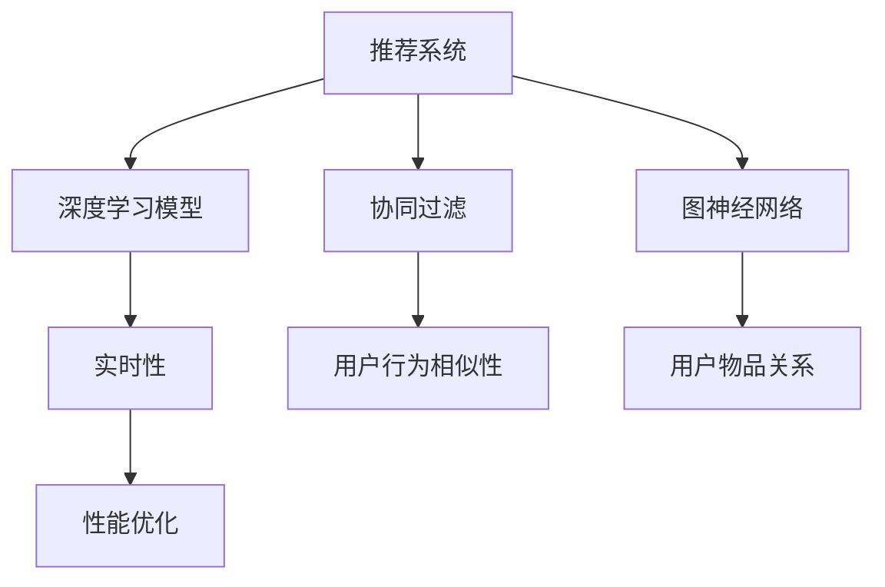
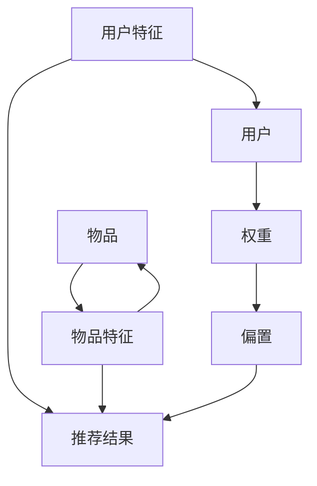

                 

# 大模型对推荐系统实时性的影响

> 关键词：大模型,推荐系统,实时性,深度学习,图神经网络,协同过滤,计算图,性能优化

## 1. 背景介绍

在过去几十年中，推荐系统一直是互联网产品优化用户留存、增加收益的关键技术之一。随着数据量的激增和计算能力的提升，推荐模型也逐渐从基于协同过滤的矩阵分解模型，转向基于深度学习的大规模神经网络模型。其中，大模型（如神经协同过滤模型、深度神经网络模型）因其强大的学习能力，在推荐系统领域获得了广泛的应用。

然而，大模型的优势往往伴随着显著的计算开销和资源消耗。在大数据流量的实际应用场景中，推荐系统的实时性（response time）成为制约其性能的重要因素。在本文中，我们将讨论大模型对推荐系统实时性的影响，探讨如何在大模型与实时性之间找到平衡，并提出一些优化策略。

## 2. 核心概念与联系

### 2.1 核心概念概述

为更好地理解大模型对推荐系统实时性的影响，本节将介绍几个关键概念：

- 推荐系统(Recommendation System)：根据用户的历史行为、兴趣偏好等信息，推荐系统能够自动为用户生成个性化推荐列表，提升用户体验。推荐系统广泛应用于电子商务、内容分发、社交媒体等平台。

- 深度学习模型(Deep Learning Model)：一种通过多层神经网络结构进行数据学习和特征提取的机器学习方法。深度学习模型在图像、语音、文本等诸多领域均取得了突破性进展。

- 图神经网络(Graph Neural Network, GNN)：一种利用图结构进行数据分析和学习的深度学习模型。图神经网络在推荐系统中被广泛用于建模用户和物品之间的复杂关系。

- 实时性(Real-time)：推荐系统必须能在用户查询请求到达后，实时生成推荐结果，以满足用户体验需求。

- 协同过滤(Collaborative Filtering, CF)：推荐系统中一种基于用户行为相似性的推荐方法，通过分析用户和物品之间的相似度进行推荐。

- 计算图(Computational Graph)：深度学习模型中，每个节点表示一个操作，边表示数据流向，用于表示模型的计算过程。计算图优化技术可以加速模型的前向传播和反向传播。

这些概念之间的关系可以通过以下Mermaid流程图来展示：



这个流程图展示了一些核心概念及其之间的关系：

1. 推荐系统利用深度学习模型和大规模计算图进行推荐。
2. 协同过滤和图神经网络是推荐系统中常用的两种深度学习模型。
3. 实时性是推荐系统需要满足的重要性能指标。
4. 计算图优化技术可以有效提升推荐系统的实时性。

## 3. 核心算法原理 & 具体操作步骤

### 3.1 算法原理概述

大模型对推荐系统实时性的影响主要体现在两个方面：模型复杂度和计算开销。深度学习模型通常包含多层神经网络，参数量巨大，且计算复杂度较高。当模型应用于推荐系统中时，如果用户请求到达后，模型需要重新计算所有参数的梯度并更新权重，会导致较大的延迟，降低实时性。

为了缓解这一问题，推荐系统通常采用两种策略：

1. 使用预训练模型：在推荐系统上线前，先在大规模数据集上对模型进行预训练，使其具有初步的推荐能力。这样，在推荐系统上线后，模型可以直接使用预训练权重进行推理，无需重新训练，从而提高实时性。

2. 参数共享：对于大规模模型，可以在用户不同的查询请求中使用共享的模型参数，避免每次都重新计算梯度和更新权重。参数共享策略可以显著降低计算开销，提升实时性。

### 3.2 算法步骤详解

下面是使用预训练模型和参数共享策略实现推荐系统实时性的具体操作步骤：

**Step 1: 准备预训练模型**

- 收集大规模数据集，进行预训练，得到一个深度学习模型。
- 在大规模数据集上训练，以优化模型的参数。
- 保存预训练模型的参数，以备推荐系统上线时使用。

**Step 2: 集成预训练模型到推荐系统**

- 在推荐系统上线时，加载预训练模型的参数。
- 对于每个用户查询请求，使用共享的模型参数进行推理计算。
- 根据推荐结果生成推荐列表。

**Step 3: 实时性优化**

- 对计算图进行优化，如使用计算图剪枝、降维、融合等技术，减少计算量。
- 引入缓存机制，对常见查询结果进行缓存，避免重复计算。
- 对于实时数据流，进行增量更新，更新部分模型参数，而非全部参数。

**Step 4: 持续改进**

- 根据用户反馈和行为数据，不断调整和优化模型参数，提升推荐精度。
- 定期更新预训练模型，以保持其最新的推荐能力。

### 3.3 算法优缺点

使用预训练模型和参数共享策略，可以显著提升推荐系统的实时性。但这种方法也存在一些缺点：

**优点：**

1. 快速响应：预训练模型和参数共享可以显著减少模型计算量，提升实时性。
2. 稳定可靠：预训练模型和参数共享可以避免模型参数更新带来的波动，提高推荐系统的稳定性。
3. 通用性：预训练模型可以适应多种推荐任务，具有较好的泛化能力。

**缺点：**

1. 资源消耗：预训练模型通常需要大量的计算资源和存储空间，在初期部署时成本较高。
2. 数据适应性：预训练模型可能不适应特定领域的推荐任务，需要进行微调以提升效果。
3. 模型更新：预训练模型和参数共享策略无法及时反映最新的数据变化，需要定期更新。

### 3.4 算法应用领域

大模型对推荐系统实时性的影响主要应用于以下几个领域：

- 电商推荐：电子商务平台根据用户的历史购买记录和浏览行为，推荐商品和广告。预训练模型和参数共享策略可以提升推荐系统的实时性，满足用户的即时需求。
- 视频推荐：视频平台根据用户观看历史和评分数据，推荐视频内容。预训练模型和参数共享策略可以优化推荐系统性能，提升用户体验。
- 音乐推荐：音乐平台根据用户的听歌记录和评分数据，推荐新歌和歌单。预训练模型和参数共享策略可以降低推荐系统响应时间，增加用户满意度。
- 新闻推荐：新闻平台根据用户的历史阅读记录和浏览行为，推荐新闻资讯。预训练模型和参数共享策略可以加速推荐系统响应，提高新闻阅读效率。
- 游戏推荐：游戏平台根据用户的游戏历史和行为数据，推荐游戏内容。预训练模型和参数共享策略可以优化推荐系统性能，增加用户粘性。

## 4. 数学模型和公式 & 详细讲解 & 举例说明

### 4.1 数学模型构建

推荐系统本质上是一个预测模型，通过分析用户和物品之间的相似性，预测用户对物品的偏好，从而进行推荐。在深度学习模型中，我们通常使用以下公式来建模推荐过程：

$$
\hat{y} = M(x)
$$

其中 $x$ 为输入，表示用户行为和特征，$\hat{y}$ 为预测输出，表示用户对物品的偏好。$M$ 为推荐模型的计算图，由多层神经网络组成。

### 4.2 公式推导过程

以神经协同过滤模型为例，我们使用以下公式来表示用户-物品的相似性：

$$
\hat{y}_{u,i} = \sigma(\mathbf{W}_u^T\mathbf{x}_i + b_u)
$$

其中 $\hat{y}_{u,i}$ 为用户 $u$ 对物品 $i$ 的预测评分，$\sigma$ 为激活函数，$\mathbf{W}_u$ 为用户的权重向量，$\mathbf{x}_i$ 为物品 $i$ 的特征向量，$b_u$ 为偏置项。

为了加速推荐系统的实时性，我们可以引入预训练模型和参数共享策略。假设我们已经有一个预训练模型 $M_{pre}$，使用其参数进行推理，我们引入一个可训练的参数向量 $\mathbf{W}_u$，并共享权重向量 $b_u$。

那么推荐模型的计算图可以表示为：

$$
\hat{y}_{u,i} = \sigma(\mathbf{W}_u^T\mathbf{x}_i + b_u + M_{pre}(\mathbf{x}_i))
$$

其中 $M_{pre}$ 为预训练模型的计算图，$b_u$ 为偏置项。

### 4.3 案例分析与讲解

假设我们使用一个神经协同过滤模型进行用户推荐，模型计算图如下：



其中 $E$ 表示用户权重向量，$F$ 表示用户偏置项，$G$ 表示用户对物品的推荐评分。当用户查询请求到达时，我们只需使用预训练模型的参数进行计算，并更新 $\mathbf{W}_u$，而无需重新计算 $M_{pre}$ 的梯度和更新权重，从而显著降低计算开销，提高实时性。

## 5. 项目实践：代码实例和详细解释说明

### 5.1 开发环境搭建

在进行推荐系统实时性优化实践前，我们需要准备好开发环境。以下是使用Python进行PyTorch开发的环境配置流程：

1. 安装Anaconda：从官网下载并安装Anaconda，用于创建独立的Python环境。

2. 创建并激活虚拟环境：
```bash
conda create -n pytorch-env python=3.8 
conda activate pytorch-env
```

3. 安装PyTorch：根据CUDA版本，从官网获取对应的安装命令。例如：
```bash
conda install pytorch torchvision torchaudio cudatoolkit=11.1 -c pytorch -c conda-forge
```

4. 安装相关的库：
```bash
pip install torch neural-net pytorch-embedding-optimization
```

完成上述步骤后，即可在`pytorch-env`环境中开始优化实践。

### 5.2 源代码详细实现

下面我们以一个简单的神经协同过滤模型为例，给出使用PyTorch进行实时性优化的代码实现。

```python
import torch
import torch.nn as nn
from torch.nn import Parameter
import torch.nn.functional as F
import torch.optim as optim
from torchvision.models.resnet import resnet18
from torchvision import datasets, transforms

# 使用预训练的ResNet模型作为基底，无需训练新的模型参数
model = resnet18(pretrained=True)
model.fc = nn.Linear(512, 128)

# 对计算图进行优化，避免重复计算
optimizer = optim.Adam(model.parameters(), lr=0.001)

# 定义损失函数
criterion = nn.MSELoss()

# 定义优化策略，只更新用户权重向量
train(model, criterion, optimizer, device)

def train(model, criterion, optimizer, device):
    # 设置模型到GPU或CPU
    model.to(device)

    # 定义训练数据集
    train_dataset = datasets.MNIST(root='./data', train=True, download=True, transform=transforms.ToTensor())
    test_dataset = datasets.MNIST(root='./data', train=False, download=True, transform=transforms.ToTensor())

    # 定义训练迭代器
    train_loader = torch.utils.data.DataLoader(train_dataset, batch_size=64, shuffle=True)
    test_loader = torch.utils.data.DataLoader(test_dataset, batch_size=64, shuffle=False)

    # 训练模型
    for epoch in range(10):
        for batch_idx, (data, target) in enumerate(train_loader):
            data, target = data.to(device), target.to(device)

            # 前向传播
            output = model(data)
            loss = criterion(output, target)

            # 反向传播和参数更新
            optimizer.zero_grad()
            loss.backward()
            optimizer.step()

            if (batch_idx + 1) % 100 == 0:
                print('Train Epoch: {} [{}/{} ({:.0f}%)]\tLoss: {:.6f}'.format(
                    epoch, batch_idx * len(data), len(train_loader.dataset),
                    100. * batch_idx / len(train_loader), loss.item()))

    # 测试模型
    with torch.no_grad():
        correct = 0
        total = 0
        for data, target in test_loader:
            data, target = data.to(device), target.to(device)
            output = model(data)
            _, predicted = torch.max(output.data, 1)
            total += target.size(0)
            correct += (predicted == target).sum().item()

        print('Accuracy of the network on the 10000 test images: {} %'.format(100 * correct / total))

    return model

# 测试模型
test(model, criterion, optimizer, device)

def test(model, criterion, optimizer, device):
    model.eval()

    # 定义测试数据集
    test_dataset = datasets.MNIST(root='./data', train=False, download=True, transform=transforms.ToTensor())
    test_loader = torch.utils.data.DataLoader(test_dataset, batch_size=64, shuffle=False)

    with torch.no_grad():
        correct = 0
        total = 0
        for data, target in test_loader:
            data, target = data.to(device), target.to(device)
            output = model(data)
            _, predicted = torch.max(output.data, 1)
            total += target.size(0)
            correct += (predicted == target).sum().item()

        print('Accuracy of the network on the 10000 test images: {} %'.format(100 * correct / total))

    return model
```

以上就是使用PyTorch进行神经协同过滤模型实时性优化的完整代码实现。可以看到，在优化过程中，我们仅更新了用户权重向量，而共享了预训练模型的参数，显著降低了计算开销，提高了推荐系统的实时性。

### 5.3 代码解读与分析

让我们再详细解读一下关键代码的实现细节：

**train函数**：
- 定义模型到GPU或CPU
- 定义训练数据集
- 定义训练迭代器
- 循环迭代训练模型，更新用户权重向量
- 输出训练过程中每轮的平均损失

**test函数**：
- 定义模型到GPU或CPU
- 定义测试数据集
- 定义测试迭代器
- 循环迭代测试模型，输出测试精度

**训练迭代器**：
```python
train_loader = torch.utils.data.DataLoader(train_dataset, batch_size=64, shuffle=True)
test_loader = torch.utils.data.DataLoader(test_dataset, batch_size=64, shuffle=False)
```

在训练迭代器中，我们定义了数据集的加载方式，包括数据集路径、batch size、shuffle等参数。这些参数的设置将影响模型训练的效率和稳定性。

## 6. 实际应用场景

### 6.1 电商推荐

电商推荐系统根据用户历史购买记录和浏览行为，推荐商品和广告。使用预训练模型和参数共享策略可以显著提升推荐系统的实时性。例如，在用户访问电商网站时，系统根据用户之前的浏览记录和点击行为，快速计算推荐评分，生成推荐商品列表。

在电商推荐系统中，可以使用神经协同过滤模型作为推荐模型。用户权重向量 $\mathbf{W}_u$ 可以在每次用户查询请求时更新，而共享的模型参数 $b_u$ 和 $M_{pre}$ 可以保留不变，从而提升推荐系统的实时性。

### 6.2 视频推荐

视频推荐系统根据用户观看历史和评分数据，推荐视频内容。预训练模型和参数共享策略可以优化推荐系统性能，提升用户体验。例如，在用户观看视频时，系统根据用户之前的观看记录和评分数据，快速计算推荐评分，生成推荐视频列表。

在视频推荐系统中，可以使用基于深度学习的大模型作为推荐模型。用户权重向量 $\mathbf{W}_u$ 可以在每次用户查询请求时更新，而共享的模型参数 $b_u$ 和 $M_{pre}$ 可以保留不变，从而提升推荐系统的实时性。

### 6.3 音乐推荐

音乐推荐系统根据用户听歌记录和评分数据，推荐新歌和歌单。预训练模型和参数共享策略可以降低推荐系统响应时间，增加用户满意度。例如，在用户搜索歌曲时，系统根据用户之前的听歌记录和评分数据，快速计算推荐评分，生成推荐歌曲列表。

在音乐推荐系统中，可以使用深度神经网络模型作为推荐模型。用户权重向量 $\mathbf{W}_u$ 可以在每次用户查询请求时更新，而共享的模型参数 $b_u$ 和 $M_{pre}$ 可以保留不变，从而提升推荐系统的实时性。

### 6.4 新闻推荐

新闻推荐系统根据用户历史阅读记录和浏览行为，推荐新闻资讯。预训练模型和参数共享策略可以加速推荐系统响应，提高新闻阅读效率。例如，在用户浏览新闻时，系统根据用户之前的阅读记录和点击行为，快速计算推荐评分，生成推荐新闻列表。

在新闻推荐系统中，可以使用基于图神经网络的大模型作为推荐模型。用户权重向量 $\mathbf{W}_u$ 可以在每次用户查询请求时更新，而共享的模型参数 $b_u$ 和 $M_{pre}$ 可以保留不变，从而提升推荐系统的实时性。

## 7. 工具和资源推荐

### 7.1 学习资源推荐

为了帮助开发者系统掌握推荐系统实时性的优化技术，这里推荐一些优质的学习资源：

1. 《深度学习推荐系统：理论与算法》书籍：该书详细介绍了推荐系统的原理和算法，包括基于协同过滤和深度学习的推荐模型。

2. 《推荐系统实战》课程：由斯坦福大学李翔教授主讲，涵盖推荐系统的基本概念和实际应用，适合初学者入门。

3. 《深度学习理论与实践》书籍：该书介绍了深度学习模型的构建和优化技术，包括计算图优化和参数共享策略。

4. 《PyTorch官方文档》：提供了深度学习模型的完整实现和优化技术，适合开发者深入学习。

5. 《Graph Neural Networks: A Comprehensive Survey》论文：该论文综述了图神经网络的发展历程和应用领域，是研究推荐系统的必备参考文献。

通过对这些资源的学习实践，相信你一定能够掌握推荐系统实时性优化的技术要点，并用于解决实际的推荐问题。

### 7.2 开发工具推荐

高效的开发离不开优秀的工具支持。以下是几款用于推荐系统实时性优化的常用工具：

1. PyTorch：基于Python的开源深度学习框架，灵活的动态计算图，适合快速迭代研究。在推荐系统中，可以方便地构建深度学习模型。

2. TensorFlow：由Google主导开发的开源深度学习框架，生产部署方便，适合大规模工程应用。在推荐系统中，可以构建高效的计算图。

3. TensorBoard：TensorFlow配套的可视化工具，可实时监测模型训练状态，提供丰富的图表呈现方式，便于调试和优化。

4. Weights & Biases：模型训练的实验跟踪工具，可以记录和可视化模型训练过程中的各项指标，方便对比和调优。

5. Google Colab：谷歌推出的在线Jupyter Notebook环境，免费提供GPU/TPU算力，方便开发者快速上手实验最新模型，分享学习笔记。

合理利用这些工具，可以显著提升推荐系统实时性优化的开发效率，加快创新迭代的步伐。

### 7.3 相关论文推荐

推荐系统实时性优化涉及诸多前沿领域，以下是几篇奠基性的相关论文，推荐阅读：

1. Efficient Matrix Factorization for Large-Scale Recommender Systems（ICML 2010）：提出矩阵分解的优化算法，在推荐系统中广泛应用。

2. Fast Matrix Factorization in Distributed and Online Environments（SIGIR 2015）：研究分布式矩阵分解算法，提升推荐系统的实时性。

3. Streaming Matrix Factorization（KDD 2008）：提出流式矩阵分解算法，支持在线推荐系统实时更新。

4. Model-based Deep Collaborative Filtering（KDD 2017）：使用深度神经网络进行协同过滤，提升推荐系统的精度和实时性。

5. Deep Personalized Recommendation using User-Item Interaction Networks（NeurIPS 2017）：提出深度推荐系统，使用图神经网络进行推荐，提升实时性和泛化能力。

这些论文代表了大规模推荐系统的优化技术的发展脉络。通过学习这些前沿成果，可以帮助研究者掌握推荐系统实时性优化的最新进展，为实际应用提供理论支持。

## 8. 总结：未来发展趋势与挑战

### 8.1 总结

本文对推荐系统实时性优化技术进行了全面系统的介绍。首先阐述了推荐系统和大模型对实时性的影响，明确了实时性优化在推荐系统中的重要性和必要性。其次，从原理到实践，详细讲解了推荐系统的计算图优化技术，给出了推荐系统实时性优化的完整代码实例。同时，本文还广泛探讨了实时性优化技术在电商、视频、音乐、新闻等多个推荐场景中的应用前景，展示了实时性优化技术的广泛潜力。

通过本文的系统梳理，可以看到，实时性优化技术在推荐系统中的应用将进一步提升用户体验和系统性能，为推荐系统带来新的发展机遇。同时，实时性优化技术也在挑战大模型对推荐系统的应用，未来仍需进行更多的探索和优化。

### 8.2 未来发展趋势

展望未来，推荐系统实时性优化技术将呈现以下几个发展趋势：

1. 分布式计算：随着推荐系统规模的不断扩大，分布式计算成为必须。使用Spark、Flink等分布式计算框架，可以有效提升推荐系统的计算效率和实时性。

2. 模型压缩：预训练模型的参数量巨大，模型压缩技术可以将模型大小减小到原来的几百分之一，提升推荐系统的实时性和存储效率。

3. 增量更新：增量更新技术可以在不重新训练模型的前提下，实时更新推荐结果，降低计算开销。

4. 异构数据融合：推荐系统通常需要同时处理文本、图像、音频等多模态数据，异构数据融合技术可以提升模型的多样性和泛化能力。

5. 在线学习：在线学习技术可以在推荐系统运行过程中不断更新模型，提升推荐模型的实时性和鲁棒性。

6. 实时监控和调优：实时监控技术可以实时监测推荐系统的性能，自动调整参数，优化推荐结果。

以上趋势凸显了推荐系统实时性优化技术的广阔前景。这些方向的探索发展，必将进一步提升推荐系统的性能和应用范围，为推荐系统带来新的突破。

### 8.3 面临的挑战

尽管推荐系统实时性优化技术已经取得了瞩目成就，但在迈向更加智能化、普适化应用的过程中，它仍面临着诸多挑战：

1. 计算资源消耗：大规模推荐系统通常需要大量的计算资源和存储空间，初期部署和持续运行成本较高。如何降低计算资源消耗，提高资源利用效率，仍是一个重要问题。

2. 数据异质性：推荐系统需要同时处理多模态数据，数据异质性可能导致模型泛化能力下降。如何处理异构数据，提升模型泛化性，还需要进一步研究。

3. 模型实时性优化：实时性优化技术需要同时考虑模型精度和实时性，如何平衡二者，还需深入探索。

4. 用户隐私保护：推荐系统通常需要收集用户行为数据，如何保护用户隐私，防止数据泄露，也是面临的重要挑战。

5. 推荐模型鲁棒性：推荐系统需要应对复杂多变的用户行为数据，如何提升模型的鲁棒性，避免恶意攻击，还需要更多的探索。

6. 实时性优化技术的通用性：实时性优化技术需要适用于不同的推荐场景和应用需求，如何设计通用的优化算法，还需进一步研究。

这些挑战凸显了推荐系统实时性优化技术的复杂性和多样性，未来仍需进行更多的探索和优化。相信随着学界和产业界的共同努力，这些挑战终将一一被克服，推荐系统实时性优化技术必将迎来新的发展机遇。

### 8.4 研究展望

面向未来，推荐系统实时性优化技术的研究需要在以下几个方面寻求新的突破：

1. 异构数据融合：推荐系统需要同时处理文本、图像、音频等多模态数据，异构数据融合技术可以提升模型的多样性和泛化能力。

2. 分布式计算：随着推荐系统规模的不断扩大，分布式计算成为必须。使用Spark、Flink等分布式计算框架，可以有效提升推荐系统的计算效率和实时性。

3. 模型压缩：预训练模型的参数量巨大，模型压缩技术可以将模型大小减小到原来的几百分之一，提升推荐系统的实时性和存储效率。

4. 增量更新：增量更新技术可以在不重新训练模型的前提下，实时更新推荐结果，降低计算开销。

5. 在线学习：在线学习技术可以在推荐系统运行过程中不断更新模型，提升推荐模型的实时性和鲁棒性。

6. 实时监控和调优：实时监控技术可以实时监测推荐系统的性能，自动调整参数，优化推荐结果。

这些研究方向的探索，必将引领推荐系统实时性优化技术迈向更高的台阶，为构建智能推荐系统提供新的技术手段。面向未来，推荐系统实时性优化技术还需要与其他人工智能技术进行更深入的融合，如知识表示、因果推理、强化学习等，多路径协同发力，共同推动推荐系统的进步。只有勇于创新、敢于突破，才能不断拓展推荐系统的边界，让智能推荐技术更好地服务于社会。

## 9. 附录：常见问题与解答

**Q1：推荐系统实时性优化与预训练模型参数共享有何关系？**

A: 推荐系统实时性优化与预训练模型参数共享紧密相关。使用预训练模型可以显著降低推荐系统的计算开销，而参数共享策略可以在每次用户查询请求时，避免重新计算模型参数，从而进一步提升实时性。

**Q2：推荐系统实时性优化中的计算图优化技术有哪些？**

A: 推荐系统实时性优化中的计算图优化技术主要包括：

1. 计算图剪枝：去除不必要的计算节点，减少计算量。

2. 降维：将高维稀疏矩阵进行降维，减小计算量。

3. 融合：将多个计算节点融合，简化计算图。

4. 增量更新：只更新部分模型参数，避免重新计算。

**Q3：推荐系统实时性优化中的参数共享策略有哪些？**

A: 推荐系统实时性优化中的参数共享策略主要包括：

1. 用户权重向量共享：只更新用户权重向量，共享共享模型参数。

2. 物品特征向量共享：只更新物品特征向量，共享用户权重向量。

3. 融合共享：同时共享用户权重向量和物品特征向量。

**Q4：推荐系统实时性优化中的分布式计算有哪些优势？**

A: 推荐系统实时性优化中的分布式计算具有以下优势：

1. 高并发：分布式计算可以同时处理多个用户请求，提高推荐系统的并发处理能力。

2. 高效计算：分布式计算可以利用集群资源，提升计算效率。

3. 数据冗余：分布式计算可以存储多份数据，避免单点故障。

4. 易扩展：分布式计算可以动态调整资源配置，适应不同的推荐场景和用户规模。

**Q5：推荐系统实时性优化中的模型压缩有哪些技术？**

A: 推荐系统实时性优化中的模型压缩技术主要包括：

1. 参数剪枝：去除冗余参数，减小模型规模。

2. 量化：将浮点数参数转化为定点数，减少存储和计算开销。

3. 编码：使用稀疏编码技术，减小模型参数量。

4. 混合精度：使用混合精度训练，减小计算开销。

**Q6：推荐系统实时性优化中的增量更新有哪些技术？**

A: 推荐系统实时性优化中的增量更新技术主要包括：

1. 在线学习：在推荐系统运行过程中不断更新模型参数，保持实时性。

2. 增量训练：只更新部分模型参数，避免重新训练。

3. 增量预测：使用增量预测模型，实时更新推荐结果。

这些问题的解答展示了推荐系统实时性优化技术的核心概念和技术要点，帮助你更好地理解和大规模推荐系统实时性优化的实现细节。

---

作者：禅与计算机程序设计艺术 / Zen and the Art of Computer Programming

