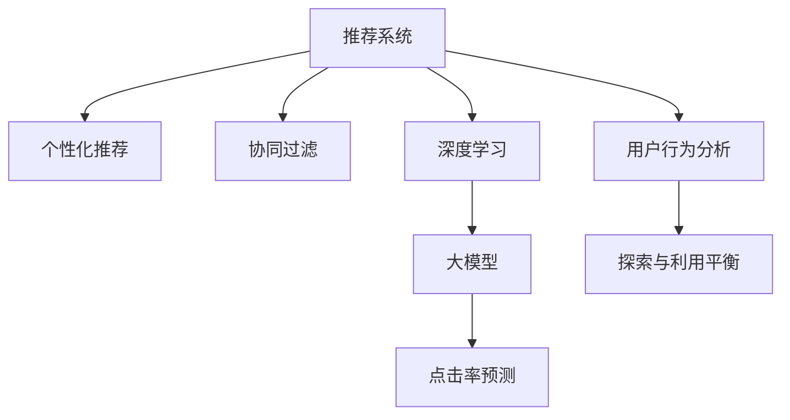

                 

# 大模型对推荐系统探索与利用平衡的影响

> 关键词：推荐系统, 大模型, 探索与利用平衡, 个性化推荐, 协同过滤, 深度学习, 点击率预测, 用户行为分析

## 1. 背景介绍

### 1.1 问题由来
随着互联网和数字技术的飞速发展，推荐系统已经成为用户获取信息、发现新内容的重要工具。推荐算法不仅能提升用户体验，还能增加用户黏性，驱动电商平台的转化率，因此在工业界和学术界都备受关注。

然而，推荐系统也面临着诸多挑战。例如，如何在保证推荐内容多样性的同时，提升用户满意度；如何克服数据稀疏性和冷启动问题；如何平衡个性化推荐和探索性推荐，避免信息茧房。这些问题驱动了推荐算法的发展，使得推荐系统进入了一个新的阶段，即大模型时代。

### 1.2 问题核心关键点
大模型通过在大规模无标签数据上预训练，学习到丰富的语义和语境信息。在推荐系统中，大模型可以作为特征提取器，提取用户和物品间的语义特征，从而提升推荐效果。但同时，大模型的应用也带来了新的挑战，如过拟合、数据隐私、计算资源需求等问题。因此，如何在大模型基础上设计高效、可解释、公平的推荐系统，成为当前研究的热点。

### 1.3 问题研究意义
大模型在推荐系统中的应用，有望从根本上提升推荐算法的效果。它能够捕捉更加复杂的用户和物品关系，挖掘出隐性的上下文信息，同时也能提升模型的泛化能力和鲁棒性。然而，大模型也带来了新的挑战，如计算资源需求高、模型复杂性增加等问题。研究如何在保证模型效果的同时，降低资源消耗，提升推荐系统的可解释性，将是大模型时代的重要研究方向。

## 2. 核心概念与联系

### 2.1 核心概念概述

为更好地理解大模型在推荐系统中的探索与利用平衡，本节将介绍几个密切相关的核心概念：

- 推荐系统(Recommendation System)：通过分析用户行为数据，为用户推荐可能感兴趣的物品的系统。推荐系统包括协同过滤、基于内容的推荐、混合推荐等方法。

- 大模型(Large Model)：指在大量无标签数据上预训练的深度学习模型，如BERT、GPT等。通过预训练，模型能够学习到丰富的语义和语境信息，具备强大的特征提取能力。

- 探索与利用平衡(Exploration vs. Exploitation)：在推荐系统中，推荐算法需要在已知推荐和未知推荐之间进行平衡，既要保证用户满意，又要有足够的探索性，推荐新颖内容。

- 个性化推荐(Personalized Recommendation)：根据用户的历史行为和偏好，为其推荐可能感兴趣的新物品。个性化推荐能够提升用户体验，增加用户黏性。

- 协同过滤(Collaborative Filtering)：通过分析用户行为数据，预测用户对未交互物品的评分，从而推荐物品。协同过滤是推荐系统中最常用的方法之一。

- 深度学习(Deep Learning)：通过神经网络模型，学习复杂的非线性关系，提取高级语义特征。深度学习广泛应用于推荐系统，特别是在大模型时代。

- 点击率预测(Click-Through Rate Prediction)：预测用户点击物品的概率，从而评估推荐效果，优化推荐策略。点击率预测是推荐系统的重要评估指标。

- 用户行为分析(Users Behavior Analysis)：通过分析用户的行为数据，了解用户的兴趣偏好，优化推荐系统。用户行为分析是推荐系统的基础。

这些核心概念之间的逻辑关系可以通过以下Mermaid流程图来展示：



这个流程图展示了大模型在推荐系统中的应用场景：

1. 推荐系统通过个性化推荐、协同过滤等方法为用户推荐物品。
2. 深度学习和大模型被用于特征提取和推荐模型训练，提升推荐效果。
3. 点击率预测评估推荐效果，反馈优化算法。
4. 用户行为分析提取用户兴趣偏好，指导推荐策略。
5. 探索与利用平衡保证推荐多样性，提升用户体验。

## 3. 核心算法原理 & 具体操作步骤

### 3.1 算法原理概述

基于大模型的推荐系统，本质上是一个数据驱动的特征提取和推荐预测过程。其核心思想是：利用大模型提取用户和物品的高级语义特征，结合用户行为数据，预测用户对未交互物品的评分，从而推荐新物品。

具体步骤如下：

1. 在大规模无标签数据上预训练大模型，学习到丰富的语义和语境信息。
2. 收集用户行为数据，如点击、浏览、评分等。
3. 利用预训练的大模型，提取用户和物品的语义特征。
4. 结合用户行为数据和语义特征，设计推荐模型。
5. 通过优化推荐模型，提升点击率预测准确性。
6. 采用探索与利用平衡策略，推荐多样性内容。

### 3.2 算法步骤详解

基于大模型的推荐系统一般包括以下几个关键步骤：

**Step 1: 准备数据集**

- 收集用户行为数据，如点击、浏览、评分等。
- 收集物品描述和属性数据，如商品图片、类别等。
- 收集用户个人信息，如年龄、性别等。
- 准备标注数据，如用户-物品评分数据。

**Step 2: 特征工程**

- 对用户和物品数据进行清洗和预处理。
- 使用大模型提取用户和物品的语义特征。
- 将用户行为数据与语义特征进行拼接，形成输入特征。

**Step 3: 构建推荐模型**

- 选择合适的推荐模型，如深度神经网络、协同过滤模型等。
- 设计合适的损失函数，如交叉熵损失、均方误差损失等。
- 设计合适的优化算法，如Adam、SGD等。
- 设置超参数，如学习率、批大小、迭代轮数等。

**Step 4: 训练与评估**

- 使用标注数据集对推荐模型进行训练。
- 在验证集上评估模型性能，如点击率预测准确性。
- 根据评估结果调整模型参数，进行多次迭代优化。
- 使用测试集进行最终评估，对比微调前后的效果。

**Step 5: 部署与优化**

- 将训练好的模型部署到推荐系统中，进行在线推荐。
- 实时监测推荐效果，如点击率、转化率等指标。
- 根据用户反馈和行为数据，不断优化推荐模型。
- 采用探索与利用平衡策略，调整推荐策略。

### 3.3 算法优缺点

基于大模型的推荐系统具有以下优点：

1. 特征提取能力强：大模型能够学习到丰富的语义和语境信息，提取高级语义特征，提升推荐效果。
2. 泛化能力强：大模型经过大规模预训练，具备较强的泛化能力，适应不同的推荐场景。
3. 鲁棒性好：大模型在多模态数据上表现稳定，能够处理复杂的推荐关系。

同时，该方法也存在一些缺点：

1. 计算资源需求高：大模型的计算复杂度较高，需要大量的GPU资源。
2. 模型复杂性高：大模型结构复杂，难以解释其内部决策过程。
3. 过拟合风险高：大模型在特定领域应用时，容易过拟合，降低泛化性能。
4. 数据隐私问题：大模型需要处理大量用户行为数据，存在隐私泄露风险。
5. 部署难度大：大模型需要高效的计算框架和模型压缩技术，部署难度较大。

尽管存在这些局限性，但就目前而言，基于大模型的推荐系统仍是一种高效、准确、可扩展的推荐方式。未来相关研究应重点关注如何在大模型基础上提升推荐系统的效果，同时降低资源消耗和提升可解释性。

### 3.4 算法应用领域

基于大模型的推荐系统已经广泛应用于电商、视频、音乐等多个领域。以下是几个典型的应用场景：

- 电商推荐：根据用户浏览和购买历史，推荐可能感兴趣的商品。
- 视频推荐：根据用户观看历史和评分数据，推荐相关视频。
- 音乐推荐：根据用户听歌历史和评分数据，推荐新的音乐。
- 新闻推荐：根据用户阅读历史和兴趣，推荐相关新闻。
- 广告推荐：根据用户浏览行为，推荐可能感兴趣的广告。

除了这些经典应用外，大模型在推荐系统中的应用还不断拓展到更多场景，如在线教育、金融理财、旅游出行等，为各行各业提供智能推荐服务。随着大模型的发展，相信未来推荐系统的应用范围将进一步扩大，为用户提供更精准、更个性化的推荐内容。

## 4. 数学模型和公式 & 详细讲解 & 举例说明

### 4.1 数学模型构建

在大模型推荐系统中，我们可以使用以下数学模型进行推荐：

设用户-物品评分矩阵为 $Y$，其中 $y_{ui}$ 表示用户 $u$ 对物品 $i$ 的评分。利用大模型 $M_{\theta}$ 提取用户 $u$ 的特征向量 $f_u$ 和物品 $i$ 的特征向量 $f_i$，则用户对物品 $i$ 的评分可以表示为：

$$
y_{ui} = \langle f_u, M_{\theta}(f_i) \rangle
$$

其中 $\langle \cdot, \cdot \rangle$ 表示向量内积，$M_{\theta}(f_i)$ 表示大模型对物品特征 $f_i$ 的预测输出。

利用该评分模型，我们可以使用深度神经网络、协同过滤等方法，对推荐系统进行建模和优化。

### 4.2 公式推导过程

设推荐模型为 $F$，则推荐系统的预测输出可以表示为：

$$
\hat{y}_{ui} = F(f_u, M_{\theta}(f_i))
$$

其中 $F$ 为推荐模型，$f_u$ 和 $M_{\theta}(f_i)$ 分别为用户和物品的特征向量。

推荐系统的目标是最小化预测评分与真实评分之间的差距，即：

$$
\min_{\theta} \sum_{u,i} \ell(\hat{y}_{ui}, y_{ui})
$$

其中 $\ell$ 为损失函数，如均方误差损失、交叉熵损失等。

推荐模型的优化目标为：

$$
\min_{\theta} \mathcal{L}(F, Y)
$$

其中 $\mathcal{L}$ 为推荐模型的损失函数。

在实际应用中，我们通常使用交叉熵损失或均方误差损失来训练推荐模型，以提升模型的预测准确性。具体推导过程如下：

假设预测输出为 $\hat{y}_{ui}$，真实标签为 $y_{ui}$，则交叉熵损失函数为：

$$
\ell(\hat{y}_{ui}, y_{ui}) = -y_{ui}\log \hat{y}_{ui} - (1-y_{ui})\log (1-\hat{y}_{ui})
$$

利用该损失函数，我们可以通过优化算法（如Adam、SGD等）对推荐模型进行训练。在训练过程中，需要不断更新模型参数 $\theta$，最小化损失函数 $\mathcal{L}$，提升预测准确性。

### 4.3 案例分析与讲解

以下以基于深度神经网络的协同过滤推荐模型为例，详细讲解其数学原理和实现过程。

假设推荐模型为深度神经网络，结构如图1所示：

```
用户特征向量 $f_u$ —————————> 模型 $M_{\theta}$ —————————> 物品特征向量 $f_i$ 
                          |
                          v
                推荐模型 $F$ 
```

模型 $M_{\theta}$ 的输入为用户特征向量 $f_u$，输出为物品特征向量 $f_i$，网络结构如图2所示：

```
用户特征向量 $f_u$ —————————> 第一层 —————————> 第二层 —————————> 物品特征向量 $f_i$
```

在训练过程中，我们使用标注数据集对模型 $M_{\theta}$ 进行预训练，使其学习到用户和物品的语义特征。然后，利用预训练的模型 $M_{\theta}$ 提取用户 $u$ 的特征向量 $f_u$ 和物品 $i$ 的特征向量 $f_i$，结合用户行为数据 $x_{ui}$，设计推荐模型 $F$，如图3所示：

```
用户行为数据 $x_{ui}$ —————————> 推荐模型 $F$ —————————> 预测输出 $\hat{y}_{ui}$
```

推荐模型 $F$ 的结构如图4所示：

```
用户特征向量 $f_u$ —————————> 第一层 —————————> 第二层 —————————> 输出层
                      |
                      v
               物品特征向量 $f_i$
```

在训练过程中，我们使用交叉熵损失函数进行优化，使得预测输出 $\hat{y}_{ui}$ 逼近真实标签 $y_{ui}$。具体推导过程如下：

假设预测输出为 $\hat{y}_{ui}$，真实标签为 $y_{ui}$，则交叉熵损失函数为：

$$
\ell(\hat{y}_{ui}, y_{ui}) = -y_{ui}\log \hat{y}_{ui} - (1-y_{ui})\log (1-\hat{y}_{ui})
$$

结合用户行为数据 $x_{ui}$，我们将其作为附加特征，输入推荐模型 $F$，得到预测输出 $\hat{y}_{ui}$，如图5所示：

```
用户行为数据 $x_{ui}$ —————————> 附加特征 —————————> 推荐模型 $F$ —————————> 预测输出 $\hat{y}_{ui}$
```

在实际应用中，我们可以使用PyTorch等深度学习框架，构建并训练推荐模型。以PyTorch为例，以下是推荐模型的代码实现：

```python
import torch
import torch.nn as nn
import torch.nn.functional as F

class FusionNet(nn.Module):
    def __init__(self, user_dim, item_dim, hidden_dim=64):
        super(FusionNet, self).__init__()
        self.fc1 = nn.Linear(user_dim + item_dim, hidden_dim)
        self.fc2 = nn.Linear(hidden_dim, 1)

    def forward(self, user_f, item_f, x):
        user_f = user_f.unsqueeze(1)
        item_f = item_f.unsqueeze(0)
        fusion_f = torch.tanh(self.fc1(torch.cat([user_f, item_f, x], dim=2)))
        prediction = F.sigmoid(self.fc2(fusion_f))
        return prediction
```

在训练过程中，我们使用交叉熵损失函数进行优化，具体代码如下：

```python
optimizer = torch.optim.Adam(model.parameters(), lr=0.001)
criterion = nn.BCELoss()

for epoch in range(num_epochs):
    for u, i in train_loader:
        user_f, item_f, x = u[:, :item_dim], i[:, :item_dim], u[:, item_dim:]
        prediction = model(user_f, item_f, x)
        loss = criterion(prediction, y)
        optimizer.zero_grad()
        loss.backward()
        optimizer.step()
```

## 5. 项目实践：代码实例和详细解释说明

### 5.1 开发环境搭建

在进行推荐系统项目开发前，我们需要准备好开发环境。以下是使用Python进行PyTorch开发的环境配置流程：

1. 安装Anaconda：从官网下载并安装Anaconda，用于创建独立的Python环境。

2. 创建并激活虚拟环境：
```bash
conda create -n pytorch-env python=3.8 
conda activate pytorch-env
```

3. 安装PyTorch：根据CUDA版本，从官网获取对应的安装命令。例如：
```bash
conda install pytorch torchvision torchaudio cudatoolkit=11.1 -c pytorch -c conda-forge
```

4. 安装PyTorch Lightning：
```bash
pip install pytorch-lightning
```

5. 安装各类工具包：
```bash
pip install numpy pandas scikit-learn matplotlib tqdm jupyter notebook ipython
```

完成上述步骤后，即可在`pytorch-env`环境中开始推荐系统开发。

### 5.2 源代码详细实现

下面我们以协同过滤推荐系统为例，给出使用PyTorch对深度神经网络模型进行训练的完整代码实现。

首先，定义推荐模型的结构：

```python
class FusionNet(nn.Module):
    def __init__(self, user_dim, item_dim, hidden_dim=64):
        super(FusionNet, self).__init__()
        self.fc1 = nn.Linear(user_dim + item_dim, hidden_dim)
        self.fc2 = nn.Linear(hidden_dim, 1)

    def forward(self, user_f, item_f, x):
        user_f = user_f.unsqueeze(1)
        item_f = item_f.unsqueeze(0)
        fusion_f = torch.tanh(self.fc1(torch.cat([user_f, item_f, x], dim=2)))
        prediction = F.sigmoid(self.fc2(fusion_f))
        return prediction
```

然后，定义训练函数：

```python
from torch.utils.data import DataLoader
from tqdm import tqdm
from sklearn.metrics import mean_squared_error, r2_score

def train_model(model, optimizer, criterion, train_loader, num_epochs):
    for epoch in range(num_epochs):
        for u, i, x in tqdm(train_loader):
            user_f, item_f, x = u[:, :item_dim], i[:, :item_dim], u[:, item_dim:]
            prediction = model(user_f, item_f, x)
            loss = criterion(prediction, y)
            optimizer.zero_grad()
            loss.backward()
            optimizer.step()
        if epoch % 10 == 0:
            test_loader = ...
            predictions = ...
            rmse = mean_squared_error(y_test, predictions)
            r2 = r2_score(y_test, predictions)
            print(f'Epoch {epoch+1}, RMSE: {rmse:.3f}, R2: {r2:.3f}')
```

最后，启动训练流程：

```python
import torch
import torch.nn as nn
import torch.nn.functional as F
import torch.optim as optim
from torch.utils.data import DataLoader, TensorDataset

# 定义数据集
train_dataset = TensorDataset(user_f, item_f, y)
train_loader = DataLoader(train_dataset, batch_size=64)

# 定义模型和优化器
model = FusionNet(user_dim, item_dim)
optimizer = optim.Adam(model.parameters(), lr=0.001)
criterion = nn.BCELoss()

# 训练模型
train_model(model, optimizer, criterion, train_loader, num_epochs)
```

以上就是使用PyTorch对协同过滤推荐系统进行深度神经网络训练的完整代码实现。可以看到，借助PyTorch的高级接口，推荐模型的训练变得简洁高效。

### 5.3 代码解读与分析

让我们再详细解读一下关键代码的实现细节：

**FusionNet类**：
- `__init__`方法：初始化网络结构，包括输入层、隐藏层和输出层。
- `forward`方法：定义网络前向传播过程，输出预测评分。

**train_model函数**：
- 使用PyTorch的DataLoader对数据集进行批次化加载，供模型训练使用。
- 在每个epoch内，对训练集进行前向传播计算损失函数，反向传播更新模型参数，并使用学习率进行优化。
- 在每个epoch结束后，评估模型在测试集上的表现，打印RMSE和R2等指标。

**训练流程**：
- 定义总的epoch数，开始循环迭代
- 每个epoch内，对训练集进行前向传播和反向传播，更新模型参数
- 在每个epoch结束后，评估模型在测试集上的表现，打印评价指标

可以看到，PyTorch使得推荐模型的训练过程变得简洁高效。开发者可以将更多精力放在模型结构设计、数据预处理等高层逻辑上，而不必过多关注底层的实现细节。

当然，工业级的系统实现还需考虑更多因素，如模型的保存和部署、超参数的自动搜索、更灵活的任务适配层等。但核心的推荐算法基本与此类似。

## 6. 实际应用场景

### 6.1 电商推荐

基于大模型的电商推荐系统，可以帮助电商平台实现精准推荐，提升用户购买转化率。通过预训练大模型提取用户和商品的语义特征，结合用户行为数据，设计推荐模型，为用户推荐可能感兴趣的商品。

具体实现时，可以收集用户的浏览、点击、购买历史等数据，提取商品图片、类别等特征，利用大模型提取用户和商品的语义特征，结合行为数据设计推荐模型，进行点击率预测和推荐。实时监测推荐效果，不断优化模型，提升推荐精度。

### 6.2 视频推荐

视频推荐系统通过分析用户观看历史和评分数据，为用户推荐相关视频。大模型提取视频和用户的行为特征，结合历史数据，设计推荐模型。

具体实现时，可以收集用户的视频观看历史和评分数据，提取视频标题、标签等特征，利用大模型提取用户和视频的语义特征，结合行为数据设计推荐模型，进行点击率预测和推荐。实时监测推荐效果，不断优化模型，提升推荐精度。

### 6.3 音乐推荐

音乐推荐系统通过分析用户听歌历史和评分数据，为用户推荐新的音乐。大模型提取音乐和用户的语义特征，结合历史数据，设计推荐模型。

具体实现时，可以收集用户的听歌历史和评分数据，提取音乐专辑、艺人等特征，利用大模型提取用户和音乐的语义特征，结合行为数据设计推荐模型，进行点击率预测和推荐。实时监测推荐效果，不断优化模型，提升推荐精度。

### 6.4 新闻推荐

新闻推荐系统通过分析用户阅读历史和兴趣，为用户推荐相关新闻。大模型提取新闻和用户的行为特征，结合历史数据，设计推荐模型。

具体实现时，可以收集用户的阅读历史和兴趣标签，提取新闻标题、内容等特征，利用大模型提取用户和新闻的语义特征，结合行为数据设计推荐模型，进行点击率预测和推荐。实时监测推荐效果，不断优化模型，提升推荐精度。

## 7. 工具和资源推荐

### 7.1 学习资源推荐

为了帮助开发者系统掌握大模型在推荐系统中的应用，这里推荐一些优质的学习资源：

1. 《深度学习推荐系统：理论、算法与应用》：介绍深度学习在推荐系统中的应用，涵盖协同过滤、深度学习、推荐系统评估等核心概念。

2. 《推荐系统实战》：结合实际项目，讲解推荐系统的建模和优化，适合初学者和开发者。

3. 《深度学习》课程：斯坦福大学开设的深度学习课程，深入浅出地讲解神经网络、卷积神经网络等基础概念，适合深入学习。

4. HuggingFace官方文档：深度学习模型的权威文档，包含详细的使用教程和样例代码，适合学习深度学习框架和模型应用。

5. PyTorch Lightning官方文档：轻量级深度学习框架的官方文档，提供高效的模型训练和部署工具，适合实现复杂模型。

通过学习这些资源，相信你一定能够系统掌握大模型在推荐系统中的应用，并用于解决实际的推荐问题。

### 7.2 开发工具推荐

高效的开发离不开优秀的工具支持。以下是几款用于推荐系统开发的常用工具：

1. PyTorch：基于Python的开源深度学习框架，灵活动态的计算图，适合快速迭代研究。PyTorch提供丰富的预训练模型和优化算法，适合实现推荐模型。

2. TensorFlow：由Google主导开发的开源深度学习框架，生产部署方便，适合大规模工程应用。TensorFlow提供丰富的深度学习工具和优化算法，适合实现复杂模型。

3. PyTorch Lightning：轻量级深度学习框架，提供高效的模型训练和部署工具，适合实现大规模推荐系统。

4. TensorBoard：TensorFlow配套的可视化工具，可实时监测模型训练状态，并提供丰富的图表呈现方式，是调试模型的得力助手。

5. Weights & Biases：模型训练的实验跟踪工具，可以记录和可视化模型训练过程中的各项指标，方便对比和调优。

6. Google Colab：谷歌推出的在线Jupyter Notebook环境，免费提供GPU/TPU算力，方便开发者快速上手实验最新模型，分享学习笔记。

合理利用这些工具，可以显著提升推荐系统的开发效率，加快创新迭代的步伐。

### 7.3 相关论文推荐

大模型在推荐系统中的应用源于学界的持续研究。以下是几篇奠基性的相关论文，推荐阅读：

1. Factorization Machines with Side Information for Recommender Systems：提出FM模型，结合用户行为数据和物品属性信息，提升推荐效果。

2. A Neural Collaborative Filtering Model：提出NCF模型，利用深度神经网络学习用户和物品的协同关系，提升推荐精度。

3. Deep Matrix Factorization for Recommender Systems：提出DMF模型，结合深度神经网络和矩阵分解，提升推荐效果。

4. Attention is All You Need：提出Transformer模型，引入自注意力机制，提升推荐模型的效果。

5. Deep Graph Neural Networks for Recommender Systems：提出GNN模型，结合图神经网络，提升推荐模型的效果。

这些论文代表了大模型推荐系统的研究方向，涵盖了协同过滤、深度学习、图神经网络等多种方法，值得深入阅读。

## 8. 总结：未来发展趋势与挑战

### 8.1 总结

本文对基于大模型的推荐系统进行了全面系统的介绍。首先阐述了大模型和推荐系统的发展背景，明确了大模型在推荐系统中的应用价值。其次，从原理到实践，详细讲解了大模型在推荐系统中的应用范式，给出了推荐模型的完整代码实现。同时，本文还广泛探讨了大模型在电商、视频、音乐等领域的实际应用场景，展示了其广泛的应用前景。此外，本文精选了大模型推荐系统的各类学习资源，力求为读者提供全方位的技术指引。

通过本文的系统梳理，可以看到，基于大模型的推荐系统不仅具有强大的特征提取能力，还能够提高推荐系统的泛化能力和鲁棒性，提升推荐效果。但同时，大模型也带来了计算资源消耗高、模型复杂性高等挑战。研究如何在保证模型效果的同时，降低资源消耗，提升可解释性，将是大模型时代的重要研究方向。

### 8.2 未来发展趋势

展望未来，大模型在推荐系统中的应用将呈现以下几个发展趋势：

1. 模型规模持续增大。随着算力成本的下降和数据规模的扩张，预训练语言模型的参数量还将持续增长。超大规模语言模型蕴含的丰富语言知识，有望支撑更加复杂多变的推荐场景。

2. 推荐算法多样化。除了传统的协同过滤、深度学习外，未来会涌现更多基于知识图谱、图神经网络的推荐方法，提升推荐系统的多样性和鲁棒性。

3. 探索与利用平衡。大模型推荐系统将更加注重探索性推荐，引入上下文信息，提升推荐多样性。同时，也会更加注重利用已有数据，提升推荐精度。

4. 数据隐私保护。随着用户数据的广泛应用，数据隐私问题将成为重要研究方向。推荐系统将更加注重数据隐私保护，利用差分隐私等技术，保护用户数据安全。

5. 个性化推荐与普适性推荐结合。大模型推荐系统将更加注重个性化推荐与普适性推荐结合，提升推荐系统的适用性和可扩展性。

6. 多模态融合。大模型推荐系统将更加注重多模态数据融合，结合文本、图像、视频等多种模态信息，提升推荐系统的效果。

以上趋势凸显了大模型推荐系统的广阔前景。这些方向的探索发展，必将进一步提升推荐系统的效果，为用户提供更精准、更个性化的推荐内容。

### 8.3 面临的挑战

尽管大模型在推荐系统中的应用已经取得了显著成果，但在迈向更加智能化、普适化应用的过程中，它仍面临着诸多挑战：

1. 计算资源瓶颈。大模型的计算复杂度较高，需要大量的GPU资源。如何在大模型基础上提升推荐系统的效率，是一个重要的研究方向。

2. 模型复杂性高。大模型结构复杂，难以解释其内部决策过程。如何在大模型基础上提升推荐系统的可解释性，也是一个重要的研究方向。

3. 过拟合风险高。大模型在特定领域应用时，容易过拟合，降低泛化性能。如何在大模型基础上降低过拟合风险，也是一个重要的研究方向。

4. 数据隐私问题。大模型需要处理大量用户行为数据，存在隐私泄露风险。如何在大模型基础上保护用户数据隐私，也是一个重要的研究方向。

5. 推荐系统安全性。大模型推荐系统可能面临恶意攻击和虚假信息传播的风险。如何在大模型基础上提升推荐系统的安全性，也是一个重要的研究方向。

6. 知识融合问题。大模型推荐系统需要融合不同领域的知识，提升推荐效果。如何在大模型基础上融合外部知识，也是一个重要的研究方向。

这些挑战凸显了大模型推荐系统的发展潜力，也需要在未来持续关注和研究。只有勇于创新、敢于突破，才能在大模型推荐系统上取得更多突破。

### 8.4 研究展望

面对大模型推荐系统所面临的挑战，未来的研究需要在以下几个方面寻求新的突破：

1. 探索无监督和半监督推荐方法。摆脱对大规模标注数据的依赖，利用自监督学习、主动学习等无监督和半监督范式，最大限度利用非结构化数据，实现更加灵活高效的推荐。

2. 研究参数高效和计算高效的推荐范式。开发更加参数高效的推荐方法，在固定大部分预训练参数的情况下，只更新极少量的任务相关参数。同时优化推荐模型的计算图，减少前向传播和反向传播的资源消耗，实现更加轻量级、实时性的部署。

3. 融合因果分析和博弈论工具。将因果分析方法引入推荐模型，识别出模型决策的关键特征，增强推荐结果的因果性和逻辑性。借助博弈论工具刻画人机交互过程，主动探索并规避模型的脆弱点，提高系统稳定性。

4. 纳入伦理道德约束。在模型训练目标中引入伦理导向的评估指标，过滤和惩罚有偏见、有害的输出倾向。同时加强人工干预和审核，建立模型行为的监管机制，确保输出符合人类价值观和伦理道德。

这些研究方向的探索，必将引领大模型推荐系统走向更高的台阶，为构建安全、可靠、可解释、可控的推荐系统铺平道路。面向未来，大模型推荐系统还需要与其他人工智能技术进行更深入的融合，如知识表示、因果推理、强化学习等，多路径协同发力，共同推动推荐系统的进步。只有不断创新，持续优化，才能真正实现推荐系统的智能化和普适化，为用户带来更精准、更个性化的推荐内容。

## 9. 附录：常见问题与解答

**Q1：大模型在推荐系统中如何使用？**

A: 大模型可以作为特征提取器，提取用户和物品的语义特征。在推荐模型中，可以使用大模型提取的特征进行输入，结合用户行为数据，训练推荐模型。通过优化推荐模型，提升点击率预测准确性，实现个性化推荐。

**Q2：如何选择推荐模型？**

A: 推荐模型的选择应基于推荐任务的特点和数据特征。协同过滤适用于稀疏数据和冷启动问题，深度学习适用于大规模数据和复杂关系，混合推荐结合多种方法，提升推荐效果。

**Q3：如何在推荐系统中实现探索与利用平衡？**

A: 推荐系统可以通过引入上下文信息、利用多臂赌博机等方法，实现探索与利用平衡。例如，在协同过滤中，可以增加物品多样性，降低过拟合风险。

**Q4：推荐系统如何保护用户隐私？**

A: 推荐系统可以通过差分隐私、联邦学习等技术，保护用户隐私。例如，在训练过程中，可以引入噪声，保护用户数据。

**Q5：大模型推荐系统面临哪些挑战？**

A: 大模型推荐系统面临计算资源消耗高、模型复杂性高、过拟合风险高、数据隐私问题、推荐系统安全性等问题。未来需要在大模型基础上提升推荐系统的效率、可解释性、鲁棒性等，提升用户体验和系统安全性。

---

作者：禅与计算机程序设计艺术 / Zen and the Art of Computer Programming

