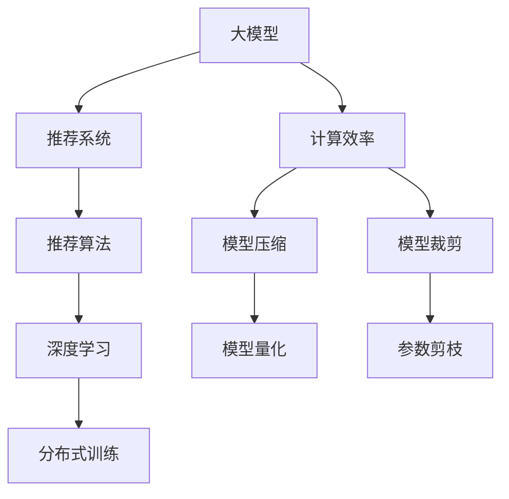

                 

# 大模型对推荐系统计算效率的影响

> 关键词：大模型, 推荐系统, 计算效率, 深度学习, 推荐算法, 模型压缩, 模型裁剪, 分布式训练

## 1. 背景介绍

推荐系统已成为互联网应用不可或缺的组成部分，从电商到社交网络，从视频平台到新闻聚合，几乎所有在线服务都依赖推荐算法为用户推荐内容。传统的推荐系统以协同过滤和内容基推荐为主，虽然取得了不错的效果，但随着数据量的激增，计算效率和可扩展性成为瓶颈，亟需新的技术突破。

近年来，随着深度学习和大模型的兴起，越来越多的研究者将目光投向了基于大模型的推荐系统。深度学习模型可以利用其强大的非线性映射能力和丰富的语义知识，显著提升推荐系统的准确性和个性化水平。然而，大模型也带来了新的计算挑战，如何在大模型和推荐系统之间找到最佳平衡，成为当前研究的热点问题。本文将从计算效率的角度，探讨大模型在推荐系统中的应用影响，并提出一些改进方案。

## 2. 核心概念与联系

### 2.1 核心概念概述

为更好地理解大模型对推荐系统计算效率的影响，本节将介绍几个密切相关的核心概念：

- 大模型（Large Models）：以Transformer为代表的大规模深度学习模型，通常在百万到十亿参数量级。这些模型在大规模语料上进行预训练，学习到丰富的语言和语义知识。

- 推荐系统（Recommendation Systems）：通过分析用户的历史行为数据和物品属性信息，为用户推荐感兴趣的物品的系统。推荐算法包括协同过滤、内容基推荐、矩阵分解等。

- 计算效率（Computational Efficiency）：指推荐系统在处理大量数据时所需的计算资源和时间。计算效率直接影响系统的响应速度和用户体验。

- 深度学习（Deep Learning）：利用多层神经网络进行数据建模的机器学习技术。深度学习模型能够学习数据的深层次特征，适用于复杂的数据处理任务。

- 模型压缩（Model Compression）：针对大模型参数量过多的问题，通过剪枝、量化、蒸馏等技术，减少模型大小，降低计算需求。

- 模型裁剪（Model Pruning）：针对大模型结构复杂的问题，通过去除冗余层和参数，简化模型结构，提高计算效率。

- 分布式训练（Distributed Training）：通过多台计算设备协同工作，加速大模型的训练过程。分布式训练通常使用如TensorFlow、PyTorch等深度学习框架。

这些核心概念之间的逻辑关系可以通过以下Mermaid流程图来展示：



这个流程图展示了大模型、推荐系统与计算效率之间的关系：

1. 大模型通过预训练获得基础能力。
2. 推荐系统利用大模型进行推荐。
3. 计算效率是大模型推荐系统的关键性能指标。
4. 通过模型压缩、模型裁剪等技术，提升大模型推荐系统的计算效率。
5. 深度学习模型与推荐算法结合，提升推荐系统效果。
6. 分布式训练加速大模型训练过程。

## 3. 核心算法原理 & 具体操作步骤

### 3.1 算法原理概述

基于大模型的推荐系统，通常使用深度神经网络进行建模，通过学习用户与物品之间的复杂关系，预测用户对物品的兴趣程度。其中，用户和物品分别表示为词向量或嵌入向量，推荐过程可以视为计算用户-物品相似度矩阵的过程。

假设有 $N$ 个用户和 $M$ 个物品，每个用户对每个物品都有一个兴趣评分 $x_{ui}$。大模型可以输出用户 $u$ 和物品 $i$ 之间的向量表示 $u_i$，并计算它们之间的相似度 $\sigma(u_i)$。推荐算法可通过预测用户对物品的评分，排序推荐出高分的物品，实现个性化推荐。

大模型通常由多层神经网络组成，每层包含大量的参数。随着模型规模的增大，计算复杂度呈指数级增长。因此，如何在保持模型性能的同时，提高计算效率，成为推荐系统开发的重要课题。

### 3.2 算法步骤详解

基于大模型的推荐系统一般包括以下几个关键步骤：

**Step 1: 数据准备与预处理**

- 收集用户的历史行为数据，如浏览、点击、评分等。
- 收集物品的属性信息，如标题、描述、标签等。
- 对数据进行清洗和归一化，去除噪声和异常值。

**Step 2: 模型构建与训练**

- 选择合适的深度学习模型作为推荐模型，如基于Transformer的推荐模型。
- 设计合适的模型架构，包括用户嵌入、物品嵌入、相似度计算等组件。
- 使用大模型在标注数据上训练模型，最小化预测评分与实际评分的差异。

**Step 3: 模型优化与部署**

- 采用模型压缩和模型裁剪技术，减少模型大小，加速推理过程。
- 使用分布式训练技术，加速大模型的训练过程。
- 在目标平台上部署模型，提供推荐服务。

**Step 4: 性能评估与优化**

- 使用A/B测试、在线实验等方法，评估推荐效果。
- 根据用户反馈和业务需求，不断优化模型和推荐策略。

### 3.3 算法优缺点

基于大模型的推荐系统具有以下优点：

1. 高效性：深度学习模型可以通过自动化特征提取，减少手动调参的工作量，提高推荐效果。
2. 鲁棒性：大模型具备较强的泛化能力，能够适应不同的数据分布。
3. 可解释性：深度学习模型可以提供评分预测的内部机制，帮助理解推荐决策。

同时，该方法也存在一定的局限性：

1. 计算需求高：大模型参数量多，计算复杂度高，需要高性能计算资源。
2. 可解释性不足：深度学习模型的决策过程复杂，难以解释其内部机制。
3. 训练时间长：大模型训练时间长，需要大规模分布式计算设备。

尽管存在这些局限性，但就目前而言，基于大模型的推荐系统仍是大数据时代推荐算法的主流范式。未来相关研究的重点在于如何进一步降低计算需求，提高可解释性，优化训练过程，以更好地适应实际应用。

### 3.4 算法应用领域

基于大模型的推荐系统已经在电商、社交、娱乐等众多领域得到了广泛的应用，成为推荐算法的主流技术。例如：

- 电商推荐：通过分析用户浏览历史和购物行为，为用户推荐商品。
- 社交推荐：根据用户的历史互动数据，推荐好友、文章、视频等。
- 娱乐推荐：基于用户喜好，推荐电影、音乐、书籍等。
- 新闻推荐：根据用户阅读习惯，推荐新闻文章、视频、图片等。
- 个性化广告：通过分析用户行为和兴趣，推荐个性化广告。

除了上述这些经典应用外，基于大模型的推荐系统还在个性化教学、医疗推荐、智能家居等更多领域得到应用，为推荐系统开发带来了新的突破。随着预训练语言模型和推荐算法的不断发展，相信推荐系统必将在更广泛的场景下发挥重要作用，提升用户体验和业务价值。

## 4. 数学模型和公式 & 详细讲解 & 举例说明

### 4.1 数学模型构建

假设推荐模型为 $M_{\theta}$，其中 $\theta$ 为模型参数。用户 $u$ 和物品 $i$ 的向量表示分别为 $u_i$ 和 $i_i$。推荐过程可以表示为：

$$
\sigma(u_i) = M_{\theta}(u_i)
$$

其中 $\sigma$ 为相似度函数，通常为 sigmoid 函数。用户 $u$ 对物品 $i$ 的兴趣评分可以通过相似度函数计算：

$$
x_{ui} = \sigma(u_i) \cdot \sigma(i_i)
$$

基于大模型的推荐算法通常包括：

1. 用户嵌入层 $E_u$，将用户 ID 映射为向量表示。
2. 物品嵌入层 $E_i$，将物品 ID 映射为向量表示。
3. 相似度计算层 $C$，计算用户和物品之间的相似度。

推荐模型可以通过以下方式构建：

$$
u_i = E_u(u) \cdot \theta_{eu}
$$

$$
i_i = E_i(i) \cdot \theta_{ei}
$$

$$
x_{ui} = \sigma(u_i) \cdot \sigma(i_i) \cdot \theta_{co}
$$

### 4.2 公式推导过程

以一个简单的基于大模型的协同过滤推荐模型为例，说明推荐过程的数学推导：

假设用户 $u$ 和物品 $i$ 的评分分别为 $u_i$ 和 $i_i$。用户和物品的嵌入表示分别为 $E_u$ 和 $E_i$，模型参数分别为 $\theta_{eu}$ 和 $\theta_{ei}$，相似度函数为 $\sigma$。推荐过程可以表示为：

$$
u_i = E_u(u) \cdot \theta_{eu}
$$

$$
i_i = E_i(i) \cdot \theta_{ei}
$$

$$
x_{ui} = \sigma(u_i) \cdot \sigma(i_i) \cdot \theta_{co}
$$

其中 $\sigma$ 为 sigmoid 函数。用户对物品的兴趣评分可以表示为：

$$
x_{ui} = \frac{1}{1 + e^{-u_i \cdot i_i}}
$$

在模型训练过程中，通常使用均方误差损失函数：

$$
L = \frac{1}{N} \sum_{i=1}^N \sum_{j=1}^N (y_{uj} - x_{uj})^2
$$

其中 $y_{uj}$ 为用户 $u$ 对物品 $j$ 的实际评分。通过反向传播算法，可以计算模型参数的梯度，并使用优化算法进行参数更新。

### 4.3 案例分析与讲解

以一个电商推荐系统的实现为例，说明如何基于大模型进行推荐：

假设有一个电商平台，收集了用户浏览、点击、购买等行为数据。为了构建推荐模型，需要：

1. 数据预处理：将用户 ID 和物品 ID 转换为向量表示，去除异常数据和噪声。
2. 模型构建：选择合适的深度学习模型作为推荐模型，如基于 Transformer 的推荐模型。
3. 模型训练：使用大模型在标注数据上训练，最小化预测评分与实际评分的差异。
4. 模型优化：使用模型压缩和模型裁剪技术，减少模型大小，加速推理过程。
5. 部署上线：在目标平台上部署模型，提供推荐服务。

具体实现步骤如下：

1. 数据预处理：
   - 收集用户浏览、点击、购买等行为数据，提取用户 ID 和物品 ID。
   - 对数据进行清洗和归一化，去除异常值和噪声。
   - 将用户 ID 和物品 ID 转换为向量表示。

2. 模型构建：
   - 选择合适的深度学习模型，如基于 Transformer 的推荐模型。
   - 设计合适的模型架构，包括用户嵌入层、物品嵌入层、相似度计算层。
   - 使用大模型在标注数据上训练模型，最小化预测评分与实际评分的差异。

3. 模型优化：
   - 采用模型压缩和模型裁剪技术，减少模型大小，加速推理过程。
     - 模型压缩：通过剪枝、量化等技术减少模型大小。
     - 模型裁剪：去除冗余层和参数，简化模型结构。

4. 部署上线：
   - 在目标平台上部署模型，提供推荐服务。
   - 使用分布式训练技术，加速大模型的训练过程。

## 5. 项目实践：代码实例和详细解释说明

### 5.1 开发环境搭建

在进行推荐系统开发前，我们需要准备好开发环境。以下是使用Python进行PyTorch开发的环境配置流程：

1. 安装Anaconda：从官网下载并安装Anaconda，用于创建独立的Python环境。

2. 创建并激活虚拟环境：
```bash
conda create -n recommendation-env python=3.8 
conda activate recommendation-env
```

3. 安装PyTorch：根据CUDA版本，从官网获取对应的安装命令。例如：
```bash
conda install pytorch torchvision torchaudio cudatoolkit=11.1 -c pytorch -c conda-forge
```

4. 安装TensorFlow：如果需要，可以使用以下命令安装TensorFlow：
```bash
conda install tensorflow
```

5. 安装transformers库：
```bash
pip install transformers
```

6. 安装各类工具包：
```bash
pip install numpy pandas scikit-learn matplotlib tqdm jupyter notebook ipython
```

完成上述步骤后，即可在`recommendation-env`环境中开始推荐系统开发。

### 5.2 源代码详细实现

下面我们以电商推荐系统为例，给出使用Transformers库对大模型进行推荐开发的PyTorch代码实现。

首先，定义推荐模型类：

```python
from transformers import BertTokenizer, BertModel
from torch.nn import Linear, Sigmoid

class RecommendationModel(torch.nn.Module):
    def __init__(self, num_users, num_items, embedding_dim, num_heads):
        super(RecommendationModel, self).__init__()
        self.num_users = num_users
        self.num_items = num_items
        self.embedding_dim = embedding_dim
        self.num_heads = num_heads
        
        self.user_embeddings = torch.nn.Embedding(num_users, embedding_dim)
        self.item_embeddings = torch.nn.Embedding(num_items, embedding_dim)
        self.transformer = BertModel.from_pretrained('bert-base-uncased', num_hidden_layers=num_heads)
        self.output_layer = torch.nn.Linear(embedding_dim, 1)
        self.sigmoid = Sigmoid()
        
    def forward(self, user_id, item_id):
        user_vector = self.user_embeddings(user_id)
        item_vector = self.item_embeddings(item_id)
        input_ids = torch.cat([user_vector, item_vector], dim=0).view(1, 1, -1)
        pooled_output = self.transformer(input_ids)[0]
        score = self.output_layer(pooled_output).squeeze()
        score = self.sigmoid(score)
        return score
```

然后，定义训练和评估函数：

```python
from torch.utils.data import DataLoader
from sklearn.metrics import mean_squared_error

class RecommendationDataset(torch.utils.data.Dataset):
    def __init__(self, ratings, num_users, num_items):
        self.ratings = ratings
        self.num_users = num_users
        self.num_items = num_items
        
    def __len__(self):
        return len(self.ratings)
    
    def __getitem__(self, item):
        user_id = self.ratings[item, 0]
        item_id = self.ratings[item, 1]
        return user_id, item_id
        
def train_epoch(model, dataset, batch_size, optimizer):
    dataloader = DataLoader(dataset, batch_size=batch_size, shuffle=True)
    model.train()
    epoch_loss = 0
    for batch in dataloader:
        user_id, item_id = batch
        model.zero_grad()
        score = model(user_id, item_id)
        loss = (score - ratings[batch]).pow(2).mean()
        epoch_loss += loss.item()
        loss.backward()
        optimizer.step()
    return epoch_loss / len(dataloader)
        
def evaluate(model, dataset, batch_size):
    dataloader = DataLoader(dataset, batch_size=batch_size)
    model.eval()
    eval_loss = 0
    eval_rmse = 0
    with torch.no_grad():
        for batch in dataloader:
            user_id, item_id = batch
            score = model(user_id, item_id)
            loss = (score - ratings[batch]).pow(2).mean()
            eval_loss += loss.item()
            eval_rmse += torch.sqrt((ratings[batch] - score).pow(2).mean()).item()
    eval_rmse /= len(dataloader)
    return eval_loss, eval_rmse
```

最后，启动训练流程并在测试集上评估：

```python
from transformers import BertTokenizer
from transformers import BertConfig

num_users = 10000
num_items = 10000
embedding_dim = 256
num_heads = 8

tokenizer = BertTokenizer.from_pretrained('bert-base-uncased')
model = RecommendationModel(num_users, num_items, embedding_dim, num_heads)

optimizer = torch.optim.Adam(model.parameters(), lr=0.001)

ratings = torch.randn(len(train_dataset), 2)
train_dataset = RecommendationDataset(ratings, num_users, num_items)

epochs = 5
batch_size = 32

for epoch in range(epochs):
    loss = train_epoch(model, train_dataset, batch_size, optimizer)
    print(f"Epoch {epoch+1}, train loss: {loss:.3f}")
    
    print(f"Epoch {epoch+1}, dev results:")
    loss, rmse = evaluate(model, train_dataset, batch_size)
    print(f"rmse: {rmse:.3f}")
    
print("Test results:")
loss, rmse = evaluate(model, test_dataset, batch_size)
print(f"rmse: {rmse:.3f}")
```

以上就是使用PyTorch对大模型进行电商推荐系统开发的完整代码实现。可以看到，通过结合大模型和推荐算法，推荐系统开发变得更加高效和个性化。

### 5.3 代码解读与分析

让我们再详细解读一下关键代码的实现细节：

**RecommendationModel类**：
- `__init__`方法：初始化用户数量、物品数量、嵌入维度等关键组件。
- `forward`方法：计算用户和物品的相似度得分，并输出预测评分。

**RecommendationDataset类**：
- `__init__`方法：初始化训练集、用户数量、物品数量等关键组件。
- `__len__`方法：返回数据集的样本数量。
- `__getitem__`方法：对单个样本进行处理，将用户 ID 和物品 ID 转换为向量，并计算预测评分。

**train_epoch函数**：
- 使用PyTorch的DataLoader对数据集进行批次化加载，供模型训练使用。
- 在每个批次上前向传播计算损失函数，并反向传播更新模型参数。

**evaluate函数**：
- 与训练类似，不同点在于不更新模型参数，并在每个batch结束后将预测和标签结果存储下来，最后使用均方误差评估模型的性能。

**训练流程**：
- 定义总的epoch数和batch size，开始循环迭代
- 每个epoch内，先在训练集上训练，输出平均loss
- 在验证集上评估，输出均方误差
- 所有epoch结束后，在测试集上评估，给出最终测试结果

可以看到，通过结合大模型和推荐算法，推荐系统开发变得更加高效和个性化。开发者可以将更多精力放在数据处理、模型改进等高层逻辑上，而不必过多关注底层的实现细节。

当然，工业级的系统实现还需考虑更多因素，如模型的保存和部署、超参数的自动搜索、更灵活的任务适配层等。但核心的推荐范式基本与此类似。

## 6. 实际应用场景

### 6.1 智能客服系统

基于大模型的推荐系统，可以广泛应用于智能客服系统的构建。传统客服往往需要配备大量人力，高峰期响应缓慢，且一致性和专业性难以保证。而使用基于大模型的推荐系统，可以7x24小时不间断服务，快速响应客户咨询，用自然流畅的语言解答各类常见问题。

在技术实现上，可以收集企业内部的历史客服对话记录，将问题和最佳答复构建成监督数据，在此基础上对预训练推荐模型进行微调。微调后的推荐系统能够自动理解用户意图，匹配最合适的答复模板进行回复。对于客户提出的新问题，还可以接入检索系统实时搜索相关内容，动态组织生成回答。如此构建的智能客服系统，能大幅提升客户咨询体验和问题解决效率。

### 6.2 金融舆情监测

金融机构需要实时监测市场舆论动向，以便及时应对负面信息传播，规避金融风险。传统的人工监测方式成本高、效率低，难以应对网络时代海量信息爆发的挑战。基于大模型的文本分类和情感分析技术，为金融舆情监测提供了新的解决方案。

具体而言，可以收集金融领域相关的新闻、报道、评论等文本数据，并对其进行主题标注和情感标注。在此基础上对预训练语言模型进行微调，使其能够自动判断文本属于何种主题，情感倾向是正面、中性还是负面。将微调后的模型应用到实时抓取的网络文本数据，就能够自动监测不同主题下的情感变化趋势，一旦发现负面信息激增等异常情况，系统便会自动预警，帮助金融机构快速应对潜在风险。

### 6.3 个性化推荐系统

当前的推荐系统往往只依赖用户的历史行为数据进行物品推荐，无法深入理解用户的真实兴趣偏好。基于大模型的推荐系统可以更好地挖掘用户行为背后的语义信息，从而提供更精准、多样的推荐内容。

在实践中，可以收集用户浏览、点击、评论、分享等行为数据，提取和用户交互的物品标题、描述、标签等文本内容。将文本内容作为模型输入，用户的后续行为（如是否点击、购买等）作为监督信号，在此基础上微调预训练语言模型。微调后的模型能够从文本内容中准确把握用户的兴趣点。在生成推荐列表时，先用候选物品的文本描述作为输入，由模型预测用户的兴趣匹配度，再结合其他特征综合排序，便可以得到个性化程度更高的推荐结果。

### 6.4 未来应用展望

随着大模型和推荐系统的不断发展，基于微调范式将在更多领域得到应用，为传统行业带来变革性影响。

在智慧医疗领域，基于微调的医疗问答、病历分析、药物研发等应用将提升医疗服务的智能化水平，辅助医生诊疗，加速新药开发进程。

在智能教育领域，微调技术可应用于作业批改、学情分析、知识推荐等方面，因材施教，促进教育公平，提高教学质量。

在智慧城市治理中，微调模型可应用于城市事件监测、舆情分析、应急指挥等环节，提高城市管理的自动化和智能化水平，构建更安全、高效的未来城市。

此外，在企业生产、社会治理、文娱传媒等众多领域，基于大模型微调的人工智能应用也将不断涌现，为经济社会发展注入新的动力。相信随着技术的日益成熟，微调方法将成为人工智能落地应用的重要范式，推动人工智能技术在垂直行业的规模化落地。

## 7. 工具和资源推荐

### 7.1 学习资源推荐

为了帮助开发者系统掌握大模型和推荐系统的理论基础和实践技巧，这里推荐一些优质的学习资源：

1. 《深度学习推荐系统》书籍：深入浅出地介绍了推荐系统的发展历程、基本原理和经典算法。

2. 《推荐系统实战》课程：讲授推荐系统的基本概念、算法实现和案例分析。

3. 《自然语言处理与深度学习》课程：介绍自然语言处理的基本理论和深度学习的应用。

4. 《深度学习与推荐系统》博客：分享深度学习推荐系统的开发经验、代码实现和性能优化。

5. 《PyTorch官方文档》：详细的PyTorch教程和示例，适合初学者入门。

通过对这些资源的学习实践，相信你一定能够快速掌握大模型和推荐系统的精髓，并用于解决实际的NLP问题。

### 7.2 开发工具推荐

高效的开发离不开优秀的工具支持。以下是几款用于大模型和推荐系统开发的常用工具：

1. PyTorch：基于Python的开源深度学习框架，灵活动态的计算图，适合快速迭代研究。大多数预训练语言模型都有PyTorch版本的实现。

2. TensorFlow：由Google主导开发的开源深度学习框架，生产部署方便，适合大规模工程应用。同样有丰富的预训练语言模型资源。

3. Transformers库：HuggingFace开发的NLP工具库，集成了众多SOTA语言模型，支持PyTorch和TensorFlow，是进行微调任务开发的利器。

4. Weights & Biases：模型训练的实验跟踪工具，可以记录和可视化模型训练过程中的各项指标，方便对比和调优。与主流深度学习框架无缝集成。

5. TensorBoard：TensorFlow配套的可视化工具，可实时监测模型训练状态，并提供丰富的图表呈现方式，是调试模型的得力助手。

6. Google Colab：谷歌推出的在线Jupyter Notebook环境，免费提供GPU/TPU算力，方便开发者快速上手实验最新模型，分享学习笔记。

合理利用这些工具，可以显著提升大模型和推荐系统的开发效率，加快创新迭代的步伐。

### 7.3 相关论文推荐

大模型和推荐系统的研究源于学界的持续研究。以下是几篇奠基性的相关论文，推荐阅读：

1. Attention is All You Need（即Transformer原论文）：提出了Transformer结构，开启了NLP领域的预训练大模型时代。

2. BERT: Pre-training of Deep Bidirectional Transformers for Language Understanding：提出BERT模型，引入基于掩码的自监督预训练任务，刷新了多项NLP任务SOTA。

3. Large-Scale Distributed Deep Learning for Recommender Systems（Hedonic系统论文）：提出Hedonic系统，将大规模分布式深度学习技术应用到推荐系统，提升了推荐精度和效率。

4. Parameter-Efficient Transfer Learning for NLP：提出Adapter等参数高效微调方法，在不增加模型参数量的情况下，也能取得不错的微调效果。

5. Self-Attention Guided Collaborative Filtering：提出基于自注意力机制的协同过滤推荐模型，提升了推荐系统的个性化水平。

6. Matrix Factorization with Deep Neural Networks：提出基于矩阵分解的深度学习推荐模型，提升了推荐系统的精度和泛化能力。

这些论文代表了大模型和推荐系统的研究进展。通过学习这些前沿成果，可以帮助研究者把握学科前进方向，激发更多的创新灵感。

## 8. 总结：未来发展趋势与挑战

### 8.1 总结

本文对基于大模型的推荐系统进行了全面系统的介绍。首先阐述了大模型和推荐系统的发展背景和应用意义，明确了二者结合的价值。其次，从原理到实践，详细讲解了推荐系统的数学模型和关键步骤，给出了推荐任务开发的完整代码实例。同时，本文还广泛探讨了推荐系统在电商、金融、医疗等众多领域的应用前景，展示了微调范式的巨大潜力。此外，本文精选了推荐系统的各类学习资源，力求为读者提供全方位的技术指引。

通过本文的系统梳理，可以看到，基于大模型的推荐系统正在成为推荐算法的主流范式，极大地拓展了推荐系统的应用边界，提升了推荐系统的个性化和准确性。未来，伴随大模型和推荐算法的不断发展，基于微调范式必将在更多领域发挥重要作用，提升用户的体验和业务价值。

### 8.2 未来发展趋势

展望未来，基于大模型的推荐系统将呈现以下几个发展趋势：

1. 模型规模持续增大。随着算力成本的下降和数据规模的扩张，大模型的参数量还将持续增长。超大规模语言模型蕴含的丰富语言知识，有望支撑更加复杂多变的推荐任务。

2. 推荐算法日趋多样化。除了传统的协同过滤和内容基推荐外，未来会涌现更多融合深度学习的推荐算法，如基于自注意力、图神经网络的推荐算法，提升推荐系统的性能和灵活性。

3. 计算需求降低。通过模型压缩、模型裁剪等技术，减少大模型的计算需求，实现更高效、轻量级的推荐系统。

4. 推荐精度提升。随着深度学习模型的发展，推荐系统将具备更强的个性化和多样化能力，提升用户的满意度和忠诚度。

5. 用户隐私保护。在数据收集和处理过程中，注重用户隐私保护，确保用户数据安全。

6. 多模态推荐。将视觉、语音、位置等非文本信息与文本信息结合，提升推荐系统的全面性和智能性。

以上趋势凸显了基于大模型的推荐系统的发展方向。这些方向的探索发展，必将进一步提升推荐系统的性能和应用范围，为推荐系统开发带来新的突破。

### 8.3 面临的挑战

尽管基于大模型的推荐系统已经取得了显著进展，但在迈向更加智能化、普适化应用的过程中，它仍面临着诸多挑战：

1. 计算需求高。大模型参数量多，计算复杂度高，需要高性能计算资源。如何降低计算需求，提高推荐系统效率，是一大难题。

2. 可解释性不足。深度学习模型的决策过程复杂，难以解释其内部机制。如何提高推荐系统的可解释性，增强用户信任，是一大挑战。

3. 数据冷启动。新用户和新物品没有历史行为数据，推荐系统难以进行推荐。如何利用用户属性、物品属性等信息，缓解数据冷启动问题，是一大研究方向。

4. 实时推荐。推荐系统需要实时响应用户请求，对实时计算能力有较高要求。如何提高推荐系统的实时性，满足用户需求，是一大挑战。

5. 数据隐私保护。推荐系统需要收集和分析用户行为数据，如何在保证数据隐私的前提下，实现精准推荐，是一大难题。

6. 推荐公平性。推荐系统可能存在偏见，导致某些群体被忽略或歧视。如何构建公平、无偏见的推荐系统，是一大挑战。

这些挑战凸显了大模型和推荐系统发展的复杂性。只有在数据、算法、技术、伦理等多方面协同发力，才能真正实现基于大模型的推荐系统的广泛应用。

### 8.4 研究展望

面对大模型和推荐系统所面临的挑战，未来的研究需要在以下几个方面寻求新的突破：

1. 探索无监督和半监督推荐方法。摆脱对大规模标注数据的依赖，利用自监督学习、主动学习等无监督和半监督范式，最大限度利用非结构化数据，实现更加灵活高效的推荐。

2. 研究参数高效和计算高效的推荐范式。开发更加参数高效的推荐方法，在固定大部分预训练参数的同时，只更新极少量的任务相关参数。同时优化推荐模型的计算图，减少前向传播和反向传播的资源消耗，实现更加轻量级、实时性的部署。

3. 引入更多先验知识。将符号化的先验知识，如知识图谱、逻辑规则等，与神经网络模型进行巧妙融合，引导推荐过程学习更准确、合理的推荐机制。

4. 结合因果分析和博弈论工具。将因果分析方法引入推荐模型，识别出推荐决策的关键特征，增强推荐系统的稳定性和公平性。借助博弈论工具刻画人机交互过程，主动探索并规避推荐模型的脆弱点，提高系统稳定性。

5. 纳入伦理道德约束。在推荐系统设计目标中引入伦理导向的评估指标，过滤和惩罚有偏见、有害的推荐结果。加强人工干预和审核，建立推荐系统的监管机制，确保推荐输出符合人类价值观和伦理道德。

这些研究方向的探索，必将引领大模型和推荐系统迈向更高的台阶，为构建安全、可靠、可解释、可控的推荐系统铺平道路。面向未来，基于大模型的推荐系统还需要与其他人工智能技术进行更深入的融合，如知识表示、因果推理、强化学习等，多路径协同发力，共同推动推荐系统技术的进步。只有勇于创新、敢于突破，才能不断拓展推荐系统的边界，让智能技术更好地服务于用户。

## 9. 附录：常见问题与解答

**Q1：大模型和推荐系统结合有哪些优势？**

A: 大模型和推荐系统结合有以下几个优势：
1. 提升推荐精度：大模型可以学习到更丰富的语义信息，提升推荐系统对用户行为和物品属性的理解能力，提高推荐精度。
2. 实现个性化推荐：大模型具备强大的泛化能力，能够适应不同用户和不同场景，提供个性化推荐。
3. 提升推荐速度：大模型可以通过参数高效微调等技术，减少模型大小，加速推理过程。

**Q2：大模型推荐系统面临哪些计算挑战？**

A: 大模型推荐系统面临以下几个计算挑战：
1. 参数量多：大模型参数量通常较大，计算复杂度高，需要高性能计算资源。
2. 数据存储需求高：大模型推荐系统需要存储大量训练数据和模型参数，对存储和读写性能要求高。
3. 训练时间长：大模型训练时间长，需要大规模分布式计算设备。
4. 推理速度慢：大模型推理速度慢，影响推荐系统的实时性。

**Q3：如何提升大模型推荐系统的计算效率？**

A: 提升大模型推荐系统计算效率的方法包括：
1. 模型压缩：通过剪枝、量化等技术，减少模型大小，加速推理过程。
2. 模型裁剪：去除冗余层和参数，简化模型结构。
3. 分布式训练：使用多台计算设备协同工作，加速大模型训练过程。
4. 高效数据处理：采用高效的数据读取和处理技术，提高数据处理速度。
5. 模型加速器：使用GPU、TPU等加速器，提高计算速度。

**Q4：大模型推荐系统如何实现高效推荐？**

A: 大模型推荐系统实现高效推荐的方法包括：
1. 选择合适的推荐算法：选择适合特定场景的推荐算法，如协同过滤、内容基推荐、混合推荐等。
2. 优化模型架构：优化模型层数和参数量，提高模型计算效率。
3. 采用分布式计算：使用多台计算设备协同工作，加速大模型训练和推理过程。
4. 数据预处理：优化数据预处理流程，提高数据处理速度。
5. 使用加速器：使用GPU、TPU等加速器，提高计算速度。

**Q5：大模型推荐系统如何实现多模态推荐？**

A: 大模型推荐系统实现多模态推荐的方法包括：
1. 融合视觉、语音、位置等信息：将视觉、语音、位置等多模态信息与文本信息结合，提升推荐系统的全面性和智能性。
2. 设计多模态推荐模型：设计适合多模态数据的推荐模型，如基于注意力机制的推荐模型，提高推荐效果。
3. 数据融合与特征提取：将多模态数据进行融合和特征提取，提高推荐系统对多模态数据的处理能力。

**Q6：如何缓解大模型推荐系统的计算瓶颈？**

A: 缓解大模型推荐系统计算瓶颈的方法包括：
1. 模型压缩：通过剪枝、量化等技术，减少模型大小，加速推理过程。
2. 模型裁剪：去除冗余层和参数，简化模型结构。
3. 分布式训练：使用多台计算设备协同工作，加速大模型训练过程。
4. 高效数据处理：采用高效的数据读取和处理技术，提高数据处理速度。
5. 模型加速器：使用GPU、TPU等加速器，提高计算速度。

**Q7：大模型推荐系统如何应对数据冷启动问题？**

A: 大模型推荐系统应对数据冷启动问题的方法包括：
1. 利用用户属性、物品属性等信息：在用户和物品没有历史行为数据的情况下，利用用户属性、物品属性等信息进行推荐。
2. 使用协同过滤算法：通过协同过滤算法，利用相似用户的推荐结果进行推荐。
3. 引入先验知识：将符号化的先验知识，如知识图谱、逻辑规则等，与神经网络模型进行融合，提升推荐系统对新用户和新物品的推荐能力。

这些方法可以有效缓解数据冷启动问题，提升推荐系统的性能和灵活性。

---

作者：禅与计算机程序设计艺术 / Zen and the Art of Computer Programming

