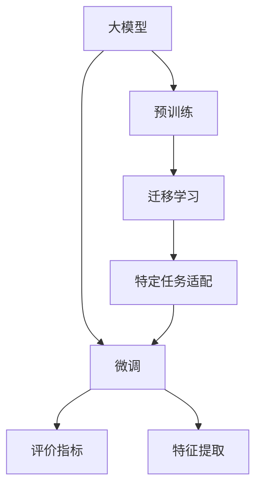

                 

# 大模型技术在电商平台用户情感分析中的应用

> 关键词：大模型, 用户情感分析, 电商平台, 自然语言处理, 预训练模型, 微调, 迁移学习, 评价指标, 特征提取

## 1. 背景介绍

随着电子商务的快速发展，电商平台已成为消费者购物的重要渠道之一。用户的购物体验直接影响其对平台的评价和忠诚度，而电商平台对用户情感的准确分析则是提升用户体验的关键。基于大模型技术进行用户情感分析，可以高效、准确地理解用户情感倾向，指导电商平台优化产品和服务，提升用户满意度和市场竞争力。

### 1.1 问题由来

电商平台用户情感分析的核心问题是如何从用户的评论、评价、评分等文本数据中，自动识别出用户的情感倾向（正面、负面或中性）。传统的情感分析方法基于规则或词典，依赖人工设计和维护，难以处理复杂语境和情感混合。而基于深度学习的大模型技术，通过大规模预训练和微调，能够从海量数据中学习到丰富的语言知识和常识，更好地理解自然语言的多样性和复杂性，从而实现更准确、更鲁棒的情感分析。

### 1.2 问题核心关键点

电商平台用户情感分析的关键点包括：
- 选择合适的预训练语言模型。
- 设计合理的情感分析任务适配层。
- 确定合适的微调策略和超参数设置。
- 选择合适的评价指标和优化目标。
- 进行全面的数据和模型评估。

这些关键点共同构成了电商平台用户情感分析的核心范式。通过科学的方法论指导，可以在实际应用中取得理想的效果。

### 1.3 问题研究意义

准确的用户情感分析有助于电商平台在以下方面进行改进和优化：
- 产品推荐：根据用户情感反馈调整商品推荐策略，提升用户购买转化率。
- 服务改进：及时回应用户负面评价，优化售后服务，增强用户满意度。
- 营销策略：分析用户情感热点，制定针对性的营销策略，提升用户粘性。
- 运营管理：监控整体用户情感变化趋势，及时调整运营策略，确保平台稳定发展。

通过深入研究电商平台用户情感分析，可以有效提升用户体验和平台竞争力，推动电商行业向智能化的方向迈进。

## 2. 核心概念与联系

### 2.1 核心概念概述

为更好地理解基于大模型技术的电商平台用户情感分析，本节将介绍几个关键核心概念：

- 大模型(Large Model)：指通过大规模无标签文本数据预训练得到的，包含丰富语言知识和常识的深度学习模型，如BERT、GPT等。
- 预训练(Pre-training)：指在大规模无标签文本数据上，通过自监督学习任务训练通用语言模型的过程。常见的预训练任务包括言语建模、遮挡语言模型等。
- 微调(Fine-tuning)：指在预训练模型的基础上，使用特定任务的少量标注数据，通过有监督学习优化模型在该任务上的性能。
- 迁移学习(Transfer Learning)：指将一个领域学习到的知识，迁移应用到另一个不同但相关的领域的学习范式。
- 评价指标(Evaluation Metrics)：用于评估模型性能的指标，如准确率、召回率、F1-score、ROC-AUC等。
- 特征提取(Feature Extraction)：将原始文本数据转换为模型可接受的特征向量，通常使用词向量、BERT编码等。

这些概念之间的逻辑关系可以通过以下Mermaid流程图来展示：



这个流程图展示了大模型在电商平台用户情感分析中的关键概念及其之间的关系：

1. 大模型通过预训练获得基础能力。
2. 迁移学习将大模型的知识迁移到特定任务上。
3. 特定任务适配层设计，使模型适用于情感分析任务。
4. 微调过程通过有监督学习优化模型性能。
5. 特征提取将文本转换为模型可接受形式。
6. 评价指标用于评估模型效果，指导优化。

## 3. 核心算法原理 & 具体操作步骤

### 3.1 算法原理概述

基于大模型技术的电商平台用户情感分析，其核心思想是：利用预训练语言模型作为强大的特征提取器，通过微调和特定任务适配，使得模型能够自动学习出用户情感倾向。具体步骤如下：

1. 选择预训练语言模型，如BERT、GPT等。
2. 设计情感分析任务适配层，添加分类器、损失函数等。
3. 收集电商平台上的用户评论、评价、评分等文本数据，作为微调数据集。
4. 确定微调策略和超参数，如学习率、批大小、迭代轮数等。
5. 执行微调，在标注数据集上训练模型，优化情感分类器的性能。
6. 在测试集上评估模型性能，根据评价指标优化模型。

### 3.2 算法步骤详解

以下是基于大模型技术的电商平台用户情感分析的具体算法步骤：

**Step 1: 准备数据集**
- 收集电商平台上的用户评论、评价、评分等文本数据，划分训练集、验证集和测试集。
- 对数据进行预处理，包括分词、去停用词、词性标注等。
- 使用大模型预训练的编码器对文本进行编码，得到词向量表示。

**Step 2: 设计任务适配层**
- 在预训练模型的基础上添加任务适配层，如全连接层、softmax分类器等。
- 设计损失函数，如交叉熵损失、对比损失等，用于衡量模型预测和真实标签之间的差异。

**Step 3: 设置微调超参数**
- 选择合适的优化器及其参数，如AdamW、SGD等，设置学习率、批大小、迭代轮数等。
- 设置正则化技术及强度，包括权重衰减、Dropout、Early Stopping等。
- 确定冻结预训练参数的策略，如仅微调顶层，或全部参数都参与微调。

**Step 4: 执行梯度训练**
- 将训练集数据分批次输入模型，前向传播计算损失函数。
- 反向传播计算参数梯度，根据设定的优化算法和学习率更新模型参数。
- 周期性在验证集上评估模型性能，根据性能指标决定是否触发 Early Stopping。
- 重复上述步骤直到满足预设的迭代轮数或 Early Stopping 条件。

**Step 5: 测试和部署**
- 在测试集上评估微调后模型，对比微调前后的精度提升。
- 使用微调后的模型对新评论进行情感分类，集成到实际的用户评价分析系统中。
- 持续收集新的用户评论，定期重新微调模型，以适应数据分布的变化。

### 3.3 算法优缺点

基于大模型技术的电商平台用户情感分析具有以下优点：
1. 准确性高：大模型通过大规模预训练学习到了丰富的语言知识和常识，能够在复杂语境下准确识别用户情感。
2. 泛化能力强：大模型具有较强的泛化能力，能够适应不同领域的情感分析任务。
3. 可解释性好：通过分析模型的中间表示，可以更好地理解用户情感背后的语义信息。
4. 自动化程度高：微调过程完全由计算机自动执行，减少了人工标注和调参的复杂度。

同时，该方法也存在以下缺点：
1. 对标注数据依赖较大：微调模型的性能很大程度上取决于标注数据的质量和数量，获取高质量标注数据的成本较高。
2. 模型的实时性较差：预训练大模型较为庞大，推理速度较慢，难以实时响应大规模数据流的处理需求。
3. 模型的偏见问题：预训练大模型可能包含偏见和有害信息，需要通过适当的策略进行处理。

尽管存在这些局限性，但就目前而言，基于大模型技术的用户情感分析方法仍是大规模电商数据处理的重要手段。未来相关研究的重点在于如何进一步降低微调对标注数据的依赖，提高模型的实时性和可解释性，同时兼顾模型的公平性和安全性等因素。

### 3.4 算法应用领域

基于大模型技术的电商平台用户情感分析已经在多个领域得到了广泛应用，例如：

- 商品评价分析：从用户评论中自动提取正面或负面的情感信息，评估商品满意度。
- 用户画像构建：分析用户的情感倾向，构建用户画像，实现个性化推荐和服务。
- 运营策略优化：通过情感分析结果，优化平台的运营策略，提升用户体验和留存率。
- 广告效果评估：分析用户对广告内容的情感反应，指导广告投放和优化。
- 舆情监控：监控用户对品牌、产品的情感变化，及时发现和应对舆情风险。

除了上述这些经典应用外，用户情感分析技术还创新性地应用于智能客服、社交网络情感分析等场景中，为电商平台带来新的增长点。

## 4. 数学模型和公式 & 详细讲解  
### 4.1 数学模型构建

假设电商平台上的用户评论文本序列为 $x_1, x_2, ..., x_n$，其情感标签为 $y_1, y_2, ..., y_n$，其中 $y_i \in \{+1, 0, -1\}$ 表示用户对商品第 $i$ 条评论的情感倾向，$+1$ 表示正面情感，$0$ 表示中性情感，$-1$ 表示负面情感。

定义情感分析任务适配层为 $\mathcal{L} = \{M_{\theta}\}$，其中 $\theta$ 为模型参数，$M_{\theta}$ 为预训练模型，如BERT等。

情感分类器的损失函数为：

$$
\mathcal{L} = -\frac{1}{N}\sum_{i=1}^N \ell(M_{\theta}(x_i), y_i)
$$

其中 $\ell$ 为交叉熵损失函数。

模型在训练集上的损失函数为：

$$
\mathcal{L}_{train} = -\frac{1}{N}\sum_{i=1}^N \ell(M_{\theta}(x_i), y_i)
$$

模型在验证集上的损失函数为：

$$
\mathcal{L}_{val} = -\frac{1}{N}\sum_{i=1}^N \ell(M_{\theta}(x_i), y_i)
$$

模型在测试集上的损失函数为：

$$
\mathcal{L}_{test} = -\frac{1}{N}\sum_{i=1}^N \ell(M_{\theta}(x_i), y_i)
$$

### 4.2 公式推导过程

以BERT为例，假设模型在输入 $x_i$ 上的输出为 $M_{\theta}(x_i) \in \mathbb{R}^d$，表示模型对文本 $x_i$ 的向量表示。定义 $W$ 为情感分类器的权重矩阵，$b$ 为偏置向量，则情感分类器的输出为：

$$
\hat{y}_i = sigmoid(W^T M_{\theta}(x_i) + b)
$$

其中 $sigmoid$ 函数将输出映射到 $[0, 1]$ 区间，表示用户情感倾向的概率。

定义交叉熵损失函数 $\ell$ 为：

$$
\ell(\hat{y}_i, y_i) = -y_i \log \hat{y}_i - (1 - y_i) \log (1 - \hat{y}_i)
$$

将 $\ell$ 代入损失函数 $\mathcal{L}$，得：

$$
\mathcal{L} = -\frac{1}{N}\sum_{i=1}^N \ell(\hat{y}_i, y_i)
$$

根据链式法则，损失函数对模型参数 $\theta$ 的梯度为：

$$
\frac{\partial \mathcal{L}}{\partial \theta} = -\frac{1}{N}\sum_{i=1}^N \frac{\partial \ell(\hat{y}_i, y_i)}{\partial M_{\theta}(x_i)} \frac{\partial M_{\theta}(x_i)}{\partial \theta}
$$

其中 $\frac{\partial M_{\theta}(x_i)}{\partial \theta}$ 可以通过自动微分技术高效计算。

在得到损失函数的梯度后，即可带入参数更新公式，完成模型的迭代优化。重复上述过程直至收敛，最终得到适应电商平台用户情感分析的最优模型参数 $\theta^*$。

## 5. 项目实践：代码实例和详细解释说明
### 5.1 开发环境搭建

在进行电商平台用户情感分析实践前，我们需要准备好开发环境。以下是使用Python进行PyTorch开发的环境配置流程：

1. 安装Anaconda：从官网下载并安装Anaconda，用于创建独立的Python环境。

2. 创建并激活虚拟环境：
```bash
conda create -n pytorch-env python=3.8 
conda activate pytorch-env
```

3. 安装PyTorch：根据CUDA版本，从官网获取对应的安装命令。例如：
```bash
conda install pytorch torchvision torchaudio cudatoolkit=11.1 -c pytorch -c conda-forge
```

4. 安装Transformers库：
```bash
pip install transformers
```

5. 安装各类工具包：
```bash
pip install numpy pandas scikit-learn matplotlib tqdm jupyter notebook ipython
```

完成上述步骤后，即可在`pytorch-env`环境中开始情感分析实践。

### 5.2 源代码详细实现

以下是使用PyTorch和Transformers库对BERT模型进行电商平台用户情感分析的代码实现。

首先，定义情感分析任务的数据处理函数：

```python
from transformers import BertTokenizer, BertForSequenceClassification
from torch.utils.data import Dataset
import torch

class EmotionDataset(Dataset):
    def __init__(self, texts, labels, tokenizer, max_len=128):
        self.texts = texts
        self.labels = labels
        self.tokenizer = tokenizer
        self.max_len = max_len
        
    def __len__(self):
        return len(self.texts)
    
    def __getitem__(self, item):
        text = self.texts[item]
        label = self.labels[item]
        
        encoding = self.tokenizer(text, return_tensors='pt', max_length=self.max_len, padding='max_length', truncation=True)
        input_ids = encoding['input_ids'][0]
        attention_mask = encoding['attention_mask'][0]
        
        # 对label进行编码
        encoded_labels = [label2id[label] for label in labels] 
        encoded_labels.extend([label2id['O']] * (self.max_len - len(encoded_labels)))
        labels = torch.tensor(encoded_labels, dtype=torch.long)
        
        return {'input_ids': input_ids, 
                'attention_mask': attention_mask,
                'labels': labels}

# 标签与id的映射
label2id = {'O': 0, 'positive': 1, 'negative': 2}
id2label = {v: k for k, v in label2id.items()}

# 创建dataset
tokenizer = BertTokenizer.from_pretrained('bert-base-cased')

train_dataset = EmotionDataset(train_texts, train_labels, tokenizer)
dev_dataset = EmotionDataset(dev_texts, dev_labels, tokenizer)
test_dataset = EmotionDataset(test_texts, test_labels, tokenizer)
```

然后，定义模型和优化器：

```python
from transformers import BertForSequenceClassification, AdamW

model = BertForSequenceClassification.from_pretrained('bert-base-cased', num_labels=len(label2id))

optimizer = AdamW(model.parameters(), lr=2e-5)
```

接着，定义训练和评估函数：

```python
from torch.utils.data import DataLoader
from tqdm import tqdm
from sklearn.metrics import classification_report

device = torch.device('cuda') if torch.cuda.is_available() else torch.device('cpu')
model.to(device)

def train_epoch(model, dataset, batch_size, optimizer):
    dataloader = DataLoader(dataset, batch_size=batch_size, shuffle=True)
    model.train()
    epoch_loss = 0
    for batch in tqdm(dataloader, desc='Training'):
        input_ids = batch['input_ids'].to(device)
        attention_mask = batch['attention_mask'].to(device)
        labels = batch['labels'].to(device)
        model.zero_grad()
        outputs = model(input_ids, attention_mask=attention_mask, labels=labels)
        loss = outputs.loss
        epoch_loss += loss.item()
        loss.backward()
        optimizer.step()
    return epoch_loss / len(dataloader)

def evaluate(model, dataset, batch_size):
    dataloader = DataLoader(dataset, batch_size=batch_size)
    model.eval()
    preds, labels = [], []
    with torch.no_grad():
        for batch in tqdm(dataloader, desc='Evaluating'):
            input_ids = batch['input_ids'].to(device)
            attention_mask = batch['attention_mask'].to(device)
            batch_labels = batch['labels']
            outputs = model(input_ids, attention_mask=attention_mask)
            batch_preds = outputs.logits.argmax(dim=2).to('cpu').tolist()
            batch_labels = batch_labels.to('cpu').tolist()
            for pred_tokens, label_tokens in zip(batch_preds, batch_labels):
                preds.append(pred_tokens[:len(label_tokens)])
                labels.append(label_tokens)
                
    print(classification_report(labels, preds))
```

最后，启动训练流程并在测试集上评估：

```python
epochs = 5
batch_size = 16

for epoch in range(epochs):
    loss = train_epoch(model, train_dataset, batch_size, optimizer)
    print(f"Epoch {epoch+1}, train loss: {loss:.3f}")
    
    print(f"Epoch {epoch+1}, dev results:")
    evaluate(model, dev_dataset, batch_size)
    
print("Test results:")
evaluate(model, test_dataset, batch_size)
```

以上就是使用PyTorch对BERT进行电商平台用户情感分析的完整代码实现。可以看到，得益于Transformers库的强大封装，我们可以用相对简洁的代码完成BERT模型的加载和情感分析微调。

### 5.3 代码解读与分析

让我们再详细解读一下关键代码的实现细节：

**EmotionDataset类**：
- `__init__`方法：初始化文本、标签、分词器等关键组件。
- `__len__`方法：返回数据集的样本数量。
- `__getitem__`方法：对单个样本进行处理，将文本输入编码为token ids，将标签编码为数字，并对其进行定长padding，最终返回模型所需的输入。

**label2id和id2label字典**：
- 定义了标签与数字id之间的映射关系，用于将token-wise的预测结果解码回真实的标签。

**训练和评估函数**：
- 使用PyTorch的DataLoader对数据集进行批次化加载，供模型训练和推理使用。
- 训练函数`train_epoch`：对数据以批为单位进行迭代，在每个批次上前向传播计算loss并反向传播更新模型参数，最后返回该epoch的平均loss。
- 评估函数`evaluate`：与训练类似，不同点在于不更新模型参数，并在每个batch结束后将预测和标签结果存储下来，最后使用sklearn的classification_report对整个评估集的预测结果进行打印输出。

**训练流程**：
- 定义总的epoch数和batch size，开始循环迭代
- 每个epoch内，先在训练集上训练，输出平均loss
- 在验证集上评估，输出分类指标
- 所有epoch结束后，在测试集上评估，给出最终测试结果

可以看到，PyTorch配合Transformers库使得BERT情感分析的代码实现变得简洁高效。开发者可以将更多精力放在数据处理、模型改进等高层逻辑上，而不必过多关注底层的实现细节。

当然，工业级的系统实现还需考虑更多因素，如模型的保存和部署、超参数的自动搜索、更灵活的任务适配层等。但核心的微调范式基本与此类似。

## 6. 实际应用场景
### 6.1 智能客服系统

基于大模型技术进行电商平台用户情感分析，可以应用于智能客服系统的构建。传统客服往往需要配备大量人力，高峰期响应缓慢，且一致性和专业性难以保证。而使用情感分析模型，可以实时监控用户情感，动态调整客服策略，实现更高效、个性化的客户服务。

在技术实现上，可以收集客户与客服的聊天记录，将对话内容作为输入，通过情感分析模型自动识别客户情感倾向。对于情绪较高的客户，系统可以自动将问题升级，甚至转接人工客服；对于情绪平缓的客户，可以自动提供推荐问题解答，提升用户体验。如此构建的智能客服系统，能大幅提升客户咨询体验和问题解决效率。

### 6.2 商品评价分析

电商平台上的用户评论是情感分析的重要数据源。通过对用户评论进行情感分析，可以实时了解用户对商品的评价，指导商品下架、促销、召回等运营策略的制定。例如，如果大量用户对某商品表示不满意，系统可以立即通知运营团队，及时采取措施，避免负面舆情扩散。

在实际应用中，情感分析模型可以实时处理用户评论，生成情感报告，并在电商平台上推送，帮助商家及时调整商品策略。此外，情感分析结果还可以用于个性化推荐系统，根据用户的情感倾向，推荐相应的商品，提升购买转化率。

### 6.3 用户画像构建

电商平台上的用户评论蕴含丰富的情感信息，可以用于构建用户画像，实现个性化推荐和服务。通过情感分析，可以深入了解用户的情感偏好和行为特征，从而为用户提供更精准的商品推荐和服务。

例如，如果用户对某种类型的商品多次表示正面情感，系统可以将其标记为对该类型的重度爱好者，并为其推荐更多相关商品。同时，情感分析还可以帮助电商平台优化用户服务，根据用户情感倾向，提供不同的服务策略，提升用户满意度。

### 6.4 未来应用展望

随着大模型技术的发展，电商平台用户情感分析的应用前景将更加广阔。未来可能的方向包括：

1. 多模态情感分析：结合文本、语音、图像等多种模态数据，实现更全面的情感分析。例如，通过分析用户视频评论的语音情绪，进一步提升情感分析的准确性。

2. 实时情感分析：实现对大规模数据流的实时情感分析，及时响应用户反馈，优化运营策略。例如，实时监控社交媒体上的品牌舆情，提前预警可能的风险。

3. 情感趋势预测：通过情感分析数据，预测用户情感趋势，指导电商平台的市场策略。例如，根据用户情感变化趋势，调整商品价格和促销策略，提升销售效果。

4. 智能客服优化：结合情感分析和自然语言理解技术，实现智能客服的情感判断和自动回复。例如，自动回应用户的负面情感，并提供针对性的解决方案。

5. 舆情监控与舆情治理：通过情感分析，实时监控和分析用户舆情，及时应对负面舆情，优化品牌形象。例如，针对用户对某个事件的负面情感，采取相应的公关策略，提升品牌信誉。

6. 情感驱动的内容生成：利用情感分析结果，指导内容的创作和推荐。例如，根据用户情感热点，生成相应的广告和商品推荐内容，提升广告效果。

总之，基于大模型技术的电商平台用户情感分析，将在未来的电商市场中发挥越来越重要的作用，推动电商行业向智能化、个性化、实时化的方向发展。

## 7. 工具和资源推荐
### 7.1 学习资源推荐

为了帮助开发者系统掌握基于大模型技术的电商平台用户情感分析的理论基础和实践技巧，这里推荐一些优质的学习资源：

1. 《Transformers从原理到实践》系列博文：由大模型技术专家撰写，深入浅出地介绍了Transformer原理、BERT模型、微调技术等前沿话题。

2. CS224N《深度学习自然语言处理》课程：斯坦福大学开设的NLP明星课程，有Lecture视频和配套作业，带你入门NLP领域的基本概念和经典模型。

3. 《Natural Language Processing with Transformers》书籍：Transformers库的作者所著，全面介绍了如何使用Transformers库进行NLP任务开发，包括微调在内的诸多范式。

4. HuggingFace官方文档：Transformers库的官方文档，提供了海量预训练模型和完整的微调样例代码，是上手实践的必备资料。

5. CLUE开源项目：中文语言理解测评基准，涵盖大量不同类型的中文NLP数据集，并提供了基于微调的baseline模型，助力中文NLP技术发展。

通过对这些资源的学习实践，相信你一定能够快速掌握基于大模型技术的电商平台用户情感分析的精髓，并用于解决实际的NLP问题。
###  7.2 开发工具推荐

高效的开发离不开优秀的工具支持。以下是几款用于基于大模型技术情感分析开发的常用工具：

1. PyTorch：基于Python的开源深度学习框架，灵活动态的计算图，适合快速迭代研究。大部分预训练语言模型都有PyTorch版本的实现。

2. TensorFlow：由Google主导开发的开源深度学习框架，生产部署方便，适合大规模工程应用。同样有丰富的预训练语言模型资源。

3. Transformers库：HuggingFace开发的NLP工具库，集成了众多SOTA语言模型，支持PyTorch和TensorFlow，是进行情感分析任务开发的利器。

4. Weights & Biases：模型训练的实验跟踪工具，可以记录和可视化模型训练过程中的各项指标，方便对比和调优。与主流深度学习框架无缝集成。

5. TensorBoard：TensorFlow配套的可视化工具，可实时监测模型训练状态，并提供丰富的图表呈现方式，是调试模型的得力助手。

6. Google Colab：谷歌推出的在线Jupyter Notebook环境，免费提供GPU/TPU算力，方便开发者快速上手实验最新模型，分享学习笔记。

合理利用这些工具，可以显著提升基于大模型技术的情感分析任务的开发效率，加快创新迭代的步伐。

### 7.3 相关论文推荐

基于大模型技术的用户情感分析方法的发展源于学界的持续研究。以下是几篇奠基性的相关论文，推荐阅读：

1. Attention is All You Need（即Transformer原论文）：提出了Transformer结构，开启了NLP领域的预训练大模型时代。

2. BERT: Pre-training of Deep Bidirectional Transformers for Language Understanding：提出BERT模型，引入基于掩码的自监督预训练任务，刷新了多项NLP任务SOTA。

3. Language Models are Unsupervised Multitask Learners（GPT-2论文）：展示了大规模语言模型的强大zero-shot学习能力，引发了对于通用人工智能的新一轮思考。

4. Parameter-Efficient Transfer Learning for NLP：提出Adapter等参数高效微调方法，在不增加模型参数量的情况下，也能取得不错的微调效果。

5. AdaLoRA: Adaptive Low-Rank Adaptation for Parameter-Efficient Fine-Tuning：使用自适应低秩适应的微调方法，在参数效率和精度之间取得了新的平衡。

这些论文代表了大模型技术在电商平台用户情感分析领域的发展脉络。通过学习这些前沿成果，可以帮助研究者把握学科前进方向，激发更多的创新灵感。

## 8. 总结：未来发展趋势与挑战
### 8.1 总结

本文对基于大模型技术的电商平台用户情感分析方法进行了全面系统的介绍。首先阐述了大模型技术和情感分析的背景和意义，明确了情感分析在电商平台运营优化中的独特价值。其次，从原理到实践，详细讲解了情感分析的数学原理和关键步骤，给出了情感分析任务开发的完整代码实例。同时，本文还广泛探讨了情感分析方法在智能客服、商品评价、用户画像等多个领域的应用前景，展示了情感分析技术在电商行业的巨大潜力。此外，本文精选了情感分析技术的各类学习资源，力求为读者提供全方位的技术指引。

通过本文的系统梳理，可以看到，基于大模型技术的电商平台用户情感分析方法已经在多个领域取得了显著的进展，为电商行业的智能化转型提供了有力支持。未来，伴随大模型技术的持续演进和情感分析方法的不断优化，基于情感分析的电商应用将更加智能、高效、个性化，进一步提升用户满意度和平台竞争力。

### 8.2 未来发展趋势

展望未来，基于大模型技术的用户情感分析将呈现以下几个发展趋势：

1. 模型规模持续增大。随着算力成本的下降和数据规模的扩张，预训练语言模型的参数量还将持续增长。超大规模语言模型蕴含的丰富语言知识，有望支撑更加复杂多变的情感分析任务。

2. 情感分析范式多样。除了传统的全参数微调外，未来会涌现更多参数高效的微调方法，如Prefix-Tuning、LoRA等，在节省计算资源的同时也能保证情感分析精度。

3. 实时性不断提升。通过优化模型结构和推理算法，情感分析模型的实时性将显著提高，能够实时处理大规模数据流，提升运营响应速度。

4. 多模态情感分析兴起。未来的情感分析将结合文本、语音、图像等多种模态数据，实现更全面的情感理解。多模态信息的融合，将显著提升情感分析的准确性和鲁棒性。

5. 情感分析向多领域扩展。除了电商领域，用户情感分析技术还将拓展到金融、医疗、教育等多个领域，为各行各业带来新的增长点。

6. 自动化程度提升。通过引入自动化的超参数优化技术，情感分析模型将变得更加高效、可靠，减少人工调参的复杂度。

7. 解释性增强。随着模型的可解释性技术发展，用户情感分析模型将更具透明性，用户可以更清楚地了解模型决策的依据。

8. 智能客服与情感分析深度融合。未来的智能客服系统将更加智能化、个性化，通过实时情感分析，提供更加精准、高效的客户服务。

以上趋势凸显了基于大模型技术的情感分析技术的广阔前景。这些方向的探索发展，必将进一步提升电商平台的智能化水平，推动电商行业向更高层次的智能运营迈进。

### 8.3 面临的挑战

尽管基于大模型技术的情感分析方法已经取得了显著成效，但在迈向更加智能化、普适化应用的过程中，它仍面临着诸多挑战：

1. 标注成本高。情感分析的标注数据往往需要大量人工标注，成本较高。如何降低标注成本，提高标注质量，仍是一个重要问题。

2. 模型泛化能力不足。现有的情感分析模型在处理新数据时，泛化性能往往较低。如何提高模型的泛化能力，增强其在不同数据集上的鲁棒性，还需要进一步研究。

3. 实时性有待提高。情感分析模型通常较为庞大，推理速度较慢，难以实时响应大规模数据流的处理需求。如何优化模型结构，提升推理效率，是未来研究的重要方向。

4. 模型解释性不足。情感分析模型通常是"黑盒"系统，难以解释其内部工作机制和决策逻辑。如何赋予模型更强的可解释性，增强用户信任，还需要进一步探索。

5. 数据安全问题。情感分析涉及用户隐私数据，如何保护用户数据安全，避免数据泄露和滥用，是一个亟待解决的问题。

6. 偏见与歧视问题。预训练语言模型可能包含偏见和歧视信息，需要通过适当的策略进行处理，避免对特定群体的情感分析出现偏差。

尽管存在这些挑战，但伴随着大模型技术的持续演进和相关研究的不懈努力，这些问题终将逐步得到解决，基于大模型技术的情感分析技术必将在电商行业中发挥更大的作用，推动电商行业的智能化转型。

### 8.4 研究展望

面对情感分析面临的诸多挑战，未来的研究需要在以下几个方面寻求新的突破：

1. 无监督和半监督学习。摆脱对大规模标注数据的依赖，利用自监督学习、主动学习等无监督和半监督范式，最大限度利用非结构化数据，实现更加灵活高效的情感分析。

2. 参数高效和计算高效的方法。开发更加参数高效的微调方法，如Prefix-Tuning、LoRA等，在保持情感分析精度的同时，显著降低计算资源消耗。

3. 多模态数据融合。将文本、语音、图像等多种模态数据融合，实现更全面、准确的情感分析。例如，结合语音情感分析结果，提升文本情感分析的准确性。

4. 可解释性技术。通过引入可解释性技术，增强情感分析模型的透明性和可信度，提升用户信任和接受度。例如，可视化情感分析模型的中间表示，帮助用户理解情感分析结果。

5. 偏见消除策略。通过引入反偏见技术，消除情感分析模型中的偏见和歧视，确保模型公平性。例如，使用公平性检测工具，检测和修正情感分析模型中的偏见。

6. 隐私保护技术。引入隐私保护技术，保护用户数据安全，避免数据泄露和滥用。例如，使用差分隐私技术，保护用户隐私。

这些研究方向的发展，将使基于大模型技术的情感分析方法更加智能、高效、可靠，为电商行业的智能化运营提供更加坚实的技术基础。相信伴随着技术的不断进步，情感分析技术将在电商行业中发挥更大的作用，推动电商行业向智能化、个性化、实时化的方向迈进。

## 9. 附录：常见问题与解答

**Q1：为什么需要基于大模型技术进行情感分析？**

A: 基于大模型技术的情感分析，通过大规模预训练和微调，学习到了丰富的语言知识和常识，能够在复杂语境下准确识别用户情感。传统的基于规则或词典的方法依赖人工设计和维护，难以处理复杂语境和情感混合，无法满足电商平台的实际需求。大模型技术提供了更高效、更可靠的情感分析解决方案。

**Q2：如何选择适合电商平台的情感分析模型？**

A: 电商平台的情感分析模型需要结合实际应用场景和数据特点进行选择。通常需要考虑以下几个因素：
1. 模型的规模和性能：选择适合当前计算资源和数据规模的模型，避免资源浪费。
2. 模型的泛化能力：选择泛化能力强的模型，避免在新数据上的性能下降。
3. 模型的实时性：选择实时性高的模型，能够实时处理大规模数据流。
4. 模型的可解释性：选择可解释性强的模型，便于理解模型的决策逻辑。
5. 模型的偏见与公平性：选择无偏无歧视的模型，确保情感分析的公平性和可信度。

综上所述，电商平台的情感分析模型需要兼顾性能、效率、可解释性、公平性等多个因素，通过实验对比和性能评估，选择最合适的模型。

**Q3：如何降低标注成本？**

A: 标注成本高是情感分析的一个主要挑战。以下是一些降低标注成本的方法：
1. 主动学习：通过主动学习技术，自动选择最具代表性的样本进行标注，减少人工标注的工作量。
2. 弱监督学习：利用弱监督学习方法，通过部分标注数据训练模型，逐步提高标注质量。
3. 自动化标注：引入自动化标注工具，如NLP工具、机器翻译等，辅助人工进行标注。
4. 数据增强：通过数据增强技术，扩充标注数据集，提高标注数据的质量和多样性。
5. 半监督学习：结合无监督学习方法和少量标注数据，提高模型的泛化能力。

通过以上方法，可以在一定程度上降低标注成本，提高标注效率。

**Q4：情感分析模型如何实时处理大规模数据流？**

A: 实时处理大规模数据流是情感分析的一个重要需求。以下是一些提高模型实时性的方法：
1. 模型剪枝：通过剪枝技术，去除冗余参数，减小模型大小，加快推理速度。
2. 量化加速：将浮点模型转为定点模型，压缩存储空间，提高计算效率。
3. 分布式计算：利用分布式计算技术，并行处理数据流，提升实时处理能力。
4. 内存优化：优化内存使用，减少数据传输和存储开销，提高实时响应速度。
5. 模型优化算法：采用高效的模型优化算法，如AdamW、Adafactor等，加速模型训练和推理。

综上所述，通过模型剪枝、量化加速、分布式计算、内存优化、模型优化算法等技术，可以显著提升情感分析模型的实时性，满足大规模数据流的处理需求。

**Q5：如何处理情感分析模型的偏见与歧视问题？**

A: 情感分析模型可能包含偏见和歧视信息，需要通过适当的策略进行处理。以下是一些处理偏见与歧视的方法：
1. 数据清洗：清洗数据集中的偏见样本，减少模型学习到偏见的可能性。
2. 预训练模型选择：选择无偏无歧视的预训练模型，降低模型学习到偏见的可能性。
3. 反偏见技术：引入反偏见技术，检测和修正模型中的偏见，确保模型公平性。
4. 公平性检测：使用公平性检测工具，检测和评估模型的偏见和歧视，及时进行调整。
5. 多模态融合：结合多种模态数据进行情感分析，减少单一数据源带来的偏见。

综上所述，通过数据清洗、预训练模型选择、反偏见技术、公平性检测、多模态融合等方法，可以有效处理情感分析模型的偏见与歧视问题，确保模型公平性和可信度。

通过本文的系统梳理，可以看到，基于大模型技术的电商平台用户情感分析方法已经在多个领域取得了显著的进展，为电商行业的智能化转型提供了有力支持。未来，伴随大模型技术的持续演进和情感分析方法的不断优化，基于情感分析的电商应用将更加智能、高效、个性化，进一步提升用户满意度和平台竞争力。

