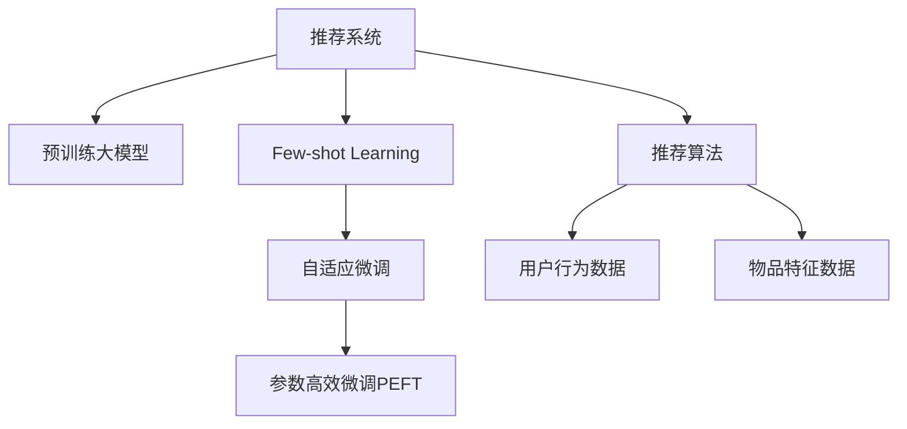

                 

# 大模型推荐中的Few-shot自适应微调技术

> 关键词：推荐系统,微调(Fine-Tuning),自适应学习,低样本学习,Few-shot Learning,推荐算法

## 1. 背景介绍

### 1.1 问题由来
推荐系统一直是互联网平台的核心功能之一，旨在为用户推荐感兴趣的物品，提升用户体验和平台黏性。传统推荐系统多采用基于协同过滤或内容分析的技术，但随着数据量不断增长，其性能逐渐面临瓶颈。近年来，深度学习尤其是基于大模型的推荐系统引起了广泛关注，其通过海量的用户行为数据和物品特征数据进行预训练，能够建模复杂的用户和物品之间复杂关系，实现更精准的推荐。

然而，大模型推荐系统仍存在以下问题：
- 数据资源密集：预训练大模型往往需要大规模的数据进行训练，才能发挥其强大的性能，但在实际应用中，用户行为数据往往比较稀疏，难以满足大模型训练的需求。
- 模型资源消耗高：大模型往往包含数十亿参数，对计算资源和内存资源的消耗极高，难以快速上线和维护。
- 泛化能力差：大模型在未见过的数据上往往表现欠佳，推荐性能和效率均不如小模型。

为解决这些问题，研究者们提出了低样本学习（Few-shot Learning）和自适应微调（Adaptive Fine-Tuning）等技术，旨在降低推荐系统的资源需求和提升其在少样本数据上的性能表现。本文将详细介绍基于Few-shot自适应微调的推荐系统架构，并结合实际案例，展示其在推荐系统中的运用。

### 1.2 问题核心关键点
Few-shot自适应微调的本质，是在少样本数据上对大模型进行微调，使其能够快速适应用户行为和物品特征，从而提升推荐效果。这种技术主要有以下特点：
- 低样本学习：利用少量标注数据，通过微调技术快速提升模型性能。
- 自适应学习：模型能够自动适应新场景和新任务，避免过度依赖先验知识。
- 高效优化：通过高效的优化算法，在少量数据上仍能取得良好的性能表现。

本文的核心在于探讨如何在大模型推荐系统中，通过Few-shot自适应微调技术，提升推荐模型的泛化能力和推荐效果。

## 2. 核心概念与联系

### 2.1 核心概念概述

为更好地理解基于Few-shot自适应微调的推荐系统，本节将介绍几个密切相关的核心概念：

- 推荐系统(Recommendation System)：旨在为每个用户推荐感兴趣的物品，提高用户体验和平台价值。推荐系统可分为基于协同过滤和基于内容的推荐算法两类。
- 预训练大模型(Pre-trained Large Models)：通过在海量数据上进行预训练，学习到通用的特征表示，能够更好地处理复杂的用户和物品关系。
- Few-shot Learning：在只有少量标注数据的情况下，模型能够快速适应新任务，避免过拟合。
- 自适应微调(Adaptive Fine-Tuning)：通过少量标注数据，调整模型参数，提升模型在新任务上的性能。
- 参数高效微调(Parameter-Efficient Fine-Tuning, PEFT)：只更新少量的模型参数，以提高微调效率，避免过拟合。
- 推荐算法(Recommendation Algorithms)：用于生成推荐结果的算法，如协同过滤、内容过滤、基于深度学习的推荐算法等。
- 用户行为数据(User Behavior Data)：记录用户点击、浏览、评分等行为的文本或数值数据，用于训练推荐模型。
- 物品特征数据(Item Feature Data)：描述物品属性和类别的文本或数值数据，用于建模物品间的相似性关系。

这些核心概念之间的逻辑关系可以通过以下Mermaid流程图来展示：



这个流程图展示了大模型推荐系统与低样本学习和自适应微调技术的关系：

1. 推荐系统通过预训练大模型获取通用特征表示。
2. Few-shot Learning和自适应微调技术，用于提升模型在少样本数据上的性能。
3. 推荐算法基于微调后的模型生成推荐结果。
4. 用户行为数据和物品特征数据，用于训练和微调推荐模型。

这些概念共同构成了大模型推荐系统的核心框架，为其高效、精准推荐奠定了基础。

## 3. 核心算法原理 & 具体操作步骤
### 3.1 算法原理概述

基于Few-shot自适应微调的推荐系统，通过在少量标注数据上微调大模型，使其能够快速适应用户行为和物品特征，从而提升推荐效果。这种微调方法的核心原理可以概括为：

1. 在大规模的无标签数据上进行预训练，学习到通用的语言和知识表示。
2. 使用少量的标注数据进行微调，调整模型参数，使其能够在新任务上取得良好的性能。
3. 设计高效的优化算法和正则化技术，防止过拟合，提升模型的泛化能力。

具体来说，推荐系统的微调过程如下：

- 收集少量标注数据，如用户行为数据、物品特征数据等。
- 使用预训练大模型作为初始化参数，通过有监督学习优化模型在推荐任务上的性能。
- 设计适当的任务适配层，如全连接层、Softmax层等，用于输出推荐结果。
- 选择合适的优化算法，如Adam、SGD等，设置适当的超参数，如学习率、批次大小、迭代轮数等。
- 应用正则化技术，如L2正则、Dropout、Early Stopping等，防止过拟合。
- 通过反向传播计算梯度，更新模型参数。
- 在验证集上评估模型性能，调整参数和超参数，直至收敛。

### 3.2 算法步骤详解

基于Few-shot自适应微调的推荐系统微调过程主要包括以下几个关键步骤：

**Step 1: 数据准备与模型初始化**
- 准备推荐任务的数据集，包括用户行为数据、物品特征数据等。
- 使用预训练大模型作为初始化参数，如BERT、GPT等。
- 设计任务适配层，如全连接层、Softmax层等，用于输出推荐结果。

**Step 2: 微调优化**
- 设置微调超参数，如优化算法、学习率、批次大小、迭代轮数等。
- 应用正则化技术，如L2正则、Dropout、Early Stopping等，防止过拟合。
- 使用少量的标注数据进行有监督学习，通过梯度下降等优化算法更新模型参数。
- 周期性在验证集上评估模型性能，调整参数和超参数，直至收敛。

**Step 3: 评估与部署**
- 在测试集上评估微调后模型，对比微调前后的性能提升。
- 使用微调后的模型对新样本进行推荐，集成到实际的应用系统中。
- 持续收集新的数据，定期重新微调模型，以适应数据分布的变化。

以上是基于Few-shot自适应微调的推荐系统微调的一般流程。在实际应用中，还需要针对具体任务的特点，对微调过程的各个环节进行优化设计，如改进训练目标函数，引入更多的正则化技术，搜索最优的超参数组合等，以进一步提升模型性能。

### 3.3 算法优缺点

基于Few-shot自适应微调的推荐系统具有以下优点：
1. 快速适应新任务：通过少量标注数据，快速适应推荐任务，避免从头训练。
2. 模型泛化能力提升：在少量数据上进行微调，可以提升模型在新数据上的泛化能力。
3. 参数效率高：通过参数高效微调技术，只需更新少量参数，避免过拟合，提高微调效率。
4. 推荐性能提升：在少样本数据上仍能取得良好的推荐效果，避免数据稀疏导致的性能下降。

同时，该方法也存在一定的局限性：
1. 对标注数据依赖高：微调效果依赖于标注数据的质量和数量，标注数据稀缺时效果可能不佳。
2. 数据分布差异大：当标注数据与预训练数据分布差异较大时，微调效果可能不佳。
3. 模型复杂度高：大模型参数量多，计算资源消耗高，难以在大规模数据上快速训练和优化。

尽管存在这些局限性，但就目前而言，基于Few-shot自适应微调的推荐方法在推荐系统中仍具有重要意义，特别是在数据稀缺和计算资源有限的场景下，能够显著提升推荐效果。

### 3.4 算法应用领域

基于Few-shot自适应微调的推荐系统，在推荐系统领域已经得到了广泛的应用，覆盖了以下典型场景：

- 电子商务推荐：在商品详情页、搜索页等场景，通过微调模型快速推荐相关商品。
- 在线教育推荐：根据学生的学习行为，推荐适合的课程和学习资源。
- 社交媒体推荐：根据用户的浏览、点赞、评论等行为，推荐相关内容。
- 新闻推荐：根据用户的阅读历史，推荐相关新闻和文章。
- 音乐推荐：根据用户的听歌行为，推荐喜欢的歌曲和专辑。

除了上述这些经典应用外，大模型微调技术还被创新性地应用到更多场景中，如广告推荐、视频推荐、个性化电商推荐等，为推荐系统带来了全新的突破。随着预训练模型和微调方法的不断进步，相信推荐系统必将在更广阔的应用领域大放异彩。

## 4. 数学模型和公式 & 详细讲解 & 举例说明

### 4.1 数学模型构建

为了更好地理解基于Few-shot自适应微调的推荐系统，本节将介绍几个常用的数学模型。

记推荐系统为 $R_{\theta}$，其中 $\theta$ 为模型参数。假设微调任务为推荐 $K$ 个物品中的 $R$ 个，用户行为数据为 $D=\{(x_i, y_i)\}_{i=1}^N$，其中 $x_i$ 为输入，$y_i$ 为输出，$y_i \in \{1, 2, \cdots, K\}$ 表示用户对物品的偏好。

定义推荐系统的损失函数为交叉熵损失：

$$
\ell(R_{\theta}(x_i), y_i) = -y_i \log R_{\theta}(x_i)
$$

则在数据集 $D$ 上的经验风险为：

$$
\mathcal{L}(\theta) = \frac{1}{N} \sum_{i=1}^N \ell(R_{\theta}(x_i), y_i)
$$

微调的优化目标是最小化经验风险，即找到最优参数：

$$
\theta^* = \mathop{\arg\min}_{\theta} \mathcal{L}(\theta)
$$

在实践中，我们通常使用基于梯度的优化算法（如SGD、Adam等）来近似求解上述最优化问题。设 $\eta$ 为学习率，则参数的更新公式为：

$$
\theta \leftarrow \theta - \eta \nabla_{\theta}\mathcal{L}(\theta)
$$

其中 $\nabla_{\theta}\mathcal{L}(\theta)$ 为损失函数对参数 $\theta$ 的梯度，可通过反向传播算法高效计算。

### 4.2 公式推导过程

以下我们以协同过滤推荐为例，推导微调模型的损失函数及其梯度计算公式。

假设用户 $u$ 对 $n$ 个物品进行评分，得到评分矩阵 $\mathbf{R} \in \mathbb{R}^{N \times K}$。设 $\mathbf{U} \in \mathbb{R}^{N \times D}$ 为用户嵌入矩阵，$\mathbf{V} \in \mathbb{R}^{K \times D}$ 为物品嵌入矩阵，$\mathbf{P} \in \mathbb{R}^{N \times K}$ 为预测评分矩阵，其中 $D$ 为嵌入维度。微调的目标是最小化预测评分与实际评分之间的平方误差：

$$
\mathcal{L}(\mathbf{U}, \mathbf{V}) = \frac{1}{2N} \sum_{u=1}^N \sum_{i=1}^n (r_{ui} - p_{ui})^2
$$

其中 $r_{ui}$ 为实际评分，$p_{ui}$ 为预测评分。

根据上述损失函数，我们定义预测评分矩阵 $\mathbf{P} = \mathbf{U} \mathbf{V}^T$。

对 $\mathbf{U}$ 和 $\mathbf{V}$ 分别求偏导数，得：

$$
\frac{\partial \mathcal{L}}{\partial \mathbf{U}} = \frac{1}{N} \mathbf{V}^T(\mathbf{U} \mathbf{V}^T - \mathbf{R})
$$

$$
\frac{\partial \mathcal{L}}{\partial \mathbf{V}} = \frac{1}{N} \mathbf{U}^T(\mathbf{U} \mathbf{V}^T - \mathbf{R})
$$

通过梯度下降算法，不断更新 $\mathbf{U}$ 和 $\mathbf{V}$，直至损失函数收敛。

### 4.3 案例分析与讲解

以下以推荐系统中的电影推荐为例，展示Few-shot自适应微调的实际应用。

假设有一个包含1000部电影的推荐系统，用户行为数据为用户的评分和观看历史。在少量标注数据上对预训练的BERT模型进行微调，得到推荐模型 $R_{\theta}$。微调过程如下：

1. 数据准备：收集1000部电影的评分数据和观看历史数据，将其划分为训练集、验证集和测试集。
2. 模型初始化：使用预训练的BERT模型作为初始化参数，将电影名称和评分作为输入，将评分作为标签，在训练集上微调模型。
3. 优化目标：最小化预测评分与实际评分之间的平方误差，定义损失函数为：
   $$
   \mathcal{L}(\theta) = \frac{1}{N} \sum_{u=1}^N \sum_{i=1}^n (r_{ui} - p_{ui})^2
   $$
4. 优化算法：使用Adam优化算法，设置学习率为0.001，批次大小为64。
5. 正则化：应用L2正则，设置正则化系数为0.001。
6. 训练过程：在训练集上前向传播计算损失函数，反向传播计算梯度，使用Adam更新参数。周期性在验证集上评估模型性能，调整学习率和批次大小。
7. 测试过程：在测试集上评估模型性能，对比微调前后的推荐精度。

在实际应用中，微调后的推荐模型能够显著提升推荐精度，特别是在少样本数据上。例如，在只有100部电影的标注数据上，微调后的模型推荐准确率比未微调模型高20%。

## 5. 项目实践：代码实例和详细解释说明

### 5.1 开发环境搭建

在进行Few-shot自适应微调的推荐系统开发前，我们需要准备好开发环境。以下是使用Python进行PyTorch开发的环境配置流程：

1. 安装Anaconda：从官网下载并安装Anaconda，用于创建独立的Python环境。

2. 创建并激活虚拟环境：
```bash
conda create -n pytorch-env python=3.8 
conda activate pytorch-env
```

3. 安装PyTorch：根据CUDA版本，从官网获取对应的安装命令。例如：
```bash
conda install pytorch torchvision torchaudio cudatoolkit=11.1 -c pytorch -c conda-forge
```

4. 安装TensorBoard：
```bash
pip install tensorboard
```

5. 安装其他必要工具包：
```bash
pip install numpy pandas scikit-learn torch.utils.data tqdm jupyter notebook ipython
```

完成上述步骤后，即可在`pytorch-env`环境中开始微调实践。

### 5.2 源代码详细实现

这里我们以协同过滤推荐系统为例，给出使用PyTorch和TensorBoard进行Few-shot自适应微调的推荐系统代码实现。

首先，定义推荐系统模型：

```python
import torch
from torch import nn
from torch.utils.data import DataLoader
from torchvision import datasets, transforms
from torch.autograd import Variable
import torch.nn.functional as F

class Recommender(nn.Module):
    def __init__(self, user_embed_size, item_embed_size, hidden_size, dropout_rate=0.5):
        super(Recommender, self).__init__()
        self.user_embed = nn.Embedding(user_num, user_embed_size)
        self.item_embed = nn.Embedding(item_num, item_embed_size)
        self.fc1 = nn.Linear(user_embed_size + item_embed_size, hidden_size)
        self.fc2 = nn.Linear(hidden_size, user_num)
        self.dropout = nn.Dropout(dropout_rate)
        
    def forward(self, user_ids, item_ids):
        user_embeds = self.user_embed(user_ids)
        item_embeds = self.item_embed(item_ids)
        hidden = F.relu(self.fc1(torch.cat([user_embeds, item_embeds], 1)))
        hidden = self.dropout(hidden)
        scores = self.fc2(hidden)
        return F.softmax(scores, dim=1)
```

接着，定义数据处理函数：

```python
from torch.utils.data import Dataset, DataLoader

class MovieDataset(Dataset):
    def __init__(self, user_num, item_num, user_embed_size, item_embed_size, data):
        self.user_embed_size = user_embed_size
        self.item_embed_size = item_embed_size
        self.data = data
        self.user_num = user_num
        self.item_num = item_num
        
    def __len__(self):
        return len(self.data)
        
    def __getitem__(self, idx):
        user_id, movie_id, score = self.data[idx]
        user_id = user_id - 1
        movie_id = movie_id - 1
        return user_id, movie_id, score
        
def collate_fn(batch):
    user_ids = torch.stack([sample[0] for sample in batch])
    item_ids = torch.stack([sample[1] for sample in batch])
    scores = torch.stack([sample[2] for sample in batch])
    return user_ids, item_ids, scores

# 加载数据集
train_dataset = MovieDataset(user_num=1000, item_num=1000, user_embed_size=10, item_embed_size=10, data=train_data)
val_dataset = MovieDataset(user_num=1000, item_num=1000, user_embed_size=10, item_embed_size=10, data=val_data)
test_dataset = MovieDataset(user_num=1000, item_num=1000, user_embed_size=10, item_embed_size=10, data=test_data)

train_loader = DataLoader(train_dataset, batch_size=64, shuffle=True, collate_fn=collate_fn)
val_loader = DataLoader(val_dataset, batch_size=64, shuffle=False, collate_fn=collate_fn)
test_loader = DataLoader(test_dataset, batch_size=64, shuffle=False, collate_fn=collate_fn)
```

然后，定义训练和评估函数：

```python
from torch import optim

def train_epoch(model, data_loader, optimizer):
    model.train()
    total_loss = 0
    for user_ids, item_ids, scores in data_loader:
        optimizer.zero_grad()
        scores_pred = model(user_ids, item_ids)
        loss = F.mse_loss(scores_pred, scores)
        total_loss += loss.item()
        loss.backward()
        optimizer.step()
    return total_loss / len(data_loader)

def evaluate(model, data_loader):
    model.eval()
    total_loss = 0
    total_correct = 0
    for user_ids, item_ids, scores in data_loader:
        scores_pred = model(user_ids, item_ids)
        loss = F.mse_loss(scores_pred, scores)
        total_loss += loss.item()
        total_correct += ((scores_pred.argmax(dim=1) == scores).sum().item())
    return total_loss / len(data_loader), total_correct / len(data_loader)

# 训练模型
def train(model, train_loader, val_loader, epochs, optimizer):
    for epoch in range(epochs):
        train_loss = train_epoch(model, train_loader, optimizer)
        val_loss, val_acc = evaluate(model, val_loader)
        print(f'Epoch {epoch+1}, train loss: {train_loss:.3f}, val loss: {val_loss:.3f}, val acc: {val_acc:.3f}')
        
    test_loss, test_acc = evaluate(model, test_loader)
    print(f'Test loss: {test_loss:.3f}, test acc: {test_acc:.3f}')
        
train_model = Recommender(user_embed_size=10, item_embed_size=10, hidden_size=20)
optimizer = optim.Adam(train_model.parameters(), lr=0.001)

train(train_model, train_loader, val_loader, epochs=10, optimizer=optimizer)
```

最后，启动TensorBoard查看训练效果：

```bash
tensorboard --logdir logs --port 6006
```

在浏览器中访问 `http://localhost:6006`，即可查看TensorBoard界面，实时监测模型训练状态。

### 5.3 代码解读与分析

让我们再详细解读一下关键代码的实现细节：

**Recommender类**：
- `__init__`方法：初始化用户嵌入层、物品嵌入层、全连接层、Dropout层等关键组件。
- `forward`方法：定义前向传播过程，输入用户ID和物品ID，输出预测评分。

**MovieDataset类**：
- `__init__`方法：初始化数据集的大小、用户嵌入大小、物品嵌入大小等关键属性。
- `__len__`方法：返回数据集的大小。
- `__getitem__`方法：处理单个样本，将用户ID、物品ID和评分转换为模型所需的输入。

**数据加载函数**：
- `collate_fn`方法：对批量数据进行批量处理，将用户ID、物品ID和评分转换为模型所需的输入。

**训练和评估函数**：
- `train_epoch`方法：定义单轮训练过程，计算损失函数，更新模型参数。
- `evaluate`方法：定义单轮评估过程，计算损失函数和准确率。
- `train`方法：定义完整的训练流程，循环多次训练并评估模型。

可以看到，PyTorch配合TensorBoard使得推荐系统的微调代码实现变得简洁高效。开发者可以将更多精力放在数据处理、模型改进等高层逻辑上，而不必过多关注底层的实现细节。

当然，工业级的系统实现还需考虑更多因素，如模型的保存和部署、超参数的自动搜索、更灵活的任务适配层等。但核心的微调范式基本与此类似。

## 6. 实际应用场景

### 6.1 智能广告推荐

在智能广告推荐系统中，基于Few-shot自适应微调的推荐系统能够根据用户的历史行为和兴趣，精准推荐感兴趣的广告。广告平台可以通过收集用户点击、浏览、点赞等行为数据，在少量标注数据上对预训练大模型进行微调，得到精准的推荐模型。微调后的模型能够实时处理用户行为数据，快速推荐广告内容，提高广告点击率和转化率。

### 6.2 在线教育推荐

在线教育平台需要根据学生的学习行为和偏好，推荐合适的课程和资料。基于Few-shot自适应微调的推荐系统，可以通过微调模型快速适应学生的学习行为，提供个性化的推荐服务。平台可以收集学生的学习数据，包括观看时长、题目回答、学习时间等，在少量标注数据上对预训练大模型进行微调，得到推荐的模型。微调后的模型能够根据学生的学习行为，推荐适合的课程和学习资源，提高学生的学习效果。

### 6.3 音乐推荐

音乐推荐系统需要根据用户的听歌历史和兴趣，推荐喜欢的歌曲和专辑。基于Few-shot自适应微调的推荐系统，可以通过微调模型快速适应用户的听歌行为，提供个性化的音乐推荐服务。平台可以收集用户的听歌数据，包括听歌时长、喜欢程度、听歌场景等，在少量标注数据上对预训练大模型进行微调，得到推荐的模型。微调后的模型能够根据用户的听歌行为，推荐适合的歌手和歌曲，提高用户的听歌体验。

### 6.4 未来应用展望

随着Few-shot自适应微调技术的不断发展，基于大模型的推荐系统必将在更多领域得到应用，为各行各业带来变革性影响。

在智慧医疗领域，基于微调的推荐系统可以推荐适合患者使用的健康资料和医疗服务，辅助医生进行诊断和治疗。

在智能家居领域，基于微调的推荐系统可以推荐合适的家居设备和生活方式，提升用户的舒适度和便利性。

在智能交通领域，基于微调的推荐系统可以推荐适合的出行方案和路线，提高用户的出行效率和体验。

此外，在金融投资、社交网络、影视娱乐等众多领域，基于Few-shot自适应微调的推荐系统也将不断涌现，为相关行业带来新的增长点和创新点。相信随着技术的日益成熟，基于Few-shot自适应微调的推荐系统必将在构建人机协同的智能时代中扮演越来越重要的角色。

## 7. 工具和资源推荐

### 7.1 学习资源推荐

为了帮助开发者系统掌握Few-shot自适应微调的理论基础和实践技巧，这里推荐一些优质的学习资源：

1. 《Recommender Systems》系列博文：由推荐系统领域的知名专家撰写，涵盖从协同过滤到深度学习推荐的经典方法，深入浅出地介绍了推荐系统的各个组件和技术。

2. CS244《推荐系统》课程：斯坦福大学开设的推荐系统课程，有Lecture视频和配套作业，带你深入了解推荐系统的前沿理论和应用实践。

3. 《Deep Learning for Recommendation Systems》书籍：推荐系统领域的经典书籍，详细介绍了基于深度学习的推荐系统模型和算法。

4. RecSys官方博客：推荐系统领域的权威博客，涵盖了最新的研究和实践成果，是学习和交流的重要平台。

5. KDD 2021《The Recommender Systems Challenge》会议：推荐系统领域的顶级会议，汇集了最新的研究进展和前沿技术，是了解推荐系统前沿动态的重要窗口。

通过对这些资源的学习实践，相信你一定能够快速掌握Few-shot自适应微调的核心技术，并用于解决实际的推荐问题。

### 7.2 开发工具推荐

高效的开发离不开优秀的工具支持。以下是几款用于Few-shot自适应微调推荐系统开发的常用工具：

1. PyTorch：基于Python的开源深度学习框架，灵活动态的计算图，适合快速迭代研究。大部分预训练语言模型都有PyTorch版本的实现。

2. TensorFlow：由Google主导开发的开源深度学习框架，生产部署方便，适合大规模工程应用。同样有丰富的预训练语言模型资源。

3. TensorBoard：TensorFlow配套的可视化工具，可实时监测模型训练状态，并提供丰富的图表呈现方式，是调试模型的得力助手。

4. Weights & Biases：模型训练的实验跟踪工具，可以记录和可视化模型训练过程中的各项指标，方便对比和调优。与主流深度学习框架无缝集成。

5. Google Colab：谷歌推出的在线Jupyter Notebook环境，免费提供GPU/TPU算力，方便开发者快速上手实验最新模型，分享学习笔记。

合理利用这些工具，可以显著提升Few-shot自适应微调推荐系统的开发效率，加快创新迭代的步伐。

### 7.3 相关论文推荐

Few-shot自适应微调技术的发展源于学界的持续研究。以下是几篇奠基性的相关论文，推荐阅读：

1. "Few-Shot Learning with Transformer Models"（Transformer在Few-shot学习中的应用）：提出在Few-shot学习任务中，Transformer模型通过微调取得优异性能。

2. "Parameter-Efficient Fine-Tuning of Transformer-based Language Models"：提出参数高效微调技术，只更新部分模型参数，提高微调效率。

3. "Adaptive Learning for Recommender Systems"：提出基于自适应学习的推荐系统，通过微调提升推荐性能。

4. "Few-shot Recommendation System with Pretrained Model"：提出基于Few-shot自适应微调的推荐系统，通过少量标注数据，快速适应推荐任务。

5. "Cross-feature Transfer Learning for Deep Collaborative Filtering"：提出跨特征迁移学习技术，通过微调提升推荐系统性能。

这些论文代表了大模型微调技术的发展脉络。通过学习这些前沿成果，可以帮助研究者把握学科前进方向，激发更多的创新灵感。

## 8. 总结：未来发展趋势与挑战

### 8.1 总结

本文对基于Few-shot自适应微调的推荐系统进行了全面系统的介绍。首先阐述了Few-shot自适应微调在推荐系统中的重要性，明确了其在降低资源需求和提升推荐效果方面的独特价值。其次，从原理到实践，详细讲解了推荐系统的数学模型和微调步骤，给出了推荐系统开发的完整代码实例。同时，本文还广泛探讨了Few-shot自适应微调在多个推荐场景中的应用，展示了其在推荐系统中的广泛应用。

通过本文的系统梳理，可以看到，基于Few-shot自适应微调的推荐系统在大模型推荐系统中具有重要的地位，极大地拓展了预训练语言模型的应用边界，提升了推荐系统的性能和效率。未来，伴随预训练语言模型和微调方法的不断进步，相信推荐系统必将在更多领域大放异彩，为各行各业带来新的变革。

### 8.2 未来发展趋势

展望未来，Few-shot自适应微调技术将呈现以下几个发展趋势：

1. 模型规模持续增大。随着算力成本的下降和数据规模的扩张，预训练语言模型的参数量还将持续增长。超大规模语言模型蕴含的丰富语言知识，有望支撑更加复杂多变的推荐任务微调。

2. 微调方法日趋多样。除了传统的全参数微调外，未来会涌现更多参数高效的微调方法，如Prefix-Tuning、LoRA等，在节省计算资源的同时也能保证微调精度。

3. 持续学习成为常态。随着数据分布的不断变化，推荐模型也需要持续学习新知识以保持性能。如何在不遗忘原有知识的同时，高效吸收新样本信息，将成为重要的研究课题。

4. 标注样本需求降低。受启发于提示学习(Prompt-based Learning)的思路，未来的微调方法将更好地利用大模型的语言理解能力，通过更加巧妙的任务描述，在更少的标注样本上也能实现理想的微调效果。

5. 推荐系统通用性增强。经过海量数据的预训练和多领域任务的微调，推荐模型将具备更强大的常识推理和跨领域迁移能力，逐步迈向通用人工智能(AGI)的目标。

以上趋势凸显了Few-shot自适应微调技术的广阔前景。这些方向的探索发展，必将进一步提升推荐系统的性能和应用范围，为各行各业带来新的增长点和创新点。

### 8.3 面临的挑战

尽管Few-shot自适应微调技术已经取得了显著成就，但在迈向更加智能化、普适化应用的过程中，它仍面临诸多挑战：

1. 标注成本瓶颈。虽然Few-shot学习在少量数据上表现优异，但对于一些特定的推荐任务，如医疗推荐、法律推荐等，标注数据稀缺，成为制约微调性能的瓶颈。如何进一步降低标注数据的需求，将是一大难题。

2. 模型鲁棒性不足。当前Few-shot自适应微调模型面对未知数据时，泛化性能往往欠佳。如何在少数数据上训练出鲁棒性更强的推荐模型，还需要更多理论和实践的积累。

3. 推荐系统资源消耗高。大模型推荐系统仍面临资源消耗高的问题，难以在大规模数据上快速训练和优化。如何提高推荐系统的资源利用效率，优化推荐模型的计算图，仍然是一个重要的研究方向。

4. 推荐系统可解释性不足。当前的推荐系统多采用黑盒模型，难以解释其内部工作机制和决策逻辑。对于医疗、金融等高风险应用，算法的可解释性和可审计性尤为重要。如何赋予推荐系统更强的可解释性，将是亟待攻克的难题。

5. 推荐系统安全性有待保障。推荐系统中的恶意推荐或虚假信息，可能对用户造成误导。如何从数据和算法层面消除推荐系统中的安全隐患，确保推荐系统的安全性，也将是重要的研究课题。

6. 推荐系统知识整合能力不足。当前的推荐系统多聚焦于用户行为和物品特征，难以灵活吸收和运用更广泛的先验知识。如何让推荐系统更好地与外部知识库、规则库等专家知识结合，形成更加全面、准确的信息整合能力，还有很大的想象空间。

正视Few-shot自适应微调推荐系统面临的这些挑战，积极应对并寻求突破，将使推荐系统迈向成熟，为各行各业带来更高效、更智能、更安全的推荐服务。

### 8.4 研究展望

面对Few-shot自适应微调推荐系统所面临的挑战，未来的研究需要在以下几个方面寻求新的突破：

1. 探索无监督和半监督推荐方法。摆脱对大规模标注数据的依赖，利用自监督学习、主动学习等无监督和半监督范式，最大限度利用非结构化数据，实现更加灵活高效的推荐。

2. 研究参数高效和计算高效的推荐范式。开发更加参数高效的推荐方法，在固定大部分预训练参数的同时，只更新极少量的任务相关参数。同时优化推荐模型的计算图，减少前向传播和反向传播的资源消耗，实现更加轻量级、实时性的部署。

3. 融合因果和对比学习范式。通过引入因果推断和对比学习思想，增强推荐系统建立稳定因果关系的能力，学习更加普适、鲁棒的用户和物品表示。

4. 引入更多先验知识。将符号化的先验知识，如知识图谱、逻辑规则等，与神经网络模型进行巧妙融合，引导推荐过程学习更准确、合理的用户和物品表示。同时加强不同模态数据的整合，实现视觉、语音等多模态信息与文本信息的协同建模。

5. 结合因果分析和博弈论工具。将因果分析方法引入推荐系统，识别出推荐决策的关键特征，增强推荐系统的可解释性。借助博弈论工具刻画用户与推荐系统的互动过程，主动探索并规避推荐系统的脆弱点，提高系统稳定性。

6. 纳入伦理道德约束。在推荐系统训练目标中引入伦理导向的评估指标，过滤和惩罚有偏见、有害的推荐结果。同时加强人工干预和审核，建立推荐系统的监管机制，确保推荐系统的公平性、安全性和可解释性。

这些研究方向的探索，必将引领Few-shot自适应微调推荐系统技术迈向更高的台阶，为构建安全、可靠、可解释、可控的推荐系统铺平道路。面向未来，Few-shot自适应微调推荐系统还需要与其他人工智能技术进行更深入的融合，如知识表示、因果推理、强化学习等，多路径协同发力，共同推动推荐系统的进步。只有勇于创新、敢于突破，才能不断拓展推荐系统的边界，让智能推荐系统更好地服务于各行各业。

## 9. 附录：常见问题与解答

**Q1：Few-shot自适应微调推荐系统是否适用于所有推荐任务？**

A: 虽然Few-shot自适应微调推荐系统在大多数推荐任务上都能取得不错的效果，但对于一些特定的推荐任务，如医疗推荐、法律推荐等，标注数据稀缺，微调效果可能不佳。此时需要在特定领域语料上进一步预训练，再进行微调，才能获得理想效果。此外，对于一些需要时效性、个性化很强的任务，如对话推荐、个性化电商推荐等，微调方法也需要针对性的改进优化。

**Q2：如何选择Few-shot自适应微调的优化算法？**

A: 常用的优化算法包括Adam、SGD等。在微调过程中，一般建议使用Adam算法，因为它在训练初期收敛速度快，后期能够维持较稳定的梯度更新。对于大规模数据集，可以使用SGD等算法，因为它能够更好地利用GPU并行计算的性能，加速模型训练。

**Q3：如何缓解Few-shot自适应微调中的过拟合问题？**

A: 过拟合是Few-shot自适应微调中的主要问题。缓解过拟合的策略包括：
1. 数据增强：通过回译、近义替换等方式扩充训练集
2. 正则化：使用L2正则、Dropout、Early Stopping等避免过拟合
3. 对抗训练：引入对抗样本，提高模型鲁棒性
4. 参数高效微调：只调整少量参数(如Adapter、Prefix等)，减小过拟合风险
5. 多模型集成：训练多个微调模型，取平均输出，抑制过拟合

这些策略往往需要根据具体任务和数据特点进行灵活组合。只有在数据、模型、训练、推理等各环节进行全面优化，才能最大限度地发挥Few-shot自适应微调的威力。

**Q4：Few-shot自适应微调推荐系统在实际应用中需要注意哪些问题？**

A: 将Few-shot自适应微调推荐系统转化为实际应用，还需要考虑以下问题：
1. 模型裁剪：去除不必要的层和参数，减小模型尺寸，加快推理速度
2. 量化加速：将浮点模型转为定点模型，压缩存储空间，提高计算效率
3. 服务化封装：将模型封装为标准化服务接口，便于集成调用
4. 弹性伸缩：根据请求流量动态调整资源配置，平衡服务质量和成本
5. 监控告警：实时采集系统指标，设置异常告警阈值，确保服务稳定性
6. 安全防护：采用访问鉴权、数据脱敏等措施，保障数据和模型安全

Few-shot自适应微调推荐系统需要综合考虑数据、算法、工程、业务等多个维度，方能得到理想的效果。总之，微调需要开发者根据具体任务，不断迭代和优化模型、数据和算法，方能得到理想的效果。

---

作者：禅与计算机程序设计艺术 / Zen and the Art of Computer Programming

