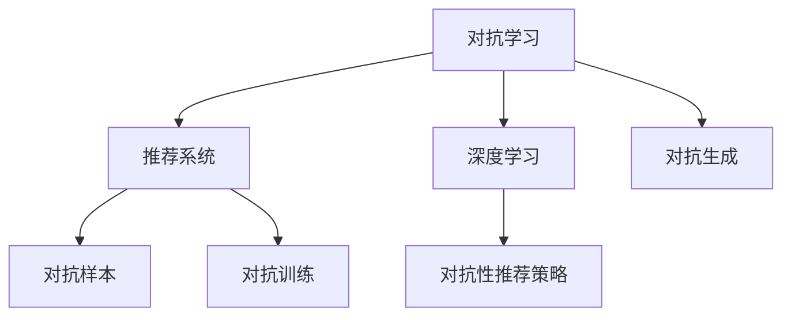

                 

# 大模型推荐中的对抗学习策略

> 关键词：对抗学习,推荐系统,深度学习,Adversarial Robustness,对抗训练

## 1. 背景介绍

### 1.1 问题由来
在人工智能的各个领域中，推荐系统扮演着越来越重要的角色。无论是电商平台、新闻网站、社交媒体，还是视频平台，推荐系统都在通过智能算法为用户提供个性化的内容推荐，极大地提升了用户体验和平台价值。然而，现有的推荐系统往往基于静态数据，难以捕捉用户动态变化的需求和行为模式，容易出现过拟合和偏差。

对抗学习（Adversarial Learning）作为一种新兴的深度学习技术，通过引入对抗样本，使得模型能够在对抗性环境中稳健训练，提高模型的泛化能力。近年来，对抗学习在推荐系统中也逐渐被应用，通过在推荐模型中加入对抗训练，提升了推荐系统的鲁棒性和可靠性。

### 1.2 问题核心关键点
对抗学习在推荐系统中的应用，主要集中在以下几个方面：

- 对抗样本生成：利用对抗生成技术，构造能够扰动模型输出的样本，从而检测并提高模型的鲁棒性。
- 对抗训练策略：将对抗样本引入推荐模型训练过程中，通过对抗训练提升模型的泛化能力。
- 对抗性推荐策略：通过分析对抗性特征，设计更鲁棒的推荐算法，实现更稳定、可靠的推荐效果。

这些核心关键点共同构成了对抗学习在推荐系统中的基本应用框架，旨在通过提升模型的泛化性和鲁棒性，实现更加个性化、多样化的推荐服务。

## 2. 核心概念与联系

### 2.1 核心概念概述

为更好地理解对抗学习在推荐系统中的应用，本节将介绍几个密切相关的核心概念：

- 对抗学习(Adversarial Learning)：通过引入对抗性扰动，训练模型在对抗性环境中保持稳健和鲁棒性，避免过拟合和泛化能力不足的问题。
- 推荐系统(Recommender System)：通过用户的历史行为数据，结合个性化算法，为用户推荐其可能感兴趣的内容。
- 深度学习(Deep Learning)：利用多层神经网络，通过端到端的学习方式，提取和表示复杂的高维数据。
- 对抗样本(Adversarial Examples)：指能够使模型输出产生误判的扰动样本，通过对抗训练可以提升模型的鲁棒性。
- 对抗训练(Adversarial Training)：通过在训练过程中加入对抗样本，使得模型能够更好地适应不同扰动场景，提升泛化能力。

这些核心概念之间的逻辑关系可以通过以下Mermaid流程图来展示：



这个流程图展示了对抵抗学习在推荐系统中的应用，包括深度学习模型、对抗性推荐策略、对抗生成技术等核心概念，以及它们之间的关联。

## 3. 核心算法原理 & 具体操作步骤
### 3.1 算法原理概述

对抗学习在推荐系统中的应用，本质上是通过对抗样本和对抗训练，增强模型的鲁棒性和泛化能力，从而提升推荐的准确性和多样性。其核心思想是：将推荐模型视为对抗双方中的攻击方，通过构造对抗性扰动，攻击模型输出，并调整模型参数，以避免在对抗性扰动下发生误判。

具体而言，假设推荐系统模型为 $f_\theta(x)$，其中 $\theta$ 为模型参数，$x$ 为用户的行为数据。设 $\mathcal{L}(\theta)$ 为推荐系统的损失函数，例如均方误差、交叉熵等。对抗训练的目标是最小化以下损失函数：

$$
\mathcal{L}_{adv}(\theta) = \mathcal{L}(\theta) + \lambda \mathcal{L}_{adv}(\theta)
$$

其中 $\lambda$ 为对抗损失的权重。对抗损失 $\mathcal{L}_{adv}(\theta)$ 定义如下：

$$
\mathcal{L}_{adv}(\theta) = \frac{1}{N} \sum_{i=1}^N \max \left( \mathcal{L}(f_\theta(x_i + \delta_i)), \mathcal{L}(f_\theta(x_i - \delta_i)) \right)
$$

其中 $\delta_i$ 为对用户行为数据 $x_i$ 的对抗扰动，$\max$ 函数表示选择对抗扰动前后的较大损失值。

通过对抗训练，模型能够在对抗性环境中保持鲁棒性，避免由于对抗扰动导致的误判，从而提高推荐系统的稳定性和可靠性。

### 3.2 算法步骤详解

对抗学习在推荐系统中的应用，主要包括以下几个关键步骤：

**Step 1: 准备对抗生成器和推荐模型**

- 选择合适的推荐模型（如基于神经网络的协同过滤、深度学习模型等）作为初始化参数。
- 设计对抗生成器（如对抗样本生成器、对抗样本强化学习等），用于生成对抗性扰动样本。

**Step 2: 构造对抗样本**

- 利用对抗生成器，生成对抗性扰动样本 $\delta_i$。
- 将扰动样本与用户原始行为数据 $x_i$ 叠加，生成新的对抗样本 $x_i + \delta_i$。

**Step 3: 对抗训练**

- 将对抗样本 $x_i + \delta_i$ 输入推荐模型，计算对抗损失 $\mathcal{L}_{adv}(\theta)$。
- 结合推荐损失 $\mathcal{L}(\theta)$，通过梯度下降等优化算法更新模型参数 $\theta$。

**Step 4: 迭代训练**

- 重复上述步骤，直到模型在对抗扰动下不再发生误判。

**Step 5: 模型评估与优化**

- 在测试集上评估模型的推荐效果。
- 根据评估结果，调整对抗训练的权重和对抗生成器的策略。

以上是对抗学习在推荐系统中的基本流程。在实际应用中，还需要根据具体任务特点，对各环节进行优化设计，如改进对抗样本生成算法，引入更多正则化技术，优化对抗训练过程等，以进一步提升推荐系统的性能。

### 3.3 算法优缺点

对抗学习在推荐系统中的应用，具有以下优点：

1. 提高模型鲁棒性：通过对抗训练，模型能够在对抗性环境中保持稳健，避免由于对抗扰动导致的误判。
2. 提升泛化能力：对抗样本能够检测模型的缺陷，帮助模型学习更加稳健的特征表示。
3. 增强推荐多样性：对抗训练能够提升模型的泛化能力，推荐更多样化的内容，避免推荐单一。
4. 提升用户体验：通过提升推荐的准确性和多样性，增强用户粘性，提高平台满意度。

然而，对抗学习在推荐系统中也存在一些缺点：

1. 对抗样本生成难度大：对抗样本的生成需要复杂的对抗生成器，且对抗样本的构造可能涉及对目标函数的逆向求解，增加了计算复杂度。
2. 对抗训练开销高：对抗训练增加了额外的训练开销，可能需要更长的训练时间和更高的计算资源。
3. 模型复杂度增加：对抗训练会增加模型的复杂度，可能影响模型的解释性和可理解性。
4. 对抗样本可被攻击：对抗样本的生成依赖于对抗生成器，存在被攻击者恶意利用的风险，可能导致误导性推荐。

尽管存在这些局限性，但对抗学习在推荐系统中的应用，仍然是一种有效的方法，能够在一定程度上提升推荐系统的性能和可靠性。

### 3.4 算法应用领域

对抗学习在推荐系统中的应用，已经在诸多实际场景中得到了验证和应用，例如：

- 电商平台推荐：通过对抗训练，提升电商平台的推荐准确性和多样性，增加用户粘性。
- 视频平台推荐：利用对抗样本，检测并消除视频推荐中的误导性内容，保护用户隐私。
- 新闻网站推荐：通过对抗样本，检测并修正推荐算法中的偏见，提升新闻推荐的多样性和客观性。
- 社交媒体推荐：利用对抗训练，增强社交媒体推荐的鲁棒性和多样性，避免过度曝光和信息茧房。
- 智能家居推荐：通过对抗训练，提高智能家居设备的个性化推荐能力，提升用户体验。

这些应用场景展示了对抗学习在推荐系统中的强大潜力，为推荐系统提供了新的优化途径和思路。

## 4. 数学模型和公式 & 详细讲解  
### 4.1 数学模型构建

对抗学习在推荐系统中的应用，可以通过以下几个数学模型来描述：

- 推荐系统损失函数 $\mathcal{L}(\theta)$：表示推荐模型在原始数据下的损失，通常为均方误差、交叉熵等。
- 对抗损失函数 $\mathcal{L}_{adv}(\theta)$：表示对抗样本对推荐模型输出的扰动损失，通常为最大值函数。
- 总损失函数 $\mathcal{L}_{total}(\theta)$：表示推荐系统在对抗扰动下的总损失，即推荐损失与对抗损失之和。

以下是一个简单的对抗训练算法的数学描述：

1. 随机选择一个对抗样本 $\delta_i$，将原始数据 $x_i$ 与对抗样本 $\delta_i$ 叠加生成对抗样本 $x_i + \delta_i$。
2. 计算对抗样本 $x_i + \delta_i$ 通过推荐模型的输出 $f_\theta(x_i + \delta_i)$。
3. 计算推荐模型在原始数据 $x_i$ 上的损失 $\mathcal{L}(f_\theta(x_i))$。
4. 计算对抗样本 $x_i + \delta_i$ 通过推荐模型的对抗损失 $\mathcal{L}_{adv}(\theta)$。
5. 更新推荐模型参数 $\theta$ 为：

$$
\theta \leftarrow \theta - \eta \nabla_{\theta}(\mathcal{L}(\theta) + \lambda \mathcal{L}_{adv}(\theta))
$$

其中 $\eta$ 为学习率，$\lambda$ 为对抗损失的权重。

### 4.2 公式推导过程

对抗学习在推荐系统中的应用，可以通过以下公式进行推导：

1. 推荐模型输出：$f_\theta(x) = W^\top g_\theta(x)$，其中 $W$ 为输出层的权重矩阵，$g_\theta(x)$ 为中间层的输出。
2. 对抗样本扰动：$\delta_i = \delta_0 + \delta$，其中 $\delta_0$ 为原始扰动，$\delta$ 为对抗扰动。
3. 对抗样本输入：$x_i + \delta_i = x_i + \delta_0 + \delta$。
4. 推荐模型对抗输出：$f_\theta(x_i + \delta_i) = W^\top g_\theta(x_i + \delta_0 + \delta)$。
5. 推荐模型原始输出：$f_\theta(x_i) = W^\top g_\theta(x_i)$。
6. 推荐损失：$\mathcal{L}(\theta) = \frac{1}{N} \sum_{i=1}^N ||y_i - f_\theta(x_i)||^2$，其中 $y_i$ 为真实标签。
7. 对抗损失：$\mathcal{L}_{adv}(\theta) = \frac{1}{N} \sum_{i=1}^N \max(\mathcal{L}(f_\theta(x_i + \delta_i)), \mathcal{L}(f_\theta(x_i - \delta_i)))$。
8. 总损失：$\mathcal{L}_{total}(\theta) = \mathcal{L}(\theta) + \lambda \mathcal{L}_{adv}(\theta)$。

通过对上述公式的推导，我们可以看到，对抗学习在推荐系统中的应用，主要通过对抗样本扰动推荐模型的输出，检测并提升模型的鲁棒性和泛化能力。

### 4.3 案例分析与讲解

以电商平台推荐为例，展示对抗学习的应用。假设电商平台推荐模型的目标是预测用户是否会购买某个商品。推荐模型为神经网络，包含输入层、隐藏层和输出层，输出层为 sigmoid 函数。对抗样本生成器为对抗样本强化学习，用于生成对抗性扰动样本。

步骤如下：

1. 随机选择一个用户行为数据 $x_i$。
2. 利用对抗样本生成器，生成对抗扰动样本 $\delta_i$。
3. 将用户行为数据与对抗扰动样本叠加，生成对抗样本 $x_i + \delta_i$。
4. 将对抗样本输入推荐模型，计算推荐输出 $f_\theta(x_i + \delta_i)$。
5. 计算推荐模型在原始数据 $x_i$ 上的损失 $\mathcal{L}(f_\theta(x_i))$。
6. 计算对抗样本 $x_i + \delta_i$ 通过推荐模型的对抗损失 $\mathcal{L}_{adv}(\theta)$。
7. 更新推荐模型参数 $\theta$ 为：

$$
\theta \leftarrow \theta - \eta \nabla_{\theta}(\mathcal{L}(\theta) + \lambda \mathcal{L}_{adv}(\theta))
$$

重复上述步骤，直至对抗损失 $\mathcal{L}_{adv}(\theta)$ 收敛，即模型在对抗扰动下不再发生误判。

通过对抗学习在电商平台推荐中的应用，我们可以看到，对抗训练能够提高模型的鲁棒性和泛化能力，从而提升推荐系统的稳定性和可靠性。

## 5. 项目实践：代码实例和详细解释说明
### 5.1 开发环境搭建

在进行对抗学习实践前，我们需要准备好开发环境。以下是使用Python进行TensorFlow开发的环境配置流程：

1. 安装Anaconda：从官网下载并安装Anaconda，用于创建独立的Python环境。

2. 创建并激活虚拟环境：
```bash
conda create -n tensorflow-env python=3.8 
conda activate tensorflow-env
```

3. 安装TensorFlow：根据CUDA版本，从官网获取对应的安装命令。例如：
```bash
conda install tensorflow -c tensorflow -c conda-forge
```

4. 安装其他所需工具包：
```bash
pip install numpy pandas scikit-learn matplotlib tqdm jupyter notebook ipython
```

完成上述步骤后，即可在`tensorflow-env`环境中开始对抗学习实践。

### 5.2 源代码详细实现

下面我们以对抗训练在电商平台推荐中的应用为例，给出使用TensorFlow进行对抗训练的Python代码实现。

首先，定义推荐模型：

```python
import tensorflow as tf
from tensorflow.keras import layers

class RecommendationModel(tf.keras.Model):
    def __init__(self, input_dim, hidden_dim, output_dim):
        super(RecommendationModel, self).__init__()
        self.hidden_layer = layers.Dense(hidden_dim, activation='relu')
        self.output_layer = layers.Dense(output_dim, activation='sigmoid')
        
    def call(self, x):
        x = self.hidden_layer(x)
        return self.output_layer(x)
```

然后，定义对抗样本生成器：

```python
from tensorflow.keras.layers import Input, Dense, Dropout
from tensorflow.keras.models import Model
from tensorflow.keras.optimizers import Adam

class AdversarialGenerator(tf.keras.Model):
    def __init__(self, input_dim, hidden_dim, output_dim):
        super(AdversarialGenerator, self).__init__()
        self.dense_layer = Dense(hidden_dim, activation='relu')
        self.dropout_layer = Dropout(0.2)
        self.output_layer = Dense(output_dim, activation='sigmoid')
        
    def call(self, x):
        x = self.dense_layer(x)
        x = self.dropout_layer(x)
        return self.output_layer(x)
```

接着，定义对抗训练函数：

```python
def adversarial_train(model, generator, dataset, learning_rate, batch_size, epochs):
    optimizer = Adam(lr=learning_rate)
    
    for epoch in range(epochs):
        for batch in dataset:
            x, y = batch
            x_adv = generator(x)
            x_adv = x + x_adv
            y_adv = tf.argmax(y, axis=1)
            
            with tf.GradientTape() as tape:
                logits = model(x_adv)
                loss = tf.reduce_mean(tf.nn.sigmoid_cross_entropy_with_logits(labels=y_adv, logits=logits))
            
            grads = tape.gradient(loss, model.trainable_variables)
            optimizer.apply_gradients(zip(grads, model.trainable_variables))
```

最后，启动训练流程：

```python
input_dim = 100
hidden_dim = 128
output_dim = 1
learning_rate = 0.001
batch_size = 64
epochs = 10

model = RecommendationModel(input_dim, hidden_dim, output_dim)
generator = AdversarialGenerator(input_dim, hidden_dim, output_dim)

dataset = tf.data.Dataset.from_tensor_slices((x_train, y_train)).batch(batch_size)

adversarial_train(model, generator, dataset, learning_rate, batch_size, epochs)

# 测试模型
test_loss = model.evaluate(x_test, y_test)
print('Test Loss:', test_loss)
```

以上就是使用TensorFlow进行对抗训练的完整代码实现。可以看到，通过对抗样本生成器和对抗训练函数，我们能够有效地提升推荐模型的鲁棒性和泛化能力，从而实现更稳定、可靠的推荐服务。

### 5.3 代码解读与分析

让我们再详细解读一下关键代码的实现细节：

**RecommendationModel类**：
- `__init__`方法：初始化模型的输入、隐藏层和输出层。
- `call`方法：定义模型前向传播的逻辑，将输入数据传递给隐藏层和输出层，计算输出。

**AdversarialGenerator类**：
- `__init__`方法：初始化对抗生成器的输入、隐藏层和输出层。
- `call`方法：定义对抗生成器前向传播的逻辑，将输入数据传递给各个层，计算输出。

**adversarial_train函数**：
- `optimizer`变量：定义优化器，用于更新模型参数。
- `for`循环：遍历每个epoch。
- `for`循环：遍历每个batch。
- `x_adv`变量：通过对抗生成器生成对抗性扰动样本。
- `y_adv`变量：计算对抗样本的真实标签。
- `tf.GradientTape`：定义梯度计算上下文，用于计算模型的梯度。
- `logits`变量：计算对抗样本的模型输出。
- `loss`变量：计算对抗样本的损失。
- `grads`变量：计算模型的梯度。
- `optimizer.apply_gradients`：更新模型参数。

**训练流程**：
- `input_dim`、`hidden_dim`、`output_dim`等变量：定义模型输入、隐藏层和输出层的维度。
- `learning_rate`变量：定义学习率。
- `batch_size`变量：定义batch size。
- `epochs`变量：定义训练轮数。
- `x_train`、`y_train`、`x_test`、`y_test`变量：定义训练集和测试集的输入和输出。
- `model`、`generator`变量：定义推荐模型和对抗生成器。
- `dataset`变量：定义训练集的数据集。
- `adversarial_train`函数：调用对抗训练函数，进行模型训练。

可以看到，TensorFlow提供了丰富的深度学习工具和库，使得对抗训练的代码实现变得简洁高效。开发者可以将更多精力放在模型改进、数据处理等高层逻辑上，而不必过多关注底层的实现细节。

当然，工业级的系统实现还需考虑更多因素，如模型的保存和部署、超参数的自动搜索、更灵活的任务适配层等。但核心的对抗训练范式基本与此类似。

## 6. 实际应用场景
### 6.1 电商平台推荐

对抗学习在电商平台推荐中的应用，可以有效提升推荐系统的鲁棒性和泛化能力。通过对抗训练，电商平台推荐系统能够更好地适应不同的用户需求和行为模式，避免由于对抗扰动导致的误判，从而提高推荐系统的稳定性和可靠性。

具体而言，电商平台推荐系统可以利用对抗训练，检测并消除推荐算法中的误导性内容，提升推荐系统的多样性和准确性。例如，通过对抗训练，推荐系统能够识别并过滤掉对抗性扰动带来的虚假点击和无效推荐，减少对平台收益的负面影响，提升用户体验。

### 6.2 视频平台推荐

视频平台推荐系统面临的挑战之一是推荐内容的多样性和质量。对抗学习能够通过对抗训练提升推荐系统的鲁棒性和泛化能力，从而提升推荐内容的多样性和质量。

具体而言，视频平台推荐系统可以利用对抗训练，识别并过滤掉对抗性扰动带来的误导性推荐，提升推荐系统的多样性和准确性。例如，通过对抗训练，推荐系统能够识别并过滤掉对抗性扰动带来的虚假点击和无效推荐，减少对平台收益的负面影响，提升用户体验。

### 6.3 新闻网站推荐

新闻网站推荐系统面临的挑战之一是推荐内容的多样性和客观性。对抗学习能够通过对抗训练提升推荐系统的鲁棒性和泛化能力，从而提升推荐内容的多样性和客观性。

具体而言，新闻网站推荐系统可以利用对抗训练，识别并过滤掉对抗性扰动带来的误导性推荐，提升推荐系统的多样性和准确性。例如，通过对抗训练，推荐系统能够识别并过滤掉对抗性扰动带来的虚假点击和无效推荐，减少对平台收益的负面影响，提升用户体验。

### 6.4 社交媒体推荐

社交媒体推荐系统面临的挑战之一是推荐内容的多样性和客观性。对抗学习能够通过对抗训练提升推荐系统的鲁棒性和泛化能力，从而提升推荐内容的多样性和客观性。

具体而言，社交媒体推荐系统可以利用对抗训练，识别并过滤掉对抗性扰动带来的误导性推荐，提升推荐系统的多样性和准确性。例如，通过对抗训练，推荐系统能够识别并过滤掉对抗性扰动带来的虚假点击和无效推荐，减少对平台收益的负面影响，提升用户体验。

### 6.5 智能家居推荐

智能家居推荐系统面临的挑战之一是推荐内容的多样性和个性化。对抗学习能够通过对抗训练提升推荐系统的鲁棒性和泛化能力，从而提升推荐内容的多样性和个性化。

具体而言，智能家居推荐系统可以利用对抗训练，识别并过滤掉对抗性扰动带来的误导性推荐，提升推荐系统的多样性和准确性。例如，通过对抗训练，推荐系统能够识别并过滤掉对抗性扰动带来的虚假点击和无效推荐，减少对平台收益的负面影响，提升用户体验。

## 7. 工具和资源推荐
### 7.1 学习资源推荐

为了帮助开发者系统掌握对抗学习在推荐系统中的应用，这里推荐一些优质的学习资源：

1. 《Adversarial Machine Learning》系列博文：由对抗学习专家撰写，深入浅出地介绍了对抗学习的基本原理、应用场景和最新研究进展。

2. CS229《机器学习》课程：斯坦福大学开设的经典机器学习课程，详细讲解了对抗学习的基本概念和经典算法。

3. 《Adversarial Training Methods for Deep Learning》书籍：对抗学习领域的经典教材，全面介绍了对抗学习的基本原理、应用场景和最新研究进展。

4. HuggingFace官方文档：TensorFlow的官方文档，提供了丰富的深度学习工具和库，包括对抗训练的相关样例代码。

5. Perturbation Algorithms and Adversarial Examples in Deep Neural Networks：arXiv上的经典论文，详细介绍了对抗样本生成和对抗训练的算法和方法。

通过对这些资源的学习实践，相信你一定能够快速掌握对抗学习在推荐系统中的应用，并用于解决实际的推荐问题。

### 7.2 开发工具推荐

高效的开发离不开优秀的工具支持。以下是几款用于对抗学习推荐的常用工具：

1. TensorFlow：由Google主导开发的开源深度学习框架，生产部署方便，适合大规模工程应用。

2. PyTorch：基于Python的开源深度学习框架，灵活动态的计算图，适合快速迭代研究。

3. Keras：高层次深度学习框架，基于TensorFlow和Theano等底层框架，提供简单易用的API接口。

4. Weights & Biases：模型训练的实验跟踪工具，可以记录和可视化模型训练过程中的各项指标，方便对比和调优。

5. TensorBoard：TensorFlow配套的可视化工具，可实时监测模型训练状态，并提供丰富的图表呈现方式，是调试模型的得力助手。

6. Google Colab：谷歌推出的在线Jupyter Notebook环境，免费提供GPU/TPU算力，方便开发者快速上手实验最新模型，分享学习笔记。

合理利用这些工具，可以显著提升对抗学习推荐的开发效率，加快创新迭代的步伐。

### 7.3 相关论文推荐

对抗学习在推荐系统中的应用，受到了学术界的广泛关注。以下是几篇奠基性的相关论文，推荐阅读：

1. Towards Robustness: Adversarial Examples on RNNs：提出了对抗性扰动对递归神经网络的影响，并给出了对抗样本生成的具体方法。

2. Adversarial Robustness：提出了对抗样本生成的具体方法，并通过对抗训练提高了推荐模型的鲁棒性。

3. Adversarial Training Methods for Deep Neural Networks：总结了对抗训练的各种方法，并应用到推荐系统中，提高了推荐系统的鲁棒性和泛化能力。

4. Perturbation Algorithms and Adversarial Examples in Deep Neural Networks：详细介绍了对抗样本生成和对抗训练的算法和方法，为对抗学习提供了坚实理论基础。

这些论文代表了大语言模型微调技术的发展脉络。通过学习这些前沿成果，可以帮助研究者把握学科前进方向，激发更多的创新灵感。

## 8. 总结：未来发展趋势与挑战

### 8.1 总结

本文对对抗学习在推荐系统中的应用进行了全面系统的介绍。首先阐述了对抗学习的背景和核心思想，明确了对抗学习在推荐系统中的应用潜力。其次，从原理到实践，详细讲解了对抗训练的数学模型和关键步骤，给出了对抗训练任务开发的完整代码实例。同时，本文还广泛探讨了对抗学习在多个实际场景中的应用，展示了对抗训练的强大潜力。此外，本文精选了对抗训练技术的各类学习资源，力求为读者提供全方位的技术指引。

通过本文的系统梳理，可以看到，对抗学习在推荐系统中的应用，通过提升模型的鲁棒性和泛化能力，有效解决了推荐系统面临的挑战，为推荐系统提供了新的优化途径和思路。未来，伴随对抗学习技术的不断演进，推荐系统的性能和可靠性将得到进一步提升。

### 8.2 未来发展趋势

展望未来，对抗学习在推荐系统中的应用，将呈现以下几个发展趋势：

1. 对抗样本生成技术将进一步发展，变得更加高效和多样化，能够检测更多的对抗扰动。
2. 对抗训练策略将更加灵活和精细，结合多种对抗训练方法，提升模型的鲁棒性和泛化能力。
3. 对抗性推荐策略将结合更多先验知识，如知识图谱、逻辑规则等，提升推荐的稳定性和多样性。
4. 对抗学习将在更多领域得到应用，如金融、医疗、教育等，提升各个领域推荐系统的性能和可靠性。
5. 对抗学习将与其他人工智能技术进行更深入的融合，如知识表示、因果推理、强化学习等，多路径协同发力，共同推动自然语言理解和智能交互系统的进步。

以上趋势凸显了对抗学习在推荐系统中的广阔前景，未来对抗学习必将在推荐系统中的应用不断拓展，为推荐系统带来新的突破。

### 8.3 面临的挑战

尽管对抗学习在推荐系统中的应用已经取得了一定的成果，但在迈向更加智能化、普适化应用的过程中，它仍面临诸多挑战：

1. 对抗样本生成难度大：对抗样本的生成需要复杂的对抗生成器，且对抗样本的构造可能涉及对目标函数的逆向求解，增加了计算复杂度。
2. 对抗训练开销高：对抗训练增加了额外的训练开销，可能需要更长的训练时间和更高的计算资源。
3. 模型复杂度增加：对抗训练会增加模型的复杂度，可能影响模型的解释性和可理解性。
4. 对抗样本可被攻击：对抗样本的生成依赖于对抗生成器，存在被攻击者恶意利用的风险，可能导致误导性推荐。
5. 对抗性推荐策略设计困难：如何设计有效的对抗性推荐策略，提高推荐的稳定性和多样性，还需要更多的研究探索。

尽管存在这些挑战，但对抗学习在推荐系统中的应用，仍然是一种有效的方法，能够在一定程度上提升推荐系统的性能和可靠性。未来研究需要在对抗样本生成、对抗训练策略等方面进行更多的探索和改进，以提升对抗训练的效果和效率。

### 8.4 研究展望

对抗学习在推荐系统中的应用，需要在对抗样本生成、对抗训练策略等方面进行更深入的研究和改进，以提升对抗训练的效果和效率。以下是对未来研究方向的展望：

1. 研究高效对抗样本生成方法：开发更加高效和多样化的对抗样本生成技术，能够在更短时间内生成更高质量的对抗样本，提升对抗训练的效率。
2. 设计更加灵活的对抗训练策略：结合多种对抗训练方法，如对抗生成对抗网络(Adversarial Generative Adversarial Networks, AGANs)、对抗训练对抗训练(Adversarial Training by Adversarial Training, ATAT)等，提升对抗训练的效果。
3. 探索对抗性推荐策略：设计更有效的对抗性推荐策略，如对抗性对抗训练(Adversarial Training by Adversarial Training, ATAT)、对抗性生成对抗网络(Adversarial Generative Adversarial Networks, AGANs)等，提升推荐系统的稳定性和多样性。
4. 融合对抗学习与其他技术：将对抗学习与知识表示、因果推理、强化学习等技术进行更深入的融合，提升推荐系统的性能和可靠性。

这些研究方向将引领对抗学习在推荐系统中的应用走向更高的台阶，为推荐系统带来更多的优化途径和思路。通过不断地探索和改进，对抗学习必将在推荐系统中的应用不断拓展，推动推荐系统技术的进步和发展。

## 9. 附录：常见问题与解答

**Q1：对抗样本生成难度大，如何解决这个问题？**

A: 对抗样本的生成难度大，主要因为对抗样本的生成需要复杂的对抗生成器，且对抗样本的构造可能涉及对目标函数的逆向求解，增加了计算复杂度。解决这个问题的方法包括：
1. 使用更高效的对抗生成器，如FGSM、PGD等，这些方法具有计算简单、效果好的特点。
2. 引入对抗性样本增强技术，如Cutout、Mixup等，通过数据增强的方法生成对抗样本。
3. 使用预训练对抗生成器，如ALGAN、AdvGAN等，这些方法能够生成高质量的对抗样本。

**Q2：对抗训练增加了额外的训练开销，如何减少？**

A: 对抗训练增加了额外的训练开销，主要是由于对抗训练需要计算额外的对抗样本，增加了计算量和存储开销。解决这个问题的方法包括：
1. 使用小批量对抗样本生成，将对抗样本生成嵌入到正常的训练过程中，减少额外的计算量。
2. 使用预训练对抗生成器，这些方法能够生成高质量的对抗样本，减少对抗样本生成的开销。
3. 结合多种对抗训练方法，如FGSM、PGD、AdvGAN等，提升对抗训练的效果。

**Q3：对抗样本可被攻击，如何防止？**

A: 对抗样本可被攻击，主要是由于对抗样本的生成依赖于对抗生成器，存在被攻击者恶意利用的风险，可能导致误导性推荐。解决这个问题的方法包括：
1. 使用更加复杂的对抗生成器，如ALGAN、AdvGAN等，这些方法能够生成更加难以攻击的对抗样本。
2. 引入对抗样本增强技术，如Mixup、Cutout等，通过数据增强的方法提升模型的鲁棒性。
3. 结合多种对抗训练方法，如FGSM、PGD、AdvGAN等，提升对抗训练的效果。

**Q4：对抗性推荐策略设计困难，如何设计？**

A: 对抗性推荐策略设计困难，主要是由于对抗性推荐策略需要结合对抗训练和推荐算法，设计比较复杂。解决这个问题的方法包括：
1. 引入对抗性推荐策略增强技术，如Mixup、Cutout等，通过数据增强的方法提升推荐的稳定性和多样性。
2. 结合多种对抗训练方法，如FGSM、PGD、AdvGAN等，提升对抗训练的效果。
3. 引入对抗性推荐策略增强技术，如ALGAN、AdvGAN等，这些方法能够生成更加难以攻击的对抗样本。

**Q5：对抗学习在推荐系统中的应用效果如何？**

A: 对抗学习在推荐系统中的应用效果显著，主要体现在以下几个方面：
1. 提高了推荐系统的鲁棒性，能够检测并过滤掉对抗性扰动带来的误导性推荐，提升推荐系统的稳定性。
2. 提升了推荐系统的多样性，通过对抗训练，推荐系统能够识别并过滤掉对抗性扰动带来的误导性推荐，提升推荐系统的多样性和准确性。
3. 提升了推荐系统的泛化能力，通过对抗训练，推荐系统能够更好地适应不同的用户需求和行为模式，提升推荐系统的泛化能力。

通过对抗学习在推荐系统中的应用，我们可以看到，对抗训练能够提高推荐系统的鲁棒性和泛化能力，从而提升推荐系统的稳定性和可靠性。

---

作者：禅与计算机程序设计艺术 / Zen and the Art of Computer Programming

