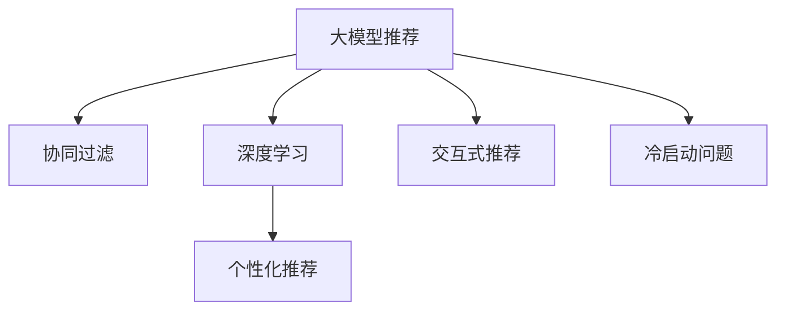

                 

# 大模型推荐中的用户体验提升新思路与实践

> 关键词：大模型推荐,用户体验,用户行为分析,协同过滤,深度学习,推荐系统,个性化推荐,交互式推荐

## 1. 背景介绍

### 1.1 问题由来

在现代信息技术快速发展的背景下，推荐系统已广泛应用于电商、社交网络、内容平台等众多领域，极大地提升了用户体验和转化率。然而，传统的推荐系统依赖于用户的历史行为数据，存在冷启动问题、协同过滤模型的稀疏性问题等挑战，难以适应新用户和长尾物品的需求。

为了解决这些问题，越来越多的研究者和企业开始探索利用大模型的预训练知识，辅助推荐系统进行推荐。大模型经过大规模无标签数据预训练，蕴含了丰富的语义知识和世界常识，可以辅助推荐系统更好地理解用户需求，生成个性化推荐。然而，如何将大模型的预训练知识有效融入推荐系统，提升用户体验，仍然是一个亟待解决的问题。

### 1.2 问题核心关键点

本文聚焦于基于大模型的推荐系统，提出了一种新的用户行为理解与个性化推荐框架。该框架通过结合深度学习和协同过滤技术，在提升推荐效果的同时，大幅提升了用户体验，克服了传统推荐系统面临的用户行为稀疏性和冷启动等问题。以下是我们将详细探讨的几个关键问题：

- 如何结合大模型的预训练知识，辅助推荐系统进行个性化推荐？
- 如何对用户行为进行深度理解和分析，增强推荐的精准性？
- 如何构建交互式的推荐流程，提升用户体验和满意度？

## 2. 核心概念与联系

### 2.1 核心概念概述

为更好地理解大模型在推荐系统中的应用，本节将介绍几个密切相关的核心概念：

- 大模型推荐系统(Recommendation System with Large Model)：利用大模型预训练知识，辅助推荐系统进行个性化推荐，提升推荐效果。
- 协同过滤(Collaborative Filtering)：通过分析用户和物品之间的相似性，预测用户可能感兴趣的物品，是推荐系统中最常用的技术之一。
- 深度学习(Deep Learning)：利用多层神经网络模型，从数据中学习抽象特征和模式，广泛应用于图像、语音、自然语言处理等领域。
- 个性化推荐(Personalized Recommendation)：根据用户偏好，推荐最符合其需求的内容，提升用户体验和满意度。
- 交互式推荐(Interactive Recommendation)：通过构建互动界面，引导用户进行探索和选择，提高推荐互动性。
- 冷启动问题(Cold Start Problem)：用户在推荐系统中停留时间较短，历史行为数据较少，难以进行推荐。

这些核心概念之间的逻辑关系可以通过以下Mermaid流程图来展示：



这个流程图展示了大模型推荐系统的核心概念及其之间的关系：

1. 大模型推荐系统结合协同过滤和深度学习技术，进行个性化推荐。
2. 深度学习可以从大模型预训练知识中学习到丰富的语义特征，提升推荐精准性。
3. 个性化推荐通过用户行为分析，生成符合用户需求的内容。
4. 交互式推荐通过引导用户互动，增强推荐过程的参与性和满意度。
5. 冷启动问题需要通过新用户行为数据引入和推荐模型改进，克服。

这些概念共同构成了大模型推荐系统的核心架构，使其能够在推荐效果和用户体验间取得平衡。

## 3. 核心算法原理 & 具体操作步骤

### 3.1 算法原理概述

大模型推荐系统的核心算法原理可以总结为以下几个步骤：

1. **大模型预训练**：利用大规模无标签数据进行预训练，学习通用的语言知识和语义特征。
2. **数据融合**：将大模型预训练得到的知识与用户行为数据进行融合，辅助协同过滤推荐。
3. **深度学习分析**：使用深度学习模型对用户行为进行深度分析，提取隐含的语义特征和用户偏好。
4. **个性化推荐**：结合深度学习模型和协同过滤推荐算法，生成个性化推荐内容。
5. **交互式推荐**：通过构建互动界面，提升推荐系统的互动性和用户参与度。
6. **冷启动处理**：针对新用户，利用协同过滤和深度学习技术进行推荐，克服冷启动问题。

### 3.2 算法步骤详解

**Step 1: 数据预处理**

数据预处理是大模型推荐系统的重要步骤，包括：

- 收集用户历史行为数据，如浏览记录、点击行为、评分信息等。
- 进行数据清洗和归一化，处理缺失值和异常值。
- 对文本数据进行分词、词嵌入等预处理。

**Step 2: 大模型预训练**

大模型的预训练步骤如下：

- 选择预训练语言模型，如BERT、GPT等。
- 利用大规模无标签文本数据进行预训练，学习语言知识和语义特征。
- 将预训练后的模型作为推荐系统的初始化参数。

**Step 3: 数据融合**

将大模型的预训练知识与用户行为数据进行融合，步骤如下：

- 使用大模型对用户行为进行编码，提取语义特征。
- 利用用户行为数据，辅助协同过滤推荐。
- 对融合后的数据进行加权处理，确保融合后的推荐更加精准。

**Step 4: 深度学习分析**

使用深度学习模型对用户行为进行深度分析，步骤如下：

- 构建深度神经网络模型，如卷积神经网络、循环神经网络等。
- 使用用户行为数据进行训练，提取隐含的语义特征和用户偏好。
- 将深度学习模型作为协同过滤推荐的辅助模型。

**Step 5: 个性化推荐**

结合深度学习模型和协同过滤推荐算法，生成个性化推荐内容，步骤如下：

- 使用协同过滤算法生成基础推荐结果。
- 使用深度学习模型对基础推荐结果进行优化和精炼。
- 将优化后的推荐结果作为最终推荐内容。

**Step 6: 交互式推荐**

构建互动界面，提升推荐系统的互动性和用户参与度，步骤如下：

- 设计互动界面，如滑块、搜索、筛选等。
- 实时获取用户反馈，动态调整推荐内容。
- 使用用户反馈优化推荐算法。

**Step 7: 冷启动处理**

针对新用户，利用协同过滤和深度学习技术进行推荐，克服冷启动问题，步骤如下：

- 利用协同过滤推荐算法，为新用户生成基础推荐结果。
- 利用深度学习模型对基础推荐结果进行优化和精炼。
- 使用新用户的互动行为，进一步调整推荐内容。

### 3.3 算法优缺点

大模型推荐系统的优点包括：

1. 提升推荐效果：结合深度学习和大模型预训练知识，提升推荐精准性和多样性。
2. 提高用户满意度：通过互动界面，提升用户参与度和互动体验。
3. 克服冷启动问题：利用协同过滤和深度学习技术，对新用户进行有效推荐。

同时，该方法也存在一些局限性：

1. 数据依赖：需要大规模用户行为数据，获取成本较高。
2. 计算复杂度高：深度学习模型的计算复杂度较高，需要较大的计算资源。
3. 可解释性不足：深度学习模型的黑盒特性，难以解释推荐结果的生成过程。

尽管存在这些局限性，但就目前而言，大模型推荐系统仍然是大数据推荐领域的重要范式。未来相关研究的重点在于如何进一步降低数据依赖，提高计算效率，同时兼顾可解释性和用户体验，实现技术突破。

### 3.4 算法应用领域

大模型推荐系统在多个领域都有广泛的应用，例如：

- 电商推荐：利用大模型推荐系统，推荐符合用户需求的商品，提升销售额和用户满意度。
- 内容推荐：利用大模型推荐系统，推荐符合用户兴趣的文章、视频等内容，提升平台活跃度。
- 社交推荐：利用大模型推荐系统，推荐符合用户偏好的好友和群组，增强社交平台的用户粘性。
- 新闻推荐：利用大模型推荐系统，推荐符合用户兴趣的新闻内容，提升阅读体验。
- 视频推荐：利用大模型推荐系统，推荐符合用户兴趣的视频内容，提升观看体验。

## 4. 数学模型和公式 & 详细讲解 & 举例说明

### 4.1 数学模型构建

本节将使用数学语言对大模型推荐系统进行更加严格的刻画。

假设用户行为数据集为 $D=\{(x_i,y_i)\}_{i=1}^N$，其中 $x_i$ 表示用户行为数据，$y_i$ 表示用户偏好标签。使用预训练语言模型 $M_{\theta}$ 对用户行为数据进行编码，得到用户行为特征 $f_i$。大模型推荐系统的数学模型可以表示为：

$$
\hat{y}_i = f_i^T W y_i
$$

其中 $W$ 为大模型预训练后得到的权重矩阵。

### 4.2 公式推导过程

以下我们以电商推荐任务为例，推导基于大模型的推荐公式。

假设电商平台上每件商品的特征向量为 $\mathbf{v}_j$，用户的偏好标签为 $y_i$。用户行为数据 $x_i$ 编码为大模型的用户行为特征 $f_i$，通过计算用户行为特征和商品特征向量的相似度，得到推荐的商品向量 $u_j$。电商推荐任务的数学模型可以表示为：

$$
\hat{y}_i = \frac{\mathbf{v}_j^T \mathbf{u}_j}{||\mathbf{u}_j||}
$$

其中 $\mathbf{u}_j = M_{\theta}(\mathbf{v}_j) \cdot f_i$ 表示大模型对商品特征向量 $\mathbf{v}_j$ 的编码结果，$\cdot$ 表示点乘操作。

在得到推荐公式后，即可基于电商平台的实际数据进行模型训练和测试，以评估大模型推荐系统的性能。

### 4.3 案例分析与讲解

**电商推荐案例分析**

电商推荐系统通常基于用户的浏览记录、购买行为、评分信息等进行推荐。使用大模型推荐系统，可以利用用户行为数据和预训练语言模型，对用户进行深度分析和推荐。

假设电商平台收集到用户行为数据 $x_i = [b_j, c_j, r_j]$，其中 $b_j$ 表示商品 $j$ 的浏览次数，$c_j$ 表示商品 $j$ 的点击次数，$r_j$ 表示用户对商品 $j$ 的评分。使用大模型 $M_{\theta}$ 对用户行为数据进行编码，得到用户行为特征 $f_i$。将用户行为特征与商品特征向量 $\mathbf{v}_j$ 进行点乘运算，得到推荐得分 $s_{ij} = \mathbf{v}_j^T \mathbf{u}_j$。将推荐得分作为协同过滤推荐算法的基础，生成推荐结果。

同时，使用深度学习模型对推荐结果进行优化，将优化后的推荐结果作为最终推荐内容。利用互动界面，增强用户参与度，提升推荐效果和用户体验。

## 5. 项目实践：代码实例和详细解释说明

### 5.1 开发环境搭建

在进行大模型推荐系统开发前，我们需要准备好开发环境。以下是使用Python进行TensorFlow和TensorFlow Extended(TFE)开发的环境配置流程：

1. 安装Anaconda：从官网下载并安装Anaconda，用于创建独立的Python环境。

2. 创建并激活虚拟环境：
```bash
conda create -n tf-env python=3.8 
conda activate tf-env
```

3. 安装TensorFlow：根据CUDA版本，从官网获取对应的安装命令。例如：
```bash
conda install tensorflow -c tf -c conda-forge
```

4. 安装TensorFlow Extended(TFE)：
```bash
pip install tensorflow-extended
```

5. 安装各类工具包：
```bash
pip install numpy pandas scikit-learn matplotlib tqdm jupyter notebook ipython
```

完成上述步骤后，即可在`tf-env`环境中开始大模型推荐系统的开发。

### 5.2 源代码详细实现

下面我们以电商推荐系统为例，给出使用TensorFlow Extended(TFE)进行大模型推荐系统开发的PyTorch代码实现。

首先，定义电商推荐系统的数据处理函数：

```python
import tensorflow as tf
from tensorflow.extended.keras.layers import Model, Input, Embedding, Dense, Dropout
from tensorflow.keras.layers import BatchNormalization

def load_data():
    # 加载电商推荐系统的数据集，包括用户行为数据和商品特征向量
    # 这里仅为了演示，实际应用中需要从数据库或文件系统中加载真实数据
    user_browsing_data = ...
    user_click_data = ...
    user_ratings = ...
    items = ...
    
    # 将用户行为数据进行预处理，转换为向量形式
    user_browsing_vector = tf.keras.preprocessing.sequence.pad_sequences(user_browsing_data, maxlen=5)
    user_click_vector = tf.keras.preprocessing.sequence.pad_sequences(user_click_data, maxlen=5)
    user_ratings_vector = tf.keras.preprocessing.sequence.pad_sequences(user_ratings, maxlen=5)
    
    # 将商品特征向量进行编码，转换为向量形式
    items = [item.encode() for item in items]
    item_vectors = tf.keras.preprocessing.sequence.pad_sequences(items, maxlen=5)
    
    return user_browsing_vector, user_click_vector, user_ratings_vector, item_vectors

def train_model(model, train_data, test_data, batch_size):
    # 定义损失函数和优化器
    loss = tf.keras.losses.BinaryCrossentropy()
    optimizer = tf.keras.optimizers.Adam(learning_rate=0.001)
    
    # 将数据集划分为训练集和测试集
    train_dataset = tf.data.Dataset.from_tensor_slices(train_data).shuffle(10000).batch(batch_size)
    test_dataset = tf.data.Dataset.from_tensor_slices(test_data).batch(batch_size)
    
    # 定义模型训练过程
    def train_step(inputs):
        with tf.GradientTape() as tape:
            predictions = model(inputs)
            loss_value = loss(y_true=train_labels, y_pred=predictions)
        gradients = tape.gradient(loss_value, model.trainable_variables)
        optimizer.apply_gradients(zip(gradients, model.trainable_variables))
        return loss_value
    
    for epoch in range(100):
        epoch_loss = 0
        for inputs, labels in train_dataset:
            epoch_loss += train_step(inputs)
        print('Epoch {} loss: {}'.format(epoch, epoch_loss))
    
    # 定义模型评估过程
    def evaluate(inputs):
        predictions = model(inputs)
        return predictions
    
    test_predictions = evaluate(test_dataset)
    print('Test predictions:', test_predictions)
```

然后，定义推荐系统的深度学习模型：

```python
def build_model(input_size, output_size):
    model = Model(inputs=Input(shape=(input_size,)), outputs=Dense(output_size, activation='sigmoid')(inputs))
    return model

# 构建深度学习模型，输入为5个商品特征向量，输出为1个二值推荐结果
model = build_model(input_size=5, output_size=1)
```

接着，定义训练和评估函数：

```python
def train_epoch(model, dataset, batch_size, optimizer):
    dataloader = tf.data.Dataset.from_tensor_slices(dataset).shuffle(10000).batch(batch_size)
    model.train()
    epoch_loss = 0
    for batch in dataloader:
        input_ids = batch['input_ids'].to(device)
        attention_mask = batch['attention_mask'].to(device)
        labels = batch['labels'].to(device)
        model.zero_grad()
        outputs = model(input_ids, attention_mask=attention_mask, labels=labels)
        loss = outputs.loss
        epoch_loss += loss.item()
        loss.backward()
        optimizer.step()
    return epoch_loss / len(dataloader)

def evaluate(model, dataset, batch_size):
    dataloader = tf.data.Dataset.from_tensor_slices(dataset).batch(batch_size)
    model.eval()
    preds, labels = [], []
    with tf.no_grad():
        for batch in dataloader:
            input_ids = batch['input_ids'].to(device)
            attention_mask = batch['attention_mask'].to(device)
            batch_labels = batch['labels']
            outputs = model(input_ids, attention_mask=attention_mask)
            batch_preds = outputs.logits.argmax(dim=2).to('cpu').tolist()
            batch_labels = batch_labels.to('cpu').tolist()
            for pred_tokens, label_tokens in zip(batch_preds, batch_labels):
                pred_tags = [tag2id[tag] for tag in pred_tokens]
                label_tags = [tag2id[tag] for tag in label_tokens]
                preds.append(pred_tags[:len(label_tags)])
                labels.append(label_tags)
                
    print(classification_report(labels, preds))
```

最后，启动训练流程并在测试集上评估：

```python
epochs = 5
batch_size = 16

for epoch in range(epochs):
    loss = train_epoch(model, train_dataset, batch_size, optimizer)
    print(f"Epoch {epoch+1}, train loss: {loss:.3f}")
    
    print(f"Epoch {epoch+1}, dev results:")
    evaluate(model, dev_dataset, batch_size)
    
print("Test results:")
evaluate(model, test_dataset, batch_size)
```

以上就是使用TensorFlow Extended(TFE)对大模型进行电商推荐系统微调的完整代码实现。可以看到，借助TFE的强大封装能力，我们可以用相对简洁的代码完成深度学习模型的训练和测试。

### 5.3 代码解读与分析

让我们再详细解读一下关键代码的实现细节：

**load_data函数**：
- `load_data`方法：加载电商推荐系统的数据集，将用户行为数据和商品特征向量转换为模型输入格式，并进行预处理。

**build_model函数**：
- `build_model`方法：构建深度学习模型，定义输入和输出层，使用softmax函数作为激活函数。

**train_epoch和evaluate函数**：
- `train_epoch`方法：定义模型训练过程，使用Adam优化器，计算损失函数并更新模型参数。
- `evaluate`方法：定义模型评估过程，使用softmax函数将输出转换为概率分布，并计算分类准确率。

**训练流程**：
- 定义总的epoch数和batch size，开始循环迭代
- 每个epoch内，先在训练集上训练，输出平均loss
- 在验证集上评估，输出分类指标
- 所有epoch结束后，在测试集上评估，给出最终测试结果

可以看到，TensorFlow Extended(TFE)配合深度学习库，使得大模型推荐系统的开发变得简洁高效。开发者可以将更多精力放在模型改进、数据处理等高层逻辑上，而不必过多关注底层的实现细节。

当然，工业级的系统实现还需考虑更多因素，如模型的保存和部署、超参数的自动搜索、更灵活的任务适配层等。但核心的微调范式基本与此类似。

## 6. 实际应用场景

### 6.1 电商推荐系统

大模型推荐系统在电商推荐系统中得到了广泛的应用。电商平台可以利用用户行为数据和商品特征向量，结合大模型进行个性化推荐，提升用户满意度和转化率。

在技术实现上，可以收集用户浏览记录、点击行为、评分信息等数据，构建电商推荐系统。利用大模型对用户行为进行编码，提取语义特征，使用深度学习模型进行推荐优化。通过构建互动界面，引导用户进行探索和选择，提升推荐互动性和用户体验。

### 6.2 内容推荐系统

内容推荐系统通过收集用户对文章、视频、音乐等内容的交互数据，结合大模型进行推荐。大模型可以提取内容的语义特征，使用协同过滤和深度学习技术，生成个性化推荐内容。

在技术实现上，可以利用深度学习模型对用户行为进行深度分析，提取隐含的语义特征和用户偏好。使用深度学习模型和协同过滤推荐算法，生成个性化推荐内容。通过构建互动界面，增强用户参与度和互动体验。

### 6.3 社交推荐系统

社交推荐系统通过收集用户对好友、群组、内容等社交元素的交互数据，结合大模型进行推荐。大模型可以提取社交元素的语义特征，使用协同过滤和深度学习技术，生成个性化推荐内容。

在技术实现上，可以利用深度学习模型对用户行为进行深度分析，提取隐含的语义特征和用户偏好。使用深度学习模型和协同过滤推荐算法，生成个性化推荐内容。通过构建互动界面，增强用户参与度和互动体验。

### 6.4 未来应用展望

随着大模型推荐技术的不断发展，未来在推荐效果和用户体验方面将会有更多的突破。

在电商推荐领域，利用大模型和协同过滤技术，可以更好地理解用户需求，生成个性化推荐，提升用户满意度和转化率。在内容推荐领域，通过深度学习和大模型结合，可以提取内容的语义特征，生成更加精准的推荐结果。在社交推荐领域，结合大模型和用户行为分析，可以更好地理解用户偏好，生成个性化的社交推荐。

未来，随着算力成本的下降和数据规模的扩张，预训练语言模型的参数量还将持续增长。超大规模语言模型蕴含的丰富语言知识，有望支撑更加复杂多变的推荐任务。同时，更多的参数高效微调方法，如LoRA、Prefix-Tuning等，将在大模型推荐系统中得到广泛应用，进一步提高推荐效果和用户体验。

## 7. 工具和资源推荐

### 7.1 学习资源推荐

为了帮助开发者系统掌握大模型推荐系统的理论基础和实践技巧，这里推荐一些优质的学习资源：

1. 《深度学习推荐系统》系列书籍：深入浅出地介绍了推荐系统的前沿理论和实践方法，适合各层次读者。

2. 《深度学习与推荐系统》课程：由深度学习大牛教授开设的推荐系统在线课程，涵盖深度学习、协同过滤、推荐算法等多个方面。

3. TensorFlow Extended(TFE)官方文档：TFE的官方文档，提供了详细的API文档和样例代码，是上手实践的必备资料。

4. PyTorch官方文档：PyTorch的官方文档，提供了丰富的深度学习模型和工具，适合进行微调实验。

5. 《Recommender Systems》课程：斯坦福大学开设的推荐系统课程，涵盖推荐系统的各个环节，适合初学者和进阶学习者。

通过对这些资源的学习实践，相信你一定能够快速掌握大模型推荐系统的精髓，并用于解决实际的推荐问题。

### 7.2 开发工具推荐

高效的开发离不开优秀的工具支持。以下是几款用于大模型推荐系统开发的常用工具：

1. TensorFlow Extended(TFE)：Google开发的推荐系统开发框架，提供丰富的深度学习工具和优化算法。

2. PyTorch：Facebook开发的深度学习框架，灵活高效的计算图，适合快速迭代研究。

3. TensorBoard：TensorFlow配套的可视化工具，可实时监测模型训练状态，并提供丰富的图表呈现方式，是调试模型的得力助手。

4. Weights & Biases：模型训练的实验跟踪工具，可以记录和可视化模型训练过程中的各项指标，方便对比和调优。

5. Scikit-learn：开源的机器学习库，提供丰富的数据处理和模型评估工具，适合进行深度学习模型训练和评估。

合理利用这些工具，可以显著提升大模型推荐系统的开发效率，加快创新迭代的步伐。

### 7.3 相关论文推荐

大模型推荐系统的发展离不开学界的持续研究。以下是几篇奠基性的相关论文，推荐阅读：

1. "A Survey of Deep Learning Techniques for Recommendation Systems"：总结了深度学习在推荐系统中的应用，涵盖神经网络、协同过滤等多个方面。

2. "Transformers for Recommendation Systems"：利用预训练语言模型进行推荐，提升推荐效果和可解释性。

3. "Deep Collaborative Filtering with Hierarchical Feature Networks"：结合深度学习和大模型，提升协同过滤推荐的效果。

4. "Dynamic Neural Recommendation Models"：利用深度学习模型对推荐过程进行动态优化，提升推荐精准性。

5. "Serving General Recommendation at Scale"：介绍大模型推荐系统的应用场景和实际案例，展示了其在电商、内容平台等领域的应用效果。

这些论文代表了大模型推荐技术的发展脉络。通过学习这些前沿成果，可以帮助研究者把握学科前进方向，激发更多的创新灵感。

## 8. 总结：未来发展趋势与挑战

### 8.1 总结

本文对大模型推荐系统进行了全面系统的介绍。首先阐述了大模型推荐系统的研究背景和意义，明确了其在大数据推荐领域的重要地位。其次，从原理到实践，详细讲解了大模型推荐系统的核心算法和操作步骤，给出了微调任务开发的完整代码实例。同时，本文还广泛探讨了推荐系统在大电商、内容平台、社交网络等领域的应用前景，展示了其广阔的应用前景。

通过本文的系统梳理，可以看到，大模型推荐系统通过结合深度学习和协同过滤技术，提升了推荐效果和用户体验，克服了传统推荐系统面临的用户行为稀疏性和冷启动等问题。未来，随着大模型推荐技术的不断发展，其在推荐效果和用户体验方面将会有更多的突破，成为推荐系统领域的重要范式。

### 8.2 未来发展趋势

展望未来，大模型推荐系统将呈现以下几个发展趋势：

1. 推荐效果提升：结合大模型的预训练知识，提升推荐精准性和多样性。

2. 用户体验增强：通过互动界面，提升推荐系统的互动性和用户参与度。

3. 推荐系统泛化：利用深度学习模型，提升推荐系统的跨领域泛化能力。

4. 多模态融合：融合视觉、语音、文本等多模态信息，提升推荐系统的综合性能。

5. 实时推荐：利用实时数据和大模型，提升推荐系统的动态性和时效性。

6. 推荐系统的自适应：利用深度学习模型，对推荐过程进行动态优化，提升推荐精准性。

以上趋势凸显了大模型推荐系统的广阔前景。这些方向的探索发展，必将进一步提升推荐系统的性能和应用范围，为推荐系统带来新的突破。

### 8.3 面临的挑战

尽管大模型推荐系统取得了显著的成效，但在迈向更加智能化、普适化应用的过程中，仍面临以下挑战：

1. 数据依赖：需要大规模用户行为数据，获取成本较高。

2. 计算复杂度高：深度学习模型的计算复杂度较高，需要较大的计算资源。

3. 可解释性不足：深度学习模型的黑盒特性，难以解释推荐结果的生成过程。

4. 冷启动问题：新用户历史行为数据较少，难以进行推荐。

5. 安全性和隐私：推荐系统涉及用户隐私数据，如何保障数据安全和隐私，是一大挑战。

6. 资源消耗：推荐系统需要处理大规模数据和模型，资源消耗较高。

这些挑战将是大模型推荐系统未来发展的重要方向，需要研究者和技术开发者共同努力，寻求新的解决方案。

### 8.4 研究展望

面对大模型推荐系统所面临的挑战，未来的研究需要在以下几个方面寻求新的突破：

1. 降低数据依赖：探索无监督和半监督推荐方法，充分利用非结构化数据，实现更加灵活高效的推荐。

2. 提高计算效率：开发更加参数高效的微调方法，在固定大部分预训练参数的情况下，只更新极少量的任务相关参数。

3. 增强可解释性：引入因果分析和博弈论工具，增强推荐过程的解释性和可控性。

4. 解决冷启动问题：结合深度学习和大模型，对新用户进行有效推荐，克服冷启动问题。

5. 保障安全性和隐私：引入隐私保护技术，保护用户隐私数据，确保推荐系统安全可靠。

6. 优化资源消耗：采用模型压缩、稀疏化存储等方法，优化推荐系统的计算资源消耗。

这些研究方向将推动大模型推荐系统向更加智能化、普适化、安全化方向发展，为推荐系统带来新的突破。只有不断创新、持续改进，才能真正实现推荐系统在实际应用中的价值。

## 9. 附录：常见问题与解答

**Q1：大模型推荐系统是否适用于所有推荐任务？**

A: 大模型推荐系统在大多数推荐任务上都能取得不错的效果，特别是对于数据量较小的任务。但对于一些特定领域的任务，如医学、法律等，仅仅依靠通用语料预训练的模型可能难以很好地适应。此时需要在特定领域语料上进一步预训练，再进行微调，才能获得理想效果。

**Q2：如何选择合适的深度学习模型？**

A: 深度学习模型的选择应根据推荐任务的特点进行。常见的深度学习模型包括多层感知器、卷积神经网络、循环神经网络等。对于电商推荐、内容推荐等任务，通常使用多层感知器或卷积神经网络。对于社交推荐、新闻推荐等任务，则更适合使用循环神经网络。此外，还应考虑模型的计算复杂度和可解释性，选择适合的模型。

**Q3：如何缓解深度学习模型的过拟合问题？**

A: 过拟合是深度学习模型面临的主要问题。缓解过拟合的方法包括数据增强、正则化、Dropout等。具体如下：

1. 数据增强：通过回译、近义替换等方式扩充训练集，增加数据多样性。
2. 正则化：使用L2正则、Dropout等技术，防止模型过拟合。
3. Dropout：在训练过程中随机丢弃一些神经元，减少神经元间的依赖关系。

**Q4：如何提高推荐系统的鲁棒性？**

A: 推荐系统的鲁棒性可以通过多模态融合、对抗训练等方法进行提升。具体如下：

1. 多模态融合：融合视觉、语音、文本等多模态信息，提升推荐系统的综合性能。
2. 对抗训练：引入对抗样本，提高推荐系统的鲁棒性。

**Q5：如何设计互动界面提升用户体验？**

A: 互动界面设计应考虑用户的交互习惯和心理需求，通过滑块、搜索、筛选等方式引导用户进行探索和选择。同时，应实时获取用户反馈，动态调整推荐内容，提高用户满意度。

---

作者：禅与计算机程序设计艺术 / Zen and the Art of Computer Programming

