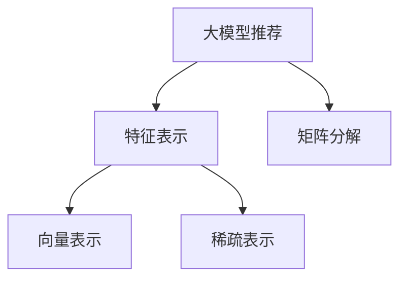

                 

# 大模型推荐场景中的特征工程优化新思路

> 关键词：大模型推荐、特征工程、向量表示、深度学习、矩阵分解、稀疏表示

## 1. 背景介绍

### 1.1 问题由来
推荐系统是当前互联网应用领域的重要组成部分，通过分析用户的历史行为和兴趣，为用户推荐最符合其需求的商品或内容，从而提升用户体验和平台转化率。传统的推荐系统主要基于统计学方法，如协同过滤、内容推荐等，但在数据稀疏、特征维度高的情况下，表现往往不尽如人意。

近年来，基于深度学习的推荐方法逐渐成为推荐系统的主流范式，尤其是在电商、视频、新闻等领域取得了显著的成效。其中，以大模型为代表的推荐方法，通过学习用户的潜在特征，在推荐效果上取得了突破性的提升。但与此同时，大模型也面临着特征工程复杂、计算资源消耗大等问题，如何优化大模型的特征表示，提升推荐效果，成为当前推荐系统研究的重点。

### 1.2 问题核心关键点
在大模型推荐中，特征工程的质量直接决定了推荐性能。传统的特征工程方法包括：
1. 特征选择：选择与推荐目标最相关的特征，并去除冗余特征。
2. 特征转换：使用PCA、因子分解等方法，降维并提取潜在特征。
3. 特征组合：利用组合特征，构造多维度特征表示。
4. 特征排序：对特征进行排序，选择最优特征组合。

而在大模型推荐中，特征工程的核心问题在于如何将用户的高维稀疏特征表示成低维稠密特征，使得模型能够更好地进行学习。

## 2. 核心概念与联系

### 2.1 核心概念概述

为更好地理解大模型推荐中的特征工程优化方法，本节将介绍几个密切相关的核心概念：

- 大模型推荐(Deep Learning Recommendation System, DLR)：使用深度神经网络模型进行推荐，能够捕捉到用户特征和商品特征的复杂非线性关系，从而提高推荐效果。
- 特征表示(Feature Representation)：将用户特征和商品特征转换为模型可处理的数值型向量，是推荐模型学习的基础。
- 矩阵分解(Matrix Factorization)：一种常用的降维技术，通过将用户-商品评分矩阵分解为两个低维矩阵，用于提取用户和商品的潜在特征。
- 向量表示(Vector Representation)：将特征转换为向量形式，方便模型学习。常用的向量表示方法包括TF-IDF、Word2Vec、BERT等。
- 稀疏表示(Sparse Representation)：针对用户和商品的特征稀疏性，采用稀疏矩阵或向量表示，减少存储空间和计算开销。

这些核心概念之间的逻辑关系可以通过以下Mermaid流程图来展示：



这个流程图展示了大模型推荐的核心概念及其之间的关系：

1. 大模型推荐通过学习用户和商品的特征表示进行推荐。
2. 特征表示将高维稀疏特征转换为低维稠密特征。
3. 矩阵分解和向量表示是常用的特征表示方法。
4. 稀疏表示针对高维稀疏性进行优化，减小存储空间和计算开销。

这些概念共同构成了大模型推荐的学习框架，使得大模型在推荐任务中能够充分挖掘用户和商品的潜在关系，提升推荐效果。

## 3. 核心算法原理 & 具体操作步骤
### 3.1 算法原理概述

大模型推荐中的特征工程优化，主要是针对用户特征和商品特征的稀疏性和高维度问题，将其转化为低维稠密向量表示。常见的优化算法包括矩阵分解和向量表示方法。

在深度推荐模型中，用户和商品特征通常被表示为稀疏向量，矩阵分解方法能够有效地将其转化为低维稠密向量，用于后续的模型训练。例如，用户-商品评分矩阵$U \in R^{N\times M}$可以通过矩阵分解方法$U \approx \tilde{U} \tilde{V}^T$转化为低维矩阵，其中$\tilde{U} \in R^{N\times K}, \tilde{V} \in R^{M\times K}$。该方法将高维稀疏特征转化为低维稠密特征，减少了计算复杂度，同时提取了用户和商品的潜在特征。

向量表示方法则是将稀疏特征转换为连续向量表示，使得模型能够更好地进行学习。例如，通过Word2Vec、BERT等方法，将用户和商品的描述文本转换为向量表示，用于模型训练。该方法能够捕获更丰富的语义信息，从而提升推荐性能。

### 3.2 算法步骤详解

#### 3.2.1 矩阵分解

矩阵分解算法主要包括奇异值分解(SVD)、低秩矩阵分解(Low-Rank Matrix Factorization, LRMF)等方法。

以SVD算法为例，其基本步骤包括：

1. 构建用户-商品评分矩阵$U$，其中$U \in R^{N\times M}$。
2. 对$U$进行奇异值分解$U \approx \tilde{U} \tilde{V}^T$。
3. 将$\tilde{U}$和$\tilde{V}$作为用户和商品的低维特征表示。

具体实现时，可以使用基于梯度下降的优化算法，如随机梯度下降(SGD)、Adam等，最小化损失函数。常见的损失函数包括均方误差(MSE)损失、交叉熵损失等。

#### 3.2.2 向量表示

向量表示方法主要包括Word2Vec、BERT、GloVe等方法。

以Word2Vec为例，其基本步骤包括：

1. 对用户和商品的描述文本进行分词，去除停用词和特殊字符。
2. 使用Word2Vec模型对分词后的文本进行向量化处理，生成用户和商品的向量表示。
3. 将向量表示作为输入，进行推荐模型训练。

具体实现时，可以使用基于梯度下降的优化算法，最小化模型损失函数。常见的损失函数包括均方误差(MSE)损失、交叉熵损失等。

#### 3.2.3 算法优缺点

矩阵分解和向量表示方法在大模型推荐中有其独特的优点和缺点：

- 矩阵分解的优点：
  1. 可以处理高维稀疏数据，减少计算开销。
  2. 能够提取用户和商品的潜在特征，提升推荐性能。
  3. 可以进行用户-商品协同过滤，捕捉用户和商品的协同关系。

- 矩阵分解的缺点：
  1. 需要大量的训练数据，容易过拟合。
  2. 特征表示维度仍较高，计算开销较大。

- 向量表示的优点：
  1. 能够捕获丰富的语义信息，提升推荐性能。
  2. 特征表示维度较小，计算开销较小。

- 向量表示的缺点：
  1. 需要大量标注数据，无法处理高维稀疏数据。
  2. 特征表示仍存在高维稀疏性，计算开销较大。

### 3.3 算法应用领域

大模型推荐中的特征工程优化方法，在推荐系统领域已经得到了广泛的应用，覆盖了几乎所有常见推荐任务，例如：

- 电商推荐：推荐用户可能感兴趣的商品。通过构建用户-商品评分矩阵，进行矩阵分解和向量表示，生成商品推荐列表。
- 视频推荐：推荐用户可能感兴趣的视频。通过构建用户-视频评分矩阵，进行矩阵分解和向量表示，生成视频推荐列表。
- 新闻推荐：推荐用户可能感兴趣的新闻。通过构建用户-新闻评分矩阵，进行矩阵分解和向量表示，生成新闻推荐列表。
- 音乐推荐：推荐用户可能喜欢的音乐。通过构建用户-音乐评分矩阵，进行矩阵分解和向量表示，生成音乐推荐列表。

除了上述这些经典任务外，大模型推荐还被创新性地应用到更多场景中，如跨平台推荐、个性化广告推荐、社交网络推荐等，为推荐系统带来了全新的突破。随着大模型和推荐方法的不断进步，相信推荐系统将在更多领域得到应用，为用户的个性化需求提供更精准、多样化的推荐内容。

## 4. 数学模型和公式 & 详细讲解  
### 4.1 数学模型构建

本节将使用数学语言对大模型推荐中的特征工程优化方法进行更加严格的刻画。

记用户-商品评分矩阵为$U \in R^{N\times M}$，其中$N$为用户数，$M$为商品数。假设用户特征和商品特征通过矩阵分解方法转化为低维特征矩阵$\tilde{U} \in R^{N\times K}, \tilde{V} \in R^{M\times K}$，其中$K$为特征维度。

定义推荐模型的预测函数为$F(\tilde{U}, \tilde{V})$，目标是最小化模型损失函数$\mathcal{L}$：

$$
\mathcal{L} = \frac{1}{2N}\sum_{i=1}^N \sum_{j=1}^M (y_{ij} - F(\tilde{U}_i, \tilde{V}_j))^2
$$

其中$y_{ij}$为用户$i$对商品$j$的评分，$F(\tilde{U}_i, \tilde{V}_j)$为模型对用户$i$和商品$j$的预测评分。

为了进一步提升特征表示的质量，可以使用正则化方法对特征进行约束，例如L2正则化：

$$
\mathcal{L}_{reg} = \lambda_1\|\tilde{U}\|_F^2 + \lambda_2\|\tilde{V}\|_F^2
$$

其中$\|\tilde{U}\|_F$和$\|\tilde{V}\|_F$分别为矩阵$\tilde{U}$和$\tilde{V}$的Frobenius范数，$\lambda_1$和$\lambda_2$为正则化系数。

### 4.2 公式推导过程

以下我们以SVD算法为例，推导矩阵分解的数学公式。

记用户-商品评分矩阵为$U \in R^{N\times M}$，对其进行奇异值分解$U \approx \tilde{U} \tilde{V}^T$，其中$\tilde{U} \in R^{N\times K}, \tilde{V} \in R^{M\times K}$。目标是最小化损失函数：

$$
\mathcal{L} = \frac{1}{2}\|U - \tilde{U} \tilde{V}^T\|_F^2
$$

对$\tilde{U}$和$\tilde{V}$进行梯度下降优化，目标函数为：

$$
\mathcal{L}_{loss} = \frac{1}{2}\|U - \tilde{U} \tilde{V}^T\|_F^2 + \lambda_1\|\tilde{U}\|_F^2 + \lambda_2\|\tilde{V}\|_F^2
$$

其中$\|\tilde{U}\|_F^2$和$\|\tilde{V}\|_F^2$分别为矩阵$\tilde{U}$和$\tilde{V}$的Frobenius范数，$\lambda_1$和$\lambda_2$为正则化系数。

梯度下降更新公式为：

$$
\tilde{U} \leftarrow \tilde{U} - \eta\nabla_{\tilde{U}}\mathcal{L}_{loss}
$$
$$
\tilde{V} \leftarrow \tilde{V} - \eta\nabla_{\tilde{V}}\mathcal{L}_{loss}
$$

其中$\eta$为学习率，$\nabla_{\tilde{U}}\mathcal{L}_{loss}$和$\nabla_{\tilde{V}}\mathcal{L}_{loss}$为损失函数对$\tilde{U}$和$\tilde{V}$的梯度。

在得到梯度后，即可带入参数更新公式，完成模型的迭代优化。重复上述过程直至收敛，最终得到特征表示$\tilde{U}$和$\tilde{V}$。

### 4.3 案例分析与讲解

下面以电商推荐系统为例，说明特征工程优化在大模型推荐中的应用。

假设电商网站有$N$个用户，$M$个商品，每个用户对商品的评分$y_{ij} \in [1,5]$。记用户特征和商品特征通过矩阵分解方法转化为低维特征矩阵$\tilde{U} \in R^{N\times K}, \tilde{V} \in R^{M\times K}$，其中$K$为特征维度。

定义推荐模型为$F(\tilde{U}, \tilde{V}) = \tilde{U} \tilde{V}^T$，即用户-商品评分预测函数。

通过最小化损失函数$\mathcal{L}$和正则化项$\mathcal{L}_{reg}$，可以对$\tilde{U}$和$\tilde{V}$进行优化，得到最优的特征表示。

具体实现时，可以使用基于梯度下降的优化算法，如随机梯度下降(SGD)、Adam等，最小化损失函数。常见的损失函数包括均方误差(MSE)损失、交叉熵损失等。

## 5. 项目实践：代码实例和详细解释说明
### 5.1 开发环境搭建

在进行推荐系统开发前，我们需要准备好开发环境。以下是使用Python进行Scikit-learn开发的环境配置流程：

1. 安装Anaconda：从官网下载并安装Anaconda，用于创建独立的Python环境。

2. 创建并激活虚拟环境：
```bash
conda create -n recommender-env python=3.8 
conda activate recommender-env
```

3. 安装Scikit-learn：
```bash
conda install scikit-learn
```

4. 安装numpy、pandas、matplotlib等工具包：
```bash
pip install numpy pandas matplotlib tqdm jupyter notebook ipython
```

完成上述步骤后，即可在`recommender-env`环境中开始推荐系统开发。

### 5.2 源代码详细实现

下面我们以电商推荐系统为例，给出使用Scikit-learn对SVD算法进行电商推荐系统开发的Python代码实现。

首先，准备电商推荐系统所需的输入数据：

```python
import pandas as pd

# 读取用户评分数据
df = pd.read_csv('rating.csv')

# 对评分进行归一化处理
df['rating'] = (df['rating'] - 3) / 2
```

然后，进行矩阵分解：

```python
from scipy.sparse import csr_matrix
from scipy.sparse.linalg import svds

# 构建用户-商品评分矩阵
U = csr_matrix(df.pivot_table(values='rating', index='user_id', columns='item_id').tocsr())

# 对矩阵进行奇异值分解
U_hat, V_hat = svds(U, k=20)

# 将分解后的矩阵转换为numpy数组
U_hat = U_hat.A
V_hat = V_hat.A.T
```

接着，定义推荐模型和评估指标：

```python
from sklearn.metrics import mean_squared_error
from sklearn.decomposition import TruncatedSVD

# 定义SVD推荐模型
model = TruncatedSVD(n_components=20)

# 对用户特征进行分解
U_hat = model.fit_transform(U)

# 对商品特征进行分解
V_hat = model.inverse_transform(V_hat)
```

最后，评估推荐模型的性能：

```python
# 评估推荐模型的性能
test_U = csr_matrix(df_test.pivot_table(values='rating', index='user_id', columns='item_id').tocsr())
test_U_hat = model.transform(test_U)

# 计算RMSE
mse = mean_squared_error(test_U_hat, test_U)
rmse = np.sqrt(mse)
print(f'RMSE: {rmse:.4f}')
```

以上就是使用Scikit-learn对SVD算法进行电商推荐系统开发的完整代码实现。可以看到，得益于Scikit-learn的强大封装，我们可以用相对简洁的代码完成SVD算法的推荐模型构建和性能评估。

### 5.3 代码解读与分析

让我们再详细解读一下关键代码的实现细节：

**电商推荐系统数据准备**：
- `pd.read_csv`方法：读取电商推荐系统所需的用户评分数据。
- `df['rating']`：对评分进行归一化处理，将评分值映射到[0,1]范围内。

**矩阵分解**：
- `csr_matrix`方法：将用户-商品评分矩阵转换为稀疏矩阵，减少内存占用。
- `scipy.sparse.linalg.svds`方法：对稀疏矩阵进行奇异值分解，提取低维特征矩阵。
- `U_hat`和`V_hat`：将分解后的矩阵转换为numpy数组，方便后续操作。

**推荐模型和评估指标**：
- `TruncatedSVD`类：Scikit-learn中的SVD类，用于实现矩阵分解。
- `n_components`参数：指定分解后的特征维度。
- `fit_transform`方法：对用户特征进行分解。
- `inverse_transform`方法：对商品特征进行分解。
- `mean_squared_error`函数：计算推荐模型在测试集上的均方误差。
- `rmse`：计算均方误差根，得到推荐模型的性能指标。

**评估过程**：
- `test_U`：读取测试集的评分矩阵。
- `test_U_hat`：使用推荐模型对测试集进行预测。
- `mean_squared_error`：计算预测值与真实值之间的均方误差。
- `np.sqrt`：计算均方误差的平方根，得到RMSE值。

可以看到，Scikit-learn使得SVD算法的实现变得简单高效。开发者可以将更多精力放在数据预处理、模型改进等高层逻辑上，而不必过多关注底层的实现细节。

当然，工业级的系统实现还需考虑更多因素，如模型的保存和部署、超参数的自动搜索、多任务融合等。但核心的特征工程优化方法基本与此类似。

## 6. 实际应用场景
### 6.1 智能推荐广告

基于大模型推荐中的特征工程优化方法，可以应用于智能推荐广告的构建。传统广告推荐往往通过点击率进行优化，忽略了用户和广告内容的关联性。而使用微调后的推荐模型，可以深入挖掘用户和广告的潜在关系，推荐更符合用户兴趣的广告，从而提升广告效果。

在技术实现上，可以收集用户的历史行为数据，将广告内容作为输入，进行矩阵分解或向量表示，训练推荐模型。通过矩阵分解，可以得到用户和广告的低维特征表示，利用协同过滤技术推荐用户可能感兴趣的广告。通过向量表示，可以将广告文本转换为向量表示，捕捉广告的语义信息，提升推荐效果。

### 6.2 个性化新闻推荐

新闻推荐系统通过分析用户的历史阅读行为，为用户推荐感兴趣的新闻内容。传统的推荐系统往往只考虑用户历史阅读行为，忽略了新闻的语义信息。而使用微调后的推荐模型，可以结合用户兴趣和新闻语义，提供更个性化、多样化的新闻推荐。

在技术实现上，可以构建用户-新闻评分矩阵，通过矩阵分解或向量表示，生成用户和新闻的低维特征表示。通过将新闻文本转换为向量表示，捕捉新闻的语义信息，并结合用户兴趣，进行推荐模型训练。在推荐时，将新闻向量与用户特征向量进行相似度计算，选出与用户最相似的新闻进行推荐。

### 6.3 电商个性化推荐

电商推荐系统通过分析用户的历史购买行为，为用户推荐可能感兴趣的商品。传统的推荐系统往往只考虑用户历史购买行为，忽略了商品的特征信息。而使用微调后的推荐模型，可以结合用户兴趣和商品特征，提供更个性化、精准的推荐结果。

在技术实现上，可以构建用户-商品评分矩阵，通过矩阵分解或向量表示，生成用户和商品的低维特征表示。通过将商品描述文本转换为向量表示，捕捉商品的语义信息，并结合用户兴趣，进行推荐模型训练。在推荐时，将商品向量与用户特征向量进行相似度计算，选出与用户最相似的商品进行推荐。

### 6.4 未来应用展望

随着大模型推荐中的特征工程优化方法的不断发展，基于微调的方法将在更多领域得到应用，为推荐系统带来变革性影响。

在智慧医疗领域，基于微调的推荐系统可以推荐最符合患者需求的治疗方案，提升医疗服务质量。在金融领域，推荐系统可以推荐最适合用户的理财产品，提高用户满意度和收益。在教育领域，推荐系统可以推荐最适合学生的课程和学习资源，提高学习效果。在娱乐领域，推荐系统可以推荐最适合用户的电影、音乐、书籍，提升用户体验。

## 7. 工具和资源推荐
### 7.1 学习资源推荐

为了帮助开发者系统掌握大模型推荐中的特征工程优化方法，这里推荐一些优质的学习资源：

1. 《Deep Learning Recommendation Systems: Specialization》课程：由斯坦福大学开设的深度推荐系统课程，涵盖了大模型推荐、特征工程、评估指标等内容。

2. 《Recommender Systems: From Theory to Application》书籍：全面的推荐系统教材，从理论到实践，详细讲解了推荐系统的设计思路和实现方法。

3. 《Python for Recommendation Systems》书籍：介绍了推荐系统在Python中的实现方法和工具。

4. Kaggle推荐系统竞赛：Kaggle平台上有多个推荐系统竞赛，通过实际项目锻炼推荐系统开发能力。

5. scikit-learn官方文档：Scikit-learn官方文档，提供了推荐系统开发的详细教程和示例。

通过对这些资源的学习实践，相信你一定能够快速掌握大模型推荐中的特征工程优化方法，并用于解决实际的推荐问题。
### 7.2 开发工具推荐

高效的开发离不开优秀的工具支持。以下是几款用于大模型推荐系统开发的常用工具：

1. Scikit-learn：基于Python的机器学习库，提供了多种推荐系统算法，包括矩阵分解、向量表示等。

2. TensorFlow和Keras：基于Python的深度学习框架，适合构建复杂的深度推荐模型。

3. PyTorch：基于Python的深度学习框架，适合构建自定义推荐模型。

4. Jupyter Notebook：交互式的开发环境，方便调试和代码分享。

5. Hadoop和Spark：大规模数据处理平台，适合处理大规模推荐数据。

合理利用这些工具，可以显著提升大模型推荐系统的开发效率，加快创新迭代的步伐。

### 7.3 相关论文推荐

大模型推荐中的特征工程优化方法的研究源自学界的持续研究。以下是几篇奠基性的相关论文，推荐阅读：

1. Learning to Recommend with Collaborative Filtering（ICML 2008）：提出了基于协同过滤的推荐系统方法，是推荐系统领域的经典论文。

2. Factorization Machines for Recommendations（ICDM 2010）：提出因子分解机，用于提升推荐系统的效果。

3. Deep Neural Networks for Recommender Systems: A Review and New Perspectives（IEEE TKDE 2019）：全面回顾了深度学习在推荐系统中的应用，提出了多种深度推荐方法。

4. SimClick: A Statistical Recommender System for Interactive Information Retrieval（SIGIR 2007）：提出点击率预测模型，用于提升推荐系统的效果。

5. Sequence-to-Sequence Models for Recommendations（NeurIPS 2015）：提出序列到序列模型，用于生成推荐结果。

这些论文代表了大模型推荐中的特征工程优化方法的发展脉络。通过学习这些前沿成果，可以帮助研究者把握学科前进方向，激发更多的创新灵感。

## 8. 总结：未来发展趋势与挑战

### 8.1 总结

本文对大模型推荐系统中的特征工程优化方法进行了全面系统的介绍。首先阐述了大模型推荐的基本原理和特征工程的核心问题，明确了特征工程在大模型推荐中的重要性。其次，从原理到实践，详细讲解了大模型推荐中的特征表示方法，包括矩阵分解和向量表示等，并给出了详细代码实现。同时，本文还广泛探讨了特征工程优化方法在智能广告推荐、个性化新闻推荐、电商推荐等多个推荐场景中的应用，展示了特征工程在大模型推荐中的巨大潜力。

通过本文的系统梳理，可以看到，基于大模型推荐的方法在推荐系统领域取得了突破性的进展，在多个实际应用中取得了良好的效果。未来，随着特征工程优化方法和大模型技术的进一步发展，基于大模型的推荐系统必将在更多领域得到应用，为用户的个性化需求提供更精准、多样化的推荐内容。

### 8.2 未来发展趋势

展望未来，大模型推荐中的特征工程优化方法将呈现以下几个发展趋势：

1. 特征表示的多样化。未来的推荐系统将结合多种特征表示方法，如矩阵分解、向量表示、神经网络等，提升推荐性能。

2. 特征表示的实时化。随着实时数据流量的增加，推荐系统需要实时生成特征表示，捕捉用户动态变化的需求。

3. 特征表示的融合。未来的推荐系统将结合多种特征信息，如用户画像、商品属性、行为数据等，进行多维度特征融合，提升推荐效果。

4. 特征表示的可解释性。随着用户隐私保护的加强，推荐系统需要具备更强的可解释性，让用户明白推荐结果的来源和原因。

5. 特征表示的跨领域融合。未来的推荐系统将结合不同领域的数据，如购物、娱乐、社交等，进行跨领域特征融合，提升推荐多样性。

6. 特征表示的个性化。未来的推荐系统将更注重用户个性化需求，通过深度学习模型，生成个性化推荐结果。

以上趋势凸显了大模型推荐中特征工程方法的广阔前景。这些方向的探索发展，必将进一步提升大模型推荐系统的性能和应用范围，为推荐系统带来新的变革。

### 8.3 面临的挑战

尽管大模型推荐中的特征工程优化方法已经取得了瞩目成就，但在迈向更加智能化、普适化应用的过程中，它仍面临着诸多挑战：

1. 数据隐私问题。特征工程优化方法需要大量用户数据，如何在保护用户隐私的前提下获取数据，是推荐系统面临的重要挑战。

2. 计算资源消耗大。大模型推荐中的特征表示方法，需要大量的计算资源，如何在资源有限的情况下进行高效优化，是推荐系统面临的重要挑战。

3. 特征稀疏性问题。用户和商品特征通常具有高维稀疏性，如何在稀疏数据上训练模型，是推荐系统面临的重要挑战。

4. 推荐多样性问题。大模型推荐中的特征工程优化方法，容易忽略推荐结果的多样性，如何在保证精度的同时提升多样性，是推荐系统面临的重要挑战。

5. 推荐鲁棒性问题。大模型推荐中的特征工程优化方法，容易受到噪音数据的干扰，如何提高推荐系统的鲁棒性，是推荐系统面临的重要挑战。

6. 推荐可解释性问题。大模型推荐中的特征工程优化方法，往往是一个"黑盒"系统，缺乏可解释性，如何提升推荐系统的可解释性，是推荐系统面临的重要挑战。

正视推荐系统面临的这些挑战，积极应对并寻求突破，将是大模型推荐走向成熟的必由之路。相信随着学界和产业界的共同努力，这些挑战终将一一被克服，大模型推荐必将在构建人机协同的智能时代中扮演越来越重要的角色。

### 8.4 研究展望

面对大模型推荐中特征工程优化方法所面临的挑战，未来的研究需要在以下几个方面寻求新的突破：

1. 探索稀疏特征的优化方法。针对高维稀疏特征，开发更高效的数据处理方法，减少特征稀疏性对推荐性能的影响。

2. 结合多模态数据的特征表示。将用户画像、行为数据、商品属性等多模态数据融合，生成更全面的特征表示。

3. 开发更加智能的推荐模型。结合深度学习、因果推理、强化学习等技术，开发更加智能化的推荐系统。

4. 引入更多领域知识。将符号化的先验知识，如知识图谱、逻辑规则等，与推荐模型进行巧妙融合，提高推荐结果的准确性和多样性。

5. 开发可解释的推荐模型。通过因果分析和博弈论工具，增强推荐模型的可解释性，提高推荐系统的透明度和可信度。

6. 设计隐私保护的推荐系统。在保护用户隐私的前提下，设计高效的特征表示方法，提升推荐系统的性能。

这些研究方向的探索，必将引领大模型推荐中特征工程优化方法迈向更高的台阶，为构建安全、可靠、可解释、可控的推荐系统铺平道路。面向未来，大模型推荐中的特征工程优化方法还需要与其他人工智能技术进行更深入的融合，如知识表示、因果推理、强化学习等，多路径协同发力，共同推动推荐系统的进步。只有勇于创新、敢于突破，才能不断拓展推荐系统的边界，让推荐系统更好地服务于用户的个性化需求。

## 9. 附录：常见问题与解答

**Q1：大模型推荐中的特征工程有哪些优化方法？**

A: 大模型推荐中的特征工程优化方法主要包括矩阵分解和向量表示等。矩阵分解通过将高维稀疏数据转化为低维稠密数据，减小计算开销，提取用户和商品的潜在特征。向量表示通过将文本等非结构化数据转换为向量表示，捕获语义信息，提升推荐性能。

**Q2：矩阵分解和向量表示各有哪些优缺点？**

A: 矩阵分解和向量表示各有所长：

- 矩阵分解的优点：可以处理高维稀疏数据，减小计算开销，提取用户和商品的潜在特征。
- 矩阵分解的缺点：需要大量的训练数据，容易过拟合。

- 向量表示的优点：能够捕获丰富的语义信息，提升推荐性能。
- 向量表示的缺点：需要大量标注数据，无法处理高维稀疏数据。

**Q3：如何进行推荐系统的特征工程优化？**

A: 推荐系统的特征工程优化主要包括以下步骤：

1. 数据预处理：对用户和商品特征进行清洗、归一化等处理，去除噪声和异常值。

2. 特征选择：选择与推荐目标最相关的特征，并去除冗余特征。

3. 特征转换：使用PCA、因子分解等方法，降维并提取潜在特征。

4. 特征组合：利用组合特征，构造多维度特征表示。

5. 特征排序：对特征进行排序，选择最优特征组合。

6. 模型训练：使用推荐模型对特征进行训练，生成推荐结果。

7. 模型评估：使用评估指标对推荐结果进行评估，优化特征工程策略。

**Q4：推荐系统中的特征表示方法有哪些？**

A: 推荐系统中的特征表示方法主要包括矩阵分解和向量表示等：

- 矩阵分解：将高维稀疏数据转化为低维稠密数据，减小计算开销，提取用户和商品的潜在特征。
- 向量表示：将文本等非结构化数据转换为向量表示，捕获语义信息，提升推荐性能。

**Q5：推荐系统中的特征工程优化方法有哪些？**

A: 推荐系统中的特征工程优化方法主要包括矩阵分解和向量表示等：

- 矩阵分解：通过奇异值分解等方法，将高维稀疏数据转化为低维稠密数据，提取用户和商品的潜在特征。
- 向量表示：通过Word2Vec、BERT等方法，将文本等非结构化数据转换为向量表示，捕获语义信息，提升推荐性能。

通过本文的系统梳理，可以看到，基于大模型推荐中的特征工程优化方法正在引领推荐系统的发展，极大地提升了推荐性能。未来，随着特征工程优化方法和大模型技术的进一步发展，基于大模型的推荐系统必将在更多领域得到应用，为用户的个性化需求提供更精准、多样化的推荐内容。

