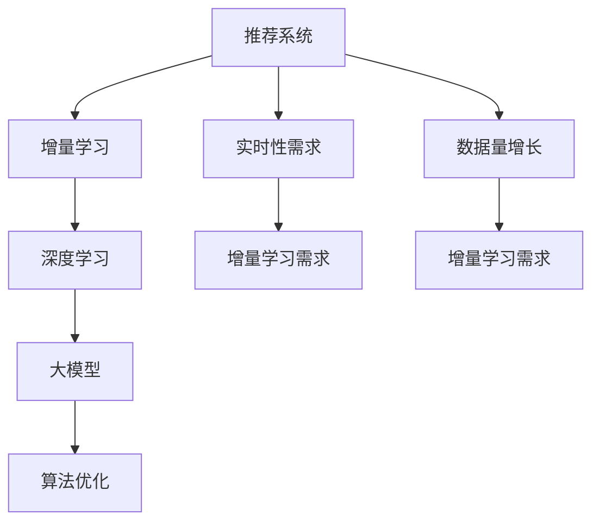

                 

# 大模型推荐系统的增量学习策略

> 关键词：推荐系统,增量学习,深度学习,大模型,在线学习,算法优化

## 1. 背景介绍

### 1.1 问题由来

推荐系统是人工智能在实际应用中取得巨大成功的典型代表之一。通过分析用户的兴趣和行为，推荐系统能够个性化推荐用户可能感兴趣的商品、内容、服务，极大地提升了用户体验和满意度。然而，在推荐系统的发展过程中，也面临诸多挑战。

随着用户数据的不断增长和业务需求的不断变化，推荐系统需要持续学习和适应新数据，以便及时更新推荐策略，保持推荐效果。传统推荐系统往往基于静态模型进行推荐，一旦模型部署完成，就无法动态更新，难以满足实时性要求。与此同时，推荐系统的数据量呈爆炸式增长，动辄亿级别，传统模型往往需要处理海量数据，计算和存储压力巨大，难以应对。

为了应对这些挑战，增量学习(Incremental Learning)技术应运而生。增量学习也称为在线学习(Online Learning)，是一种能够动态更新模型，逐步适应新数据的机器学习范式。在推荐系统中，增量学习技术通过持续学习用户行为数据，不断更新推荐策略，使得推荐系统能够实时更新，提升推荐效果和用户满意度。

## 2. 核心概念与联系

### 2.1 核心概念概述

为更好地理解基于增量学习的推荐系统，本节将介绍几个关键概念：

- 推荐系统(Recommender System)：基于用户的历史行为数据，分析用户的兴趣和偏好，推荐潜在感兴趣的内容、商品、服务等。推荐系统已经成为电子商务、社交媒体、视频流等众多领域的基础技术。
- 增量学习(Incremental Learning)：机器学习模型能够逐步适应新数据，动态更新自身参数，无需重新训练的在线学习范式。增量学习是推荐系统面对实时性和可扩展性挑战的解决方案。
- 深度学习(Deep Learning)：一种基于人工神经网络(ANN)的机器学习方法，通过多层次的特征抽象，提升模型对复杂数据的处理能力。深度学习已经成为推荐系统中主流的建模方法。
- 大模型(Large Model)：具有亿级别参数规模的深度神经网络模型，如BERT、GPT等。大模型能够处理海量数据，具备更强的特征提取能力，成为推荐系统中的热门选择。
- 算法优化(Algorithm Optimization)：对推荐算法进行优化的过程，以提升模型的准确性和运行效率。算法优化通常包括超参数调整、模型裁剪、分布式训练等技术手段。

这些核心概念之间的逻辑关系可以通过以下Mermaid流程图来展示：



这个流程图展示了一个典型的推荐系统增量学习流程：

1. 推荐系统需要满足实时性需求，逐步适应新数据。
2. 深度学习通过多层神经网络结构，提升推荐效果。
3. 大模型通过亿级别参数规模，提升特征提取能力。
4. 算法优化通过超参数调整、模型裁剪等手段，提升模型性能和运行效率。

这些核心概念共同构成了推荐系统增量学习的基本框架，使其能够在实时性和可扩展性要求下，实现高效推荐。

## 3. 核心算法原理 & 具体操作步骤
### 3.1 算法原理概述

基于增量学习的推荐系统，其核心思想是：利用在线学习范式，逐步适应新数据，不断更新推荐模型。假设当前推荐模型为 $M_{\theta}$，其中 $\theta$ 为模型参数。假设第 $t$ 个时间步(timestep)，新加入的数据为 $D_t$，则推荐模型的增量学习过程为：

$$
\theta_{t+1} = \theta_t + \eta \sum_{i=1}^t \nabla_{\theta} \ell(D_i, M_{\theta})
$$

其中 $\eta$ 为学习率，$\ell$ 为损失函数，$\nabla_{\theta}$ 为梯度，$D_i$ 为第 $i$ 个时间步加入的数据。

在推荐系统中，假设推荐任务为商品推荐，目标函数为交叉熵损失函数：

$$
\ell(D_i, M_{\theta}) = -\frac{1}{|D_i|} \sum_{x \in D_i} y\log M_{\theta}(x) + (1-y)\log (1-M_{\theta}(x))
$$

其中 $y$ 为标签，$x$ 为特征，$M_{\theta}(x)$ 为模型预测概率。

### 3.2 算法步骤详解

基于增量学习的推荐系统主要包括以下几个关键步骤：

**Step 1: 准备增量数据**
- 收集推荐系统用户行为数据 $D_t$，通常以事件流的形式存储，包含用户行为的时间、用户id、商品id、点击行为、购买行为等。
- 划分训练集 $D_{train}$ 和验证集 $D_{valid}$，通常为时序化数据，训练集用于模型优化，验证集用于模型评估。

**Step 2: 初始化模型**
- 选择预训练的深度神经网络模型，如BERT、XLM等，作为推荐模型的初始化参数。
- 根据推荐任务，设计合适的输出层和损失函数。

**Step 3: 执行增量训练**
- 将新加入的数据 $D_t$ 逐步加入模型训练，更新模型参数 $\theta_t$。
- 按照设定的时间间隔，在验证集 $D_{valid}$ 上评估模型效果，根据评估结果调整学习率等超参数。
- 重复执行步骤2和3，直至新数据不再加入。

**Step 4: 模型优化与部署**
- 根据评估结果，对模型进行优化调整，如超参数调整、模型裁剪等。
- 将优化后的模型应用于生产环境，进行实时推荐。

### 3.3 算法优缺点

基于增量学习的推荐系统具有以下优点：
1. 实时性高。通过逐步更新模型，推荐系统能够实时响应用户行为，提升推荐效果。
2. 计算效率高。增量学习仅需处理新数据，无需重复训练模型，计算效率高。
3. 可扩展性好。推荐系统可以处理海量数据，适应数据量增长。

同时，该方法也存在一定的局限性：
1. 模型收敛性差。增量学习需要持续更新模型，容易产生累积误差，模型收敛性较差。
2. 学习率敏感。增量学习的学习率选择复杂，过小容易导致收敛缓慢，过大则可能导致过拟合。
3. 数据质量要求高。新加入的数据需满足一定的质量要求，以保证模型性能。
4. 模型结构复杂。增量学习需要设计复杂的更新策略，如批处理、异步更新等，增加了模型设计的复杂度。

尽管存在这些局限性，但就目前而言，增量学习范式仍是推荐系统中的主流技术。未来相关研究的重点在于如何进一步提高增量学习的收敛性、学习率自适应能力以及数据质量控制。

### 3.4 算法应用领域

基于增量学习的推荐系统已经在多个领域得到了广泛应用，如电商推荐、内容推荐、广告推荐等。以下是具体的应用场景：

- 电商推荐：通过分析用户的浏览历史、点击行为、购买记录等，推荐用户可能感兴趣的商品。电商推荐系统实时性要求高，增量学习能够动态更新推荐策略，提升推荐效果。
- 内容推荐：根据用户的历史阅读记录、评分数据，推荐用户可能感兴趣的文章、视频等。内容推荐系统数据量庞大，增量学习能够有效处理海量数据，提升推荐精度。
- 广告推荐：通过分析用户的搜索记录、浏览网页行为等，推荐用户可能感兴趣的广告。广告推荐系统需要高实时性，增量学习能够实时响应用户行为，快速更新推荐策略。

## 4. 数学模型和公式 & 详细讲解 & 举例说明
### 4.1 数学模型构建

在推荐系统中，通常使用深度学习模型进行建模。假设推荐任务为商品推荐，特征 $x$ 为商品id，标签 $y$ 为购买行为。则推荐模型的增量学习过程可以表示为：

假设 $M_{\theta}$ 为预训练的神经网络模型，其输出为商品推荐的概率分布，损失函数为交叉熵损失。

**Step 1: 模型训练**

假设当前模型参数为 $\theta$，加入第 $t$ 批数据 $(x_t, y_t)$，则模型更新过程为：

$$
\theta_{t+1} = \theta_t - \eta \nabla_{\theta} \ell(x_t, y_t, M_{\theta})
$$

其中，$\ell(x_t, y_t, M_{\theta})$ 为交叉熵损失函数，$\eta$ 为学习率。

**Step 2: 模型评估**

假设验证集为 $D_{valid}$，验证集上交叉熵损失为 $\mathcal{L}_{valid}$，则模型评估过程为：

$$
\mathcal{L}_{valid} = -\frac{1}{N} \sum_{(x, y) \in D_{valid}} y\log M_{\theta}(x) + (1-y)\log (1-M_{\theta}(x))
$$

其中 $N$ 为验证集样本数。

### 4.2 公式推导过程

以下我们以深度神经网络模型为例，推导增量学习的数学公式。

假设当前推荐模型为深度神经网络 $M_{\theta}$，特征 $x$ 为商品id，标签 $y$ 为购买行为。则推荐模型的输出为：

$$
M_{\theta}(x) = \sigma(\sum_{i=1}^k \alpha_i \sigma(W_{i-1}(x) + b_{i-1})) 
$$

其中 $\sigma$ 为激活函数，$W_{i-1}$ 为权重矩阵，$b_{i-1}$ 为偏置项，$k$ 为层数。

对于第 $t$ 批数据 $(x_t, y_t)$，其增量学习的目标为最小化交叉熵损失：

$$
\ell(x_t, y_t, M_{\theta}) = -y_t\log M_{\theta}(x_t) + (1-y_t)\log (1-M_{\theta}(x_t))
$$

则模型参数的更新公式为：

$$
\theta_{t+1} = \theta_t - \eta \nabla_{\theta} \ell(x_t, y_t, M_{\theta})
$$

其中 $\nabla_{\theta} \ell(x_t, y_t, M_{\theta})$ 为损失函数对模型参数的梯度，可利用自动微分技术计算。

在得到模型参数的更新公式后，即可带入模型评估公式，完成模型评估过程。重复上述过程直至模型收敛。

### 4.3 案例分析与讲解

下面以电商推荐系统为例，解释增量学习的具体应用。

假设电商推荐系统接收用户的行为数据流 $D_t = \{(x_i, y_i)\}_{i=1}^N$，其中 $x_i$ 为商品id，$y_i$ 为购买行为。系统需要选择预训练的深度神经网络模型 $M_{\theta}$，并设计合适的输出层和损失函数。

假设模型采用BERT作为基础模型，输出层为全连接层，损失函数为交叉熵损失。则系统增量学习的流程如下：

**Step 1: 模型训练**

1. 随机初始化BERT模型参数。
2. 接收数据流 $D_t$，每接收一批数据 $(x_t, y_t)$，计算损失函数，更新模型参数。
3. 在验证集 $D_{valid}$ 上评估模型性能，调整超参数。

**Step 2: 模型评估**

1. 在验证集 $D_{valid}$ 上，评估模型的交叉熵损失 $\mathcal{L}_{valid}$。
2. 根据 $\mathcal{L}_{valid}$，调整学习率 $\eta$，更新模型参数。
3. 在测试集 $D_{test}$ 上，评估模型的推荐效果，反馈到训练环节，优化模型。

通过以上步骤，电商推荐系统能够实时响应用户行为，动态更新推荐策略，提升推荐效果。

## 5. 项目实践：代码实例和详细解释说明
### 5.1 开发环境搭建

在进行增量学习实践前，我们需要准备好开发环境。以下是使用Python进行PyTorch开发的环境配置流程：

1. 安装Anaconda：从官网下载并安装Anaconda，用于创建独立的Python环境。

2. 创建并激活虚拟环境：
```bash
conda create -n pytorch-env python=3.8 
conda activate pytorch-env
```

3. 安装PyTorch：根据CUDA版本，从官网获取对应的安装命令。例如：
```bash
conda install pytorch torchvision torchaudio cudatoolkit=11.1 -c pytorch -c conda-forge
```

4. 安装其他依赖包：
```bash
pip install numpy pandas scikit-learn torchdistributions torchmetrics
```

完成上述步骤后，即可在`pytorch-env`环境中开始增量学习实践。

### 5.2 源代码详细实现

下面我们以深度神经网络模型为推荐系统进行增量学习的PyTorch代码实现。

首先，定义增量学习的函数：

```python
import torch
import torch.nn as nn
import torch.optim as optim
from torch.utils.data import DataLoader

def incremental_learning(model, dataset, batch_size, num_epochs, learning_rate, verbose=False):
    criterion = nn.BCELoss()
    optimizer = optim.Adam(model.parameters(), lr=learning_rate)

    for epoch in range(num_epochs):
        running_loss = 0.0
        for i, (x, y) in enumerate(DataLoader(dataset, batch_size=batch_size, shuffle=True)):
            x, y = x.to(device), y.to(device)

            optimizer.zero_grad()
            output = model(x)
            loss = criterion(output, y)
            loss.backward()
            optimizer.step()

            running_loss += loss.item()
            
        if verbose:
            print(f"Epoch {epoch+1}, loss: {running_loss/len(dataset):.3f}")
```

然后，定义模型和数据集：

```python
import torch.nn as nn
import torch.nn.functional as F

class DNN(nn.Module):
    def __init__(self, input_dim, hidden_dim, output_dim):
        super(DNN, self).__init__()
        self.fc1 = nn.Linear(input_dim, hidden_dim)
        self.fc2 = nn.Linear(hidden_dim, hidden_dim)
        self.fc3 = nn.Linear(hidden_dim, output_dim)
        self.dropout = nn.Dropout(0.2)
        
    def forward(self, x):
        x = F.relu(self.fc1(x))
        x = self.dropout(x)
        x = F.relu(self.fc2(x))
        x = self.dropout(x)
        x = self.fc3(x)
        return x

input_dim = 10  # 商品id
hidden_dim = 5
output_dim = 1

model = DNN(input_dim, hidden_dim, output_dim).to(device)
model.train()

dataset = # 将数据集加载进DNN模型中
```

接着，调用增量学习函数：

```python
device = torch.device('cuda') if torch.cuda.is_available() else torch.device('cpu')
num_epochs = 10
learning_rate = 0.001
batch_size = 32

incremental_learning(model, dataset, batch_size, num_epochs, learning_rate, verbose=True)
```

最后，进行模型评估：

```python
model.eval()

with torch.no_grad():
    output = model(x)
    loss = criterion(output, y)
    print(f"Test loss: {loss:.3f}")
```

以上就是使用PyTorch对DNN模型进行增量学习的完整代码实现。可以看到，增量学习的过程是通过前向传播和反向传播不断更新模型参数，以最小化损失函数，提升模型效果。

### 5.3 代码解读与分析

让我们再详细解读一下关键代码的实现细节：

**incremental_learning函数**：
- 该函数用于实现增量学习的核心逻辑，接收模型、数据集、超参数等输入，进行增量学习。
- 在每个epoch内，对每个批次的输入进行前向传播和反向传播，更新模型参数。
- 在每个epoch末尾，输出该epoch的平均损失，并调整学习率。

**DNN模型**：
- 该模型为简单的深度神经网络，包括三层全连接层和两个dropout层。通过设置不同的超参数，可以适应不同推荐任务的需求。
- 在训练过程中，模型参数会动态更新，以最小化损失函数。

**数据集**：
- 数据集应为时序化数据，如用户行为数据流。可以通过PyTorch的DataLoader自动批处理数据，方便模型训练。

**超参数调整**：
- 在学习率、批大小、epoch等超参数的设置上，需要根据具体任务进行调整。通常学习率应该设置较小的值，以保证模型能够平稳收敛。

**模型评估**：
- 在训练完成后，应在新数据上评估模型效果，使用测试集进行验证，确保模型泛化能力强。

通过以上代码的实现，可以看出增量学习的流程相对简单，但具体实现时仍需注意数据的准备和超参数的设置，以确保模型能够稳定收敛，取得良好的推荐效果。

## 6. 实际应用场景
### 6.1 电商推荐

电商推荐系统是增量学习技术的重要应用场景之一。通过实时处理用户行为数据，电商推荐系统能够动态更新推荐策略，提升推荐效果。具体来说，电商推荐系统可以实现以下功能：

- 实时推荐：电商推荐系统能够实时响应用户的行为，如点击、浏览、购买等，动态生成推荐列表。
- 个性化推荐：通过分析用户的历史行为数据，电商推荐系统能够生成个性化的推荐内容，提升用户体验。
- 实时反馈：电商推荐系统能够及时根据用户的反馈数据，动态调整推荐策略，提升推荐效果。

### 6.2 内容推荐

内容推荐系统是增量学习的另一个典型应用场景。通过实时处理用户的行为数据，内容推荐系统能够动态更新推荐策略，提升推荐效果。具体来说，内容推荐系统可以实现以下功能：

- 实时推荐：内容推荐系统能够实时响应用户的行为，如点击、阅读、分享等，动态生成推荐内容。
- 个性化推荐：通过分析用户的历史行为数据，内容推荐系统能够生成个性化的推荐内容，提升用户体验。
- 实时反馈：内容推荐系统能够及时根据用户的反馈数据，动态调整推荐策略，提升推荐效果。

### 6.3 广告推荐

广告推荐系统是增量学习的另一个典型应用场景。通过实时处理用户的行为数据，广告推荐系统能够动态更新推荐策略，提升广告点击率。具体来说，广告推荐系统可以实现以下功能：

- 实时推荐：广告推荐系统能够实时响应用户的行为，如点击、浏览、广告展示等，动态生成广告推荐。
- 个性化推荐：通过分析用户的历史行为数据，广告推荐系统能够生成个性化的广告推荐，提升广告效果。
- 实时反馈：广告推荐系统能够及时根据用户的反馈数据，动态调整广告策略，提升广告效果。

## 7. 工具和资源推荐
### 7.1 学习资源推荐

为了帮助开发者系统掌握增量学习的理论基础和实践技巧，这里推荐一些优质的学习资源：

1. 《深度学习与推荐系统》课程：来自斯坦福大学的经典推荐系统课程，涵盖推荐系统的基本概念、建模方法和评估指标。
2. 《在线学习与增量学习》论文：来自Cornell大学的经典增量学习综述，介绍增量学习的基本原理、算法和应用。
3. 《Recommender Systems in the Age of Deep Learning》书籍：从深度学习角度介绍推荐系统，详细讲解增量学习等前沿技术。
4. 《Practical Recommendation Engines in Python》书籍：使用Python实现推荐系统的实战指南，详细讲解增量学习等技术。
5. PyTorch官方文档：提供详细的PyTorch使用指南，包括数据预处理、模型训练、模型评估等实用技巧。

通过对这些资源的学习实践，相信你一定能够快速掌握增量学习的精髓，并用于解决实际的推荐系统问题。

### 7.2 开发工具推荐

高效的开发离不开优秀的工具支持。以下是几款用于增量学习开发的常用工具：

1. PyTorch：基于Python的开源深度学习框架，灵活动态的计算图，适合快速迭代研究。大部分的深度学习模型都有PyTorch版本的实现。
2. TensorFlow：由Google主导开发的开源深度学习框架，生产部署方便，适合大规模工程应用。同样有丰富的深度学习模型资源。
3. HuggingFace Transformers库：用于自然语言处理任务的深度学习模型库，支持PyTorch和TensorFlow，包含多种预训练模型和增量学习算法。
4. Dask：用于大规模分布式计算的工具，支持大规模数据处理和模型训练，适合增量学习等任务。
5. Apache Spark：用于大数据处理的开源框架，支持分布式训练和增量学习。

合理利用这些工具，可以显著提升增量学习任务的开发效率，加快创新迭代的步伐。

### 7.3 相关论文推荐

增量学习技术在推荐系统中已经得到广泛应用，以下是几篇奠基性的相关论文，推荐阅读：

1. Stochastic Gradient Descent: Tricks of the Trade（NIPS 2015）：介绍梯度下降算法的优化技巧，为增量学习提供了理论基础。
2. Incremental Online Learning: A New Revisit of the Best-of-A-Squared-Root-of-n Algorithm（JMLR 2010）：介绍增量学习的基本算法，为增量学习提供了算法思路。
3. Learning to Rank: A Data-Driven Approach（JMLR 2007）：介绍排序学习算法，为增量学习提供了新的应用方向。
4. Adaptive Incremental Training of Deep Neural Networks（CVPR 2017）：介绍适应性增量训练算法，为增量学习提供了新的优化方法。
5. Online Learning of Continuous Word Representations（NeurIPS 2015）：介绍在线学习算法在词嵌入中的应用，为增量学习提供了新的应用场景。

这些论文代表了大模型增量学习技术的发展脉络。通过学习这些前沿成果，可以帮助研究者把握学科前进方向，激发更多的创新灵感。

## 8. 总结：未来发展趋势与挑战
### 8.1 总结

本文对基于增量学习的推荐系统进行了全面系统的介绍。首先阐述了增量学习在推荐系统中的应用背景和意义，明确了增量学习在实时性和可扩展性方面的独特价值。其次，从原理到实践，详细讲解了增量学习的数学原理和关键步骤，给出了增量学习任务开发的完整代码实例。同时，本文还广泛探讨了增量学习方法在电商推荐、内容推荐、广告推荐等多个行业领域的应用前景，展示了增量学习技术的巨大潜力。此外，本文精选了增量学习的各类学习资源，力求为读者提供全方位的技术指引。

通过本文的系统梳理，可以看到，基于增量学习的推荐系统正在成为推荐系统中的重要范式，极大地拓展了深度学习模型的应用边界，催生了更多的落地场景。受益于大规模语料的预训练和增量学习技术的广泛应用，推荐系统必将在实时性、个性化推荐、广告效果等方面取得新的突破，带来更加优质的用户体验和更高的业务价值。

### 8.2 未来发展趋势

展望未来，增量学习技术将在推荐系统中呈现以下几个发展趋势：

1. 模型规模持续增大。随着算力成本的下降和数据规模的扩张，深度学习模型的参数量还将持续增长。超大规模模型能够处理海量数据，提升推荐效果和系统鲁棒性。
2. 增量学习范式日趋多样。除了传统的在线学习，未来会涌现更多增量学习范式，如微增量学习、分布式增量学习等，提高推荐系统的可扩展性和实时性。
3. 学习率自适应能力增强。学习率自适应算法能够根据数据变化自动调整学习率，提高增量学习算法的稳定性和收敛性。
4. 数据质量控制更加严格。增量学习需要处理的数据质量更高，需要更加严格的数据清洗和异常检测机制，以提高推荐效果。
5. 推荐算法多样化。推荐算法会更多地引入深度学习、强化学习、因果推理等技术，提升推荐系统的效果和鲁棒性。

以上趋势凸显了增量学习技术在推荐系统中的广阔前景。这些方向的探索发展，必将进一步提升推荐系统的性能和应用范围，为用户的个性化推荐提供更优质的体验。

### 8.3 面临的挑战

尽管增量学习技术已经取得了显著进展，但在迈向更加智能化、普适化应用的过程中，仍面临诸多挑战：

1. 数据分布变化。随着用户行为的不断变化，数据分布可能会发生较大变化，增量学习需要持续适应新数据分布，以保持推荐效果。
2. 模型复杂度增加。深度学习模型的结构复杂，参数量大，增量学习需要处理更复杂的模型更新策略，增加了算法设计的难度。
3. 实时性要求高。增量学习需要实时更新模型，计算资源消耗大，如何在保证实时性的同时，提高计算效率，仍需进一步研究。
4. 超参数调优困难。增量学习需要频繁调整超参数，以适应不同数据集和任务的需求，如何自动调优超参数，仍需进一步探索。

尽管存在这些挑战，但随着增量学习技术的不断成熟，其在推荐系统中的应用将更加广泛。相信在学界和产业界的共同努力下，增量学习技术必将成为推荐系统中的重要范式，推动推荐系统的智能化进程。

### 8.4 研究展望

面对增量学习技术面临的挑战，未来的研究需要在以下几个方面寻求新的突破：

1. 探索新的增量学习算法。开发更高效的增量学习算法，提高推荐系统的实时性和稳定性。
2. 引入更多的先验知识。将符号化的先验知识，如知识图谱、逻辑规则等，与增量学习算法进行结合，提升推荐系统的泛化能力。
3. 融合多模态数据。将视觉、语音、文本等多模态数据进行协同建模，提升推荐系统的表现力。
4. 增强模型可解释性。通过因果分析、博弈论等方法，增强推荐系统的可解释性，使用户能够理解推荐依据，增强用户信任。
5. 优化模型分布式训练。通过分布式训练技术，提高增量学习算法的计算效率，适应大规模数据处理需求。

这些研究方向的探索，必将引领增量学习技术迈向更高的台阶，为推荐系统提供更优质的推荐服务。面向未来，增量学习技术需要与其他人工智能技术进行更深入的融合，共同推动推荐系统的智能化进程。只有勇于创新、敢于突破，才能不断拓展增量学习技术的边界，提升推荐系统的性能和应用范围。

## 9. 附录：常见问题与解答

**Q1：增量学习与传统的批量学习有何区别？**

A: 传统的批量学习(Batch Learning)通常需要一次性处理整个数据集，对数据进行离线训练，学习率等超参数的设置相对简单。而增量学习(Online Learning)则是逐步处理数据集，每次只处理一小批数据，在线更新模型参数，学习率等超参数的设置需要根据具体情况进行调整。因此，增量学习能够实时适应新数据，适合动态数据处理场景。

**Q2：增量学习如何处理新数据？**

A: 增量学习通常采用小批量增量训练(Batch Incremental Training)的方式处理新数据。每次接收到新数据，将其划分成小批量数据，逐步加入模型训练，更新模型参数。此外，增量学习还可以采用增量采样(Incremental Sampling)等方法，进一步提高模型效果。

**Q3：增量学习中的学习率如何选择？**

A: 增量学习的学习率设置相对复杂，一般建议从较小的值开始，逐步增大，以保证模型能够平稳收敛。根据数据分布和任务需求，可以采用动态学习率自适应算法，如Adaptive Learning Rate等，进一步提高增量学习算法的稳定性。

**Q4：增量学习如何避免过拟合？**

A: 增量学习容易产生累积误差，模型可能过拟合新数据。为避免过拟合，可以采用正则化技术，如L2正则、Dropout等，限制模型复杂度。此外，可以通过引入对抗训练、数据增强等方法，提升模型泛化能力。

**Q5：增量学习中的模型裁剪如何实现？**

A: 模型裁剪(Model Pruning)是指通过剪枝等技术，去除模型中不必要的参数，减小模型尺寸，提升计算效率。增量学习中的模型裁剪可以在训练过程中逐步进行，每次更新模型参数时，选择部分参数进行裁剪。此外，还可以采用知识蒸馏等技术，进一步提高模型压缩效果。

**Q6：增量学习中的分布式训练如何实现？**

A: 分布式训练是指在多个计算节点上同时训练模型，提高计算效率。增量学习中的分布式训练通常采用参数服务器(Parameter Server)等架构，将模型参数分布在多个节点上，并行更新模型参数。此外，还可以采用数据并行(Data Parallelism)等方法，进一步提高计算效率。

通过以上常见问题的解答，相信你对增量学习的理解会更加深入。增量学习作为推荐系统中的重要范式，具有广泛的应用前景。希望本文的介绍和分析，能够为你提供有益的参考，助力你在增量学习领域的探索和实践。

---

作者：禅与计算机程序设计艺术 / Zen and the Art of Computer Programming

